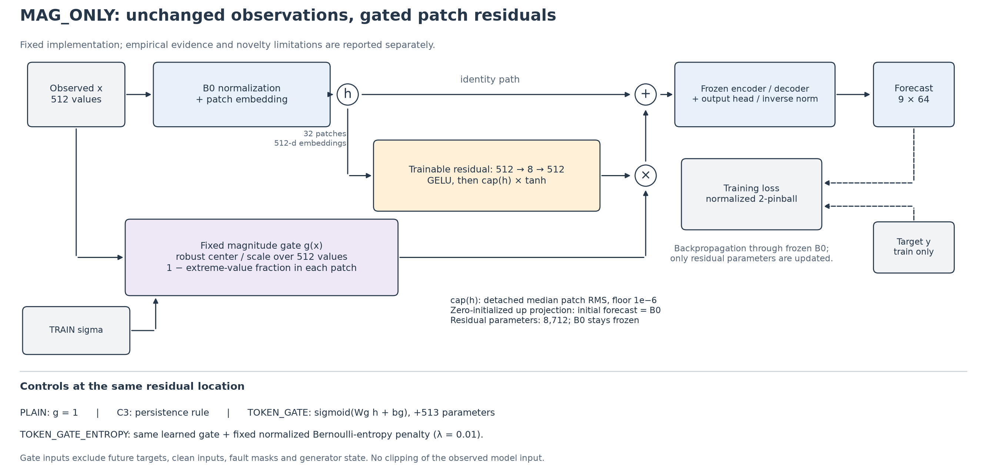
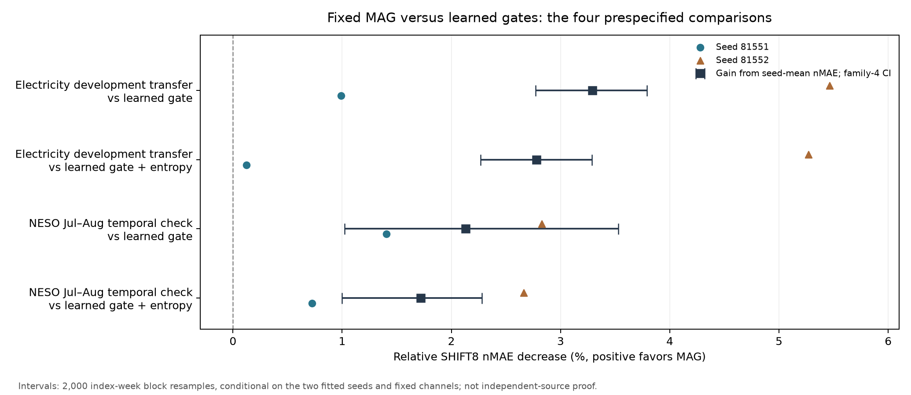
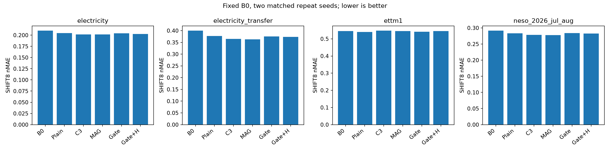

# 관측 진폭으로 추가 잔차를 제한하는 시계열 파라미터 효율 적응

**한국어 방법론 원고 v1 · 2026-09-19 · 내부 검토본**

저자·소속·투고처는 미정이다. 본 원고는 완료된 실험에 근거한 방법 기술이며, 투고 준비 완료나 방법론 신규성 확보를 선언하지 않는다. 추가 PETSA 부품 비교는 준비 상태로만 기록하며 결과에 포함하지 않았다.

## 초록

잘 학습된 시계열 예측기에 작은 잔차 모듈을 더할 때, 추가 학습이 모든 입력 구간에 동일하게 유리하지 않을 수 있다. 본 연구는 기존 예측기의 관측 입력과 가중치를 유지하면서, 관측창의 robust 진폭 통계로 추가 patch 잔차를 제한하는 MAG 설계를 검토한다. 고정 gate는 중앙값과 MAD 기반 scale에 비해 극단적인 관측의 patch 내 비율을 계산한다. 잔차는 8,712개 파라미터의 bottleneck 모듈이며, 출력층의 영 초기화로 학습 시작 시 기존 예측과 정확히 일치한다. Chronos-Bolt-small을 기반으로 일반 잔차와 두 학습형 embedding gate를 동일한 학습·검증 기회에서 비교했다. 큰 합성 지속 변화인 SHIFT8에서 MAG는 일반 잔차보다 전력 16계열 전이에서 3.794%, 사전 고정한 NESO 후반 기간에서 1.941% 낮은 정규화 절대오차를 보였다. 두 학습형 gate 대비 이득도 두 공통 seed에서 양수였다. 그러나 ETTm1에서는 검증이 추가 적응을 선택하지 않았고, 원자료·오류 조건과 긴 변화 형태에서 손해가 남았다. 결과는 관측 진폭에 따른 추가 잔차 제한의 조건부 유용성을 지지한다. 모든 gating 방법에 대한 우위, 실제 오류와 변화의 식별, 충분한 신규성 또는 독립 원천 일반화를 입증하지는 않는다.

## 1. 서론

파라미터 효율 적응은 기반 모델의 많은 가중치를 공유하면서 작은 학습 모듈로 과제에 적응하는 접근이다. [Houlsby 등](https://proceedings.mlr.press/v97/houlsby19a.html)의 adapter와 [Hu 등](https://arxiv.org/abs/2106.09685)의 LoRA는 이 접근의 대표적인 선행이다. 이미 적응한 예측기가 있는 상황에서는 새 모듈 자체의 성능보다, 그 예측기를 출발점으로 추가 비용이 어떤 이득과 손해를 만드는지가 중요하다.

본 연구의 출발점 B0는 원래 입력을 유지하는 합성 증강으로 LoRA를 학습한 Chronos-Bolt-small이다. 우리는 B0의 출력을 대체하는 새 예측기를 설계하지 않고, B0 내부에 작은 추가 잔차를 학습하는 문제를 다룬다. 설계 가설은 관측창에서 극단적인 구간의 추가 잔차를 제한하면 일부 큰 변화 조건에서 불필요한 보정을 줄일 수 있다는 것이다. 이 가설은 최종 오차를 항상 줄인다는 보장이 아니며, 관측한 이득의 유일한 인과기전으로 확정하지 않는다.

제안 설계는 원래 관측을 clipping하지 않는다. 극단값이 실제 지속 변화에서 비롯되었을 가능성을 남겨 둔 채, 이미 학습된 B0 경로는 유지하고 새 잔차의 적용 강도만 조절한다. gate는 평가 정답이나 합성 상태를 읽지 않는다. 원래 관측을 남겼다는 사실과 최종 예측이 보존된다는 보장은 다르며, 후자는 실험에서 별도로 확인해야 한다.

이 원고의 기여 범위는 세 가지다. 첫째, 관측만으로 계산하는 고정 진폭 gate와 작은 내부 잔차를 결합한 실행 가능한 적응 설계를 명세한다. 둘째, 같은 B0에서 일반 잔차 및 두 학습형 gate와의 직접 비교로 추가 가치를 정량화한다. 셋째, 부정 조건과 비용, 자료 재사용 이력을 함께 제시해 효과가 확인된 범위를 제한한다. gating이나 bottleneck adapter 자체의 최초성은 기여로 주장하지 않는다. MAG를 연구 후보로 남기기로 한 결정은 기존 개발 E를 본 뒤 이루어졌다는 점을 공개한다.

## 2. 관련 연구와 구체적 차이

[Time-PEFT 공개 코드](https://github.com/kaist-dmlab/TimePEFT/blob/ea4e7e1887bb35587bab7ea93e2af3685ac55852/run.py)는 MOMENT encoder 뒤의 주파수·채널별 adapter와 head·LoRA를 학습한다. MAG는 이미 학습한 Chronos B0를 동결하고 attention 이전의 추가 잔차만 학습한다. backbone과 학습 대상이 다르므로 현재 결과를 Time-PEFT 전체에 대한 우위로 해석하지 않는다. 공식 ChannelAdapter의 채널별 파라미터와 다른 채널 값의 직접 혼합도 구분한다. 코드와 CPU 검사에서는 해당 adapter가 다른 채널의 값을 직접 섞지 않았다.

[GateRA](https://arxiv.org/html/2511.17582v1)는 입력 표현에 따른 PEFT 조절을 제안했다. 본 연구의 TOKEN_GATE 및 TOKEN_GATE_ENTROPY는 그 원리에서 착안한 additive residual 대조이며, 공식 HiRA 구조와 NLP 실험의 전체 재현은 아니다. [PETSA](https://arxiv.org/html/2506.23424v1)도 저랭크 입력·출력 보정과 gating을 사용하며 부분 또는 지연 정답으로 온라인 갱신한다. 따라서 작은 보정 모듈이나 입력 의존 gating의 존재만으로 신규성을 주장할 수 없다.

본 연구의 구체적인 차이는 raw 관측 경로의 보존, 고정 robust-statistic gate, 내부 patch 잔차 제한의 조합이다. 이 차이가 충분한 방법론 기여인지는 가까운 선행의 실제 비교와 함께 판단해야 한다. 현재 δ-Adapter의 공개 XY cell과 gate 원리를 통제 이식한 비교는 완료했지만, Time-PEFT·GateRA·PETSA 전체 방법의 공정한 재현을 완료한 것은 아니다. 공식 코드 버전과 검사 범위는 공개 부록의 선행 호환성 감사에 기록한다.

## 3. 방법

### 3.1 문제와 기반 예측기

입력은 과거 512개 관측, 출력은 미래 64개 시점의 0.1–0.9 분위수 9개다. B0는 [Chronos-Bolt-small](https://huggingface.co/amazon/chronos-bolt-small)에 q/v rank8 LoRA로 적응한 source·seed별 모델이다. LoRA의 기존 학습 파라미터는 294,912개다. 추가 단계에서는 이 가중치와 기반 모델을 모두 동결한다. 이하의 파라미터 수는 B0를 만드는 비용을 제외한 추가 비용이다.

원래 instance normalization, 길이16의 patching, patch embedding과 출력 역정규화를 유지한다. 입력의 32개 patch embedding을 $h_j\in\mathbb R^{512}$라 한다. 모든 채널은 같은 추가 모듈을 사용해 각각 예측한다. 추가 모듈을 학습하는 역전파는 동결된 encoder와 decoder를 통과한다. 가중치 동결이 역전파 계산의 제거를 뜻하지 않는다.

*그림 1. 고정 gate는 관측만 읽고, 학습되는 작은 잔차의 patch별 강도를 제한한다. 원래 B0와 입력을 유지한다. 그림의 학습형 gate는 설명 대조이며 제안 gate 자체에는 학습 파라미터가 없다.*

### 3.2 관측 진폭 gate

관측창 x의 중앙값과 robust scale을 다음과 같이 계산한다.

$$m(x)=\operatorname{median}_t x_t,\qquad s(x)=\max\{1.4826\operatorname{median}_t|x_t-m(x)|,\;0.1\sigma_{\mathrm{TRAIN}}\}.$$

$\sigma_{\mathrm{TRAIN}}$은 각 계열의 사전 고정 학습 구간 population 표준편차다. patch $P_j$에서 robust 절댓값이3을 초과하는 비율을 이용해

$$g_j(x)=1-\frac{1}{16}\sum_{t\in P_j}\mathbf 1\left[\frac{|x_t-m(x)|}{s(x)}>3\right]$$

으로 정의한다. $0\le g_j\le1$이며, threshold3과 scale floor0.1은 결과를 본 뒤 변경하지 않았다. 구현은 두 중앙값에 quantile(0.5)을 사용한다. gate는 깨끗한 원본 x₀, 생성 상태, 오류 위치, 참 변화량, 미래 정답을 받지 않는다. 생성기의 변형 진폭을 정하는 scale과 모델이 변형 후 관측에서 다시 계산하는 scale을 구분한다.

### 3.3 추가 잔차와 초기화

학습되는 잔차는 다음과 같다.

$$a_\theta(h_j)=c(h)\tanh\!\left(W_u\operatorname{GELU}(W_dh_j+b_d)+b_u\right),\qquad h'_j=h_j+g_j(x)a_\theta(h_j).$$

$W_d$와 $W_u$의 차원은 각각 8×512, 512×8이다. c(h)는 원래 patch embedding의 RMS들의 중앙값을 최소10⁻⁶으로 제한한 값이며 stop-gradient를 적용한다. 파라미터 수는 512×8+8+8×512+512=8,712개다. $W_u$와 $b_u$를0으로 초기화하므로 최초 예측은 B0와 정확히 같다. h′는 B0의 동결된 후속 계산을 거쳐 분위수 예측을 만든다.

| 단계 | 학습·추론 시 계산 | 정답 권한 |
| --- | --- | --- |
| 1 | 관측512개와 고정 TRAIN sigma로 gate 계산 | 미래 접근 없음 |
| 2 | B0의 기존 정규화·patch embedding 계산 | 미래 접근 없음 |
| 3 | 추가 잔차를 gate로 곱해 원래 embedding에 더함 | 미래 접근 없음 |
| 4 | 동결된 encoder/decoder/head 및 역정규화로 예측 | 미래 접근 없음 |
| 5 | TRAIN에서만 loss를 계산하고 잔차 가중치 갱신 | 학습 정답만 사용 |

각 좌표의 잔차 절댓값은 $g_jc(h)$ 이하이다. 이는 수식에서 직접 나오는 국소적인 bound이며 새로운 예측오차 정리로 제시하지 않는다. gate가0인 patch 자체는 보존되지만, 다른 patch가 attention을 통해 영향을 줄 수 있으므로 최종 예측 불변을 보장하지 않는다. 전체 gradient norm 감소나 오류 감소도 이 bound만으로 보장되지 않는다.

### 3.4 손실과 대조군

추가 잔차는 모든 batch·분위수·예측 시점에 대해 평균한 normalized 2-pinball loss로 학습한다.

$$\mathcal L=\operatorname{mean}_{i,q,h}\frac{2\rho_q(y_{i,h}-\hat y_{i,q,h})}{\sigma_{\mathrm{TRAIN},i}},\qquad \rho_q(e)=\max(qe,(q-1)e).$$

PLAIN은 같은 잔차에 g=1을 사용한다. TOKEN_GATE는 원래 attention 이전 embedding에서 $\operatorname{sigmoid}(W_gh_j+b_g)$를 계산한다. TOKEN_GATE_ENTROPY는 같은 구조의 손실에 평균 Bernoulli entropy/log2의0.01배를 더한다. 검증 목적에는 entropy를 넣지 않는다. 두 대조는 gate weight/bias0, 즉 초기 gate0.5이며 추가513개, 총9,225개 파라미터를 학습한다. 초기 잔차는 공통으로0이다.

MAG는 전체 관측의 robust 통계를 읽고 학습형 gate는 patch embedding을 읽는다. 같은 관측 권한과 같은 정보 표현은 다르다. 초기 gate도 다르므로 이 비교는 두 전체 설계의 대조이며 “학습하지 않음” 하나의 인과효과를 분리하지 않는다. 과거 C3는 연속성 규칙을 추가한 설명 대조로 보존하며 현재 기여로 재튜닝하지 않는다.

## 4. 실험 설계

### 4.1 자료와 평가 노출

@@PANELS@@

Electricity의 원본 시간표가 없어 날짜는24관측의 index-day로 정의했다. ETTm1은 15분 간격이다. 따라서 입력512/예측64는 각각 약512시간/64시간과128시간/16시간에 대응한다. 같은 관측 수가 같은 실제 시간 범위를 뜻하지 않는다. 전력 전이16계열은 현재 B0 학습4계열과 다르지만 과거 노출이 있는 같은 원천 자료다.

원천별 TRAIN256/V64/E128 distinct days를 사용하며 TRAIN256일×4채널이 각 epoch의1024예시를 이룬다. 채널·합성 draw·seed를 독립 날짜로 세지 않는다. NESO는 기존 다운로드 파일의 사전 고정한55개 완전한 UTC origin 날짜를 사용했다. 첫 origin은2026-07-01 03:00, 마지막은2026-08-24 21:00 UTC다. 평가 이전의 H1 target과는 겹치지 않지만, 합법적인 과거 문맥은 이전 기간과 겹칠 수 있다. 55일의3520 target slots에는1378개 고유 시점이 있으며 최대4회 중복된다. 이 기간은 당시 프로젝트 기록상 미채점 시간 전이였으나 같은 제공자의 자료이고 원본 파일도 이미 내려받았다. 독립 원천·전 세계적으로 미노출된 자료라고 부르지 않는다.

### 4.2 합성 조건과 학습 기회

측정 오류는 입력만 바꾸며 미래 정답을 바꾸지 않는다. 지속 변화는 과거 말미와 미래 정답을 같은 방향으로 바꾼다. 평가 POINT는2개 위치, BURST는8개 연속 관측에 변형을 가하고 각각 진폭4/8/16을 사용한다. SHIFT4/SHIFT8은 과거 마지막32개 관측과 미래에 robust scale의4/8배 변화량을 더한다. SHIFT_POINT는 SHIFT4와 진폭8의 점 오류를 결합한다. FAULT는6개 POINT/BURST 조건의 동일 가중 평균이다.

TRAIN의 고정 생성 일정에는 REFERENCE/POINT/BURST/SHIFT가 균형 있게 등장한다. 오류 진폭4/8/16과 변화 진폭4/8이 겹치며, 변화의 과거 길이는24/48이다. 모든 군은 같은 저장 draws와 labels를 사용했다. 여기에 실제 센서 사건 레이블은 없다. 추가8개 형태와 PULSE의 동일과거 대조를 포함한9개 평가 view도 보존한다. 같은 과거에서 미래만 다른 조건의 구별을 모델에 요구하지 않는다.

selection seed81550에서 LR10⁻⁴/3×10⁻⁴를 비교하고, 선택 LR을81551/81552에서 반복한다. 각 fit은32epochs×32updates=1024updates, batch/micro32, FP32, TF32 off, dropout0이다. AdamW는 betas(0.9,0.999), eps10⁻⁸, weight decay0, gradient clip1을 사용한다. checkpoint0/256/512/768/1024를 저장하고 V의 REFERENCE/POINT8/BURST8/SHIFT4/SHIFT8 평균 nMAE로 선택한다. 동률이면 작은 LR, 이른 step을 고른다. 선택 과정은 E를 읽지 않는다.

두 새 gate군은2원천×2군×(선택2+반복2)=16fits, 16,384 main+8 smoke updates를 완료했다. MAG/PLAIN/B0와 C3의 기존 동일 학습·선택 기록과 가중치는 hash로 재사용했다. 재사용을 전체 연구의 학습 비용0으로 계산하지 않는다. 총192 prediction views,158개 고유 배열을 평가했으며80개 새 checkpoint와476,136개 원점별 metric을 독립 검산했다. 모든 모델 선택을 고정하고 새 전체 예측을 저장한 뒤 정답을 채점했다.

### 4.3 지표와 불확실성

주지표 nMAE는 median 예측의 절대오차를 계열별 고정 TRAIN sigma로 나눈 평균이다. 조건 내 두 합성 draw, 원점, 채널, 두 seed를 정해진 방식으로 평균한다. 이득은100×(1−MAG nMAE/대조 nMAE)로 정의하며, seed별 이득을 먼저 평균한 값과 구분한다. raw MAE와 pinball도 보조 표에 공개한다.

주 비교는 전력 전이와 NESO 후반 각각에서 MAG 대 두 학습형 gate의 selected SHIFT8, 총4개다. index7일 block bootstrap2000회와 family4 Bonferroni 양측95%구간을 사용한다. 사전의 제한된 추가 가치 기준은 네 구간 하한>0, 각 비교의 두seed 이득>0, 두패널 REFERENCE/FAULT에서 B0/PLAIN 대비 평균 악화≤1%이다. 마지막 기준은 평균 손해 한도이며 신뢰구간 기반 비열등성이 아니다. 두seed·고정채널에 조건부인 구간이며, 전체 연구의 후보 탐색이나 seed 모집단 불확실성을 보정하지 않는다.

## 5. 결과

### 5.1 학습된 B0 위의 추가 가치

@@RAW_SHIFT8@@

*표 2. 두 반복 seed를 평균한 selected SHIFT8 nMAE. 낮을수록 좋다. 서로 다른 패널 점수를 합쳐 우승자를 만들지 않는다.*

전력 전이에서 MAG의 B0 대비 이득은9.186%, PLAIN 대비는3.794%다. NESO 후반에서는 각각4.626%,1.941%다. 일반 잔차의 효과와 MAG의 추가 효과를 분리해야 한다. B0 대비 전체 이득을 gate 하나의 기여로 해석하지 않는다.

### 5.2 학습형 gate와 직접 비교

@@PRIMARY@@

*표 3. 양수는 MAG 이득. 괄호는 네 주 비교에 보정한 구간이다. 개별 seed도 모두 양수지만 전력 전이의 entropy 대조 대비 첫 seed 이득은 약0.123%로 작다.*

*그림 2. 큰 점은 seed-mean nMAE로 계산한 이득, 선은 family4 보정구간, 작은 표식은 두 개별 seed다. 날짜 block의 불확실성과 seed 모집단의 불확실성을 혼동하지 않는다.*

사전에 정한 제한된 구성요소 기준은 충족했다. selected가 아닌 고정1024updates에서도 네 비교의 MAG 이득 방향은 양수였다. 따라서 관찰한 이득을 checkpoint 선택 하나로만 설명하기 어렵다. 그러나 gate 특징, 초기값, 학습 궤적의 영향을 각각 식별한 결과는 아니다.

### 5.3 원자료·오류·다른 변화의 손해

@@PROTECTION@@

*표 4. REFERENCE/FAULT에서 MAG의 이득(%); 음수는 손해다. B0와 PLAIN 대비 각각 보고한다.*

두 패널에서 평균 악화는 모두1% 이내지만, NESO의 B0 대비 REFERENCE와FAULT 일반95%구간 하한은 각각 약−1.036%,−1.056%다. “95% 신뢰에서 손해가1% 이하”라는 비열등성은 입증되지 않았다. 큰 SHIFT8 이득과 원자료·오류 손해는 별개의 목표로 남긴다.

@@NEGATIVE@@

*표 5. ETTm1과 긴 변화 형태의 원점수 및 손해. 좋은 조건만 선택하지 않고 음의 효과를 함께 남겼다.*

ETTm1에서는 MAG의 두 selected checkpoint가 모두0이어서 B0와 같은 예측을 한다. 이는 실행 실패가 아니라 검증 선택이 추가 적응을 채택하지 않은 경우다. 이때 SHIFT8에서 PLAIN보다 약0.95% 나쁘다. 전력 전이의 긴 STEP12_D63에서도 MAG는 B0보다 약3.27%, PLAIN보다 약2.65% 나쁘다. SHIFT4와 일부 SHIFT_POINT에서는 추가 이득이 작거나 seed 방향이 혼재한다. 평가 형태·계열·seed를 이 결과 때문에 제외하지 않았다.

*그림 3. 같은 두 반복 seed의 패널별 원점수. ETTm1의 부정 결과를 포함한다. 패널마다 축과 오차 규모가 다르므로 막대 높이로 자료 간 난이도를 직접 비교하지 않는다.*

### 5.4 과거 대조와 비용

기존 δ XY cell 비교의 전력 전이 SHIFT8에서 MAG는 근접 파라미터 예산과 기본폭 대조보다 각각8.364%,8.730% 낮은 nMAE를 보였다. 이는 공식 부품을 이식한 비교이며 전체 δ 방법 우위는 아니다. 과거 C3의 연속성 규칙은 MAG보다 독립적인 추가 가치가 확립되지 않았으므로 현재 설명을 “지속성을 알아내서 개선했다”로 바꾸지 않는다. 해당 실험과 이전 세 번째 seed·ETTm2 결과는 별도의 과거 증거로 링크하며, 이번 두seed MAG 대조에 존재하지 않는 반복을 포함하지 않는다.

@@RESOURCES@@

*표 6. 추가 파라미터 수와 새 gate군의 receipt 평균. GPU peak는 fit별 최대 allocated memory의 평균이며 전체 시스템 메모리가 아니다. 기존 MAG와 측정 시점·timer 경계가 다르므로 계산 속도비를 주장하지 않는다.*

MAG의 추가8,712개와 학습형 gate의9,225개 사이에는513개 차이가 있다. 같은 B0 비용을 공유하며, 가중치 동결에도 역전파는 남는다. 과거 MAG timer와 이번 gate timer의 intent 저장 포함 여부가 달라 순수 계산 시간의 공정 비교는 미완료다.

## 6. 논의와 한계

관측 진폭은 극단적인 patch의 추가 잔차 강도를 결정하는 유용한 입력 신호가 될 수 있다. 현재 증거는 큰 합성 변화에서의 설계 전체의 효과를 지지하며, 고정 gate가 항상 학습형 gate보다 좋다는 결론은 지지하지 않는다. 특정 gate가 같은 입력에서 어떤 방향의 예측 변화를 유도하는지와, 그 gate 아래에서 학습된 가중치가 유리한지는 서로 다른 문제다.

방법의 출발점이 강한 B0라는 점도 해석에 포함해야 한다. 학습되지 않은 backbone부터 동일한 총비용으로 시작하는 비교가 아니므로, 추가 parameter 수만으로 전체 적응 비용 우위를 주장할 수 없다. 이 실험은 “기존 B0를 유지할 때 추가 잔차 제한이 무엇을 더하는가”에 답한다.

평가 범위는 한 backbone, 두 학습 원천, 두 공통 반복 seed, 합성 오류·변화다. NESO의 시간 전이는 보강 근거이지만 같은 자료 원천에서 이루어졌고, 짧은 약8주에 target overlap도 존재한다. MAG의 사후 후보 선택과 여러 과거 개발 평가 노출이 남아 있다. 별도 신규성 검토와 가까운 정식 선행 전체 비교가 부족하다. PETSA 부품 비교는 CPU 연결까지 준비됐으나 본학습0회이며, 이 원고에는 그 성능을 넣지 않았다. 그 비교를 나중에 수행하더라도 이미 노출된 E를 새 독립 검증이라고 부를 수 없다.

## 7. 결론

본 연구는 관측값을 보존하는 동결 B0 위에서, robust 진폭 통계로 작은 추가 잔차를 제한하는 MAG 설계를 명세하고 직접 비교했다. 큰 합성 지속 변화의 전력 계열 전이와 고정된 NESO 시간 구간에서 일반 잔차·두 학습형 gate 대비 추가 이득을 확인했다. 동시에 ETTm1, 원자료·오류, 긴 변화의 손해를 보존했다. 이 결과는 제한된 상황에서의 구체적 적응 설계를 뒷받침하지만, 범용 PEFT 우위나 충분한 방법론 신규성을 확정하지 않는다.

## 부록 A. 공개 근거와 재현

모든 원점수·선택·예산·코드 hash는 원 실험 보고서를 우선한다. 본 원고 생성에는 새 모델 추론·학습·bootstrap을 사용하지 않았다. 표는 공개 CSV에서 다시 집계하며, 그림은 hash로 검증한 기존 그림을 사용한다. 전체 원점별 배열·checkpoint·raw 자료는 로컬 캐시에 있어 공개 GitHub만으로 모든 실험을 즉시 재생할 수 있다고 주장하지 않는다.

- [학습형 gate 비교의 전체 REPORT](../../../results/learned_gate_comparison_20260919/REPORT.md), [검산](../../../results/learned_gate_comparison_20260919/AUDIT.json), [모든 seed·조건의 원점수](tables/all_raw_scores.csv).
- [수식·정보 권한과 원 구현](../magnitude_method_20260919/METHOD_SECTION_KO.md), [학습 기회·표현의 차이 감사](../../../research/learned_gate_comparability_20260919/COMPARABILITY_KO.md).
- [δ 공개부품 비교](../../../results/delta_adapter_comparison_20260919/REPORT.md), [기존 C3 후속 및 세 번째 seed·ETTm2](../../../results/additive_persistence_validation_v1_20260917/REPORT.md).
- [공식 선행 호환성 감사](../../../research/method_baseline_compatibility_20260919/BASELINE_COMPATIBILITY_KO.md), [PETSA 준비 상태—성능 결과 아님](../../../results/petsa_cell_comparison_20260919/PREPARATION_KO.md).
- [전체 주 비교 seed 값](tables/primary.csv), [보호조건의 점수와 구간](tables/protection.csv), [모든 변화 형태](tables/all_shape_scores.csv), [선택 checkpoint](tables/model_selection.json).

기존 학습·평가 계약과 결과를 바꾸지 않았으며, 이 원고의 작성 자체를 방법론 목표 달성으로 표시하지 않는다.

## 참고문헌 및 공식 구현

1. Houlsby, N., et al. (2019). [Parameter-Efficient Transfer Learning for NLP](https://proceedings.mlr.press/v97/houlsby19a.html). ICML, PMLR97,2790–2799.
2. Hu, E. J., et al. (2021). [LoRA: Low-Rank Adaptation of Large Language Models](https://arxiv.org/abs/2106.09685). arXiv:2106.09685.
3. Ou, J., Jiang, S., Du, Y., and Snoek, C. G. M. (2025). [GateRA: Token-Aware Modulation for Parameter-Efficient Fine-Tuning](https://arxiv.org/abs/2511.17582). 본 연구의 수식 검토본은v1이며 출판판은AAAI2026이다.
4. Medeiros, H. R., Sharifi-Noghabi, H., Oliveira, G. L., and Irandoust, S. (2025). [Accurate Parameter-Efficient Test-Time Adaptation for Time Series Forecasting](https://arxiv.org/abs/2506.23424). ICML2025 PUT workshop, arXiv:2506.23424. [검토한 공식 코드](https://github.com/BorealisAI/PETSA/blob/87853d888e98311ac94e64be920d17b57143b20c/tta/petsa.py).
5. KAIST DMLab. [Time-PEFT 공식 구현](https://github.com/kaist-dmlab/TimePEFT/tree/ea4e7e1887bb35587bab7ea93e2af3685ac55852). 코드 인용이며 본 원고에서 공식 전체 실험을 재현했다는 뜻이 아니다.
6. Amazon. [Chronos-Bolt-small 모델 카드](https://huggingface.co/amazon/chronos-bolt-small). 실제 사용 snapshot과 파일hash는 실행 계약의 모델 receipt를 따른다.
7. Anoise. [δ-Adapter 공개 구현](https://github.com/Anoise/Adapter/tree/0add06ea7b4d2e0a84c364a8be72eef2676a92f2). 본 연구는 공개XY cell의 통제 이식 범위만 비교했다.
