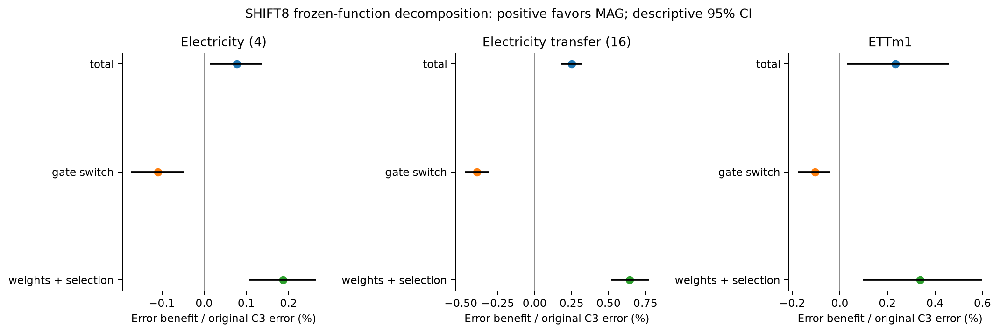

# 시계열 기초 모델의 추가 PEFT에서 관측 기반 가중의 조건부 효과

### 학습된 어댑터와 추론 규칙의 교차 분석

한국어 원고 초안 · 2026-09-18 · 근거 기준 커밋 962a15a · 저자·소속·투고처 미지정

## 초록

시계열 기초 모델에 작은 어댑터를 추가할 때 관측값에 따라 보정 강도를 제한하는 규칙은 학습과 추론에 동시에 영향을 준다. 그러나 최종 성능 비교만으로는 어떤 역할이 이득을 만들었는지 구분하기 어렵다. 본 연구는 이미 LoRA로 적응한 Chronos-Bolt-small을 동결하고, 원래 입력을 유지하는 추가 어댑터에서 관측 기반 가중의 효과를 조사한다. 입력에만 오류를 가하는 조건과 과거·미래를 일관되게 이동시키는 합성 수준 변화 조건을 구분하고, 일반 어댑터, 정적 위치 가중, 크기 기반 가중 및 출력 보정과 비교한다. 같은 방향의 큰 관측이 최근 구간에 모인 정도를 사용하는 C3는 전력 전이 16계열의 SHIFT8에서 일반 어댑터보다 정규화 평균 절대 오차를 2.399% 줄였으나, 연속성을 사용하지 않는 크기 기반 대조보다 0.252% 나빴다. 저장 가중치와 추론 규칙을 교차 적용한 사후 진단에서는 C3 가중치의 규칙만 크기 기반으로 바꾸면 오차가 0.543% 증가한 반면, C3 규칙 아래 가중치만 크기 기반 학습 결과로 바꾸면 0.493% 감소했다. 즉 이 사례에서는 최종 성능 순위와 고정 가중치에서의 규칙 효과가 다른 방향을 보였다. 다만 순이득의 85.4%가 한 seed의 signed 기여였고, ETT 및 원자료·오류 조건에서는 손해도 나타났다. 본 연구는 특정 합성 변화에서의 추가 PEFT 이득과 그 해석의 한계를 제시하며, 재사용 개발 평가와 고정 함수 진단을 새로운 독립 검증이나 범용 방법 우위로 해석하지 않는다.

**핵심어:** 시계열 기초 모델, 파라미터 효율적 적응, 잔차 어댑터, 관측 기반 가중, 학습–추론 분해

## 1. 서론

파라미터 효율적 적응(PEFT)은 사전학습된 모델의 대부분을 유지하면서 제한된 수의 파라미터를 학습한다. 작은 어댑터와 저랭크 적응은 대표적인 접근이다.[1,2] 시계열에서는 적응 대상의 분포뿐 아니라 관측 오류와 실제 신호 변화가 함께 문제를 만든다. 큰 관측을 모두 제거하면 유효한 수준 변화의 정보도 약해질 수 있고, 추가 보정을 제한 없이 적용하면 원자료에서 이미 유용한 예측을 바꿀 수 있다. 이때 관측값에 따라 어댑터의 보정 강도를 조절하는 규칙이 어떤 조건에서 도움이 되는지 확인할 필요가 있다.

본 연구의 출발점은 모든 일반 어댑터가 지속 변화를 손상시킨다는 가정이 아니다. 공유 파라미터를 사용하더라도 어댑터의 수정분은 입력에 따라 다르며, 일반 어댑터만으로도 이미 적응된 모델의 성능을 개선할 수 있다. 우리가 묻는 것은 **그 추가 이득 위에서 관측 기반 가중이 무엇을 더하는가**이다. 여기서 원래 입력을 보존한다는 것은 입력을 clipping하거나 바꾸지 않는다는 뜻이며, 추가 모듈을 켠 상태의 예측 오차가 항상 보존된다는 뜻은 아니다.

최초 설계의 동기는 국소 지속성 정보를 이용한 제한이 단순한 크기 기반 제한보다 유리할 수 있다는 것이었다. 이후 직접 비교는 이 가설의 강한 형태를 지지하지 않았다. 아래의 학습–추론 교차 분석은 이 결과를 본 뒤 추가한 진단이며, 그 역전 현상을 처음부터 예측한 가설처럼 제시하지 않는다.

같은 규칙을 학습과 추론에 적용하는 비교에는 두 가지 효과가 결합된다. 첫째, 규칙은 어댑터가 학습하는 경로를 바꿀 수 있다. 둘째, 완성된 어댑터의 출력을 추론 시점에 다르게 가중한다. 따라서 한 규칙으로 학습하고 평가한 모델이 더 좋다는 사실만으로 그 추론 규칙 자체가 더 좋다고 결론내릴 수 없다. 우리는 완료된 직접 비교를 먼저 제시하고, 이후 가중치와 규칙을 교차한 사후 진단으로 이 차이를 살펴본다.

본 연구의 기여는 다음 세 가지로 한정한다.

1. 동결된 LoRA 모델 위의 동일 크기 어댑터를 중심으로, 위치·관측 크기·국소 지속성·출력 보정의 설명력을 비교하고 합성 변화에서의 이득과 원자료·오류의 손해를 함께 보고한다.
2. C3와 크기 기반 대조의 저장 가중치 및 추론 규칙을 교차하여, 최종 성능 차이와 고정 가중치에서의 규칙 효과가 반대 방향으로 나타나는 사례를 확인한다.
3. 규칙 차이가 발생하는 입력 위치, seed와 계열의 민감도, 평가 조건의 식별 한계를 연결해 결과 해석의 범위를 명시한다.

어댑터·gate·0 출력 초기화 자체의 최초성, 모든 PEFT 방법에 대한 우위, 실제 센서 사건 해결은 이 기여에 포함하지 않는다. 이 원고의 중심은 PEFT 구성요소에 대한 통제 실증이다.

## 2. 관련 연구와 비교 범위

Houlsby 등은 기반 모델을 고정하고 작은 어댑터를 학습하는 전이 학습을 제시했고, LoRA는 저랭크 파라미터로 적응하는 접근을 제시했다.[1,2] UniPELT는 여러 PEFT 모듈의 사용을 gate로 조절한다.[3] 따라서 작은 잔차 모듈을 추가하거나 gate를 사용하는 원리만으로 본 연구의 신규성을 주장하지 않는다. 우리의 C2는 일반적인 추가 용량을, C3와 다른 가중 규칙은 그 용량을 관측에 따라 어떻게 제한하는지를 조사하는 구현이다.

시계열의 TAFAS와 COSA는 도착한 정답을 이용하는 테스트 시점 적응과 관련된다.[4,5] 특히 COSA는 동결 예측기의 출력에 문맥 기반 잔차 보정을 적용한다. 우리의 OUTPUT_CONTEXT는 이러한 출력 보정 원리에서 동기를 얻었지만 source TRAIN에서 학습하고 평가 중에는 갱신하지 않는다. 따라서 공식 COSA 또는 TAFAS의 온라인 절차를 재현한 기준선으로 부르거나 원 논문의 성능 수치와 직접 순위화하지 않는다.

Time-PEFT는 시계열 기초 모델의 시간 및 다채널 특성을 고려하는 관련 PEFT 연구다.[6] 공개 구현의 MOMENT 설정과 본 연구의 Chronos-Bolt 설정은 다르다. 본 원고에는 Time-PEFT 전체의 동일 정보·모델·예산 재현이 없으며 그 방법에 대한 우위를 주장하지 않는다. Chronos-Bolt의 실제 사용 모델은 공식 모델 카드와 로컬에 고정한 파일 해시로 특정한다.[7]

반복적인 모델 선택과 평가에는 선택 편향이 남을 수 있다.[8] 본 연구는 연구 이력에서 이미 사용한 구간을 개발 평가로 명시하고, 뒤에 추가한 대조와 진단을 처음부터 독립적으로 계획한 하나의 시험처럼 서술하지 않는다.

## 3. 문제 설정과 추가 적응

### 3.1 기준 모델과 정보 권한

문맥 길이512, 예측 길이64, patch 길이16인 Chronos-Bolt-small을 사용한다. 출력은 원래의9개 분위수(0.1–0.9)다. B0는 관측 입력과 고정된 합성 증강으로 LoRA를 학습한 모델이며, 평가에서 그대로 사용하는 명칭은 C0다. LoRA의 rank는8, alpha는16이고 학습 파라미터는294,912개다. C2/C3 학습에서는 이 LoRA를 포함한 B0 전체를 동결한다.

모델과 gate가 받는 정보는 관측된 과거 x와 TRAIN 구간에서 계산한 계열별 표준편차 σ다. 합성 상태 이름, 오류 위치, 변형 전의 입력, 실제로 더한 변화량 및 미래 정답은 입력에 제공하지 않는다. 미래 정답은 학습 손실, 검증 선택, 선택 봉인 뒤 평가 채점에만 사용한다.

### 3.2 동일한 잔차 어댑터

patch 표현 hⱼ에 다음 잔차를 더한다.

> δθ(hⱼ, x) = c(x) tanh(Wᵤ GELU(W_d hⱼ + b_d) + bᵤ),
>
> h′ⱼ = hⱼ + gⱼ(x) δθ(hⱼ, x).

bottleneck 차원은8, 표현 차원은512이며 총8,712개 파라미터를 학습한다. c(x)는 patch 표현의 RMS 중앙값에 하한을 두고 gradient를 차단한 값이다. 출력층을0으로 초기화하므로 시작 예측은 B0와 같고, 추가 모듈을 끄면 학습 후에도 B0로 돌아간다. 이 복원 성질은 모듈을 켠 상태에서의 무손해 보장이 아니다. 배포 시에는 원래 LoRA도 유지되므로 적응 파라미터의 합은303,624개다.

### 3.3 C3와 크기 기반 대조

관측 문맥의 중앙값 m과 강건 척도 r = max(1.4826 median|x−m|, 0.1σ)로 dₜ = (xₜ−m)/r을 정의하고, Iₜ = 1[|dₜ|>3]으로 둔다. C3는 현재 관측까지 최대8개 관측 중 현재와 같은 부호의 extreme 비율에 Iₜ를 곱해 pₜ를 계산한다. 문맥 앞부분에서는 실제 가용 관측 수를 분모로 쓴다. pₜ는 엄밀한 연속 길이 자체가 아니라 짧은 창의 같은 부호 점유율이다.

> C3: gⱼ = 1 − mean(pₜ : t가 patch j에 속함)
>
> MAG_ONLY: gⱼ = 1 − mean(Iₜ : t가 patch j에 속함)
>
> C2: gⱼ = 1

두 규칙 모두 원래 x와 B0의 정규화를 유지한다. MAG_ONLY는 연속성을 계산하지 않고 큰 값의 비율만 사용한다. 규칙은 θ와 독립적이므로 국소 Jacobian에는 ∂h′ⱼ/∂θ = gⱼ ∂δθ/∂θ가 나타난다. 이는 gate가 학습 경로와 추론 보정에 모두 관여할 수 있는 수학적 경로를 보여준다. 실제로 어떤 gradient가 성능 차이를 만들었는지를 이 식만으로 입증하지는 않는다.

### 3.4 설명 대조

POS_ONLY는 입력값을 보지 않는32개 위치 계수의 sigmoid와 같은 어댑터를 사용한다. 총8,744개 파라미터이며 위치 계수 학습률은0.01로 고정한다. MAG_ONLY는 C3와 같은8,712개 파라미터를 학습한다. OUTPUT_CONTEXT는 B0의64개 중앙 분위수 예측과 관측512개를8구간으로 나눈 평균을, 같은 문맥 정규화 좌표에서 받아64차원 선형 잔차와 scalar gate를 학습한다. 총4,673개 파라미터이고 모든 분위수에 같은 보정을 더하므로 분위수 간격은 바꾸지 못한다.

기존 MEAN·ROTATE16·RECENCY 대조도 보존한다. RECENCY는 C3에서 계산한 gate 값들을 정렬하므로 지속성 정보를 완전히 제거한 대조가 아니다. POS_ONLY와 MAG_ONLY가 각각 입력별 값 사용과 연속성 계산의 필요성을 별도로 묻는다.

## 4. 실험 설계와 연구 이력

### 4.1 데이터와 입력 상태

중심 비교는 Electricity source4계열, 같은 자료의 전이16계열, ETTm1 4계열이다. source TRAIN256일·V64일·E128일을 기간 전체에 분산해 선택하고, 날짜 안의 위상도 분산했다. ETTm2 및 NESO의 기존 결과는 자료 전이 범위를 보여주는 보조 근거로 보고한다.

Electricity/ETT의 E는 반복 사용한 개발 구간이다. 전이16계열은 동일 원천·동일 시기의 다른 채널이며 새 독립 데이터셋이 아니다. 이 중4계열의 과거 노출이 확인됐고12계열은 불명이다. NESO2026 H1은 해당 평가 당시 프로젝트 기록에서 이전 사용 흔적이 없던 새 기간이지만 같은 국가 집계계열의 시간 전이이며, 이미 관찰한 결과와 연구 선택 이력을 가진 후속 원고에서는 이를 새로운 독립 원천으로 부르지 않는다.

REFERENCE는 원자료다. POINT/BURST는 입력만 변형하고 정답은 바꾸지 않는다. SHIFT4/SHIFT8은 과거 최근 구간과 미래에 일관된 수준 변화를 더한다. SHIFT_POINT는 변화와 입력 오류가 결합된 조건이다. 기존 step 길이·ramp·pulse의9개 평가 형태도 유지한다. 실제 센서 오류나 실제 regime change 레이블은 없으며, 합성 개입의 통제성이 현실의 사건 타당성을 대신하지 않는다. 표준 평가의 SHIFT4/8은 변형 전 과거에서 계산한 강건 척도의4배/8배 크기를 부호와 함께 최근32개 관측 및 미래64개 정답에 더한다. 생성기가 사용하는 이 척도와 변화량은 모델에 전달하지 않으며, gate는 변형 후 관측에서 자체 척도를 다시 계산한다. POINT는2개 위치, BURST는8개 연속 위치에 영향을 준다. 구체적인 생성 코드와 고정 원점은 부모 명세로 연결한다.

### 4.2 학습·선택·평가

추가 대조는 같은 TRAIN·합성 draws·정답 노출·손실·학습 기회를 사용했다. source별 기본1,024문맥, 유효 batch32, 32epochs로1,024 updates를 수행한다. FP32, TF32 off, dropout0, AdamW와 gradient norm 제한1을 사용한다. 손실은 TRAIN σ로 정규화한9개 분위수의 twice-pinball 평균이다.

선택용 seed81550에서 두 학습률(10⁻⁴, 3×10⁻⁴)을 비교하고, 선택 학습률을 반복 seed81551/52/53에 고정한다. checkpoint0/256/512/768/1024 중 V의 REFERENCE/POINT8/BURST8/SHIFT4/SHIFT8 동등가중 nMAE로 선택한다. 선택이0인 경우도 보존한다. 전체 선택을 고정한 뒤 E 예측을 저장하고 채점했다.

세 설명 대조에는 새30개 학습 경로, 본학습30,720 updates와 폐기 smoke12 updates를 사용했다. C3와 B0는 재설계·재튜닝하지 않고 기존 가중치를 재사용했다. 그 후 C3/MAG_ONLY 차이를 본 다음 수행한 진단은 새 학습0회, 새 교차 예측36개와 기존 대각 예측36개를 사용했다. 이 두 단계의 발견 순서를 공개한다. 이전 C3/C2 fixed1024 분석과 현재 selected C3/MAG 분석은 서로 다른 질문이며 표에서 혼합하지 않는다.

### 4.3 지표와 통계 범위

주 지표는 계열별 TRAIN σ로 정규화한 평균 절대 오차(nMAE)다. 상대 감소율은 100×(1−새 방법의 평균 오차/대조의 평균 오차)이며 개별 원점의 백분율을 평균하지 않는다. 원단위 MAE, 분위수 손실, nRMSE 및 자원 비용은 해당 원점수 묶음에 보존한다.

날짜7일 block을 재표집한 paired bootstrap2,000회로 같은 날짜의 채널과 draw를 함께 묶는다. 구간은 고정 세 seed에 조건부이며 seed 모집단의 불확실성을 모두 반영하지 않는다. 세 설명 대조에는 패널 내3개 주 비교의 Bonferroni 구간도 보고한다. 이것은 모든 자료·조건·연구 이력의 다중성을 보정한 것이 아니다. 교차 진단의95% 구간은 사후 기술적 구간이다. CI의0 포함을 동등성 증명으로 해석하지 않는다.

## 5. 결과

### 5.1 일반 어댑터 위의 추가 이득은 조건부다

표1은 기존 selected 결과를 유지한 C3의 상대 감소율이다. 전력 전이16계열 SHIFT8에서 C3는 B0보다7.112%, 일반 C2보다2.399% 좋았다. ETTm1과 ETTm2의 C2 대비 효과는 각각−1.847%, −0.045%다. NESO의 이전·새 기간에 평균 이득이 남았지만, 이들을 독립 반복 데이터셋처럼 합산하지 않는다.

**표1. 기존 selected SHIFT8의 C3 이득(%). 양수는 C3가 좋음.**

@@HISTORICAL_TABLE@@

이 표는 범용 순위를 만드는 자료가 아니라 효과의 범위를 보여준다. 원자료·오류 조건에서 C3가 B0나 미적응 모델보다 나빠지는 경우도 보존한다. 일반 어댑터 자체의 이득을 C3만의 기여로 세지 않는다.

### 5.2 단순 대안은 지속성 설명을 제한한다

**표2. 세 설명 대조 대비 C3의 SHIFT8 감소율과 패널 내3대조 보정 구간.**

@@CONTROL_TABLE@@

전력 전이에서 C3는 POS_ONLY보다0.694%, OUTPUT_CONTEXT보다2.899% 좋았으나 MAG_ONLY보다0.252% 나빴다. 계열+날짜 보조 구간에서도 세 대조의 방향이 유지됐다. ETTm1에서는 POS_ONLY가 더 좋았으며, 출력 보정은 세 seed 모두 checkpoint0을 선택했다. 따라서 연속성 규칙이 모든 단순 대안 위에서 고유 이득을 제공한다고 주장할 수 없다.

그림1의 파란 점은 평균, 주황 ×는 개별 seed다. 검은 선은 조건부95% 구간, 회색 선은 패널 내3대조의 보정 구간이다. 양수는 C3의 이득이다. 불리한 ETTm1과 MAG_ONLY 결과도 본문에 포함한다.

### 5.3 최종 순위와 추론 규칙의 효과는 다른 방향을 보였다

C3를 최종 성능에서 앞선 MAG_ONLY가 추론 규칙 자체에서도 더 유리한지 확인하기 위해 다음2×2 진단을 수행했다.

**표3. 전력 전이 SHIFT8의 고정 가중치 × 추론 규칙. nMAE, 낮을수록 좋음.**

@@FACTORIAL_TABLE@@

C3 가중치를 유지하며 평가 규칙만 MAG_ONLY로 바꾸면 오차가0.543% 증가했다. MAG_ONLY 가중치에서도 C3 규칙에서 MAG_ONLY 규칙으로 바꾸면0.243% 증가했다. 반면 C3 규칙 아래 가중치를 MAG_ONLY 학습 결과로 바꾸면0.493% 감소했다. 이 패널에서는 MAG_ONLY의 최종 우위가 C3 추론 규칙의 열등함을 뜻하지 않는다.

A/B/C/D는 표3의 순서다. total=A−D, gate=0.5[(A−B)+(C−D)], weights=0.5[(A−C)+(B−D)]로 두 변경 순서의 평균을 계산하면 total=gate+weights다. 양수는 MAG 방향의 이득이다. interaction=A−B−C+D도 별도로 기록한다. 이 분해는 저장 함수의 오차에 대한 것이며 학습 과정의 완전한 인과 분해나 새로운 분해 이론의 제안이 아니다.

전력 전이에서는 C3의 원래 오차를 공통 분모로 한 가중치 항이+0.644%, 규칙 항이−0.393%, 합계가+0.251%였다. 앞선−0.252%는 MAG 오차가 분모여서 반대 방향의 비율 표현이다. 분모가 다른 두 값을 직접 더하지 않는다.

그림2의 양수는 MAG 방향이며 그림1과 방향 정의가 다르다. 오차 분해의 각 항을 원래 C3 오차로 나눴다. 구간도 같은 고정 분모로 표시한 사후95% 구간이다. 추론 규칙의 유용성과 학습된 가중치의 차이가 전력 SHIFT8 평균에서 상쇄되는 모습을 보인다.

### 5.4 seed와 checkpoint의 영향

전력에서는 두 방법의 학습률과 선택 단계가 세 seed 모두 같았다(3×10⁻⁴; 768/768/1024). 따라서 이 결과의 가중치 차이는 단순한 학습 길이 또는 선택 시점 차이로 설명되지 않는다. 다만 MAG 순이득의85.4%, 가중치 항의92.0%는 seed81552의 signed 기여였다. 이 seed를 제외한 두 seed의 민감도 점검값은0.0557%로 작아졌다. 공식 결과에서 seed를 제외하지 않으며, 이 숫자는 안정성이 확보됐다는 증거가 아니다.

**표4. 전력 전이의 seed별 분해. nMAE, 양수는 MAG 방향.**

@@SEED_TABLE@@

16계열 중13계열은 원래 MAG 조합, 3계열은 원래 C3 조합이 좋았다. 한 계열씩 제외한 MAG 평균 이득은0.2271–0.2868%로 방향이 유지됐다. 관찰한 범위에서는 특정 한 계열보다 seed별 학습 결과의 영향이 컸다. 이는 계열과 seed의 보편적인 중요도 순위가 아니다.

기존 기록을 추가 감사하면 seed는 하나의 원인이 아니라 B0 가중치·추가 어댑터 초기값·batch 순서가 함께 달라지는 실행 묶음이다. 같은 seed 안에서는 C3/MAG의 이 세 요소가 같음을 실제 checkpoint와 순서 재생성으로 확인했다. 따라서85.4%를 초기화의 인과 기여율로 읽을 수 없다. 주간 하나씩을 제외한 평균 MAG 이득은0.2374–0.2674%였다. 다만 seed·계열·주간은 삭제하는 자료의 양이 다르므로 이 민감도로 보편적인 요인 순위를 만들지 않는다.

별도의 사후 기술 분석에서 seed×원점×계열의 국소 오차 차이 분산을 분해하면 삼원 성분41.17%, 원점×계열33.96%가 컸고 seed 주효과는5.71%였다. 이는 평균 이득 기여율과 다른 양이다. 개별 차이가 실행과 입력 조건의 결합에 따라 달라짐을 보여주지만, B0·초기화·학습 순서 중 가장 큰 원인을 식별하지 못한다. 후자의 분리에는 각 요인을 독립적으로 통제한 학습 비교가 필요하며 본 원고에서는 수행하지 않았다. 60개 전체 조건과 계산 검사는 [영향 감사](../../../research/c3_influence_audit_20260918/REPORT.md)에 보존했다.

ETTm1에서는 seed81552의 선택 단계가 C3는1024, MAG_ONLY는0이었다. 따라서 이 자료의 가중치 항에는 추가 적응의 적용 여부가 섞여 있다. seed81551은 양쪽 모두0으로 gate를 바꿔도 예측이 같았다.

### 5.5 규칙 차이가 존재하는 입력 구간

0≤pₜ≤Iₜ이므로 두 patch gate의 차이는 mean(Iₜ−pₜ)이며 음수가 아니다. 같은 부호 extreme이8개 이상 연속한 위치에서는 최근8개 모두 해당 extreme이어서 pₜ=Iₜ=1이다. 따라서 차이는 각 extreme run의 첫7개 관측 안에만 존재할 수 있다. 이는 정의로부터 얻는 성질이며 별도의 신규성 정리로 주장하지 않는다.

89,088개 평가 입력에서 이 성질을 전수 확인했다. 전력 전이 SHIFT8에서는 gate 차이 질량의47.8%가 최근128개, 33.9%가 최근32개 관측에 있었다. 차이의 질량 비율을 예측 오차 기여 비율로 바꾸어 해석하지 않는다. 전체 입력에 원래 존재한 extreme도 포함되므로 이 구간들이 실제 사건의 시작점이라는 뜻은 아니다.

또한 이 패널의 모든 SHIFT8 입력은 마지막 extreme이 최근128개 안에 있고, 96.8%는 최대 같은 부호 run이32 이상이었다. 최근성과 긴 run이 함께 나타나므로 SHIFT8만으로 두 요인의 독립 효과를 식별하기 어렵다. 기존 형태 비교의 길이·시작 위치 변화에서도 결과가 달라졌으며, 각각이 단독 원인이라고 단정하지 않는다.

### 5.6 원자료 보존과 계산 비용의 절충

**표5. 전력 전이의 원래 두 조합. MAG 이득은 C3 오차를 분모로 계산함.**

@@TRADEOFF_TABLE@@

MAG_ONLY는 SHIFT8에서 평균적으로 좋았지만 REFERENCE와 FAULT에서는 C3보다 각각0.0331%, 0.0495% 나빴다. 교차 조합인 MAG 가중치+C3 규칙도 원래 C3 대비 REFERENCE−0.0351%, FAULT−0.0209%의 손해가 남았다. E에서 관찰한 가장 좋은 조합을 새 방법으로 채택하지 않는다.

POS_ONLY/MAG_ONLY/OUTPUT_CONTEXT의 추가 계수는 각각8,744/8,712/4,673개다. 같은 새 실험에서1,024 updates당 평균 optimizer 시간은 약33.4/34.8/17.9초였다. 출력 보정은 본체를 통과하는 추가 gradient가 필요하지 않아 학습 비용이 작지만 전체 본체의 순전파는 여전히 수행한다. 추가 계수 비율을 전체 메모리나 추론 속도의 절감률로 대체하지 않는다. 같은 RTX3080/FP32/128입력 측정과 원시 반복 시간은 자원 표에 보존했다.

그림3의 양수는 MAG 방향이다. 규칙과 가중치 항은 상태에 따라 다르며, 합성 변화의 이득을 원자료·오류의 일괄 개선으로 해석할 수 없다. 각 조건의 수치를 더해 종합 우승자를 만들지 않는다.

## 6. 논의

### 6.1 무엇을 배웠는가

첫 번째 발견은 일반 어댑터 위에서 관측 기반 가중이 추가 이득을 주는 전력 조건이 있다는 것이다. 두 번째 발견은 그 관측만으로 국소 지속성 계산의 고유 가치를 확정할 수 없다는 것이다. 단순 크기 대조의 직접 비교가 그 해석을 제한한다. 세 번째 발견은 반대로 MAG_ONLY의 최종 우위가 C3 추론 규칙의 무용함도 뜻하지 않는다는 것이다. 학습된 가중치와 추론 규칙을 구분하면 둘이 반대 방향으로 작용할 수 있다.

이 결과에서 자연스럽게 얻는 가설은 학습 시의 보정 억제와 추론 시의 관측 보호가 서로 다른 역할을 할 수 있다는 것이다. 동일한 gate가 두 단계에 모두 관여하는 현재 설계에서는 이 역할이 결합되어 있다. 그러나 본 연구는 학습과 추론 규칙을 분리한 새 방법을 검증에서 선택하고 독립 자료에서 평가한 연구가 아니다. 교차 조합의 결과는 그 질문을 제기하는 근거이며 최종 방법의 성능 주장이 아니다.

### 6.2 신규성과 PEFT 논문의 위치

연구 대상은 동결된 적응 모델 위의 소수 추가 파라미터이므로 PEFT 연구의 범위에 있다. 다만 주장할 기여는 새 gate의 범용 우위가 아니라, 구체적인 추가 PEFT에서 관측 규칙의 효과와 단순 대안의 설명력을 통제하고 학습·추론 해석을 구분한 실증이다. 일반 어댑터나 gating의 기존 원리를 새 이름으로 제시하는 것은 기여가 아니다.[1–3]

따라서 본 연구의 가치는 추가 어댑터가 언제 이득을 주는지, 그 이득을 어떤 구성요소에 귀속할 수 있는지, 무엇이 현재 자료에서 식별되지 않는지를 재현 가능한 실험으로 보여주는 데 있다. 모든 조건에서 승리하지 못했다는 이유로 확인된 이득을 지울 필요도 없고, 일부 이득을 근거로 새 방법의 보편적 우위를 주장할 수도 없다.

### 6.3 한계

첫째, 주요 E는 반복 사용한 개발 기간이고 후속 대조와 교차 진단은 이전 결과를 본 뒤 수행했다. 날짜 bootstrap과 추가 seed가 누적 선택 편향을 제거하지 않는다.[8] 둘째, 세 seed의 결과는 한 seed에 크게 좌우되어 학습 안정성을 일반화하기 어렵다. 셋째, 입력 오류와 수준 변화는 합성이며 실제 사건 레이블이 없다. 넷째, 같은 과거 입력에 서로 다른 미래를 대응시키는 pulse/shift 비교처럼 관측만으로 구분할 수 없는 조건도 있다. 다섯째, 한 backbone과 제한된 자료에서 수행했고 정식 온라인 선행의 동일 정보·갱신 절차 비교는 없다. 여섯째, 가중치 교차는 완성된 함수에 대한 진단이며 내부 gradient·표현 형성의 완전한 원인 규명은 아니다.

## 7. 결론

동결된 LoRA 예측기 위의 관측 기반 추가 어댑터는 일부 합성 전력 변화에서 일반 어댑터보다 좋은 평균 예측을 보였지만, 단순 크기 대조를 넘어서는 일관된 최종 우위는 확보하지 못했다. 동시에 고정 가중치 교차 진단에서는 C3 추론 규칙의 효과가 MAG_ONLY의 최종 우위와 반대 방향이었다. 이 결과는 추가 PEFT의 성능 차이를 해석할 때 학습된 가중치, 추론 규칙, seed 및 입력 조건을 함께 구분해야 함을 보여주는 사례다. 본 연구는 그 조건부 근거와 한계를 보고하며 범용 방법 우위나 실제 사건 해결을 주장하지 않는다.

## 참고문헌

[1] Houlsby et al. *Parameter-Efficient Transfer Learning for NLP.* ICML, 2019. [공식 논문](https://proceedings.mlr.press/v97/houlsby19a.html).

[2] Hu et al. *LoRA: Low-Rank Adaptation of Large Language Models.* arXiv:2106.09685. [저자 원문](https://arxiv.org/abs/2106.09685).

[3] Mao et al. *UniPELT: A Unified Framework for Parameter-Efficient Language Model Tuning.* ACL, 2022. [공식 논문](https://aclanthology.org/2022.acl-long.433/).

[4] Kim et al. *Battling the Non-stationarity in Time Series Forecasting via Test-time Adaptation.* AAAI, 2025. [공식 논문](https://ojs.aaai.org/index.php/AAAI/article/view/33965).

[5] Im and Kwon. *COSA: Context-aware Output-Space Adapter for Test-Time Adaptation in Time Series Forecasting.* ICLR, 2026. [공식 논문](https://proceedings.iclr.cc/paper_files/paper/2026/hash/2a8ce71baac4c89bf9ff479d8240c7d9-Abstract-Conference.html).

[6] Na et al. *Time-PEFT: Temporal and Multichannel Complexity-Based Fine-Tuning for Time-Series Foundation Models.* [공식 구현](https://github.com/kaist-dmlab/TimePEFT).

[7] Amazon. *Chronos-Bolt-small model card.* [모델 명세](https://huggingface.co/amazon/chronos-bolt-small). 실제 실행 모델은 저장소의 고정 snapshot/hash로 특정한다.

[8] Cawley and Talbot. *On Over-fitting in Model Selection and Subsequent Selection Bias in Performance Evaluation.* JMLR, 2010. [공식 논문](https://jmlr.org/papers/v11/cawley10a.html).

## 부록 A. 음성 결과와 전체 변화 형태

양수는 MAG 방향의 이득이다. 모든 형태를 포함했고 각 패널은 자체 색 범위를 쓴다. 예를 들어 전력 전이 STEP12_D17과 STEP12_D63의 방향이 달랐다. 이를 결과를 보고 주 조건을 교체할 이유로 사용하지 않는다. 개별 오류6종, 모든 seed와 계열, 빈 입력 층도 원표에 보존한다.

## 부록 B. 재현 및 자료 제공 범위

본 원고의 수치 표는 검산된 CSV에서 생성했고 출처 파일과 해시는 EVIDENCE_MANIFEST.json에 기록했다. 현재 원고 작성 단계에서는 새 학습·모델 추론·새 통계 추정을 하지 않았다. C3/MAG 진단의 실제 실행은 새36개 예측과 기존36개 재사용이며, 그 이전의 설명 대조는30개 학습 경로다. 서로 다른 단계의 view 수를 합쳐 독립 실험 수로 부르지 않는다.

동결 가중치 보존, 초기/off B0 일치, checkpoint 복원, 예측 해시, scalar 지표 및 전체 집계 재계산의 범위는 부모 검산 기록에 명시했다. 진단 과정에서 발생한 CPU 특성 추출과 집계 인덱싱 오류는 과학적 조건을 바꾸지 않고 수정했으며 원본 코드·오류·봉인을 보존했다.

코드·규약·집계 점수·그림은 공개 저장소에서 확인할 수 있다. 원자료·전체 모델 가중치·예측 캐시는 로컬의 별도 파일이므로 저장소만으로 전체 추론이 재생된다고 주장하지 않는다. 원점과 데이터 출처는 기존 DATA_MANIFEST와 공개 범위 문서에 연결되어 있다. 저자 정보, 목표 투고처, 데이터 이용 조건에 맞춘 최종 배포 및 양식 편집은 제출 전에 확정해야 한다.
