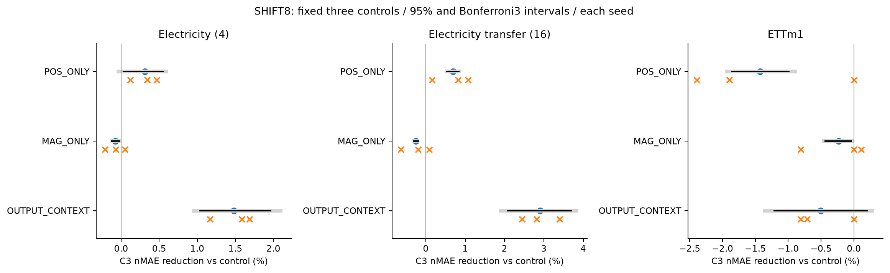
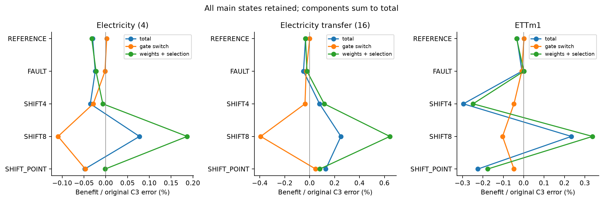
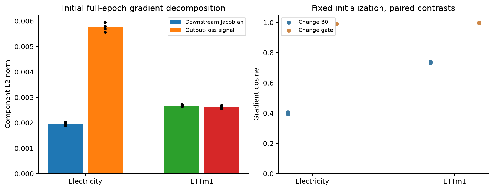
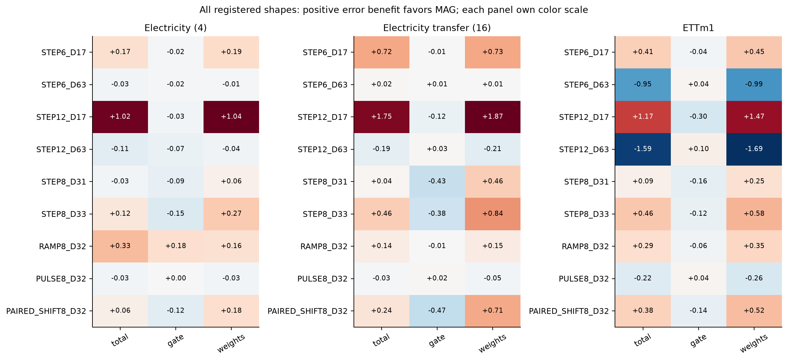
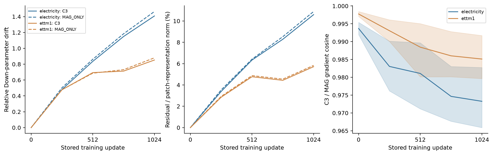
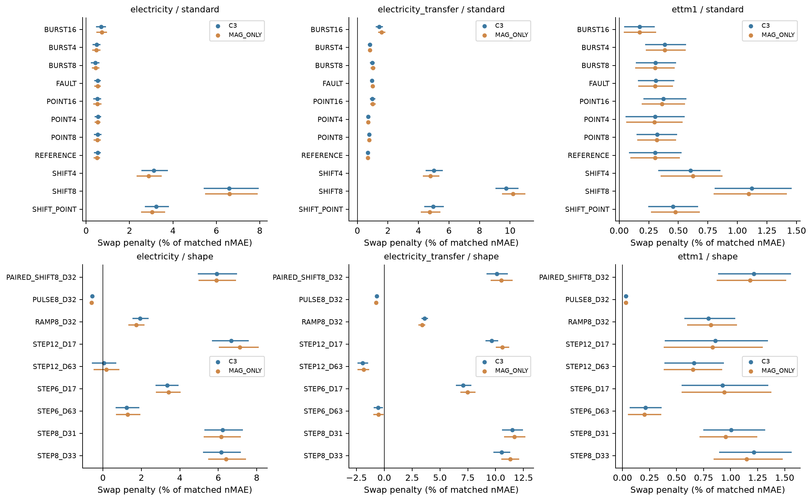

# 시계열 추가 PEFT에서 최종 성능과 관측 gate 효과의 불일치

### 학습 조건을 통제한 실증 연구

한국어 통합 원고 · 2026-09-19 · 근거 기준 커밋 7098e40 · 저자·소속·투고처 미지정

## 초록

관측값에 따라 추가 어댑터의 보정 강도를 조절하는 gate는 학습과 추론에 모두 관여한다. 이때 완성된 방법의 성능 순위가 gate 자체의 효용을 반영하는지 확인하기 위해, LoRA로 적응한 Chronos-Bolt-small을 동결하고 추가 잔차 어댑터를 비교했다. 동일 용량·정보 권한 아래 국소 지속성 가중 C3는 전력 전이16계열의 합성 수준 변화 SHIFT8에서 일반 어댑터보다 정규화 평균 절대 오차를2.399% 줄였으나, 단순 크기 기반 MAG_ONLY보다0.252% 나빴다. 반면 저장 가중치를 고정하면 두 가중치 모두에서 평균적으로 C3 추론 gate가 유리했다. 이 순위와 구성요소 효과의 불일치를 조사하기 위해 B0·추가 어댑터 초기값·배치 구성 및 순서의 두 수준을 독립적으로 통제했다. 고정1,024 updates의 방법 간 격차에서는 B0×초기값 상호작용이 가장 큰 절대 점추정이었으며, checkpoint 선택을 포함하면 B0 주효과가 가장 컸다. 추가 학습 없는 내부 진단은 같은 시작 예측에서도 초기 특징과 B0의 역전파 신호가 다른 gradient를 만드는 경로를 확인했다. 학습된 어댑터의 B0 교환은 전력 전이 SHIFT8에서 C3와 MAG_ONLY의 오차를 각각9.748%,10.199% 높였지만 일부 변화 형태에서는 반대였다. 본 연구는 최종 성능 순위만으로 관측 gate의 직접 효과를 해석하기 어려운 사례와 그 학습 조건 의존성을 보고한다. 모든 기전 분석은 이전 결과를 본 뒤 수행했고 주요 평가는 재사용 개발자료다. 범용 방법 우위, 초기화 현상의 최초 발견, 최종 성능 차이의 완전한 인과 설명은 주장하지 않는다.

**핵심어:** 시계열 기초 모델, 파라미터 효율적 적응, 관측 gate, 학습–추론 효과, 초기화, 통제 실증

## 1. 서론

파라미터 효율적 적응(PEFT)은 사전학습된 모델의 대부분을 유지하면서 제한된 수의 파라미터를 학습한다. 작은 어댑터와 저랭크 적응은 대표적인 접근이다.[1,2] 시계열에서는 적응 대상의 분포뿐 아니라 관측 오류와 실제 신호 변화가 함께 문제를 만든다. 큰 관측을 모두 제거하면 유효한 수준 변화의 정보도 약해질 수 있고, 추가 보정을 제한 없이 적용하면 원자료에서 이미 유용한 예측을 바꿀 수 있다. 이때 관측값에 따라 어댑터의 보정 강도를 조절하는 규칙이 어떤 조건에서 도움이 되는지 확인할 필요가 있다.

본 연구의 출발점은 모든 일반 어댑터가 지속 변화를 손상시킨다는 가정이 아니다. 공유 파라미터를 사용하더라도 어댑터의 수정분은 입력에 따라 다르며, 일반 어댑터만으로도 이미 적응된 모델의 성능을 개선할 수 있다. 우리가 묻는 것은 **그 추가 이득 위에서 관측 기반 가중이 무엇을 더하는가**이다. 여기서 원래 입력을 보존한다는 것은 입력을 clipping하거나 바꾸지 않는다는 뜻이며, 추가 모듈을 켠 상태의 예측 오차가 항상 보존된다는 뜻은 아니다.

최초 설계의 동기는 국소 지속성 정보를 이용한 제한이 단순한 크기 기반 제한보다 유리할 수 있다는 것이었다. 이후 직접 비교는 이 가설의 강한 형태를 지지하지 않았다. 아래의 학습–추론 교차 분석은 이 결과를 본 뒤 추가한 진단이며, 그 역전 현상을 처음부터 예측한 가설처럼 제시하지 않는다.

같은 규칙을 학습과 추론에 적용하는 비교에는 두 가지 효과가 결합된다. 첫째, 규칙은 어댑터가 학습하는 경로를 바꿀 수 있다. 둘째, 완성된 어댑터의 출력을 추론 시점에 다르게 가중한다. 따라서 한 규칙으로 학습하고 평가한 모델이 더 좋다는 사실만으로 그 추론 규칙 자체가 더 좋다고 결론내릴 수 없다. 우리는 완료된 직접 비교와 가중치×규칙 교차를 중심으로 이 차이를 살펴본다. 이어 학습 요인 분리, 초기 미분 경로, 저장 어댑터의 B0 교환으로 설명 범위를 좁힌다. 후속 분석은 같은 데이터를 다시 보며 형성한 설명이며 독립 확인 시험으로 승격하지 않는다.

본 연구의 기여는 다음 세 가지로 한정한다.

1. 동결된 LoRA 모델 위의 동일 크기 어댑터를 중심으로, 위치·관측 크기·국소 지속성·출력 보정의 설명력을 비교하고 합성 변화에서의 이득과 원자료·오류의 손해를 함께 보고한다.
2. C3와 크기 기반 대조의 저장 가중치 및 추론 규칙을 교차하여, 최종 성능 차이와 고정 가중치에서의 규칙 효과가 반대 방향으로 나타나는 사례를 확인한다.
3. 두 수준의 B0·어댑터 초기화·배치 구성 및 순서를 분리하고, 초기 gradient와 고정 가중치의 B0 교환을 통해 위 관찰의 조건 의존성을 설명한다. 국소 미분, 학습 후 함수 개입, 최종 성능을 서로 다른 추정 대상으로 구분한다.

어댑터·gate·0 출력 초기화 자체의 최초성, 모든 PEFT 방법에 대한 우위, 실제 센서 사건 해결은 이 기여에 포함하지 않는다. 이 원고의 중심은 PEFT 구성요소에 대한 통제 실증이다.

## 2. 관련 연구와 비교 범위

Houlsby 등은 기반 모델을 고정하고 작은 어댑터를 학습하는 전이 학습을 제시했고, LoRA는 저랭크 파라미터로 적응하는 접근을 제시했다.[1,2] UniPELT는 여러 PEFT 모듈의 사용을 gate로 조절한다.[3] 따라서 작은 잔차 모듈을 추가하거나 gate를 사용하는 원리만으로 본 연구의 신규성을 주장하지 않는다. 우리의 C2는 일반적인 추가 용량을, C3와 다른 가중 규칙은 그 용량을 관측에 따라 어떻게 제한하는지를 조사하는 구현이다.

시계열의 TAFAS와 COSA는 도착한 정답을 이용하는 테스트 시점 적응과 관련된다.[4,5] 특히 COSA는 동결 예측기의 출력에 문맥 기반 잔차 보정을 적용한다. 우리의 OUTPUT_CONTEXT는 이러한 출력 보정 원리에서 동기를 얻었지만 source TRAIN에서 학습하고 평가 중에는 갱신하지 않는다. 따라서 공식 COSA 또는 TAFAS의 온라인 절차를 재현한 기준선으로 부르거나 원 논문의 성능 수치와 직접 순위화하지 않는다.

Time-PEFT는 시계열 기초 모델의 시간 및 다채널 특성을 고려하는 관련 PEFT 연구다.[6] 공개 구현의 MOMENT 설정과 본 연구의 Chronos-Bolt 설정은 다르다. 본 원고에는 Time-PEFT 전체의 동일 정보·모델·예산 재현이 없으며 그 방법에 대한 우위를 주장하지 않는다. Chronos-Bolt의 실제 사용 모델은 공식 모델 카드와 로컬에 고정한 파일 해시로 특정한다.[7]

초기 예측의 동등성이 학습 동역학의 동등성을 보장하지 않는다는 점은 LoRA 초기화 연구에서 이미 다뤄졌다. Hayou 등은 초기 곱이0인 두 초기화 방식의 학습 차이를 분석했고, LoRA-GA는 첫 gradient를 full fine-tuning 방향에 맞추는 초기화를 제안했다.[9,10] 본 연구의 비선형 bottleneck 어댑터와 고정 관측 gate는 그 설정과 다르지만, 초기화가 중요하다는 일반 현상이나 chain rule을 새 발견으로 주장하지 않는다. 여기서는 관측 gate의 성능 해석을 위한 국소 진단으로 사용한다.

기반 모델 간 추가 가중치 전이도 선행 주제다. Lin 등은 모델 버전 사이의 fine-tuning update 전이와 연결성을 연구했고, Xu 등의 ReLoRA preprint는 기반 모델 변경 후 adapter 호환성 문제를 다뤘다.[11,12] 우리의 B0 교환은 같은 Chronos backbone에서 LoRA 학습 seed가 다른 두 동결 B0와 그 위에 학습한 어댑터를 교차한다. 운영 중 모델 버전 갱신 문제를 해결하거나 호환성 손해를 최초로 발견한 연구는 아니다. 선행과 구별해 조사하는 것은 이 고정된 추가 PEFT에서 최종 gate 순위, 학습 조건, 고정 함수 효과 사이의 관계다.

반복적인 모델 선택과 평가에는 선택 편향이 남을 수 있다.[8] 본 연구는 연구 이력에서 이미 사용한 구간을 개발 평가로 명시하고, 뒤에 추가한 대조와 진단을 처음부터 독립적으로 계획한 하나의 시험처럼 서술하지 않는다.

## 3. 문제 설정과 추가 적응

### 3.1 기준 모델과 정보 권한

문맥 길이512, 예측 길이64, patch 길이16인 Chronos-Bolt-small을 사용한다. 출력은 원래의9개 분위수(0.1–0.9)다. B0는 관측 입력과 고정된 합성 증강으로 LoRA를 학습한 모델이며, 평가에서 그대로 사용하는 명칭은 C0다. LoRA의 rank는8, alpha는16이고 학습 파라미터는294,912개다. C2/C3 학습에서는 이 LoRA를 포함한 B0 전체를 동결한다.

모델과 gate가 받는 정보는 관측된 과거 x와 TRAIN 구간에서 계산한 계열별 표준편차 σ다. 합성 상태 이름, 오류 위치, 변형 전의 입력, 실제로 더한 변화량 및 미래 정답은 입력에 제공하지 않는다. 미래 정답은 학습 손실, 검증 선택, 선택 봉인 뒤 평가 채점에만 사용한다.

### 3.2 동일한 잔차 어댑터

patch 표현 hⱼ에 다음 잔차를 더한다.

> δθ(hⱼ, x) = c(x) tanh(Wᵤ GELU(W_d hⱼ + b_d) + bᵤ),
>
> h′ⱼ = hⱼ + gⱼ(x) δθ(hⱼ, x).

bottleneck 차원은8, 표현 차원은512이며 총8,712개 파라미터를 학습한다. c(x)는 patch 표현의 RMS 중앙값에 하한을 두고 gradient를 차단한 값이다. 출력층을0으로 초기화하므로 시작 예측은 B0와 같고, 추가 모듈을 끄면 학습 후에도 B0로 돌아간다. 이 복원 성질은 모듈을 켠 상태에서의 무손해 보장이 아니다. 배포 시에는 원래 LoRA도 유지되므로 적응 파라미터의 합은303,624개다.

### 3.3 C3와 크기 기반 대조

관측 문맥의 중앙값 m과 강건 척도 r = max(1.4826 median|x−m|, 0.1σ)로 dₜ = (xₜ−m)/r을 정의하고, Iₜ = 1[|dₜ|>3]으로 둔다. C3는 현재 관측까지 최대8개 관측 중 현재와 같은 부호의 extreme 비율에 Iₜ를 곱해 pₜ를 계산한다. 문맥 앞부분에서는 실제 가용 관측 수를 분모로 쓴다. pₜ는 엄밀한 연속 길이 자체가 아니라 짧은 창의 같은 부호 점유율이다.

> C3: gⱼ = 1 − mean(pₜ : t가 patch j에 속함)
>
> MAG_ONLY: gⱼ = 1 − mean(Iₜ : t가 patch j에 속함)
>
> C2: gⱼ = 1

두 규칙 모두 원래 x와 B0의 정규화를 유지한다. MAG_ONLY는 연속성을 계산하지 않고 큰 값의 비율만 사용한다. 규칙은 θ와 독립적이므로 국소 Jacobian에는 ∂h′ⱼ/∂θ = gⱼ ∂δθ/∂θ가 나타난다. 이는 gate가 학습 경로와 추론 보정에 모두 관여할 수 있는 수학적 경로를 보여준다. 실제로 어떤 gradient가 성능 차이를 만들었는지를 이 식만으로 입증하지는 않는다.

### 3.4 설명 대조

POS_ONLY는 입력값을 보지 않는32개 위치 계수의 sigmoid와 같은 어댑터를 사용한다. 총8,744개 파라미터이며 위치 계수 학습률은0.01로 고정한다. MAG_ONLY는 C3와 같은8,712개 파라미터를 학습한다. OUTPUT_CONTEXT는 B0의64개 중앙 분위수 예측과 관측512개를8구간으로 나눈 평균을, 같은 문맥 정규화 좌표에서 받아64차원 선형 잔차와 scalar gate를 학습한다. 총4,673개 파라미터이고 모든 분위수에 같은 보정을 더하므로 분위수 간격은 바꾸지 못한다.

기존 MEAN·ROTATE16·RECENCY 대조도 보존한다. RECENCY는 C3에서 계산한 gate 값들을 정렬하므로 지속성 정보를 완전히 제거한 대조가 아니다. POS_ONLY와 MAG_ONLY가 각각 입력별 값 사용과 연속성 계산의 필요성을 별도로 묻는다.

## 4. 실험 설계와 연구 이력

### 4.1 데이터와 입력 상태

중심 비교는 Electricity source4계열, 같은 자료의 전이16계열, ETTm1 4계열이다. source TRAIN256일·V64일·E128일을 기간 전체에 분산해 선택하고, 날짜 안의 위상도 분산했다. ETTm2 및 NESO의 기존 결과는 자료 전이 범위를 보여주는 보조 근거로 보고한다.

Electricity/ETT의 E는 반복 사용한 개발 구간이다. 전이16계열은 동일 원천·동일 시기의 다른 채널이며 새 독립 데이터셋이 아니다. 이 중4계열의 과거 노출이 확인됐고12계열은 불명이다. NESO2026 H1은 해당 평가 당시 프로젝트 기록에서 이전 사용 흔적이 없던 새 기간이지만 같은 국가 집계계열의 시간 전이이며, 이미 관찰한 결과와 연구 선택 이력을 가진 후속 원고에서는 이를 새로운 독립 원천으로 부르지 않는다.

REFERENCE는 원자료다. POINT/BURST는 입력만 변형하고 정답은 바꾸지 않는다. SHIFT4/SHIFT8은 과거 최근 구간과 미래에 일관된 수준 변화를 더한다. SHIFT_POINT는 변화와 입력 오류가 결합된 조건이다. 기존 step 길이·ramp·pulse의9개 평가 형태도 유지한다. 실제 센서 오류나 실제 regime change 레이블은 없으며, 합성 개입의 통제성이 현실의 사건 타당성을 대신하지 않는다. 표준 평가의 SHIFT4/8은 변형 전 과거에서 계산한 강건 척도의4배/8배 크기를 부호와 함께 최근32개 관측 및 미래64개 정답에 더한다. 생성기가 사용하는 이 척도와 변화량은 모델에 전달하지 않으며, gate는 변형 후 관측에서 자체 척도를 다시 계산한다. POINT는2개 위치, BURST는8개 연속 위치에 영향을 준다. 구체적인 생성 코드와 고정 원점은 부모 명세로 연결한다.

### 4.2 학습·선택·평가

추가 대조는 같은 TRAIN·합성 draws·정답 노출·손실·학습 기회를 사용했다. source별 기본1,024문맥, 유효 batch32, 32epochs로1,024 updates를 수행한다. FP32, TF32 off, dropout0, AdamW와 gradient norm 제한1을 사용한다. 손실은 TRAIN σ로 정규화한9개 분위수의 twice-pinball 평균이다.

선택용 seed81550에서 두 학습률(10⁻⁴, 3×10⁻⁴)을 비교하고, 선택 학습률을 반복 seed81551/52/53에 고정한다. checkpoint0/256/512/768/1024 중 V의 REFERENCE/POINT8/BURST8/SHIFT4/SHIFT8 동등가중 nMAE로 선택한다. 선택이0인 경우도 보존한다. 전체 선택을 고정한 뒤 E 예측을 저장하고 채점했다.

세 설명 대조에는 새30개 학습 경로, 본학습30,720 updates와 폐기 smoke12 updates를 사용했다. C3와 B0는 재설계·재튜닝하지 않고 기존 가중치를 재사용했다. 그 후 C3/MAG_ONLY 차이를 본 다음 수행한 진단은 새 학습0회, 새 교차 예측36개와 기존 대각 예측36개를 사용했다. 이 두 단계의 발견 순서를 공개한다. 이전 C3/C2 fixed1024 분석과 현재 selected C3/MAG 분석은 서로 다른 질문이며 표에서 혼합하지 않는다.

### 4.3 지표와 통계 범위

주 지표는 계열별 TRAIN σ로 정규화한 평균 절대 오차(nMAE)다. 상대 감소율은 100×(1−새 방법의 평균 오차/대조의 평균 오차)이며 개별 원점의 백분율을 평균하지 않는다. 원단위 MAE, 분위수 손실, nRMSE 및 자원 비용은 해당 원점수 묶음에 보존한다.

날짜7일 block을 재표집한 paired bootstrap2,000회로 같은 날짜의 채널과 draw를 함께 묶는다. 구간은 고정 세 seed에 조건부이며 seed 모집단의 불확실성을 모두 반영하지 않는다. 세 설명 대조에는 패널 내3개 주 비교의 Bonferroni 구간도 보고한다. 이것은 모든 자료·조건·연구 이력의 다중성을 보정한 것이 아니다. 교차 진단의95% 구간은 사후 기술적 구간이다. CI의0 포함을 동등성 증명으로 해석하지 않는다.

### 4.4 학습 요인 분리와 분석 대상

앞선 seed 영향 분석을 본 뒤 B0 checkpoint, 추가 어댑터 초기화, epoch별 표본 permutation의 seed를 각각81551/81552로 분리했다. 마지막 요인은 같은 batch 묶음의 나열 순서만이 아니라 배치 구성도 변경하므로 이후 ORDER는 '배치 구성 및 순서'를 뜻한다. 두 수준은 이전 실행의 차이를 조사하려고 선택했고, 새 seed 모집단의 무작위 표본이 아니다. 기존81553 결과는 앞 단계의 표와 부록에 유지한다.

두 source × 8조합 × C3/MAG_ONLY = 32경로 중 기존8개는 hash 확인 후 재사용하고24개를 학습했다. 각 source에서 두 gate는 같은 B0·초기값·배치 구성·TRAIN draws·정답 노출로 짝지었다. Electricity LR=3×10⁻⁴, ETTm1 LR=10⁻⁴, 나머지 계산 조건은4.2절과 같고 LR 재탐색은 없었다. 주 분석은 모든 경로의 고정1,024 updates이며, 보조 분석은 기존 V 목적과 checkpoint 후보를 그대로 적용한 selected 결과다.

d=nMAE(C3)−nMAE(MAG_ONLY)로 정의하면 양수는 MAG 방향이다. 각 요인 부호를 s∈{−1,+1}로 두고 성분 contrast를2×mean(d·해당 부호들의 곱)으로 계산한다. 주효과와 교호작용7개를 구분한다. 7 index-day block bootstrap2,000회와 조건별7contrast의 Bonferroni 구간을 보고하며, 이는 고정된8셀에 조건부다. 셀마다 같은 gate의 학습은1회라서 셀 내 확률적 반복 분산을 추정하지 않는다. 가장 큰 절대 점추정과 요인 간 순위가 통계적으로 입증됐다는 주장은 다르다.

### 4.5 학습 없는 내부 진단과 B0 교환

초기 gradient는 source별 TRAIN epoch0의1,024문맥 전체를 같은 batch32로 평균해 측정한다. 실제 첫 optimizer batch는 별도로 재생성한다. epoch0은 주로 amplitude4와 SHIFT4 노출을 가지므로 전체 학습 분포의 대표성을 가정하지 않는다. 저장32경로의0/256/512/768/1024 checkpoint에는 같은128 TRAIN probe를 사용한다. 이는 REFERENCE/POINT/BURST/SHIFT 각32문맥이며 SHIFT4/8과 길이24/48을 포함한다. 해당 update에서 실제 사용했던 batch gradient의 복원은 아니다.

최종1,024-update 어댑터를 다른 B0에 그대로 붙여 학습 B0×수신 B0를 교차한다. gate·초기값·배치 구성 수준을 유지하고 두 수신 B0를 균형 평균한다. '교환 손해'는 평균 교환 nMAE−원래 짝 nMAE이며 양수는 원래 짝이 유리함을 뜻한다. 균형2×2에서 B0와 어댑터의 단순 주효과를 상쇄한 조합 대조다. 새 모델을 선택하거나 학습하지 않는다. 전체192개 E view(기존96·교환96)를 저장한 뒤 채점했고, 패널·조건별 두 gate에만 Bonferroni를 적용한7 index-day bootstrap2,000회 구간을 사용한다. 모든120대조의 동시 구간은 아니다.

세 분석은 구분한다. 가중치×gate 교차는 기존3seed의 selected 함수, 학습 factorial은 두 요인 수준의 fixed/selected 비교, B0 교환은 그32경로의 fixed1024 함수다. 서로 다른 분모의 상대 효과를 합산하지 않는다. 수행 단계별 예산과 source manifest는 부록C에 제시한다.

## 5. 결과

### 5.1 일반 어댑터 위의 추가 이득은 조건부다

표1은 기존 selected 결과를 유지한 C3의 상대 감소율이다. 전력 전이16계열 SHIFT8에서 C3는 B0보다7.112%, 일반 C2보다2.399% 좋았다. ETTm1과 ETTm2의 C2 대비 효과는 각각−1.847%, −0.045%다. NESO의 이전·새 기간에 평균 이득이 남았지만, 이들을 독립 반복 데이터셋처럼 합산하지 않는다.

**표1. 기존 selected SHIFT8의 C3 이득(%). 양수는 C3가 좋음.**

| 평가 패널 | B0 대비 | C2 대비 | RECENCY 대비 |
| --- | --- | --- | --- |
| Electricity 4계열 | +3.205 | +0.988 | +0.141 |
| Electricity 전이16 | +7.112 | +2.399 | +0.180 |
| ETTm1 | -0.509 | -1.847 | +0.024 |
| ETTm2 | +0.705 | -0.045 | 미실행 |
| NESO 2025 | +5.459 | +1.312 | -0.109 |
| NESO 2026 H1 | +3.580 | +1.984 | +0.061 |

이 표는 범용 순위를 만드는 자료가 아니라 효과의 범위를 보여준다. 원자료·오류 조건에서 C3가 B0나 미적응 모델보다 나빠지는 경우도 보존한다. 일반 어댑터 자체의 이득을 C3만의 기여로 세지 않는다.

### 5.2 단순 대안은 지속성 설명을 제한한다

**표2. 세 설명 대조 대비 C3의 SHIFT8 감소율과 패널 내3대조 보정 구간.**

| 패널 | 대조 | C3 이득(%) | Bonferroni 구간 |
| --- | --- | --- | --- |
| Electricity 4계열 | POS_ONLY | +0.312 | [-0.060, +0.619] |
| Electricity 4계열 | MAG_ONLY | -0.077 | [-0.147, +0.005] |
| Electricity 4계열 | OUTPUT_CONTEXT | +1.480 | [+0.925, +2.120] |
| Electricity 전이16 | POS_ONLY | +0.694 | [+0.480, +0.891] |
| Electricity 전이16 | MAG_ONLY | -0.252 | [-0.338, -0.161] |
| Electricity 전이16 | OUTPUT_CONTEXT | +2.899 | [+1.860, +3.877] |
| ETTm1 | POS_ONLY | -1.429 | [-1.957, -0.862] |
| ETTm1 | MAG_ONLY | -0.235 | [-0.480, +0.006] |
| ETTm1 | OUTPUT_CONTEXT | -0.509 | [-1.383, +0.310] |

전력 전이에서 C3는 POS_ONLY보다0.694%, OUTPUT_CONTEXT보다2.899% 좋았으나 MAG_ONLY보다0.252% 나빴다. 계열+날짜 보조 구간에서도 세 대조의 방향이 유지됐다. ETTm1에서는 POS_ONLY가 더 좋았으며, 출력 보정은 세 seed 모두 checkpoint0을 선택했다. 따라서 연속성 규칙이 모든 단순 대안 위에서 고유 이득을 제공한다고 주장할 수 없다.

그림1의 파란 점은 평균, 주황 ×는 개별 seed다. 검은 선은 조건부95% 구간, 회색 선은 패널 내3대조의 보정 구간이다. 양수는 C3의 이득이다. 불리한 ETTm1과 MAG_ONLY 결과도 본문에 포함한다.

### 5.3 최종 순위와 추론 규칙의 효과는 다른 방향을 보였다

C3를 최종 성능에서 앞선 MAG_ONLY가 추론 규칙 자체에서도 더 유리한지 확인하기 위해 다음2×2 진단을 수행했다.

**표3. 전력 전이 SHIFT8의 고정 가중치 × 추론 규칙. nMAE, 낮을수록 좋음.**

| 구성 | 학습 가중치 | 추론 규칙 | nMAE |
| --- | --- | --- | --- |
| A | C3 | C3 | 0.358660224 |
| B | C3 | MAG_ONLY | 0.360609109 |
| C | MAG_ONLY | C3 | 0.356891993 |
| D | MAG_ONLY | MAG_ONLY | 0.357760389 |

규칙 항의 절대 nMAE는 -0.001409 (사후95% 구간 [-0.001703, -0.001119]), 가중치 항은 +0.002308 ([+0.001857, +0.002780])다.

C3 가중치를 유지하며 평가 규칙만 MAG_ONLY로 바꾸면 오차가0.543% 증가했다. MAG_ONLY 가중치에서도 C3 규칙에서 MAG_ONLY 규칙으로 바꾸면0.243% 증가했다. 반면 C3 규칙 아래 가중치를 MAG_ONLY 학습 결과로 바꾸면0.493% 감소했다. 이 패널에서는 MAG_ONLY의 최종 우위가 C3 추론 규칙의 열등함을 뜻하지 않는다.

A/B/C/D는 표3의 순서다. total=A−D, gate=0.5[(A−B)+(C−D)], weights=0.5[(A−C)+(B−D)]로 두 변경 순서의 평균을 계산하면 total=gate+weights다. 양수는 MAG 방향의 이득이다. interaction=A−B−C+D도 별도로 기록한다. 이 분해는 저장 함수의 오차에 대한 것이며 학습 과정의 완전한 인과 분해나 새로운 분해 이론의 제안이 아니다.

전력 전이에서는 C3의 원래 오차를 공통 분모로 한 가중치 항이+0.644%, 규칙 항이−0.393%, 합계가+0.251%였다. 앞선−0.252%는 MAG 오차가 분모여서 반대 방향의 비율 표현이다. 분모가 다른 두 값을 직접 더하지 않는다.

그림2의 양수는 MAG 방향이며 그림1과 방향 정의가 다르다. 오차 분해의 각 항을 원래 C3 오차로 나눴다. 구간도 같은 고정 분모로 표시한 사후95% 구간이다. 추론 규칙의 유용성과 학습된 가중치의 차이가 전력 SHIFT8 평균에서 상쇄되는 모습을 보인다.

### 5.4 seed와 checkpoint의 영향

전력에서는 두 방법의 학습률과 선택 단계가 세 seed 모두 같았다(3×10⁻⁴; 768/768/1024). 따라서 이 결과의 가중치 차이는 단순한 학습 길이 또는 선택 시점 차이로 설명되지 않는다. 다만 MAG 순이득의85.4%, 가중치 항의92.0%는 seed81552의 signed 기여였다. 이 seed를 제외한 두 seed의 민감도 점검값은0.0557%로 작아졌다. 공식 결과에서 seed를 제외하지 않으며, 이 숫자는 안정성이 확보됐다는 증거가 아니다.

**표4. 전력 전이의 seed별 분해. nMAE, 양수는 MAG 방향.**

| seed | C3 오차 A | MAG 오차 D | total | gate | weights |
| --- | --- | --- | --- | --- | --- |
| 81551 | 0.361402 | 0.360709 | +0.000693 | +0.000346 | +0.000347 |
| 81552 | 0.367675 | 0.365370 | +0.002305 | -0.004069 | +0.006374 |
| 81553 | 0.346904 | 0.347202 | -0.000298 | -0.000503 | +0.000205 |

16계열 중13계열은 원래 MAG 조합, 3계열은 원래 C3 조합이 좋았다. 한 계열씩 제외한 MAG 평균 이득은0.2271–0.2868%로 방향이 유지됐다. 관찰한 범위에서는 특정 한 계열보다 seed별 학습 결과의 영향이 컸다. 이는 계열과 seed의 보편적인 중요도 순위가 아니다.

기존 기록을 추가 감사하면 seed는 하나의 원인이 아니라 B0 가중치·추가 어댑터 초기값·batch 순서가 함께 달라지는 실행 묶음이다. 같은 seed 안에서는 C3/MAG의 이 세 요소가 같음을 실제 checkpoint와 순서 재생성으로 확인했다. 따라서85.4%를 초기화의 인과 기여율로 읽을 수 없다. 주간 하나씩을 제외한 평균 MAG 이득은0.2374–0.2674%였다. 다만 seed·계열·주간은 삭제하는 자료의 양이 다르므로 이 민감도로 보편적인 요인 순위를 만들지 않는다.

별도의 사후 기술 분석에서 seed×원점×계열의 국소 오차 차이 분산을 분해하면 삼원 성분41.17%, 원점×계열33.96%가 컸고 seed 주효과는5.71%였다. 이는 평균 이득 기여율과 다른 양이다. 개별 차이가 실행과 입력 조건의 결합에 따라 달라짐을 보여주지만, B0·초기화·학습 순서 중 가장 큰 원인을 식별하지 못한다. 이 한계를 조사하기 위해 수행한 후속 factorial이5.7절이다. 그 결과는 선택한 두 수준에 조건부이며, 과거3seed 평균 또는 전체 초기화 모집단을 대체하지 않는다. 60개 전체 조건과 계산 검사는 [영향 감사](../../../research/c3_influence_audit_20260918/REPORT.md)에 보존했다.

ETTm1에서는 seed81552의 선택 단계가 C3는1024, MAG_ONLY는0이었다. 따라서 이 자료의 가중치 항에는 추가 적응의 적용 여부가 섞여 있다. seed81551은 양쪽 모두0으로 gate를 바꿔도 예측이 같았다.

### 5.5 규칙 차이가 존재하는 입력 구간

0≤pₜ≤Iₜ이므로 두 patch gate의 차이는 mean(Iₜ−pₜ)이며 음수가 아니다. 같은 부호 extreme이8개 이상 연속한 위치에서는 최근8개 모두 해당 extreme이어서 pₜ=Iₜ=1이다. 따라서 차이는 각 extreme run의 첫7개 관측 안에만 존재할 수 있다. 이는 정의로부터 얻는 성질이며 별도의 신규성 정리로 주장하지 않는다.

89,088개 평가 입력에서 이 성질을 전수 확인했다. 전력 전이 SHIFT8에서는 gate 차이 질량의47.8%가 최근128개, 33.9%가 최근32개 관측에 있었다. 차이의 질량 비율을 예측 오차 기여 비율로 바꾸어 해석하지 않는다. 전체 입력에 원래 존재한 extreme도 포함되므로 이 구간들이 실제 사건의 시작점이라는 뜻은 아니다.

또한 이 패널의 모든 SHIFT8 입력은 마지막 extreme이 최근128개 안에 있고, 96.8%는 최대 같은 부호 run이32 이상이었다. 최근성과 긴 run이 함께 나타나므로 SHIFT8만으로 두 요인의 독립 효과를 식별하기 어렵다. 기존 형태 비교의 길이·시작 위치 변화에서도 결과가 달라졌으며, 각각이 단독 원인이라고 단정하지 않는다.

### 5.6 원자료 보존과 계산 비용의 절충

**표5. 전력 전이의 원래 두 조합. MAG 이득은 C3 오차를 분모로 계산함.**

| 조건 | C3 오차 | MAG 오차 | MAG 이득(%) |
| --- | --- | --- | --- |
| REFERENCE | 0.242293 | 0.242373 | -0.0331 |
| SHIFT4 | 0.319916 | 0.319662 | +0.0795 |
| SHIFT8 | 0.358660 | 0.357760 | +0.2509 |
| SHIFT_POINT | 0.335089 | 0.334655 | +0.1293 |
| FAULT | 0.258406 | 0.258534 | -0.0495 |

MAG_ONLY는 SHIFT8에서 평균적으로 좋았지만 REFERENCE와 FAULT에서는 C3보다 각각0.0331%, 0.0495% 나빴다. 교차 조합인 MAG 가중치+C3 규칙도 원래 C3 대비 REFERENCE−0.0351%, FAULT−0.0209%의 손해가 남았다. E에서 관찰한 가장 좋은 조합을 새 방법으로 채택하지 않는다.

POS_ONLY/MAG_ONLY/OUTPUT_CONTEXT의 추가 계수는 각각8,744/8,712/4,673개다. 같은 새 실험에서1,024 updates당 평균 optimizer 시간은 약33.4/34.8/17.9초였다. 출력 보정은 본체를 통과하는 추가 gradient가 필요하지 않아 학습 비용이 작지만 전체 본체의 순전파는 여전히 수행한다. 추가 계수 비율을 전체 메모리나 추론 속도의 절감률로 대체하지 않는다. 같은 RTX3080/FP32/128입력 측정과 원시 반복 시간은 자원 표에 보존했다.

그림3의 양수는 MAG 방향이다. 규칙과 가중치 항은 상태에 따라 다르며, 합성 변화의 이득을 원자료·오류의 일괄 개선으로 해석할 수 없다. 각 조건의 수치를 더해 종합 우승자를 만들지 않는다.

### 5.7 원오차와 방법 간 격차를 바꾸는 요인은 다르다

전력 전이 SHIFT8의 fixed1024에서 C3−MAG 격차의 가장 큰 절대 성분은 B0×INIT이었다. nMAE contrast는−0.001049, 공통 C3 분모로−0.2872%, 조건부 Bonferroni7 구간은[−0.001204,−0.000919]였다. selected에서는 B0 주효과가+0.001691(+0.4648%)로 가장 컸다. 고정 학습량과 checkpoint 선택 절차는 서로 다른 결과를 주므로 하나만 택해 일반적인 최대 요인으로 설명하지 않는다.

**표6. 전력 전이 SHIFT8의 학습 요인 contrast. 양수는 C3−MAG 격차 증가.**

| checkpoint | 요인 | nMAE contrast | 공통 분모(%) | Bonferroni7 구간 |
| --- | --- | --- | --- | --- |
| fixed1024 | B0 | +0.000509 | +0.1394 | [+0.000083, +0.000886] |
| fixed1024 | INIT | -0.000658 | -0.1801 | [-0.000909, -0.000391] |
| fixed1024 | ORDER | +0.000622 | +0.1703 | [+0.000516, +0.000726] |
| fixed1024 | B0×INIT | -0.001049 | -0.2872 | [-0.001204, -0.000919] |
| fixed1024 | B0×ORDER | +0.000689 | +0.1885 | [+0.000536, +0.000820] |
| fixed1024 | INIT×ORDER | +0.000281 | +0.0770 | [+0.000088, +0.000492] |
| fixed1024 | B0×INIT×ORDER | +0.000530 | +0.1451 | [+0.000396, +0.000690] |
| selected | B0 | +0.001691 | +0.4648 | [+0.001187, +0.002207] |
| selected | INIT | -0.000629 | -0.1729 | [-0.000839, -0.000407] |
| selected | ORDER | +0.000175 | +0.0482 | [+0.000016, +0.000340] |
| selected | B0×INIT | -0.000858 | -0.2358 | [-0.001003, -0.000714] |
| selected | B0×ORDER | +0.000751 | +0.2065 | [+0.000605, +0.000896] |
| selected | INIT×ORDER | +0.000289 | +0.0793 | [+0.000188, +0.000394] |
| selected | B0×INIT×ORDER | +0.000375 | +0.1031 | [+0.000283, +0.000481] |

B0를81551로 고정하고 초기값을81551→81552로 바꾸면 순서를 평균한 d는+0.000391 증가하지만, B0=81552에서는 같은 초기값 변경에 d가−0.001707 감소했다. 한 초기값이 항상 유리한 것이 아니라 B0와 결합해 gate 간 격차를 바꾼 사례다. B0=81552·INIT=81552에서 ORDER만 바꾸면 MAG 이득은−0.2956%에서+0.2768%로 바뀌었다. 이 예시는 등록된 셀의 기술적 비교이며 새 선택 기준이 아니다.

원오차 자체에서는 B0 주효과의 절대 점추정이 컸다. B0 수준 변경은 C3 nMAE를+0.011745, MAG를+0.011236 바꿨다. 공통 변화가 방법 간 차이를 계산할 때 일부 상쇄되므로, '원예측 정확도'와 '두 gate 사이의 작은 차이'의 최대 요인은 다를 수 있다. 8셀 간 d 분산의36.51%가 B0×INIT 성분에 해당하지만 이를 원오차의 설명률이나 인과 확률로 읽지 않는다.

그림4의 요인 효과는 고정된 두 수준과 평가자료에 조건부다. selected와 fixed1024가 다른 질문임을 유지한다. 전력 전이8셀 평균 MAG 이득은 fixed1024 +0.1539%, selected +0.3870%였고, ETTm1에서는−0.1467%에서+0.0786%로 부호가 바뀌었다. 앞선3seed selected의0.2509%와 같은 평균이 아니다.

### 5.8 같은 시작 예측 아래의 gradient 경로

초기 z=GELU(Dh+d), u=h+c·g·tanh(Uz+b)에서 U=b=0이므로 같은 B0의 예측은 gate·추가 초기값과 무관하게 정확히 같았다. 그러나 r=∂L/∂u라 두면 초기 ∇U=Σ(c·g·r)zᵀ, ∇b=Σ(c·g·r)이다. ∇D=∇d=0이어도 초기 특징 z가 Up gradient에 들어간다. 이 알려진 미분 경로를 실제 autograd140건으로 검산했으며 최대 상대 L2 차이는8.70×10⁻⁸이었다. 국소 수식의 일치가 새로운 초기화 이론의 성립을 뜻하지 않는다.[9,10]

두 B0의 adapter 이전 patch 표현 h는 source별1,024 TRAIN 문맥에서 동일했다. 이 구조의 B0 LoRA는 그 뒤 attention q/v에 있으므로, h가 같아도 downstream 함수와 loss 신호는 다를 수 있다. v=∂L/∂P와 downstream Jacobian J를 두 B0 사이에 가상으로 교차하여 초기 어댑터 gradient G(J,v)를 계산했다. A=G(J₀,v₀), B=G(J₀,v₁), C=G(J₁,v₀), D=G(J₁,v₁)일 때 J항=((C−A)+(D−B))/2, v항=((B−A)+(D−C))/2이며 D−A=J항+v항이다. 이는 미분 진단이며 타깃을 교체한 학습이 아니다.

**표7. 공통 TRAIN epoch0의 초기 gradient 대조.**

| source | B0 변경 cosine 범위 | 출력/J norm 비 평균 | gate 변경 cosine 범위 |
| --- | --- | --- | --- |
| electricity | 0.393–0.407 | 2.936 | 0.991–0.993 |
| ettm1 | 0.733–0.740 | 0.981 | 0.996–0.998 |

Electricity에서 출력 loss 신호 항 norm은 Jacobian 항의 평균2.94배였고, ETTm1에서는0.98배로 비슷했다. normalized pinball의 출력 미분은 정답과 예측 quantile의 상하관계·동률에 영향을 받는다. 따라서 단순히 오차 크기가 커서 gradient가 커졌다는 해석과 구분한다. 두 분해 항은 일부 상쇄하므로 norm 비를 최종 성능의 기여율로 바꾸지 않는다. 서로 다른 초기값의 파라미터 좌표를 동일 특징 기저로 간주하지 않고, 이 분해는 같은 초기값 안에서 두 B0를 비교한다.

점은 등록된 gate·초기값 조합이며 모집단 반복 표본은 아니다. C3/MAG 초기 gradient cosine은0.990 이상으로 가까웠지만, B0 변경의 cosine은 전력 약0.39–0.41, ETTm1 약0.73–0.74였다. 이는 고정 대조의 측정이며 gate 중요성이0이라는 증거나 모든 요인의 공정한 중요도 순위가 아니다.

실제 첫32문맥 중 두 ORDER 수준이 공유한 표본은 전력1개·ETTm1 2개였다. 첫 gradient cosine은 각각0.730–0.816,0.215–0.267이었다. 학습 후 Down 파라미터도 초기값에서 크게 이동했으므로 초기 특징이 학습 내내 고정됐다고 설명할 수 없다. 저장 Adam 상태32개에서도 차이를 관찰했으나 weight 경로와 moment가 함께 변하므로 moment만의 인과효과를 분리하지 못했다. 모든 checkpoint-probe에서 |tanh|>0.95 비율의 최대값은0.002766%로, 검사 범위의 광범위한 포화를 지배적 원인으로 볼 근거는 없었다. 전체 trajectory는 부록A에 보존한다.

### 5.9 추가 어댑터는 학습 B0와의 조합에 의존한다

**표8. fixed1024 어댑터의 B0 교환, SHIFT8. 양수는 교환 후 오차 증가.**

| 패널 | 방법 | 원래 nMAE | 교환 nMAE | 교환 손해(%) | 차이의 Bonferroni2 구간 |
| --- | --- | --- | --- | --- | --- |
| 전력4 | C3 | 0.202492 | 0.215833 | +6.5884 | [+0.010968, +0.016115] |
| 전력4 | MAG_ONLY | 0.202473 | 0.215835 | +6.5996 | [+0.011103, +0.016007] |
| 전력 전이16 | C3 | 0.365240 | 0.400843 | +9.7476 | [+0.033029, +0.038519] |
| 전력 전이16 | MAG_ONLY | 0.364678 | 0.401872 | +10.1990 | [+0.034541, +0.040113] |
| ETTm1 | C3 | 0.548717 | 0.554877 | +1.1226 | [+0.004435, +0.008010] |
| ETTm1 | MAG_ONLY | 0.549522 | 0.555541 | +1.0954 | [+0.004382, +0.007792] |

전력 전이에서 교환 손해는 C3 +9.7476%, MAG_ONLY +10.1990%였다. 두 방법 모두 학습한 B0와의 조합에 의존하므로 C3 지속성 규칙만의 고유 효과로 설명할 수 없다. B0 자체는 추가 어댑터 학습 중 동결되어 있었으며 양쪽 모듈이 동시에 학습했다는 뜻도 아니다. 단순한 B0 원오차 차이와 구분되는, 균형 교환 대조의 함수 상호작용이다.

전력 전이의 REFERENCE/FAULT에서도 C3 교환 손해는 각각0.685%/0.958%였지만, PULSE8_D32·STEP6_D63·STEP12_D63에서는 두 gate 모두 교환이 유리했다. 원래 전력의 PULSE8_D32도 같은 예외를 보였고 STEP12_D63은 구간에0을 포함했다. ETTm1 SHIFT8의 손해는 C3 1.123%, MAG 1.095%로 전력보다 작았다. 전체 형태·오류 결과를 부록에 제시하며 원래 짝의 이득을 모든 상태로 일반화하지 않는다.

이 교환은 새로운 배포 모델이나 우수 조합 선택이 아니다. B0와 추가 가중치의 의존성이라는 선행 문제와 연결되지만,[11,12] 초기 gradient의 어떤 성분이 최종 손해를 얼마나 매개했는지 또는 어느 attention head가 최대 원인인지는 식별하지 않는다.

## 6. 논의

### 6.1 최종 순위와 구성요소의 효용은 구분해야 한다

단순 크기 gate가 최종 비교에서 앞선 사실만으로 국소 지속성 gate의 직접 추론 효과가 열등하다고 결론내릴 수 없었다. 실제 고정 가중치 교차는 반대 방향의 사례를 보였다. 같은 gate가 학습 중 보정을 제한하고 추론 중 출력 잔차를 가중하므로, 최종 점수에는 그 두 역할과 학습된 함수가 결합되어 있다. 본 연구가 제공하는 것은 이 구체적 추가 PEFT에서 순위의 해석이 달라지는 실증이다. 모든 TSFM에서 동일한 현상이 발생한다는 결론은 아니다.

학습 factorial은 seed라는 묶음을 B0·초기값·배치 구성으로 나누었고, 그 상호작용 및 checkpoint 선택에 따라 작은 방법 간 격차가 바뀜을 확인했다. 국소 gradient 검산은 이러한 의존성이 가능한 경로를 보여주며 B0 교환은 학습 후 함수의 조합 의존성을 직접 측정한다. 세 분석이 일관된 설명 재료가 된다는 것과 초기 gradient에서 최종 오차까지의 완전한 인과 매개를 입증했다는 것은 다르다.

### 6.2 기여와 실험 설계상의 교훈

본 연구는 PEFT의 통제 실증 연구로 위치시킨다. 작은 어댑터·gate·zero-output 초기화·기반 모델 의존성은 알려진 원리다.[1–3,9–12] 기여의 초점은 원래 지속성 가설을 단순 대조로 제한하고, 최종 순위와 규칙 효과를 분리한 뒤 학습 조건과 함수 개입을 연결한 사례에 있다. 알려진 미분식을 새 이론으로 이름 붙이거나 MAG 가중치+C3 gate의 사후 좋은 결과를 새 방법의 성능으로 채택하지 않는다.

이 사례에서 얻는 실험 설계 교훈은 같은 B0·초기값·배치 구성을 짝짓고, 선택 checkpoint와 고정 학습량을 구분하며, 필요할 때 가중치×gate의 고정 함수 대조를 함께 보고하는 것이다. 이는 이번 관찰에서 도출한 권고이지 다른 모델의 방법 선택 오류를 줄이는 일반 평가 프레임워크의 효용을 정량적으로 입증한 결과는 아니다.

### 6.3 한계와 확인 범위

첫째, 핵심 E는 반복 사용한 개발자료다. 후속 대조와 요인 수준은 앞선 결과를 본 뒤 정했으며, 날짜 bootstrap·추가 seed가 누적 선택 편향을 제거하지 않는다.[8] 둘째, 초기3seed 분석과 후속 두 수준 factorial의 불확실성 범위가 다르다. factorial의 셀 내 반복과 seed 모집단 일반성, 요인 크기 간 순위 검정은 없다. 셋째, 입력 오류와 수준 변화는 합성이며 실제 사건 레이블이 없다. 같은 과거에 서로 다른 미래가 연결된 pulse/shift처럼 관측만으로 식별할 수 없는 상태도 있다.

넷째, 핵심 분석은 Chronos-Bolt-small 하나와 Electricity/ETTm1에 제한된다. ETTm2·NESO의 기존 보조 결과가 있다는 사실은 최신 factorial·gradient 결론의 독립 source 재현을 뜻하지 않는다. 다섯째, 정식 선행의 정보 권한·모델·예산을 맞춘 전체 방법 우위 비교를 하지 않았다. 여섯째, 내부 미분은 초기 전체 epoch0 및 저장 checkpoint의 고정 TRAIN probe이며 실제 모든 optimizer 경로의 gradient 기록은 아니다. B0 교환의 국소 효과를 초기 미분 항의 최종 성능 기여율로 연결할 수 없다. 일곱째, 공개 점수의 검산과 원자료·checkpoint를 포함한 외부 재현은 제공 범위가 다르다.

## 7. 결론

동결 LoRA 모델 위의 관측 기반 추가 어댑터는 일부 전력 합성 변화에서 일반 어댑터보다 좋은 평균 예측을 보였으나, 단순 MAG_ONLY 대비 지속성 규칙의 일관된 고유 우위를 확보하지 못했다. 동시에 최종 방법 순위와 고정 가중치에서의 gate 효과는 다른 방향이었다. B0·초기화·배치 구성의 통제와 내부 gradient·B0 교환 진단은 그 해석이 학습 조건과 학습된 함수의 조합에 의존함을 보여준다. 확인된 좁은 이득과 반대 사례를 함께 보고하며, 구성요소의 직접 효과와 학습 결과를 구분하는 사례 연구로 결론짓는다. 범용 새 PEFT의 우위나 실제 사건 해결을 주장하지 않는다.

## 참고문헌

[1] Houlsby et al. *Parameter-Efficient Transfer Learning for NLP.* ICML, 2019. [공식 논문](https://proceedings.mlr.press/v97/houlsby19a.html).

[2] Hu et al. *LoRA: Low-Rank Adaptation of Large Language Models.* arXiv:2106.09685. [저자 원문](https://arxiv.org/abs/2106.09685).

[3] Mao et al. *UniPELT: A Unified Framework for Parameter-Efficient Language Model Tuning.* ACL, 2022. [공식 논문](https://aclanthology.org/2022.acl-long.433/).

[4] Kim et al. *Battling the Non-stationarity in Time Series Forecasting via Test-time Adaptation.* AAAI, 2025. [공식 논문](https://ojs.aaai.org/index.php/AAAI/article/view/33965).

[5] Im and Kwon. *COSA: Context-aware Output-Space Adapter for Test-Time Adaptation in Time Series Forecasting.* ICLR, 2026. [공식 논문](https://proceedings.iclr.cc/paper_files/paper/2026/hash/2a8ce71baac4c89bf9ff479d8240c7d9-Abstract-Conference.html).

[6] Na et al. *Time-PEFT: Temporal and Multichannel Complexity-Based Fine-Tuning for Time-Series Foundation Models.* [공식 구현](https://github.com/kaist-dmlab/TimePEFT).

[7] Amazon. *Chronos-Bolt-small model card.* [모델 명세](https://huggingface.co/amazon/chronos-bolt-small). 실제 실행 모델은 저장소의 고정 snapshot/hash로 특정한다.

[8] Cawley and Talbot. *On Over-fitting in Model Selection and Subsequent Selection Bias in Performance Evaluation.* JMLR, 2010. [공식 논문](https://jmlr.org/papers/v11/cawley10a.html).

[9] Hayou, Ghosh, and Yu. *The Impact of Initialization on LoRA Finetuning Dynamics.* NeurIPS, 2024. [공식 논문](https://proceedings.neurips.cc/paper_files/paper/2024/hash/d4387c37b3b06e55f86eccdb8cd1f829-Abstract-Conference.html).

[10] Wang, Yu, and Li. *LoRA-GA: Low-Rank Adaptation with Gradient Approximation.* NeurIPS, 2024. [공식 논문](https://proceedings.neurips.cc/paper_files/paper/2024/hash/62c4718cc334f6a0a62fb81c4a2095a1-Abstract-Conference.html).

[11] Lin et al. *Efficient Model Development through Fine-tuning Transfer.* EMNLP, 2025. [공식 논문](https://aclanthology.org/2025.emnlp-main.131/).

[12] Xu et al. *ReLoRA: Knowledge-Reusing Adaptation for Fast Rollout of Evolving LLM Services.* arXiv:2606.02606, 2026, preprint. [저자 원문](https://arxiv.org/abs/2606.02606). 정식 게재 여부를 확인한 문헌으로 취급하지 않는다.

## 부록 A. 음성 결과와 전체 변화 형태

양수는 MAG 방향의 이득이다. 모든 형태를 포함했고 각 패널은 자체 색 범위를 쓴다. 예를 들어 전력 전이 STEP12_D17과 STEP12_D63의 방향이 달랐다. 이를 결과를 보고 주 조건을 교체할 이유로 사용하지 않는다. 개별 오류6종, 모든 seed와 계열, 빈 입력 층도 원표에 보존한다.

선은 source·gate별8경로 평균이다. 오른쪽 음영은 C3/MAG 쌍의 최소–최대 범위이며 신뢰구간이 아니다. Down의 상대 이동은 학습 내내 초기 random feature가 고정됐다는 설명을 제한한다. 보정/표현 norm 비율은 예측 오차 감소율이 아니다.

양수는 교환 손해이며 그림A1의 MAG 방향과 구분한다. 구간은 각 패널·조건의 두 gate에 대한 Bonferroni 보정이다. 전체120대조 동시 구간은 아니다. 음수 방향과0 포함 조건도 모두 보존한다. 원점수는 [전체 pairing 표](../../../results/c3_internal_mechanism_20260918/ALL_CONDITIONS.md), [factorial 전체 대조](../../../results/c3_training_factorial_20260918/FACTORIAL_EFFECTS.csv)와 연결된다.

## 부록 B. 재현 및 자료 제공 범위

본 원고의 수치 표는 검산된 CSV에서 생성했고 출처 파일과 해시는 EVIDENCE_MANIFEST.json에 기록했다. 현재 원고 작성 단계에서는 새 학습·모델 추론·새 통계 추정을 하지 않았다. C3/MAG gate 진단은 새36개 예측과 기존36개 재사용이며, 그 이전의 설명 대조는30개 학습 경로다. 후속 factorial과 내부 진단의 실제 수행량은 부록C에 따로 제시한다. 서로 다른 단계의 view 수를 합쳐 독립 실험 수로 부르지 않는다.

동결 가중치 보존, 초기/off B0 일치, checkpoint 복원, 예측 해시, scalar 지표 및 전체 집계 재계산의 범위는 부모 검산 기록에 명시했다. 진단 과정에서 발생한 CPU 특성 추출과 집계 인덱싱 오류는 과학적 조건을 바꾸지 않고 수정했으며 원본 코드·오류·봉인을 보존했다.

코드·규약·집계 점수·그림은 공개 저장소에서 확인할 수 있다. 원자료·전체 모델 가중치·예측 캐시는 로컬의 별도 파일이므로 저장소만으로 전체 추론이 재생된다고 주장하지 않는다. 원점과 데이터 출처는 기존 DATA_MANIFEST와 공개 범위 문서에 연결되어 있다. 저자 정보, 목표 투고처, 데이터 이용 조건에 맞춘 최종 배포 및 양식 편집은 제출 전에 확정해야 한다.

## 부록 C. 연구 이력과 계산 장부

**표9. 이번 통합에 직접 연결한 단계별 수행량. 전체 프로젝트 누적 학습량이 아니다.**

| 단계 | 새 학습 / 재사용 경로 | 새 본학습 updates | 새 / 재사용 E view | 주요 질문 |
| --- | --- | --- | --- | --- |
| 세 설명 대조 | 30 / 기존 C3·B0 | 30,720 (+smoke12) | 새54, 기존 기준선 참조 | 단순 대안 대비 C3 가치 |
| C3/MAG gate 교차 | 0 | 0 | 36 / 36 | 같은 가중치에서 규칙 효과 |
| B0·INIT·ORDER factorial | 24 / 8 | 24,576 (+smoke12) | 129 / 63 | 학습 요인과 선택의 영향 |
| 내부 gradient·B0 교환 | 0 / 저장32경로 | 0 | 96 / 96 | 국소 미분과 B0 조합 의존성 |

여기서 view는 저장 예측의 패널·입력 묶음이며 독립 seed나 학습 실험1회를 뜻하지 않는다. 내부 진단은 추가로 autograd1,196회,160 checkpoint probe,140 chain-rule 검산,192예측 hash 및120 pairing 구간 검산을 수행했다. 함수 복원·residual-off B0 검사는 소규모288 forward로 별도 기록했다. source별 새로운 데이터를 수집한 것이 아니다.

초기 C3/C2/B0와 ETTm2·NESO 자료는 기존 연구 단계의 가중치·결과를 참조했다. 현재 원고 생성 과정에서는 모델을 호출하지 않았으며 새 학습·추론·통계 재표집은0회다. 원본 보고서와 원고 v2 및 두 보충본은 그대로 보존한다. [설명 대조 기록](../../../results/c3_weakness_controls_20260918/REPORT.md), [factorial 검산](../../../results/c3_training_factorial_20260918/INDEPENDENT_AUDIT.json), [내부 진단 검산](../../../results/c3_internal_mechanism_20260918/INDEPENDENT_AUDIT.json).
