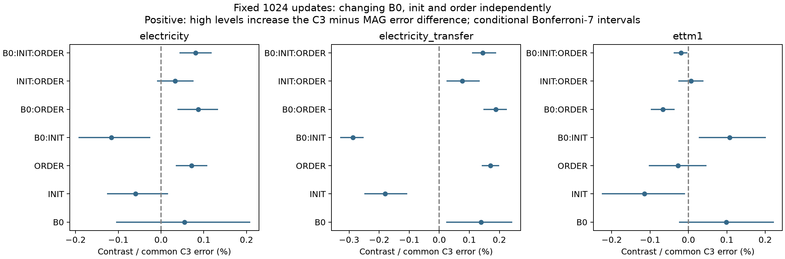

# 논문 보충: 기반 모델과 추가 어댑터 초기값의 상호작용

2026-09-18 · Korean paper addendum · 사후 두 수준 통제 실험

## 핵심 수정

**관찰된 차이는 단순한 ‘지속성 규칙의 우위’로 설명되지 않으며, 동결된 B0와 추가 어댑터 초기값의 조합 및 checkpoint 선택에 의존한다.** 기존 연구의 최초 가설이 이 상호작용을 예측한 것처럼 쓰지 않는다. 이는 기존 결과를 확인한 뒤 설계한 후속 기전 진단이다.

앞선 원고는 가중치와 추론 규칙의 효과를 분리했지만 seed가 B0·초기값·순서를 묶어 바꾼다는 한계가 있었다. 이번에는 두 source에서 세 요인을 독립적으로 교차했고, 같은 조건의 C3/MAG를 짝지었다. 신규24개와 재사용8개의 총32경로를 비교했으며 모든 경로를1,024 updates로 맞춘 결과를 주 분석으로 삼았다.

## 원오차와 두 방법 사이의 격차를 구분

원오차 자체의 단일 요인 주효과에서는 B0가 가장 큰 절대 점추정이었다. 반면 C3−MAG 격차의7성분 중에는 B0×초기값이 가장 컸다. 두 질문의 답이 다르다. 아래는 전력 전이 SHIFT8, fixed1024에서 나머지 요인을 평균한81551→81552 변화다. 양수는 원오차 증가다.

| 바꾸는 요인 | C3 원오차 변화(nMAE) | MAG 원오차 변화(nMAE) |
|---|---|---|
| B0 | +0.01174459 | +0.01123552 |
| INIT | -0.00009799 | +0.00055992 |
| ORDER | -0.00291946 | -0.00354140 |

B0 교체는 두 방법의 원오차를 모두 크게 바꾸므로, 그 공통 변화를 뺀 방법 간 격차에서는 B0 주효과가 상대적으로 작아질 수 있다. ‘예측 정확도에 무엇이 큰 영향을 주는가’와 ‘두 gate의 상대적 차이를 무엇이 만드는가’를 하나의 순위로 합치지 않는다.

## 결과 절에 사용할 문단

> 전력 전이 SHIFT8에서 C3와 MAG의 오차 차이에 대한 가장 큰 절대 factorial 성분은 동결된 B0와 어댑터 초기값의 상호작용이었다(contrast−0.00104889 nMAE; 고정된 공통 C3 오차 대비−0.2872%; 조건부 Bonferroni7 구간[−0.001204,−0.000919]). 나머지 요인을 평균했을 때 같은 초기값 변경은 한 B0에서는 MAG 방향으로, 다른 B0에서는 C3 방향으로 작용했다. 반면 검증으로 checkpoint를 선택한 절차에서는 B0 주효과가 가장 큰 점추정이었다(+0.00169094 nMAE). 따라서 관측 규칙의 상대 성능은 초기 학습 조건과 선택 절차에 의존하며, 하나의 초기화 seed 또는 추론 gate만으로 설명되지 않는다.

이 문단의 가장 큰 성분은 비교한7성분의 관찰 점추정이다. 성분 간 차이에 대한 별도 순위 검정을 수행한 것은 아니다. 구간은 반복 사용한 개발 E에서 고정된 두 수준과 학습 결과에 조건부다.

## 논의 절에 사용할 문단

> 출력층을0으로 초기화하여 시작 예측이 B0와 같더라도, 추가 어댑터의 초기 내부 파라미터와 기반 모델의 조합에 따라 두 관측 가중 규칙의 학습 결과가 달라졌다. 이는 초기 예측 동일성이 학습 경로의 동일성을 보장하지 않음을 보여주는 해당 설정의 통제 사례다. 그러나 본 연구는 어떤 내부 표현 또는 gradient가 이 차이를 유발했는지 직접 측정하지 않았으며, 선택한 두 수준에서의 교차 효과를 모든 B0와 초기화에 일반화하지 않는다. 또한 fixed1024와 검증 선택 결과의 차이는 checkpoint 선택이 해석을 바꿀 수 있음을 보여주지만, 평가 후 유리한 checkpoint 절차를 새 방법으로 채택하는 근거는 아니다.

## 주장 범위

| 구분 | 이번에 가능한 설명 | 남은 한계 |
|---|---|---|
| 실행 | 신규24fits·재사용8fits, 전체 평가·검산 완료 | 학습 완료는 논문 성공 판정이 아님 |
| 요인 분리 | B0·초기값·순서를 독립적으로 바꾼 통제 효과 | 선택한81551/81552 두 수준·두 source에 한정 |
| 상호작용 | fixed1024의 전력 전이에서 B0×초기값 결합이 가장 큰 점추정 | 전체 모집단의 최대 원인·내부 gradient 원리 미확인 |
| 선택 효과 | 선택 checkpoint를 사용하면 우세 성분과 일부 자료의 평균 순위가 달라짐 | V 선택 민감도이며 독립 시험이 아님 |
| 방법 우위 | C3의 기존 좁은 이득과 MAG의 이득·손해를 함께 보존 | 지속성 구성요소의 일관된 추가 가치·정식 선행 우위 미확보 |
| 신규성 | 구체적인 추가 PEFT의 조건부 학습–추론 실증으로 논문 구성 가능 | 어댑터·gate·0출력 초기화 자체의 최초성을 주장하지 않음 |

## 기존 원고와의 관계

`manuscript_v2_20260918`은 이번 통제 이전의 이력으로 보존한다. 그 원고의 ‘B0·초기값·순서를 분리하지 못했다’는 한계는 이번 선택한 두 수준의 실험 범위에서 보완됐다. 다른 seed·독립 source·선행 비교 및 내부 기전에 대한 한계는 남는다. 기존81553과 모든 음성 결과를 삭제하거나 이번8조합 평균으로 대체하지 않는다. 논문의 중심 기여는 현재로서는 관측 기반 추가 PEFT의 통제 실증이며, 새 지속성 방법의 범용 우위로 확대하지 않는다.

다음 장에는 실제 원점수·설계·비용과 판단을 그대로 수록한다.

---

# B0·초기값·학습 순서를 분리한 C3/MAG 통제 실험

**실행 완료:** 32개 경로 중 기존8개를 검증 후 재사용하고 새24개를 모두1024 updates 학습했다. 본학습24,576+smoke12=24,588 updates. 선택64개 모델 view, 평가192개 view 중 신규129·재사용63개. 누락된 예정 경로는0개다. 새 후보·LR 검색·후속학습은 없다.

## 질문과 해석 범위

기존 seed 효과에 묶여 있던 B0 가중치, 추가 어댑터 초기값, batch 순서를81551/81552 두 수준에서 교차했다. 동일 조합의 C3/MAG는 다른 조건이 같고 gate만 다르다. 주 분석은 fixed1024, 보조 분석은 기존 V 규칙으로 선택한 checkpoint다. 모든 선택과 전체 예측을 저장한 뒤 E를 채점했다.

이는 기존 결과를 본 뒤 수행한 두 수준의 통제 진단이다.81553을 포함한 과거 결과는 보존했고 원 논문에서 제외하지 않는다. 이번 두 수준의 결과를 초기화 전체 모집단 또는 새로운 독립 시험으로 일반화하지 않는다. B0 수준의 변화는 학습된 checkpoint 전체의 교체이며 B0 내부의 어떤 표현이 원인인지는 별도 문제다.

## 주 분석: 어느 요인의 차등 효과가 컸나

전력 전이 SHIFT8의 d=nMAE(C3)−nMAE(MAG)에서 절대 점추정이 가장 큰 전체 성분은 **B0:INIT**, 단일 요인 주효과 중에는 **INIT**다. 이는 관찰한 두 수준과 나머지 요인의 동일 가중 평균에 한정된 순위다. 계수의 크기 순위에 대한 별도 통계 검정을 하지 않았으므로 ‘가장 크다는 것이 확정’이라고 쓰지 않는다. 교호 성분이 크면 단일 요인만으로 설명하지 않는다.

contrast는2×mean(d×각 요인의±1 부호곱)이다. 단일 요인에서는 다른 두 요인을 평균한 high−low 차이와 같다. 양수는 해당 요인 수준이 높아지면 MAG 방향의 차이가 커짐을 뜻한다. 이원·삼원 contrast는 동일 척도의 factorial contrast이며 원자료의 단순 두 셀 차이와 다르다. %는8셀의 공통 C3 오차를 분모로 한다. 셀 간 분산 비중은 이8셀의 설명적 분해이며 인과 확률이나 초기화 모집단 분산 비중이 아니다.

| 요인 | d contrast(nMAE) | 공통 분모 % | 조건부 Bonferroni7 구간 | 셀 분산 비중% |
| --- | --- | --- | --- | --- |
| B0 | +0.00050907 | +0.1394 | [+0.00008344, +0.00088554] | 8.60 |
| INIT | -0.00065791 | -0.1801 | [-0.00090861, -0.00039078] | 14.37 |
| ORDER | +0.00062193 | +0.1703 | [+0.00051560, +0.00072640] | 12.84 |
| B0:INIT | -0.00104889 | -0.2872 | [-0.00120359, -0.00091856] | 36.51 |
| B0:ORDER | +0.00068854 | +0.1885 | [+0.00053645, +0.00082035] | 15.73 |
| INIT:ORDER | +0.00028138 | +0.0770 | [+0.00008776, +0.00049211] | 2.63 |
| B0:INIT:ORDER | +0.00052995 | +0.1451 | [+0.00039595, +0.00069028] | 9.32 |

| B0 | 초기값 | 순서 | C3 nMAE | MAG nMAE | MAG 이득(%) |
| --- | --- | --- | --- | --- | --- |
| 81551 | 81551 | 81551 | 0.36066358 | 0.36064235 | +0.0059 |
| 81551 | 81551 | 81552 | 0.35737395 | 0.35717077 | +0.0569 |
| 81551 | 81552 | 81551 | 0.36124024 | 0.36057947 | +0.1829 |
| 81551 | 81552 | 81552 | 0.35819482 | 0.35784923 | +0.0965 |
| 81552 | 81551 | 81551 | 0.37360315 | 0.37218257 | +0.3802 |
| 81552 | 81551 | 81552 | 0.36951706 | 0.36759733 | +0.5195 |
| 81552 | 81552 | 81551 | 0.37129373 | 0.37239126 | -0.2956 |
| 81552 | 81552 | 81552 | 0.37003701 | 0.36901274 | +0.2768 |

## 원점수와 조건별 손해

아래는 각 조합을 동일 가중한 평균이다. 공식 원래3seed 평균을 대체하는 점수가 아니며 연구 성공 기준으로 새로 선택한 점수도 아니다. 개별8조합·9형태·모든 fault 상태는 CELL_EFFECTS.csv와 RAW_SCORES.csv에 보존했다.

| 패널 | checkpoint | 조건 | C3 | MAG | MAG 이득% |
| --- | --- | --- | --- | --- | --- |
| electricity | fixed1024 | REFERENCE | 0.1670709 | 0.1670811 | -0.0061 |
| electricity | fixed1024 | FAULT | 0.1722803 | 0.1722682 | +0.0070 |
| electricity | fixed1024 | SHIFT4 | 0.1890400 | 0.1890720 | -0.0169 |
| electricity | fixed1024 | SHIFT8 | 0.2024921 | 0.2024730 | +0.0094 |
| electricity | fixed1024 | SHIFT_POINT | 0.1935993 | 0.1937657 | -0.0860 |
| electricity | selected | REFERENCE | 0.1669362 | 0.1669665 | -0.0182 |
| electricity | selected | FAULT | 0.1721199 | 0.1721242 | -0.0025 |
| electricity | selected | SHIFT4 | 0.1891726 | 0.1891938 | -0.0112 |
| electricity | selected | SHIFT8 | 0.2018112 | 0.2015704 | +0.1193 |
| electricity | selected | SHIFT_POINT | 0.1935912 | 0.1936945 | -0.0534 |
| electricity_transfer | fixed1024 | REFERENCE | 0.2400674 | 0.2401230 | -0.0231 |
| electricity_transfer | fixed1024 | FAULT | 0.2558013 | 0.2558814 | -0.0313 |
| electricity_transfer | fixed1024 | SHIFT4 | 0.3167241 | 0.3166302 | +0.0297 |
| electricity_transfer | fixed1024 | SHIFT8 | 0.3652404 | 0.3646782 | +0.1539 |
| electricity_transfer | fixed1024 | SHIFT_POINT | 0.3326540 | 0.3326613 | -0.0022 |
| electricity_transfer | selected | REFERENCE | 0.2402336 | 0.2402625 | -0.0120 |
| electricity_transfer | selected | FAULT | 0.2557697 | 0.2558232 | -0.0209 |
| electricity_transfer | selected | SHIFT4 | 0.3186734 | 0.3183942 | +0.0876 |
| electricity_transfer | selected | SHIFT8 | 0.3638214 | 0.3624135 | +0.3870 |
| electricity_transfer | selected | SHIFT_POINT | 0.3344174 | 0.3340767 | +0.1019 |
| ettm1 | fixed1024 | REFERENCE | 0.4074240 | 0.4073187 | +0.0258 |
| ettm1 | fixed1024 | FAULT | 0.4238779 | 0.4238418 | +0.0085 |
| ettm1 | fixed1024 | SHIFT4 | 0.5478272 | 0.5478993 | -0.0132 |
| ettm1 | fixed1024 | SHIFT8 | 0.5487170 | 0.5495218 | -0.1467 |
| ettm1 | fixed1024 | SHIFT_POINT | 0.5881615 | 0.5882516 | -0.0153 |
| ettm1 | selected | REFERENCE | 0.4072575 | 0.4072780 | -0.0051 |
| ettm1 | selected | FAULT | 0.4232910 | 0.4233005 | -0.0022 |
| ettm1 | selected | SHIFT4 | 0.5498654 | 0.5503121 | -0.0812 |
| ettm1 | selected | SHIFT8 | 0.5465155 | 0.5460862 | +0.0786 |
| ettm1 | selected | SHIFT_POINT | 0.5886190 | 0.5889560 | -0.0573 |

## 검증과 비용

실제 모델의 초기 B0 동일성, residual-off 복원, 학습 중 동결 가중치·buffer 유지, 추가파라미터 갱신, 저장/복원 검사를 통과했다. 독립 감사는 동일 B0 수준의 동결 hash와 동일 초기화 수준의 실제 tensor를 비교했고,840개 contrast를 별도 marginal 합산으로 재계산했다.960개 셀 집계와 기존 selected 대각선120개를 재현했다. 원점별 nMAE와 pinball을 scalar loop로 검산했다. 날짜 bootstrap은 고정 모델에 조건부인2000회7일 block 재추출이고7contrast 내 다중비교 구간을 병기했다. 서로 다른 자료·상태 전체에 대한 familywise 보장을 주장하지 않는다.

새 optimizer 시간은12.75분, 검증2.10분, 새 추론13.49분, 전체 runner wall33.06분이다. 새 학습 peak allocated는362.1MiB, GPU 최소 여유는8227MiB였다. RustDesk는 기존 승인 예외이고 외부 학습 감지 표본은0개다. 원 모델·LoRA 비용을 제외한 추가 모듈의8,712파라미터만으로 전체 배포 비용을 주장하지 않는다.

## 논문에 남길 주장과 한계

이 통제는 앞선 ‘한 seed가 평균 차이에85.4% 기여했다’는 관찰보다 원인을 더 좁힌다. 하지만 직접 통제한 것은 B0·초기값·순서의 선택한 두 수준이다. 내부 gradient나 표현의 작동 원리 전체를 입증한 것은 아니다. 실제 센서 사건 레이블은 없고, E는 반복 사용한 개발 기간이다. 기존 C3의 좁은 양성 결과와 단순 MAG의 우위·손해를 함께 보존한다. 원인 규명이 새 지속성 구성요소의 성능 우위 또는 신규성을 자동으로 만들지는 않는다.

FINAL_DECISION.md에 실제 방향·상호작용·checkpoint 민감도를 해석한다. 새 모델 선택이나 자동 후속학습은 실행하지 않는다. 원 가중치·TRAIN·전체 예측은 로컬 캐시이며 GitHub에는 코드·봉인·집계·검산만 공개한다.

---

# 최종 판단 — 학습 원인 분리는 진전, 새 방법 우위는 별도

## 실행 완료

사전 봉인된32경로를 모두 확보했다. 기존8개 재사용, 신규24fits·24,576 본학습 updates와12smoke updates다.192평가 view(신규129·재사용63)를 모두 저장한 뒤 채점했다. 원점 scalar metric14,592회, 독립 factorial contrast840개, 셀960개, 기존 selected 대각선120개 검산을 통과했다. 미실행 예정 경로는0개다. 추가 후보·LR·seed·후속학습은 실행하지 않았다.

## 무엇이 가장 큰가

하나의 보편적인 최대 원인으로 답할 수는 없다. **비교한 두 수준에서 주 분석(fixed1024, 전력 전이 SHIFT8)의 가장 큰 절대 성분은 B0×초기값 상호작용이고, 기존 V 선택 절차에서는 B0 주효과가 가장 컸다.** 점추정 순위이며 요인 크기 간의 순위 검정까지 수행한 것은 아니다.

- fixed1024: B0×INIT contrast −0.00104889 nMAE, 공통 C3 분모 −0.2872%, 조건부 Bonferroni7 구간 [−0.001204, −0.000919].8셀 간 오차 차이 분산의36.51%이고, 모든 교호 성분의 합은64.20%다. 이 비율은 선택한8셀의 기술적 분해이며 모집단·인과 기여 확률이 아니다.
- 단일 요인 주효과의 절대 점추정은 INIT0.1801%, ORDER0.1703%, B0 0.1394% 순이다. 차이가 작고 별도 순위 검정이 없으므로 ‘초기값이 확실한 최대 원인’이라고 말하지 않는다.
- selected: B0 contrast +0.00169094 nMAE, 공통 분모 +0.4648%, 조건부 Bonferroni7 구간 [+0.001187,+0.002207]. checkpoint 선택을 포함한 절차의 민감도이며 B0 내부 표현의 작동 원리 전체를 규명한 것은 아니다.

## 원오차와 두 방법 사이의 격차를 구분

원오차 자체의 단일 요인 주효과에서는 B0가 가장 큰 절대 점추정이었다. 반면 C3−MAG 격차의7성분 중에는 B0×초기값이 가장 컸다. 두 질문의 답이 다르다. 아래는 전력 전이 SHIFT8, fixed1024에서 나머지 요인을 평균한81551→81552 변화다. 양수는 원오차 증가다.

| 바꾸는 요인 | C3 원오차 변화(nMAE) | MAG 원오차 변화(nMAE) |
|---|---|---|
| B0 | +0.01174459 | +0.01123552 |
| INIT | -0.00009799 | +0.00055992 |
| ORDER | -0.00291946 | -0.00354140 |

B0 교체는 두 방법의 원오차를 모두 크게 바꾸므로, 그 공통 변화를 뺀 방법 간 격차에서는 B0 주효과가 상대적으로 작아질 수 있다. ‘예측 정확도에 무엇이 큰 영향을 주는가’와 ‘두 gate의 상대적 차이를 무엇이 만드는가’를 하나의 순위로 합치지 않는다.

## 직접 통제에서 확인된 상호작용

B0를81551로 고정한 상태에서 초기값을81551→81552로 바꾸면, 순서를 평균한 d=C3−MAG는+0.00039098 증가한다(MAG 방향). 같은 초기값 변경을 B0 81552에 적용하면 d는−0.00170680 감소한다(C3 방향). 즉 어느 초기값이 두 방법의 차이에 유리한지는 B0에 의존한다. 여기서 사용하는 초기값은 추가 어댑터의 초기 tensor이며 B0 자체의 초기화와 다르다. 두 값을 빼는 difference-in-differences는 factorial 표의 B0×INIT contrast의2배다.

또한 B0 81552·초기값81552를 고정하고 순서만81551→81552로 바꾸면 fixed1024의 MAG 이득은−0.2956%에서+0.2768%로 부호가 바뀐다. 이는 등록된8셀의 설명적 예시다. 이 한 쌍을 새 선택 기준이나 일반적인 순서 효과로 승격하지 않는다.

## checkpoint와 데이터에 따른 한계

전력 전이8셀 평균의 MAG 이득은 fixed1024 +0.1539%, selected +0.3870%다. ETTm1에서는 fixed1024 −0.1467%에서 selected +0.0786%로 방향이 바뀐다. 따라서 checkpoint 선택은 실제 해석에 중요하고, 일부 선택에서 step0이 사용되는 사실을 숨기지 않는다. 이 숫자들은 이번8조합 평균이며 기존3seed 평균을 대체하지 않는다.

전력 source4의 fixed1024 평균 차이는 MAG +0.0094%로 작고, 전이의 REFERENCE/FAULT에서는 MAG가 각각−0.0232%/−0.0313% 손해였다. 모든 형태·오류 조건을 유지했다. 근소한 평균 차이를 실용적 동등성이나 센서 오류 해결로 해석하지 않는다.

## 논문에 남길 것

유지할 주장은 ‘이 추가 PEFT에서 최종 C3/MAG 차이는 B0·어댑터 초기값·순서의 조합 및 checkpoint 선택에 민감하다’는 통제 실증이다. 기존의 ‘최종 순위와 고정 가중치의 추론 규칙 효과가 다를 수 있다’는 관찰에, 이번 학습 요인 분리가 더해졌다. 초기 seed 묶음만 보고 원인을 추측하던 상태보다 설명 근거가 보강됐다.

보류할 주장은 ‘지속성 규칙이 유효 신호를 보존하므로 단순 대안보다 일관되게 우수하다’는 고유 방법론 설명이다. 이번 실험은 그 성능 우위나 신규성을 입증하지 않는다. B0의 내부 기하·gradient의 작동 원리, 셀 내 반복의 불확실성,81553 등 다른 수준, 독립 원천 및 정식 선행과의 비교는 여전히 미검증이다.81553과 이전 음성 결과는 원래 보고서에 유지하며 현재 평균으로 바꾸지 않는다.

판정: **CONTROLLED_CONDITIONAL_EXPLANATION_SUPPORTED / GENERAL_METHOD_SUPERIORITY_NOT_ESTABLISHED**. 논문 PASS나 게재 가능성을 선언하지 않는다. 새 후보 또는 후속학습을 자동 시작하지 않고 종료한다.
