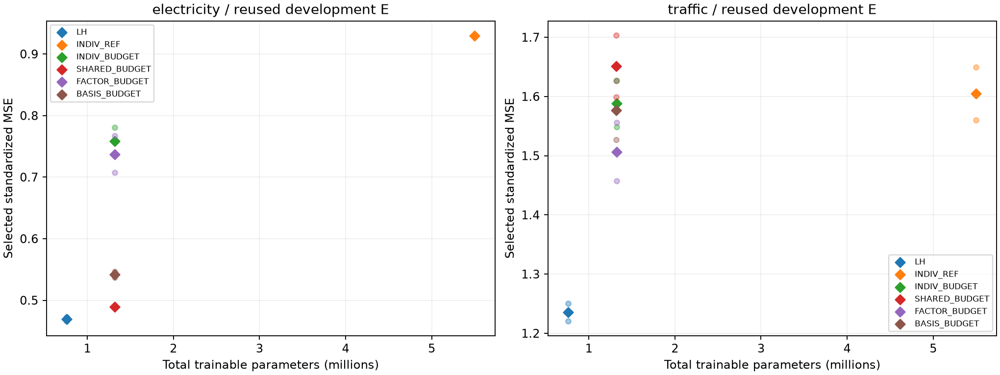
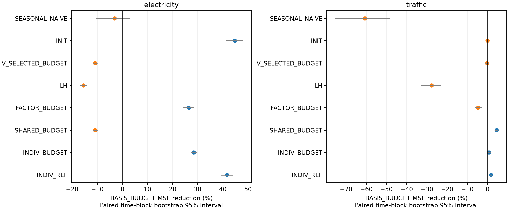
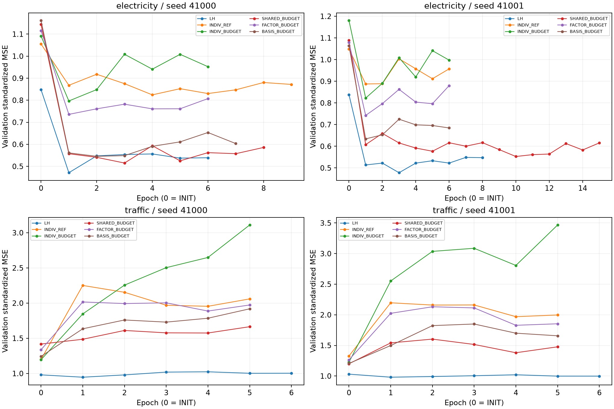

# R1/R2 최종 실행 검토

**R1 INCONCLUSIVE_NUMERICS_V2 / R2 COMPLETE.** R1 실제 수치 84 updates·자원 0 updates·본학습 0 fits. R2 smoke 24 updates·본학습 24/24 fits·9,602 updates와 평가를 완료했다.

## 핵심 판정

| 원천 | 실행 유효 | 예산 이득 신호 | 압축 신호 | REF가 LH보다 정확함 | 학습6군 중 최저 MSE | 신규성 |
| --- | --- | --- | --- | --- | --- | --- |
| electricity | True | False | True | False | LH | KNOWN_PARAMETERIZATION |
| traffic | True | False | True | False | LH | KNOWN_PARAMETERIZATION |

## 두 seed 평균 원점수

| arm | 전체 trainable | Electricity MSE | Traffic MSE |
| --- | ---: | ---: | ---: |
| LH | 761,952 | 0.469379966 | 1.235361901 |
| INDIV_REF | 5,498,720 | 0.929494787 | 1.604795133 |
| INDIV_BUDGET | 1,320,560 | 0.757991653 | 1.588199496 |
| SHARED_BUDGET | 1,319,711 | 0.489010155 | 1.650995082 |
| FACTOR_BUDGET | 1,320,543 | 0.737124775 | 1.506609716 |
| BASIS_BUDGET | 1,319,711 | 0.541904025 | 1.576896606 |

Train 표준화 공간의 equal-channel MSE이며 낮을수록 좋다. 아래 개선율은 원천별 두 seed 원점수를 먼저 평균했다.

| 원천 | 기준 | 기준 MSE | BASIS MSE | BASIS 개선율(%) |
| --- | --- | ---: | ---: | ---: |
| electricity | INDIV_REF | 0.929494787 | 0.541904025 | +41.6991 |
| electricity | INDIV_BUDGET | 0.757991653 | 0.541904025 | +28.5079 |
| electricity | SHARED_BUDGET | 0.489010155 | 0.541904025 | -10.8165 |
| electricity | FACTOR_BUDGET | 0.737124775 | 0.541904025 | +26.4841 |
| electricity | LH | 0.469379966 | 0.541904025 | -15.4510 |
| electricity | V_SELECTED_BUDGET | 0.489010155 | 0.541904025 | -10.8165 |
| electricity | INIT | 0.981358228 | 0.541904025 | +44.7802 |
| electricity | SEASONAL_NAIVE | 0.525609095 | 0.541904025 | -3.1002 |
| traffic | INDIV_REF | 1.604795133 | 1.576896606 | +1.7384 |
| traffic | INDIV_BUDGET | 1.588199496 | 1.576896606 | +0.7117 |
| traffic | SHARED_BUDGET | 1.650995082 | 1.576896606 | +4.4881 |
| traffic | FACTOR_BUDGET | 1.506609716 | 1.576896606 | -4.6652 |
| traffic | LH | 1.235361901 | 1.576896606 | -27.6465 |
| traffic | V_SELECTED_BUDGET | 1.573757839 | 1.576896606 | -0.1994 |
| traffic | INIT | 1.576896606 | 1.576896606 | +0.0000 |
| traffic | SEASONAL_NAIVE | 0.981448809 | 1.576896606 | -60.6703 |

## 구성요소와 자원의 추가 가치

BASIS의 전체 학습 파라미터는 INDIV_REF보다 76.000% 적다. SHARED_BUDGET과 같은 전체 trainable 수를 갖는다. 압축 신호와 학습된 계수의 효과는 별개다.

- electricity: BASIS가 SHARED보다 높은 평균 MSE, FACTOR보다 낮은 평균 MSE다. LH 대비 MSE 변화 +15.451%. BASIS 평균 active 23.072초 / REF 32.147초 / LH 21.816초. 서로 epoch 수가 달라 총 시간 감소를 동일 작업량 속도 향상으로 해석하지 않는다.
- traffic: BASIS가 SHARED보다 낮은 평균 MSE, FACTOR보다 높은 평균 MSE다. LH 대비 MSE 변화 +27.647%. BASIS 평균 active 17.535초 / REF 21.316초 / LH 17.966초. 서로 epoch 수가 달라 총 시간 감소를 동일 작업량 속도 향상으로 해석하지 않는다.

Traffic에서는 seasonal-naive MSE0.981448809가 학습6군 중 최선인 LH1.235361901보다도 낮다. Electricity에서는 LH0.469379966이 seasonal-naive0.525609095보다 낮다. 두 원천 모두 BASIS가 무학습 기준보다 더 정확하다는 근거는 없다.

자원 표의 allocated/reserved peak는 기록된 training step 최대값이다. 모델 생성·V·체크포인트 재로딩을 포함한 전 구간 tensor peak를 측정했다고 하지 않는다. 전 구간 GPU NVML/free 감시는 별도 원본 로그에 있다. 추가 inference timing/static merge benchmark는 실행하지 않았다.

| 선택 종류 | fit 수 |
| --- | ---: |
| INIT 선택 | 10 |
| patience 조기 종료 | 24 |
| BUDGET_LIMITED | 0 |

INIT가 선택된 BASIS에서는 계수 개입이 불변이어도 학습된 특화의 인과 효과를 시험한 결과로 해석하지 않는다. 초기 residual basis가0인 구조와 선택된 epoch를 함께 봐야 한다.

## R1 수치 중단과 미실행

| 검사 | 통과/전체 |
| --- | --- |
| checkpoint/fp32 | 24/24 |
| microbatch/fp32 | 12/12 |
| microbatch/bf16 | 0/12 |

[48개 수치 요약](../../results/query_budget_repair_v2_20260915/numeric_summary.csv). FP64 의미 검사와 실제 origin 격리는 통과했다. 새 RMS 정책은 기존 실패 이후 고정된 개정이다. BF16 실패를 없애려고 FP32 본학습으로 바꾸지 않았다. 의미 오류가 입증되지 않아 추측으로 학습 코드를 수정하거나 남은 수치 예산12회를 재튜닝에 쓰지 않았다. 자원 검사480updates와 조건부12fits는 진입 조건 미충족으로 NOT_RUN이며 예측 성능 실패가 아니다.

## 준비 오류·검산·남은 범위

초기 R1 CPU 검사를 R2 환경에서 수집한 명령 오류는 환경 분리로 바로잡았다. R2 환경 목록 기록은 기존 uv 환경에 pip가 없어 한 차례 실패했다. 설치 변경 없이 importlib.metadata로 수정하고 완료된 CPU/모델/데이터 검사를 보존한 채 준비 끝부분만 마무리했다. 본학습 재시도나 cell 대체는 없다. 학습 전 끝 공백 정리는 계약 이전 버전과 함께 기록했다.

R2 예측 기록 257개를 독립 scalar float64로 재계산했고 최대 MSE 절대차 4.44e-16였다. 기존 결과·연구 1498개와 실행 소스 해시는 불변이다. 원점수·분모·seed별 gain·CI·실제 자원은 [R2 상세 보고서](../../results/channel_sharing_screen_v1_20260915/REPORT.md)에 있다.

R2는 알려진 affine factorization의32채널·길이96·고정 recipe 비교다. 이전64채널 실험에서 바뀐 여러 조건의 개별 효과나 미노출 원천의 범용성·공식 Time-PEFT 전체 재현은 미검증이다. 공식 C-LoRA/MoLA의 같은 백본 직접 비교도 미실행이다.

NEXT_ACTION R1: BF16 수치 동등성 미확정을 남기고 현재 자원 제약 후보 투자를 보류한다. NEXT_ACTION R2: 이번 최강 단순 대조군을 기준으로 결과를 검토해 후속 투자 여부를 결정한다. 트랙별 추가 학습·후속 후보는 자동 실행하지 않는다.

## 검토 자료와 재현 범위

[기준 commit 차이와 중복 검사](AUDIT.md), [최종 보존·GPU·초기값 감사](publication_audit.json), [실제 epoch별 학습 곡선](../../results/channel_sharing_screen_v1_20260915/training_curves.csv). 원시자료·모델 가중치·예측 tensor cache는 로컬에 보존하고 GitHub에는 코드·원점수·해시·검산 기록을 공개한다. 저장소만으로 저장 예측을 수치 재검산할 수 있다고 주장하지 않는다.
