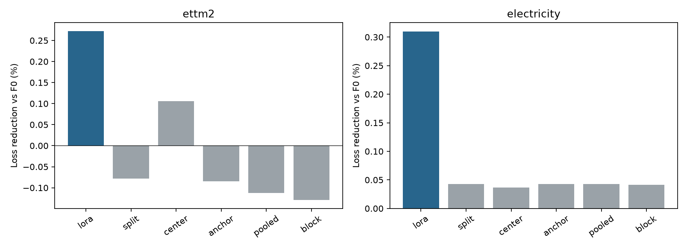

# TSFM PEFT 연구 방향 재검토

## 1. 추천과 판단 범위

다음 우선 검토 주제는 **불확실한 미래 공변량의 시간적 상관을 보존하는 단일 실행 PEFT**다. 전력 수요나 발전량 예측에 사용하는 날씨 예보처럼, 예측 시점에는 이용할 수 있지만 실제 값과는 다른 입력을 대상으로 한다. 여러 가능한 입력 경로에서 얻은 조건부 예측분포를 하나로 합치고, 그 동작을 작은 적응 파라미터로 한 번의 백본 실행에 옮기는 것이 목표다.

이 주제를 곧바로 “성공 가능성이 높은 새 방법”으로 확정할 근거는 아직 없다. **추천하는 다음 행동은 이 문제에 실제 개선 여지가 있는지 확인하는 짧은 검증이며, 또 다른 48회 방법 비교를 즉시 시작하는 것은 아니다.** 여러 경로를 처리한 참조 방법부터 강한 단일 실행 비교군보다 좋아야 한다. 참조 방법이 좋아지지 않으면 증류할 유용한 동작이 없으므로 개발을 중단한다.

기존 분포 정규화, 블록별 업데이트 허용, 활성값 압축 후보는 현재 주력 후보에서 제외한다. 실패한 실험의 지표나 판정 기준을 바꿔 성공으로 재분류하지 않는다. 일반적인 공변량 어댑터, 앙상블 증류, 조건부 LoRA는 이미 존재하는 구성요소이므로 그것들을 조합했다는 이유만으로 독창성이 성립하지 않는다.[^5][^6][^11]

범위는 기존 10GiB GPU에서 가능한 TSFM PEFT 방법론이다. 확인된 사실은 저장된 실험 결과, 그 결과의 CPU 재계산, 선행연구와 공개 데이터 명세다. 새로운 후보의 실제 학습 결과, 신규 데이터의 예측 점수, 성공 확률 추정치는 포함하지 않는다. 관찰과 다음 실험에 대한 설계 판단을 구분한다.

## 2. 기존 추천에서 수정해야 할 점

### 개선 여지를 충분히 확인하지 않았다

최근 두 데이터셋에서 보수적인 LoRA의 평균 개선은 F0 대비 0.272%와 0.310%였다. 이는 현재 학습량·분할·학습률에서 관측한 효과이며, 달성 가능한 개선의 상한은 아니다. 더 긴 학습, 더 다양한 독립 시계열, 다른 목적함수에서 효과가 커질 수 있다. 그러나 큰 여유가 확인되지 않은 상태에서 별도 제약을 추가하면 그보다 더 작은 차이를 설명해야 한다.[^1]

| 방법 | ETTm2: F0 대비 손실 감소 | Electricity: F0 대비 손실 감소 |
|---|---:|---:|
| 보수적 LoRA | +0.2724% | +0.3098% |
| 제약 없는 중심·간격 어댑터 | −0.0784% | +0.0429% |
| 간격 고정, 중심만 적응 | +0.1054% | +0.0365% |
| 간격 변화 정규화 | −0.0850% | +0.0428% |
| 평균 학습 손실로 업데이트 허용 | −0.1126% | +0.0430% |
| 블록별 변동까지 고려한 허용 | −0.1291% | +0.0414% |

양수는 개선, 음수는 악화다. 두 시드의 원래 손실을 먼저 평균한 뒤 F0로 정규화했다. 수치는 comparison.csv와 audit.json에서 재계산할 수 있다.

블록 규칙은 평균 손실만 사용하는 규칙보다 ETTm2에서 0.01644%, Electricity에서 0.00159% 손실이 높았다. 이 차이를 통계적으로 유의한 악화라고 주장할 근거는 없다. 다만 추가 규칙의 이득이 관측되지 않았다는 판단에는 충분하다. 복잡한 제어가 실제 병목을 해결했다는 해석을 지지하지 않는다.

### 진단 지표와 목표 성능의 연결을 과대평가했다

일부 설정에서 학습 후 예측구간이 좁아졌다는 사실은 원인 후보를 제공한다. 그것만으로 간격 변화를 억제하는 것이 평균 확률예측 손실을 개선한다고 결론 낼 수는 없다. 위치 오차, 구간 폭, 꼬리 비대칭, 입력 분포 변화가 동시에 영향을 주기 때문이다.

ETTm2에서 단순 보정은 80% 구간의 실제 포함률을 약 71.01%에서 79.90%로 올렸지만, 기본 평가 손실은 0.27264에서 0.27550으로 악화시켰다. 반대로 Electricity의 F0 포함률은 이미 약 79.96%였다. 두 데이터에 동일한 “분포 보존이 부족하다”는 설명을 적용한 것은 강한 가설이 아니었다.[^1] TSFM의 보정 상태를 다룬 기존 연구도 모든 모델이 항상 과신한다는 주장을 뒷받침하지 않는다.[^19]

### 서로 다른 실패를 한 가지 원인으로 묶으면 안 된다

| 연구축 | 확인된 중단 이유 | 이 결과로 말할 수 없는 것 |
|---|---|---|
| Freshness v2 | 후보가 가장 강한 단순 비교군을 이기지 못함 | 비동기 관측 문제 자체가 없다는 결론 |
| Global/local backward | 정밀도·실제 메모리·시간 비교에서 강한 대안에 밀림 | 실제 예측 학습도 반드시 실패한다는 결론 |
| Forecast-query | 실제 학습은 되었지만 기준 대비 메모리가 28.13% 더 큼 | 학습 기능이 구현되지 않았다는 결론 |
| Block-shape | 두 데이터에서 기본 예측 성능의 추가 이득 없음 | 모든 불확실성 관련 PEFT가 실패한다는 결론 |

Freshness v2에서는 관측 손상에 따른 문제가 있었고 일반 LoRA도 유용했지만, 새 조건부 구조가 더 낫지 않았다. 메모리 후보는 다른 문제였다. FP32 평균과 추가 잔차를 보관하는 방식이 단순 FP16 저장보다 유리한지 먼저 계산했어야 했다. 특정 조작이 가능하다는 것과 경쟁 방법보다 가치 있다는 것은 별개의 질문이다.[^2][^3][^4]

### 학습·평가 지표의 불일치도 만능 설명은 아니다

학습은 asinh 공간의 native pinball을 사용하고, 선택과 평가는 원래 단위의 정규화 pinball을 사용했다. 이 불일치는 확인할 가치가 있는 기본 대조다. 그러나 저장된 V 예측을 다시 계산했을 때 24개 데이터·시드·방법 선택 중 18개는 두 기준에서 같은 recipe와 checkpoint를 선택했다.

선택이 달랐던 6개에서도 native 기준을 택했을 때 원래 V 지표의 손해는 약 0.011~0.089%였다. 이 계산은 정렬된 분위수에서 복원한 native 점수이므로 실제 정렬 전 LoRA 학습 손실과 완전히 같지는 않다. 학습 목적함수의 영향을 인과적으로 분리한 실험도 아니다. 따라서 다음 기본 비교에는 넣되, “원래 단위로 학습하면 해결된다”를 새 논문 가설로 포장해서는 안 된다.

최근 24개 최종 선택 중 step 0은 하나뿐이었다. 대부분이 초기 상태라 학습 자체가 실패했다는 설명은 최근 실험에는 맞지 않는다. 선택 분포는 step 0/30/60/120에서 각각 1/16/1/6이었다. 모든 기록이 validation_objective_choices.csv에 남아 있다.

## 3. 다음 문제를 고르는 기준

후보 방법을 만들기 전에 세 가지 여유를 확인해야 한다. 첫째, 더 나은 예측을 만드는 정보나 절차가 실제로 존재하는가. 둘째, 그것을 얻는 비용이 배포 환경에서 문제가 되는가. 셋째, 이미 알려진 저렴한 방법으로 같은 이득을 얻을 수 없는가. 세 조건 중 하나라도 없으면 새 PEFT 구조의 필요성이 약하다.

문제 크기와 방법의 가치도 분리해야 한다. 입력을 강하게 손상시키면 성능 저하는 쉽게 만들 수 있지만, 단순한 마스크·상태 특징·증강도 그 문제를 해결할 수 있다. 후보의 효과와 가장 강한 단순 대안 대비 이득은 별도로 확인한다. 새로운 정보는 후보와 모든 관련 비교군에 동일하게 제공해야 한다.

단순 비교군의 작은 효과가 문제의 상한을 증명하지는 않는다. 반대로 복잡한 모델 하나가 개선했다고 해서 새 방법의 필요성이 확인되는 것도 아니다. 앞으로는 “개선된 참조 동작을 먼저 확보한 뒤 그것을 더 효율적으로 구현한다”는 순서를 우선한다. 이는 성공 보장이 아니라 실패 원인을 더 빨리 구분하기 위한 설계다.

최근 fine-tuning 손익분기점 연구도 데이터 길이와 도메인에 따라 zero-shot·LoRA·고전 모델의 우열이 달라짐을 보고했다. 다만 그 연구의 모델 구성과 조건은 현재 Chronos-2 실험과 다르다. 특정 표본 수 기준을 이 저장소의 중첩 윈도 수에 그대로 적용해서는 안 된다.[^17]

## 4. 검토한 대안과 선행연구 충돌

| 후보 방향 | 매력적인 점 | 가장 가까운 선행 또는 기존 결과 | 현재 판단 |
|---|---|---|---|
| F0 보존·간격 정규화 강화 | 구현이 간단함 | 최근 block-shape, 단조 분위수 보정 | 주력에서 제외 |
| 데이터 군집별 LoRA·혼합 전문가 | 도메인 이질성을 다룸 | MixFT의 하위 도메인별 LoRA | 단순 군집화 재포장 제외 |
| 외생변수를 추가하는 어댑터 | 새로운 예측 정보가 있음 | ChronosX, CoRA, TFMAdapter; native 지원 | 추가 자체는 새 기여가 아님 |
| 의사결정 비용을 최적화하는 PEFT | 응용 효용이 명확함 | Moirai의 decision-focused PEFT | 새 의사결정 구조 없이는 제외 |
| TSFM을 작은 모델로 증류 | 계산 절감 목표가 분명함 | DistilTS, ensemble distribution distillation | 일반 증류만으로는 부족 |
| 불확실한 미래 입력 경로의 단일 실행 PEFT | 정보·정확도·계산량을 연결함 | 위 선행의 교집합; 추가 기여 미확인 | 문제 검증을 우선할 조건부 후보 |

ChronosX와 CoRA는 공변량을 적응 과정에 넣는 것이 이미 연구된 방법임을 보여준다. TFMAdapter는 백본을 그대로 둔 채 공변량과 예측을 결합하는 가벼운 대안이다. “공변량을 쓰는 후보 대 공변량 없는 LoRA” 같은 비교를 피해야 한다.[^5][^6][^7] 출력 보정과 단조 분위수 파라미터화 자체도 새 기여로 삼기 어렵다.[^8]

MixFT는 데이터셋 단위가 아닌 하위 분포별로 LoRA를 전문화한다. 실패한 어댑터를 여러 개 만든 뒤 군집에 따라 고르는 정도는 차별성이 약하다.[^9] 에너지 시스템의 decision-focused fine-tuning도 이미 발표됐으므로 지표를 비용으로 바꾸는 것만으로 새 주제가 되지 않는다.[^10]

일반 앙상블 분포 증류는 회귀 문제에도 적용돼 왔고, DistilTS는 TSFM의 증류와 horizon별 학습 문제를 다룬다. 새 후보가 성립하려면 일반 증류와 비교해 시간적 입력 불확실성을 다루는 구조가 필요한 이유와 실제 추가 이득을 보여야 한다.[^11][^12]

이 표는 제한된 문헌 검토의 판단이다. 검색에서 정확히 같은 제목이 없다는 사실은 신규성의 증명이 아니다. 최근 TSFM 후속 학습 문헌은 파라미터 적응, 입력 확장, 모델 결합, 출력 보정, 압축을 폭넓게 다루므로 단순 조합의 중복 위험이 높다.[^16]

## 5. 우선 후보의 문제 정의

내일 전력 수요를 예측할 때 달력은 거의 확정된 미래 정보지만 기온은 예보값이다. 같은 타깃 시각에 대해 여러 발행시각의 예보가 있고, 예보가 갱신되면 예상 경로도 달라진다. 현재까지의 시계열을 x, 미래 공변량 경로를 c, 발행 시점까지의 정보를 I_t라고 하자.

이상적인 확률 모형에서는 미래 공변량의 불확실성을 다음과 같이 적분한다.

\[
p(y\mid x,I_t)=\int p(y\mid x,c)\,p(c\mid I_t)\,dc.
\]

평균 경로 하나를 넣은 예측은 일반적으로 이 적분과 같지 않다. 입력·출력 관계가 비선형이면 평균 예측도 달라질 수 있고, 여러 조건부 분포를 합치면 폭과 비대칭도 달라진다. 이 차이를 native quantile 출력을 유지하면서 적은 학습 파라미터로 표현하는 것이 연구 질문이다.

Chronos-2는 이미 알려진 미래 공변량을 지원한다. “날씨를 처음 넣는다”는 설명은 부적절하다.[^18] 검증할 차이는 하나의 예보 경로에 조건을 거는 것과 여러 가능한 경로를 반영하는 것 사이에 있다.

기존 블록 규칙은 업데이트를 줄이면 일반화가 좋아질 것이라는 추정에 의존했다. 새 방향은 비용이 더 드는 참조 예측을 먼저 만들어 품질을 관찰할 수 있다. 참조가 좋아지지 않으면 구조 설계 전에 중단할 수 있다.

목표는 단순히 구간을 넓히는 것이 아니다. 입력 경로가 달라지면서 생기는 비선형적인 중심 변화와 분포 변화를 함께 재현해야 한다. 단순 폭 보정으로 해결된다면 그 사실이 비교군에서 드러나야 한다. 방법의 필요성이 특정 진단 지표 하나에만 의존하지 않는다.

추가 정보를 이용해 얻는 이득과 새로운 PEFT 규칙의 이득은 별개다. 모든 관련 비교군에 같은 시나리오와 발행시각 정보를 주고, 동일한 증류 목표를 쓰는 일반 LoRA도 비교해야 한다. 이 대조를 통과하지 못하면 유용한 응용 구현일 수는 있어도 새 PEFT 방법의 근거는 약하다.

입력 경로의 상관과 출력 전체 경로의 결합분포는 구분한다. 이 초안의 학생은 각 예측 시점의 주변 분위수를 출력한다. 따라서 출력 시점 간 결합확률이나 물리적으로 일관된 전체 예측 경로가 복원됐다고 주장하지 않는다.

### 참조 모형도 틀릴 수 있다

위 적분식은 조건부 모형의 의미가 올바르게 정의됐을 때의 확률 법칙이다. 실제 frozen TSFM의 예측이 정확한 조건부 분포라는 보장은 없다. 이미 오차가 있는 예보 입력을 학습한 모델이라면 입력 시나리오를 다시 섞으면서 불확실성을 중복해서 더할 수 있다.

또 오래된 예보와 최신 예보는 동일한 분포에서 독립적으로 나온 앙상블 멤버가 아니다. 발행시각이 다른 예보를 동일 가중치로 섞는 것은 잘못된 불확실성 모형이 될 수 있다. 참조 예측이 좋아지는지 실제 타깃에 대해 확인해야 하며, 참조와의 유사도만 높인 결과를 성공으로 판정하면 안 된다.

## 6. 수학적 구성 검증과 방법 초안

### 평균·시점별 분산만으로 부족할 수 있다

두 시점의 입력 경로를 생각한다. 집합 A는 (1,1), (−1,−1)이고 집합 B는 (1,−1), (−1,1)이다. 두 집합의 시점별 평균은 모두 0, 분산은 모두 1이다. 그러나 시점 간 공분산은 A에서 +1, B에서 −1이다.

출력 관계가 y=(c₁+c₂)²라면 A에서는 항상 4, B에서는 항상 0이다. 평균과 각 시점 분산만 보는 모델은 두 입력을 구분할 수 없지만 시간적 관계를 보는 모델은 구분할 수 있다. 이는 상관 정보를 보존해야 할 수 있다는 기초적인 반례다.

이 반례는 새로운 이론이나 실제 전력 데이터의 관측 결과가 아니다. 실제 타깃이 이런 경로 의존성을 갖는지도 아직 확인하지 않았다. 출력이 해당 시점의 공변량에만 의존한다면 시간 상관이 각 시점의 주변 예측에 거의 영향을 주지 않을 수 있다. 따라서 경로 상관의 가치를 별도 제거 실험으로 검증해야 한다.

### 분위수 평균은 혼합분포의 분위수가 아니다

동일 가중치의 Uniform[0,1]과 Uniform[10,11]을 섞으면 10%와 90% 분위수는 0.2와 10.8이다. 각 성분의 분위수를 같은 순서끼리 평균하면 5.1과 5.9가 된다. 후자는 두 덩어리 사이의 빈 구간에 놓인 좁은 예측이다.

따라서 참조 모형은 시나리오별 분위수를 그대로 평균해서 만들면 안 된다. 단조 보간한 CDF를 혼합한 뒤 역변환하거나, 각 조건부 분포에서 샘플을 뽑아 혼합 분위수를 계산해야 한다. 제한된 분위수 그리드를 사용한다면 꼬리 외삽과 보간 정책도 사전에 고정해야 한다.

두 반례의 정확한 계산은 construct_checks.json에 있다. 구현 정의를 점검하는 자료이며 실제 모델 성능 근거로 합산하지 않는다.

### 조건부 LoRA 초안

백본은 공변량 평균 경로를 한 번 처리한다. 작은 별도 인코더는 그 시점에 이용 가능한 시나리오들의 평균으로부터의 편차, 예측 간격, 시간적 상관 요약을 받아 적응 신호를 만든다. 시나리오 나열 순서에는 불변이어야 하고 모든 경로가 같아지면 추가 불확실성 보정이 사라지도록 한다.

설계 가능한 형태의 하나는 다음과 같다.

\[
\Delta W_\ell(S)
=B_\ell\,\mathrm{diag}\{g_\ell(S)-g_\ell(S_{\mathrm{deg}})\}\,A_\ell.
\]

S_deg는 같은 평균 경로를 반복한 퇴화 집합이다. 동일한 시나리오들에서는 차이가 0이므로 **이 불확실성 분기**가 기본 조건부 모델을 바꾸지 않는다. 이는 전체 문제에서 F0가 최적이라는 주장도 예측 오차 감소의 보장도 아니다. 공유 도메인 LoRA를 따로 두면 퇴화 한계에서 보존되는 대상은 F0가 아니라 그 공유 모델이며 비교군에도 같은 파라미터를 제공해야 한다.

분포 목표는 시나리오별 참조 CDF를 혼합한 F_T다. 학생의 native quantile 출력은 실제 학습 타깃의 proper score와 참조 혼합분포의 분위수 회귀 손실을 함께 최소화하는 방향을 검토한다. 참조 분포에서 뽑은 표본에 pinball loss를 적용하는 것이 가능한 구현 중 하나다. 평균 경로 예측만 흉내 내는 일반 증류도 반드시 대조한다.

이 수식은 **검증 전 설계 초안**이다. 조건부 low-rank 구조, 퇴화 입력에서의 항 제거, 분포 증류 각각은 새 발명이 아니다. 요약 방식이나 모듈 이름을 바꾼 것만으로 독창성을 주장하지 않는다. 일반 LoRA에 같은 정보와 같은 목표를 제공하는 방법보다 나아야 독립적인 기여를 논의할 수 있다.

## 7. 데이터와 가용성 계약

### 첫 후보 데이터: Liander 2024

OpenSTEF 데이터 카드는 네덜란드 전력망 55개 타깃의 부하, 날씨, 예보 버전, 가격, 프로파일을 제공한다고 설명한다. 예보 파일에는 타깃 시각과 available_at이 구분돼 있어 입력의 발행시각을 다루는 문제를 정의할 수 있다.[^13]

다만 가용성 지연을 모사한 부분도 있고 발전소 위치는 근사치다. 운영 시스템에서 수집한 원본 발행 로그와 완전히 같다고 가정해서는 안 된다. 최신 예보 대신 버전 테이블을 사용하고, 공급자 모델의 초기화 시각과 실제 발표 지연의 의미를 확인해야 한다.

OpenSTEF 공개 비교에서는 Chronos-2 zero-shot이 이미 강하다. 고전 회귀를 이기면 TSFM 적응의 필요성이 입증된 것으로 해석해서는 안 된다.[^14] 이 데이터에서 새로운 문제의 개선 여지가 있는지는 미검증이다. 공개 표의 성능을 이 연구의 재현 결과로 사용하지 않는다.

### 두 번째 후보와 남은 조건

GEFCom2014의 풍력·태양광 트랙은 발전량과 기상 예측의 관계를 검토할 후보다.[^15] 원본의 발행주기, 갱신 시각, 타깃 가용성, 재배포 조건을 먼저 확인해야 한다. 단일 예보만 있으면 학습 구간에서 추정한 오차 경로로 시나리오를 만들 수 있지만 그것을 실제 기상 앙상블이라고 부를 수는 없다.

Liander의 여러 지역이나 타깃 종류를 두 개의 독립 원천 데이터셋으로 세지 않는다. 지역별 시계열도 같은 기상 사건에 노출돼 있으므로 완전한 독립 표본이 아니다. 두 번째 공급원 확보가 실패하면 단일 원천 파일럿으로 제한하고 일반화 주장을 줄여야 한다.

| 정보 | 사용 조건 |
|---|---|
| 과거 수요·발전량 | 실제 가용시각이 예측 원점 이전 |
| 미래 기상 예보 | 발행·공개 시각이 예측 원점 이전 |
| 과거 예보의 오차 | 실제 기상이 이미 확인되고 공개된 사례만 사용 |
| 미래 실제 기상 | oracle 진단에만 사용, 배포 비교에서 제외 |
| 다른 지역의 미래 관측 | 이미 공개된 경우가 아니면 입력 금지 |
| 시나리오 가중치·보정 | 학습 또는 사전 분리된 보정 구간에서만 추정 |

최신 파일을 시간축으로 자르는 것만으로는 충분하지 않다. 예보가 가리키는 시각이 아니라 언제 알려졌는지를 잘라야 한다. 같은 날의 더 늦은 예보를 앞선 원점에서 쓰지 않는지도 검사한다. 정보 계약을 확인하지 못하면 실제 배포를 모사했다는 주장을 보류한다.

## 8. 먼저 수행할 최소 검증

현재 필요한 것은 **참조 예측의 가치 확인**이다. 한 원천의 소수 타깃에서 개발용 시간 구간을 정하고, 타깃과 구간을 성능을 보기 전에 고정한다. 다른 원천과 최종 평가 구간은 이후 검증을 위해 남긴다. 기존 ETT/Electricity 후속 구간은 이미 개발에 노출됐으므로 독립 검증으로 다시 사용하지 않는다.

| 구분 | 비교 방법 | 확인할 질문 |
|---|---|---|
| 기본 예측 | Chronos-2와 적법한 최신 공변량 | 원래 조건부 예측이 얼마나 강한가 |
| 단순 처리 | 입력 평균, 편향 보정, 출력 보정 | 복잡한 분포 처리가 필요한가 |
| 소규모 학습 | 동일 입력의 보수적 LoRA, 선형·트리 잔차 보정 | 일반 적응으로 해결되는가 |
| 비싼 참조 | 여러 경로별 예측의 올바른 CDF 혼합 | 증류할 추가 이득이 있는가 |
| 진단 전용 | 실제 미래 공변량, 경로 상관 제거 | 정보 여유와 상관의 역할이 있는가 |

미래 실제 기상을 쓰는 oracle은 상한 진단일 뿐 경쟁 방법이 아니다. 여러 경로를 처리하는 참조도 잘못 보정돼 있을 수 있다. 평균 경로보다 나아도 강한 잔차 보정이나 일반 LoRA보다 나쁘면 새 방법 개발을 정당화하기 어렵다.

다음 기준은 **검토용 제안**이며 실행 프로토콜로 사전 등록한 것이 아니다. 실제 타깃·예산·기간을 정한 뒤 평가를 보기 전에 고정해야 한다.

- 복수 개발용 시간 블록에서 참조의 기본 확률예측 손실이 강한 단일 실행 비교군보다 대략 2~3% 개선되는 규모를 우선한다.
- 단순 폭 보정으로 같은 개선을 얻으면 그 문제에서 새 증류 구조를 개발하지 않는다.
- 참조를 효율적으로 배치 실행했을 때도 실제 지연 또는 자원 차이가 충분해야 한다.
- 한 원천에서만 관측하면 탐색 결과로 표시한다. 독립 원천에서 재현되기 전에는 주력 방법으로 확정하지 않는다.

2~3%는 통계적 유의성 기준도 자연법칙도 아니다. 최근 관측한 0.3% 안팎의 작은 여유에서 복잡한 방법을 경쟁시키는 일을 피하려는 자원 배분 기준이다. 안정성 평가는 원점별 표본을 독립으로 취급하지 않고 타깃과 시간 블록을 고려한 별도 절차로 해야 한다.

## 9. 방법 실험으로 넘어갈 때의 설계

참조의 이득이 확인된 경우에만 학생 PEFT를 학습한다. 가장 중요한 비교군은 공변량 없는 F0가 아니라 **동일한 전체 입력 정보와 동일한 참조 분포를 사용하는 일반 LoRA**다. 새 정보, 증류, 제안 구조의 영향을 분리해야 한다.

| 비교·제거 실험 | 제거하거나 통제하는 요소 |
|---|---|
| 동일 정보의 일반 LoRA, 실제 타깃만 학습 | 참조 분포의 추가 감독 |
| 동일 정보의 일반 LoRA, 일반 분포 증류 | 제안한 조건부 업데이트 구조 |
| 작은 output adapter, 같은 분포 증류 | 백본 내부 적응의 필요성 |
| 평균·시점별 분산 특징만 제공 | 시간적 상관의 필요성 |
| 전체 경로 요약 제공, 한계조건 제거 | 퇴화 시나리오에서의 동작 제약 |
| 실제 타깃만 / 참조만 / 두 목표 결합 | 손실 구성의 역할 |
| 참조의 효율적 배치·캐시 구현 | 불공정하게 느린 teacher 비교 |

기본 축은 실제 타깃에 대한 proper score다. 참조와의 분위수 차이, 포함률, 폭은 보조 축으로 둔다. 학생이 참조를 잘 복사하더라도 실제 미래 손실이 좋아지지 않으면 성공이 아니다. 이전처럼 보조 현상의 개선을 방법의 성능으로 대체하지 않는다.

자원 목표도 분명히 한다. 참조의 K번 처리를 한 번으로 줄이는 것은 추론 연구의 목표이지 학습 메모리 감소의 증거가 아니다. teacher 생성, 시나리오 인코딩, 전처리, 배치 실행을 포함한 실제 지연을 비교한다. K=8이라고 8배 빨라진다고 가정하지 않는다.

학생이 강한 단일 실행 비교군보다 좋아지고, 참조와의 손실 차이를 작게 유지하면서 배치된 참조보다 의미 있게 빠르면 후속 가치가 있다. 여기에 같은 정보·감독의 일반 LoRA보다 나은 근거가 추가돼야 방법론 기여를 주장할 수 있다. 정확한 허용 손실·지연·파라미터 기준은 실험 전 고정한다.

초기 후보는 한 구조와 소수 recipe로 제한한다. 실패 원인을 “입력 정보가 쓸모없음”, “참조가 잘못됨”, “학생이 참조를 못 배움”, “일반 LoRA로 충분함”으로 구분해 기록한다. 이 구분이 다음 아이디어의 근거가 된다.

## 10. 논문으로 성립하는 조건과 현재 결론

확정할 수 있는 결론은 두 가지다. 기존 블록 기반 분포 제어는 이 설정에서 새 PEFT 주력 방법으로 밀기 어렵다. 다음에는 방법을 추가하기 전에 **학습해 옮길 가치가 있는 더 나은 예측 동작**을 실제로 확보해야 한다.

가장 먼저 확인할 구체적 문제는 불확실한 미래 입력의 시간적 구조를 반영하는 예측이다. 적법한 입력 가용성, 일반 공변량 적응과의 구분, 올바른 분포 혼합, 시간적 상관의 역할, 한 번의 실행이라는 계산 목표가 함께 있다. 이전의 단순한 업데이트 억제 가설보다 실패 여부를 단계별로 분리하기 쉽다는 점에서 우선한다.

일반 ensemble distillation에 LoRA를 붙이는 것만으로 새 방법론 논문은 아니다. 상관 정보를 다루는 표현 또는 적응 규칙이 일반 대안보다 낫다는 결과, 그 차이를 설명하는 제거 실험, 다른 원천에서의 재현이 필요하다. 문제 분석만 남으면 분석 연구이고 그 요건까지 충족하면 PEFT 방법론 연구다.

**현재 판정은 “새 후보의 문제 검증을 우선할 가치가 있음”이다. PASS가 확인된 방법, 신규성이 확보된 방법, 성공이 보장된 주제를 찾았다는 판정은 아니다.** 참조 방법의 이득부터 확인되지 않으면 이 방향도 빠르게 중단한다. 다음 학습을 시작할 근거의 질을 높이는 것이 이번 재검토의 목적이다.

## 자료와 재현 범위

- audit.json: 효과 크기, checkpoint 선택과 지표 불일치 재계산.
- comparison.csv: 그림의 원본 표. 스프레드시트에서 열 수 있다.
- validation_objective_choices.csv: 24개 선택의 native/raw 비교.
- construct_checks.json: 두 수학적 반례의 정확한 계산.
- source_inventory.csv: 참고 자료와 사용 범위.
- 재현 명령: PYTHONPATH=src .venv/bin/python scripts/rethink_peft_research.py

기존 예측 캐시의 회고적 계산이며 신규 학습 fit은 0회다. 신규 데이터 다운로드·타깃 예측·GPU 성능 측정은 하지 않았다. 공개 데이터의 실제 이용 가능성과 선행 구현에서 남아 있는 검증을 실행 완료로 표시하지 않는다.

## 출처

[^1]: CanelE452/tsfm-peft-method-screen. [Block-conditioned shape adaptation: first pilot](https://github.com/CanelE452/tsfm-peft-method-screen/blob/aa0609ae66a348bf18a6201b0164b85e71dd350c/results/block_shape_pilot/RESULT.md), 2026. 비공개 저장소의 원본 결과 및 같은 디렉터리 evaluation/selection/trajectory 자료. 로컬 캐시로 재계산.
[^2]: 같은 저장소. [Forecast-query pilot](https://github.com/CanelE452/tsfm-peft-method-screen/blob/aa0609ae66a348bf18a6201b0164b85e71dd350c/results/forecast_query_pilot/RESULT.md), 2026. 실제 학습과 메모리 판정.
[^3]: 같은 저장소. [Candidate01 v2](https://github.com/CanelE452/tsfm-peft-method-screen/blob/aa0609ae66a348bf18a6201b0164b85e71dd350c/results/candidate_01_v2/RESULT.md), 2026. 관측 손상의 문제 gate와 후보 비교.
[^4]: 같은 저장소. [Local backward feasibility](https://github.com/CanelE452/tsfm-peft-method-screen/blob/aa0609ae66a348bf18a6201b0164b85e71dd350c/results/local_backward_feasibility/RESULT.md), 2026. 예측 학습 없는 backward·자원 비교.
[^5]: Pineda Arango et al. [ChronosX: Adapting Pretrained Time Series Models with Exogenous Variables](https://arxiv.org/abs/2503.12107), AISTATS 2025, arXiv v1 2025-03-15.
[^6]: Qin et al. [CoRA: Covariate-Aware Adaptation of Time Series Foundation Models](https://arxiv.org/abs/2510.12681), arXiv v1, 2025-10-14.
[^7]: [TFMAdapter: Lightweight Instance-Level Adaptation of Foundation Models for Forecasting with Covariates](https://arxiv.org/abs/2509.13906), 2025; [저자 구현](https://github.com/AfrinDange/tfmadapter)은 CIKM 2025 채택을 명시.
[^8]: Liang et al. [The Forecast After the Forecast: A Post-Processing Shift in Time Series](https://arxiv.org/abs/2601.20280), arXiv v1, 2026-01-28.
[^9]: Lee, Ponti, Storkey. [Adapting Time Series Foundation Models through Data Mixtures](https://arxiv.org/html/2603.02840v1), 2026-03-03.
[^10]: Beichter et al. [Decision-Focused Fine-Tuning of Time Series Foundation Models for Dispatchable Feeder Optimization](https://arxiv.org/abs/2503.01936), Energy and AI 21, 100533, 2025.
[^11]: Lindqvist, Olmin, Lindsten, Svensson. [A general framework for ensemble distribution distillation](https://arxiv.org/abs/2002.11531), 2020; [MLSP 출판 기록](https://research.chalmers.se/en/publication/523625).
[^12]: Li et al. [Distilling Time Series Foundation Models for Efficient Forecasting](https://arxiv.org/abs/2601.12785), arXiv 2026-01-19, ICASSP 2026 채택 명시.
[^13]: OpenSTEF. [Liander 2024 Short Term Energy Forecasting Benchmark 데이터 카드](https://huggingface.co/datasets/OpenSTEF/liander2024-energy-forecasting-benchmark/blob/main/README.md), 2026-09-13 열람.
[^14]: OpenSTEF. [Benchmark Results](https://openstef.github.io/openstef/user_guide/guides/benchmark_results.html) 및 [Understanding Time Series Datasets](https://openstef.github.io/openstef/tutorials/datasets.html), 2026-09-13 열람. 이 보고서의 실험 결과가 아님.
[^15]: Hong et al. [Probabilistic energy forecasting: Global Energy Forecasting Competition 2014 and beyond](https://robjhyndman.com/papers/gefcom2014.pdf), International Journal of Forecasting 32, 2016. 개별 원본 파일의 발행시각 검증은 미완료.
[^16]: Xie et al. [Post-Training in Time Series Foundation Models: A Unifying Framework](https://arxiv.org/html/2607.20002v2), arXiv v2, 2026-07-24.
[^17]: Jerome, Simon. [When Do Foundation Models Pay Off? A Break-Even Analysis of Pretrained Time Series Forecasters](https://arxiv.org/abs/2607.04919), arXiv v1, 2026-07-06. 현재 Chronos-2 조건으로 직접 이전은 미검증.
[^18]: Amazon Science. [Introducing Chronos-2: From univariate to universal forecasting](https://www.amazon.science/blog/introducing-chronos-2-from-univariate-to-universal-forecasting), 2025, 2026-09-13 열람.
[^19]: [Beyond Accuracy: Are Time Series Foundation Models Well-Calibrated?](https://arxiv.org/abs/2510.16060), 2025–2026. 현재 후보의 효과를 검증한 연구는 아님.
