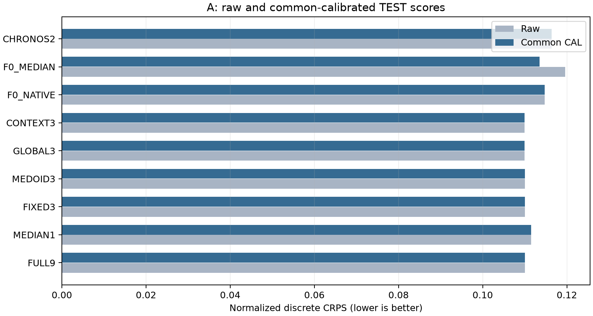

# A: 경로 압축 PEFT 결과

**[확인] GO_A_COMPRESSION_ONLY — 3경로 압축은 유용했지만 입력별 router의 추가 가치는 확인되지 않았습니다.**

일반 방법의 효과: FULL9 학습은 F0_NATIVE+CAL보다 CRPS **+4.118%**, F0_MEDIAN+CAL보다 **+3.054%** 개선됐습니다. 단일경로 학생보다 3경로는 유리했지만 고정3/medoid3/전역3도 충분했습니다. CONTEXT3의 FULL9 대비 CRPS 개선은 +0.0309%, 공통 pinball 개선은 +0.2165%였고, batch8 지연은 31.03% 줄었습니다.

새 모듈의 효과: CONTEXT3와 GLOBAL3의 평균 점수 차이는 +0.000000%입니다. **두 seed 모두 GLOBAL3와 CONTEXT3는 추가 학생 학습 전 checkpoint0이 선택됐습니다.** 초기 두 router는 같은 상수 출력을 내므로 이 결과를 입력 조건화 학습의 성공으로 해석할 수 없습니다. 학생들은 실제 256 updates를 모두 실행했으나 VAL이 학습된 router를 선택하지 않았습니다. 이때 checkpoint0의 LoRA는 이미 선택된 같은-seed FULL9 teacher의 가중치이므로 완전한 무학습 F0를 뜻하지 않습니다. 저장된 두 방법의 TEST atom·질량이 완전히 같고, 모든 A군의 첫64 raw/CAL atom이 F0와 같음을 [FIRST64_AND_INITIALIZATION_AUDIT.json](FIRST64_AND_INITIALIZATION_AUDIT.json)에서 별도 검산했습니다.

실용 대안: Chronos-2 직접128의 batch8 시간은 23.278ms, CONTEXT3는 40.595ms입니다. CONTEXT3의 공통9 pinball 개선은 Chronos-2 대비 +4.099%, nMAE는 +4.687%입니다. 속도·메모리·품질을 함께 선택할 문제이며 Bolt를 무조건 유지해야 한다는 결론은 아닙니다. F0_NATIVE의 공식 선형 분위수 추가 점수(native_pinball)는 별도 열로 보존했습니다.

Solar는 이전 연구에 노출된 개발 자료입니다. 원래137열 중 고정8열을 6행 평균해 시간별로 집계했고 C512/H128, TEST68 origins×8 series를 평가했습니다. 날짜가 없는 자료에 달력 날짜를 부여하지 않았습니다. 주영역은 후반65–128이며 [SCORES.csv](SCORES.csv)에 first64/full128, [LEAD_SCORES.csv](LEAD_SCORES.csv)에 모든 lead, [SERIES_SCORES.csv](SERIES_SCORES.csv)에 계열별 결과가 있습니다. 표의 계열0–7은 원본열36/10/44/119/62/104/116/118 순서입니다.

Teacher는 seed별 새 FULL9이며 모든 학생에 동일 teacher·정답·packet·256학습·보정 기회를 줬습니다. 첫 F0/teacher cache 생성은 총 12.683초/41,700,481bytes이고 FULL9 학습 비용은 위에서 별도 공개합니다. CONTEXT3 한 학생의 비용만으로 전체 학습비를 주장하지 않습니다. 초기 예측과 선택 예측 비교는 [CHECKPOINT_ZERO_DIAGNOSTICS.csv](CHECKPOINT_ZERO_DIAGNOSTICS.csv), raw selected는 SCORES에 있습니다.

두 반복 seed는 92301·92302이며 선택 전용 seed는 없습니다. 평균 개선율은 **두 seed 원점수 평균의 비율** `100×(1−candidate_mean/baseline_mean)`입니다. seed별 개선율의 평균이나 예측 ensemble 점수가 아닙니다. 고정 모델은 한 번 계산한 예측을 비교 상대에 재사용하며 독립 반복 2회로 부풀리지 않습니다.

V로 고정한 기준선 **FIXED3** 대비 CONTEXT3의 CAL CRPS 개선율은 **+0.0429%**, 두 seed는 **+0.0719%, +0.0139%**입니다. 같은 상대 대비 median nMAE 개선율은 **-0.1162%**입니다. 음수 개선율은 악화입니다.

14개 origin 연속 블록을 2,000회 공동 재표집한 95% 구간은 **[-0.257%, +0.265%]**입니다. 두 seed와 모든 계열·lead를 같은 origin 블록에 묶었습니다. seed를 모집단처럼 bootstrap하지 않았으며, 이 구간은 두 학습 반복만으로 학습 불확실성을 충분히 추정하지 못합니다. 0 포함 여부만으로 GO/NO_GO를 바꾸지 않습니다.


왼쪽은 공통 CAL 후 TEST 품질과 batch8 실측 비용이고, 오른쪽은 동일 원점수에서 계산한 seed별 효과입니다. 지연시간은 선택된 seed92301 모델로 10회 warm-up/30회 측정, 순방향·역방향 순서를 합친 중앙값입니다. 품질은 두 seed 평균입니다.

```text
arm        raw_CRPS  CAL_CRPS  pinball   nMAE      raw_MAE  coverage80  width   batch8_ms  GPU_peak_MiB
FULL9      0.110003  0.110003  0.120782  0.160842  1.5817   0.8999      0.4767  58.858     302.66
MEDIAN1    0.111462  0.111462  0.121564  0.162636  1.5989   0.8733      0.5664  37.036     225.82
FIXED3     0.110016  0.110016  0.120534  0.160966  1.5826   0.8928      0.4903  40.110     245.03
MEDOID3    0.110067  0.110067  0.120905  0.161367  1.5868   0.8892      0.4834  41.492     245.04
GLOBAL3    0.109969  0.109969  0.120521  0.161153  1.5845   0.8805      0.4879  41.281     245.06
CONTEXT3   0.109969  0.109969  0.120521  0.161153  1.5845   0.8805      0.4879  40.595     245.08
F0_NATIVE  0.114728  0.114728  0.126157  0.168203  1.6544   0.8625      0.4311  48.848     301.53
F0_MEDIAN  0.119571  0.113469  0.124659  0.166765  1.6396   0.9619      0.6451  27.913     224.69
CHRONOS2   0.116352  0.116352  0.125672  0.169077  1.6583   0.8596      0.5211  23.278     502.10
```



CRPS는 선언한 유한 지지점 분포의 정확한 점수입니다. 분위수 출력에 동일 질량을 주는 근사가 포함되므로 연속분포 전체의 우위를 뜻하지 않습니다. pinball은 모든 군에 같은 .1–.9 left-inverse discrete-CDF readout을 적용했습니다. raw MAE는 Solar 원단위(A) 또는 MW(B), 나머지 오차는 TRAIN sigma로 정규화했습니다. 폭과 포함률, 음수 질량은 [SCORES.csv](SCORES.csv)에 보존했습니다. CAL이 TEST에서 항상 좋아지지는 않습니다.

### 선택·학습·비용

```text
arm       seed92301  seed92302
FULL9     256        128
MEDIAN1   128        128
FIXED3    0          0
MEDOID3   0          0
GLOBAL3   0          0
CONTEXT3  0          0
```

raw VAL 0/128/256에서 checkpoint를 고르고, CAL에서만 35개 affine 계수 조합을 고른 뒤 보정된 VAL로 기준선을 정했습니다. 모든 선택 파일의 hash를 봉인한 후 TEST 예측을 저장했고, 진단용 A checkpoint0와 runtime까지 완료한 다음 채점했습니다. TEST 결과로 설정·보정·비교 상대를 바꾸지 않았습니다.

```text
arm       fits  updates  compute_s  fit_wall_s  trainable
FULL9     2     512      25.85      33.50       294912
MEDIAN1   2     512      26.30      31.26       294912
FIXED3    2     512      26.50      31.88       294912
MEDOID3   2     512      26.82      32.17       294912
GLOBAL3   2     512      28.07      33.45       294942
CONTEXT3  2     512      28.14      33.59       299798
```

fit wall은 첫 checkpoint0 VAL 이후의 update·중간 VAL·checkpoint 저장을 포함하며, 사전 데이터/모델 준비 전체 시간이 아닙니다. [FIT_LEDGER.csv](FIT_LEDGER.csv)는 smoke도 별도 기록합니다. main12 fits/3,072 updates와 smoke12 updates를 정확히 사용했습니다.

비용은 RTX4070, FP32, TF32 off에서 CPU 입력 복사·기상 표준화·필요 H2D·모델·작은 모듈·D2H·CAL·9분위수 readout을 포함합니다. 파일 읽기와 모델 로딩은 제외했습니다. A 최초 F0 계산은 매번 포함하며, B는 target TSFM을 한 번만 계산하고 작은 멤버 모듈만 벡터화했습니다. GBQR는 공통 특징을 한 번 계산하고 9개 회귀기에 전달합니다. Chronos-2는 CPU 입력을 공식 API에 직접 주었습니다. 실제로 학습하지 않은 Chronos-2의 requires_grad 기본값을 학습 파라미터 수로 세지 않았습니다.

처음 측정에는 GBQR의 중복 특징 계산과 Chronos-2의 추가 전송이 있었습니다. [RESOURCES.csv](RESOURCES.csv)에 원기록을 보존했고, 최종 판단은 [RESOURCES_FAIR.csv](RESOURCES_FAIR.csv)를 사용합니다. TRAIN batch1·8에서 수정 전후 예측 차이 0을 검증했습니다. 재학습은 없었습니다. 두 실행의 allocator 상태 차이도 있어 메모리 차이를 이 두 최적화의 인과 효과로 해석하지 않습니다. CPU 모델의 GPU peak는 모델 크기가 아니며, 절대 CPU RAM은 별도 측정하지 않았습니다.

CAL 원래 실행의 별도 wall time은 계측되지 않았습니다. 1,050개 grid 평가를 재검산한 시간 6.974초를 별도로 남겼고 원래 실행 시간으로 대체하지 않았습니다.

### 검증과 해석 범위

[VERIFICATION.json](VERIFICATION.json)의 pairwise 정의와 정렬 CRPS 검산 최대 차이는 2.36e-16입니다. pairwise CRPS와 pinball은 각 군·seed·raw/CAL의 3개 위치에서 대조했습니다. 표의 개선율 전부, checkpoint·CAL·VAL 기준선·update intent/commit은 별도로 재검산했습니다. frozen backbone와 모든 buffer는 각 fit에서 불변이었습니다. 참조 CPU22검사 외 통합 CPU5검사, Chronos/GPU smoke, 저장·복원, gradient·시간 정렬 검사를 별도로 수행했습니다.

Main 이전 위임 범위 이탈은 [IMPLEMENTATION_INCIDENT.json](../IMPLEMENTATION_INCIDENT.json)에 보존했습니다. 잘못 호출된 runner는 main0 updates에서 중단됐고, 소스 복구와 root 재검산 후 최종 소스를 봉인했습니다. 실행된 smoke는 예산24에 포함했고 재실행하지 않았습니다. 삭제된 조기 봉인 파일 원본은 복구하지 못했다는 한계도 기록했습니다. 이 구현 사건과 최종 과학적 판정을 구분합니다.

선행 원리인 LoRA·분포 증류·집합 attention 자체의 신규성이나 논문 PASS는 주장하지 않습니다. 자동 후속 실험은 없습니다. 모든 예측/가중치 원본은 로컬 cache에 있고 GitHub에는 코드·표·그림·manifest·검산이 있습니다. GitHub만으로 원시 예측을 즉시 재채점할 수 있다는 뜻은 아닙니다.
