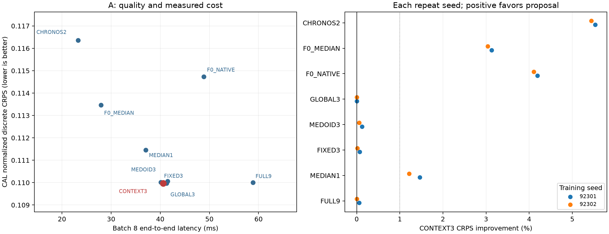
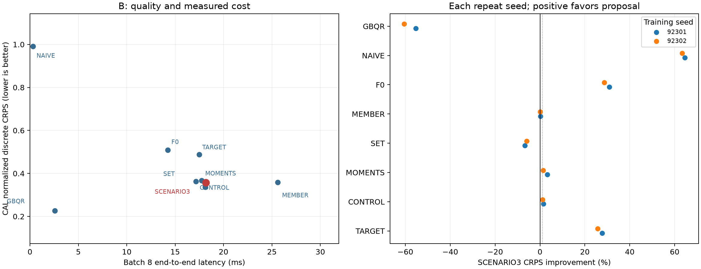

# A/B TSFM PEFT — 최종 요약

**[확인] 두 실험을 완료했지만 새 모듈의 방법론 후속 추천은 NONE입니다.** 일반적인 압축과 미래 기상정보는 유용했습니다. 새 router/3시나리오 구조가 강한 단순 대조보다 필요하다는 근거는 얻지 못했습니다.

- **A — GO_A_COMPRESSION_ONLY**: 3경로는 FULL9 품질을 거의 유지하면서 빨랐습니다. CONTEXT3는 V 고정 FIXED3보다 +0.0429% 개선(두 seed +0.0719% / +0.0139%)에 그쳤고, **GLOBAL3와 점수가 동일**했습니다. 두 router 모두 학생 checkpoint0이 선택돼 입력 조건화 학습의 추가 효과가 없습니다. FULL9 대비 batch8 시간은 31.03% 줄었지만 고정/medoid/전역3도 같은 압축 이점을 제공합니다.
- **B — GO_B_INFORMATION_ONLY**: 기상정보를 주면 target-only보다 좋아졌지만 SCENARIO3는 일반 SET보다 CRPS 6.341% 나빴고, V 고정 GBQR보다 57.977% 나빴습니다(두 seed 개선율 -55.354% / -60.599%). GBQR는 더 빠르기도 했습니다. B는 실제 SE3 자료의 아카이브 조건 파일럿이며 공개 지연은 미검증입니다. 모든 neural arm의 VAL이 마지막까지 감소한 OPTIMIZATION_LIMIT도 남깁니다.

단순히 성공 문턱1%만 높아서 탈락한 결과로 보기 어렵습니다. A는 새 입력 조건화와 전역형이 같은 예측을 냈고, B는 일반 SET에도 졌습니다. 반면 **PEFT 전반이 안 된다**는 결론도 아닙니다. 일반 LoRA·정보 활용 이득과 이번 새 구조의 추가 효과를 분리해야 합니다. 이 개발 자료·고정 예산 밖으로 일반화하지 않습니다.

상세 결과·원점수·seed/lead/series/month 표·학습 및 추론비용은 [A 보고서](A/REPORT_KO.md), [B 보고서](B/REPORT_KO.md)에 있습니다. [A 판정](A/FINAL_DECISION.md), [B 판정](B/FINAL_DECISION.md), [후속 추천](FOLLOWUP_RECOMMENDATION.json)을 함께 남겼습니다.

실제 실행은 **24 main fits /6,144 main updates +24 smoke updates =6,168 optimizer updates**입니다. 실패 smoke/시도도 장부에 포함했고 예산 초과·자동 구제 탐색·후속 실험은 없습니다. 선택·CAL·baseline 봉인 후 모든 TEST와 A checkpoint0 예측을 저장했고 runtime 완료 후 채점했습니다. 초기 단계/학습 완료는 이미 별도 scoped commit으로 push했습니다.

GBQR 중복 특징 계산과 Chronos-2 불필요한 전송을 제거한 비용은 *_FAIR.csv에 있고, 원기록은 보존했습니다. TRAIN 실제입력 batch1·8에서 수정 전후 예측 차이0이며 추가 학습은 없었습니다. [실측 경로 검증](FAIR_RUNTIME_EQUIVALENCE.json).

Main 이전 위임 실행 범위 이탈은 [구현 사건 기록](IMPLEMENTATION_INCIDENT.json)에 공개했습니다. 잘못 실행된 runner의 main updates는0이었으며 root가 복구·검산·봉인한 후 최종 학습을 시작했습니다. 과학적 결과와 이 사건을 혼동하지 않습니다.

보고서 그림과 모든 검산 표는 이 경로에만 작성했습니다. 기존 실험을 수정·재개하지 않았고 raw 자료·Hugging Face weights·예측 cache는 GitHub에 올리지 않았습니다. manifests는 로컬 파일을 식별하며, GitHub만으로 캐시가 제공되는 것은 아닙니다. **신규성·논문 PASS 선언 없이 종료합니다.**
