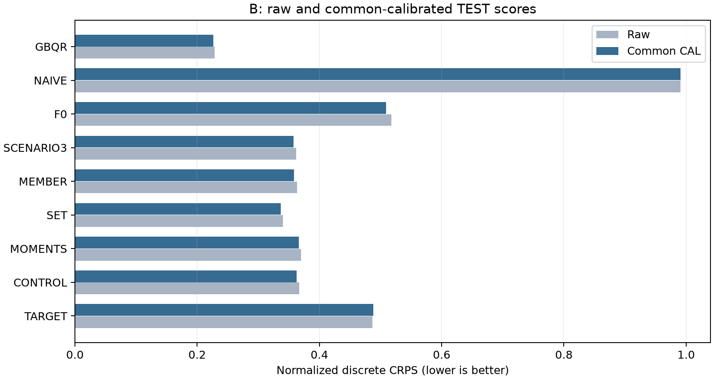

# B: 같은 issue 기상 앙상블 PEFT 결과

**[확인] GO_B_INFORMATION_ONLY — 미래 기상정보는 유용했지만 새 3시나리오 모듈의 추가 우위는 없었습니다.**

일반 학습의 효과: target-only LoRA는 frozen F0보다 CRPS +4.161% 개선됐습니다. 정보의 효과: CONTROL은 TARGET보다 +25.707%, 일반 SET은 +31.059%, 후보 SCENARIO3는 +26.688% 개선됐습니다. 일반 SET은 단일 CONTROL보다 +7.204% 개선됐지만 SET과 CONTROL은 head 용량도 달라 순수한 ensemble 정보만의 인과 추정은 아닙니다. 같은 E/C를 쓰는 MEMBER는 CONTROL보다 +1.149%(seed별 +1.251%/+1.050%) 개선돼 단순 멤버 혼합의 작은 추가 가치도 관찰됐습니다.

새 모듈의 효과: SCENARIO3는 CONTROL 대비 +1.320%, MOMENTS 대비 +2.334%, MEMBER 대비 +0.173%였지만, 같은 분포 용량의 일반 SET 대비 **-6.341%**, VAL로 고정한 GBQR 대비 **-57.977%**였습니다. 따라서 TARGET와의 큰 차이를 구조의 공로로 돌릴 수 없습니다. SET의 작은 모듈8,825개와 후보8,796개는 근사 용량 대조이며 완전히 같은 수라는 주장은 하지 않습니다.

실제 비용: SCENARIO3는 batch8 18.155ms, SET 18.111ms, GBQR 2.556ms입니다. 후보는 50개 MEMBER 혼합보다 빠르지만, 더 좋은 일반 SET보다 유의미하게 싸지 않고 통계 기준선보다 느립니다. GBQR는 동일 미래기상 권한의 강한 실용 대조이며, 작은 신경 모듈과 학습 알고리즘/목적이 같다는 인과 비교는 아닙니다. GBQR9개 고정 분위수 모델 fit은 42.312초이며 추가 탐색은 없습니다.

자료는 저자 저장소 고정 revision `9d1799ede894606ad349eb66e335d8a814eb8acf`의 **실제 SE3 wind_power MW**입니다. 같은 issue의 perturbed50members×8leads와 별도 control을 확인했습니다. Power time은 valid time이고 issue=time−horizon입니다. context 마지막은 issue−3h, 출력은 Bolt index1:9를 사용했습니다. 실제 packet1,679개/TRAIN1,074·CAL180·VAL183·TEST242, 기상 필드는 u100/v100/t2m/sp/speed입니다. [TIME_MAPPING_AUDIT.json](TIME_MAPPING_AUDIT.json)과 root 전체1679행 검산을 보존했습니다.

**RELEASE_TIME_UNVERIFIED: 아카이브 조건 파일럿입니다.** 저자 R 코드의 UTC와 archive issue는 확인했지만 실제 기상·power 공개 지연을 입증하지 못했습니다. 운영 backtest/배포 GO가 아닙니다. Onshore/Offshore 합성 목표나 다른 forecast vintage로 바꾸지 않았습니다. [SOURCE_LIMITS.md](SOURCE_LIMITS.md), [DATA_AUDIT.json](DATA_AUDIT.json)에 원자료 SHA와 제외 사유가 있습니다. README의 자료 안내가 모든 raw 재배포 권한을 증명하지 않으므로 raw를 push하지 않았습니다.

학습 한계: **모든 B neural arm에서 두 seed 평균 VAL이 0→128→256으로 계속 좋아져 OPTIMIZATION_LIMIT입니다.** 256 업데이트 화면에서 후보가 불리했다는 결론이며 충분히 학습된 모든 가능한 ensemble PEFT의 반증이 아닙니다. 이 사유로 예산을 늘리거나 설정을 바꾸지 않았습니다. [MONTH_SCORES.csv](MONTH_SCORES.csv)와 [LEAD_SCORES.csv](LEAD_SCORES.csv)에 달·lead별 결과를 남겼습니다.

두 반복 seed는 92301·92302이며 선택 전용 seed는 없습니다. 평균 개선율은 **두 seed 원점수 평균의 비율** `100×(1−candidate_mean/baseline_mean)`입니다. seed별 개선율의 평균이나 예측 ensemble 점수가 아닙니다. 고정 모델은 한 번 계산한 예측을 비교 상대에 재사용하며 독립 반복 2회로 부풀리지 않습니다.

V로 고정한 기준선 **GBQR** 대비 SCENARIO3의 CAL CRPS 개선율은 **-57.9767%**, 두 seed는 **-55.3540%, -60.5994%**입니다. 같은 상대 대비 median nMAE 개선율은 **-67.2285%**입니다. 음수 개선율은 악화입니다.

14개 origin 연속 블록을 2,000회 공동 재표집한 95% 구간은 **[-74.919%, -45.653%]**입니다. 두 seed와 모든 계열·lead를 같은 origin 블록에 묶었습니다. seed를 모집단처럼 bootstrap하지 않았으며, 이 구간은 두 학습 반복만으로 학습 불확실성을 충분히 추정하지 못합니다. 0 포함 여부만으로 GO/NO_GO를 바꾸지 않습니다.


왼쪽은 공통 CAL 후 TEST 품질과 batch8 실측 비용이고, 오른쪽은 동일 원점수에서 계산한 seed별 효과입니다. 지연시간은 선택된 seed92301 모델로 10회 warm-up/30회 측정, 순방향·역방향 순서를 합친 중앙값입니다. 품질은 두 seed 평균입니다.

```text
arm        raw_CRPS  CAL_CRPS  pinball   nMAE      raw_MAE   coverage80  width   batch8_ms  GPU_peak_MiB
TARGET     0.486524  0.487922  0.531002  0.685246  314.2232  0.8652      2.4785  17.494     218.70
CONTROL    0.367139  0.362492  0.393857  0.499759  229.1670  0.8332      1.9006  17.151     218.72
MOMENTS    0.370074  0.366256  0.399156  0.505458  231.7804  0.8471      2.0060  17.721     218.79
SET        0.340041  0.336376  0.366929  0.465803  213.5963  0.7683      1.4586  18.111     218.81
MEMBER     0.363054  0.358327  0.391145  0.497429  228.0987  0.8140      1.7907  25.584     219.00
SCENARIO3  0.361709  0.357706  0.391377  0.498307  228.5011  0.8205      1.8065  18.155     218.81
F0         0.517953  0.509104  0.554245  0.715561  328.1241  0.8848      2.6322  14.228     217.57
NAIVE      0.990598  0.990598  0.990598  0.990598  454.2438  0.0015      0.0000  0.294      33.02
GBQR       0.228658  0.226430  0.239126  0.297979  136.6400  0.7082      0.7719  2.556      33.02
```



CRPS는 선언한 유한 지지점 분포의 정확한 점수입니다. 분위수 출력에 동일 질량을 주는 근사가 포함되므로 연속분포 전체의 우위를 뜻하지 않습니다. pinball은 모든 군에 같은 .1–.9 left-inverse discrete-CDF readout을 적용했습니다. raw MAE는 Solar 원단위(A) 또는 MW(B), 나머지 오차는 TRAIN sigma로 정규화했습니다. 폭과 포함률, 음수 질량은 [SCORES.csv](SCORES.csv)에 보존했습니다. CAL이 TEST에서 항상 좋아지지는 않습니다.

### 선택·학습·비용

```text
arm        seed92301  seed92302
TARGET     256        256
CONTROL    256        256
MOMENTS    256        256
SET        256        256
MEMBER     256        256
SCENARIO3  256        256
```

raw VAL 0/128/256에서 checkpoint를 고르고, CAL에서만 35개 affine 계수 조합을 고른 뒤 보정된 VAL로 기준선을 정했습니다. 모든 선택 파일의 hash를 봉인한 후 TEST 예측을 저장했고, 진단용 A checkpoint0와 runtime까지 완료한 다음 채점했습니다. TEST 결과로 설정·보정·비교 상대를 바꾸지 않았습니다.

```text
arm        fits  updates  compute_s  fit_wall_s  trainable
TARGET     2     512      24.48      26.41       294912
CONTROL    2     512      25.21      27.15       299577
MOMENTS    2     512      25.25      27.20       300857
SET        2     512      26.02      27.95       303737
MEMBER     2     512      25.01      27.45       299577
SCENARIO3  2     512      26.14      28.21       303708
```

fit wall은 첫 checkpoint0 VAL 이후의 update·중간 VAL·checkpoint 저장을 포함하며, 사전 데이터/모델 준비 전체 시간이 아닙니다. [FIT_LEDGER.csv](FIT_LEDGER.csv)는 smoke도 별도 기록합니다. main12 fits/3,072 updates와 smoke12 updates를 정확히 사용했습니다.

비용은 RTX4070, FP32, TF32 off에서 CPU 입력 복사·기상 표준화·필요 H2D·모델·작은 모듈·D2H·CAL·9분위수 readout을 포함합니다. 파일 읽기와 모델 로딩은 제외했습니다. A 최초 F0 계산은 매번 포함하며, B는 target TSFM을 한 번만 계산하고 작은 멤버 모듈만 벡터화했습니다. GBQR는 공통 특징을 한 번 계산하고 9개 회귀기에 전달합니다. Chronos-2는 CPU 입력을 공식 API에 직접 주었습니다. 실제로 학습하지 않은 Chronos-2의 requires_grad 기본값을 학습 파라미터 수로 세지 않았습니다.

처음 측정에는 GBQR의 중복 특징 계산과 Chronos-2의 추가 전송이 있었습니다. [RESOURCES.csv](RESOURCES.csv)에 원기록을 보존했고, 최종 판단은 [RESOURCES_FAIR.csv](RESOURCES_FAIR.csv)를 사용합니다. TRAIN batch1·8에서 수정 전후 예측 차이 0을 검증했습니다. 재학습은 없었습니다. 두 실행의 allocator 상태 차이도 있어 메모리 차이를 이 두 최적화의 인과 효과로 해석하지 않습니다. CPU 모델의 GPU peak는 모델 크기가 아니며, 절대 CPU RAM은 별도 측정하지 않았습니다.

CAL 원래 실행의 별도 wall time은 계측되지 않았습니다. 4,200개 grid 평가를 재검산한 시간 0.301초를 별도로 남겼고 원래 실행 시간으로 대체하지 않았습니다.

### 검증과 해석 범위

[VERIFICATION.json](VERIFICATION.json)의 pairwise 정의와 정렬 CRPS 검산 최대 차이는 7.08e-15입니다. pairwise CRPS와 pinball은 각 군·seed·raw/CAL의 3개 위치에서 대조했습니다. 표의 개선율 전부, checkpoint·CAL·VAL 기준선·update intent/commit은 별도로 재검산했습니다. frozen backbone와 모든 buffer는 각 fit에서 불변이었습니다. 참조 CPU22검사 외 통합 CPU5검사, Chronos/GPU smoke, 저장·복원, gradient·시간 정렬 검사를 별도로 수행했습니다.

Main 이전 위임 범위 이탈은 [IMPLEMENTATION_INCIDENT.json](../IMPLEMENTATION_INCIDENT.json)에 보존했습니다. 잘못 호출된 runner는 main0 updates에서 중단됐고, 소스 복구와 root 재검산 후 최종 소스를 봉인했습니다. 실행된 smoke는 예산24에 포함했고 재실행하지 않았습니다. 삭제된 조기 봉인 파일 원본은 복구하지 못했다는 한계도 기록했습니다. 이 구현 사건과 최종 과학적 판정을 구분합니다.

선행 원리인 LoRA·분포 증류·집합 attention 자체의 신규성이나 논문 PASS는 주장하지 않습니다. 자동 후속 실험은 없습니다. 모든 예측/가중치 원본은 로컬 cache에 있고 GitHub에는 코드·표·그림·manifest·검산이 있습니다. GitHub만으로 원시 예측을 즉시 재채점할 수 있다는 뜻은 아닙니다.
