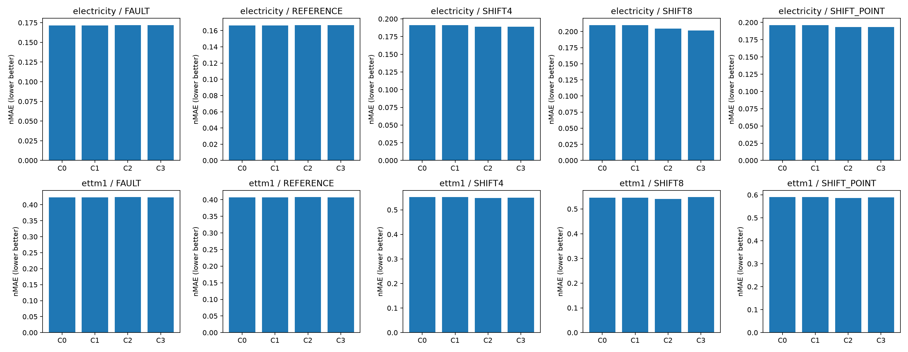
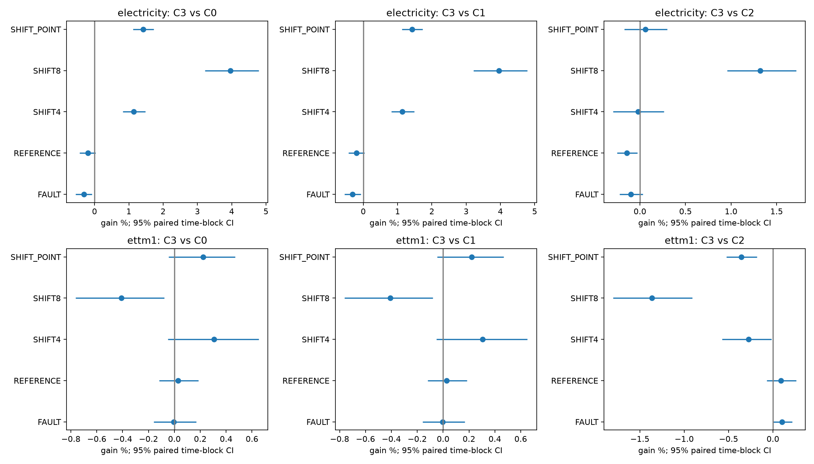

# B0 유지 + 추가 어댑터 비교 결과

실행 **COMPLETE**. 추가 학습 24/24경로, 본학습 24,576회와 smoke 검사 12회의 optimizer update를 완료했다. C0의 기존 학습·예측은 hash를 확인한 후 재사용했다. 학습 완료와 새 방법을 지지하는 근거는 구분한다.

**B0에 추가하는 방식에서 일부 실제 개선을 확인했다. 그러나 두 데이터에 공통으로 유리한 새 방법은 확인하지 못했다.** Electricity의 SHIFT8에서 C3는 B0 대비 nMAE를 **3.963%** 줄였고, 일반 어댑터 C2 대비로도 **1.318%** 줄였다. C3/C2 개선은 두 seed에서 각각 0.215%, 2.392%였으며, 날짜 block bootstrap 구간은 [0.958%, 1.714%]다. 이는 특정 합성 조건의 개발 근거이며 논문 PASS가 아니다.

| 조건 | C3의 B0 대비 오차 감소 | C3의 일반 어댑터 C2 대비 오차 감소 |
|---|---:|---:|
| Electricity FAULT | −0.312% | −0.100% |
| Electricity REFERENCE | −0.198% | −0.143% |
| Electricity SHIFT4 | +1.138% | −0.019% |
| Electricity SHIFT8 | +3.963% | +1.318% |
| Electricity SHIFT_POINT | +1.422% | +0.059% |
| ETTm1 FAULT | −0.004% | +0.103% |
| ETTm1 REFERENCE | +0.027% | +0.091% |
| ETTm1 SHIFT4 | +0.306% | −0.275% |
| ETTm1 SHIFT8 | −0.409% | −1.362% |
| ETTm1 SHIFT_POINT | +0.222% | −0.357% |

양수는 개선이고 음수는 악화다. 서로 다른 조건을 합친 종합 우승 점수는 만들지 않았다.

## 무엇을 비교했는가

사용자가 승인한 “잘되는 B0에 추가 요소가 얼마만큼 더해지는가”를 직접 시험했다. 원래 입력을 clipping하거나 교체하지 않았다. 이번 계약은 [PROTOCOL.md](PROTOCOL.md)이며, 구현 선택은 MACHINE_CONTRACT.json에 학습 전에 고정했다.

| 군 | 출발점 | 추가 학습 |
|---|---|---|
| C0 | 기존 selected B0 | 0; 저장 예측 참조 |
| C1 | 같은 source/seed B0 | 기존 q/v LoRA294,912개 추가 학습 |
| C2 | 같은 B0의 전체 가중치 동결 | 일반 residual adapter8,712개 |
| C3 | C2와 동일 초기값/크기 | persistence mask를 적용한 adapter8,712개 |

C2/C3는 512차원 patch embedding에 512→8→512 bottleneck residual을 더한다. 출력층의 weight와 bias를 0으로 초기화해 시작 예측이 B0와 bitwise 동일하다. C3만 residual에 1−mean_patch(p)를 곱한다. p는 과거 8개 관측 중 현재와 같은 부호의 극단값이 차지하는 비율이다. 원래 B0 경로는 유지하며, 지속적으로 큰 변화가 보이는 patch에서는 추가 보정을 줄인다. 8개 관측은 Electricity 8시간, ETTm1 2시간이다. 합성 오류·변화의 실제 생성 상태는 gate에 제공하지 않는다.

일반 residual adapter 및 near-identity 초기화는 알려진 구조다([Houlsby et al.](https://proceedings.mlr.press/v97/houlsby19a.html)). 이번 mask의 신규성을 검증한 것은 아니다. C3/C0 이득만으로 충분하지 않고 C3/C2, C3/C1에서 추가 필요성이 있어야 한다. 동결된 B0 가중치는 보존되지만 어댑터on일 때 예측 성능이 자동 보존되지는 않는다.

## 데이터·선택·정보 권한

기존 Electricity/ETTm1의 TRAIN 256일·V 64일·E 128일과 4채널, context 512/horizon 64, 고정된 Chronos-Bolt-small revision `772f3d25d38aec6d914c8949dab4462e2d46f5d8`을 사용했다. v2의 32 epochs 입력·정답과 V/E 변형 배열도 그대로 재사용했다. 실제 오류나 사건 레이블은 없다. 원래 깨끗한 입력, 생성 상태·mask·true delta·미래 정답을 어댑터 입력으로 제공하지 않았다.

B0의 출발 checkpoint도 기존 V 선택을 유지했다. 선택 seed 81550에서 두 LR(1e−4/3e−4)을 각 군에 동일하게 비교하고, 반복 seed 81551/81552에서는 선택된 LR만 사용했다. 각 군은 대응하는 source·seed의 동일한 B0 checkpoint에서 출발한다. C1을 포함해 모든 추가 학습의 optimizer moments는 0에서 새로 시작했다. 출발 checkpoint와 예측의 hash는 BASELINE_MANIFEST.json에 있다.

세 학습군 모두 32 epochs/1,024 updates, effective batch 32, FP32, TF32 off, dropout 0을 사용했다. AdamW(.9,.999), eps 1e−8, weight decay 0, gradient clip 1이며 스케줄러는 없다. loss는 TRAIN population sigma로 정규화한 2-pinball이다. V 선택은 REFERENCE/POINT8/BURST8/SHIFT4/SHIFT8의 동가중 nMAE이며 checkpoint 0/256/512/768/1024 중 고른다. 동률이면 작은 LR, 이른 checkpoint를 택한다. step 0을 선택하면 B0로 남으며 이를 새 요소의 개선으로 세지 않는다.

추가 학습 3군 × 2 source × (선택 LR 2개 + 반복 seed 2개) = 24경로다. 이전 B0 학습 8경로/8192 updates는 모든 군이 공유하는 기존 비용이며 이번에 반복하지 않았다. C2/C3의 8,712개는 추가 학습 파라미터 수다. 배포 시에는 기존 LoRA 294,912개도 남는다. 학습 파라미터 감소가 같은 비율의 계산량·메모리 감소를 뜻하지 않으므로 실측 자원을 별도로 보고한다.

E는 이미 여러 연구에 노출된 개발 기간이며 새로운 독립 test가 아니다. 새 12개 모델의 전체 E 예측을 먼저 저장하고 기존 C0의 4개 예측을 hash로 확인한 후 채점했다. ALL_E_PREDICTIONS_SAVED의 labels_scored=false는 채점 직전 시점의 기록이다. 채점 완료는 verification.json과 scores 파일에 기록돼 있다. 결과를 보고 seed·LR·방법·기간을 추가하지 않았다.

## 원점수와 추가 이득

두 반복 seed 평균 nMAE이며 낮을수록 좋다. FAULT는 POINT/BURST 6조건을 같은 비중으로 평균했다. SHIFT4, SHIFT8, 혼합 조건 SHIFT_POINT를 분리한다.

| source | arm | FAULT | REFERENCE | SHIFT4 | SHIFT8 | SHIFT_POINT |
| --- | --- | --- | --- | --- | --- | --- |
| electricity | C0 | 0.171460 | 0.166524 | 0.191307 | 0.210032 | 0.196221 |
| electricity | C1 | 0.171460 | 0.166524 | 0.191307 | 0.210032 | 0.196221 |
| electricity | C2 | 0.171823 | 0.166614 | 0.189093 | 0.204404 | 0.193546 |
| electricity | C3 | 0.171995 | 0.166853 | 0.189130 | 0.201709 | 0.193432 |
| ettm1 | C0 | 0.423198 | 0.407336 | 0.551405 | 0.545368 | 0.589807 |
| ettm1 | C1 | 0.423198 | 0.407336 | 0.551405 | 0.545368 | 0.589807 |
| ettm1 | C2 | 0.423652 | 0.407596 | 0.548210 | 0.540239 | 0.586404 |
| ettm1 | C3 | 0.423214 | 0.407226 | 0.549718 | 0.547599 | 0.588500 |

### seed별 원점수

| source | arm | seed | FAULT | REFERENCE | SHIFT4 | SHIFT8 | SHIFT_POINT |
| --- | --- | --- | --- | --- | --- | --- | --- |
| electricity | C0 | 81551 | 0.172141 | 0.167216 | 0.192475 | 0.208332 | 0.198464 |
| electricity | C0 | 81552 | 0.170779 | 0.165832 | 0.190140 | 0.211732 | 0.193979 |
| electricity | C1 | 81551 | 0.172141 | 0.167216 | 0.192475 | 0.208332 | 0.198464 |
| electricity | C1 | 81552 | 0.170779 | 0.165832 | 0.190140 | 0.211732 | 0.193979 |
| electricity | C2 | 81551 | 0.172552 | 0.167236 | 0.189279 | 0.201659 | 0.194687 |
| electricity | C2 | 81552 | 0.171093 | 0.165992 | 0.188907 | 0.207149 | 0.192404 |
| electricity | C3 | 81551 | 0.172842 | 0.167544 | 0.189504 | 0.201225 | 0.194662 |
| electricity | C3 | 81552 | 0.171147 | 0.166162 | 0.188756 | 0.202194 | 0.192202 |
| ettm1 | C0 | 81551 | 0.418994 | 0.404552 | 0.545947 | 0.538887 | 0.582183 |
| ettm1 | C0 | 81552 | 0.427402 | 0.410121 | 0.556863 | 0.551850 | 0.597431 |
| ettm1 | C1 | 81551 | 0.418994 | 0.404552 | 0.545947 | 0.538887 | 0.582183 |
| ettm1 | C1 | 81552 | 0.427402 | 0.410121 | 0.556863 | 0.551850 | 0.597431 |
| ettm1 | C2 | 81551 | 0.418994 | 0.404552 | 0.545947 | 0.538887 | 0.582183 |
| ettm1 | C2 | 81552 | 0.428310 | 0.410640 | 0.550473 | 0.541591 | 0.590625 |
| ettm1 | C3 | 81551 | 0.418994 | 0.404552 | 0.545947 | 0.538887 | 0.582183 |
| ettm1 | C3 | 81552 | 0.427435 | 0.409900 | 0.553489 | 0.556311 | 0.594816 |

### 제안 요소와 모든 직접 대조

양수 gain은 개선, 음수는 악화다. source별 7일 시간 block으로 2,000회 paired bootstrap을 수행했다. 같은 원점의 조건·채널·합성 draw를 독립 날짜로 세지 않는다. 두 optimizer seed를 각 bootstrap draw 안에서 평균하므로 이 구간이 optimizer seed 전체의 불확실성을 충분히 반영하지는 않는다. 구간에 0이 포함돼도 동등성의 증거는 아니다.

| source | new | baseline | panel | gain_pct | ci_low_pct | ci_high_pct | seed_81551_gain_pct | seed_81552_gain_pct |
| --- | --- | --- | --- | --- | --- | --- | --- | --- |
| electricity | C3 | C0 | FAULT | -0.311674 | -0.549450 | -0.074838 | -0.407259 | -0.215328 |
| electricity | C3 | C1 | FAULT | -0.311674 | -0.549450 | -0.074838 | -0.407259 | -0.215328 |
| electricity | C3 | C2 | FAULT | -0.100102 | -0.223405 | 0.031022 | -0.168277 | -0.031346 |
| electricity | C2 | C0 | FAULT | -0.211361 | -0.421146 | -0.031037 | -0.238581 | -0.183924 |
| electricity | C2 | C1 | FAULT | -0.211361 | -0.421146 | -0.031037 | -0.238581 | -0.183924 |
| electricity | C1 | C0 | FAULT | 0.000000 | 0.000000 | 0.000000 | 0.000000 | 0.000000 |
| electricity | C3 | C0 | REFERENCE | -0.197511 | -0.435384 | 0.032152 | -0.196097 | -0.198938 |
| electricity | C3 | C1 | REFERENCE | -0.197511 | -0.435384 | 0.032152 | -0.196097 | -0.198938 |
| electricity | C3 | C2 | REFERENCE | -0.143269 | -0.252897 | -0.029497 | -0.184255 | -0.101977 |
| electricity | C2 | C0 | REFERENCE | -0.054164 | -0.256854 | 0.120909 | -0.011820 | -0.096862 |
| electricity | C2 | C1 | REFERENCE | -0.054164 | -0.256854 | 0.120909 | -0.011820 | -0.096862 |
| electricity | C1 | C0 | REFERENCE | 0.000000 | 0.000000 | 0.000000 | 0.000000 | 0.000000 |
| electricity | C3 | C0 | SHIFT4 | 1.138286 | 0.821154 | 1.486305 | 1.543903 | 0.727687 |
| electricity | C3 | C1 | SHIFT4 | 1.138286 | 0.821154 | 1.486305 | 1.543903 | 0.727687 |
| electricity | C3 | C2 | SHIFT4 | -0.019448 | -0.294072 | 0.264273 | -0.118786 | 0.080087 |
| electricity | C2 | C0 | SHIFT4 | 1.157509 | 0.771435 | 1.556634 | 1.660716 | 0.648120 |
| electricity | C2 | C1 | SHIFT4 | 1.157509 | 0.771435 | 1.556634 | 1.660716 | 0.648120 |
| electricity | C1 | C0 | SHIFT4 | 0.000000 | 0.000000 | 0.000000 | 0.000000 | 0.000000 |
| electricity | C3 | C0 | SHIFT8 | 3.962752 | 3.219359 | 4.788023 | 3.411553 | 4.505100 |
| electricity | C3 | C1 | SHIFT8 | 3.962752 | 3.219359 | 4.788023 | 3.411553 | 4.505100 |
| electricity | C3 | C2 | SHIFT8 | 1.318388 | 0.957519 | 1.714223 | 0.215471 | 2.392078 |
| electricity | C2 | C0 | SHIFT8 | 2.679693 | 2.074448 | 3.340210 | 3.202984 | 2.164806 |
| electricity | C2 | C1 | SHIFT8 | 2.679693 | 2.074448 | 3.340210 | 3.202984 | 2.164806 |
| electricity | C1 | C0 | SHIFT8 | 0.000000 | 0.000000 | 0.000000 | 0.000000 | 0.000000 |
| electricity | C3 | C0 | SHIFT_POINT | 1.421659 | 1.125537 | 1.730519 | 1.915804 | 0.916091 |
| electricity | C3 | C1 | SHIFT_POINT | 1.421659 | 1.125537 | 1.730519 | 1.915804 | 0.916091 |
| electricity | C3 | C2 | SHIFT_POINT | 0.058800 | -0.173441 | 0.299513 | 0.013332 | 0.104808 |
| electricity | C2 | C0 | SHIFT_POINT | 1.363660 | 1.063190 | 1.671218 | 1.902725 | 0.812134 |
| electricity | C2 | C1 | SHIFT_POINT | 1.363660 | 1.063190 | 1.671218 | 1.902725 | 0.812134 |
| electricity | C1 | C0 | SHIFT_POINT | 0.000000 | 0.000000 | 0.000000 | 0.000000 | 0.000000 |
| ettm1 | C3 | C0 | FAULT | -0.003968 | -0.158494 | 0.167782 | 0.000000 | -0.007858 |
| ettm1 | C3 | C1 | FAULT | -0.003968 | -0.158494 | 0.167782 | 0.000000 | -0.007858 |
| ettm1 | C3 | C2 | FAULT | 0.103226 | 0.000550 | 0.216938 | 0.000000 | 0.204207 |
| ettm1 | C2 | C0 | FAULT | -0.107305 | -0.324571 | 0.119202 | 0.000000 | -0.212499 |
| ettm1 | C2 | C1 | FAULT | -0.107305 | -0.324571 | 0.119202 | 0.000000 | -0.212499 |
| ettm1 | C1 | C0 | FAULT | 0.000000 | 0.000000 | 0.000000 | 0.000000 | 0.000000 |
| ettm1 | C3 | C0 | REFERENCE | 0.027190 | -0.117596 | 0.184782 | 0.000000 | 0.054010 |
| ettm1 | C3 | C1 | REFERENCE | 0.027190 | -0.117596 | 0.184782 | 0.000000 | 0.054010 |
| ettm1 | C3 | C2 | REFERENCE | 0.090843 | -0.067781 | 0.261757 | 0.000000 | 0.180338 |
| ettm1 | C2 | C0 | REFERENCE | -0.063711 | -0.277043 | 0.142604 | 0.000000 | -0.126557 |
| ettm1 | C2 | C1 | REFERENCE | -0.063711 | -0.277043 | 0.142604 | 0.000000 | -0.126557 |
| ettm1 | C1 | C0 | REFERENCE | 0.000000 | 0.000000 | 0.000000 | 0.000000 | 0.000000 |
| ettm1 | C3 | C0 | SHIFT4 | 0.305940 | -0.050744 | 0.651651 | 0.000000 | 0.605883 |
| ettm1 | C3 | C1 | SHIFT4 | 0.305940 | -0.050744 | 0.651651 | 0.000000 | 0.605883 |
| ettm1 | C3 | C2 | SHIFT4 | -0.275016 | -0.575178 | -0.016904 | 0.000000 | -0.547771 |
| ettm1 | C2 | C0 | SHIFT4 | 0.579363 | 0.099837 | 1.068011 | 0.000000 | 1.147369 |
| ettm1 | C2 | C1 | SHIFT4 | 0.579363 | 0.099837 | 1.068011 | 0.000000 | 1.147369 |
| ettm1 | C1 | C0 | SHIFT4 | 0.000000 | 0.000000 | 0.000000 | 0.000000 | 0.000000 |
| ettm1 | C3 | C0 | SHIFT8 | -0.408978 | -0.762633 | -0.079487 | 0.000000 | -0.808349 |
| ettm1 | C3 | C1 | SHIFT8 | -0.408978 | -0.762633 | -0.079487 | 0.000000 | -0.808349 |
| ettm1 | C3 | C2 | SHIFT8 | -1.362384 | -1.800976 | -0.909031 | 0.000000 | -2.717967 |
| ettm1 | C2 | C0 | SHIFT8 | 0.940592 | 0.449981 | 1.424374 | 0.000000 | 1.859089 |
| ettm1 | C2 | C1 | SHIFT8 | 0.940592 | 0.449981 | 1.424374 | 0.000000 | 1.859089 |
| ettm1 | C1 | C0 | SHIFT8 | 0.000000 | 0.000000 | 0.000000 | 0.000000 | 0.000000 |
| ettm1 | C3 | C0 | SHIFT_POINT | 0.221707 | -0.045400 | 0.468101 | 0.000000 | 0.437755 |
| ettm1 | C3 | C1 | SHIFT_POINT | 0.221707 | -0.045400 | 0.468101 | 0.000000 | 0.437755 |
| ettm1 | C3 | C2 | SHIFT_POINT | -0.357335 | -0.522173 | -0.180518 | 0.000000 | -0.709562 |
| ettm1 | C2 | C0 | SHIFT_POINT | 0.576979 | 0.208958 | 0.929816 | 0.000000 | 1.139233 |
| ettm1 | C2 | C1 | SHIFT_POINT | 0.576979 | 0.208958 | 0.929816 | 0.000000 | 1.139233 |
| ettm1 | C1 | C0 | SHIFT_POINT | 0.000000 | 0.000000 | 0.000000 | 0.000000 | 0.000000 |

SHIFT 평균, history subset, 원점수 차이와 block 수는 paired_effects.csv에 있다. raw MAE, channel NRMSE, 2-pinball, crossing은 scores_by_condition.csv에 10조건·seed별로 보존했다. 출력에 별도 보정이나 quantile sorting을 적용하지 않았다. 서로 다른 source·목표를 합쳐 우승자를 만들지 않았다.

## 구성요소와 학습량의 해석

1. **기존 방법에 추가하는 접근의 효과:** C2는 Electricity의 SHIFT4/SHIFT8/SHIFT_POINT에서 B0보다 각각 1.158%/2.680%/1.364% 개선했다. ETTm1에서도 해당 조건의 평균 개선은 0.579%/0.941%/0.577%였다. 다만 ETTm1의 한 seed는 C2의 step 0을 선택했으므로 두 번의 비영 개선이 반복됐다고 말할 수 없다. FAULT의 평균은 두 source 모두 약간 나빠졌다. 일반 어댑터 자체에도 이득과 손해가 있다.
2. **단순 추가 학습의 효과:** C1의 네 반복 모델은 모두 step 0을 선택했고 저장된 B0와 동일한 원점수가 나왔다. 정해진 LR·예산·V 선택에서 LoRA를 더 학습한 것만으로 설명되는 이득은 없었다. C1도 네 반복 각각 1,024 updates를 끝까지 실행했다.
3. **새 persistence 요소의 추가 가치:** Electricity SHIFT8의 C3/C2 개선은 두 seed에서 같은 방향이다. C3의 V 진단에서도 mask를 없애거나 순서를 섞으면 SHIFT8 오차가 각각 평균 3.079%/2.937% 증가했다. 해당 source·합성 조건에서 mask가 추가 가치에 관여한다는 일관된 단서는 있다. 그러나 Electricity의 다른 조건에서는 C2 대비 개선이 없거나 작고, REFERENCE는 0.143% 나빠졌다. ETTm1의 SHIFT8은 C2보다 1.362%, B0보다 0.409% 나빠졌다. 따라서 mask의 일반적인 우월성을 지지하지 않는다.
4. **실패를 줄인 점과 남은 한계:** 시작 시에는 B0와 정확히 같고 어댑터를 끄면 학습된 B0가 정확히 복원됐다. 원래 입력을 clipping하지 않아 이전 복원 구조의 문제를 그대로 요구하지 않는다. 하지만 초기 동일성과 가중치 보존은 학습 후 예측의 비열등성을 보장하지 않는다. 관측 과거의 persistence만으로 오류와 실제 변화를 완벽히 구분할 수 있다는 증거도 없다.
5. **자원 절충:** 추가 학습 파라미터는 C1의 294,912개에서 C2/C3의 8,712개로 97.05% 줄었다. 반복 학습의 C3 실측 compute는 source별 약 32.0초로 C1의 36.5~37.0초보다 작았지만, allocated GPU peak는 약 362MiB 대 371MiB로 차이가 작았다. C3의 E 추론은 약 4.23초로 C2의 4.01~4.02초보다 느렸다. GPU 메모리 수치는 PyTorch allocated peak이며 드라이버·화면 전체 사용량과 다르다.

모든 구간은 기존에 노출된 개발 E다. 여러 source·조건·대조를 함께 살폈고 multiplicity 보정을 한 확증 검정이 아니다. 시간 block 구간은 조건부 불확실성이며 두 optimizer seed 전체의 불확실성을 충분히 표현하지 못한다. 특히 ETTm1의 C2/C3는 한 seed에서만 nonzero adapter가 선택됐다. 따라서 특정 양의 구간 하나를 보편적 성능이나 통과 판정으로 확대하지 않는다.

선택된checkpoint:

| source | arm | seed | lr | step | objective |
| --- | --- | --- | --- | --- | --- |
| electricity | C1 | 81551 | 0.000300 | 0 | 0.216153 |
| electricity | C1 | 81552 | 0.000300 | 0 | 0.215599 |
| electricity | C2 | 81551 | 0.000300 | 512 | 0.213771 |
| electricity | C2 | 81552 | 0.000300 | 1024 | 0.213632 |
| electricity | C3 | 81551 | 0.000300 | 768 | 0.213386 |
| electricity | C3 | 81552 | 0.000300 | 768 | 0.212074 |
| ettm1 | C1 | 81551 | 0.000100 | 0 | 0.406025 |
| ettm1 | C1 | 81552 | 0.000100 | 0 | 0.411657 |
| ettm1 | C2 | 81551 | 0.000300 | 0 | 0.406025 |
| ettm1 | C2 | 81552 | 0.000300 | 1024 | 0.408721 |
| ettm1 | C3 | 81551 | 0.000100 | 0 | 0.406025 |
| ettm1 | C3 | 81552 | 0.000100 | 1024 | 0.411562 |

선택된 C3의 V 입력에 p=0(추가 residual을 감쇠하지 않음) 또는 고정 permutation을 적용한 진단이다. optimizer update는 0회다. 양수는 해당 조작 시 오차 증가를 뜻한다. mask 의존성을 확인하는 보조 근거이며, C2보다 나은지는 직접 비교로 판단한다.

| source | condition | mode | normal_nmae | altered_nmae | error_increase_pct |
| --- | --- | --- | --- | --- | --- |
| electricity | BURST8 | permute | 0.206324 | 0.205981 | -0.165952 |
| electricity | BURST8 | zero | 0.206324 | 0.206011 | -0.151829 |
| electricity | POINT8 | permute | 0.195569 | 0.195348 | -0.112644 |
| electricity | POINT8 | zero | 0.195569 | 0.195347 | -0.112827 |
| electricity | REFERENCE | permute | 0.193319 | 0.193058 | -0.134920 |
| electricity | REFERENCE | zero | 0.193319 | 0.193072 | -0.127682 |
| electricity | SHIFT4 | permute | 0.224376 | 0.224600 | 0.098622 |
| electricity | SHIFT4 | zero | 0.224376 | 0.224681 | 0.134578 |
| electricity | SHIFT8 | permute | 0.244062 | 0.251292 | 2.937212 |
| electricity | SHIFT8 | zero | 0.244062 | 0.251641 | 3.079247 |
| ettm1 | BURST8 | permute | 0.363434 | 0.363311 | -0.033251 |
| ettm1 | BURST8 | zero | 0.363434 | 0.363266 | -0.045442 |
| ettm1 | POINT8 | permute | 0.363154 | 0.363104 | -0.013512 |
| ettm1 | POINT8 | zero | 0.363154 | 0.363077 | -0.020936 |
| ettm1 | REFERENCE | permute | 0.349318 | 0.349257 | -0.017138 |
| ettm1 | REFERENCE | zero | 0.349318 | 0.349207 | -0.031583 |
| ettm1 | SHIFT4 | permute | 0.487365 | 0.485633 | -0.359498 |
| ettm1 | SHIFT4 | zero | 0.487365 | 0.485074 | -0.475510 |
| ettm1 | SHIFT8 | permute | 0.480697 | 0.480852 | 0.031726 |
| ettm1 | SHIFT8 | zero | 0.480697 | 0.480920 | 0.045569 |

## 자원 및 검산

두 반복 seed의 평균 추가 자원:

| source | arm | trainable_parameters | additional_train_seconds | validation_seconds | train_peak_allocated_mib | E_inference_seconds | E_peak_allocated_mib |
| --- | --- | --- | --- | --- | --- | --- | --- |
| electricity | C1 | 294912.000000 | 36.951761 | 4.932374 | 370.849121 | 3.912014 | 234.459961 |
| electricity | C2 | 8712.000000 | 31.405276 | 5.038290 | 362.108887 | 4.007077 | 234.497559 |
| electricity | C3 | 8712.000000 | 32.044700 | 5.300331 | 362.108887 | 4.230971 | 234.497559 |
| ettm1 | C1 | 294912.000000 | 36.463353 | 4.910749 | 370.849121 | 3.887841 | 234.459961 |
| ettm1 | C2 | 8712.000000 | 31.495033 | 5.048465 | 362.108887 | 4.021300 | 234.497559 |
| ettm1 | C3 | 8712.000000 | 32.021508 | 5.327079 | 362.108887 | 4.233715 | 234.497559 |

추가본학습compute 799.33초, V 122.10초, checkpointI/O 4.65초, 새E추론 48.59초. 본실행wall 19.60분. C0는예측cache를재사용했으므로이번추론시간을0초모델로해석하지않는다. 기존B0학습비용도shared_baseline_cost.json에별도로남겼다.

최소GPU여유 8329MiB,허용되지않은외부compute표본 0개. RustDesk만기존승인예외다. 새cache 0.474GiB,기존data/model/checkpoint는공유한다.

CPU수학검사4개,6개의출발B0×3학습군초기bitwise parity,12smoke updates의gradient·frozenB0보존·restore·batch permutation을검사했다. main24,576 unique journal,독립scalar 1280행×2지표,선택12checkpoint복원,추가adapter8개의off시기존저장B0E예측정확복원,기존C0원점수재검산과LR선택재계산을통과했다. 기존결과·학습표본·checkpoint hash도그대로다. 허용오차는실행전FP32normalizedmax1e−5또는rtol1e−4,CPUrtol1e−10/atol1e−12로고정했다. 초기/off B0복원은bitwise같음을요구했다.

필수 미실행 범위는 없다. 독립된 미사용 기간·source·backbone 검증, 실제 오류 레이블, 가장 가까운 선행 방법과의 정식 비교는 이번 범위에 없으며 실행하지 않았다. 원자료·weights·prediction은 로컬 ignored cache에 보존하고 GitHub에는 manifest·점수·검산을 공개한다. GitHub만으로 cache 전체를 복원할 수 있다는 뜻은 아니다.

## 그림

## 최종 판단

**이번 비교를 완료하고 추가 자동 실험을 종료한다.** “잘되는 B0에 더해서 개선할 수 있는가”에는 **일부 조건에서 그렇다**는 결과가 나왔다. “새 persistence 요소가 일반 어댑터보다 넓게 우수한가”에는 **아직 아니다**가 현재 답이다.

C3를 범용 robust PEFT 후보로 승격하거나 B0의 기본 대체물로 채택하지 않는다. 반대로 모든 결과를 하나의 FAIL로 지워 Electricity SHIFT8의 직접 추가 이득까지 폐기하지도 않는다. C3는 해당 합성 조건에서 추가 근거가 있는 구현으로 보존한다. C2는 일반 어댑터의 충분성을 판단할 핵심 대조군으로 남긴다. ETTm1에서는 persistent-shift 조건에 일반 어댑터 C2가 C3보다 낫다는 결과를 함께 유지한다.

신규 방법의 논문 성공이나 독립적인 일반화 성공은 미확인이다. 일반 residual adapter는 알려진 구조이고, 여기서 추가한 persistence mask의 신규성은 정식 선행 비교로 입증하지 않았다. 독립 source·미사용 기간과 실제 사건 레이블의 검증도 남아 있다. 이 작업에서 새 데이터·추가 seed·새 LR·새 구조는 시작하지 않는다.

새 어댑터가 나빠도 모든 robust PEFT를 반증한 것은 아니다. 좋아도 실제 센서 오류·regime change 해결이나 논문 PASS를 뜻하지 않는다. 다음 후보나 추가 학습은 자동으로 실행하지 않는다.
