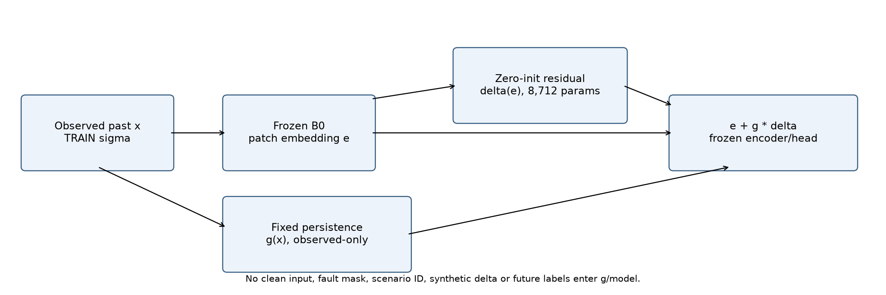
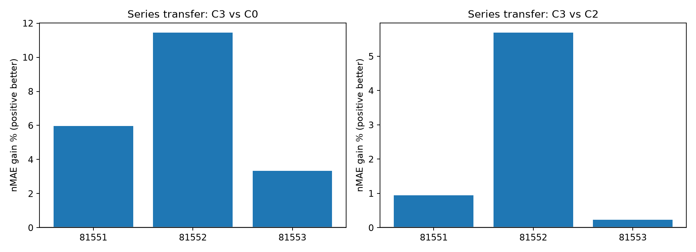
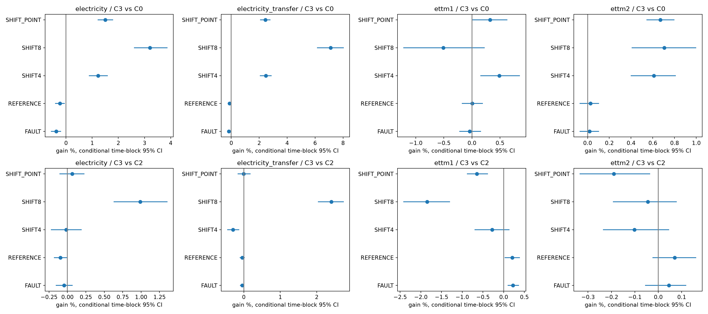
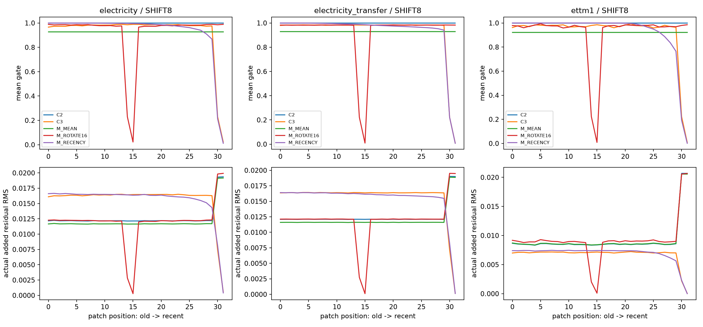
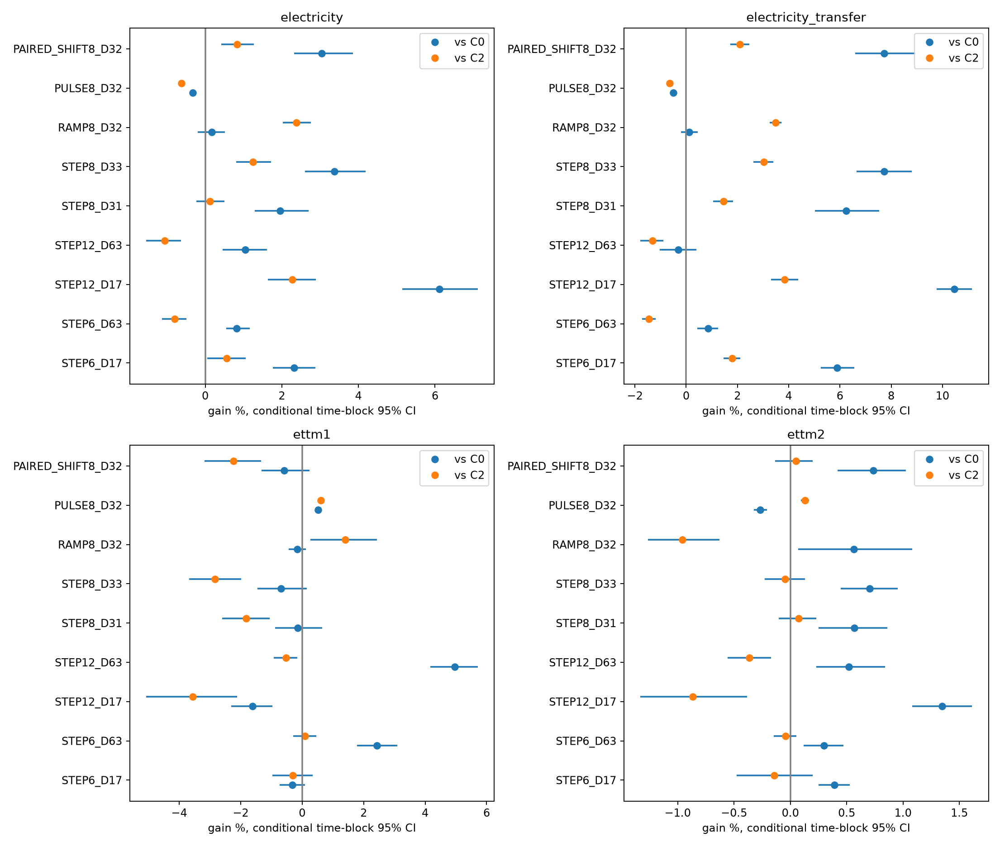

# 지속성 마스크 추가 적응 — 논문 후속 검증

실행 COMPLETE. 새 본학습 **58/58경로, 59,392 updates**, 폐기용 smoke **36 updates**, 전체 **59,428 updates**. 기존 B0/C1/C2/C3를 중복 학습하지 않았다. 모든 평가 예측 저장 후 채점하고 독립 검산까지 완료했다. 실행 성공과 방법의 과학적 근거를 구분한다.

**전력 SHIFT8의 좁은 추가 이득은 재확인됐다. 범용 강건성이나 논문 PASS는 아니다.** 원래 네 계열에서 세 seed 평균 C3는 B0 대비3.205459%, 일반 어댑터 C2 대비0.988079% 개선했다. 추가16계열에서는 B0 대비7.112013%, C2 대비2.399429% 개선했고 세 seed의 C3/C2 효과가 모두 양수였다. 일반 추가 어댑터 자체의 C2/B0 이득4.828439%와 지속성 규칙의 추가 이득을 구분한다.

RECENCY 대비 추가 이득은 전이 평균0.180396%에 그쳤고 세 번째 seed는−0.019538%였다. ETTm1 SHIFT8에서 C2 대비1.847203% 악화했고 ETTm2에서는−0.044834%로 구간이0을 포함했다. 원자료·오류 조건과 긴 변화·pulse의 손해도 남았다. 따라서 좁은 기존 문제의 초안/정식 비교 검토 근거는 남기되 범용 새 PEFT 방법의 성공으로 결론내리지 않는다.

## 계약·자료·가중치

유일한 계약은 [MASTER_CLI.txt](MASTER_CLI.txt)다. 기존 C3의 구조·mask·rank·threshold·window를 바꾸지 않았다. 잘 학습된 B0와 원래 관측 입력을 유지하고, 오프라인 추가 적응 후 평가 중에는 정답으로 업데이트하지 않는다. 시작 시 delta=0이며 어댑터 off로 B0를 복원할 수 있지만, 학습 후 성능 보존을 수학적으로 보장하지는 않는다.

C0는 이미 적응된 B0, C1은 같은 B0의 LoRA 추가 학습, C2는 B0 동결+일반 어댑터, C3는 같은 어댑터에 고정 관측 지속성 mask를 적용한 것이다. 새 MEAN/ROTATE16/RECENCY는 보정량·위치·최근성 설명의 대조이며 새 후보가 아니다. 어댑터8,712개 외에 기존 B0 LoRA294,912개가 남아 배포 적응 파라미터는303,624개다.

원래 Electricity/ETTm1의 TRAIN256/V64/E128일과4채널을 그대로 재사용했다. 추가 Electricity16계열은 원래 B0의 미학습 계열이지만 미사용 이력이 검증된 계열은0개다. 명세에 따라 hash순 fallback 탐색 패널로 선택했고 과거 성능 노출 확인4개와 노출 불명12개를 모두 유지했다. 같은 E 날짜를 사용하고 대상 TRAIN sigma에도 접근하므로 새로운 독립 자료나 target-data-free 전이가 아니다. 물리적 meter group은 없으며 계열 ID 분리만 확인했다. 사전학습 원천 중복은 UNKNOWN_PRETRAINING_OVERLAP이다.

ETTm2는 공식 commit/hash와 기존 로컬 파일이 같고 실제15분 간격·중복 없음·69,680행을 확인했다. 다른 변압기 지점이지만 같은 ETT 계열이며 이전 연구에서 이미 성능을 본 자료다. 별도 B0 학습 후 같은 적응 절차를 적용한 재현이고 ETTm1 가중치의 zero-training transfer가 아니다. TRAIN/V/E의60/20/20 분할은 통상 ETT benchmark split이라고 부르지 않는다. target은 HUFL/HULL/MUFL/MULL의 pooled univariate 예측이며 OT forecasting이 아니다.

계열 ID·원점 분산·출처·과거 노출은 [SERIES_PANEL_MANIFEST.json](SERIES_PANEL_MANIFEST.json), [DATA_EXPOSURE_MANIFEST.csv](DATA_EXPOSURE_MANIFEST.csv), [ORIGIN_AUDIT.csv](ORIGIN_AUDIT.csv), [ETTM2_DATA_RECEIPT.json](ETTM2_DATA_RECEIPT.json)에 있다. 미래 성능으로 계열·날짜를 골라 바꾸지 않았다. 실제 오류·사건 레이블은 없다.

## 실행과 선택

원래 두 source의 세 번째 seed81553 B0/core8경로 → 세 기전 대조30경로 → ETTm2 B0/core20경로 순서로 완료했다. 그중 새 B0는7경로다. main58경로 모두1,024updates를 실행했으며 불리한 중간 성능 때문에 생략하지 않았다. 선택 seed는 기존81550, ETTm2 85550이고 반복 ETTm2는85551/85552/85553이다.

모든 군이 같은 matched TRAIN 입력·정답·상태 빈도·순서와 초기 어댑터를 공유했다. FP32/TF32off/dropout0, effectivebatch32, AdamW(.9,.999), eps1e−8, wd0, clipnorm1, scheduler없음이다. 실제 microbatch는 세 source 모두32였다. LR1e−4/3e−4와 checkpoint0/256/512/768/1024, 다섯 V 조건 동가중 nMAE 선택을 유지했다. 원래 source의 core 세 번째 seed는 기존 LR 선택을 상속했다. C1 optimizer moments는 새로 시작했다.

step0은 B0 유지이며 새 요소의 개선으로 세지 않는다. fixed1024 결과는 별도 [FIXED1024_COMPARISON.csv](FIXED1024_COMPARISON.csv)에 보존했고 E에서 더 나은 쪽으로 주 결과를 바꾸지 않았다. full prediction manifest는246개 view로, 기존 가중치/예측과 동일 checkpoint의 alias, 출력 대조, 동일 과거 PULSE 재사용을 포함한다. 이를246개 새 학습이나246개 독립 모델로 세지 않는다.

선택 checkpoint:

| source | arm | seed | lr | step |
| --- | --- | --- | --- | --- |
| electricity | C1 | 81551 | 0.000300 | 0 |
| electricity | C1 | 81552 | 0.000300 | 0 |
| electricity | C2 | 81551 | 0.000300 | 512 |
| electricity | C2 | 81552 | 0.000300 | 1024 |
| electricity | C3 | 81551 | 0.000300 | 768 |
| electricity | C3 | 81552 | 0.000300 | 768 |
| ettm1 | C1 | 81551 | 0.000100 | 0 |
| ettm1 | C1 | 81552 | 0.000100 | 0 |
| ettm1 | C2 | 81551 | 0.000300 | 0 |
| ettm1 | C2 | 81552 | 0.000300 | 1024 |
| ettm1 | C3 | 81551 | 0.000100 | 0 |
| ettm1 | C3 | 81552 | 0.000100 | 1024 |
| electricity | C0 | 81551 | 0.000300 | 768 |
| electricity | C0 | 81552 | 0.000300 | 512 |
| ettm1 | C0 | 81551 | 0.000100 | 768 |
| ettm1 | C0 | 81552 | 0.000100 | 1024 |
| electricity | C0 | 81553 | 0.000300 | 1024 |
| electricity | C1 | 81553 | 0.000300 | 0 |
| electricity | C2 | 81553 | 0.000300 | 1024 |
| electricity | C3 | 81553 | 0.000300 | 1024 |
| ettm1 | C0 | 81553 | 0.000100 | 768 |
| ettm1 | C1 | 81553 | 0.000100 | 0 |
| ettm1 | C2 | 81553 | 0.000300 | 768 |
| ettm1 | C3 | 81553 | 0.000100 | 1024 |
| electricity | M_MEAN | 81551 | 0.000300 | 512 |
| electricity | M_MEAN | 81552 | 0.000300 | 1024 |
| electricity | M_MEAN | 81553 | 0.000300 | 1024 |
| electricity | M_ROTATE16 | 81551 | 0.000300 | 512 |
| electricity | M_ROTATE16 | 81552 | 0.000300 | 1024 |
| electricity | M_ROTATE16 | 81553 | 0.000300 | 1024 |
| electricity | M_RECENCY | 81551 | 0.000300 | 768 |
| electricity | M_RECENCY | 81552 | 0.000300 | 768 |
| electricity | M_RECENCY | 81553 | 0.000300 | 1024 |
| ettm1 | M_MEAN | 81551 | 0.000300 | 0 |
| ettm1 | M_MEAN | 81552 | 0.000300 | 1024 |
| ettm1 | M_MEAN | 81553 | 0.000300 | 768 |
| ettm1 | M_ROTATE16 | 81551 | 0.000300 | 0 |
| ettm1 | M_ROTATE16 | 81552 | 0.000300 | 1024 |
| ettm1 | M_ROTATE16 | 81553 | 0.000300 | 768 |
| ettm1 | M_RECENCY | 81551 | 0.000100 | 0 |
| ettm1 | M_RECENCY | 81552 | 0.000100 | 1024 |
| ettm1 | M_RECENCY | 81553 | 0.000100 | 1024 |
| ettm2 | C0 | 85551 | 0.000100 | 512 |
| ettm2 | C0 | 85552 | 0.000100 | 512 |
| ettm2 | C0 | 85553 | 0.000100 | 512 |
| ettm2 | C1 | 85551 | 0.000100 | 256 |
| ettm2 | C1 | 85552 | 0.000100 | 0 |
| ettm2 | C1 | 85553 | 0.000100 | 0 |
| ettm2 | C2 | 85551 | 0.000100 | 1024 |
| ettm2 | C2 | 85552 | 0.000100 | 0 |
| ettm2 | C2 | 85553 | 0.000100 | 0 |
| ettm2 | C3 | 85551 | 0.000100 | 768 |
| ettm2 | C3 | 85552 | 0.000100 | 0 |
| ettm2 | C3 | 85553 | 0.000100 | 0 |

V에서 선택한 출력 대조:

| source_seed | alpha | beta |
| --- | --- | --- |
| electricity_81551 | 1.000000 | 0.002598 |
| electricity_81552 | 1.000000 | 0.000887 |
| electricity_81553 | 0.750000 | 0.001890 |
| ettm1_81551 | 0.000000 | -0.004731 |
| ettm1_81552 | 1.000000 | -0.003187 |
| ettm1_81553 | 1.000000 | 0.001885 |
| ettm2_85551 | 1.000000 | -0.001623 |
| ettm2_85552 | 0.000000 | -0.000467 |
| ettm2_85553 | 0.000000 | 0.000088 |

C2_SHRINK는 원래 source V에서 alpha∈{0,.25,.5,.75,1}를 선택하고 동률이면 작은 alpha를 썼다. alpha0/1은 C0/C2와 동일하다. C0_BIAS는 같은 V 조건의 normalized median residual 한 개다. target transfer V/E로 다시 선택하지 않았다. 두 대조는 COSA 또는 TATO 전체 재현이 아니다.

## T1. 기존 관찰·계열 전이·세 번째 seed

아래 nMAE는 낮을수록 좋다. FAULT는 POINT/BURST6조건 동가중이다. source와 목표를 섞은 종합 우승 점수는 없다.

세 seed 평균 core 원점수:

| panel | seed_scope | arm | FAULT | REFERENCE | SHIFT4 | SHIFT8 | SHIFT_POINT |
| --- | --- | --- | --- | --- | --- | --- | --- |
| electricity | all3 | C0 | 0.172251 | 0.167110 | 0.191848 | 0.207544 | 0.196577 |
| electricity | all3 | C1 | 0.172251 | 0.167110 | 0.191848 | 0.207544 | 0.196577 |
| electricity | all3 | C2 | 0.172812 | 0.167338 | 0.189463 | 0.202896 | 0.193753 |
| electricity | all3 | C3 | 0.172893 | 0.167496 | 0.189495 | 0.200891 | 0.193630 |
| electricity_transfer | all3 | C0 | 0.257960 | 0.242005 | 0.328048 | 0.386121 | 0.343452 |
| electricity_transfer | all3 | C1 | 0.257960 | 0.242005 | 0.328048 | 0.386121 | 0.343452 |
| electricity_transfer | all3 | C2 | 0.258294 | 0.242189 | 0.318977 | 0.367478 | 0.335079 |
| electricity_transfer | all3 | C3 | 0.258406 | 0.242293 | 0.319916 | 0.358660 | 0.335089 |
| ettm1 | all3 | C0 | 0.421938 | 0.406544 | 0.549134 | 0.544575 | 0.587048 |
| ettm1 | all3 | C1 | 0.421938 | 0.406544 | 0.549134 | 0.544575 | 0.587048 |
| ettm1 | all3 | C2 | 0.423055 | 0.407354 | 0.544939 | 0.537419 | 0.581408 |
| ettm1 | all3 | C3 | 0.422099 | 0.406513 | 0.546446 | 0.547346 | 0.585155 |
| ettm2 | all3 | C0 | 0.298071 | 0.292735 | 0.349555 | 0.327246 | 0.358410 |
| ettm2 | all3 | C1 | 0.299909 | 0.294510 | 0.344207 | 0.327025 | 0.352830 |
| ettm2 | all3 | C2 | 0.298150 | 0.292864 | 0.347075 | 0.324792 | 0.355335 |
| ettm2 | all3 | C3 | 0.298014 | 0.292658 | 0.347427 | 0.324938 | 0.356009 |

기존 두 seed만의 별도 원점수:

| panel | seed_scope | arm | FAULT | REFERENCE | SHIFT4 | SHIFT8 | SHIFT_POINT |
| --- | --- | --- | --- | --- | --- | --- | --- |
| electricity | original2 | C0 | 0.171460 | 0.166524 | 0.191307 | 0.210032 | 0.196221 |
| electricity | original2 | C1 | 0.171460 | 0.166524 | 0.191307 | 0.210032 | 0.196221 |
| electricity | original2 | C2 | 0.171823 | 0.166614 | 0.189093 | 0.204404 | 0.193546 |
| electricity | original2 | C3 | 0.171995 | 0.166853 | 0.189130 | 0.201709 | 0.193432 |
| electricity_transfer | original2 | C0 | 0.255210 | 0.239856 | 0.326449 | 0.399762 | 0.342813 |
| electricity_transfer | original2 | C1 | 0.255210 | 0.239856 | 0.326449 | 0.399762 | 0.342813 |
| electricity_transfer | original2 | C2 | 0.255428 | 0.239930 | 0.318945 | 0.377355 | 0.334722 |
| electricity_transfer | original2 | C3 | 0.255619 | 0.240185 | 0.319635 | 0.364538 | 0.335071 |
| ettm1 | original2 | C0 | 0.423198 | 0.407336 | 0.551405 | 0.545368 | 0.589807 |
| ettm1 | original2 | C1 | 0.423198 | 0.407336 | 0.551405 | 0.545368 | 0.589807 |
| ettm1 | original2 | C2 | 0.423652 | 0.407596 | 0.548210 | 0.540239 | 0.586404 |
| ettm1 | original2 | C3 | 0.423214 | 0.407226 | 0.549718 | 0.547599 | 0.588500 |

핵심 전이 SHIFT8 비교. 양수 gain은 개선이며 분모는 해당 기준 방법의 평균 오차다. 날짜 구간은 seed 평균 후7일 block을 재표집한 조건부 구간이다. 계열+날짜 구간도 함께 보고하며 채널×시간을 독립 표본으로 flatten하지 않았다.

| panel | seed_scope | new | baseline | gain_pct | ci_type | ci_low_pct | ci_high_pct |
| --- | --- | --- | --- | --- | --- | --- | --- |
| electricity_transfer | original2 | C3 | C0 | 8.811118 | time | 7.795771 | 9.842553 |
| electricity_transfer | original2 | C3 | C0 | 8.811118 | series_and_time | 5.663633 | 12.421649 |
| electricity_transfer | original2 | C3 | C2 | 3.396360 | time | 3.007187 | 3.768986 |
| electricity_transfer | original2 | C3 | C2 | 3.396360 | series_and_time | 2.144450 | 4.882782 |
| electricity_transfer | all3 | C3 | C0 | 7.112013 | time | 6.142381 | 8.051706 |
| electricity_transfer | all3 | C3 | C0 | 7.112013 | series_and_time | 4.452556 | 10.295641 |
| electricity_transfer | all3 | C3 | C2 | 2.399429 | time | 2.034473 | 2.741218 |
| electricity_transfer | all3 | C3 | C2 | 2.399429 | series_and_time | 1.418114 | 3.560780 |

판정: **SERIES_REPLICATION_SUPPORTED — 현재 B0 미학습 전력 계열의 탐색적 SHIFT8에 한정**. 기존 두 seed만 적용한 전이에서 C3/B0는8.811118%, C3/C2는3.396360% 개선했다. 세 번째 seed를 포함하면 각각7.112013%,2.399429%로 작아지지만 방향은 유지된다. 세 seed 평균 nMAE는 C0=0.386121, C2=0.367478, C3=0.358660이다. C3/C2의 계열+날짜95% 구간은[1.418114,3.560780]%, C3/C0는[4.452556,10.295641]%다. 이는 관측 seed와 탐색 패널에 조건부인 구간이다.

전이의 C3/C2 seed별 효과는0.944230%,5.691144%,0.235661%로 크기가 크게 다르다. 과거 성능 노출 확인4계열에서는1.126154%, 노출 불명12계열에서는2.842516% 개선했다. 후자를 미사용 자료라고 바꾸어 부르지 않는다. 기존 네 계열과 같은 날짜·전력 원천, target TRAIN sigma 사용, 과거 선택과 사전학습 중복 불명 때문에 독립 source 확인은 여전히 미완료다.

seed별 SHIFT8 효과:

| panel | seed | new | baseline | new_nmae | baseline_nmae | gain_pct |
| --- | --- | --- | --- | --- | --- | --- |
| electricity | 81551 | C3 | C0 | 0.201225 | 0.208332 | 3.411553 |
| electricity | 81551 | C3 | C2 | 0.201225 | 0.201659 | 0.215471 |
| electricity | 81552 | C3 | C0 | 0.202194 | 0.211732 | 4.505100 |
| electricity | 81552 | C3 | C2 | 0.202194 | 0.207149 | 2.392078 |
| electricity | 81553 | C3 | C0 | 0.199255 | 0.202567 | 1.635056 |
| electricity | 81553 | C3 | C2 | 0.199255 | 0.199880 | 0.312508 |
| electricity_transfer | 81551 | C3 | C0 | 0.361402 | 0.384325 | 5.964495 |
| electricity_transfer | 81551 | C3 | C2 | 0.361402 | 0.364847 | 0.944230 |
| electricity_transfer | 81552 | C3 | C0 | 0.367675 | 0.415199 | 11.446064 |
| electricity_transfer | 81552 | C3 | C2 | 0.367675 | 0.389863 | 5.691144 |
| electricity_transfer | 81553 | C3 | C0 | 0.346904 | 0.358840 | 3.326273 |
| electricity_transfer | 81553 | C3 | C2 | 0.346904 | 0.347723 | 0.235661 |
| ettm1 | 81551 | C3 | C0 | 0.538887 | 0.538887 | 0.000000 |
| ettm1 | 81551 | C3 | C2 | 0.538887 | 0.538887 | 0.000000 |
| ettm1 | 81552 | C3 | C0 | 0.556311 | 0.551850 | -0.808349 |
| ettm1 | 81552 | C3 | C2 | 0.556311 | 0.541591 | -2.717967 |
| ettm1 | 81553 | C3 | C0 | 0.546841 | 0.542990 | -0.709214 |
| ettm1 | 81553 | C3 | C2 | 0.546841 | 0.531779 | -2.832264 |
| ettm2 | 85551 | C3 | C0 | 0.324057 | 0.330981 | 2.091970 |
| ettm2 | 85551 | C3 | C2 | 0.324057 | 0.323620 | -0.134988 |
| ettm2 | 85552 | C3 | C0 | 0.323920 | 0.323920 | 0.000000 |
| ettm2 | 85552 | C3 | C2 | 0.323920 | 0.323920 | 0.000000 |
| ettm2 | 85553 | C3 | C0 | 0.326837 | 0.326837 | 0.000000 |
| ettm2 | 85553 | C3 | C2 | 0.326837 | 0.326837 | 0.000000 |

core의 모든 주요 조건·seed 원점수:

| panel | arm | seed | FAULT | REFERENCE | SHIFT4 | SHIFT8 | SHIFT_POINT |
| --- | --- | --- | --- | --- | --- | --- | --- |
| electricity | C0 | 81551 | 0.172141 | 0.167216 | 0.192475 | 0.208332 | 0.198464 |
| electricity | C0 | 81552 | 0.170779 | 0.165832 | 0.190140 | 0.211732 | 0.193979 |
| electricity | C0 | 81553 | 0.173831 | 0.168283 | 0.192930 | 0.202567 | 0.197289 |
| electricity | C1 | 81551 | 0.172141 | 0.167216 | 0.192475 | 0.208332 | 0.198464 |
| electricity | C1 | 81552 | 0.170779 | 0.165832 | 0.190140 | 0.211732 | 0.193979 |
| electricity | C1 | 81553 | 0.173831 | 0.168283 | 0.192930 | 0.202567 | 0.197289 |
| electricity | C2 | 81551 | 0.172552 | 0.167236 | 0.189279 | 0.201659 | 0.194687 |
| electricity | C2 | 81552 | 0.171093 | 0.165992 | 0.188907 | 0.207149 | 0.192404 |
| electricity | C2 | 81553 | 0.174792 | 0.168786 | 0.190203 | 0.199880 | 0.194167 |
| electricity | C3 | 81551 | 0.172842 | 0.167544 | 0.189504 | 0.201225 | 0.194662 |
| electricity | C3 | 81552 | 0.171147 | 0.166162 | 0.188756 | 0.202194 | 0.192202 |
| electricity | C3 | 81553 | 0.174691 | 0.168781 | 0.190227 | 0.199255 | 0.194026 |
| electricity_transfer | C0 | 81551 | 0.258066 | 0.242492 | 0.331511 | 0.384325 | 0.349144 |
| electricity_transfer | C0 | 81552 | 0.252355 | 0.237220 | 0.321387 | 0.415199 | 0.336481 |
| electricity_transfer | C0 | 81553 | 0.263460 | 0.246304 | 0.331246 | 0.358840 | 0.344732 |
| electricity_transfer | C1 | 81551 | 0.258066 | 0.242492 | 0.331511 | 0.384325 | 0.349144 |
| electricity_transfer | C1 | 81552 | 0.252355 | 0.237220 | 0.321387 | 0.415199 | 0.336481 |
| electricity_transfer | C1 | 81553 | 0.263460 | 0.246304 | 0.331246 | 0.358840 | 0.344732 |
| electricity_transfer | C2 | 81551 | 0.257607 | 0.241611 | 0.319740 | 0.364847 | 0.335709 |
| electricity_transfer | C2 | 81552 | 0.253248 | 0.238249 | 0.318151 | 0.389863 | 0.333734 |
| electricity_transfer | C2 | 81553 | 0.264028 | 0.246708 | 0.319041 | 0.347723 | 0.335793 |
| electricity_transfer | C3 | 81551 | 0.258210 | 0.241941 | 0.320401 | 0.361402 | 0.336014 |
| electricity_transfer | C3 | 81552 | 0.253027 | 0.238429 | 0.318870 | 0.367675 | 0.334127 |
| electricity_transfer | C3 | 81553 | 0.263982 | 0.246509 | 0.320478 | 0.346904 | 0.335124 |
| ettm1 | C0 | 81551 | 0.418994 | 0.404552 | 0.545947 | 0.538887 | 0.582183 |
| ettm1 | C0 | 81552 | 0.427402 | 0.410121 | 0.556863 | 0.551850 | 0.597431 |
| ettm1 | C0 | 81553 | 0.419418 | 0.404959 | 0.544591 | 0.542990 | 0.581528 |
| ettm1 | C1 | 81551 | 0.418994 | 0.404552 | 0.545947 | 0.538887 | 0.582183 |
| ettm1 | C1 | 81552 | 0.427402 | 0.410121 | 0.556863 | 0.551850 | 0.597431 |
| ettm1 | C1 | 81553 | 0.419418 | 0.404959 | 0.544591 | 0.542990 | 0.581528 |
| ettm1 | C2 | 81551 | 0.418994 | 0.404552 | 0.545947 | 0.538887 | 0.582183 |
| ettm1 | C2 | 81552 | 0.428310 | 0.410640 | 0.550473 | 0.541591 | 0.590625 |
| ettm1 | C2 | 81553 | 0.421862 | 0.406869 | 0.538396 | 0.531779 | 0.571416 |
| ettm1 | C3 | 81551 | 0.418994 | 0.404552 | 0.545947 | 0.538887 | 0.582183 |
| ettm1 | C3 | 81552 | 0.427435 | 0.409900 | 0.553489 | 0.556311 | 0.594816 |
| ettm1 | C3 | 81553 | 0.419869 | 0.405087 | 0.539903 | 0.546841 | 0.578465 |
| ettm2 | C0 | 85551 | 0.297960 | 0.292849 | 0.357129 | 0.330981 | 0.367982 |
| ettm2 | C0 | 85552 | 0.298812 | 0.293220 | 0.344721 | 0.323920 | 0.351372 |
| ettm2 | C0 | 85553 | 0.297441 | 0.292135 | 0.346816 | 0.326837 | 0.355876 |
| ettm2 | C1 | 85551 | 0.303474 | 0.298173 | 0.341085 | 0.330318 | 0.351243 |
| ettm2 | C1 | 85552 | 0.298812 | 0.293220 | 0.344721 | 0.323920 | 0.351372 |
| ettm2 | C1 | 85553 | 0.297441 | 0.292135 | 0.346816 | 0.326837 | 0.355876 |
| ettm2 | C2 | 85551 | 0.298196 | 0.293235 | 0.349688 | 0.323620 | 0.358757 |
| ettm2 | C2 | 85552 | 0.298812 | 0.293220 | 0.344721 | 0.323920 | 0.351372 |
| ettm2 | C2 | 85553 | 0.297441 | 0.292135 | 0.346816 | 0.326837 | 0.355876 |
| ettm2 | C3 | 85551 | 0.297789 | 0.292617 | 0.350744 | 0.324057 | 0.360780 |
| ettm2 | C3 | 85552 | 0.298812 | 0.293220 | 0.344721 | 0.323920 | 0.351372 |
| ettm2 | C3 | 85553 | 0.297441 | 0.292135 | 0.346816 | 0.326837 | 0.355876 |

전이의 노출 확인/불명 그룹은 [EXPOSURE_SCORES.csv](EXPOSURE_SCORES.csv)에 분리했다. 이 혼합 평균을 미사용 계열의 확증으로 해석하지 않는다.

## T2. 보정량·위치·최근성 설명

MEAN은 example별 gate 평균을 모든 patch에 적용한다. ROTATE16은32개 gate를16patch 이동하고 RECENCY는 gate를 내림차순 정렬해 최근 patch를 더 보호한다. ROTATE/RECENCY는 C3와 gate multiset·합·제곱합을 보존하지만 실제 residual norm, delta와의 정렬, gradient와 학습 경로까지 같게 만들지는 않는다.

아래는 각 대조를 같은 예산으로 학습하고 V로 선택한 pipeline의 비교다. nominal95%와 기전3대비의 Bonferroni 동시구간을 구분한다. SHRINK/BIAS는 그 세 대조 보정 집합에 포함하지 않는다.

| panel | seed_scope | new | baseline | gain_pct | ci_type | ci_low_pct | ci_high_pct | bonferroni3_low_pct | bonferroni3_high_pct |
| --- | --- | --- | --- | --- | --- | --- | --- | --- | --- |
| electricity | all3 | C3 | M_MEAN | 0.785145 | time | 0.475767 | 1.099414 | 0.412975 | 1.181856 |
| electricity | all3 | C3 | M_ROTATE16 | 1.054875 | time | 0.719999 | 1.401233 | 0.648190 | 1.492630 |
| electricity | all3 | C3 | M_RECENCY | 0.141306 | time | 0.042656 | 0.258412 | 0.028430 | 0.291002 |
| electricity | all3 | C3 | C2_SHRINK | 0.879838 | time | 0.597820 | 1.175499 | nan | nan |
| electricity | all3 | C3 | C0_BIAS | 3.139258 | time | 2.532097 | 3.804371 | nan | nan |
| electricity_transfer | all3 | C3 | M_MEAN | 2.009914 | time | 1.680975 | 2.331005 | 1.597090 | 2.397015 |
| electricity_transfer | all3 | C3 | M_MEAN | 2.009914 | series_and_time | 1.194685 | 2.994214 | 1.074135 | 3.180422 |
| electricity_transfer | all3 | C3 | M_ROTATE16 | 2.544647 | time | 2.162221 | 2.909906 | 2.076514 | 2.981421 |
| electricity_transfer | all3 | C3 | M_ROTATE16 | 2.544647 | series_and_time | 1.582480 | 3.719117 | 1.474116 | 3.905863 |
| electricity_transfer | all3 | C3 | M_RECENCY | 0.180396 | time | 0.132197 | 0.227780 | 0.122112 | 0.241262 |
| electricity_transfer | all3 | C3 | M_RECENCY | 0.180396 | series_and_time | 0.070752 | 0.313155 | 0.054376 | 0.352282 |
| electricity_transfer | all3 | C3 | C2_SHRINK | 2.286824 | time | 1.961637 | 2.598750 | nan | nan |
| electricity_transfer | all3 | C3 | C2_SHRINK | 2.286824 | series_and_time | 1.373576 | 3.398547 | nan | nan |
| electricity_transfer | all3 | C3 | C0_BIAS | 7.062637 | time | 6.104524 | 7.995271 | nan | nan |
| electricity_transfer | all3 | C3 | C0_BIAS | 7.062637 | series_and_time | 4.426945 | 10.217293 | nan | nan |
| ettm1 | all3 | C3 | M_MEAN | -1.896930 | time | -2.483956 | -1.338800 | -2.576580 | -1.214515 |
| ettm1 | all3 | C3 | M_ROTATE16 | -1.772910 | time | -2.474046 | -1.123020 | -2.586313 | -1.001927 |
| ettm1 | all3 | C3 | M_RECENCY | 0.023744 | time | -0.078767 | 0.122774 | -0.095164 | 0.146131 |
| ettm1 | all3 | C3 | C2_SHRINK | -1.847203 | time | -2.420936 | -1.295270 | nan | nan |
| ettm1 | all3 | C3 | C0_BIAS | -0.524281 | time | -1.240722 | 0.216557 | nan | nan |
| ettm2 | all3 | C3 | C2_SHRINK | -0.044834 | time | -0.193779 | 0.079088 | nan | nan |
| ettm2 | all3 | C3 | C0_BIAS | 0.703101 | time | 0.403996 | 0.996003 | nan | nan |

판정: **LOCATION_INFORMATION_SUPPORTED — 전력 SHIFT8의 조건부 평균에서 부분 지지; RECENCY를 넘는 seed 일반성은 UNCERTAIN**. 추가16계열에서 C3는 MEAN 대비2.009914%, ROTATE16 대비2.544647%, RECENCY 대비0.180396% 개선했다. 계열+날짜 Bonferroni3 구간은 각각[1.074135,3.180422]%,[1.474116,3.905863]%,[0.054376,0.352282]%로 양수다. 기존 네 계열에서도 세 대비 평균이 양수다. 단순 총량만 같게 하거나 위치를16patch 옮기는 것으로 전체 효과가 설명되지는 않았다.

그러나 RECENCY가 C3에 매우 가까워 최근 구간 보호가 큰 부분을 설명할 가능성이 있다. C3/RECENCY 전이 seed별 효과0.403992%,0.148374%,−0.019538%를 모두 남긴다. 평균 조건부 구간이 양수인 사실과 seed 전체의 안정적 고유 이득은 다른 주장이다. 실사용 최소 중요 차이나 동등성 한도를 등록하지 않았으므로0.18%를 중요한 효과라고 단정하거나 RECENCY와 동등하다고 확정하지 않는다.

C3는 V-selected C2_SHRINK 대비2.286824%, C0_BIAS 대비7.062637% 개선했지만 정식 COSA/TATO와의 비교는 아니다. SHIFT8 전이에서 C3의 평균 실제 residual RMS는0.015590, C2는0.012532, RECENCY는0.015376이다. C3가 단지 모든 보정량을 더 작게 만든 결과는 아니다. gate 평균·제곱합을 맞춰도 학습된 delta와 gradient 경로가 달라 순수 위치의 인과효과를 완전히 분리했다고 주장하지 않는다.

gate와 실제 추가 residual RMS는 GATE_RESIDUAL_STATS.json과 그림4에 있다. 관측 mask를 사후 교체한 것만으로 학습 대조를 대신하지 않았다. CI에0이 포함된다는 이유만으로 동등성을 확정하지 않는다.

## T3. ETTm1·ETTm2와 원자료/오류 조건의 손해

판정: **SCOPE_BOUNDARY / BROAD_GAIN_NOT_ESTABLISHED**. ETTm1 SHIFT8의 C3/C2는−1.847203%이고 날짜95% 구간[−2.420936,−1.295270]%로 손해가 남는다. C3/B0는−0.508765%이며 구간은0을 포함한다. ETTm2에서 일반 어댑터 C2/B0는0.749780%, C3/B0는0.705282% 개선했지만 C3/C2는−0.044834%([−0.193779,0.079088]%)로 지속성 규칙의 추가 가치를 확인하지 못했다. ETTm2 C2/C3 모두 반복 seed 두 개에서step0이 선택됐다. 실제 학습은각1,024updates 모두 실행했고 그 후 V 선택으로 B0를 유지한 결과다.

보조 fixed1024에서도 C3/C2 SHIFT8 효과는 원래 전력+1.395127%, 전이+3.129254%, ETTm1−1.593011%, ETTm2−0.280829%다. 선택 pipeline에서의 범위를 설명하는 자료이며 주 결과를 fixed1024로 교체하지 않는다.

전력 전이에서 C3는 B0 대비REFERENCE0.118831%,FAULT0.173071% 악화했고 원래 네 계열에서도 각각0.230501%,0.373126% 악화했다. C3/C2의 전이 SHIFT4는−0.294442%이며 SHIFT_POINT는−0.002844%로 추가 이득이 남지 않았다. 합성 조건의 발생 빈도로 운영 기대 효용을 계산하거나 임의 허용 손해를 붙여 통과시키지 않는다.

모든 source의 주요 조건, C3/C0와 C3/C2 총·추가 효과:

| panel | condition | new | baseline | new_nmae | baseline_nmae | absolute_error_difference | gain_pct | ci_low_pct | ci_high_pct |
| --- | --- | --- | --- | --- | --- | --- | --- | --- | --- |
| electricity | FAULT | C3 | C0 | 0.172893 | 0.172251 | 0.000643 | -0.373126 | -0.579288 | -0.185099 |
| electricity | FAULT | C3 | C2 | 0.172893 | 0.172812 | 0.000081 | -0.046830 | -0.157893 | 0.071165 |
| electricity | REFERENCE | C3 | C0 | 0.167496 | 0.167110 | 0.000385 | -0.230501 | -0.418918 | -0.051133 |
| electricity | REFERENCE | C3 | C2 | 0.167496 | 0.167338 | 0.000158 | -0.094122 | -0.183722 | -0.002982 |
| electricity | SHIFT4 | C3 | C0 | 0.189495 | 0.191848 | -0.002353 | 1.226410 | 0.871337 | 1.600074 |
| electricity | SHIFT4 | C3 | C2 | 0.189495 | 0.189463 | 0.000032 | -0.017096 | -0.225037 | 0.192805 |
| electricity | SHIFT8 | C3 | C0 | 0.200891 | 0.207544 | -0.006653 | 3.205459 | 2.595311 | 3.878136 |
| electricity | SHIFT8 | C3 | C2 | 0.200891 | 0.202896 | -0.002005 | 0.988079 | 0.626438 | 1.358298 |
| electricity | SHIFT_POINT | C3 | C0 | 0.193630 | 0.196577 | -0.002947 | 1.499291 | 1.208301 | 1.801296 |
| electricity | SHIFT_POINT | C3 | C2 | 0.193630 | 0.193753 | -0.000123 | 0.063422 | -0.108960 | 0.230735 |
| electricity_transfer | FAULT | C3 | C0 | 0.258406 | 0.257960 | 0.000446 | -0.173071 | -0.295518 | -0.052521 |
| electricity_transfer | FAULT | C3 | C2 | 0.258406 | 0.258294 | 0.000112 | -0.043420 | -0.103169 | 0.017452 |
| electricity_transfer | REFERENCE | C3 | C0 | 0.242293 | 0.242005 | 0.000288 | -0.118831 | -0.255858 | 0.012195 |
| electricity_transfer | REFERENCE | C3 | C2 | 0.242293 | 0.242189 | 0.000104 | -0.042830 | -0.110473 | 0.027172 |
| electricity_transfer | SHIFT4 | C3 | C0 | 0.319916 | 0.328048 | -0.008132 | 2.478834 | 2.049624 | 2.887097 |
| electricity_transfer | SHIFT4 | C3 | C2 | 0.319916 | 0.318977 | 0.000939 | -0.294442 | -0.457036 | -0.127297 |
| electricity_transfer | SHIFT8 | C3 | C0 | 0.358660 | 0.386121 | -0.027461 | 7.112013 | 6.142381 | 8.051706 |
| electricity_transfer | SHIFT8 | C3 | C2 | 0.358660 | 0.367478 | -0.008817 | 2.399429 | 2.034473 | 2.741218 |
| electricity_transfer | SHIFT_POINT | C3 | C0 | 0.335089 | 0.343452 | -0.008364 | 2.435267 | 2.054172 | 2.814894 |
| electricity_transfer | SHIFT_POINT | C3 | C2 | 0.335089 | 0.335079 | 0.000010 | -0.002844 | -0.171595 | 0.188022 |
| ettm1 | FAULT | C3 | C0 | 0.422099 | 0.421938 | 0.000161 | -0.038247 | -0.225922 | 0.160735 |
| ettm1 | FAULT | C3 | C2 | 0.422099 | 0.423055 | -0.000956 | 0.225940 | 0.093652 | 0.367859 |
| ettm1 | REFERENCE | C3 | C0 | 0.406513 | 0.406544 | -0.000031 | 0.007674 | -0.178539 | 0.194919 |
| ettm1 | REFERENCE | C3 | C2 | 0.406513 | 0.407354 | -0.000841 | 0.206447 | 0.023362 | 0.394856 |
| ettm1 | SHIFT4 | C3 | C0 | 0.546446 | 0.549134 | -0.002688 | 0.489416 | 0.151660 | 0.856235 |
| ettm1 | SHIFT4 | C3 | C2 | 0.546446 | 0.544939 | 0.001507 | -0.276611 | -0.703439 | 0.140088 |
| ettm1 | SHIFT8 | C3 | C0 | 0.547346 | 0.544575 | 0.002771 | -0.508765 | -1.219779 | 0.230191 |
| ettm1 | SHIFT8 | C3 | C2 | 0.547346 | 0.537419 | 0.009927 | -1.847203 | -2.420936 | -1.295270 |
| ettm1 | SHIFT_POINT | C3 | C0 | 0.585155 | 0.587048 | -0.001893 | 0.322438 | 0.001171 | 0.633010 |
| ettm1 | SHIFT_POINT | C3 | C2 | 0.585155 | 0.581408 | 0.003746 | -0.644383 | -0.888777 | -0.380565 |
| ettm2 | FAULT | C3 | C0 | 0.298014 | 0.298071 | -0.000057 | 0.019116 | -0.072811 | 0.106276 |
| ettm2 | FAULT | C3 | C2 | 0.298014 | 0.298150 | -0.000135 | 0.045436 | -0.056519 | 0.119559 |
| ettm2 | REFERENCE | C3 | C0 | 0.292658 | 0.292735 | -0.000077 | 0.026410 | -0.072889 | 0.106405 |
| ettm2 | REFERENCE | C3 | C2 | 0.292658 | 0.292864 | -0.000206 | 0.070362 | -0.025133 | 0.162296 |
| ettm2 | SHIFT4 | C3 | C0 | 0.347427 | 0.349555 | -0.002128 | 0.608903 | 0.396489 | 0.812602 |
| ettm2 | SHIFT4 | C3 | C2 | 0.347427 | 0.347075 | 0.000352 | -0.101341 | -0.236262 | 0.046752 |
| ettm2 | SHIFT8 | C3 | C0 | 0.324938 | 0.327246 | -0.002308 | 0.705282 | 0.404447 | 0.999895 |
| ettm2 | SHIFT8 | C3 | C2 | 0.324938 | 0.324792 | 0.000146 | -0.044834 | -0.193779 | 0.079088 |
| ettm2 | SHIFT_POINT | C3 | C0 | 0.356009 | 0.358410 | -0.002401 | 0.669840 | 0.542183 | 0.798911 |
| ettm2 | SHIFT_POINT | C3 | C2 | 0.356009 | 0.355335 | 0.000674 | -0.189748 | -0.335728 | -0.034483 |

REFERENCE는 수정하지 않은 원자료이며 반드시 깨끗한 자료라는 뜻은 아니다. 손해를 감수할 실사용 허용폭은 아직 정해지지 않았고 임의1%를 합격선으로 삼지 않았다. 오류와 지속 변화의 현재 합성 비중은 실제 사건 빈도가 아니다.

## T4. 변화 크기·길이·경계·ramp/pulse

기존 E128 중 index순 등간격64원점, 양·음 부호 동가중으로 지정된8형태를 검사했다. 학습이나 선택에는 쓰지 않았다. 아래는 C3의 C2 대비 nMAE gain이다. C0 대비 효과와 구간까지 UNCERTAINTY.csv에 보존했다.

| condition | electricity | electricity_transfer | ettm1 | ettm2 |
| --- | --- | --- | --- | --- |
| PAIRED_SHIFT8_D32 | 0.827829 | 2.099476 | -2.233505 | 0.048676 |
| PULSE8_D32 | -0.625884 | -0.636588 | 0.608409 | 0.130034 |
| RAMP8_D32 | 2.376551 | 3.479899 | 1.399259 | -0.957061 |
| STEP12_D17 | 2.271120 | 3.847744 | -3.556374 | -0.864853 |
| STEP12_D63 | -1.060613 | -1.321573 | -0.529325 | -0.363705 |
| STEP6_D17 | 0.563699 | 1.794843 | -0.312522 | -0.144538 |
| STEP6_D63 | -0.793860 | -1.454656 | 0.089606 | -0.042972 |
| STEP8_D31 | 0.125502 | 1.452682 | -1.819617 | 0.075289 |
| STEP8_D33 | 1.244832 | 3.022633 | -2.842671 | -0.047355 |

판정: **CONDITION_SPECIFIC_TRADEOFF**. 전이 C3/C2는 STEP6_D17+1.794843%, STEP12_D17+3.847744%, STEP8_D31+1.452682%, STEP8_D33+3.022633%, RAMP8_D32+3.479899%였다. 하지만 STEP6_D63−1.454656%, STEP12_D63−1.321573%, PULSE8_D32−0.636588%로 반전한다. 원래 전력에서도 두 D63과 PULSE에서 C2보다 나쁘다. RAMP의 C2 대비 양성을 B0 대비 큰 총 이득으로 바꾸어 해석하지 않는다(전이 C3/B0+0.116761%).

기존 SHIFT8의 동일 과거·부호·draw를 정확히 재사용한 PULSE_LEGACY_MATCH에서도 전이 C3/B0−0.540113%,C3/C2−0.638713%다. 동일 과거가 지속/비지속 미래를 완전히 식별하지 못한다는 반례와, 특정 변화 길이에 의존하는 실제 적용 범위를 함께 남긴다. 실제 산업 사건의 탐지/보존 성공을 주장하지 않는다.

PULSE의 과거는 지속되는 SHIFT8과 같고 미래는 다르다. 양 부호 균형 패널의 PAIRED_SHIFT8_D32는 그 짝이며 새로운 학습 형태가 아니다. 다음 표는 별도로 기존 SHIFT8의 원점·채널·draw·부호·입력·예측을 정확히 재사용하고 미래 offset만0으로 둔 검사다. 동일 관측 과거로 서로 다른 미래를 완벽히 구별할 수 있다고 요구하지 않는다.

| panel | new | baseline | gain_pct | ci_low_pct | ci_high_pct |
| --- | --- | --- | --- | --- | --- |
| electricity | C3 | C0 | -0.322690 | -0.409269 | -0.233668 |
| electricity | C3 | C2 | -0.616563 | -0.649161 | -0.583800 |
| electricity_transfer | C3 | C0 | -0.540113 | -0.582188 | -0.496783 |
| electricity_transfer | C3 | C2 | -0.638713 | -0.650135 | -0.626792 |
| ettm1 | C3 | C0 | 0.554862 | 0.501670 | 0.605188 |
| ettm1 | C3 | C2 | 0.584119 | 0.493409 | 0.686836 |
| ettm2 | C3 | C0 | -0.268812 | -0.325804 | -0.207665 |
| ettm2 | C3 | C2 | 0.131039 | 0.096869 | 0.171265 |

기존 source의 history-triggered subset은 기존 입력 기반 정의를 유지한 보조표이며 실제 사건 레이블이 아니다. seed별 점수와 CI 모두 원점 동가중을 사용한다.

평가 전 감사에서 조건별 재표집 seed가 공통 날짜 draw 지시와 다른 것을 발견했다. 정확한 epoch 경계에서 잠시 멈추고 통계 코드와 해설 명세만 바로잡았다. 원래 봉인·오류 상태·코드는 pre_E_statistics_repair에, 변경 사유와 진행 횟수는 SEAL_AMENDMENT_01.json에 보존했다. 모델·학습·선택·데이터·주 지표는 바뀌지 않았고 당시 새 E 예측·채점도 시작하지 않았다. 완료된38 fits는 재사용하고 중간 경로의576updates 이후부터 정확히 이어갔다.

## T5. 파라미터와 실제 자원

추가 어댑터 학습 파라미터8,712개는 기존 B0 LoRA294,912개에 추가된다. C2와 C3는 같은 수이고 최종 적응 파라미터303,624개를 보유한다. 새 본학습의 optimizer compute 합은31.94분, checkpoint V는4.99분, 실행 두 구간의 wall 합은62.14분이었다. 이 wall은 준비·감사·보고서 작성 및 중간 감사 대기까지 모두 포함한 사용자의 총 대기시간은 아니다.

동일128입력 전이 profile의 seed 중앙값은 C0 약0.04886초, C2 약0.04967초, C3 약0.05420초다. C3의 관측 mask 계산에는 비용이 있다. C2_SHRINK는 두 모델 합산 약0.10029초이며 CPU blend overhead 제외 하한이다. 출력 대조 전체 통합 실행의 peak는 별도 측정하지 않았다. C3 학습 peak allocated 약362.11MiB와 C1 약370.85MiB는 파라미터 수 차이에 비례하지 않는다. 짧은 profile의 변동을 보편적인 속도 차이로 일반화하지 않는다.

전체 새 본학습 compute 1916.47초, 학습 중 checkpoint V 검증 299.17초, checkpoint I/O 9.10초. 두 실행 구간을 합한 run-all wall 62.14분이다. 이 V 시간은 checkpoint 선택 검증이며, 이후 alpha/beta 선택용 V 추론은 별도 active-time을 계측하지 않았고 전체 wall에 포함된다. 새 학습 횟수58에는 새 B0 7개를 포함한다. 과거 공유 B0 8경로/8192updates와 이전 additive 비교 24경로/24576updates는 새 비용과 분리했다.

기존 공유 자료·모델·checkpoint와 새 cache의 논리적 파일 크기를 따로 집계했다. 파일시스템의 압축·block 할당량이나 모델 사전학습 비용을 측정한 수치가 아니다. 공유 자료는 이번 감사에 등록한 파일 범위이며 과거 모든 실험 cache의 총량이 아니다.

| kind | files | logical_bytes | GiB |
| --- | --- | --- | --- |
| new_study_cache | 640 | 8082690632 | 7.527592 |
| reused_previous_checkpoints | 27 | 17340823 | 0.016150 |
| reused_previous_predictions | 8 | 141558784 | 0.131837 |
| shared_Bolt_snapshot | 2 | 190889945 | 0.177780 |
| shared_previous_data_cache | 40 | 243523576 | 0.226799 |
| shared_raw_source | 3 | 38031749 | 0.035420 |

source·방법별 학습 자원 중앙값(선택과 반복 fit 모두 포함):

| source | arm | trainable_parameters | retained_adaptation_parameters | optimizer_seconds | validation_seconds | train_peak_allocated_mib | train_peak_reserved_mib |
| --- | --- | --- | --- | --- | --- | --- | --- |
| electricity | B0 | 294912.000000 | 294912.000000 | 36.369776 | 4.823111 | 370.849121 | 384.000000 |
| electricity | C1 | 294912.000000 | 294912.000000 | 36.463469 | 4.819908 | 370.849121 | 384.000000 |
| electricity | C2 | 8712.000000 | 303624.000000 | 31.362742 | 4.919642 | 362.108887 | 382.000000 |
| electricity | C3 | 8712.000000 | 303624.000000 | 32.091913 | 5.270582 | 362.108887 | 382.000000 |
| electricity | M_MEAN | 8712.000000 | 303624.000000 | 31.880602 | 5.283581 | 362.105469 | 382.000000 |
| electricity | M_RECENCY | 8712.000000 | 303624.000000 | 32.209188 | 5.292323 | 362.108887 | 382.000000 |
| electricity | M_ROTATE16 | 8712.000000 | 303624.000000 | 31.931930 | 5.300847 | 362.108887 | 382.000000 |
| ettm1 | B0 | 294912.000000 | 294912.000000 | 36.245845 | 4.848330 | 370.849121 | 384.000000 |
| ettm1 | C1 | 294912.000000 | 294912.000000 | 36.158790 | 4.844549 | 370.849121 | 384.000000 |
| ettm1 | C2 | 8712.000000 | 303624.000000 | 31.391908 | 4.977866 | 362.108887 | 382.000000 |
| ettm1 | C3 | 8712.000000 | 303624.000000 | 32.122824 | 5.299462 | 362.108887 | 382.000000 |
| ettm1 | M_MEAN | 8712.000000 | 303624.000000 | 32.112958 | 5.253287 | 362.105469 | 382.000000 |
| ettm1 | M_RECENCY | 8712.000000 | 303624.000000 | 32.374413 | 5.289575 | 362.108887 | 382.000000 |
| ettm1 | M_ROTATE16 | 8712.000000 | 303624.000000 | 31.956786 | 5.276980 | 362.108887 | 382.000000 |
| ettm2 | B0 | 294912.000000 | 294912.000000 | 36.376895 | 4.870857 | 370.849121 | 384.000000 |
| ettm2 | C1 | 294912.000000 | 294912.000000 | 36.721277 | 4.919296 | 370.849121 | 384.000000 |
| ettm2 | C2 | 8712.000000 | 303624.000000 | 31.327198 | 5.084066 | 362.108887 | 382.000000 |
| ettm2 | C3 | 8712.000000 | 303624.000000 | 32.116413 | 5.352330 | 362.108887 | 382.000000 |

동일 panel에서128개 입력 series, 같은 microbatch32/FP32로 fresh profile을 수행했다. 각 seed의3회 raw timing과 범위는 RESOURCE_REPORT.csv에 있다. 아래는 seed별 측정 중앙값들의 중앙값이다. C2_SHRINK는 C0와 C2의 두 forward 측정 비용을 합산했으며 단일 forward가 아니다. blend의 CPU overhead는 합산값에 포함하지 않아 명시적으로 하한 비용이다. 이전 예측 cache를 재사용한 C0를0초 모델로 보고하지 않는다.

| panel | arm | median_seconds | range_seconds | inference_peak_allocated_mib | forward_models |
| --- | --- | --- | --- | --- | --- |
| electricity | C0 | 0.048602 | 0.003179 | 234.459961 | 1.000000 |
| electricity | C0_BIAS | 0.048602 | nan | nan | 1.000000 |
| electricity | C1 | 0.049388 | 0.004592 | 234.459961 | 1.000000 |
| electricity | C2 | 0.050285 | 0.002383 | 234.497559 | 1.000000 |
| electricity | C2_SHRINK | 0.098638 | nan | nan | 2.000000 |
| electricity | C3 | 0.054118 | 0.004005 | 234.497559 | 1.000000 |
| electricity | M_MEAN | 0.052863 | 0.002538 | 234.494141 | 1.000000 |
| electricity | M_RECENCY | 0.052639 | 0.002413 | 234.497559 | 1.000000 |
| electricity | M_ROTATE16 | 0.053631 | 0.003936 | 234.497559 | 1.000000 |
| electricity_transfer | C0 | 0.048863 | 0.009956 | 234.459961 | 1.000000 |
| electricity_transfer | C0_BIAS | 0.048863 | nan | nan | 1.000000 |
| electricity_transfer | C1 | 0.049005 | 0.006561 | 234.459961 | 1.000000 |
| electricity_transfer | C2 | 0.049665 | 0.007631 | 234.497559 | 1.000000 |
| electricity_transfer | C2_SHRINK | 0.100293 | nan | nan | 2.000000 |
| electricity_transfer | C3 | 0.054196 | 0.010494 | 234.497559 | 1.000000 |
| electricity_transfer | M_MEAN | 0.054286 | 0.003677 | 234.494141 | 1.000000 |
| electricity_transfer | M_RECENCY | 0.053563 | 0.006437 | 234.497559 | 1.000000 |
| electricity_transfer | M_ROTATE16 | 0.055372 | 0.005941 | 234.497559 | 1.000000 |
| ettm1 | C0 | 0.049532 | 0.002889 | 234.459961 | 1.000000 |
| ettm1 | C0_BIAS | 0.049532 | nan | nan | 1.000000 |
| ettm1 | C1 | 0.052170 | 0.006367 | 234.459961 | 1.000000 |
| ettm1 | C2 | 0.051761 | 0.004616 | 234.497559 | 1.000000 |
| ettm1 | C2_SHRINK | 0.100986 | nan | nan | 2.000000 |
| ettm1 | C3 | 0.054176 | 0.004163 | 234.497559 | 1.000000 |
| ettm1 | M_MEAN | 0.056453 | 0.007307 | 234.494141 | 1.000000 |
| ettm1 | M_RECENCY | 0.052729 | 0.003391 | 234.497559 | 1.000000 |
| ettm1 | M_ROTATE16 | 0.055324 | 0.003073 | 234.497559 | 1.000000 |
| ettm2 | C0 | 0.049128 | 0.004250 | 234.459961 | 1.000000 |
| ettm2 | C0_BIAS | 0.049128 | nan | nan | 1.000000 |
| ettm2 | C1 | 0.050536 | 0.001489 | 234.459961 | 1.000000 |
| ettm2 | C2 | 0.053424 | 0.003632 | 234.497559 | 1.000000 |
| ettm2 | C2_SHRINK | 0.101656 | nan | nan | 2.000000 |
| ettm2 | C3 | 0.053197 | 0.002136 | 234.497559 | 1.000000 |

최소 GPU 여유 8409MiB, 허용되지 않은 외부 compute 표본 0개. RustDesk만 승인된 예외다. PyTorch allocated/reserved peak는 전체 드라이버/원격 화면 메모리와 다르다. 중간에 재개한 ETTm2 B0 선택1경로의 fit receipt peak는 마지막 실행 구간의 값이며, 전체 구간의 GPU 여유는 통합 monitor log로 보존했다. frozen backbone도 patch 어댑터의 gradient 전파에 activation이 필요하므로 파라미터 감소율을 GPU 메모리 감소율로 바꾸지 않는다. 작은 timing 차이를 보편적 속도 우위로 주장하지 않는다.

## 검산·보존·미실행

CPU 참조20개는 로컬 작성한 합성 수식 검사다. 실제 GPU 검사와 구분한다. 모델 검사에서 원래 학습된 C3 출력 일치, 초기/off B0 일치, 같은 adapter 초기값, g=1 대조 동일성, 실제 parameter 변화, 동결 가중치·buffer 보존, 유한 gradient, checkpoint 복원을 확인했다. ETTm2의 사전 smoke에는 아직 학습되지 않은 wiring proxy를 썼고 모든 실제 추가 main fit 직전에 해당 seed의 학습된 B0 checkpoint/hash 및 초기 예측 동일성을 다시 확인했다.

main59,392 unique journal과 smoke36개를 검산했다. 선택54모델을 복원했고 원점수 전체를 벡터 재집계했다. 독립 scalar replay는 **8400행×2지표**로, 모든 저장 예측 view/조건의 첫·마지막 원점과 첫·마지막 채널, 두 draw를 확인했다. 전체 원점에 대한 scalar replay를 했다고 쓰지 않는다. 기존 점수/hash 보존과 V LR/alpha/beta 선택 재계산도 통과했다. CPU rtol1e−10/atol1e−12, GPU normalizedmax1e−5 또는 rtol1e−4 기준은 바꾸지 않았다.

필수 실행의 미완료 범위는 없다. 그러나 독립 계열 미사용 확인은 UNRESOLVED다. 실제 사건 레이블·완전히 미사용 source/기간·공식 COSA/TATO 전체 비교·다른 backbone 검증은 본 예산에 없으며 실행하지 않았다. 원자료·weights·예측은 local ignored cache에 보존했고 GitHub에는 manifest·전체 점수·검산·코드가 있다. GitHub만으로 cache 없이 전체 수치 재현이 가능하다는 뜻은 아니다.

## 신규성과 논문 주장

판정: **NOVELTY_OPEN / FORMAL_BASELINE_COMPARISON_PENDING**. 일반 bottleneck adapter, frozen backbone, identity 시작은 기존 원리다. 이번 근거는 잘 학습된 raw-input B0 위에 추가하는 residual을 관측 지속성으로 제한할 때 전력의 일부 수준 변화에서 보이는 좁은 추가 이득이다. 평균 감소와 잘못 배치한 mask를 넘는 관찰은 있으나 RECENCY 대비 차이가 작고 한 seed에서 반전해 고유 시간 정보의 강한 필수성 주장은 제한된다. COSA/TATO의 공식 전체 비교, 미사용 source/기간 확인, 다른 backbone, 실제 사건 레이블 검증은 아직 없다. 해당 비교가 없다는 사실을 나쁜 결과와 같은 뜻으로 취급하지도 않고, 좋은 합성 결과로 생략하지도 않는다.

[선행 경계](LITERATURE_BOUNDARY.md), [주장–근거표](PAPER_CLAIM_EVIDENCE.md), [논문 개요](PAPER_OUTLINE.md)를 함께 본다. 일반 adapter와 identity 시작은 알려진 원리다. C3는 관측 지속성으로 추가 수정 위치를 제한한다는 좁은 가설이며, 새 이름을 붙인 것만으로 신규성을 확정하지 않는다.

## 그림

## 최종 결정

**남길 기존 연구 문제는1개다:** 이미 적응된 전력 예측기에 작은 추가 어댑터를 붙일 때, 지속적인 수준 변화의 관측 구간을 덜 수정하는 것이 일반 추가 적응보다 언제 유리한가. 이번 C3와 모든 대조 구현·checkpoint·양성/음성 결과는 근거 묶음으로 보존한다. 현 자료로 범용 오류 강건성, 모든 source의 개선, 실제 regime-change 해결, 지속성 위치의 필수성이나 논문 PASS를 주장하는 방향은 중단한다.

논문 초안과 정식 비교의 검토 근거는 있으나 제출 준비 완료는 아니다. 독립 자료 감사와 RECENCY 대비 작고 seed에 민감한 잔여 효과, 정식 선행 비교가 우선 남은 검증이다. 새 구조·마스크 튜닝·추가 seed/LR·다른 source·후속 학습은 실행하지 않았으며 자동으로 시작하지 않는다.

새 구조·새 LR·추가 seed·다른 데이터·후속 학습은 자동으로 시작하지 않는다. 불리한 조건과 이미 확인된 좁은 양성 관찰을 함께 보존한다.
