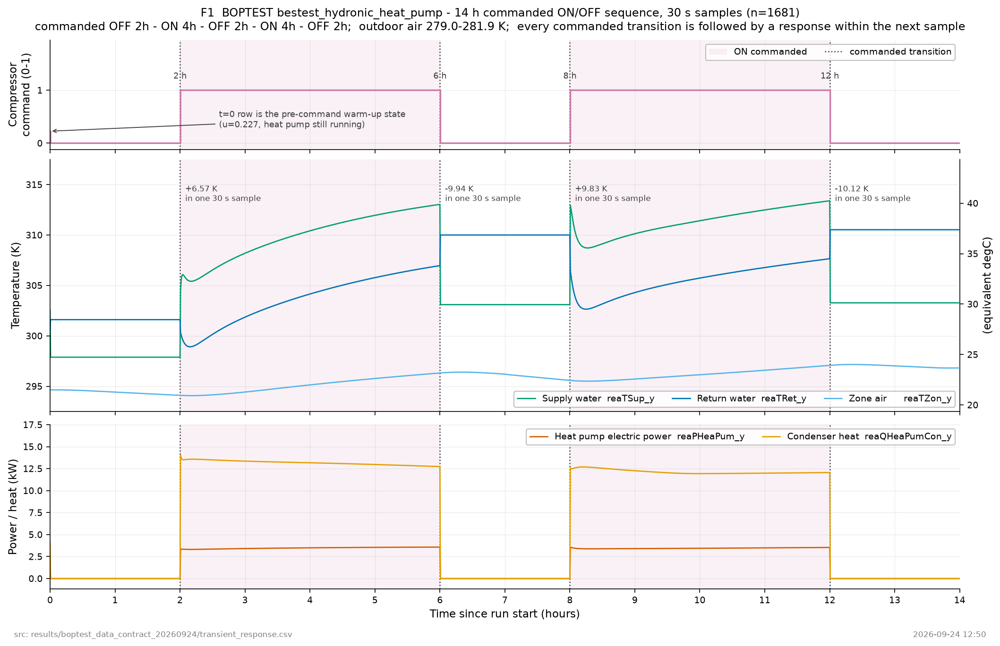
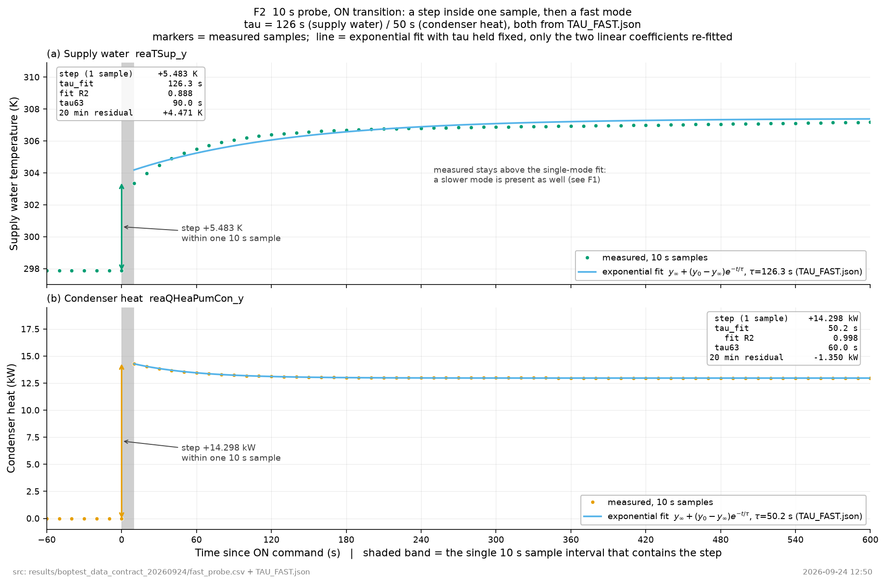
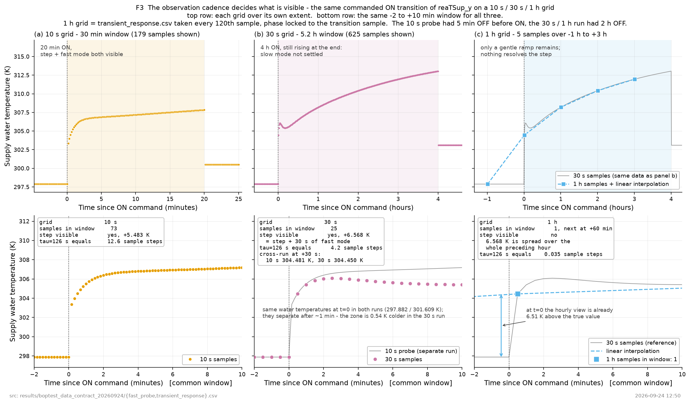

# BOPTEST 히트펌프 전환 과도응답 — 수집과 측정

2026-09-24. 외부에서 검증할 수 있도록 수치·그림·재현 경로를 함께 둔다.
연구 결론을 주장하는 문서가 아니라 "데이터를 제대로 받았는가" 와 "과도응답이 어떤 구조인가" 까지다.

## 1. 왜 로컬에서 돌렸나

공개 서비스 `api.boptest.net` 은 전 세계 어느 resolver 에서도 해석되지 않는다. 도메인 등록은 살아
있지만 권한 네임서버 두 대가 해당 zone 을 서빙하지 않아 REFUSED 를 돌려준다. 근거 사슬은
`../transient_peft_readiness_v4_20260923/DATA_ACCESS.json` 에 있다. 망을 바꿔도 열리지 않으므로
로컬 Docker 기동으로 방향을 바꿨다.

## 2. 무엇을 썼나 — 재현 정보

```
저장소   ibpsa/project1-boptest  commit 0f8a467c  (version.txt 1.0.0-dev)
테스트   bestest_hydronic_heat_pump
FMU      wrapped.fmu  sha256[:16] 674b9500c1c89fdb
기동     docker compose up -d --build web worker provision  ->  http://127.0.0.1:8000
시각     연초 0초 기준. 시작 1900800s (= peak_heat_day 23일), warmup 86400s
```

`minio/minio` 가 Docker Hub 에서 인증을 요구해 `docker-compose.override.yml` 로 quay.io 의 동일
RELEASE 태그를 지정했다. 버전은 바꾸지 않았고 upstream compose 파일도 수정하지 않았다.

## 3. 제어 명령 계약 — `_u` / `_activate` / `_y`

BOPTEST 는 신호 하나를 세 이름으로 나눈다. 과도응답 연구에서 전환 시점을 정확히 잡으려면 필수다.

```
<name>_u          발행한 값
<name>_activate   그 발행을 유효화할지 0/1
<name>_y          실제로 적용된 값
```

`_activate=0` 이면 발행값이 무시되고 내장 baseline 제어기가 돌지만 `_y` 는 실행값을 계속 준다.
즉 "지시했으나 적용되지 않은 구간" 이 데이터에 남는다. 전체 신호 목록은 `fmu_signals.json`
(FMU 원본 input 8 / output 40), API 기준 목록은 `API_SIGNAL_METADATA.json` (inputs 8 / measurements 36).

`/results` 로 제어 신호를 받을 때는 `ove*_y` 가 아니라 `ove*_u` 로 요청해야 한다 —
`testcase.py` 가 `_u` 키에 실행값을 담아 저장하기 때문이다.

## 4. 수집한 것

| 파일 | 점수 | 간격 | 구간 | 명령 일정 |
|---|---|---|---|---|
| `transient_response.csv` | 1681 | 30초 | 14시간 | OFF 2h → ON 4h → OFF 2h → ON 4h → OFF 2h |
| `fast_probe.csv` | 181 | 10초 | 30분 | OFF 5분 → ON 20분 → OFF 5분 |

10초 간격은 `testcase.py:174` 의 저장 규칙을 이용한 것이다 — 제어 주기가 30초 이상이면 30초
해상도로 저장되고, 30초 미만이면 제어 주기와 같은 해상도가 된다. 그래서 `step=10` 으로 두었다.

명령이 실제로 반영됐는지는 전환 시각으로 확인한다. 검출된 전환은 2·6·8·12시간으로 일정과 일치한다.

```
reaTSup_y     297.882 ~ 313.395 K   폭 15.513
reaTZon_y     294.072 ~ 297.161 K   폭  3.090
reaPHeaPum_y    0.000 ~ 3577.484 W  폭 3577.484
```



F1 은 명령한 ON/OFF 계단과 응답을 30초 표본 1681개로 나란히 놓은 것이다. 네 번의 전환 모두
바로 다음 표본 안에서 공급수온이 +6.57 / −9.94 / +9.83 / −10.12 K 움직였고, 전력과 응축열도 같은
표본에서 0에서 3.5kW / 14kW 로 올라간다. 명령이 실제로 모델에 들어갔고 응답이 따라왔다는 뜻이다.
동시에 ON 4시간이 끝날 때까지 공급수온이 계속 오르고 있어 수 시간 규모의 느린 모드가 따로
존재함도 보인다. `t=0` 행은 명령 이전 warm-up 상태(`u=0.227`, 히트펌프 가동 중)라 그림에 따로 표시했다.

## 5. 시상수 — 첫 계산은 틀렸고 폐기했다

처음에는 30초 데이터의 ON 구간에서 63.2% 도달 시각을 재서 공급수온 tau ≈ 9915초(165분)를 얻었다.
이 값은 시상수가 아니다. 4시간 ON 구간의 마지막 값을 정상상태로 가정했는데 실제로는 4시간이
지나도 정착하지 않는다(304K → 313K 계속 상승). 끝나지 않은 드리프트를 종점으로 삼은 값이다.

단서는 두 가지였다. 63.2% 방식과 지수적합이 2~5배 어긋났고(9915s 대 24968s), 실내온도는 적합이
격자 상한(40000s)에 붙었다. 1차 응답 가정이 맞지 않는다는 뜻이다.

폐기한 계산도 `TAU_ESTIMATES.json` 에 그대로 남긴다. 유효한 값은 `TAU_FAST.json` 이다.

## 6. 다시 잰 결과 — 응답은 세 겹이다

10초 해상도로 ON 전환을 보면 구조가 분리된다.

| 성분 | 공급수온 | 응축열 | 히트펌프 전력 | 시간 규모 |
|---|---|---|---|---|
| 전환 즉시 계단 | +5.483 K | +14297.7 W | +3289.8 W | 표본 1개 이내 (10초 미만) |
| 빠른 모드 | tau 126.3s (R² 0.888) | tau 50.2s (R² 0.998) | — | 분 단위 |
| 느린 모드 | 304 → 313 K | — | — | 4시간에도 미정착 |



F2 는 같은 전환을 10초 격자로 본 것이다. 변화의 대부분이 표본 1개(10초) 안에서 끝나는 계단이며
(공급수온 +5.483K, 응축열 +14.298kW), 그 뒤에 남는 것이 빠른 모드다. 곡선은 `TAU_FAST.json` 의
tau 를 고정하고 선형계수 2개만 다시 맞춘 것이라 주석의 숫자와 그려진 곡선이 같은 대상이다.
공급수온에서 실측이 적합선 위로 계속 벗어나는 것(20분 잔차 +4.47K)은 느린 모드가 함께
작동하기 때문이며, 이것이 §5 에서 첫 계산을 폐기한 이유와 같은 현상이다.

환수온과 실내온도는 20분 창에서 적합이 격자 상한(3000s)에 붙는다. 이 창 안에서는 느린 모드만
보인다는 뜻이며, 20분으로는 그 시상수를 잴 수 없다. 값 자체를 쓰지 않는다.

## 7. 연구 설계에 걸리는 함의



F3 이 이 보고서의 핵심이다. 같은 ON 전환을 10초 / 30초 / 1시간 격자로 본 것이며, 아랫줄은
−2~+10분 공통 창으로 맞춘 것이다. 그 창 안의 표본 수가 73 / 25 / 1 개다. tau=126초는 10초
격자에서 12.6 표본 간격이라 빠른 모드가 완전히 해상되고, 30초에서는 4.2 표본 간격으로 겨우
잡히며, 1시간 격자에서는 0.035 표본 간격이라 통째로 사라진다. 1시간 격자에는 계단이 남지 않고
완만한 램프만 보이며, 하나뿐인 표본을 선형보간하면 전환 시각에서 이미 실제값보다 6.51K 위에
있다 — 10초 안에 끝난 변화가 한 시간에 걸쳐 일어난 것처럼 기록된다.

주의할 점이 있다. 10초 probe 와 30초 run 은 서로 다른 실행이다(직전 OFF 가 5분 대 2시간).
전환 시점 수온은 297.882K 로 같고 마지막 OFF 표본 기준 +30초에서 304.481K 와 304.450K 로
일치하지만, 1분 이후 갈라진다. 실내온도가 0.54K 다르기 때문이며 그림에도 적어 두었다.

관측 간격이 무엇을 difficulty 로 만들지 결정한다.

```
10초 격자    계단 + tau 약 2분 빠른 모드가 보인다
30초 격자    계단은 한 표본 안에 들어가고 빠른 모드 일부가 보인다
1시간 격자   둘 다 사라지고 수 시간짜리 완만한 램프만 남는다
```

시계열 기반 모델이 흔히 쓰는 시간 단위 격자에서는 빠른 과도응답이 관측 자체에 없다. 따라서
"전환 과도응답이 어렵다" 는 전제를 쓰려면 어느 모드를 겨냥하는지 먼저 정해야 한다.

- 빠른 모드를 겨냥 → 예측 간격이 분 단위여야 한다. 문제는 "계단 직후 수십 초~수 분의 정착"
- 시간 단위 격자 → 문제는 "느린 램프의 시작점과 기울기 예측" 이다

둘은 다른 문제이고 필요한 모델 구조도 다르다. 이 선택은 연구 방향 결정이라 여기서 멈춘다.

## 8. 아직 채우지 못한 칸

`../../research/transient_peft_readiness_v4_20260923/NEXT_STAGE_CONTRACT.md` §2 기준.

| 항목 | 상태 |
|---|---|
| 제어 명령 의미·발행/유효/실행값 구분 | 채움 (§3) |
| target measurement 의미·단위·시각 | 후보·단위 채움. 무엇을 target 으로 둘지는 미정 |
| 과도응답의 물리적 정의, tau0 | 구조는 측정함(§6). 정의는 §7 의 선택에 달려 있어 미정 |
| 전환 수, 구간별 날짜 수 | 미정 — 이번은 전환 4회 + 정밀 1회뿐이다 |
| H·context·간격과 tau0 의 비율 | 미정 |
| 시간순 분할, 정답 겹침 방지 | 미정 |
| 평가 원점·날짜 가중 | 미정 |
| 최소 실용 차이 | 미정 — 센서 해상도·업무 허용오차 근거 없음 |

## 9. 재현 방법

```
git clone https://github.com/ibpsa/project1-boptest   # commit 0f8a467c
# docker-compose.override.yml 로 minio/mc 를 quay.io 로 지정
bash experiments/boptest_data_contract_20260924/reset_and_collect.sh   # 기동 + 30초 수집
python experiments/boptest_data_contract_20260924/probe_fast.py        # 10초 정밀 수집
python experiments/boptest_data_contract_20260924/estimate_tau.py      # (폐기한 첫 계산)
python experiments/boptest_data_contract_20260924/make_figures.py      # 그림
```

수집 과정에서 5번 실패했고 원인과 조치는 `../../_docs/history/2026-09-24.md` 에 표로 남겼다.
그중 4건이 내 쪽 오류였다(빈 본문 500, worker 미반납, 큐 초기화 오판, 잘못된 point 이름).
BOPTEST 자체 문제는 없었다.
