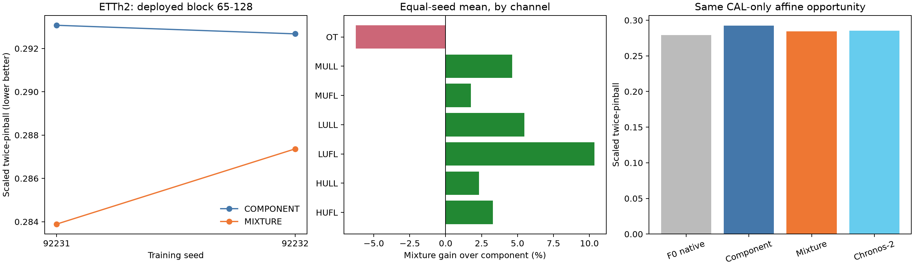

# Branch-mixture LoRA 제한 실험 결과

**실행 COMPLETE. 판단 POSITIVE_PILOT_SIGNAL.** ETTh2 하나에서 공식 branching의 혼합분포를 학습하는 LoRA를 경로별 CRPS 학습과 비교했다. 새 방법의 성능 신호와 구현 성공을 구분하며, 신규성·논문 PASS를 선언하지 않는다.

**이 판정은 두 seed에서 손실 변경의 개선 방향이 반복됐다는 뜻이다. 실용적 우위는 미확보다.** MIXTURE는 COMPONENT보다 후반 점수를 평균2.47% 개선했지만, 학습하지 않은 F0에 같은 CAL-only 단순 보정을 적용한 기준선보다1.85% 나빴다. 주 비교95%구간도0을 포함한다. 따라서 현재 결과를 곧바로 유용한 새 PEFT 방법 확보로 해석하지 않는다.

4/4 fits, 2,048/2,048 main updates, 4/4 smoke updates를 완료했다. 추가 LR/rank/seed/자료 탐색0회다. 두 반복 모두 비교에 포함했고 선택용 seed는 없다. 평균은 seed별 점수 평균이며 예측 ensemble이 아니다.

## 무엇을 바꾸었나

Chronos-Bolt-small 동결 + 동일 q/v rank8 LoRA(294,912개 학습 파라미터). 첫64 예측은 공통 pinball, 다음64 예측은 COMPONENT가 아홉 9-atom 분포의 CRPS를 평균하고 MIXTURE가 합친81-atom 분포의 CRPS를 사용한다. 두 loss의 차이는 경로 사이 CDF 불일치에 대한 비음수 항이다. 이 항을 제거하면 성능이 좋아질지는 가설이며 유용한 불확실성을 자동 보장하지 않는다.

현재 공식 Bolt는 중앙값-only가 아니다. 실제 공식9경로를 모두 사용하고 다음9×9를9분위수로 축약한다. 학습과 평가 모두 같은 branching이다. 생성한 context는 detach하며 미래 정답을 넣지 않는다. 공식 raw quantile-labelled path를 유지하고, 최종 공통 정렬 결과를 주 평가한다. 경험분포 CRPS는 연속분포 CRPS와 다르고 지지점은 IID sample이 아니다.

## 평가 범위와 선택

ETTh2 공식7계열, 17,420시간, context512/horizon128. 시간순 TRAIN60%/CAL10%/VAL10%/TEST20%, 일24시간 간격, target은 각 구간 안에 완전히 포함된다. TEST140원점, VAL/CAL각67원점이다. 과거 저장소 계획서에 ETTh2가 언급돼 완전히 새로운 자료로 주장하지 않는다. 이번 TEST는 이 실행의 선택·보정에 사용하지 않았다. 공개 benchmark/pretraining 노출 가능성까지 배제한 것은 아니다.

특히 ETTh2와 과거 프로젝트에서 사용한 ETTm2는 같은 변압기 원천의 서로 다른 해상도다. 이 결과는 관련 원천의 제한 실험이며 독립 외부 자료 검증이 아니다. [독립 검토와 원천 노출](INDEPENDENT_REVIEW.md).

고정LR1e-4, batch4,512updates. 각 arm은 VAL에서 INIT/128/256/512 중 후반 scaled twice-pinball 최저 checkpoint를 선택했다. TEST를 보기 전에 checkpoint와 CAL 보정 계수를 봉인했다. 동일35점 affine grid를 각64시간 블록에 CAL만으로 적용했다.

## 결과

양수 개선율은 MIXTURE가 COMPONENT보다 좋다는 뜻이다. 주 지표는 공식9분위수 축약 후 후반65–128의 TRAIN-표준편차 정규화 mean twice-pinball이다. 임의의1% 기준을 사용하지 않았다.

```text
 seed  component   mixture  relative_percent   ci95_low  ci95_high
92231  0.2930721 0.2838902         3.1329892 -0.0023786  0.0258749
92232  0.2926759 0.2873647         1.8147033 -0.0032868  0.0181068
```

평균 상대 개선 **+2.4743%**. 점수 차이 +0.0072466, 원점 block-bootstrap95%구간 [-0.0025542, +0.0218242]. 동일 CAL 보정 이후 상대 개선 **+2.7369%**, 구간 [-0.0015778, +0.0220092]. CI는 절대 점수 차이의 구간이다.

```text
            arm variant  scaled_pinball  raw_mae  coverage80  scaled_width80
CHRONOS2_DIRECT  affine        0.285219 2.847304    0.765880        1.054978
CHRONOS2_DIRECT ordered        0.285219 2.847304    0.765880        1.054978
      COMPONENT  affine        0.292283 2.843417    0.775741        1.149359
      COMPONENT ordered        0.292874 2.843417    0.727344        1.027558
      F0_NATIVE  affine        0.279113 2.746818    0.741661        0.971977
      F0_NATIVE ordered        0.282787 2.746818    0.642825        0.777581
        MIXTURE  affine        0.284283 2.797330    0.730142        0.971662
        MIXTURE ordered        0.285627 2.797330    0.681792        0.867807
```

MIXTURE가 F0의 단순 보정보다 낮은 점수를 확보하지 못했다. Chronos-2 직접128 예측은 별도 practical reference이며 같은 모델/학습자원 대조는 아니다. 본4-fit 실험에는 별도 ordinary/median-rollout LoRA 학습군이 없으므로 모든 LoRA recipe 대비 우위나 일반 rollout 학습의 독립 효과를 주장하지 않는다.

F0-affine 대비 MIXTURE-affine의 후반 개선율은 **−1.8523%**, 점수 차이95%구간은 [−0.013746, −0.000188]이다. Chronos-2 대비는 보정 전−0.1433%, 보정 후+0.3280%이며 두 구간 모두0을 포함한다. 이는 현재 조건부 bootstrap에서의 결과다. [참고 기준선 효과 전체](reference_effects.csv).

checkpoint 선택을 없애고 양쪽 모두512 update를 사용해도 후반 개선은 두 seed에서+1.33%/+1.81%, 평균+1.58%였다. 따라서 두 arm 사이 차이가 checkpoint 선택만으로 생긴 것은 아니다. 다만 이 민감도 결과도 F0 대비 새 가치를 입증하지 않는다.

경로 사이 분포 차이 항은 COMPONENT 평균0.017976, MIXTURE0.075641, F0 0.079233이었다. MIXTURE가 경로 간 차이를 덜 줄였다는 관측은 설계 의도와 일치한다. **전체 예측구간이 더 넓어졌다는 뜻은 아니다**: 최종80%구간 폭은 MIXTURE가 COMPONENT보다 좁았다. 경험 혼합분포CRPS 역시 COMPONENT0.269979 → MIXTURE0.263257로 나아졌으나 F0 0.261227을 넘지 못했다. [추정] 현재 신호는 추가 예측 가치의 확보보다, 경로별 학습에서 생긴 기본 예측의 손상을 줄이는 쪽에 가깝다.



그림의 seed 점들은 두 독립 초기화/학습순서 반복이며 오차막대가 아니다. channel 효과는 두seed 평균이고 사후 채널 선택을 하지 않았다. 전체128/첫64/후반64, raw/ordered/affine, fixed512 민감도는 [scores.csv](scores.csv), [effects.csv](effects.csv), [seed_effects.csv](seed_effects.csv)에 있다. [channel](channel_scores.csv), [origin](origin_scores.csv), [lead](lead_scores.csv), [81-atom mixture와 disagreement](distribution_scores.csv)도 모두 남겼다.

Bootstrap은7개 일원점 블록·2000회로 모든 채널과seed를 함께 재표집한다. 중첩된 horizon을 독립 표본으로 세지 않는다. 단일 자료·두seed 조건부 시간변동 구간이며 데이터셋 모집단이나 충분한 seed 모집단 불확실성을 뜻하지 않는다.

## 자원과 검산

```text
             key  seconds  peak_allocated_mib  trainable_parameters  selected_step
COMPONENT_s92231   44.292             465.960            294912.000        256.000
  MIXTURE_s92231   44.347             466.351            294912.000        512.000
COMPONENT_s92232   43.957             466.351            294912.000        512.000
  MIXTURE_s92232   44.232             466.351            294912.000        512.000
```

시간은 본학습 forward/backward/update 합계이며 검증·checkpoint 쓰기·개발 시간은 포함하지 않는다. 두 arm의 main conditional batch forward/backward는 총4096회, series-context 계산81920개다. 모든 경우 같은branch9개와batch4를 사용했다. 추론 시간/allocated/reserved memory는 [resources.csv](resources.csv)에 있다. 실제 wall time과 GPU 상태는 events와 환경 기록에 보존한다.

[VERIFICATION.json](VERIFICATION.json): 실제 TRAIN 입력으로 native64/128 및 smoke 학습 후 공식API parity, zero-LoRA 초기 일치, frozen가중치 불변, paired 초기hash/schedule, finite gradient를 통과했다. 독립 절대오차식 pinball 최대차 8.88e-16, 직접81×81 pairwise CRPS 최대차 0, CAL 420개 점수 최대차 1.11e-16. 데이터SHA/시간축/누수·코드/선택/예측hash 검증을 남겼다. CPU 테스트는 [CPU_TESTS.json](CPU_TESTS.json).

사후 CPU 검산으로16개 VALIDATION checkpoint 점수와 선택을 독립 절대오차식으로 재계산했다. 최대차1.11e−16, 선택4/4 일치, checkpoint hash 및 optimizer1–512 순서 모두 일치했다. 추가학습0회. [POSTRUN_AUDIT.json](POSTRUN_AUDIT.json).

재현 entry: `python experiments/branch_mixture_lora_v1_20260922/preflight.py`, `runner.py all`, `finalize.py`. 기존 완료경로에 smoke를 다시 실행하면 차단한다. 재실행은 새 예산의 연구 작업이며 자동 수행하지 않는다. manifest의 raw/weights/checkpoint/prediction 배열은 ignored 로컬 cache에 있고 GitHub에는 포함하지 않는다. requirements lock은 실제 재사용Python3.11 환경이다.

## 해석과 종료

사전 정의한 방향 반복 기준의 결과는 **POSITIVE_PILOT_SIGNAL**이다. 이 결과는 mixture-loss LoRA의 한정된pilot이며 TSFM PEFT 전체를 지지하거나 반증하지 않는다. CAL 대비 손익·F0 단순보정·direct모델·추가자원을 함께 판단해야 한다. 별도 architecture/seed/자료를 자동 추가하지 않고 종료했다.

[고정 설계와 선행연구](../../experiments/branch_mixture_lora_v1_20260922/PROTOCOL.md). Ensemble CRPS rollout 학습 자체는 AIFS-CRPS/Aurora1.5 등의 선행이 있어 신규성은 미확정이다. 구현·자료·자원 실패와 성능 음성은 분리한다.
