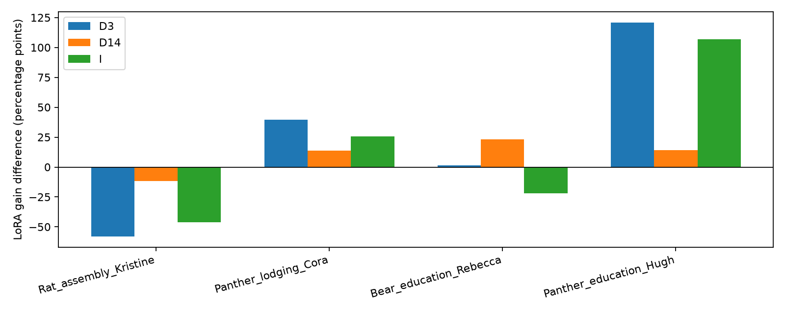
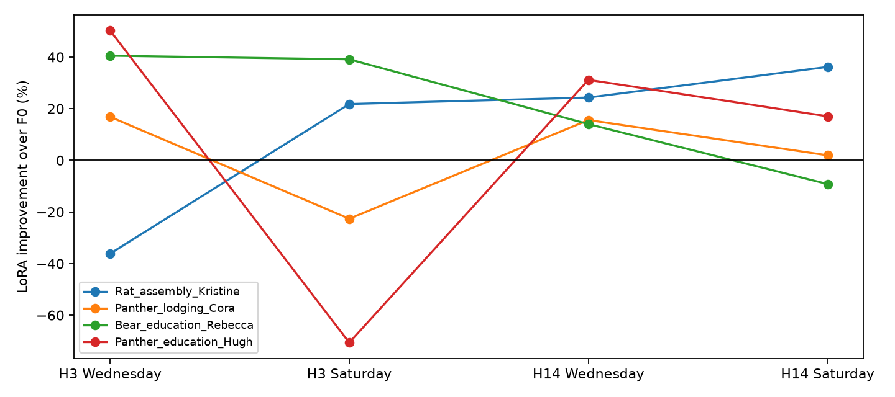

# 건물 cold-start coverage PEFT 파일럿

[설계] 연구 질문: 짧은 타깃 이력에서 미래 주중·주말 상태의 관측 개수로 LoRA 보정량을 줄일 근거와 추가 가치가 있는가?

[확인] 최종 상태: **STOP_NO_COVERAGE_PROBLEM_SIGNAL**. 실제 LoRA 시도 24 fits, 완료 24 fits, optimizer 2,880 updates. Smoke는 별도 장부다.

## 기존 연구와 이번 질문

[확인] 이전 Query R1은 BF16 수치 조건 미충족으로 종료됐고, 채널 R2는 24 fits를 끝냈지만 더 작은 LH 대비 BASIS 우위를 확보하지 못했다. 과거 결과는 변경하지 않았다.

[설계] 이 파일럿은 기존 구조 재튜닝 대신 target history의 관측 범위를 먼저 검사한다. 새 adapter나 source-building transfer는 추가하지 않는다.

[확인] 건물 few-shot·Chronos LoRA·cross-building transfer·시간대/계절 residual correction·관련 예시의 in-context 적응은 기존 선행이다. [선행 경계와 접근 제한](literature_boundary.md).

[추정] 출력 convex mixture와 c/(c+tau) 수축식 자체는 알려진 규칙 형태다. 이번 개발 실험만으로 PEFT 학습 방법의 신규성을 확정할 수 없다.

## 데이터와 실제 가용 이력

[확인] 공식 BuildingsBench v1.0.0 BDG-2 평가 archive를 사용했다. Eligibility 574 건물, 선택 14 건물. [원본·버전·hash](data_manifest.json), [eligibility](eligibility.csv).

[확인] 공식 전처리는 양방향 결측 보간을 포함한다. 원본 raw/cleaned가 finite이고 공식 평가값과 일치하는 구간만 사용해 보간값을 제외했다. 전처리의 전체 기간 기반 결측 필터가 만든 선택 편향은 남는다. 원본 자료를 읽은 목적은 관측 provenance 검사이며 다른 건물 값은 model input에 넣지 않았다.

[설계] 건물 ID 해시 순서로 recipe4/dev4/heldout6을 분리하고 같은 물리 건물의 meter/연도를 묶었다. 첫 적격120일 구간의 동일 주·월 Wednesday/Saturday를 고정했다. 추론 context24h, adaptation3/14일, horizon24h이며 숨긴 과거와 forecast target은 adaptation·정규화·선택에 사용하지 않는다.

[확인] [분할](building_split.json), [날짜·이력·coverage](episode_manifest.csv). Native model은 각 입력24h만 자체 정규화한다. 평가 scaled_RMSE 분모는 노출 H일의 population std이며 미래 target 분모를 쓰지 않는다. 제공 timestamp calendar를 그대로 썼고 metadata timezone을 기록했다. DST·운영 실제 달력까지 재구성한 결과는 아니다.

## 모델·recipe 계약

[설계] Chronos-2 revision29ec3766, rank8/alpha16 standard LoRA96개 projection, base와 head 고정, FP32·batch1·AdamW·clip1. Native32슬롯 중 첫24h를 평가한다. 모든 F0/LoRA 출력에 같은 사전 고정 quantile 정렬을 적용하고 원래 crossing 수도 보존한다. 단순 affine은 exposed supervised target만으로 positive OLS2파라미터를 맞춘다.

[확인] 선택 recipe: LR=0.0001, updates=120. 각14일의13개 windows 중 앞11개 fit/끝2개 inner-V. 별도4 recipe 건물만으로 LR2종×step4종을 선택했고 실제 미래 episode target은 선택에 열지 않았다. [선택 원점수](recipe_selection.csv), [고정 recipe](recipe_seal.json).

## Stage A — 문제 현상

[확인] NO_COVERAGE_PROBLEM_SIGNAL. 양의 상호작용 I 건물 2/4, 평균 I=16.166624968379345pp. 기준은 최소3/4 및 평균0.5pp다. [원점수](stageA_metrics.csv), [D3/D14/I](stageA_interaction.csv).

[확인] 건물별 실제 상호작용(pp):

| building | D3 | D14 | I | H3 Saturday LoRA gain | affine gain |
| --- | ---: | ---: | ---: | ---: | ---: |
| Rat_assembly_Kristine | -57.9558 | -11.8537 | -46.1022 | +21.7835 | -14.4490 |
| Panther_lodging_Cora | +39.4750 | +13.6621 | +25.8130 | -22.6358 | -33.1382 |
| Bear_education_Rebecca | +1.4082 | +23.2078 | -21.7996 | +39.1016 | +39.9432 |
| Panther_education_Hugh | +120.8956 | +14.1403 | +106.7553 | -70.6297 | +3.0505 |

## Stage B — 단순 규칙 이상의 가치

[확인] NOT_RUN. alpha=미선택, tau=미선택. [규칙 비교](stageB_rules.csv), [판정](stageB_selection.json).

[설계] F0 복귀는 uniform alpha0 및 c0 binary fallback에 포함된다. UniformShrink가 같거나 더 좋으면 coverage별 규칙 필요성이 없고, Affine이 같거나 더 좋으면 내부 PEFT를 바꿀 근거가 약하다. Stage A가 미통과하면 이 추가 가치 비교 자체를 실행하지 않는다.

## Stage C — held-out

[확인] NOT_RUN. Held-out 성능 평가 여부=False. A/B가 모두 통과한 경우에만6개 건물24fits를 실행하도록 제한했다.

## 실제 실행과 미실행

[확인] 실행 장부와 자원 수치: [fits](fit_attempts.csv), [updates](train_trajectories.csv), [자원](resource_usage.csv). Peak는 fit 시작부터 checkpoint 재로딩·평가를 포함한 torch allocated/reserved 최대이며 전체 장치 사용량은 GPU 로그에 별도 기록했다.

| phase | attempted fits | complete fits | actual updates |
| --- | ---: | ---: | ---: |
| recipe | 8 | 8 | 960 |
| screen | 16 | 16 | 1920 |
| heldout | 0 | 0 | 0 |

[확인] 독립 저장 예측 재검산 128건, 최대 metric 절대차 2.1316282072803006e-14. 기존 결과 1624개 보존. [검산](independent_verification.json).

[확인] 데이터·가중치·tensor checkpoint/예측 cache는 로컬에 남기고 GitHub에는 코드·원점수·해시·검증 범위를 올린다. GitHub 파일만으로 저장 tensor 재검산이 가능하다고 하지 않는다.

## 해석·판정·한계

[추정] D3/D14 상호작용은 요일 난이도와 관측 범위를 일부 분리하지만, history 길이와 supervision개수도 같이 달라지므로 coverage의 단일 인과효과는 아니다. 건물4/6개와 두 날짜, 한 seed의 작은 개발 실험이다. 같은 site가 split 양쪽에 있을 수 있고 재단 모델의 사전학습 중복은 미확인이다.

[추정] A 미통과는 이번 weekday/weekend coverage 가설이 지지되지 않았다는 뜻이며 건물 cold-start 전체가 불가능하다는 뜻이 아니다. B 미통과는 이번 규칙이 단순 대조보다 추가 가치를 보이지 못했다는 뜻이다. 조건 미충족 STOP과 실행 오류 EXECUTION_INCONCLUSIVE를 구분한다.

[확인] 판정: **STOP_NO_COVERAGE_PROBLEM_SIGNAL**. 새 상태 정의·adapter·source transfer·추가 LR/seed/dataset를 자동 실행하지 않는다.

## 최종 감사와 실제 점수 요약

[확인] Smoke 실제 2 updates와 LoRA 학습 2880 updates를 분리했다. 실제 학습 시도 24/48, 완료 24. 미실행 허용 범위 24 fits는 중단 gate 이후 투자 한도이며 수행한 실험으로 세지 않는다.

[확인] 공통 출력 정렬을 적용한 Standard LoRA는 개발16개 중 12개에서 F0보다 정확했다. 전체 macro scaled_RMSE는 F0 0.974774 → LoRA 0.799626, 개선 17.9680%다. 따라서 일반 LoRA 적응 이득과 coverage 가설의 재현성은 다른 결론이다.

[확인] H3 Saturday에서는 Kristine·Rebecca가 LoRA로 개선됐고 Cora·Hugh는 악화됐다. Affine은 Hugh에서 F0 대비 +3.0505%로 LoRA 손해를 없앴지만 Cora에서는 -33.1382%로 더 나빴다. 단일 baseline이 모든 건물 문제를 해결했다는 근거도 없다.

[확인] Native quantile crossing 19개를 기록했고 공통 사전 정렬로 median이 달라진 hourly 지점 수는 role별 {'recipe': 3, 'dev': 2}다. 정렬 없는 원출력도 cache에 보존했다.

[추정] 평균 I가 양수인 것만으로 건물 간 반복성을 입증할 수 없다. 이번 규칙의 후속 조건은 2/4로 미충족이었다. Stage B를 실행하지 않았으므로 coverage scaling 자체의 성능 실패나 성공은 아직 측정하지 않았다.

[확인] 첫 smoke는 공식 pipeline에 CUDA 입력을 전달해 CPU pin-memory 오류로 종료됐다. 이때 optimizer0·fits0이었다. 같은 입력값을 CPU tensor로 전달하도록 API 연결만 수정한 뒤 smoke를 재검사했다. [원래 오류](preparation_attempt1/execution_error.json), [수정 기록](preparation_repair.json). 데이터·학습률·기준 변경은 없었다.

[확인] 개발16개 episode의 실제 scaled_RMSE(낮을수록 좋음):

| 건물 | 요일 | H일 | F0 | LoRA | Affine |
| --- | --- | ---: | ---: | ---: | ---: |
| Rat_assembly_Kristine | Wednesday | 3 | 1.016030 | 1.383552 | 1.076133 |
| Rat_assembly_Kristine | Wednesday | 14 | 0.993534 | 0.752021 | 0.828216 |
| Rat_assembly_Kristine | Saturday | 3 | 1.441143 | 1.127211 | 1.649374 |
| Rat_assembly_Kristine | Saturday | 14 | 0.686245 | 0.438084 | 0.666883 |
| Panther_lodging_Cora | Wednesday | 3 | 0.735003 | 0.611234 | 0.672669 |
| Panther_lodging_Cora | Wednesday | 14 | 0.620276 | 0.523642 | 0.637553 |
| Panther_lodging_Cora | Saturday | 3 | 0.453427 | 0.556063 | 0.603684 |
| Panther_lodging_Cora | Saturday | 14 | 0.455007 | 0.446284 | 0.503943 |
| Bear_education_Rebecca | Wednesday | 3 | 0.869345 | 0.517175 | 0.666120 |
| Bear_education_Rebecca | Wednesday | 14 | 0.936131 | 0.805034 | 0.907932 |
| Bear_education_Rebecca | Saturday | 3 | 0.695297 | 0.423425 | 0.417573 |
| Bear_education_Rebecca | Saturday | 14 | 0.790391 | 0.863136 | 0.819066 |
| Panther_education_Hugh | Wednesday | 3 | 2.720925 | 1.353229 | 1.857659 |
| Panther_education_Hugh | Wednesday | 14 | 1.674981 | 1.153007 | 1.290312 |
| Panther_education_Hugh | Saturday | 3 | 0.672081 | 1.146770 | 0.651579 |
| Panther_education_Hugh | Saturday | 14 | 0.836562 | 0.694156 | 0.836082 |

[확인] H×요일별 건물 macro scaled_RMSE:

| H일 | 요일 | F0 | LoRA | Affine |
| --- | --- | ---: | ---: | ---: |
| 3 | Wednesday | 1.335326 | 0.966298 | 1.068145 |
| 3 | Saturday | 0.815487 | 0.813367 | 0.830553 |
| 14 | Wednesday | 1.056231 | 0.808426 | 0.916003 |
| 14 | Saturday | 0.692051 | 0.610415 | 0.706493 |

[확인] Stage A 원점수 CSV에는 각 건물·episode·방법의 raw RMSE, raw MAE, scaled 2-pinball도 포함된다. 서로 다른 건물의 raw 단위 오차를 같은 의미로 평균하지 않았다. Official-style NRMSE는 별도 secondary로 100×RMSE/평가 target 평균을 기록했다. 이 미래 평균은 평가 표시용이며 학습·선택·primary 분모에는 사용하지 않았다. 공식 전체 기간 benchmark 집계와 동일한 결과라고 하지 않는다.

[확인] 실제 자원 합계와 fit 최대값:

| phase | active 학습초 합계 | fit wall초 합계 | 최대 allocated GiB | 최대 reserved GiB |
| --- | ---: | ---: | ---: | ---: |
| recipe | 87.140 | 112.118 | 0.5296 | 0.5332 |
| screen | 174.448 | 221.406 | 0.5296 | 0.5332 |

[확인] GPU 원본 로그의 승인되지 않은 외부 compute 샘플 합계 0. RustDesk만 기존 예외로 인정했다. 현재 이 파일럿 GPU worker는 없다.

[확인] [publication 감사](publication_audit.json)에서 기존 파일 hash, 선택 recipe, Stage A 산식, window 순서·시간 경계, model/source/data hash를 추가 검사했다.
