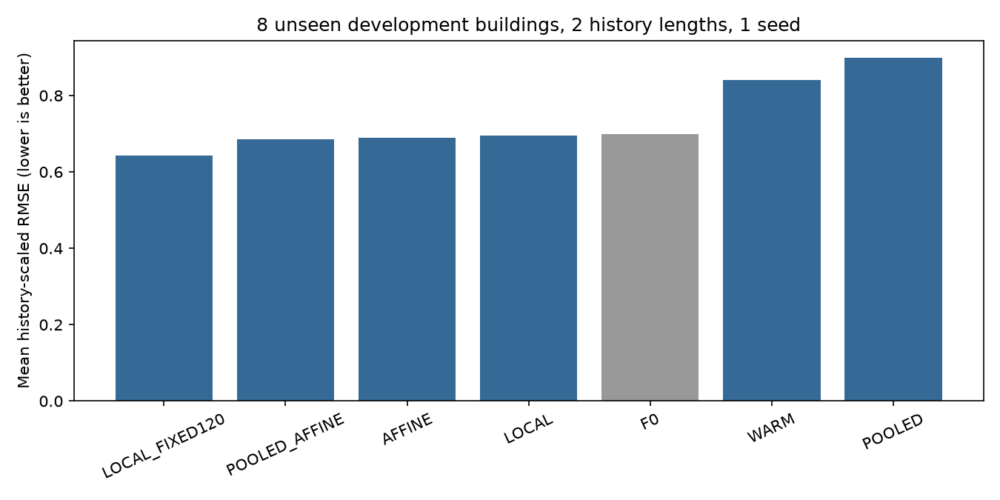

# 새 건물 짧은 이력 PEFT 전이 실험 — 결과 보고

설계·실행 시작: 2026-09-15 KST. 실행 종료·검산: 2026-09-16 KST. 실험 ID의 날짜는 시작일을 유지한다.

**최종 상태: `STOP_NO_TRANSFER_SIGNAL`.** 실제 57 fits, 8,616 optimizer updates를 완료했다. 학습 오류와 성능 판정은 구분했으며 오류 fits는 0이다. 이번 상태는 개발 단계의 고정 기준 결과이고 논문 PASS를 뜻하지 않는다.

## 무엇이 좋아졌는가

개발 평균 scaled RMSE 기준 가장 낮은 비교군은 **LOCAL_FIXED120**이다. F0는 0.69958689, 최저값은 0.64377105다. 모든 건물·이력에서의 일률적 개선을 요구하지 않는다. 아래 점수는 새 개발 건물 8개×H3/H14=16개 episode 평균이다.

| 비교군 | scaled RMSE ↓ | raw RMSE ↓ | raw MAE ↓ | scaled pinball ↓ | F0 대비 개선 % | H3 | H14 |
| --- | ---: | ---: | ---: | ---: | ---: | ---: | ---: |
| AFFINE | 0.69009635 | 24.828554 | 20.527438 | 0.42058634 | +1.357 | 0.793415 | 0.586778 |
| F0 | 0.69958689 | 18.964864 | 14.309531 | 0.39586391 | +0.000 | 0.713142 | 0.686032 |
| LOCAL | 0.69472933 | 18.936885 | 14.270404 | 0.39248896 | +0.694 | 0.711323 | 0.678135 |
| LOCAL_FIXED120 | 0.64377105 | 19.720383 | 14.956822 | 0.39237874 | +7.978 | 0.737796 | 0.549746 |
| POOLED | 0.89947183 | 21.691598 | 18.387657 | 0.57612321 | -28.572 | 0.910887 | 0.888056 |
| POOLED_AFFINE | 0.68555456 | 24.947227 | 21.628877 | 0.43355152 | +2.006 | 0.832150 | 0.538959 |
| WARM | 0.84041090 | 20.307679 | 16.832104 | 0.53475773 | -20.130 | 0.893155 | 0.787667 |

원점수는 [전체 episode scores.csv](scores.csv), [건물별 요약](building_summary.csv), [개발 평균](development_summary.csv)에 남겼다. 서로 다른 건물의 raw RMSE 단위를 합친 평균은 대형 건물의 영향을 받으며, 선택 지표는 노출 이력으로만 스케일한 RMSE다. H3/H14의 scaling 자체가 다르므로 서로 다른 H의 절대값 차이를 순수한 이력 효과라고 해석하지 않는다.

## 학습량과 전이의 추가 가치

Local은 tuning4에서 rank **1**, **epoch1**를 선택했다. Warm은 동일 rank의 **epoch1**를 선택했다. Source pooled는 0/660/1320/2640 중 **2640 updates**를 source 미래 validation으로 선택했다. Source 학습은 target dev를 쓰지 않았다.

배포 비교군도 tune에서 고정했다: simple=`AFFINE`, transfer=`POOLED`. Dev에서 transfer는 선택 simple 대비 **-30.340%**, 개선 건물 **4/8**, H3 **-14.806%**, H14 **-51.344%**다. 고정 전이 조건 충족: **False**. [기준 및 건물별 판정](transfer_gate.json). 건물 bootstrap의 서술적 95% 구간은 [-121.565, +15.432]%이며 판정 변경에 사용하지 않았다.

LOCAL 대 LOCAL_FIXED120은 같은 rank·초기화 trajectory에서 선택 학습량과 기존120 updates의 차이를 보여준다([창별 비교](budget_control_comparison.csv)). 선택 LOCAL의 평균은 0.69472933, fixed120은 0.64377105이며, fixed120 대비 개선은 -7.916%다. F0→LOCAL은 표준 LoRA 적응, F0→AFFINE은 단순 출력 보정, LOCAL→WARM은 추가 source 학습 및 초기화 전이, POOLED→POOLED_AFFINE은 두 target 출력 계수의 가치다. 이 차이들을 새 PEFT 구조의 성과로 합쳐 주장하지 않는다.

[선택 순위의 역전과 원인 해석](INTERPRETATION.md): fixed120의 약8% 개선은 주지표에 한정되고 H3에서는 악화했다. 설정 선택용 건물에서의 순위가 개발 건물에서 뒤집혔으므로, 더 짧은 학습이 일반적인 해법이라는 가설도 확인되지 않았다. 원인에 관한 해석과 직접 입증된 사실을 구분했다.

## 실제 비용과 미실행 범위

| 단계 | fits | optimizer updates | 실제 학습 초 | fit wall 초 | peak allocated GiB |
| --- | ---: | ---: | ---: | ---: | ---: |
| local_dev | 16 | 1920 | 195.32 | 218.66 | 0.513 |
| local_tune | 16 | 2624 | 267.93 | 300.78 | 0.530 |
| source | 1 | 2640 | 269.14 | 291.38 | 0.513 |
| warm_dev | 16 | 120 | 12.28 | 30.75 | 0.513 |
| warm_tune | 8 | 1312 | 133.78 | 150.00 | 0.513 |

| 배포 비교군 | 16 target episode의 선택 updates 합계 | 선택 시점까지 gradient 학습 초 합계 |
| --- | ---: | ---: |
| AFFINE | 0 | 0.000 |
| F0 | 0 | 0.000 |
| LOCAL | 120 | 12.220 |
| LOCAL_FIXED120 | 1920 | 195.315 |
| POOLED | 0 | 0.000 |
| POOLED_AFFINE | 0 | 0.000 |
| WARM | 120 | 12.284 |

0초는 target gradient 학습이 없다는 뜻이며 inference·OLS·source pretraining·탐색이 공짜라는 뜻이 아니다. 같은 trajectory의 checkpoint 비용을 arm마다 합쳐 전체 실험 비용이라고 부르면 중복 계산된다. 실제 전체 비용은 위 단계별 표를 따른다. 시간에는 GPU 안전 대기, 모델 로드·hash·저장·평가가 일부 분리되어 있으므로 gradient seconds와 전체 wall을 혼동하지 않는다. Source 정보 및 source 학습 비용을 추가한 WARM과 LOCAL은 동일 총 데이터·compute 비교가 아니다. 작은 trainable 수를 곧바로 메모리·속도 이득으로 주장하지 않는다. [동일 tuning episode의 rank별 측정](rank_resource_comparison.csv)에 trainable 수, peak allocation과 update당 시간을 함께 남겼다.

최대93 fits 중 **36 fits 미실행**. 사유와 범위: 12 source directions + 8 coefficient tuning + 16 coefficient development fits; previous heldout untouched. 기존 heldout6은 이번에도 예측0이며 추가 후보·seed·재튜닝을 실행하지 않았다.

## 소수 계수 방식의 추가 가치

계수 방식의 target 학습·평가는 실행하지 않았다. 전이 또는 source direction 사전 조건 미충족이므로 **계수 방법의 성능 실패라고 기록하지 않는다**. 미실행 방법을 PASS/FAIL 또는 새로운 논문 기여로 주장하지 않는다.

## 신규성 한계와 이번 실행으로 결정할 수 있는 범위

표준 LoRA·학습량 조절·source-pooled 초기화·공통 source delta bank는 그 자체로 신규 PEFT 방법이 아니다. [PhysioPFM (ICML2025)](https://proceedings.mlr.press/v267/wu25ah.html)은 개인화 low-rank prior/generation을 다루고, [LoRA Recycle (CVPR2025)](https://openaccess.thecvf.com/content/CVPR2025/papers/Hu_LoRA_Recycle_Unlocking_Tuning-Free_Few-Shot_Adaptability_in_Visual_Foundation_Models_CVPR_2025_paper.pdf), [Meta-LoRA personalization](https://arxiv.org/abs/2608.12389), [MTA](https://arxiv.org/abs/2511.20072)와도 개념적 중복이 있다. 이번 개발 신호만으로 새로운 방법론 논문의 성공을 선언하지 않는다. 동일 source 정보·총 예산의 강한 대조군과 다른 원리, 새로운 건물/원천·복수 seed의 독립 확인이 남는다.

[추가 해석 경계](BOUNDARIES.md): source에는 target origin보다 늦은 달력 시점도 포함되므로 offline building-disjoint transfer이며 당시 시점의 온라인 배포 가능성을 뜻하지 않는다. Chronos-2 사전학습 corpus 중복 부재도 입증하지 않았다. Source12/tune4/dev8 모두 하나의 공개 dataset이며 physical building은 다르지만 site가 겹친다. 건물당 한 origin, 단일 seed, 관측 연속성과 기존 eligibility로 제한한 표본이라 계절·site·결측·모든 건물로 일반화할 수 없다. 새 결과로 grid·허용오차·학습률·범위를 바꾸지 않았다. 종료 후 미실행 coefficient 분기의 비교군 목록에서 fixed120 대조군 누락을 발견해 한 줄 수정했다([수정 기록](post_run_patch.json), [실제 실행 소스](executed_source/run.py)). 실행한 단계·판정·원점수에는 영향이 없고 재학습하지 않았다. 봉인 검산은 보존된 실제 실행 소스와 수정의 정확한 한 줄 차이를 모두 확인한다. 과거 결과를 지우거나 새 기준으로 소급 PASS 처리하지 않았다.

## 검증과 재현 범위

사전 CPU 계약 검사6개, 종료 후 미실행 분기의 대조군 누락 수정 회귀 검사를 포함한 CPU7/7 및 native pipeline/target poison/rank parity/bank 식·gradient smoke를 통과했다. 57 fits의 frozen parameter 및 buffer 불변과 저장 tensor 복원을 확인했다. 별도 fresh model 재구성 2건도 예측이 정확히 같았다. 저장 예측 240행의 독립 scalar metric 1200개 최대 오차는 4.26e-14, source/tune 선택 재현도 일치했다. 이전 파일 **1710개 해시 유지**. [독립 검산](independent_verification.json), [실행 집계](execution_summary.json), [사전 프로토콜](PROTOCOL.md), [봉인](seal.json).

감시 중 비승인 외부 compute sample0, 최소 GPU free 8194MiB. RustDesk만 기존 승인 예외다. 원시 wall.external_compute_samples는 승인된 RustDesk 표본까지 포함하며, 비승인 표본 수와 구분한다. raw quantile crossing 395개, rearrangement로 달라진 median 값 146개를 기록했다(여러 체크포인트/학습창 반복 예측 포함, 독립 test 사례 수가 아님).

데이터·모델·prediction npz와 checkpoint는 로컬 ignored cache다. GitHub에는 코드, protocol, manifest, 원점수, 검산 및 본 보고서를 보관한다. GitHub 파일만으로 로컬 numerical replay가 모두 가능하다고 주장하지 않는다.
