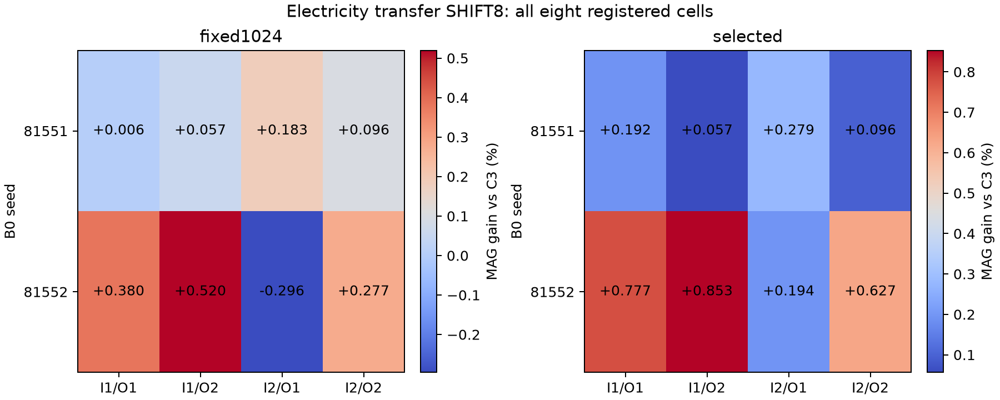

# B0·초기값·학습 순서를 분리한 C3/MAG 통제 실험

**실행 완료:** 32개 경로 중 기존8개를 검증 후 재사용하고 새24개를 모두1024 updates 학습했다. 본학습24,576+smoke12=24,588 updates. 선택64개 모델 view, 평가192개 view 중 신규129·재사용63개. 누락된 예정 경로는0개다. 새 후보·LR 검색·후속학습은 없다.

## 질문과 해석 범위

기존 seed 효과에 묶여 있던 B0 가중치, 추가 어댑터 초기값, batch 순서를81551/81552 두 수준에서 교차했다. 동일 조합의 C3/MAG는 다른 조건이 같고 gate만 다르다. 주 분석은 fixed1024, 보조 분석은 기존 V 규칙으로 선택한 checkpoint다. 모든 선택과 전체 예측을 저장한 뒤 E를 채점했다.

이는 기존 결과를 본 뒤 수행한 두 수준의 통제 진단이다.81553을 포함한 과거 결과는 보존했고 원 논문에서 제외하지 않는다. 이번 두 수준의 결과를 초기화 전체 모집단 또는 새로운 독립 시험으로 일반화하지 않는다. B0 수준의 변화는 학습된 checkpoint 전체의 교체이며 B0 내부의 어떤 표현이 원인인지는 별도 문제다.

## 주 분석: 어느 요인의 차등 효과가 컸나

전력 전이 SHIFT8의 d=nMAE(C3)−nMAE(MAG)에서 절대 점추정이 가장 큰 전체 성분은 **B0:INIT**, 단일 요인 주효과 중에는 **INIT**다. 이는 관찰한 두 수준과 나머지 요인의 동일 가중 평균에 한정된 순위다. 계수의 크기 순위에 대한 별도 통계 검정을 하지 않았으므로 ‘가장 크다는 것이 확정’이라고 쓰지 않는다. 교호 성분이 크면 단일 요인만으로 설명하지 않는다.

contrast는2×mean(d×각 요인의±1 부호곱)이다. 단일 요인에서는 다른 두 요인을 평균한 high−low 차이와 같다. 양수는 해당 요인 수준이 높아지면 MAG 방향의 차이가 커짐을 뜻한다. 이원·삼원 contrast는 동일 척도의 factorial contrast이며 원자료의 단순 두 셀 차이와 다르다. %는8셀의 공통 C3 오차를 분모로 한다. 셀 간 분산 비중은 이8셀의 설명적 분해이며 인과 확률이나 초기화 모집단 분산 비중이 아니다.

| 요인 | d contrast(nMAE) | 공통 분모 % | 조건부 Bonferroni7 구간 | 셀 분산 비중% |
| --- | --- | --- | --- | --- |
| B0 | +0.00050907 | +0.1394 | [+0.00008344, +0.00088554] | 8.60 |
| INIT | -0.00065791 | -0.1801 | [-0.00090861, -0.00039078] | 14.37 |
| ORDER | +0.00062193 | +0.1703 | [+0.00051560, +0.00072640] | 12.84 |
| B0:INIT | -0.00104889 | -0.2872 | [-0.00120359, -0.00091856] | 36.51 |
| B0:ORDER | +0.00068854 | +0.1885 | [+0.00053645, +0.00082035] | 15.73 |
| INIT:ORDER | +0.00028138 | +0.0770 | [+0.00008776, +0.00049211] | 2.63 |
| B0:INIT:ORDER | +0.00052995 | +0.1451 | [+0.00039595, +0.00069028] | 9.32 |

| B0 | 초기값 | 순서 | C3 nMAE | MAG nMAE | MAG 이득(%) |
| --- | --- | --- | --- | --- | --- |
| 81551 | 81551 | 81551 | 0.36066358 | 0.36064235 | +0.0059 |
| 81551 | 81551 | 81552 | 0.35737395 | 0.35717077 | +0.0569 |
| 81551 | 81552 | 81551 | 0.36124024 | 0.36057947 | +0.1829 |
| 81551 | 81552 | 81552 | 0.35819482 | 0.35784923 | +0.0965 |
| 81552 | 81551 | 81551 | 0.37360315 | 0.37218257 | +0.3802 |
| 81552 | 81551 | 81552 | 0.36951706 | 0.36759733 | +0.5195 |
| 81552 | 81552 | 81551 | 0.37129373 | 0.37239126 | -0.2956 |
| 81552 | 81552 | 81552 | 0.37003701 | 0.36901274 | +0.2768 |

## 원점수와 조건별 손해

아래는 각 조합을 동일 가중한 평균이다. 공식 원래3seed 평균을 대체하는 점수가 아니며 연구 성공 기준으로 새로 선택한 점수도 아니다. 개별8조합·9형태·모든 fault 상태는 CELL_EFFECTS.csv와 RAW_SCORES.csv에 보존했다.

| 패널 | checkpoint | 조건 | C3 | MAG | MAG 이득% |
| --- | --- | --- | --- | --- | --- |
| electricity | fixed1024 | REFERENCE | 0.1670709 | 0.1670811 | -0.0061 |
| electricity | fixed1024 | FAULT | 0.1722803 | 0.1722682 | +0.0070 |
| electricity | fixed1024 | SHIFT4 | 0.1890400 | 0.1890720 | -0.0169 |
| electricity | fixed1024 | SHIFT8 | 0.2024921 | 0.2024730 | +0.0094 |
| electricity | fixed1024 | SHIFT_POINT | 0.1935993 | 0.1937657 | -0.0860 |
| electricity | selected | REFERENCE | 0.1669362 | 0.1669665 | -0.0182 |
| electricity | selected | FAULT | 0.1721199 | 0.1721242 | -0.0025 |
| electricity | selected | SHIFT4 | 0.1891726 | 0.1891938 | -0.0112 |
| electricity | selected | SHIFT8 | 0.2018112 | 0.2015704 | +0.1193 |
| electricity | selected | SHIFT_POINT | 0.1935912 | 0.1936945 | -0.0534 |
| electricity_transfer | fixed1024 | REFERENCE | 0.2400674 | 0.2401230 | -0.0231 |
| electricity_transfer | fixed1024 | FAULT | 0.2558013 | 0.2558814 | -0.0313 |
| electricity_transfer | fixed1024 | SHIFT4 | 0.3167241 | 0.3166302 | +0.0297 |
| electricity_transfer | fixed1024 | SHIFT8 | 0.3652404 | 0.3646782 | +0.1539 |
| electricity_transfer | fixed1024 | SHIFT_POINT | 0.3326540 | 0.3326613 | -0.0022 |
| electricity_transfer | selected | REFERENCE | 0.2402336 | 0.2402625 | -0.0120 |
| electricity_transfer | selected | FAULT | 0.2557697 | 0.2558232 | -0.0209 |
| electricity_transfer | selected | SHIFT4 | 0.3186734 | 0.3183942 | +0.0876 |
| electricity_transfer | selected | SHIFT8 | 0.3638214 | 0.3624135 | +0.3870 |
| electricity_transfer | selected | SHIFT_POINT | 0.3344174 | 0.3340767 | +0.1019 |
| ettm1 | fixed1024 | REFERENCE | 0.4074240 | 0.4073187 | +0.0258 |
| ettm1 | fixed1024 | FAULT | 0.4238779 | 0.4238418 | +0.0085 |
| ettm1 | fixed1024 | SHIFT4 | 0.5478272 | 0.5478993 | -0.0132 |
| ettm1 | fixed1024 | SHIFT8 | 0.5487170 | 0.5495218 | -0.1467 |
| ettm1 | fixed1024 | SHIFT_POINT | 0.5881615 | 0.5882516 | -0.0153 |
| ettm1 | selected | REFERENCE | 0.4072575 | 0.4072780 | -0.0051 |
| ettm1 | selected | FAULT | 0.4232910 | 0.4233005 | -0.0022 |
| ettm1 | selected | SHIFT4 | 0.5498654 | 0.5503121 | -0.0812 |
| ettm1 | selected | SHIFT8 | 0.5465155 | 0.5460862 | +0.0786 |
| ettm1 | selected | SHIFT_POINT | 0.5886190 | 0.5889560 | -0.0573 |

## 검증과 비용

실제 모델의 초기 B0 동일성, residual-off 복원, 학습 중 동결 가중치·buffer 유지, 추가파라미터 갱신, 저장/복원 검사를 통과했다. 독립 감사는 동일 B0 수준의 동결 hash와 동일 초기화 수준의 실제 tensor를 비교했고,840개 contrast를 별도 marginal 합산으로 재계산했다.960개 셀 집계와 기존 selected 대각선120개를 재현했다. 원점별 nMAE와 pinball을 scalar loop로 검산했다. 날짜 bootstrap은 고정 모델에 조건부인2000회7일 block 재추출이고7contrast 내 다중비교 구간을 병기했다. 서로 다른 자료·상태 전체에 대한 familywise 보장을 주장하지 않는다.

새 optimizer 시간은12.75분, 검증2.10분, 새 추론13.49분, 전체 runner wall33.06분이다. 새 학습 peak allocated는362.1MiB, GPU 최소 여유는8227MiB였다. RustDesk는 기존 승인 예외이고 외부 학습 감지 표본은0개다. 원 모델·LoRA 비용을 제외한 추가 모듈의8,712파라미터만으로 전체 배포 비용을 주장하지 않는다.

## 논문에 남길 주장과 한계

이 통제는 앞선 ‘한 seed가 평균 차이에85.4% 기여했다’는 관찰보다 원인을 더 좁힌다. 하지만 직접 통제한 것은 B0·초기값·순서의 선택한 두 수준이다. 내부 gradient나 표현의 작동 원리 전체를 입증한 것은 아니다. 실제 센서 사건 레이블은 없고, E는 반복 사용한 개발 기간이다. 기존 C3의 좁은 양성 결과와 단순 MAG의 우위·손해를 함께 보존한다. 원인 규명이 새 지속성 구성요소의 성능 우위 또는 신규성을 자동으로 만들지는 않는다.

FINAL_DECISION.md에 실제 방향·상호작용·checkpoint 민감도를 해석한다. 새 모델 선택이나 자동 후속학습은 실행하지 않는다. 원 가중치·TRAIN·전체 예측은 로컬 캐시이며 GitHub에는 코드·봉인·집계·검산만 공개한다.
