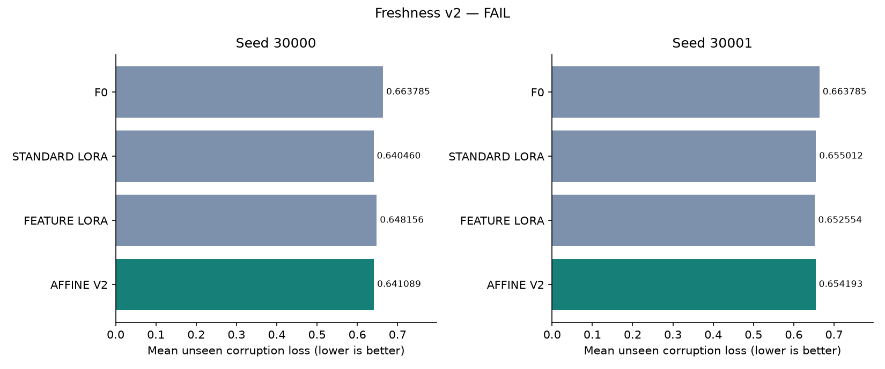
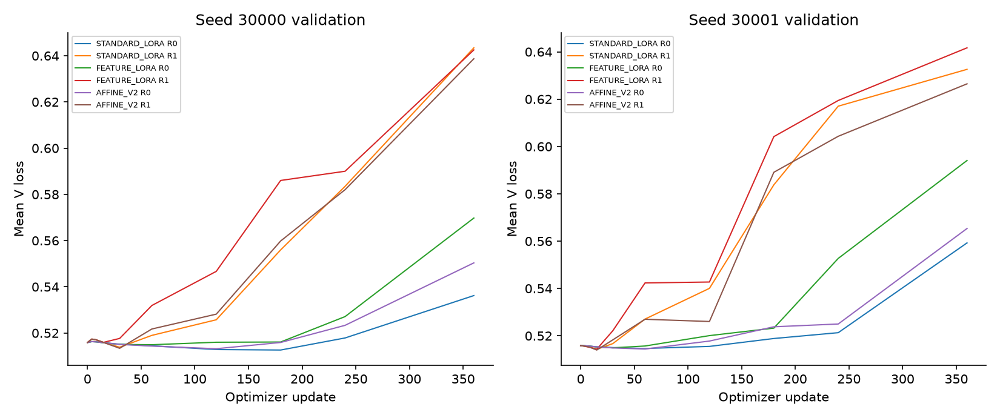
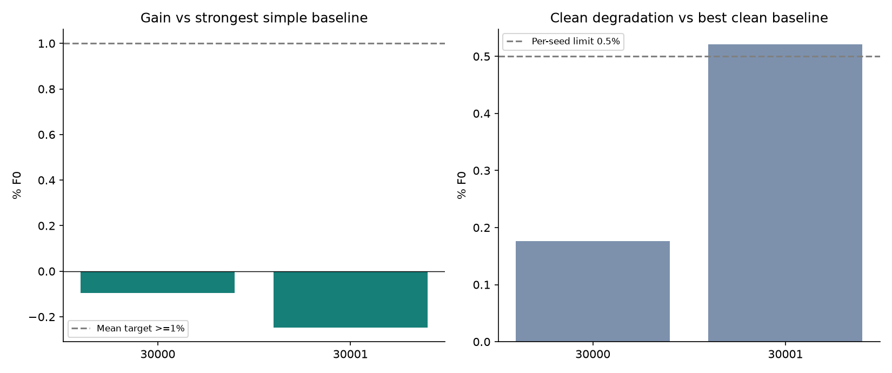

# Candidate01 v2 — FAIL

[문제·범위]
동일 시점에 손상시킨 원래 gate와 구분해 채널별 갱신 간격·offset·block 위치가 다른 관측 과정을 검사했다. [사전 고정 계약](../../docs/CANDIDATE_01_V2.md), [사용자 검토문](../../docs/USER_DESIGN_REVIEW_2026_09_13.md). 이전 실패 결과와 05 복구 결과는 byte 단위로 그대로 보존했다.

[방법·강한 대조]
Standard LoRA, 동일 관측 상태를 사용하는 기존 additive Feature LoRA, clean-centered scale+shift Affine v2. 표준 LoRA1,179,648 parameters; Feature 추가3072, Affine 추가4608. 같은 frozen Chronos-2/native head와 상태·시간·마스크 정보. Affine의 clean-reference 추가항은0이지만 공유 LoRA 학습 때문에 F0 clean 성능 보존을 보장하지 않는다. Affine modulation 자체의 신규성은 주장하지 않는다.

[데이터·학습]
Jena hourly4채널, context336/horizon48, 원래 train/V/E split과 train scale. Train mixture clean/refresh/block/combined 각25%. 3 arms × 2 recipes × 2 seeds, 12 fits × 360 updates =4320 updates. LoRA LR3e-5/1e-4, conditional LR3e-4/1e-3를 Feature/Affine에 동일하게 제공했다. 6개 최종 모델을 V로 선택·봉인한 뒤 E를 열었다. 선택된 step0 모델 0/6, step360 모델 0/6. E는 이미 연구에 사용한 개발 구간이며 독립 holdout이 아니다.

[문제 gate]
{"degradation_percent": {"block_train": -1.3496896154421205, "combined_train": 15.087999514955568, "refresh_train": 12.222585089392322}, "loss": {"block_train": 0.5036913873167717, "clean": 0.5105826685727453, "combined_train": 0.5876193791304483, "refresh_train": 0.572989069690739}, "mean_degradation_percent": 8.653631662968591, "status": "PASS"}

[raw·relative 결과]

| Seed | Strongest baseline | Baseline loss | Affine loss | Gain %F0 | Clean degradation %F0 |
| --- | --- | ---: | ---: | ---: | ---: |
| 30000 | STANDARD_LORA | 0.640460108 | 0.641088936 | -0.094734 | 0.176267 |
| 30001 | FEATURE_LORA | 0.652554267 | 0.654193097 | -0.246892 | 0.521507 |

F0 unseen 평균 손실 0.663785142. Gain은 `100*(baseline-proposed)/F0`; 일반 baseline-relative 개선율이 아니다. 두 seed 평균 gain **-0.170813%F0**. Affine의 F0 대비 이득은 seed30000 3.419210%F0, seed30001 1.445053%F0다. 그러나 첫 seed의 Feature 대비 이득 1.064624%F0는 더 강한 Standard 대비 이득으로 이어지지 않았고, 두 번째 seed에서는 Feature보다도 나빴다. 전체35개 arm/seed/regime 지표는 metrics.csv, 개별 corruption 효과는 regime_effects.csv에 있다. Clean과 unseen 결과를 혼합해 primary를 만들지 않았다.

[성공·실패 판정]
**FAIL**. 두 seed 각각 양의 효과, 두 seed 평균 ≥1%F0, 각 seed clean 손해 ≤0.5%F0를 모두 요구했다. E 결과로 설정·checkpoint·threshold를 바꾸지 않았다. 양의 미세 차이를 통계적 유의성으로 해석하지 않는다.

[무결성·조건부 계산]
CPU 기능 테스트와 실제 train-only 첫8 scheduled updates에서 Feature/Affine의 조건부 gradient/update 및 상태 교체에 따른 예측 변화가 확인됐다. Affine scale·shift 양쪽 gradient도 비영이다. 실제 학습 schedule에서 clean-centered state 행렬의 rank는 두 seed 모두3이다(train_state_support.json). 세부 범위·gradient/update norm은 branch_diagnostics.csv, 선택 checkpoint의 상태 민감도는 integrity.json에 있다. 초기 F0 identity와 checkpoint replay 오차0, frozen weights 불변. 저장된 E 예측35개를 독립 계산한 지표 replay 최대 오차 2.22e-16; 타깃이 원래 값과 같고 selection이 V 최소값인지 독립 검증했다. 별도 regularizer는 없다.

[계산량]
이번 추가12 fits, wall 990.088s, peak allocated GPU 709042176 bytes. Gate 및 진단 forward 시간은 candidate wall에 포함된다. job_exit.json은 worker 프로세스 시작·종료 시간을 포함한 총시간이다. 실행 전 GPU 유휴 대기 시간은 이 두 기록에서 제외된다. 누적 실험46 standard fits +9 stream attempts (8 complete,1 historical abort). 기존38-fit screen 예산을 새 실험까지 포함한 것처럼 표기하지 않는다.

[한계·후속]
두 seed·단일 개발 데이터의 한정된 학습 예산이다. 각 origin의 관측 episode마다 주기·offset 배치를 생성하므로, 전체 기간에 하나의 지속적인 센서 달력이 있는 상황까지 검증한 것은 아니다. 실제 비동기 센서 분포, 독립 원천 일반화, 충분한 수렴, 논문 수준 신규성을 입증하지 않는다. 새 모듈을 충분히 학습하면 성공한다거나 본 실패가 아이디어 전체를 반증한다고 주장하지 않는다. 사전 규칙에 따라 이 v2 분기를 종료한다. 추가 LR·seed·threshold 탐색이나 새 원천 실험은 진행하지 않는다. Round2 실행0.

[학습 경로·진단 그림]

[실행 리비전]
`ebb1ee89ee64266fe1eebed41d0b6017f68250c3`. 계약·소스·선택·캐시 해시 검증은 verification.json에 기록했다. [원래 7개 후보 결과](../screening_summary/latest_review.md)와 v2는 별도 실험이다.
