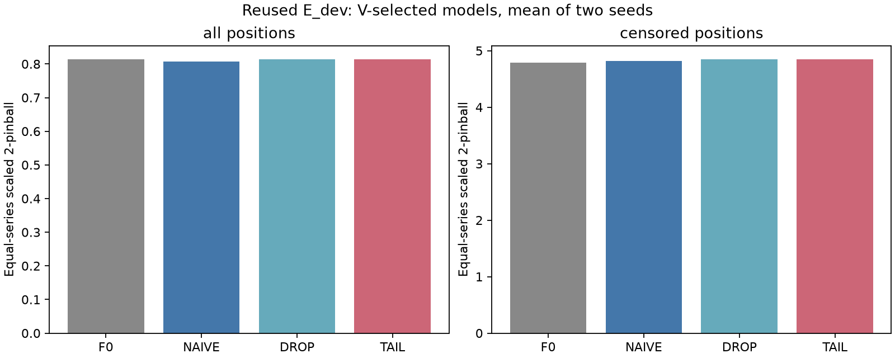
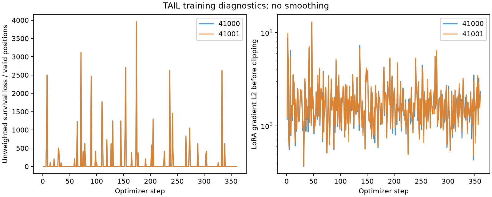

# 품절·검열 관측 PEFT: 꼬리 수정 통제 파일럿

본학습 6 fits / 2160 updates, smoke 6 updates 완료. 판정: **현재 설정에서 추가 가치 미확보**. 자동 후속 실행 없음.

## 1. 문제와 비교

기존 유한 지지범위와 survival clipping은 강한 하한 위반에서 큰 손실과 0 gradient를 함께 만든다. NAIVE(관측량 감독), DROP(검열 target 제외), TAIL(DROP + 하한 초과 사건 벌점)을 동일 Chronos-2 rank8 LoRA와 360-step 예산으로 비교했다.

## 2. 수정과 데이터 계약

정렬된 분위수 사이를 선형 보간하고 양끝에 지수 꼬리를 붙여 log-survival을 직접 계산한다. 이는 연속 분포 proxy 가정이며 정확한 count likelihood, ISQF 전체 재현 또는 새 PEFT 구조가 아니다. 원래 CDF와 과거 결과는 수정하지 않았다.

| 항목 | 과거 Candidate07 | 이번 파일럿 |
| --- | --- | --- |
| 꼬리 | 유한 연장 + 확률 clipping | 무한 지수 꼬리 + FP64 log-domain |
| 정규화 scale | 원판매량 학습 표준편차 | capped 관측 학습 표준편차 |
| lambda | 첫 batch | F0의 첫 16개 train batch |
| 보존항 | 비교 arm에 포함 | 없음 |
| 예산 | 기존 2 LR | LR1e-4, seeds41000/41001, 6 fits |

기존 M5 256개 계열과 상한을 유지했다. 숨긴 초과 크기는 학습 데이터 객체에 들어가지 않는다. 모든 arm에는 원판매량 clean V 선택 권한을 동일하게 부여했다. E_dev는 이미 사용된 개발 평가 구간이며 독립 test가 아니다. 원판매량 자체가 실제 잠재 수요라는 보장도 없다.

## 3. 전체 결과

| arm | seed | 선택 step | 전체 primary | E_model/E_F0 |
| --- | --- | --- | --- | --- |
| F0 | shared | 0 | 0.813549085 | 1.000000000 |
| NAIVE | 41000 | 360 | 0.807933712 | 0.993097683 |
| DROP | 41000 | 15 | 0.813389227 | 0.999803505 |
| TAIL | 41000 | 15 | 0.813374795 | 0.999785765 |
| NAIVE | 41001 | 360 | 0.807844658 | 0.992988220 |
| DROP | 41001 | 15 | 0.813328162 | 0.999728445 |
| TAIL | 41001 | 15 | 0.813314467 | 0.999711611 |

주 지표는 계열별 동일 가중 scaled 2-pinball이며 CRPS/WQL이 아니다. primary는 V-selected, step360은 별도 secondary로 고정했다. 두 seed 평균은 아래 TAIL 비교표에 포함된다.

| 역할 | 비교 | baseline 평균 primary | TAIL 평균 primary | 개선율 % | 기술적 95% CI % |
| --- | --- | --- | --- | --- | --- |
| selected | TAIL_vs_DROP | 0.813358694 | 0.813344631 | +0.001729 | [+0.001559, +0.001886] |
| selected | TAIL_vs_NAIVE | 0.807889185 | 0.813344631 | -0.675272 | [-0.890398, -0.469013] |
| selected | TAIL_vs_F0 | 0.813549085 | 0.813344631 | +0.025131 | [-0.059775, +0.116342] |
| endpoint | TAIL_vs_DROP | 0.834201756 | 0.834321637 | -0.014371 | [-0.020716, -0.008295] |
| endpoint | TAIL_vs_NAIVE | 0.807889185 | 0.834321637 | -3.271792 | [-3.719790, -2.835220] |
| endpoint | TAIL_vs_F0 | 0.813549085 | 0.834321637 | -2.553325 | [-3.106645, -2.020859] |

개선율은 100*(baseline−TAIL)/baseline이다. 2,000회 paired series bootstrap은 같은 계열의 모든 시점과 두 seed를 함께 유지했다. 같은 상품/상점·날짜의 상관을 완전히 처리하지 못하므로 유의성이나 일반화를 확증하지 않는다.

## 4. 하위집단과 학습 신호

[metrics.csv](metrics.csv)에 전체·synthetic-censored·나머지 위치의 primary, 전체 오차 기여도, median MAE와 signed bias, q10–q90 coverage/width를 기록했다. 검열/비검열 기여도는 전체 위치 분모를 유지하여 전체 primary와 합이 일치한다. subgroup primary는 해당 위치가 있는 계열의 동일 가중 평균이다.

[train_diagnostics.csv](train_diagnostics.csv)에 매 update의 task/survival, gradient norm/clipping과 TAIL의 꼬리 사용·gap floor·knot 이동·강한 upper-tail common-shift 미분을 기록했다. 모든 개별 knot 미분의 부호를 동일하게 요구하지 않는다.

## 5. 자원과 검증

[fits.json](fits.json)에 fit별 wall/training/V/I/O/대기 시간과 최대 allocated/reserved GPU·CPU RAM, nonzero gradient updates, 선택 step을 기록했다. [verification.json](verification.json)에 독립 수치 재생, checkpoint reload, 원자료/과거 결과/source 해시 검사 및 실제 counts를 기록했다.

TAIL의 확률 계산은 추가 비용이다. 동일 파라미터·updates는 동일 시간·메모리를 의미하지 않는다. 자원 우위를 주장하지 않는다. CPU/smoke 합격은 성능 성공 판정과 별개다.

## 6. 한계와 다음 결정

현재 설정에서 추가 가치 미확보. 이 결과로 실제 재고 수익·잠재 수요 복원·새 방법 신규성·독립 test 성능을 주장하지 않는다. 과거 buggy loss의 동조건 재학습을 하지 않았으므로 꼬리 구현만이 과거 실패의 원인이었다고 결론 내릴 수 없다. 고정 상한 초과량의 분포는 하한 사건만으로 식별되지 않으며 사전학습과 꼬리 가정에 의존한다.

6 fits 이후 추가 학습은 실행하지 않는다. 새 PEFT로 연결하려면 별도 사용자 판단과 신규성·필요성 검토가 필요하다.

참고: [Park et al., AISTATS 2022](https://proceedings.mlr.press/v151/park22a.html), [GluonTS ISQF exponential-tail 문서](https://ts.gluon.ai/stable/api/gluonts/gluonts.torch.distributions.isqf.html), [FreshRetailNet-50K](https://arxiv.org/html/2505.16319v5). 이번에는 FreshRetailNet 다운로드나 학습을 하지 않았다.

부가 판정: 추가 해당 사항 없음

### 선택 모델의 seed 평균과 하위집단

| arm | 집단 | primary | 전체 기여도 | median MAE | signed bias | coverage80 | width80 |
| --- | --- | --- | --- | --- | --- | --- | --- |
| F0 | all | 0.8135491 | 0.8135491 | 0.7415710 | -0.4342335 | 0.7801378 | 1.4537481 |
| F0 | censored | 4.7885264 | 0.4092080 | 3.0255167 | -3.0255167 | 0.0028058 | 1.5191080 |
| F0 | uncensored | 0.4606493 | 0.4043411 | 0.4613779 | -0.0650256 | 0.8621095 | 1.4511811 |
| NAIVE | all | 0.8078892 | 0.8078892 | 0.7349354 | -0.4821347 | 0.7944743 | 1.4753003 |
| NAIVE | censored | 4.8162414 | 0.4145180 | 3.0707794 | -3.0707794 | 0.0021481 | 1.5617847 |
| NAIVE | uncensored | 0.4477202 | 0.3933711 | 0.4435942 | -0.1143690 | 0.8772731 | 1.4706066 |
| DROP | all | 0.8133587 | 0.8133587 | 0.7390169 | -0.4694694 | 0.7883979 | 1.4261608 |
| DROP | censored | 4.8462749 | 0.4143262 | 3.0625918 | -3.0625918 | 0.0024835 | 1.4929112 |
| DROP | uncensored | 0.4544200 | 0.3990325 | 0.4508041 | -0.1004407 | 0.8698247 | 1.4231271 |
| TAIL | all | 0.8133446 | 0.8133446 | 0.7390150 | -0.4694748 | 0.7884928 | 1.4263641 |
| TAIL | censored | 4.8460493 | 0.4143080 | 3.0625965 | -3.0625965 | 0.0024835 | 1.4931277 |
| TAIL | uncensored | 0.4544245 | 0.3990366 | 0.4508000 | -0.1004466 | 0.8699390 | 1.4233293 |

자원 총계: {"gpu_peak_allocated": 706577408, "gpu_peak_reserved": 731906048, "gpu_wait_seconds": 30.264638076005212, "io_seconds": 15.04204755799583, "model_backward": 2160, "model_forward": 5424, "output_tensor_backward": 192, "peak_cpu_rss_bytes": 2819604480, "rustdesk_exception_authorized": true, "scoring_seconds": 29.15946896300011, "seconds": 404.9636718189977, "validation_seconds": 94.7740144929885}. 전처리/CPU 구현 시간은 모델 실행 wall time에 포함되지 않는다. GPU startup 안정화 대기 30초도 대기 비용에 포함한다.

