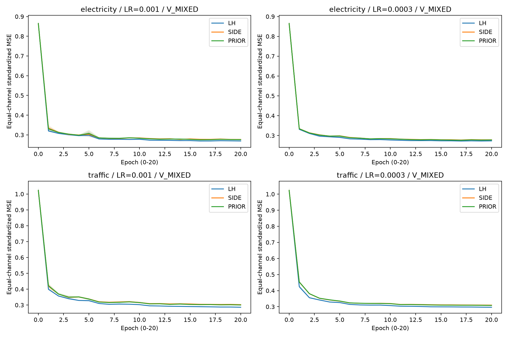
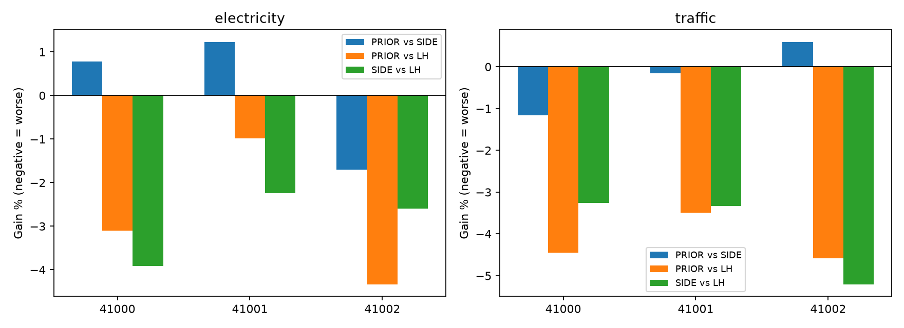
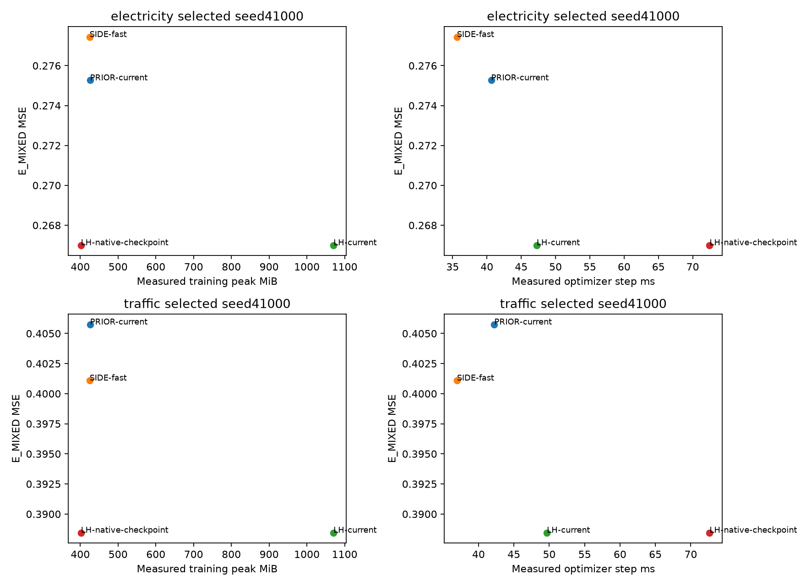
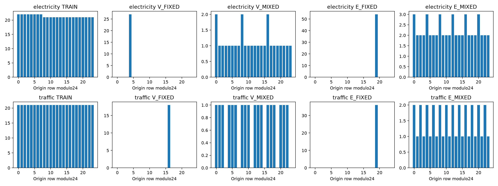

# 교정된 표본 위 MOMENT PEFT 비교 — 실행 완료

교정된 TRAIN 표본에서 LH(LoRA+HEAD), SIDE, PRIOR에 같은 최적화 기회를 주고, 학습률 선택과 검증 패널 선택 효과를 분리했다. 새로운 PEFT 발명 실험이 아니다. 건물·예보·Query·Censor·BASIS 결과를 합치지 않았다.

36/36개 20-epoch 경로를 완료했다. 신규 28 fits·35,580 updates, 기존 8 fits·10,140 updates를 감사 후 재사용했다. 재사용 점수는 복사하지 않고 두 V 패널을 다시 예측했다. smoke 6회·12 updates, 자원 검사 104 폐기 updates. 본학습·평가 미실행 0. 재개 0회. INIT와 매 epoch를 보존했다.

TRAIN 원점, 모델 revision, 채널32, L96/H96, 761,952 trainable, BF16 forward/FP32 loss·Adam, micro/effective8을 고정했다. LR {0.001,0.0003}, seeds {41000,41001,41002}, StepLR5/0.5, epochs20을 모든 방법에 적용했다. V patience는 사용하지 않았다. 마지막 epoch가 최소 V인 경로는 예산 제한으로 해석하며 연장하지 않았다.

V_MIXED에서 3seed 평균 최소 V로 공통 LR을 고르고 seed별 epoch를 선택했다. P_VFIXED는 그 LR에서 검증 패널만, P_LR_FIXED는 V_MIXED에서 LR 허용만, P_LAST20은 반환 epoch만 바꾼다. 전체 학습 및 선택 봉인 뒤 E를 열었다.

## 원점수와 선택 효과

| 원천 | 평가 | 방법 | 정책 | 평균 MSE | 평균 MAE | raw MAE |
|---|---|---|---|---:|---:|---:|
| electricity | E_FIXED | INIT | BASELINE | 0.838471454 | 0.694289191 | 73.350918 |
| electricity | E_FIXED | LAST_VALUE | BASELINE | 1.561748413 | 0.919577566 | 99.082357 |
| electricity | E_FIXED | LH | P_LAST20 | 0.274718902 | 0.351194787 | 35.612584 |
| electricity | E_FIXED | LH | P_LR_FIXED | 0.274625866 | 0.350849408 | 35.604900 |
| electricity | E_FIXED | LH | P_MAIN | 0.274625866 | 0.350849408 | 35.604900 |
| electricity | E_FIXED | LH | P_VFIXED | 0.275333823 | 0.351789221 | 35.689624 |
| electricity | E_FIXED | PRIOR | P_LAST20 | 0.279912821 | 0.358170625 | 36.346565 |
| electricity | E_FIXED | PRIOR | P_LR_FIXED | 0.278451033 | 0.356837406 | 36.247631 |
| electricity | E_FIXED | PRIOR | P_MAIN | 0.278451033 | 0.356837406 | 36.247631 |
| electricity | E_FIXED | PRIOR | P_VFIXED | 0.279674046 | 0.358474260 | 36.401445 |
| electricity | E_FIXED | SEASONAL_NAIVE | BASELINE | 0.525609095 | 0.445602675 | 46.887141 |
| electricity | E_FIXED | SIDE | P_LAST20 | 0.280209349 | 0.358067970 | 36.308197 |
| electricity | E_FIXED | SIDE | P_LR_FIXED | 0.279160379 | 0.357285772 | 36.225421 |
| electricity | E_FIXED | SIDE | P_MAIN | 0.279160379 | 0.357285772 | 36.225421 |
| electricity | E_FIXED | SIDE | P_VFIXED | 0.279141819 | 0.357858901 | 36.269682 |
| electricity | E_MIXED | INIT | BASELINE | 0.833593619 | 0.691712909 | 73.243488 |
| electricity | E_MIXED | LAST_VALUE | BASELINE | 1.403344764 | 0.855429107 | 90.445584 |
| electricity | E_MIXED | LH | P_LAST20 | 0.269563246 | 0.349051226 | 35.443364 |
| electricity | E_MIXED | LH | P_LR_FIXED | 0.268654720 | 0.348306391 | 35.378258 |
| electricity | E_MIXED | LH | P_MAIN | 0.268654720 | 0.348306391 | 35.378258 |
| electricity | E_MIXED | LH | P_VFIXED | 0.269620682 | 0.349059512 | 35.447734 |
| electricity | E_MIXED | PRIOR | P_LAST20 | 0.277089592 | 0.356837173 | 36.227591 |
| electricity | E_MIXED | PRIOR | P_LR_FIXED | 0.276161789 | 0.355973520 | 36.136547 |
| electricity | E_MIXED | PRIOR | P_MAIN | 0.276161789 | 0.355973520 | 36.136547 |
| electricity | E_MIXED | PRIOR | P_VFIXED | 0.277038931 | 0.357034453 | 36.294355 |
| electricity | E_MIXED | SEASONAL_NAIVE | BASELINE | 0.512159721 | 0.440709222 | 46.299570 |
| electricity | E_MIXED | SIDE | P_LAST20 | 0.276890685 | 0.356413973 | 36.220028 |
| electricity | E_MIXED | SIDE | P_LR_FIXED | 0.276474588 | 0.355725540 | 36.141722 |
| electricity | E_MIXED | SIDE | P_MAIN | 0.276474588 | 0.355725540 | 36.141722 |
| electricity | E_MIXED | SIDE | P_VFIXED | 0.276238067 | 0.355991191 | 36.198676 |
| traffic | E_FIXED | INIT | BASELINE | 1.281868368 | 0.785754582 | 0.040471 |
| traffic | E_FIXED | LAST_VALUE | BASELINE | 2.571855497 | 1.076846266 | 0.054632 |
| traffic | E_FIXED | LH | P_LAST20 | 0.385514434 | 0.321837053 | 0.016903 |
| traffic | E_FIXED | LH | P_LR_FIXED | 0.385514434 | 0.321837053 | 0.016903 |
| traffic | E_FIXED | LH | P_MAIN | 0.385514434 | 0.321837053 | 0.016903 |
| traffic | E_FIXED | LH | P_VFIXED | 0.386115101 | 0.322661884 | 0.016955 |
| traffic | E_FIXED | PRIOR | P_LAST20 | 0.399767627 | 0.339939359 | 0.017829 |
| traffic | E_FIXED | PRIOR | P_LR_FIXED | 0.399664786 | 0.340561971 | 0.017866 |
| traffic | E_FIXED | PRIOR | P_MAIN | 0.399664786 | 0.340561971 | 0.017866 |
| traffic | E_FIXED | PRIOR | P_VFIXED | 0.400469684 | 0.343842156 | 0.018030 |
| traffic | E_FIXED | SEASONAL_NAIVE | BASELINE | 0.981448809 | 0.488784538 | 0.025454 |
| traffic | E_FIXED | SIDE | P_LAST20 | 0.398622720 | 0.339235950 | 0.017777 |
| traffic | E_FIXED | SIDE | P_LR_FIXED | 0.397785338 | 0.339461724 | 0.017801 |
| traffic | E_FIXED | SIDE | P_MAIN | 0.397785338 | 0.339461724 | 0.017801 |
| traffic | E_FIXED | SIDE | P_VFIXED | 0.398409197 | 0.340021578 | 0.017829 |
| traffic | E_MIXED | INIT | BASELINE | 1.307571853 | 0.795721948 | 0.040966 |
| traffic | E_MIXED | LAST_VALUE | BASELINE | 2.262399656 | 1.025481134 | 0.052428 |
| traffic | E_MIXED | LH | P_LAST20 | 0.387816002 | 0.321727728 | 0.016854 |
| traffic | E_MIXED | LH | P_LR_FIXED | 0.387816002 | 0.321727728 | 0.016854 |
| traffic | E_MIXED | LH | P_MAIN | 0.387816002 | 0.321727728 | 0.016854 |
| traffic | E_MIXED | LH | P_VFIXED | 0.388172807 | 0.322423677 | 0.016896 |
| traffic | E_MIXED | PRIOR | P_LAST20 | 0.402817528 | 0.337735133 | 0.017681 |
| traffic | E_MIXED | PRIOR | P_LR_FIXED | 0.404004662 | 0.339362428 | 0.017764 |
| traffic | E_MIXED | PRIOR | P_MAIN | 0.404004662 | 0.339362428 | 0.017764 |
| traffic | E_MIXED | PRIOR | P_VFIXED | 0.402779361 | 0.341048798 | 0.017850 |
| traffic | E_MIXED | SEASONAL_NAIVE | BASELINE | 0.951668496 | 0.481092393 | 0.025027 |
| traffic | E_MIXED | SIDE | P_LAST20 | 0.403335108 | 0.339134134 | 0.017761 |
| traffic | E_MIXED | SIDE | P_LR_FIXED | 0.403043940 | 0.339701658 | 0.017790 |
| traffic | E_MIXED | SIDE | P_MAIN | 0.403043940 | 0.339701658 | 0.017790 |
| traffic | E_MIXED | SIDE | P_VFIXED | 0.403601472 | 0.340755734 | 0.017852 |

세 seed 원점수와 선택 epoch/LR은 [seed_scores.csv](seed_scores.csv), 채널 원점수는 [channel_scores.csv](channel_scores.csv)에 모두 보존했다. INIT는 무작위 forecast head의 무학습 값이며 유효한 pretrained F0가 아니다. Seasonal-naive/last-value는 같은 정보의 기준이다. 원천 간 raw 오차를 하나로 평균하지 않았다.

| 원천/평가 | 방법·대조 | 선택 효과 | 개선율 % | 블록95% 구간 |
|---|---|---|---:|---|
| electricity/E_FIXED | LH P_MAIN vs P_LR_FIXED | LR_SELECTION | +0.0000 | [0.0000, 0.0000] |
| electricity/E_FIXED | LH P_MAIN vs P_VFIXED | V_PANEL_SELECTION | +0.2571 | [0.0825, 0.4572] |
| electricity/E_FIXED | SIDE P_MAIN vs P_LR_FIXED | LR_SELECTION | +0.0000 | [0.0000, 0.0000] |
| electricity/E_FIXED | SIDE P_MAIN vs P_VFIXED | V_PANEL_SELECTION | -0.0066 | [-0.1757, 0.1417] |
| electricity/E_FIXED | PRIOR P_MAIN vs P_LR_FIXED | LR_SELECTION | +0.0000 | [0.0000, 0.0000] |
| electricity/E_FIXED | PRIOR P_MAIN vs P_VFIXED | V_PANEL_SELECTION | +0.4373 | [0.0786, 0.8129] |
| electricity/E_MIXED | LH P_MAIN vs P_LR_FIXED | LR_SELECTION | +0.0000 | [0.0000, 0.0000] |
| electricity/E_MIXED | LH P_MAIN vs P_VFIXED | V_PANEL_SELECTION | +0.3583 | [0.1583, 0.5653] |
| electricity/E_MIXED | SIDE P_MAIN vs P_LR_FIXED | LR_SELECTION | +0.0000 | [0.0000, 0.0000] |
| electricity/E_MIXED | SIDE P_MAIN vs P_VFIXED | V_PANEL_SELECTION | -0.0856 | [-0.2883, 0.1232] |
| electricity/E_MIXED | PRIOR P_MAIN vs P_LR_FIXED | LR_SELECTION | +0.0000 | [0.0000, 0.0000] |
| electricity/E_MIXED | PRIOR P_MAIN vs P_VFIXED | V_PANEL_SELECTION | +0.3166 | [0.0053, 0.7369] |
| traffic/E_FIXED | LH P_MAIN vs P_LR_FIXED | LR_SELECTION | +0.0000 | [0.0000, 0.0000] |
| traffic/E_FIXED | LH P_MAIN vs P_VFIXED | V_PANEL_SELECTION | +0.1556 | [-0.2563, 0.5632] |
| traffic/E_FIXED | SIDE P_MAIN vs P_LR_FIXED | LR_SELECTION | +0.0000 | [0.0000, 0.0000] |
| traffic/E_FIXED | SIDE P_MAIN vs P_VFIXED | V_PANEL_SELECTION | +0.1566 | [-0.1210, 0.4791] |
| traffic/E_FIXED | PRIOR P_MAIN vs P_LR_FIXED | LR_SELECTION | +0.0000 | [0.0000, 0.0000] |
| traffic/E_FIXED | PRIOR P_MAIN vs P_VFIXED | V_PANEL_SELECTION | +0.2010 | [-0.7469, 1.3167] |
| traffic/E_MIXED | LH P_MAIN vs P_LR_FIXED | LR_SELECTION | +0.0000 | [0.0000, 0.0000] |
| traffic/E_MIXED | LH P_MAIN vs P_VFIXED | V_PANEL_SELECTION | +0.0919 | [-0.3076, 0.5410] |
| traffic/E_MIXED | SIDE P_MAIN vs P_LR_FIXED | LR_SELECTION | +0.0000 | [0.0000, 0.0000] |
| traffic/E_MIXED | SIDE P_MAIN vs P_VFIXED | V_PANEL_SELECTION | +0.1381 | [-0.1390, 0.4136] |
| traffic/E_MIXED | PRIOR P_MAIN vs P_LR_FIXED | LR_SELECTION | +0.0000 | [0.0000, 0.0000] |
| traffic/E_MIXED | PRIOR P_MAIN vs P_VFIXED | V_PANEL_SELECTION | -0.3042 | [-0.8179, 0.3110] |

양수는 개선, 음수는 악화이며 0도 그대로 기록했다. P_MAIN 이외 정책이 더 좋아도 주 정책으로 승격하지 않았다.

## PRIOR의 SIDE 대비 추가 가치와 LH 대비 정확도

| 원천/평가 | 정책 | 비교 | 개선율 % | seed41000 / 41001 / 41002 % | 블록95% 구간 |
|---|---|---|---:|---|---|
| electricity/E_FIXED | P_MAIN | PRIOR vs SIDE | +0.2541 | -0.5109 / +0.7894 / +0.4841 | [-0.4447, 1.0825] |
| electricity/E_FIXED | P_MAIN | PRIOR vs LH | -1.3929 | -1.5555 / -0.3018 / -2.3273 | [-2.5698, 0.0897] |
| electricity/E_FIXED | P_MAIN | SIDE vs LH | -1.6512 | -1.0393 / -1.0999 / -2.8252 | [-3.2946, -0.1666] |
| electricity/E_FIXED | P_LAST20 | PRIOR vs SIDE | +0.1058 | -0.1924 / +0.7894 / -0.2716 | [-0.8884, 1.0719] |
| electricity/E_FIXED | P_LAST20 | PRIOR vs LH | -1.8906 | -2.0845 / -0.3018 / -3.2991 | [-3.3382, -0.1610] |
| electricity/E_FIXED | P_LAST20 | SIDE vs LH | -1.9986 | -1.8884 / -1.0999 / -3.0193 | [-3.5895, -0.7567] |
| electricity/E_MIXED | P_MAIN | PRIOR vs SIDE | +0.1131 | +0.7828 / +1.2297 / -1.6969 | [-0.7398, 1.0524] |
| electricity/E_MIXED | P_MAIN | PRIOR vs LH | -2.7943 | -3.0958 / -0.9875 / -4.3313 | [-4.3249, -1.1083] |
| electricity/E_MIXED | P_MAIN | SIDE vs LH | -2.9107 | -3.9092 / -2.2449 / -2.5904 | [-4.6982, -1.0442] |
| electricity/E_MIXED | P_LAST20 | PRIOR vs SIDE | -0.0718 | +0.6900 / +1.2297 / -2.1677 | [-0.9422, 0.8481] |
| electricity/E_MIXED | P_LAST20 | PRIOR vs LH | -2.7921 | -2.4346 / -0.9875 / -4.9947 | [-4.2388, -1.4147] |
| electricity/E_MIXED | P_LAST20 | SIDE vs LH | -2.7183 | -3.1463 / -2.2449 / -2.7670 | [-4.4722, -0.8291] |
| traffic/E_FIXED | P_MAIN | PRIOR vs SIDE | -0.4725 | -0.1142 / -0.4693 / -0.8323 | [-1.4602, 0.6882] |
| traffic/E_FIXED | P_MAIN | PRIOR vs LH | -3.6705 | -3.1730 / -3.6693 / -4.1683 | [-4.0649, -3.1939] |
| traffic/E_FIXED | P_MAIN | SIDE vs LH | -3.1830 | -3.0553 / -3.1850 / -3.3084 | [-4.5640, -2.1095] |
| traffic/E_FIXED | P_LAST20 | PRIOR vs SIDE | -0.2872 | +0.3451 / -0.4693 / -0.7386 | [-1.0207, 0.6806] |
| traffic/E_FIXED | P_LAST20 | PRIOR vs LH | -3.6972 | -3.2531 / -3.6693 / -4.1683 | [-4.1457, -3.2697] |
| traffic/E_FIXED | P_LAST20 | SIDE vs LH | -3.4002 | -3.6106 / -3.1850 / -3.4046 | [-4.7132, -2.4108] |
| traffic/E_MIXED | P_MAIN | PRIOR vs SIDE | -0.2384 | -1.1607 / -0.1600 / +0.5949 | [-0.9128, 0.5426] |
| traffic/E_MIXED | P_MAIN | PRIOR vs LH | -4.1743 | -4.4525 / -3.4962 / -4.5774 | [-5.1964, -3.1924] |
| traffic/E_MIXED | P_MAIN | SIDE vs LH | -3.9266 | -3.2541 / -3.3309 / -5.2033 | [-5.1869, -2.6504] |
| traffic/E_MIXED | P_LAST20 | PRIOR vs SIDE | +0.1283 | -0.2886 / -0.1600 / +0.8236 | [-0.6196, 1.0507] |
| traffic/E_MIXED | P_LAST20 | PRIOR vs LH | -3.8682 | -3.5357 / -3.4962 / -4.5774 | [-4.8408, -2.9256] |
| traffic/E_MIXED | P_LAST20 | SIDE vs LH | -4.0017 | -3.2378 / -3.3309 / -5.4459 | [-5.3557, -2.7451] |

PRIOR를 저장한 상태에서 prior항만 끈 V_MIXED 진단은 [prior_dependency.csv](prior_dependency.csv)에 있다. 총12 논리적 예측 중 on6개는 기존 V 예측을 참조했고 off6개만 추가했다. 제거 시 손해는 공동 적응 의존성이지 SIDE보다 우월하다는 증거가 아니다.

## 실제 자원 및 정확도 절충

| 원천 | 선택 seed41000 옵션 | 상태 | 학습 peak MiB | step 중앙값 ms |
|---|---|---|---:|---:|
| electricity | PRIOR-current | MEASURED | 425.87 | 40.618 |
| electricity | SIDE-fast | MEASURED | 424.74 | 35.635 |
| traffic | PRIOR-current | MEASURED | 425.87 | 42.232 |
| traffic | SIDE-fast | MEASURED | 424.74 | 36.954 |
| electricity | LH-current | MEASURED | 1070.35 | 47.246 |
| traffic | LH-current | MEASURED | 1070.35 | 49.659 |
| electricity | LH-native-checkpoint | MEASURED | 401.59 | 72.455 |
| traffic | LH-native-checkpoint | MEASURED | 401.59 | 72.655 |

위 표는 이번 선택 상태에서 고정 TRAIN batch로 실제 측정한 값이다. 지원·동등성 미확보 옵션은 NOT_MEASURED이고 0은 실제 비용 0을 뜻하지 않는다. 각 측정은 같은 arm의 저장 가중치·빈 Adam·RNG를 복원하고 warmup2+timed9 updates를 폐기했다. 과거 Adam 상태를 복원했다고 주장하지 않는다. 두 LR 탐색의 전체 비용과 선택 prefix 비용은 구분해야 하며, 모든 fits의 실제 비용은 [main_resources.csv](main_resources.csv), 선택 updates는 selection_seal.json에 있다. 재사용 fit의 과거 비용은 provenance를 표시했다.

본학습 SIDE는 기존처럼 쓰지 않는 prior도 추출했다. SIDE-fast는 자원 전용 경로이며 같은 형태의 출력·gradient·update 검사를 통과한 경우에만 비용을 제시했다. LH native checkpoint도 동일한 자원 전용 기준이다. 메모리 이득을 PRIOR 고유 기여나 동등한 정확도로 해석하지 않는다. 학습 allocated/reserved, 평가/로드 peak, NVML 전체 사용량은 별도이며 비동시 peak를 더하지 않았다.

GPU 최소 여유 7508 MiB, 비승인 compute 표본 0, 오염 학습 step 0. RustDesk만 승인 예외다. 같은 epoch 기회이며 같은 wall-time 실험이 아니다.

## 검산·한계·결정

독립 FP64 scalar 4,974개(최대 절대 차이 1.42e-14), 756개 checkpoint hash, 선택 규칙 72개, 새 모델 복원 40개(비트 일치 40), 기존 파일 2325개 보존을 확인했다. [검증 기록](independent_verification.json).

두 V/E 패널은 일부 다른 target을 포함한다. MIXED 생성은 값과 예측을 보지 않았지만 순수 위상 인과효과는 아니다. Traffic V는 18개 위상만 포함한다. E의 예측 target 중첩, phase와 시간의 상관, 이미 사용한 기간의 선택 편향이 남는다. 8개 연속 origin 블록을 복원추출해 N개까지 이어 붙여 자르고, 채널별 유효 target 분모를 다시 계산했다. 2,000개 paired resample의 동일 인덱스를 모든 방법·정책·seed에 사용했다. 3seed는 독립 source3개가 아니며 CI는 개발자료의 서술적 구간이다.

작은 Q/K/V adapter는 Tiny-Attention, 백본 역전파를 줄이는 side 원리는 LST, 기존 attention score에 보정을 더하는 가까운 사례는 LiSA에 있다. 현 PRIOR의 확률 평균 위치·동결 side 연결 차이는 필요성과 고유 효용을 추가 입증해야 한다. 공식 알고리즘 전체 직접 재현은 이번 범위에서 실행하지 않았다. [보존된 선행 감사](../../research/attention_prior_novelty_audit_20260916/REPORT.md). 수치 신호와 신규성은 별개다.

최종 결정 **C**: LH가 두 원천의 주 비교에서 가장 정확하다. 교정된 LH를 작동 기준으로 보존한다. SIDE는 측정된 저메모리 대조군으로만 보관하며 PRIOR 확장과 새 attention 후보 자동 생성을 중단한다. 실행 완료를 논문 PASS라고 부르지 않는다. [FINAL_DECISION.md](FINAL_DECISION.md). 추가 연구 자동 실행 없음.

원시 자료·모델 가중치·예측 배열은 무시된 로컬 cache에 보관한다. GitHub의 코드·점수·manifest만으로 전체 수치를 재생할 수 있다는 뜻은 아니다.

## 선택 비용·자원 절충·평가 패널 민감도 추가 검산

이번 GPU controller wall은 95.55분이며 이 중 GPU 안전 대기는 30.27초다. 신규 본학습의 active optimizer 구간 합은 24.72분, 신규 fit 전체 wall 합은 92.74분이다. 추가 검증·모델 로드·저장·안전 감시 비용 때문에 active 시간과 전체 시간을 구분했다. 이 실행에서 실제 수행한 optimizer 업데이트는 본학습+smoke+자원 합 35,696회다. 재사용 10,140회는 과거 작업으로 별도 집계한다.

선택된 prefix와 두 LR 전체 학습의 비용은 [selection_cost.csv](selection_cost.csv)에 모든 정책·seed별로 있다. 20 epoch에서 V 최소를 갱신한 경로는 [budget_status.csv](budget_status.csv)의 BUDGET_LIMITED로 표시했으며 자동 연장하지 않았다. 전체 신규 28개 완전 재개 상태를 [resume_audit.json](resume_audit.json)에서 검산했다.

| 원천 | 자원 옵션 vs LH-current | 같은 seed의 정확도 이득 % | 학습 peak 절감 % | step 시간 절감 % |
|---|---|---:|---:|---:|
| electricity | SIDE-fast | -3.9092 | +60.32 | +24.58 |
| electricity | PRIOR-current | -3.0958 | +60.21 | +14.03 |
| electricity | LH-native-checkpoint | +0.0000 | +62.48 | -53.36 |
| traffic | SIDE-fast | -3.2541 | +60.32 | +25.58 |
| traffic | PRIOR-current | -4.4525 | +60.21 | +14.96 |
| traffic | LH-native-checkpoint | +0.0000 | +62.48 | -46.31 |

이 자원 표의 정확도는 동일한 선택 seed41000이고, 주 성능 판정은 앞의 3seed 평균과 별개다. 자원 benchmark는 선택 가중치에서 같은 arm의 저장된 빈 Adam/RNG를 복구하고 동일한 초기 LR로 warmup2+timed9를 수행했다. 과거 optimizer 연속 학습을 복원한 것이 아니다. GUI 부하는 제거하지 않았으므로 시간은 이 데스크톱 환경의 실측이며 전용 GPU 조건의 속도를 보증하지 않는다. 비승인 compute가 없었다는 기록과 GUI 부하 통제는 다르다.

| 원천 | P_MAIN 방법 | E_FIXED MSE | E_MIXED MSE | MIXED 상대 변화 % |
|---|---|---:|---:|---:|
| electricity | LH | 0.274625866 | 0.268654720 | -2.1743 |
| electricity | PRIOR | 0.278451033 | 0.276161789 | -0.8221 |
| electricity | SIDE | 0.279160379 | 0.276474588 | -0.9621 |
| traffic | LH | 0.385514434 | 0.387816002 | +0.5970 |
| traffic | PRIOR | 0.399664786 | 0.404004662 | +1.0859 |
| traffic | SIDE | 0.397785338 | 0.403043940 | +1.3220 |

양의 패널 변화는 E_MIXED 점수가 더 높다는 뜻이다. 두 패널의 target 묶음은 달라서 이 수치 전체를 순수한 위상 변화의 효과로 해석하지 않는다. 모든 정책 및 baseline은 [panel_sensitivity.csv](panel_sensitivity.csv)에 남겼다.

추가 검산은 새 fit·forward·성능 선택 없이 저장된 산출물만 읽었다. [completion_audit.json](completion_audit.json), [실제 실행 집계](execution_totals.json), [모듈별 smoke 변화](smoke_group_audit.json).

native checkpoint를 켠 LH는 두 원천에서 학습 peak 401.59MiB로 SIDE-fast 424.74MiB와 PRIOR-current 425.87MiB보다 작았다. 단, step 시간은 약 72ms로 SIDE-fast의 약 36~37ms보다 길었다. 따라서 side 경로의 메모리 이득은 checkpoint를 끈 LH 대비에 한정되며, PRIOR 고유 이점으로 볼 수 없다. 이 옵션은 선택 가중치에서 자원만 측정했고 두 원천 각각 동일 배치의 2 updates 출력·gradient·가중치가 bitwise 일치했다. native checkpoint로 20 epochs 전체 경로를 새로 학습한 것은 아니다.
