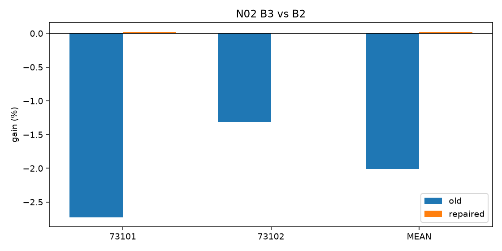
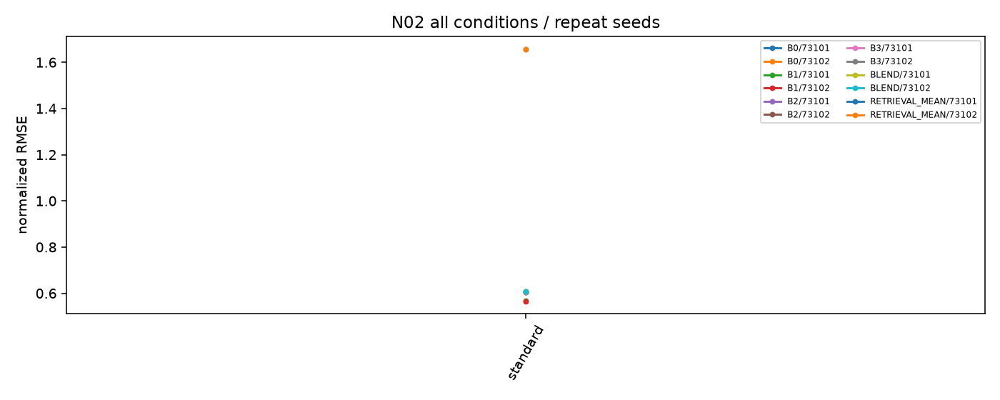

# N02 ARCHIVE 표본 설계 교정

실행: **COMPLETE**. 근거: POSITIVE_UNCERTAIN. 새 본학습 완료 16경로 / 실제 본업데이트 8192회.

## 날짜·정보·방법

과학적 변경은 원점 선정 하나다. 데이터·split·네 채널·rank8·FP32·loss·LR grid·seed·512updates·체크포인트·metric·핵심 대조를 유지했다. [분산 검사](origin_diversity.json), [old/new 그림](origin_distribution.png), [방법 명세](PROTOCOL.json). E는 재사용 개발 평가다.

## 원점수·직접 대조

| arm | seed | policy | condition | score | revision |
| --- | --- | --- | --- | --- | --- |
| B0 | 73101 | selected | PRIMARY | 0.608899 | nan |
| B1 | 73101 | selected | PRIMARY | 0.567034 | nan |
| B2 | 73101 | selected | PRIMARY | 0.605204 | nan |
| B3 | 73101 | selected | PRIMARY | 0.605068 | nan |
| B0 | 73102 | selected | PRIMARY | 0.608899 | nan |
| B1 | 73102 | selected | PRIMARY | 0.565770 | nan |
| B2 | 73102 | selected | PRIMARY | 0.603379 | nan |
| B3 | 73102 | selected | PRIMARY | 0.603351 | nan |
| BLEND | 73101 | selected | PRIMARY | 0.608899 | nan |
| RETRIEVAL_MEAN | 73101 | selected | PRIMARY | 1.657843 | nan |
| BLEND | 73102 | selected | PRIMARY | 0.608899 | nan |
| RETRIEVAL_MEAN | 73102 | selected | PRIMARY | 1.657843 | nan |

| method | baseline | seed | method_score_old | baseline_score_old | gain_percent_old | ci_low_old | ci_high_old | method_score_repaired | baseline_score_repaired | gain_percent_repaired | ci_low_repaired | ci_high_repaired | effect_sign_reversed |
| --- | --- | --- | --- | --- | --- | --- | --- | --- | --- | --- | --- | --- | --- |
| B3 | B1 | 73101 | 0.385358 | 0.374893 | -2.791614 | -14.402357 | 4.558018 | 0.605068 | 0.567034 | -6.707463 | -10.417192 | -3.135258 | False |
| B3 | B1 | 73102 | 0.389721 | 0.382200 | -1.967889 | -24.651031 | 10.409170 | 0.603351 | 0.565770 | -6.642435 | -10.319863 | -3.173634 | False |
| B3 | B1 | MEAN | 0.387540 | 0.378546 | -2.375777 | -19.333684 | 7.629587 | 0.604209 | 0.566402 | -6.674985 | -10.344606 | -3.221373 | False |
| B3 | B2 | 73101 | 0.385358 | 0.375119 | -2.729559 | -6.430991 | 0.618096 | 0.605068 | 0.605204 | 0.022471 | 0.003229 | 0.039746 | True |
| B3 | B2 | 73102 | 0.389721 | 0.384670 | -1.312971 | -3.980300 | 1.114219 | 0.603351 | 0.603379 | 0.004632 | -0.025204 | 0.041935 | True |
| B3 | B2 | MEAN | 0.387540 | 0.379895 | -2.012361 | -5.168947 | 0.760967 | 0.604209 | 0.604291 | 0.013565 | -0.006485 | 0.036592 | True |
| B3 | BLEND | 73101 | 0.385358 | 0.371290 | -3.789167 | -14.727129 | 0.546879 | 0.605068 | 0.608899 | 0.629261 | -2.327215 | 3.149939 | True |
| B3 | BLEND | 73102 | 0.389721 | 0.371958 | -4.775520 | -16.976569 | 1.115291 | 0.603351 | 0.608899 | 0.911248 | -1.869976 | 3.299720 | True |
| B3 | BLEND | MEAN | 0.387540 | 0.371624 | -4.282787 | -15.861524 | 0.831308 | 0.604209 | 0.608899 | 0.770255 | -2.140474 | 3.190436 | True |

판정: POSITIVE_UNCERTAIN, SAMPLING_SENSITIVE. CI가0을 포함하면 동등성이 아닌 불확실성이다. 별도의 목적 점수를 합산하지 않는다.

## 무학습 교차 평가

| direction | arm | seed | normalized_RMSE | scalar_verified |
| --- | --- | --- | --- | --- |
| OLD_MODEL_NEW_E | B0 | 73101 | 0.630732 | True |
| OLD_MODEL_NEW_E | B1 | 73101 | 0.616297 | True |
| OLD_MODEL_NEW_E | B2 | 73101 | 0.668129 | True |
| OLD_MODEL_NEW_E | B3 | 73101 | 0.639857 | True |
| OLD_MODEL_NEW_E | B0 | 73102 | 0.631026 | True |
| OLD_MODEL_NEW_E | B1 | 73102 | 0.594408 | True |
| OLD_MODEL_NEW_E | B2 | 73102 | 0.656611 | True |
| OLD_MODEL_NEW_E | B3 | 73102 | 0.639961 | True |
| OLD_MODEL_NEW_E | BLEND | 73101 | 0.630732 | True |
| OLD_MODEL_NEW_E | BLEND | 73102 | 0.631026 | True |
| NEW_MODEL_OLD_E | B0 | 73101 | 0.375896 | True |
| NEW_MODEL_OLD_E | B1 | 73101 | 0.398083 | True |
| NEW_MODEL_OLD_E | B2 | 73101 | 0.397265 | True |
| NEW_MODEL_OLD_E | B3 | 73101 | 0.397074 | True |
| NEW_MODEL_OLD_E | B0 | 73102 | 0.375896 | True |
| NEW_MODEL_OLD_E | B1 | 73102 | 0.393633 | True |
| NEW_MODEL_OLD_E | B2 | 73102 | 0.393433 | True |
| NEW_MODEL_OLD_E | B3 | 73102 | 0.393197 | True |
| NEW_MODEL_OLD_E | BLEND | 73101 | 0.375896 | True |
| NEW_MODEL_OLD_E | BLEND | 73102 | 0.375896 | True |

| direction | method | baseline | seed | method_score | baseline_score | gain_percent | ci_low | ci_high |
| --- | --- | --- | --- | --- | --- | --- | --- | --- |
| OLD_MODEL_NEW_E | B3 | B2 | 73101 | 0.639857 | 0.668129 | 4.231503 | 1.728833 | 6.702445 |
| OLD_MODEL_NEW_E | B3 | B2 | 73102 | 0.639961 | 0.656611 | 2.535791 | 1.181241 | 3.871592 |
| OLD_MODEL_NEW_E | B3 | B2 | MEAN | 0.639909 | 0.662370 | 3.391018 | 1.620985 | 5.225603 |
| OLD_MODEL_NEW_E | B3 | B1 | 73101 | 0.639857 | 0.616297 | -3.822765 | -8.223438 | -0.344246 |
| OLD_MODEL_NEW_E | B3 | B1 | 73102 | 0.639961 | 0.594408 | -7.663502 | -11.912278 | -3.738651 |
| OLD_MODEL_NEW_E | B3 | B1 | MEAN | 0.639909 | 0.605353 | -5.708415 | -9.583582 | -2.273262 |
| OLD_MODEL_NEW_E | B3 | BLEND | 73101 | 0.639857 | 0.630732 | -1.446614 | -3.756066 | 0.826887 |
| OLD_MODEL_NEW_E | B3 | BLEND | 73102 | 0.639961 | 0.631026 | -1.415972 | -4.008550 | 1.058883 |
| OLD_MODEL_NEW_E | B3 | BLEND | MEAN | 0.639909 | 0.630879 | -1.431289 | -3.864869 | 0.943891 |
| NEW_MODEL_OLD_E | B3 | B2 | 73101 | 0.397074 | 0.397265 | 0.048142 | -0.028888 | 0.060981 |
| NEW_MODEL_OLD_E | B3 | B2 | 73102 | 0.393197 | 0.393433 | 0.059947 | 0.019916 | 0.105601 |
| NEW_MODEL_OLD_E | B3 | B2 | MEAN | 0.395135 | 0.395349 | 0.054016 | -0.004530 | 0.076190 |
| NEW_MODEL_OLD_E | B3 | B1 | 73101 | 0.397074 | 0.398083 | 0.253577 | -16.527093 | 15.308755 |
| NEW_MODEL_OLD_E | B3 | B1 | 73102 | 0.393197 | 0.393633 | 0.110687 | -15.677208 | 14.596378 |
| NEW_MODEL_OLD_E | B3 | B1 | MEAN | 0.395135 | 0.395858 | 0.182534 | -16.101464 | 14.957172 |
| NEW_MODEL_OLD_E | B3 | BLEND | 73101 | 0.397074 | 0.375896 | -5.633915 | -18.430291 | 2.200955 |
| NEW_MODEL_OLD_E | B3 | BLEND | 73102 | 0.393197 | 0.375896 | -4.602690 | -16.377632 | 2.843173 |
| NEW_MODEL_OLD_E | B3 | BLEND | MEAN | 0.395135 | 0.375896 | -5.118303 | -17.403961 | 2.522064 |

OLD_MODEL_NEW_E는 평가 원점 변화, NEW_MODEL_NEW_E 대비는 새 TRAIN/V 적응과 선택 효과를 함께 반영한다. NEW_MODEL_OLD_E는 옛 좁은 평가에서의 참고다. 완전한 인과 분해가 아니다. 선택 seed E를 주 결과에 넣지 않았다. 추가 optimizer0회.

## 실측 자원·검산·한계

| id | arm | seed | updates | optimizer_seconds | seconds | trainable_parameters | peak_allocated_bytes | peak_reserved_bytes | status |
| --- | --- | --- | --- | --- | --- | --- | --- | --- | --- |
| B0_73100_1e-04 | B0 | 73100 | 512 | 48.246547 | 60.479011 | 1179648 | 634260480 | 645922816 | COMPLETE |
| B0_73100_3e-05 | B0 | 73100 | 512 | 48.524057 | 59.950272 | 1179648 | 633457664 | 650117120 | COMPLETE |
| B1_73100_1e-04 | B1 | 73100 | 512 | 49.009117 | 61.451444 | 1179648 | 821782016 | 845152256 | COMPLETE |
| B1_73100_3e-05 | B1 | 73100 | 512 | 49.067341 | 60.492344 | 1179648 | 821782016 | 845152256 | COMPLETE |
| B2_73100_1e-04 | B2 | 73100 | 512 | 49.118665 | 61.529553 | 1179648 | 780150784 | 822083584 | COMPLETE |
| B2_73100_3e-05 | B2 | 73100 | 512 | 48.869130 | 60.338692 | 1179648 | 780150784 | 822083584 | COMPLETE |
| B3_73100_1e-04 | B3 | 73100 | 512 | 50.074882 | 62.891976 | 1179656 | 781526016 | 822083584 | COMPLETE |
| B3_73100_3e-05 | B3 | 73100 | 512 | 50.262073 | 62.021316 | 1179656 | 781526016 | 822083584 | COMPLETE |
| B0_73101_1e-04 | B0 | 73101 | 512 | 48.079769 | 60.367677 | 1179648 | 633457664 | 650117120 | COMPLETE |
| B1_73101_3e-05 | B1 | 73101 | 512 | 47.919990 | 60.077447 | 1179648 | 821782016 | 845152256 | COMPLETE |
| B2_73101_3e-05 | B2 | 73101 | 512 | 48.188545 | 60.561640 | 1179648 | 780150784 | 822083584 | COMPLETE |
| B3_73101_3e-05 | B3 | 73101 | 512 | 49.960279 | 62.775805 | 1179656 | 781526016 | 822083584 | COMPLETE |
| B0_73102_1e-04 | B0 | 73102 | 512 | 48.588184 | 61.062882 | 1179648 | 633457664 | 650117120 | COMPLETE |
| B1_73102_3e-05 | B1 | 73102 | 512 | 49.198880 | 61.764540 | 1179648 | 821782016 | 845152256 | COMPLETE |
| B2_73102_3e-05 | B2 | 73102 | 512 | 49.277660 | 61.900615 | 1179648 | 780150784 | 822083584 | COMPLETE |
| B3_73102_3e-05 | B3 | 73102 | 512 | 52.566419 | 66.354826 | 1179656 | 781526016 | 822083584 | COMPLETE |

[기본 지표·선택 봉인 검산](verification.json), [교차 평가 manifest](cross_evaluation_manifest.json). 모델·head·buffer 보존, finite gradient, 실제 optimizer update, 복원은 smoke와 각fit 기록에 있다. 두 반복 seed와 한 source의 조건부 개발 근거이며 정식 선행 비교·독립 source 검증은 남았다.

## 결과 해석

# N02 해석

새 분산 TRAIN/V/E에서 16/16경로를 완료했다. 선택된 두 반복의 주 NRMSE 평균은 SHORT B0/BLEND0.608899, LONG B1 **0.566402**, RETRIEVE B2 0.604291, DELTA_ADAPT B3 **0.604209**다. B0는 두 반복 모두 INIT가 선택됐고 CPU blend도 alpha0이므로 B0와 동일하다. 나머지 B1/B2/B3는256회 체크포인트다.

가까운 대조 B2 대비 추가 보정의 gain은 **+0.013565% [−0.006485%,0.036592%]**다. 두 seed는+0.022471%,+0.004632%로 같은 양의 방향이지만 평균 구간은0을 포함한다. 기존−2.012361%와 점추정 부호가 바뀌어 POSITIVE_UNCERTAIN + SAMPLING_SENSITIVE다. 양쪽 CI가0을 포함하므로 유의한 효과 부호 전환이나 동등성 입증으로 해석하지 않는다. 새 분산 평가에서 LONG보다6.674985% 나빴고 이 직접 구간은 전체 음수다. 단순 긴 이력을 이길 추가 가치도 확보하지 못했다.

교차 평가가 중요한 차이를 보여 준다. **옛 가중치를 그대로 새 E에 평가해도 B3 대 B2 gain은+3.391018% [1.620985%,5.225603%]**이고 두 seed 모두 양수다. 따라서 이 대비의 부호 변화는 재학습 없이 평가 원점을 바꿨을 때 이미 나타났다. 이전 좁은 E의 부정적 수치를 일반화할 수 없다는 근거다. 하지만 이 옛 가중치도 새 E에서는 LONG보다5.708415% 나빠, 단순 긴 이력보다 나은 방법을 얻었다는 뜻은 아니다.

새 가중치를 옛 E에 적용한 B3 대 B2는+0.054016% [−0.004530%,0.076190%]다. 새 TRAIN/V로 다시 적응·선택한 영향도 상대적 효과를 바꿨다. 새 E 위의 절대 오차는 B3가 옛 가중치0.639909에서 새 가중치0.604209로, B2는0.662370에서0.604291로 낮아졌다. B2가 따라오면서 B3의 추가 이득이 거의 사라진 관측과 양립한다. 순수 TRAIN의 인과 효과라고 단정하지 않으며 TRAIN/V/선택이 함께 바뀐 결과다.

원래 E 위의 새 B3 오차0.395135는 옛 B3 0.387540보다 오히려 높다. 새 표본에서의 절대 점수 개선을 옛 좁은 기간의 개선과 혼동하지 않는다. 네 조합의 모든 군·seed 점수와 같은 E 위의 가중치 효과는 four_way_score_decomposition.csv와 same_E_weight_effects.csv에 공개한다.

이번 결론은 ROBUST_NEGATIVE가 아니다. 이전 부정적 결론은 표본에 민감했고, 날짜를 넓힌 새 학습에서 추가 보정의 실용적·통계적 이득은 미확보다. 기존 구현과 모든 점수를 보존하되 REOPEN_CANDIDATE로 채택하지 않는다. E 원점은64 index-days/22주간 블록이지만 동일한 공개 traffic 개발 원천이며 독립 source가 아니다. 정식 RAFT 대조와 독립 source 검증은 수행하지 않았다.

[네 조합의 모든 원점수](four_way_score_decomposition.csv), [같은 E에서의 가중치 효과](same_E_weight_effects.csv), [gradient·clipping](optimization_diagnostics.csv), [파라미터·정보 예산](parameter_information_budget.csv), [선택 독립 검산](independent_selection_verification.json), [완전 resume 검산](training_record_verification.json), [교차 평가 검산](cross_verification.json).
