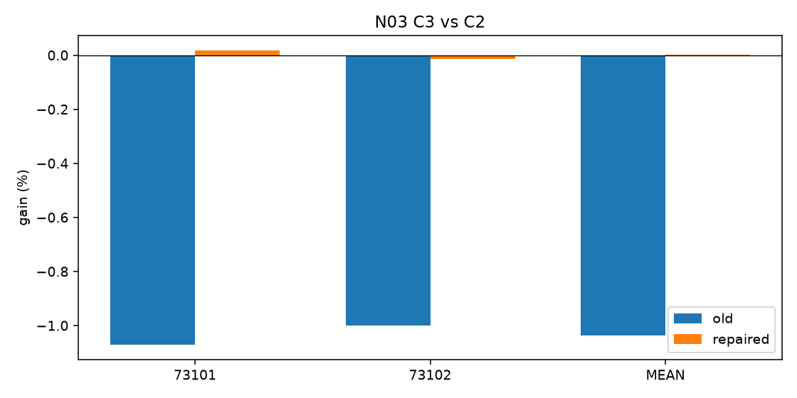
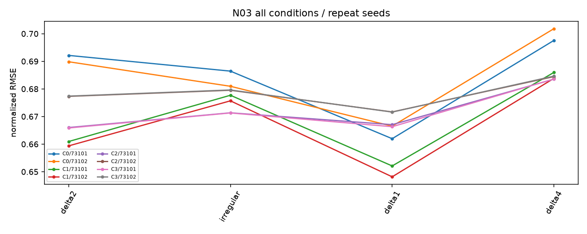

# N03 CLOCK 표본 설계 교정

실행: **COMPLETE**. 근거: POSITIVE_UNCERTAIN. 새 본학습 완료 16경로 / 실제 본업데이트 8192회.

## 날짜·정보·방법

과학적 변경은 원점 선정 하나다. 데이터·split·네 채널·rank8·FP32·loss·LR grid·seed·512updates·체크포인트·metric·핵심 대조를 유지했다. [분산 검사](origin_diversity.json), [old/new 그림](origin_distribution.png), [방법 명세](PROTOCOL.json). E는 재사용 개발 평가다.

## 원점수·직접 대조

| arm | seed | policy | condition | score | revision |
| --- | --- | --- | --- | --- | --- |
| C0 | 73101 | selected | PRIMARY | 0.689291 | nan |
| C1 | 73101 | selected | PRIMARY | 0.669325 | nan |
| C2 | 73101 | selected | PRIMARY | 0.668682 | nan |
| C3 | 73101 | selected | PRIMARY | 0.668567 | nan |
| C0 | 73102 | selected | PRIMARY | 0.685396 | nan |
| C1 | 73102 | selected | PRIMARY | 0.667527 | nan |
| C2 | 73102 | selected | PRIMARY | 0.678406 | nan |
| C3 | 73102 | selected | PRIMARY | 0.678505 | nan |

| method | baseline | seed | method_score_old | baseline_score_old | gain_percent_old | ci_low_old | ci_high_old | method_score_repaired | baseline_score_repaired | gain_percent_repaired | ci_low_repaired | ci_high_repaired | effect_sign_reversed |
| --- | --- | --- | --- | --- | --- | --- | --- | --- | --- | --- | --- | --- | --- |
| C3 | C0 | 73101 | 0.651315 | 0.926609 | 29.709806 | 7.588108 | 32.203631 | 0.668567 | 0.689291 | 3.006452 | -1.296344 | 9.585820 | False |
| C3 | C0 | 73102 | 0.644798 | 0.859698 | 24.997199 | -1.011615 | 27.910582 | 0.678505 | 0.685396 | 1.005449 | -4.037533 | 7.189846 | False |
| C3 | C0 | MEAN | 0.648056 | 0.893154 | 27.441764 | 3.411250 | 30.140491 | 0.673536 | 0.687344 | 2.008785 | -2.527400 | 8.210137 | False |
| C3 | C1 | 73101 | 0.651315 | 0.682060 | 4.507669 | 1.038239 | 5.091462 | 0.668567 | 0.669325 | 0.113159 | -2.531050 | 2.862961 | False |
| C3 | C1 | 73102 | 0.644798 | 0.695394 | 7.275879 | 1.425345 | 8.260492 | 0.678505 | 0.667527 | -1.644605 | -7.653510 | 3.022575 | True |
| C3 | C1 | MEAN | 0.648056 | 0.688727 | 5.905172 | 1.235244 | 6.689942 | 0.673536 | 0.668426 | -0.764541 | -4.712657 | 2.893620 | True |
| C3 | C2 | 73101 | 0.651315 | 0.644409 | -1.071655 | -1.187743 | -0.431886 | 0.668567 | 0.668682 | 0.017072 | -0.041451 | 0.078801 | True |
| C3 | C2 | 73102 | 0.644798 | 0.638414 | -0.999894 | -1.180137 | -0.120756 | 0.678505 | 0.678406 | -0.014572 | -0.048291 | 0.017161 | False |
| C3 | C2 | MEAN | 0.648056 | 0.641412 | -1.035942 | -1.183971 | -0.273610 | 0.673536 | 0.673544 | 0.001136 | -0.038884 | 0.040342 | True |

판정: POSITIVE_UNCERTAIN, SAMPLING_SENSITIVE. CI가0을 포함하면 동등성이 아닌 불확실성이다. 별도의 목적 점수를 합산하지 않는다.

## 무학습 교차 평가

| direction | arm | seed | normalized_RMSE | scalar_verified |
| --- | --- | --- | --- | --- |
| OLD_MODEL_NEW_E | C0 | 73101 | 0.734209 | True |
| OLD_MODEL_NEW_E | C1 | 73101 | 0.735739 | True |
| OLD_MODEL_NEW_E | C2 | 73101 | 0.736436 | True |
| OLD_MODEL_NEW_E | C3 | 73101 | 0.741665 | True |
| OLD_MODEL_NEW_E | C0 | 73102 | 0.714833 | True |
| OLD_MODEL_NEW_E | C1 | 73102 | 0.739379 | True |
| OLD_MODEL_NEW_E | C2 | 73102 | 0.731863 | True |
| OLD_MODEL_NEW_E | C3 | 73102 | 0.732885 | True |
| NEW_MODEL_OLD_E | C0 | 73101 | 0.839193 | True |
| NEW_MODEL_OLD_E | C1 | 73101 | 0.658476 | True |
| NEW_MODEL_OLD_E | C2 | 73101 | 0.517092 | True |
| NEW_MODEL_OLD_E | C3 | 73101 | 0.521987 | True |
| NEW_MODEL_OLD_E | C0 | 73102 | 0.811336 | True |
| NEW_MODEL_OLD_E | C1 | 73102 | 0.646340 | True |
| NEW_MODEL_OLD_E | C2 | 73102 | 0.490730 | True |
| NEW_MODEL_OLD_E | C3 | 73102 | 0.494048 | True |

| direction | method | baseline | seed | method_score | baseline_score | gain_percent | ci_low | ci_high |
| --- | --- | --- | --- | --- | --- | --- | --- | --- |
| OLD_MODEL_NEW_E | C3 | C2 | 73101 | 0.741665 | 0.736436 | -0.709956 | -1.486291 | -0.069718 |
| OLD_MODEL_NEW_E | C3 | C2 | 73102 | 0.732885 | 0.731863 | -0.139623 | -1.185335 | 1.053024 |
| OLD_MODEL_NEW_E | C3 | C2 | MEAN | 0.737275 | 0.734150 | -0.425677 | -1.237536 | 0.358762 |
| OLD_MODEL_NEW_E | C3 | C0 | 73101 | 0.741665 | 0.734209 | -1.015457 | -4.305911 | 2.560436 |
| OLD_MODEL_NEW_E | C3 | C0 | 73102 | 0.732885 | 0.714833 | -2.525317 | -7.967919 | 2.062540 |
| OLD_MODEL_NEW_E | C3 | C0 | MEAN | 0.737275 | 0.724521 | -1.760292 | -5.715523 | 1.394081 |
| OLD_MODEL_NEW_E | C3 | C1 | 73101 | 0.741665 | 0.735739 | -0.805356 | -4.064173 | 1.565623 |
| OLD_MODEL_NEW_E | C3 | C1 | 73102 | 0.732885 | 0.739379 | 0.878284 | -1.701737 | 3.050784 |
| OLD_MODEL_NEW_E | C3 | C1 | MEAN | 0.737275 | 0.737559 | 0.038541 | -2.529841 | 1.968512 |
| NEW_MODEL_OLD_E | C3 | C2 | 73101 | 0.521987 | 0.517092 | -0.946605 | -0.983439 | -0.748353 |
| NEW_MODEL_OLD_E | C3 | C2 | 73102 | 0.494048 | 0.490730 | -0.676024 | -0.696938 | -0.676024 |
| NEW_MODEL_OLD_E | C3 | C2 | MEAN | 0.508017 | 0.503911 | -0.814853 | -0.832971 | -0.724091 |
| NEW_MODEL_OLD_E | C3 | C0 | 73101 | 0.521987 | 0.839193 | 37.798951 | 19.604572 | 40.314113 |
| NEW_MODEL_OLD_E | C3 | C0 | 73102 | 0.494048 | 0.811336 | 39.106878 | 25.606079 | 40.896368 |
| NEW_MODEL_OLD_E | C3 | C0 | MEAN | 0.508017 | 0.825264 | 38.441877 | 22.552107 | 40.600307 |
| NEW_MODEL_OLD_E | C3 | C1 | 73101 | 0.521987 | 0.658476 | 20.728083 | 14.199902 | 22.000634 |
| NEW_MODEL_OLD_E | C3 | C1 | 73102 | 0.494048 | 0.646340 | 23.562208 | 22.660144 | 23.798310 |
| NEW_MODEL_OLD_E | C3 | C1 | MEAN | 0.508017 | 0.652408 | 22.131965 | 18.410467 | 22.890314 |

OLD_MODEL_NEW_E는 평가 원점 변화, NEW_MODEL_NEW_E 대비는 새 TRAIN/V 적응과 선택 효과를 함께 반영한다. NEW_MODEL_OLD_E는 옛 좁은 평가에서의 참고다. 완전한 인과 분해가 아니다. 선택 seed E를 주 결과에 넣지 않았다. 추가 optimizer0회.

## 실측 자원·검산·한계

| id | arm | seed | updates | optimizer_seconds | seconds | trainable_parameters | peak_allocated_bytes | peak_reserved_bytes | status |
| --- | --- | --- | --- | --- | --- | --- | --- | --- | --- |
| C0_73100_1e-04 | C0 | 73100 | 512 | 49.010533 | 65.498418 | 1179648 | 780150784 | 822083584 | COMPLETE |
| C0_73100_3e-05 | C0 | 73100 | 512 | 49.200056 | 62.705859 | 1179648 | 780150784 | 822083584 | COMPLETE |
| C1_73100_1e-04 | C1 | 73100 | 512 | 49.295320 | 65.050716 | 1179648 | 780150784 | 822083584 | COMPLETE |
| C1_73100_3e-05 | C1 | 73100 | 512 | 49.447632 | 63.234001 | 1179648 | 780150784 | 822083584 | COMPLETE |
| C2_73100_1e-04 | C2 | 73100 | 512 | 49.399358 | 65.314063 | 1179648 | 780150784 | 822083584 | COMPLETE |
| C2_73100_3e-05 | C2 | 73100 | 512 | 49.346983 | 63.165974 | 1179648 | 780150784 | 822083584 | COMPLETE |
| C3_73100_1e-04 | C3 | 73100 | 512 | 50.110758 | 65.940790 | 1179652 | 784361984 | 822083584 | COMPLETE |
| C3_73100_3e-05 | C3 | 73100 | 512 | 50.265013 | 64.072450 | 1179652 | 784361984 | 822083584 | COMPLETE |
| C0_73101_1e-04 | C0 | 73101 | 512 | 52.829623 | 70.619365 | 1179648 | 780150784 | 822083584 | COMPLETE |
| C1_73101_3e-05 | C1 | 73101 | 512 | 51.781695 | 68.149048 | 1179648 | 780150784 | 822083584 | COMPLETE |
| C2_73101_1e-04 | C2 | 73101 | 512 | 51.670648 | 68.111609 | 1179648 | 780150784 | 822083584 | COMPLETE |
| C3_73101_1e-04 | C3 | 73101 | 512 | 52.463971 | 68.985819 | 1179652 | 784361984 | 822083584 | COMPLETE |
| C0_73102_1e-04 | C0 | 73102 | 512 | 51.538094 | 68.304597 | 1179648 | 780150784 | 822083584 | COMPLETE |
| C1_73102_3e-05 | C1 | 73102 | 512 | 51.716813 | 68.288741 | 1179648 | 780150784 | 822083584 | COMPLETE |
| C2_73102_1e-04 | C2 | 73102 | 512 | 51.437289 | 68.063210 | 1179648 | 780150784 | 822083584 | COMPLETE |
| C3_73102_1e-04 | C3 | 73102 | 512 | 52.377816 | 68.907372 | 1179652 | 784361984 | 822083584 | COMPLETE |

[기본 지표·선택 봉인 검산](verification.json), [교차 평가 manifest](cross_evaluation_manifest.json). 모델·head·buffer 보존, finite gradient, 실제 optimizer update, 복원은 smoke와 각fit 기록에 있다. 두 반복 seed와 한 source의 조건부 개발 근거이며 정식 선행 비교·독립 source 검증은 남았다.

## 결과 해석

# N03 해석

16/16경로·8,192 본업데이트와 smoke8을 완료했다. 기존 E 원점의23.75시간·2개 부분 날짜 집중을 재현한 뒤, 새 E는 **64 distinct index-days·3,456.25시간·22개 주간 블록**으로 분산했다. 중복을 제외한 target timestamp도143/3,072에서3,072/3,072로 늘었다. TRAIN64일, 두 V32일도 사전 검사를 통과했다.

새 선택 모델의 반복 평균 주 NRMSE는 GRID C0 **0.687344**, HOLD C1 **0.668426**, KERNEL C2 **0.673544**, LEARN_KERNEL C3 **0.673536**이다. C3 대 C2 gain은 **+0.001136% [−0.038884%,0.040342%]**로 매우 작고 불확실하다. seed73101은+0.017072%,73102는−0.014572%로 방향도 다르다. 기존−1.035942% [−1.183971%,−0.273610%]의 강한 음의 결과를 날짜가 넓은 평가에 일반화할 근거가 없다. POSITIVE_UNCERTAIN + SAMPLING_SENSITIVE이며 ROBUST_NEGATIVE가 아니다. 반대로 새 양의 점추정만으로 효과를 입증하거나 동등성을 주장하지 않는다.

단순 대조도 함께 읽어야 한다. C3는 GRID보다2.008785% 낮은 점수지만 구간은0을 포함한다. HOLD보다 평균0.764541% 나쁘고 seed 방향이 갈린다. 따라서 학습 τ의 추가 가치도, 모든 조건에서의 단순 방법 우위도 확정하지 않는다. 두 반복 모두 HOLD는512회를, 다른 세 군은256회를 선택했다. 고정512 결과도 보존했고 이를 주 선택 모델로 바꾸지 않았다.

조건별 C2/C3 평균 NRMSE는 delta2 0.671656/0.671617, irregular 0.675431/0.675455, dense delta1 0.669361/0.668960, delta4 0.683999/0.684118이다. 주 비교인 delta2/irregular를 좋은 조건으로 교체하지 않았다. dense에서는 관측값을 그대로 사용하므로 τ gradient가0인 것이 설계상 정상이다. 실제 전체 C3 학습의 θ 비영 gradient 비율은0.5로, delta4 학습 epoch에서 학습되고 dense epoch에서는 관측을 덮어쓰지 않았다는 구조와 맞는다. gradient 단절이나 미학습 실패로 분류하지 않는다.

## 교차 평가가 분리한 것

| C3 대 C2 | 평균 gain | 95% 조건부 구간 |
| --- | ---: | --- |
| 옛 가중치 / 옛 E | −1.035942% | [−1.183971%, −0.273610%] |
| 옛 가중치 / 새 E | −0.425677% | [−1.237536%, 0.358762%] |
| 새 가중치 / 새 E | +0.001136% | [−0.038884%, 0.040342%] |
| 새 가중치 / 옛 E | −0.814853% | [−0.832971%, −0.724091%] |

평가 원점만 넓혀도 음의 점추정이 작아지고 구간이0을 포함했다. 하지만 이 경우 부호는 음수였고, 새 가중치를 옛 E에 평가해도 두 seed 모두 음수다. 거의0인 양의 평균은 TRAIN/V 재학습·선택과 E 변화가 함께 있는 주 비교에서 나타났다. 완전한 인과 분해나 새로운 보존 원리의 증거는 아니다.

절대 오차에서는 새 적응의 이득이 보인다. 새 E에서 C3는 옛 가중치0.737275에서 새 가중치0.673536으로 낮아졌고, 고정 커널도0.734150에서0.673544로 낮아졌다. 옛 E에서도 C3는0.648056에서0.508017로 낮아졌지만 C2가0.503911로 더 낮았다. 재학습으로 좋아졌다는 사실과 학습 커널이 고정 커널보다 좋아졌다는 주장은 다르다.

시간 집계·단순 보간·학습 커널의 기존 선행 경계는 유지한다. 같은 공개 ETTm1 원천의 개발 평가이며 독립 source가 아니다. 현재 학습 τ를 새 PEFT 구성요소로 채택할 추가 근거는 없고, 후속 학습은 실행하지 않는다. 모든 군·seed의 네 조합과 같은 E 위 가중치 효과는 four_way_score_decomposition.csv / same_E_weight_effects.csv에 남겼다.

[네 조합의 모든 원점수](four_way_score_decomposition.csv), [같은 E에서의 가중치 효과](same_E_weight_effects.csv), [gradient·clipping](optimization_diagnostics.csv), [파라미터·정보 예산](parameter_information_budget.csv), [선택 독립 검산](independent_selection_verification.json), [완전 resume 검산](training_record_verification.json), [교차 평가 검산](cross_verification.json).
