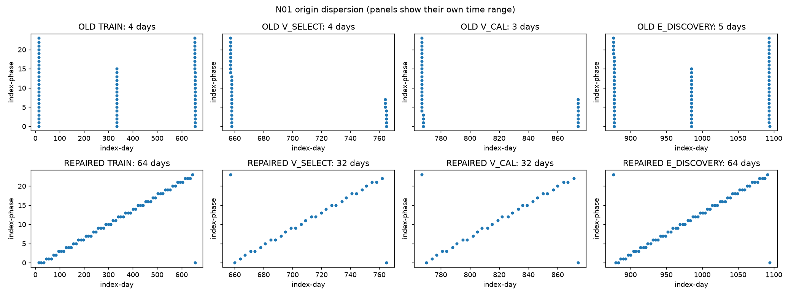
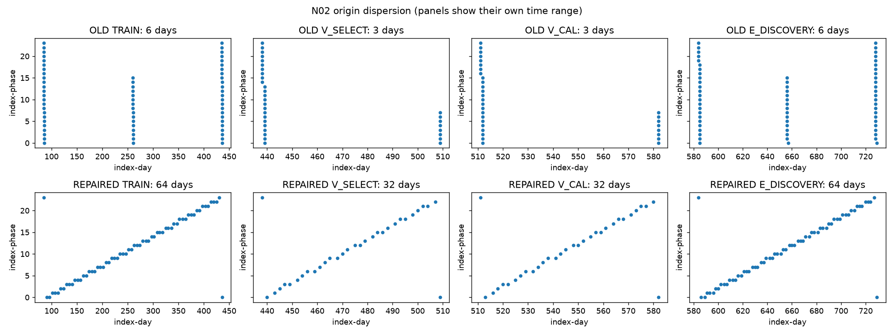
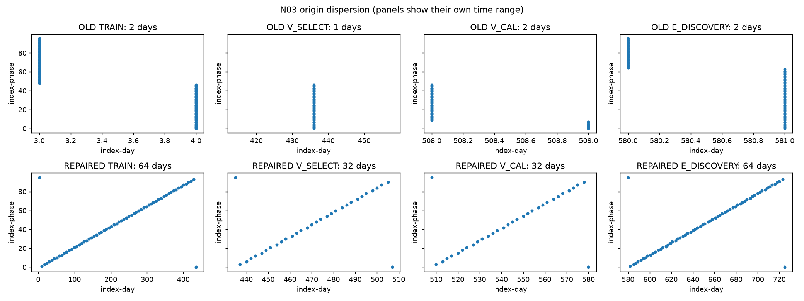
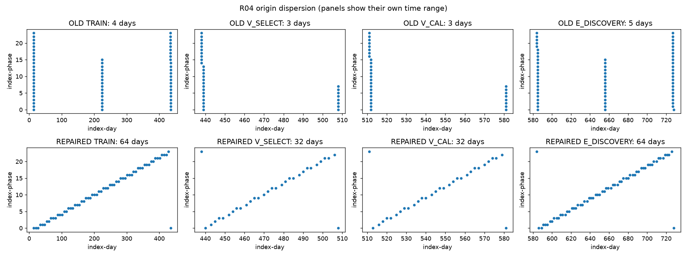
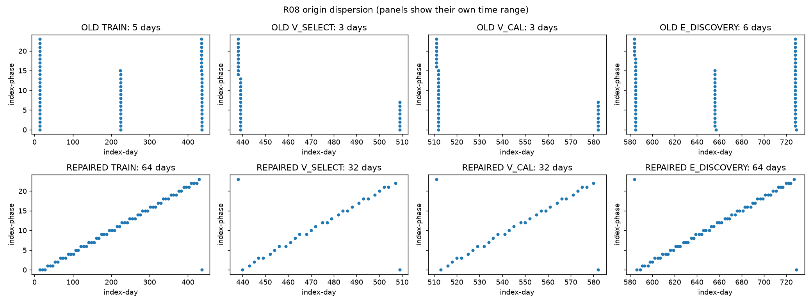
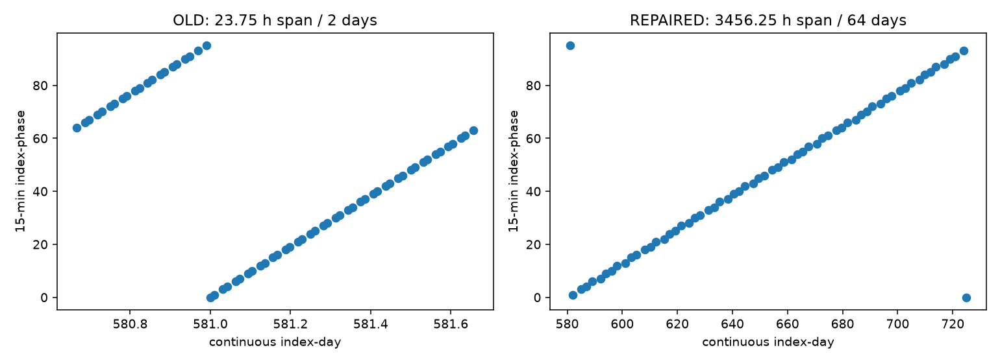

# 날짜 우선 표본 사전 감사

기존 selector는 phase별 quota를 먼저 배정해 각 phase의 첫·중간·마지막 날짜가 겹쳤다. 새 selector는 합법적인 날짜 범위 양 끝을 포함해 날짜를 균등 선택한 다음, 지정 phase roster와 circular distance로 한 날짜당 한 원점만 고른다. 값/정답/성능은 선택에 쓰지 않는다. 전 검사·봉인은 GPU optimizer0회에서 수행한다.

| track | role | version | origins | distinct_days | seven_day_blocks | distinct_phases | phase_count_range | origin_span_hours | span_ratio | target_uniqueness_ratio |
| --- | --- | --- | --- | --- | --- | --- | --- | --- | --- | --- |
| N01 | TRAIN | old | 64 | 4 | 3 | 24 | 1 | 15398.000000 | 1.000000 | 0.066732 |
| N01 | TRAIN | repaired | 64 | 64 | 64 | 24 | 3 | 15384.000000 | 1.000000 | 1.000000 |
| N01 | V_SELECT | old | 32 | 4 | 3 | 24 | 1 | 2582.000000 | 1.000000 | 0.092448 |
| N01 | V_SELECT | repaired | 32 | 32 | 17 | 24 | 1 | 2569.000000 | 1.000000 | 1.000000 |
| N01 | V_CAL | old | 32 | 3 | 2 | 24 | 1 | 2571.000000 | 1.000000 | 0.082031 |
| N01 | V_CAL | repaired | 32 | 32 | 16 | 24 | 1 | 2545.000000 | 1.000000 | 1.000000 |
| N01 | E_DISCOVERY | old | 64 | 5 | 3 | 24 | 1 | 5213.000000 | 1.000000 | 0.066732 |
| N01 | E_DISCOVERY | repaired | 64 | 64 | 32 | 24 | 1 | 5209.000000 | 1.000000 | 1.000000 |
| N02 | TRAIN | old | 64 | 6 | 3 | 24 | 1 | 8430.000000 | 1.000000 | 0.069336 |
| N02 | TRAIN | repaired | 64 | 64 | 51 | 24 | 1 | 8401.000000 | 1.000000 | 1.000000 |
| N02 | V_SELECT | old | 32 | 3 | 2 | 24 | 1 | 1697.000000 | 1.000000 | 0.082031 |
| N02 | V_SELECT | repaired | 32 | 32 | 11 | 24 | 1 | 1681.000000 | 1.000000 | 0.970703 |
| N02 | V_CAL | old | 32 | 3 | 2 | 24 | 1 | 1695.000000 | 1.000000 | 0.082031 |
| N02 | V_CAL | repaired | 32 | 32 | 11 | 24 | 1 | 1681.000000 | 1.000000 | 0.970703 |
| N02 | E_DISCOVERY | old | 64 | 6 | 3 | 24 | 1 | 3461.000000 | 1.000000 | 0.069336 |
| N02 | E_DISCOVERY | repaired | 64 | 64 | 22 | 24 | 1 | 3457.000000 | 1.000000 | 0.985026 |
| N03 | TRAIN | old | 64 | 2 | 1 | 64 | 1 | 23.500000 | 0.002315 | 0.046224 |
| N03 | TRAIN | repaired | 64 | 64 | 63 | 64 | 1 | 10344.250000 | 1.000000 | 1.000000 |
| N03 | V_SELECT | old | 32 | 1 | 1 | 32 | 1 | 11.500000 | 0.000000 | 0.061198 |
| N03 | V_SELECT | repaired | 32 | 32 | 11 | 32 | 1 | 1704.250000 | 1.000000 | 1.000000 |
| N03 | V_CAL | old | 32 | 2 | 1 | 32 | 1 | 23.500000 | 0.013889 | 0.091146 |
| N03 | V_CAL | repaired | 32 | 32 | 11 | 32 | 1 | 1704.250000 | 1.000000 | 1.000000 |
| N03 | E_DISCOVERY | old | 64 | 2 | 2 | 64 | 1 | 23.750000 | 0.006897 | 0.046549 |
| N03 | E_DISCOVERY | repaired | 64 | 64 | 22 | 64 | 1 | 3456.250000 | 1.000000 | 1.000000 |
| R04 | TRAIN | old | 64 | 4 | 3 | 24 | 1 | 10118.000000 | 1.000000 | 0.045085 |
| R04 | TRAIN | repaired | 64 | 64 | 61 | 24 | 3 | 10104.000000 | 1.000000 | 0.750000 |
| R04 | V_SELECT | old | 32 | 3 | 2 | 24 | 1 | 1673.000000 | 1.000000 | 0.056641 |
| R04 | V_SELECT | repaired | 32 | 32 | 11 | 24 | 1 | 1657.000000 | 1.000000 | 0.560221 |
| R04 | V_CAL | old | 32 | 3 | 2 | 24 | 1 | 1671.000000 | 1.000000 | 0.056641 |
| R04 | V_CAL | repaired | 32 | 32 | 11 | 24 | 1 | 1657.000000 | 1.000000 | 0.560221 |
| R04 | E_DISCOVERY | old | 64 | 5 | 4 | 24 | 1 | 3437.000000 | 1.000000 | 0.045085 |
| R04 | E_DISCOVERY | repaired | 64 | 64 | 22 | 24 | 1 | 3433.000000 | 1.000000 | 0.569336 |
| N07 | TRAIN | old | 64 | 4 | 3 | 24 | 1 | 15398.000000 | 1.000000 | 0.066732 |
| N07 | TRAIN | repaired | 64 | 64 | 64 | 24 | 3 | 15384.000000 | 1.000000 | 1.000000 |
| N07 | V_SELECT | old | 32 | 4 | 3 | 24 | 1 | 2582.000000 | 1.000000 | 0.092448 |
| N07 | V_SELECT | repaired | 32 | 32 | 17 | 24 | 1 | 2569.000000 | 1.000000 | 1.000000 |
| N07 | V_CAL | old | 32 | 3 | 2 | 24 | 1 | 2571.000000 | 1.000000 | 0.082031 |
| N07 | V_CAL | repaired | 32 | 32 | 16 | 24 | 1 | 2545.000000 | 1.000000 | 1.000000 |
| N07 | E_DISCOVERY | old | 64 | 5 | 3 | 24 | 1 | 5213.000000 | 1.000000 | 0.066732 |
| N07 | E_DISCOVERY | repaired | 64 | 64 | 32 | 24 | 1 | 5209.000000 | 1.000000 | 1.000000 |
| R08 | TRAIN | old | 64 | 5 | 3 | 24 | 1 | 10142.000000 | 1.000000 | 0.069336 |
| R08 | TRAIN | repaired | 64 | 64 | 61 | 24 | 3 | 10128.000000 | 1.000000 | 1.000000 |
| R08 | V_SELECT | old | 32 | 3 | 2 | 24 | 1 | 1697.000000 | 1.000000 | 0.082031 |
| R08 | V_SELECT | repaired | 32 | 32 | 11 | 24 | 1 | 1681.000000 | 1.000000 | 0.970703 |
| R08 | V_CAL | old | 32 | 3 | 2 | 24 | 1 | 1695.000000 | 1.000000 | 0.082031 |
| R08 | V_CAL | repaired | 32 | 32 | 11 | 24 | 1 | 1681.000000 | 1.000000 | 0.970703 |
| R08 | E_DISCOVERY | old | 64 | 6 | 3 | 24 | 1 | 3461.000000 | 1.000000 | 0.069336 |
| R08 | E_DISCOVERY | repaired | 64 | 64 | 22 | 24 | 1 | 3457.000000 | 1.000000 | 0.985026 |

## N01

BLOCKED_DIVERSITY: TRAIN:phase_count_range_at_most_2。 [모든 day/span/week/phase/overlap 기록](N01/origin_diversity.json), [old/new 원점](N01/new_origins.csv).

TRAIN: 날짜 64개·span ratio 1.000·phase 24개지만 phase 최소/최대 1/4, 차이 3로 한도2를 초과한다. 마지막 부분 날짜에서 지정phase에 가장 가까운 circular phase가0이 되는 경계 효과다. 날짜나 phase를 다시 골라 완화하지 않는다. 해당 트랙 GPU smoke/학습/교차 평가0회.

## N02

PASS。 [모든 day/span/week/phase/overlap 기록](N02/origin_diversity.json), [old/new 원점](N02/new_origins.csv).

## N03

PASS。 [모든 day/span/week/phase/overlap 기록](N03/origin_diversity.json), [old/new 원점](N03/new_origins.csv).

## R04

BLOCKED_DIVERSITY: TRAIN:phase_count_range_at_most_2。 [모든 day/span/week/phase/overlap 기록](R04/origin_diversity.json), [old/new 원점](R04/new_origins.csv).

TRAIN: 날짜 64개·span ratio 1.000·phase 24개지만 phase 최소/최대 1/4, 차이 3로 한도2를 초과한다. 마지막 부분 날짜에서 지정phase에 가장 가까운 circular phase가0이 되는 경계 효과다. 날짜나 phase를 다시 골라 완화하지 않는다. 해당 트랙 GPU smoke/학습/교차 평가0회.

## N07

BLOCKED_DIVERSITY: TRAIN:phase_count_range_at_most_2。 [모든 day/span/week/phase/overlap 기록](N07/origin_diversity.json), [old/new 원점](N07/new_origins.csv).

TRAIN: 날짜 64개·span ratio 1.000·phase 24개지만 phase 최소/최대 1/4, 차이 3로 한도2를 초과한다. 마지막 부분 날짜에서 지정phase에 가장 가까운 circular phase가0이 되는 경계 효과다. 날짜나 phase를 다시 골라 완화하지 않는다. 해당 트랙 GPU smoke/학습/교차 평가0회.

## R08

BLOCKED_DIVERSITY: TRAIN:phase_count_range_at_most_2。 [모든 day/span/week/phase/overlap 기록](R08/origin_diversity.json), [old/new 원점](R08/new_origins.csv).

TRAIN: 날짜 64개·span ratio 1.000·phase 24개지만 phase 최소/최대 1/4, 차이 3로 한도2를 초과한다. 마지막 부분 날짜에서 지정phase에 가장 가까운 circular phase가0이 되는 경계 효과다. 날짜나 phase를 다시 골라 완화하지 않는다. 해당 트랙 GPU smoke/학습/교차 평가0회.

## N03 병리 재현과 교정

기존 E23.75시간 집중을 실제 old selector로 재현했고, 새 TRAIN/E64일·V32일과95% 이상 span을 모두 검사했다. 같은 날짜 여러 원점으로 숫자를 채우지 않았다.

