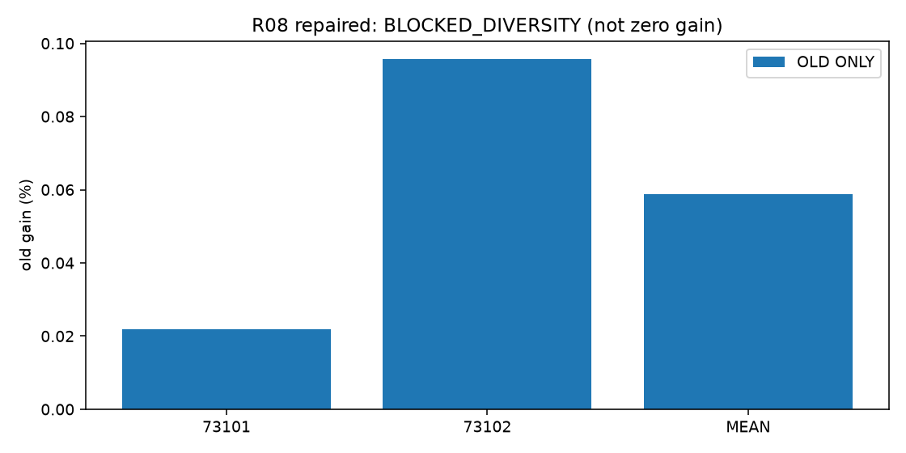

# R08 LEAD 표본 설계 교정

실행: **BLOCKED_DIVERSITY**. 근거: NOT_MEASURED. 새 본학습 완료 0경로 / 실제 본업데이트 0회.

## 날짜·정보·방법

과학적 변경은 원점 선정 하나다. 데이터·split·네 채널·rank8·FP32·loss·LR grid·seed·512updates·체크포인트·metric·핵심 대조를 유지했다. [분산 검사](origin_diversity.json), [old/new 그림](origin_distribution.png), [방법 명세](PROTOCOL.json). E는 재사용 개발 평가다.

원점 검사 또는 실행이 완료되지 않은 상태이므로 repaired 예측 효과를 판정하지 않는다. 사유: ['TRAIN:phase_count_range_at_most_2'].

TRAIN64 distinct days 자체는 충족하지만 경계 날짜의 circular phase 선택으로 phase 수 최소1/최대4, 차이3이다. 계약의 한도2를 넘으므로 GPU smoke·본학습·교차 평가를 실행하지 않았다. 기존 부정적 결과를 ROBUST_NEGATIVE로 승격할 수 없다.

## 옛 효과와 미측정 범위

[옛 점수와 repaired 미측정 표](old_vs_repaired_contrasts.csv). 비어 있는 repaired 값은0%가 아니다.

