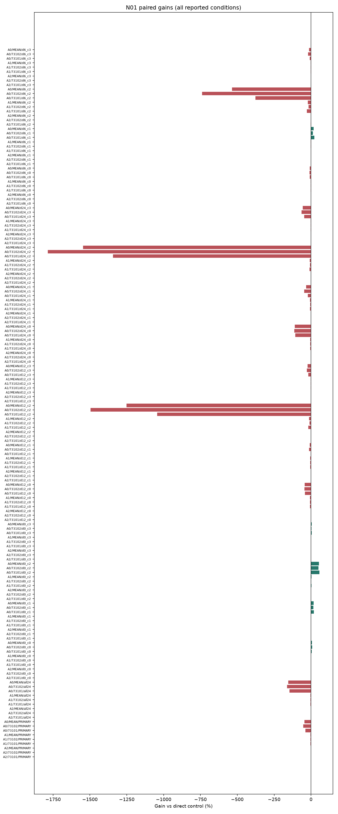
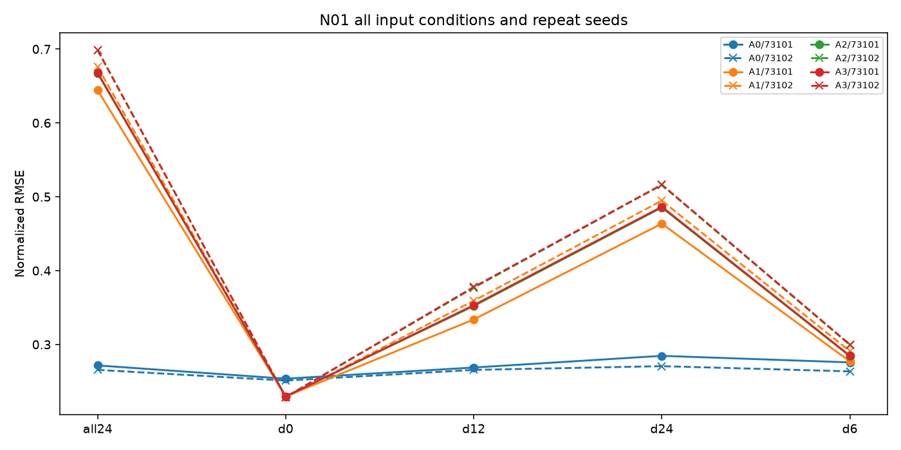

# N01 ASYNC 결과

실행: **COMPLETE** / 근거: **NEGATIVE_WITHIN_SCOPE** / 신규성: **UNVERIFIED_VARIANT**.

## ① 문제와 정보

부분 채널 지연에서 age 보정의 추가 가치. [계약과 방법](TOPIC_ONEPAGE.md), [정보 권한](permissions.json), [원천·원점](data_receipt.json). 원점 이후의 정답은 입력으로 허용하지 않는다. R09 숨긴 상세값의 권한은 절대시간 블록에 적용한다.

## ② 선행 연결

[LITERATURE_BOUNDARY.md](LITERATURE_BOUNDARY.md). 알려진 구성요소와 이번 제한된 변형을 구분하며 정식 선행의 전체 재현을 주장하지 않는다.

## ③ 비교 조건과 비용

군: A0, A1, A2, A3. rank8 LoRA 1,179,648개 + 명시 보조계수, FP32 point MSE, TRAIN64,512updates, 선택seed73100의2LR 후 반복73101/73102. tau=.5 슬롯을 점예측으로 학습하므로 확률 보정 개선을 주장하지 않는다.

## ④ 실제 실행과 미실행

완료 본학습 16경로, 본학습 8192updates. 폐기 smoke 8updates. 선택·복원·원점수 검산 완료. [자원](resources.csv), [검산](verification.json), [선택](selections.json). 큰 prediction/weight는 로컬 ignored cache에 있고 GitHub에는 해시와 수치가 있다.

optimizer 실측 합계 13.39분; 최대 allocated 748.0MiB. INIT 선택 0/8. 학습 예산 미사용은 alias 또는 차단으로 구분한다.

## ⑤ 원점수·효과·seed·조건 손익

| arm | seed | score |
| --- | --- | --- |
| A0 | 73101 | 0.280191 |
| A1 | 73101 | 0.370357 |
| A2 | 73101 | 0.384814 |
| A3 | 73101 | 0.385644 |
| A0 | 73102 | 0.267105 |
| A1 | 73102 | 0.392867 |
| A2 | 73102 | 0.407683 |
| A3 | 73102 | 0.408236 |

| method | baseline | condition | gain_percent | ci_low | ci_high |
| --- | --- | --- | --- | --- | --- |
| A3 | A2 | PRIMARY | -0.174621 | -0.204296 | -0.054029 |
| A3 | A1 | PRIMARY | -4.016764 | -5.496773 | -2.006491 |
| A3 | A0 | PRIMARY | -45.055229 | -95.686004 | -3.373793 |

[전체 원단위 RMSE/MAE](raw_scores.csv), [모든 반복·조건](scores_summary.csv), [512고정점 포함 대비](contrasts.csv), [부가지표](secondary_scores.csv). RMSE는 원점·horizon 제곱오차 평균 후 제곱근, 채널과 지정 조건을 동일 가중한다.

## ⑥ 단순 대안과 남은 정식 비교

직접 단순 대조의 충분성과 제안 구성요소의 추가 가치는 contrasts.csv에서 별도로 판단한다. 0근처 CI는 동등성 입증이 아니다. 알려진 단순 방법의 개선을 새 방법론 PASS로 바꾸지 않는다.

## ⑦ 다음 방법을 정의할 근거

현재 증거 상태: NEGATIVE_WITHIN_SCOPE. 단일 개발 원천과 제한된 recipe의 결과이며 정식 선행 대비·독립 확증이 남는다. 연구프로그램의 불가능성 판정은 아니다. 최종 문제 선택은 전체 MASTER_REPORT/FINAL_DECISION에서 최대2개로 제한한다. 자동 후속 학습 없음.

## 실제 결과 해석

두 반복 평균의 주 normalized RMSE는 A0(native)0.273648, A1(ridge)0.381612, A2(residual)0.396248, A3(age residual)0.396940다. A3는 A2 대비0.1746%, A1 대비4.0168%, A0 대비45.0552% 악화했다. age항의 추가 가치는 두 반복 모두 음수였다. 작은 clean(d0) 이득을 주 목표의 성공으로 바꾸지 않는다.

| delay | A0 | A1 | A2 | A3 |
| --- | --- | --- | --- | --- |
| all24 | 0.268615 | 0.660007 | 0.682731 | 0.683333 |
| d0 | 0.252394 | 0.228965 | 0.229220 | 0.229201 |
| d12 | 0.267187 | 0.346564 | 0.364487 | 0.365547 |
| d24 | 0.277627 | 0.479191 | 0.500698 | 0.501463 |
| d6 | 0.269669 | 0.284033 | 0.291799 | 0.292418 |

가림이 없는 조건에서는 ridge계열이 A0보다 좋지만, 주 지연6/24h와 미학습12h 및 모든donor가24h늦은 조건에서는 A0가 낫다. 이는 단순 native 가림 처리가 이번4채널·기간에서 충분한 직접 대안이라는 관측이다. 학습/수치 실패는 없고 추가계수 gradient·실제 update·복원은 통과했다.

A1/A2/A3는 TRAIN 내 동시점 회귀63,128쌍, ridge계수16개를 사용한다. A1 대 A0 차이는 그 추가 회귀 정보와 입력 구성까지 포함한다. A3 대 A2는 회귀식과 정보가 같고 age계수4개가 추가되는 대비다.

[추정] TRAIN 선형 관계로 채운 값이 뒤 기간의 가림 조건에 편향을 줄 가능성이 있으나 원인 개입 실험은 하지 않았다. V에서는 ridge계열 선택모델이 유리했던 순위가 E의 주 지연 조건에서는 역전됐다. 실제 E 원점64개는5개 index day/3개 주간 블록에 모여 있으므로 CI를 넓은 도메인의 확증으로 해석하지 않는다.

현재 AGE_RESID 후속 우선순위는 남기지 않는다. t-PatchGNN 정식 재현/다른 채널/관측 지연 전반에 대한 결론으로 확대하지 않는다.

## 판정 해석과 추가 감사

적어도 하나의 필수 직접 대조에서 gain CI 전체가 음수

[정보·파라미터·노출 횟수](parameter_information_budget.csv). 보조계수가 있는 군을 완전히 동일 파라미터 예산이라고 하지 않는다.

평가 원점이 걸친 관측 주간 블록은 3개다. bootstrap 2,000회 중 1929회가 계산 가능하고 71회는 관측 없는 재표집으로 보존했다. CI는 계산 가능한 재표집에 조건부다. 중복 horizon의64원점을64개의 독립 기간으로 해석하지 않는다.

[실제 clipping·보조계수 gradient·GPU 오염 기록](optimization_diagnostics.csv), [저장된 실제 예측 루프 비용](prediction_costs.csv). 예측 시간은 guard/Python 비용을 포함하며 같은 prediction 경로를 여러 정책에서 참조하면 중복 합산하지 않는다.
