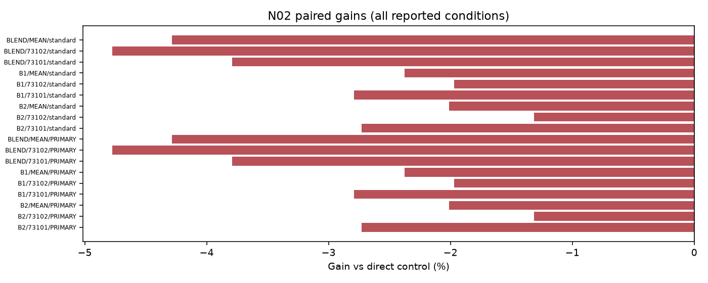
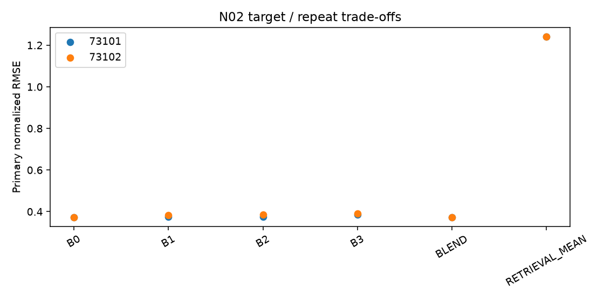

# N02 ARCHIVE 결과

실행: **COMPLETE** / 근거: **POSITIVE_UNCERTAIN** / 신규성: **UNVERIFIED_VARIANT**.

## ① 문제와 정보

관측 완료 과거 사례의 continuation 보정 가치. [계약과 방법](TOPIC_ONEPAGE.md), [정보 권한](permissions.json), [원천·원점](data_receipt.json). 원점 이후의 정답은 입력으로 허용하지 않는다.

## ② 선행 연결

[LITERATURE_BOUNDARY.md](LITERATURE_BOUNDARY.md). 알려진 구성요소와 이번 제한된 변형을 구분하며 정식 선행의 전체 재현을 주장하지 않는다.

## ③ 비교 조건과 비용

군: B0, B1, B2, B3. rank8 LoRA 1,179,648개 + 명시 보조계수, FP32 point MSE, TRAIN64,512updates, 선택seed73100의2LR 후 반복73101/73102. tau=.5 슬롯을 점예측으로 학습하므로 확률 보정 개선을 주장하지 않는다.

## ④ 실제 실행과 미실행

완료 본학습 16경로, 본학습 8192updates. 폐기 smoke 8updates. 선택·복원·원점수 검산 완료. [자원](resources.csv), [검산](verification.json), [선택](selections.json). 큰 prediction/weight는 로컬 ignored cache에 있고 GitHub에는 해시와 수치가 있다.

optimizer 실측 합계 13.46분; 최대 allocated 783.7MiB. INIT 선택 1/8. 학습 예산 미사용은 alias 또는 차단으로 구분한다.

## ⑤ 원점수·효과·seed·조건 손익

| arm | seed | score |
| --- | --- | --- |
| B0 | 73101 | 0.371290 |
| B1 | 73101 | 0.374893 |
| B2 | 73101 | 0.375119 |
| B3 | 73101 | 0.385358 |
| B0 | 73102 | 0.371958 |
| B1 | 73102 | 0.382200 |
| B2 | 73102 | 0.384670 |
| B3 | 73102 | 0.389721 |
| BLEND | 73101 | 0.371290 |
| RETRIEVAL_MEAN | 73101 | 1.241877 |
| BLEND | 73102 | 0.371958 |
| RETRIEVAL_MEAN | 73102 | 1.241877 |

| method | baseline | condition | gain_percent | ci_low | ci_high |
| --- | --- | --- | --- | --- | --- |
| B3 | B2 | PRIMARY | -2.012361 | -5.168947 | 0.760967 |
| B3 | B1 | PRIMARY | -2.375777 | -19.333684 | 7.629587 |
| B3 | BLEND | PRIMARY | -4.282787 | -15.861524 | 0.831308 |

[전체 원단위 RMSE/MAE](raw_scores.csv), [모든 반복·조건](scores_summary.csv), [512고정점 포함 대비](contrasts.csv), [부가지표](secondary_scores.csv). RMSE는 원점·horizon 제곱오차 평균 후 제곱근, 채널과 지정 조건을 동일 가중한다.

## ⑥ 단순 대안과 남은 정식 비교

직접 단순 대조의 충분성과 제안 구성요소의 추가 가치는 contrasts.csv에서 별도로 판단한다. 0근처 CI는 동등성 입증이 아니다. 알려진 단순 방법의 개선을 새 방법론 PASS로 바꾸지 않는다.

## ⑦ 다음 방법을 정의할 근거

현재 증거 상태: POSITIVE_UNCERTAIN. 단일 개발 원천과 제한된 recipe의 결과이며 정식 선행 대비·독립 확증이 남는다. 연구프로그램의 불가능성 판정은 아니다. 최종 문제 선택은 전체 MASTER_REPORT/FINAL_DECISION에서 최대2개로 제한한다. 자동 후속 학습 없음.

## 실제 결과 해석

16경로 모두 512회 학습했고 수치·복원 검사를 통과했다. 추가 학습 미실행은 없다. 제안 B3의 평균 NRMSE는 0.387540으로 B2 0.379895, 긴 이력 B1 0.378546, 짧은 이력 B0 0.371624보다 높았다. B3의 추가 보정은 B2 대비 두 seed 모두 악화했다. 평균 gain −2.01%의 조건부 CI는 [−5.17%, +0.76%]여서 통계적 열등성을 확정하는 결과와는 구분한다. 개선의 실증 근거는 없다.

CPU retrieval 평균은 NRMSE 1.241877이었다. 검증에서 선택한 단순 blend는 두 seed 모두 alpha=0이어서 B0와 정확히 같다. 긴 이력·검색 행 추가·미래 보정 중 어느 것도 이 제한된 비교에서는 B0를 개선하지 않았다. B1 반복 중 하나가 INIT를 선택했지만 이 역시 실제 512회 학습 후 검증 선택의 결과이며 학습 미실행이 아니다.

B0/B1/B2/B3의 경로당 optimizer 실측 평균은 49.75/50.34/50.53/51.26초, 최대 GPU allocated 평균은 약 604/784/744/745MiB였다. B3는 8개 보정계수와 검색을 추가한다. 고정 768개 검색 재검산은 총 2.941초, 네 채널 원점당 15.32ms였으며 데이터 로드는 별도 0.425초였다. 이것은 독립 비용 재측정이고 원래 전처리 실측 시간은 아니다. [검색 비용 및 동일성](retrieval_cost_replay.json).

평가 64원점은 6개 날짜·3개 관측 주간 블록에 몰려 있다. 모든 원점을 유지했으며 시간 일반화나 RAFT 정식 방법의 우열을 주장하지 않는다. 검색 continuation 자체는 알려진 접근이고, 이번 8계수 보정의 추가 가치·신규성 모두 확보하지 못했다. 검색 불일치가 원인일 가능성은 있지만 이 비교만으로 원인을 확정하지 않는다.

## 판정 해석과 추가 감사

추가 가치의 부호/크기/조건부 CI가 일관된 우위를 확정하지 못함; POSITIVE_UNCERTAIN 태그는 성능 성공이 아님

[정보·파라미터·노출 횟수](parameter_information_budget.csv). 보조계수가 있는 군을 완전히 동일 파라미터 예산이라고 하지 않는다. CPU fitted scalar entries는 독립 자유도나 신경망 trainable 수가 아니다.

평가 원점이 걸친 관측 주간 블록은 3개다. bootstrap 2,000회 중 1909회가 계산 가능하고 91회는 관측 없는 재표집으로 보존했다. CI는 계산 가능한 재표집에 조건부다. 중복 horizon의64원점을64개의 독립 기간으로 해석하지 않는다.

[실제 clipping·보조계수 gradient·GPU 오염 기록](optimization_diagnostics.csv), [저장된 실제 예측 루프 비용](prediction_costs.csv). 예측 시간은 guard/Python 비용을 포함하며 같은 prediction 경로를 여러 정책에서 참조하면 중복 합산하지 않는다. CPU 검산·보고를 병행했으므로 작은 시간 차이를 격리된 속도 우위라고 해석하지 않는다.
