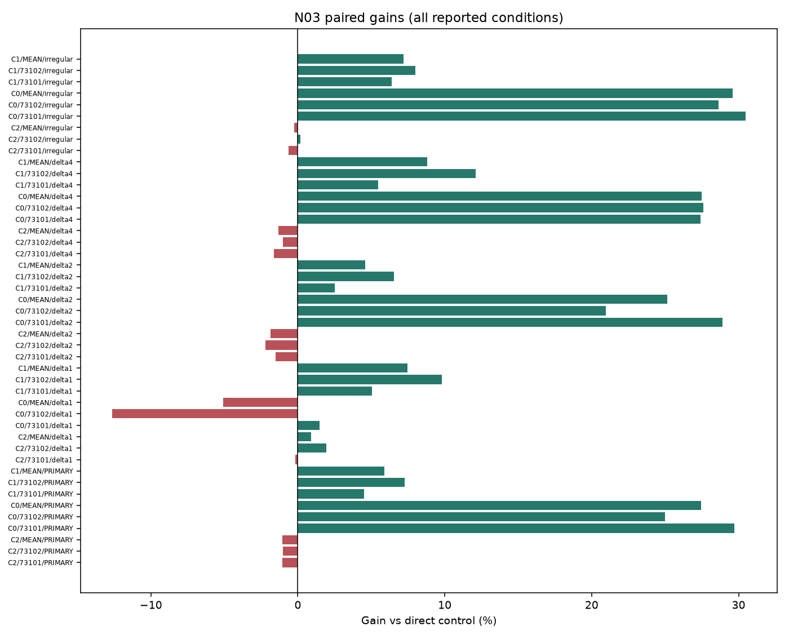
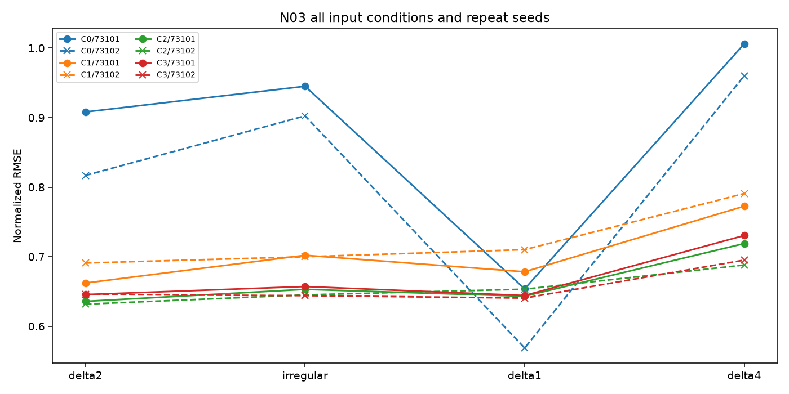

# N03 CLOCK 결과

실행: **COMPLETE** / 근거: **NEGATIVE_WITHIN_SCOPE** / 신규성: **UNVERIFIED_VARIANT**.

## ① 문제와 정보

새 관측 밀도에서 학습 kernel의 추가 가치. [계약과 방법](TOPIC_ONEPAGE.md), [정보 권한](permissions.json), [원천·원점](data_receipt.json). 원점 이후의 정답은 입력으로 허용하지 않는다. R09 숨긴 상세값의 권한은 절대시간 블록에 적용한다.

## ② 선행 연결

[LITERATURE_BOUNDARY.md](LITERATURE_BOUNDARY.md). 알려진 구성요소와 이번 제한된 변형을 구분하며 정식 선행의 전체 재현을 주장하지 않는다.

## ③ 비교 조건과 비용

군: C0, C1, C2, C3. rank8 LoRA 1,179,648개 + 명시 보조계수, FP32 point MSE, TRAIN64,512updates, 선택seed73100의2LR 후 반복73101/73102. tau=.5 슬롯을 점예측으로 학습하므로 확률 보정 개선을 주장하지 않는다.

## ④ 실제 실행과 미실행

완료 본학습 16경로, 본학습 8192updates. 폐기 smoke 8updates. 선택·복원·원점수 검산 완료. [자원](resources.csv), [검산](verification.json), [선택](selections.json). 큰 prediction/weight는 로컬 ignored cache에 있고 GitHub에는 해시와 수치가 있다.

optimizer 실측 합계 13.57분; 최대 allocated 748.0MiB. INIT 선택 0/8. 학습 예산 미사용은 alias 또는 차단으로 구분한다.

## ⑤ 원점수·효과·seed·조건 손익

| arm | seed | score |
| --- | --- | --- |
| C0 | 73101 | 0.926609 |
| C1 | 73101 | 0.682060 |
| C2 | 73101 | 0.644409 |
| C3 | 73101 | 0.651315 |
| C0 | 73102 | 0.859698 |
| C1 | 73102 | 0.695394 |
| C2 | 73102 | 0.638414 |
| C3 | 73102 | 0.644798 |

| method | baseline | condition | gain_percent | ci_low | ci_high |
| --- | --- | --- | --- | --- | --- |
| C3 | C2 | PRIMARY | -1.035942 | -1.183971 | -0.273610 |
| C3 | C0 | PRIMARY | 27.441764 | 3.411250 | 30.140491 |
| C3 | C1 | PRIMARY | 5.905172 | 1.235244 | 6.689942 |

[전체 원단위 RMSE/MAE](raw_scores.csv), [모든 반복·조건](scores_summary.csv), [512고정점 포함 대비](contrasts.csv), [부가지표](secondary_scores.csv). RMSE는 원점·horizon 제곱오차 평균 후 제곱근, 채널과 지정 조건을 동일 가중한다.

## ⑥ 단순 대안과 남은 정식 비교

직접 단순 대조의 충분성과 제안 구성요소의 추가 가치는 contrasts.csv에서 별도로 판단한다. 0근처 CI는 동등성 입증이 아니다. 알려진 단순 방법의 개선을 새 방법론 PASS로 바꾸지 않는다.

## ⑦ 다음 방법을 정의할 근거

현재 증거 상태: NEGATIVE_WITHIN_SCOPE. 단일 개발 원천과 제한된 recipe의 결과이며 정식 선행 대비·독립 확증이 남는다. 연구프로그램의 불가능성 판정은 아니다. 최종 문제 선택은 전체 MASTER_REPORT/FINAL_DECISION에서 최대2개로 제한한다. 자동 후속 학습 없음.

## 실제 결과 해석

16/16 경로·8,192 본업데이트와 smoke8을 완료했다. 반복의 모든 방법은 검증에서 512회 체크포인트를 선택했다. 선택 효과로만 추가 커널의 부진이 생겼다고 볼 수 없는 비교다. 512개 원단위 RMSE/MAE scalar 검산과 입력 권한·복원 검사를 통과했다.

주지표(새 30분 관측/간격1·3 혼합 조건 평균) NRMSE는 C0 GRID 0.893154, C1 HOLD 0.688727, C2 고정 KERNEL 0.641412, C3 학습 KERNEL 0.648056이었다. C3는 C0보다27.44%, C1보다5.91% 좋지만 가장 가까운 단순 대조 C2보다1.036% 나빴다(gain CI [−1.184%,−0.274%]). 두 반복 모두 같은 부호다. 관측을 시간 grid에 보간하는 처리는 유용했으나, 추가4계수 학습이 그 효과를 더하지 못했다.

새 delta2에서 C3의 C2 대비 gain은 −1.859%, irregular에서는 −0.232%(CI0포함)다. 학습에서 본 dense 조건에서는 C3가 C2보다0.907% 좋았지만 C0보다5.088% 나빴다. 학습에서 본 delta4에서도 C3는 C2보다1.329% 나빴다. 불리한 입력 상태나 seed를 제외하지 않았다. 같은 방법이 모든 관측 밀도에서 최선이라는 결론은 아니다.

C3는 C2와 동일한 관측값·시각·mask·age에 채널별4개 tau계수를 추가한다. 경로당 optimizer 평균은 C2 50.67초, C3 51.59초이고 peak allocated 평균은 약744/748MiB였다. 학습 커널을 추가해야 할 정확도·자원 근거는 확보하지 못했다.

가장 큰 한계는 원점 배치다. 계약의 고정 phase quota 선택으로 TRAIN64가23.5시간, V32가11.5시간, E64가23.75시간 구간에 몰렸다. E는 두 인접 index 날짜/두 부분 주간 블록뿐이다. bootstrap CI는 이 매우 좁은 자료에 조건부이며 계절·기간 일반화의 확증이 아니다. 결과를 본 뒤 원점을 넓히거나 다시 학습하지 않았다. ETTm1은 ETTh1과 같은 물리 시스템이며, 가림으로 모사한 불규칙 입력이고 실제 irregular benchmark도 아니다. FlowState/t-PatchGNN 전체 구조의 직접 재현·비교와 학습 커널의 신규성은 확보하지 않았다.

## 판정 해석과 추가 감사

적어도 하나의 필수 직접 대조에서 gain CI 전체가 음수

[정보·파라미터·노출 횟수](parameter_information_budget.csv). 보조계수가 있는 군을 완전히 동일 파라미터 예산이라고 하지 않는다.

평가 원점이 걸친 관측 주간 블록은 2개다. bootstrap 2,000회 중 2000회가 계산 가능하고 0회는 관측 없는 재표집으로 보존했다. CI는 계산 가능한 재표집에 조건부다. 중복 horizon의64원점을64개의 독립 기간으로 해석하지 않는다.

[실제 clipping·보조계수 gradient·GPU 오염 기록](optimization_diagnostics.csv), [저장된 실제 예측 루프 비용](prediction_costs.csv). 예측 시간은 guard/Python 비용을 포함하며 같은 prediction 경로를 여러 정책에서 참조하면 중복 합산하지 않는다.
