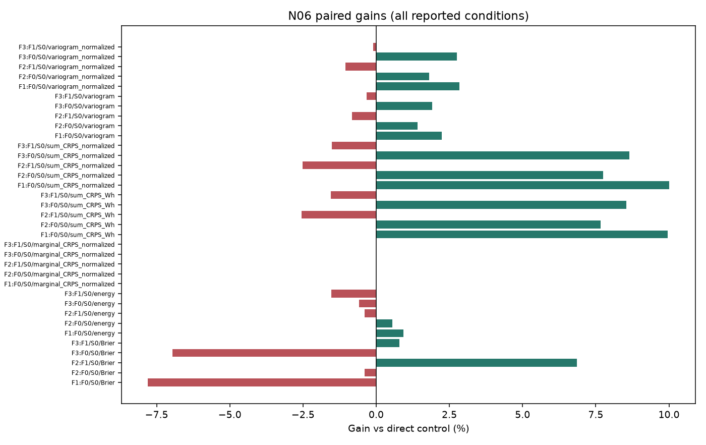
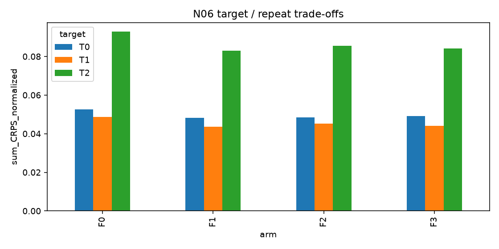

# N06 JOINT 결과

실행: **COMPLETE** / 근거: **POSITIVE_UNCERTAIN** / 신규성: **KNOWN_CONTROL**.

## ① 문제와 정보

동일 주변분포의 하루 전체 위험 결합. [계약과 방법](TOPIC_ONEPAGE.md), [정보 권한](permissions.json), [원천·원점](data_receipt.json). 원점 이후의 정답은 입력으로 허용하지 않는다. R09 숨긴 상세값의 권한은 절대시간 블록에 적용한다.

## ② 선행 연결

[LITERATURE_BOUNDARY.md](LITERATURE_BOUNDARY.md). 알려진 구성요소와 이번 제한된 변형을 구분하며 정식 선행의 전체 재현을 주장하지 않는다.

## ③ 비교 조건과 비용

군: F0, F1, F2, F3. 신규 neural fit=0. 기존 확률 예측 해시를 검증하고 CPU 정책/의존 구조만 비교한다. E는 REANALYSIS_REUSED_E다.

## ④ 실제 실행과 미실행

완료 본학습 0경로, 본학습 0updates. CPU 작업: 9건. [자원](resources.csv), [검산](verification.json), [선택](selections.json). 큰 prediction/weight는 로컬 ignored cache에 있고 GitHub에는 해시와 수치가 있다.

## ⑤ 원점수·효과·seed·조건 손익

| target | seed | arm | condition | score |
| --- | --- | --- | --- | --- |
| T0 | 73260 | F0 | S0 | 0.052568 |
| T0 | 73260 | F1 | S0 | 0.048125 |
| T0 | 73260 | F2 | S0 | 0.048504 |
| T0 | 73260 | F3 | S0 | 0.049076 |
| T1 | 73260 | F0 | S0 | 0.048728 |
| T1 | 73260 | F1 | S0 | 0.043561 |
| T1 | 73260 | F2 | S0 | 0.045169 |
| T1 | 73260 | F3 | S0 | 0.044188 |
| T2 | 73260 | F0 | S0 | 0.092893 |
| T2 | 73260 | F1 | S0 | 0.083058 |
| T2 | 73260 | F2 | S0 | 0.085470 |
| T2 | 73260 | F3 | S0 | 0.084141 |

[모든 원점·지표](scores_by_origin.csv), [주변분포 또는 조건 포함 원점수](raw_scores.csv), [직접 대비와 CI](contrasts.csv).

## ⑥ 단순 대안과 남은 정식 비교

N06의 coupling은 주변분포를 완전히 동일하게 유지한다. 합계 위험 개선은 시점별 분포 개선이나 새 PEFT의 증거가 아니다. AR1로 충분한지 SHRUNK/EMPIRICAL의 추가 효과를 별도로 읽는다.

## ⑦ 다음 방법을 정의할 근거

현재 증거 상태: POSITIVE_UNCERTAIN. 단일 개발 원천과 제한된 recipe의 결과이며 정식 선행 대비·독립 확증이 남는다. 연구프로그램의 불가능성 판정은 아니다. 최종 문제 선택은 전체 MASTER_REPORT/FINAL_DECISION에서 최대2개로 제한한다. 자동 후속 학습 없음.

## 실제 결과 해석

새 LoRA fit·optimizer update·신경망 추론은 모두 0회다. 세 타깃에서 AR1/축소 상관/경험적 순위 결합을 각각 추정해 CPU 의존구조 fitting은 9건이다. 독립 결합은 fitting이 없다. 시나리오 256개, 각 lead의 동일한 값 multiset을 네 군에 그대로 사용했다. 900개 원점-군의 합계 CRPS 검산과 72개 독립 Python scalar 부가지표 검산을 통과했다. 주변 pinball과 ensemble CRPS가 같다는 전 lead 검사도 통과했다.

전체 normalized 합계 CRPS는 독립 F0 0.064730, 단순 AR1 F1 0.058248, 축소 상관 F2 0.059714, 경험 순위 F3 0.059135였다. AR1은 독립 대비 +10.013% [8.979%,11.125%] 개선하고 세 타깃 모두 같은 방향이다. 반면 F2/F3는 AR1보다 각각 −2.517% [−3.310%,−1.814%], −1.523% [−3.019%,−0.200%] 나빴다. 관찰된 합계 위험 개선에는 단순 AR1이 충분하며 복잡한 의존구조의 추가 가치는 없다.

AR1은 energy도 +0.938% 개선했지만 고부하 6시간 사건 Brier는 독립 결합보다 7.80% 악화했다(CI가 0을 포함). 목적이 다른 이 점수들을 합산해 전체 우승을 선언하지 않는다. 합계 CRPS의 원단위는 Wh, variogram은 원래 W 입력으로 계산하며 정규화 변형을 별도로 저장했다. 서로 단위가 다른 타깃의 원단위 평균보다 사전 지정한 TRAIN sigma 정규화 주지표를 먼저 해석했다.

알려진 coupling만으로 시점별 분포를 바꾸지 않고 합계 위험을 개선한 결과다. PEFT 학습법의 성공이나 신규성의 근거는 아니다. 8월 16개 원점으로 의존구조를 추정하고 기존에 노출된 10–12월 75일을 재평가했다. 동일 원천 세 타깃, 단일 시나리오 seed, .01/.99 바깥 공통 꼬리 clamp의 한계가 있다. 새 학습법을 추가해야 할 필요성은 이번 결과에서 확인되지 않았다.

## 판정 해석과 추가 감사

동일 주변분포의 알려진 coupling 비교. 개선되어도 새 PEFT 설계/신규성은 미확보

[모든 타깃·원점·lead의 원래 pinball/ensemble CRPS 동일성](marginal_pinball_CRPS_identity.csv), [CPU fitting 장부](fit_manifest.csv). 원래 quantile의 .01/.99 밖은 공통 clamp라 극단 꼬리 정확도는 확인하지 않았다.
