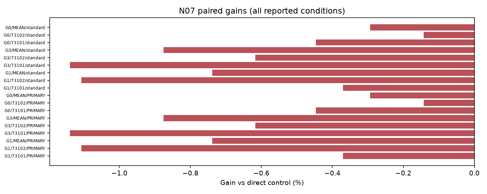
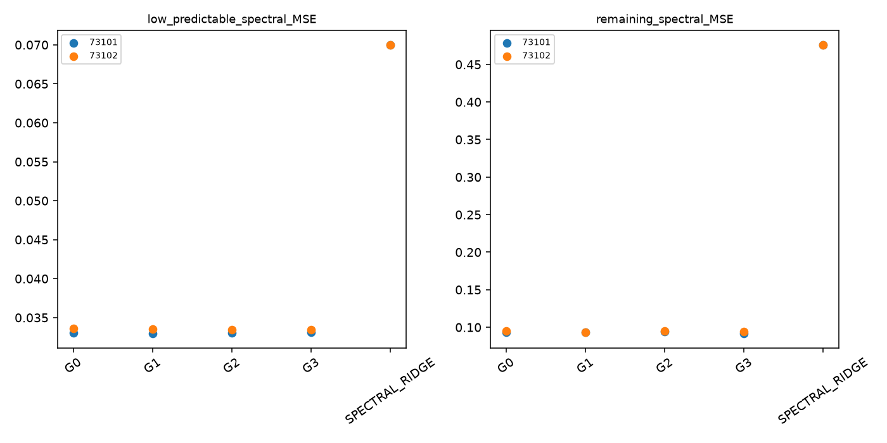

# N07 SPECTRAL 결과

실행: **COMPLETE** / 근거: **NEGATIVE_WITHIN_SCOPE** / 신규성: **UNVERIFIED_VARIANT**.

## ① 문제와 정보

작지만 예측 가능한 주파수 성분 적응. [계약과 방법](TOPIC_ONEPAGE.md), [정보 권한](permissions.json), [원천·원점](data_receipt.json). 원점 이후의 정답은 입력으로 허용하지 않는다.

## ② 선행 연결

[LITERATURE_BOUNDARY.md](LITERATURE_BOUNDARY.md). 알려진 구성요소와 이번 제한된 변형을 구분하며 정식 선행의 전체 재현을 주장하지 않는다.

## ③ 비교 조건과 비용

군: G0, G1, G2, G3. rank8 LoRA 1,179,648개 + 명시 보조계수, FP32 point MSE, TRAIN64,512updates, 선택seed73100의2LR 후 반복73101/73102. tau=.5 슬롯을 점예측으로 학습하므로 확률 보정 개선을 주장하지 않는다.

## ④ 실제 실행과 미실행

완료 본학습 16경로, 본학습 8192updates. 폐기 smoke 8updates. 선택·복원·원점수 검산 완료. [자원](resources.csv), [검산](verification.json), [선택](selections.json). 큰 prediction/weight는 로컬 ignored cache에 있고 GitHub에는 해시와 수치가 있다.

optimizer 실측 합계 13.33분; 최대 allocated 604.9MiB. INIT 선택 0/8. 학습 예산 미사용은 alias 또는 차단으로 구분한다.

## ⑤ 원점수·효과·seed·조건 손익

| arm | seed | score |
| --- | --- | --- |
| G0 | 73101 | 0.247288 |
| G1 | 73101 | 0.247476 |
| G2 | 73101 | 0.248392 |
| G3 | 73101 | 0.245595 |
| G0 | 73102 | 0.250128 |
| G1 | 73102 | 0.247741 |
| G2 | 73102 | 0.250484 |
| G3 | 73102 | 0.248949 |
| SPECTRAL_RIDGE | 73101 | 0.577984 |
| SPECTRAL_RIDGE | 73102 | 0.577984 |

| method | baseline | condition | gain_percent | ci_low | ci_high |
| --- | --- | --- | --- | --- | --- |
| G2 | G1 | PRIMARY | -0.738962 | -1.415989 | 0.573845 |
| G2 | G3 | PRIMARY | -0.876130 | -1.314418 | -0.542213 |
| G2 | G0 | PRIMARY | -0.293725 | -0.553194 | 0.042299 |

[전체 원단위 RMSE/MAE](raw_scores.csv), [모든 반복·조건](scores_summary.csv), [512고정점 포함 대비](contrasts.csv), [부가지표](secondary_scores.csv). RMSE는 원점·horizon 제곱오차 평균 후 제곱근, 채널과 지정 조건을 동일 가중한다.

## ⑥ 단순 대안과 남은 정식 비교

직접 단순 대조의 충분성과 제안 구성요소의 추가 가치는 contrasts.csv에서 별도로 판단한다. 0근처 CI는 동등성 입증이 아니다. 알려진 단순 방법의 개선을 새 방법론 PASS로 바꾸지 않는다.

## ⑦ 다음 방법을 정의할 근거

현재 증거 상태: NEGATIVE_WITHIN_SCOPE. 단일 개발 원천과 제한된 recipe의 결과이며 정식 선행 대비·독립 확증이 남는다. 연구프로그램의 불가능성 판정은 아니다. 최종 문제 선택은 전체 MASTER_REPORT/FINAL_DECISION에서 최대2개로 제한한다. 자동 후속 학습 없음.

## 실제 결과 해석

16/16 경로·8,192 본업데이트와 smoke8을 완료했다. 모든 반복에서 검증 선택은256회였고 512회 고정 결과도 별도로 보존했다. 144개 원단위 점수 scalar,48개 검증 점수와 선택 정책,16개 최종 resume·원점 순서 검사를 통과했다. 가중치·skill·ridge는 TRAIN에서 봉인했고 V/E 결과로 재계산하지 않았다.

전체 NRMSE 반복 평균은 G0 BASE0.248708, G1 ENERGY0.247609, G2 PRED0.249438, G3 SHUFFLE0.247272다. G2의 gain은 G0 대비−0.294% [−0.553%,0.042%], G1 대비−0.739% [−1.416%,0.574%], G3 대비−0.876% [−1.314%,−0.542%]다. G2는 두 seed에서 모두 G3보다 나쁘다. 같은 가중치 multiset을 어디에 배치했는가라는 핵심 대조에서 예측 가능성 정보의 추가 가치가 확인되지 않았다.

사전 지정 저에너지·예측 가능34bins의 평균 spectral MSE는 G0 약0.033323, G2 약0.033245로 작은 차이가 있으나, 나머지158bins 오차는 G0 약0.094063, G2 약0.094585로 나빠지고 주지표도 악화했다. 일부 bin의 이득만으로 목표 달성을 주장하지 않는다. CPU spectral ridge의 NRMSE는0.577984로 신경망 기준보다 높았다. SHUFFLE의 작은 점추정 우위를 새 방법론 주제로 전환하지 않는다.

네 군의 신경망 파라미터와 optimizer 기회는 동일하다. 경로당 optimizer 시간은 약49.86–50.11초, peak allocated 약604MiB로 비슷하며 작은 시간 차이는 격리된 속도 우위의 근거가 아니다. G2/G3는 TRAIN 예측 가능성 통계를 추가 계산한다. 공유 회귀계수 배열1,920개 중 음의 주파수 mirror를 제외한 원래 저장 항목은1,000개이고, 신경망 trainable 수나 독립 자유도가 아니다. 추론에서는 loss 가중치·회귀계수를 사용하지 않는다.

과거를 사용하는3개 forward fold 중 purge 후 첫 fold는 유효 학습 점이 부족해 제외했고 나머지32개 TRAIN 검증 원점의 오차로 skill을 계산했다. E는5개 index날짜·3개 관측 주간 블록에 몰려 있으며 새 독립 자료가 아니다. Fredformer/MSFT 정식 재현은 수행하지 않았고 고정 Fourier 가중 자체도 알려진 범주의 설계다. 이번 결과가 주파수 편향 전체의 부재나 모든 PEFT의 불가능성을 뜻하지 않는다. 이 특정 PRED 가중 추가 구성요소를 후속 주제로 집중할 근거는 확보하지 못했다.

## 판정 해석과 추가 감사

적어도 하나의 필수 직접 대조에서 gain CI 전체가 음수

[정보·파라미터·노출 횟수](parameter_information_budget.csv). 보조계수가 있는 군을 완전히 동일 파라미터 예산이라고 하지 않는다. CPU fitted scalar entries는 독립 자유도나 신경망 trainable 수가 아니다.

평가 원점이 걸친 관측 주간 블록은 3개다. bootstrap 2,000회 중 1929회가 계산 가능하고 71회는 관측 없는 재표집으로 보존했다. CI는 계산 가능한 재표집에 조건부다. 중복 horizon의64원점을64개의 독립 기간으로 해석하지 않는다.

공유 CPU 배열1,920개에는 음의 주파수 mirror가 포함되고 양의 주파수·DC/Nyquist의 원래 저장 회귀계수는1,000개다. G0/G1은 그 ridge 정보를 loss에 사용하지 않고 G2/G3도 추론 때는 loss 통계를 사용하지 않는다.

[실제 clipping·보조계수 gradient·GPU 오염 기록](optimization_diagnostics.csv), [저장된 실제 예측 루프 비용](prediction_costs.csv). 예측 시간은 guard/Python 비용을 포함하며 같은 prediction 경로를 여러 정책에서 참조하면 중복 합산하지 않는다. CPU 검산·보고를 병행했으므로 작은 시간 차이를 격리된 속도 우위라고 해석하지 않는다.
