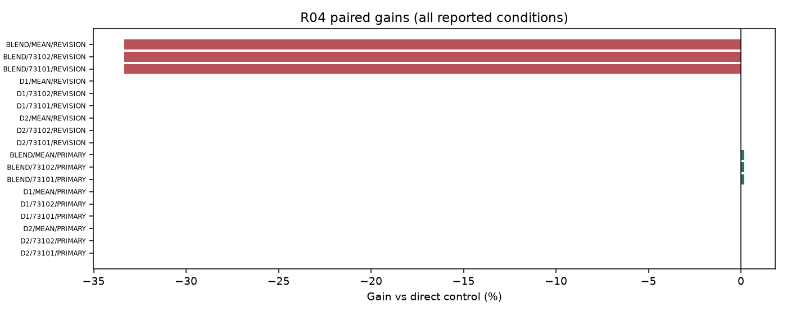
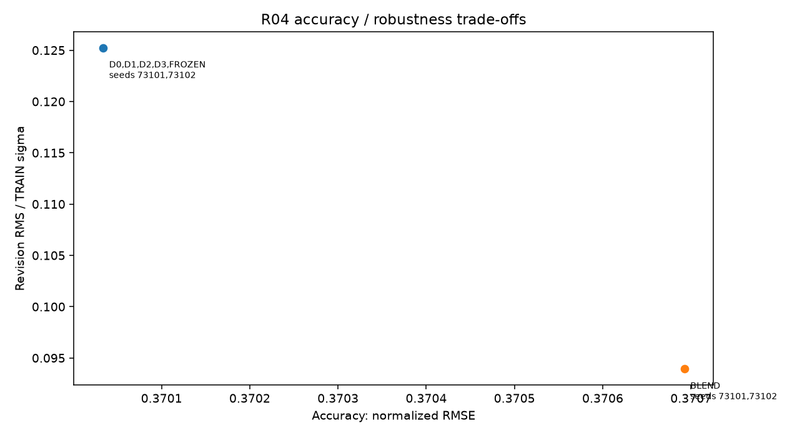

# R04 REVISION 결과

실행: **COMPLETE** / 근거: **NO_SELECTED_ADAPTATION** / 신규성: **UNVERIFIED_VARIANT**.

## ① 문제와 정보

정확도 제약 안에서 innovation 가중 수정 억제. [계약과 방법](TOPIC_ONEPAGE.md), [정보 권한](permissions.json), [원천·원점](data_receipt.json). 원점 이후의 정답은 입력으로 허용하지 않는다.

## ② 선행 연결

[LITERATURE_BOUNDARY.md](LITERATURE_BOUNDARY.md). 알려진 구성요소와 이번 제한된 변형을 구분하며 정식 선행의 전체 재현을 주장하지 않는다.

## ③ 비교 조건과 비용

군: D0, D1, D2, D3. rank8 LoRA 1,179,648개 + 명시 보조계수, FP32 point MSE, TRAIN64,512updates, 선택seed73100의2LR 후 반복73101/73102. tau=.5 슬롯을 점예측으로 학습하므로 확률 보정 개선을 주장하지 않는다.

## ④ 실제 실행과 미실행

완료 본학습 16경로, 본학습 8192updates. 폐기 smoke 8updates. 선택·복원·원점수 검산 완료. [자원](resources.csv), [검산](verification.json), [선택](selections.json). 큰 prediction/weight는 로컬 ignored cache에 있고 GitHub에는 해시와 수치가 있다.

optimizer 실측 합계 24.57분; 최대 allocated 672.6MiB. INIT 선택 8/8. 학습 예산 미사용은 alias 또는 차단으로 구분한다.

## ⑤ 원점수·효과·seed·조건 손익

| arm | seed | score |
| --- | --- | --- |
| D0 | 73101 | 0.370034 |
| D1 | 73101 | 0.370034 |
| D2 | 73101 | 0.370034 |
| D3 | 73101 | 0.370034 |
| D0 | 73102 | 0.370034 |
| D1 | 73102 | 0.370034 |
| D2 | 73102 | 0.370034 |
| D3 | 73102 | 0.370034 |
| BLEND | 73101 | 0.370692 |
| BLEND | 73102 | 0.370692 |
| FROZEN | 73101 | 0.370034 |
| FROZEN | 73102 | 0.370034 |

| method | baseline | condition | gain_percent | ci_low | ci_high |
| --- | --- | --- | --- | --- | --- |
| D3 | D2 | PRIMARY | 0.000000 | 0.000000 | 0.000000 |
| D3 | D1 | PRIMARY | 0.000000 | 0.000000 | 0.000000 |
| D3 | BLEND | PRIMARY | 0.177706 | -0.184351 | 0.526070 |
| D3 | D2 | REVISION | 0.000000 | 0.000000 | 0.000000 |
| D3 | D1 | REVISION | 0.000000 | 0.000000 | 0.000000 |
| D3 | BLEND | REVISION | -33.333333 | -33.333333 | -33.333333 |

[전체 원단위 RMSE/MAE](raw_scores.csv), [모든 반복·조건](scores_summary.csv), [512고정점 포함 대비](contrasts.csv), [부가지표](secondary_scores.csv). RMSE는 원점·horizon 제곱오차 평균 후 제곱근, 채널과 지정 조건을 동일 가중한다.

[정확도–수정 frontier](accuracy_revision_frontier.csv)의 E_accuracy_protected를 확인한다. 수정량 감소만으로 목표 달성이 아니다.

## ⑥ 단순 대안과 남은 정식 비교

직접 단순 대조의 충분성과 제안 구성요소의 추가 가치는 contrasts.csv에서 별도로 판단한다. 0근처 CI는 동등성 입증이 아니다. 알려진 단순 방법의 개선을 새 방법론 PASS로 바꾸지 않는다.

## ⑦ 다음 방법을 정의할 근거

현재 증거 상태: NO_SELECTED_ADAPTATION. 단일 개발 원천과 제한된 recipe의 결과이며 정식 선행 대비·독립 확증이 남는다. 연구프로그램의 불가능성 판정은 아니다. 최종 문제 선택은 전체 MASTER_REPORT/FINAL_DECISION에서 최대2개로 제한한다. 자동 후속 학습 없음.

## 실제 결과 해석

16/16 경로·8,192 본업데이트와 smoke8을 끝냈다. 모두 두 원점의 실제 forward를 사용했고 동결 가중치·복원·선택 기록을 검사했다. 340개 추가 scalar 검산은 E 원단위 RMSE/MAE와 수정량의 집계가 일치함을 확인했다. 규제 강도 lambda=0.1134017616과 혁신량 가중은 TRAIN만으로 계산한 독립 검산과 일치했다.

네 군×두 반복 모두 INIT가 선택됐다. 선택된 D0/D1/D2/D3와 FROZEN은 NRMSE0.370034, 수정 RMS0.125241로 동일하다. 따라서 별도 seed를 학습했어도 최종 선택 예측의 반복 차이는 없고, 학습 적응의 추가 가치가 선택되지 않았다. 실행 실패·gradient 단절·미학습으로 분류하지 않는다.

단순 평활화 BLEND는 V에서 두 seed 모두 alpha=.25를 선택했다. E의 NRMSE는0.370692로 기존 발행 예측보다 약0.178% 악화했지만 사전1% 정확도 보호 범위 안이다. 수정 RMS는0.093931로25% 감소했다. 이25%는 이전 발행 예측을25% 섞는 구조에서 기계적으로 발생하며, 중요한 관측은 그 감소가 E 정확도 손해0.178%로 가능했다는 점이다. 추가 LoRA나 두 번째 종류의 모델 없이 이전에 발행한 예측을 저장해 섞는 단순 대안이다.

512회 고정 체크포인트도 숨기지 않았다. D3의 반복 평균 NRMSE0.390467, 수정 RMS0.216285는 선택된 초기 모델보다 모두 나쁘다. D3의 수정량은 D2보다0.782%, D1보다6.302% 악화했고 두 직접 CI 모두 음수다. 고정512의 원래 frontier 열은 같은512 D0를 기준으로 한 보호 여부이므로, 선택된 D0 기준과 혼동하면 안 된다. 별도 accuracy_protection_references.csv에서 두 기준을 모두 표시했다.

전체 학습 중 clipping 비율은 군별 약0.20–0.39%였고 GPU 외부 compute 오염은0회다. lambda나 학습률을 불리한 결과에 맞춰 재조정하지 않았다. 전체 queue 종료 후 사전 지정 TRAIN 네 쌍×두 seed에서 선택 가중치의 gradient를 분해했다. D1의 가중 규제/task gradient norm 비율 평균은0.2758이었다. D2/D3는 INIT가 선택되어 correction과 그 규제 gradient가0이었다. 이것은 선택된 초기 가중치에서의 값이며 학습 중 모든 update에서 규제가0이었다는 뜻이 아니다. 0optimizer 검사로 동결·학습 가중치 모두 보존했고, 역사적 모든 update의 gradient 분해를 대체하지 않는다. [원기록](gradient_contributions.csv).

이 고정 조건에서는 단순 평활화로 정확도–수정량 절충을 얻을 수 있었고 새 LoRA 규제의 필요성은 확인하지 못했다. 평가 원점은5개 index날짜·4개 관측 주간 블록으로 제한된다. 정식 N-BEATS-S/TARW와의 동등 예산 비교는 수행하지 않았다. 혁신량 기반 보존이 일반적으로 무효라는 원인 결론이나 새로운 규제의 최초성 주장은 하지 않는다.

## 판정 해석과 추가 감사

R04의 주목적은 정확도 개선 자체가 아닌 정확도1% 보호 아래 원 발행 예측 수정량 감소 두 반복 모두 제안군 INIT 선택

[정보·파라미터·노출 횟수](parameter_information_budget.csv). 보조계수가 있는 군을 완전히 동일 파라미터 예산이라고 하지 않는다. CPU fitted scalar entries는 독립 자유도나 신경망 trainable 수가 아니다.

평가 원점이 걸친 관측 주간 블록은 4개다. bootstrap 2,000회 중 1965회가 계산 가능하고 35회는 관측 없는 재표집으로 보존했다. CI는 계산 가능한 재표집에 조건부다. 중복 horizon의64원점을64개의 독립 기간으로 해석하지 않는다.

[실제 clipping·보조계수 gradient·GPU 오염 기록](optimization_diagnostics.csv), [저장된 실제 예측 루프 비용](prediction_costs.csv). 예측 시간은 guard/Python 비용을 포함하며 같은 prediction 경로를 여러 정책에서 참조하면 중복 합산하지 않는다. CPU 검산·보고를 병행했으므로 작은 시간 차이를 격리된 속도 우위라고 해석하지 않는다.

[원점별 정확도·수정량·혁신량](scores_by_origin.csv), [원점 점수 재집계 검산](origin_score_verification.json). frontier의 raw_revision은 adapter 보정량이 아닌 발행 예측 차이이며 TRAIN sigma로 정규화한 RMS다.
