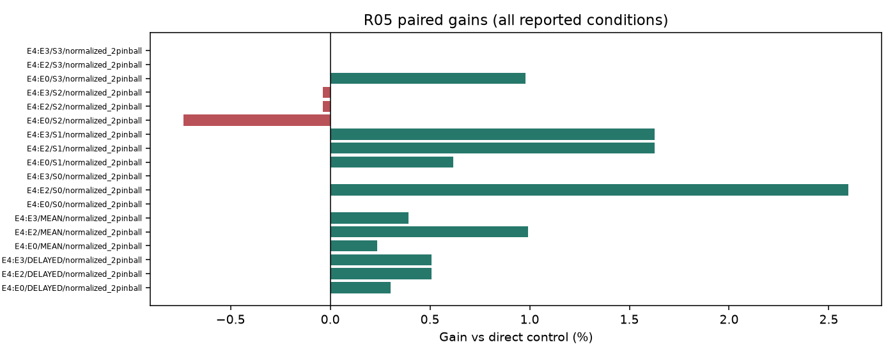
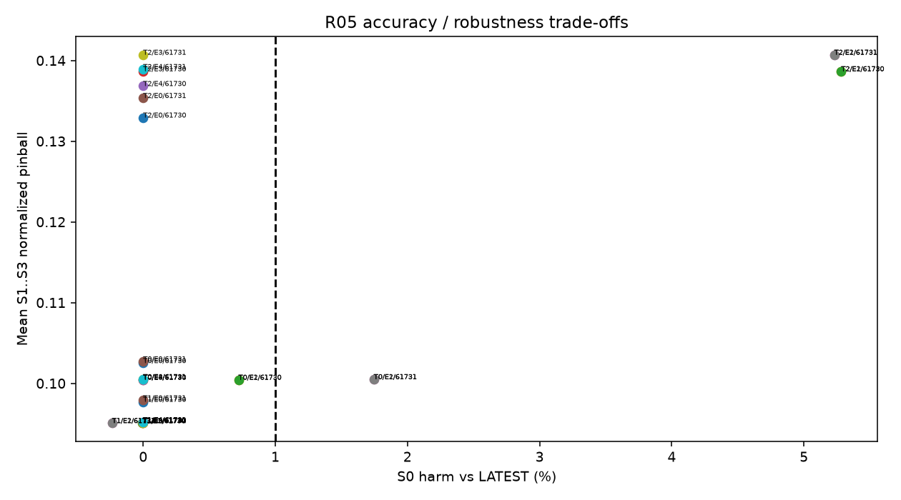

# R05 VINTAGE 결과

실행: **COMPLETE** / 근거: **PROMISING_WITHIN_SCOPE** / 신규성: **KNOWN_CONTROL**.

## ① 문제와 정보

최신 정확도를 보호하는 vintage 정책. [계약과 방법](TOPIC_ONEPAGE.md), [정보 권한](permissions.json), [원천·원점](data_receipt.json). 원점 이후의 정답은 입력으로 허용하지 않는다.

## ② 선행 연결

[LITERATURE_BOUNDARY.md](LITERATURE_BOUNDARY.md). 알려진 구성요소와 이번 제한된 변형을 구분하며 정식 선행의 전체 재현을 주장하지 않는다.

## ③ 비교 조건과 비용

군: E0, E1, E2, E3, E4. 신규 neural fit=0. 기존 확률 예측 해시를 검증하고 CPU 정책/의존 구조만 비교한다. E는 REANALYSIS_REUSED_E다.

## ④ 실제 실행과 미실행

완료 본학습 0경로, 본학습 0updates. CPU 작업: 225건. [자원](resources.csv), [검산](verification.json), [선택](selections.json). 큰 prediction/weight는 로컬 ignored cache에 있고 GitHub에는 해시와 수치가 있다.

## ⑤ 원점수·효과·seed·조건 손익

| target | seed | arm | S0 | S1 | S2 | S3 | DELAYED |
| --- | --- | --- | --- | --- | --- | --- | --- |
| T0 | 61730 | E0 | 0.082995 | 0.095079 | 0.099304 | 0.113138 | 0.102507 |
| T0 | 61730 | E1 | 0.083593 | 0.093924 | 0.097992 | 0.109409 | 0.100442 |
| T0 | 61730 | E2 | 0.083593 | 0.093924 | 0.097992 | 0.109409 | 0.100442 |
| T0 | 61730 | E3 | 0.082995 | 0.093924 | 0.097992 | 0.109409 | 0.100442 |
| T0 | 61730 | E4 | 0.082995 | 0.093924 | 0.097992 | 0.109409 | 0.100442 |
| T0 | 61731 | E0 | 0.082655 | 0.095132 | 0.099480 | 0.113558 | 0.102723 |
| T0 | 61731 | E1 | 0.084097 | 0.093954 | 0.098101 | 0.109487 | 0.100514 |
| T0 | 61731 | E2 | 0.084097 | 0.093954 | 0.098101 | 0.109487 | 0.100514 |
| T0 | 61731 | E3 | 0.082655 | 0.093954 | 0.098101 | 0.109487 | 0.100514 |
| T0 | 61731 | E4 | 0.082655 | 0.093954 | 0.098101 | 0.109487 | 0.100514 |
| T1 | 61730 | E0 | 0.080040 | 0.091669 | 0.093869 | 0.107589 | 0.097709 |
| T1 | 61730 | E1 | 0.080035 | 0.089686 | 0.092162 | 0.103374 | 0.095074 |
| T1 | 61730 | E2 | 0.080035 | 0.089686 | 0.092162 | 0.103374 | 0.095074 |
| T1 | 61730 | E3 | 0.080040 | 0.089686 | 0.092162 | 0.103374 | 0.095074 |
| T1 | 61730 | E4 | 0.080040 | 0.089876 | 0.092285 | 0.103374 | 0.095178 |
| T1 | 61731 | E0 | 0.079972 | 0.091805 | 0.094048 | 0.107825 | 0.097892 |
| T1 | 61731 | E1 | 0.079784 | 0.089642 | 0.092206 | 0.103386 | 0.095078 |
| T1 | 61731 | E2 | 0.079784 | 0.089642 | 0.092206 | 0.103386 | 0.095078 |
| T1 | 61731 | E3 | 0.079972 | 0.089642 | 0.092206 | 0.103386 | 0.095078 |
| T1 | 61731 | E4 | 0.079972 | 0.089839 | 0.092325 | 0.103386 | 0.095184 |
| T2 | 61730 | E0 | 0.130960 | 0.129772 | 0.134620 | 0.134389 | 0.132927 |
| T2 | 61730 | E1 | 0.137877 | 0.136338 | 0.140306 | 0.139343 | 0.138662 |
| T2 | 61730 | E2 | 0.137877 | 0.136338 | 0.140306 | 0.139343 | 0.138662 |
| T2 | 61730 | E3 | 0.130960 | 0.136338 | 0.140306 | 0.139343 | 0.138662 |
| T2 | 61730 | E4 | 0.130960 | 0.130850 | 0.140306 | 0.139343 | 0.136833 |
| T2 | 61731 | E0 | 0.133209 | 0.131853 | 0.137176 | 0.137017 | 0.135349 |
| T2 | 61731 | E1 | 0.140176 | 0.138272 | 0.142327 | 0.141526 | 0.140708 |
| T2 | 61731 | E2 | 0.140176 | 0.138272 | 0.142327 | 0.141526 | 0.140708 |
| T2 | 61731 | E3 | 0.133209 | 0.138272 | 0.142327 | 0.141526 | 0.140708 |
| T2 | 61731 | E4 | 0.133209 | 0.132943 | 0.142327 | 0.141526 | 0.138932 |

모든 타깃·seed·조건을 포함했다. [원단위·보정 민감도 포함 원점수](raw_scores.csv), [직접 대비와 CI](contrasts.csv), [최악 지연 조건 대비](worst_delayed_contrasts.csv).

## ⑥ 단순 대안과 남은 정식 비교

직접 단순 대조의 충분성과 제안 구성요소의 추가 가치는 contrasts.csv에서 별도로 판단한다. 0근처 CI는 동등성 입증이 아니다. 알려진 단순 방법의 개선을 새 방법론 PASS로 바꾸지 않는다.

## ⑦ 다음 방법을 정의할 근거

현재 증거 상태: PROMISING_WITHIN_SCOPE. 단일 개발 원천과 제한된 recipe의 결과이며 정식 선행 대비·독립 확증이 남는다. 연구프로그램의 불가능성 판정은 아니다. 최종 문제 선택은 전체 MASTER_REPORT/FINAL_DECISION에서 최대2개로 제한한다. 자동 후속 학습 없음.

E4에서 alpha0=0이면 S0는 E0와 동일하다. 중간 alpha는 두 모델 추론이며 단일 PEFT 비용이 아니다. latest 모델도 이전4case평균 V로 선택됐다는 한계가 있다.

## 실제 결과 해석

새 신경망 학습·추론은 0회다. 기존 완료 모델의 예측 해시를 확인하고 세 타깃에서 GLOBAL 5개와 MONOTONE 70개 정책, 총 225개 CPU 선택 설정을 검증 자료로 비교했다. 선택 감사는 동일 계산의 재검산이며 추가 탐색이 아니다. 원점별 75개 평가일과 두 seed를 모두 유지했다. 10월 26일 정답 결측 제외는 이전 공통 명세 그대로다.

E4 MONOTONE의 전체 지연 normalized 2-pinball은 0.111180, E0 LATEST는 0.111518, E2 GLOBAL/E3 BINARY는 0.111746이었다. E4는 E3 대비 +0.506% [0.169%, 0.807%] 개선했지만 E0 대비 +0.303% [−1.161%, 1.981%]로 일관된 최신 모델 우위를 입증하지 못했다. S3의 +0.980% 대 LATEST도 CI가 0을 포함한다. 최신 S0는 E4와 E0가 모두 0.098305로 정확히 같고 이는 alpha0=0의 구조적 결과다.

선택 정책은 T0 [0,1,1,1], T1 [0,.75,.75,1], T2 [0,.25,1,1]이다. T0는 BINARY와 정확한 alias다. T1/T2 중간 상태에서는 두 모델의 전체 quantile 벡터를 함께 계산해야 한다. 따라서 지연 손실의 작은 이득을 단일 PEFT의 정확도·자원 개선이라고 할 수 없다. 두 체크포인트 보관도 필요하다. 이 정책은 quantile 벡터 보간이며 확률 mixture의 quantile은 아니다.

최신 성능 보호와 지연 손실을 분리해 운영하는 문제에는 제한된 근거가 있다. 그러나 이전 평가 구간을 재사용한 사후 재분석이며, 세 타깃도 같은 계통 원천이다. 실제 forecast vintage가 아닌 모사 as-of 입력이고 LATEST 모델의 이전 선택도 네 입력 상태 평균이었다. 새 학습법의 신규성은 없고 새로운 독립 시험의 성공도 아니다. 보정된 예측 민감도, 모든 타깃/seed별 손익은 전체 CSV에 보존했다.

## 판정 해석과 추가 감사

단순 정책 대비 지연 손실 우위; 최신 보호는 별도 점검

[최신 보호·실제 모델 호출 비용](latest_protection_and_cost.csv), [CPU 선택 장부](fit_manifest.csv).
