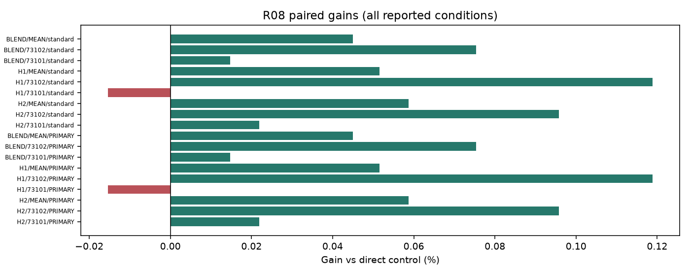
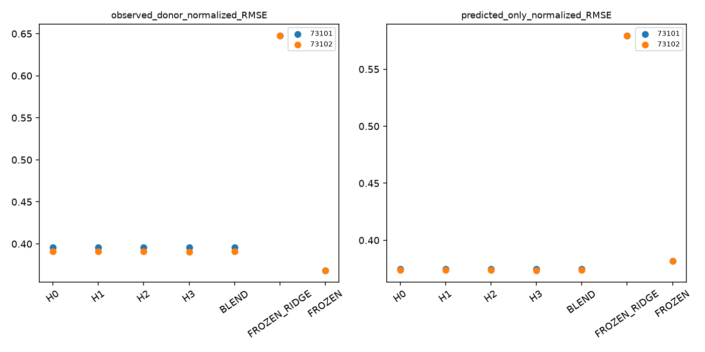

# R08 LEAD 결과

실행: **COMPLETE** / 근거: **POSITIVE_UNCERTAIN** / 신규성: **UNVERIFIED_VARIANT**.

## ① 문제와 정보

관측 가능한 선행 구간에 따른 보정. [계약과 방법](TOPIC_ONEPAGE.md), [정보 권한](permissions.json), [원천·원점](data_receipt.json). 원점 이후의 정답은 입력으로 허용하지 않는다.

## ② 선행 연결

[LITERATURE_BOUNDARY.md](LITERATURE_BOUNDARY.md). 알려진 구성요소와 이번 제한된 변형을 구분하며 정식 선행의 전체 재현을 주장하지 않는다.

## ③ 비교 조건과 비용

군: H0, H1, H2, H3. rank8 LoRA 1,179,648개 + 명시 보조계수, FP32 point MSE, TRAIN64,512updates, 선택seed73100의2LR 후 반복73101/73102. tau=.5 슬롯을 점예측으로 학습하므로 확률 보정 개선을 주장하지 않는다.

## ④ 실제 실행과 미실행

완료 본학습 16경로, 본학습 8192updates. 폐기 smoke 8updates. 선택·복원·원점수 검산 완료. [자원](resources.csv), [검산](verification.json), [선택](selections.json). 큰 prediction/weight는 로컬 ignored cache에 있고 GitHub에는 해시와 수치가 있다.

optimizer 실측 합계 13.50분; 최대 allocated 604.9MiB. INIT 선택 0/8. 학습 예산 미사용은 alias 또는 차단으로 구분한다.

## ⑤ 원점수·효과·seed·조건 손익

| arm | seed | score |
| --- | --- | --- |
| H0 | 73101 | 0.382114 |
| H1 | 73101 | 0.381999 |
| H2 | 73101 | 0.382141 |
| H3 | 73101 | 0.382057 |
| H0 | 73102 | 0.379888 |
| H1 | 73102 | 0.380053 |
| H2 | 73102 | 0.379965 |
| H3 | 73102 | 0.379601 |
| BLEND | 73101 | 0.382114 |
| FROZEN_RIDGE | 73101 | 0.596125 |
| BLEND | 73102 | 0.379888 |
| FROZEN_RIDGE | 73102 | 0.596125 |
| FROZEN | 73101 | 0.375896 |
| FROZEN | 73102 | 0.375896 |

| method | baseline | condition | gain_percent | ci_low | ci_high |
| --- | --- | --- | --- | --- | --- |
| H3 | H2 | PRIMARY | 0.058756 | -0.023873 | 0.241771 |
| H3 | H1 | PRIMARY | 0.051564 | -0.030730 | 0.247001 |
| H3 | BLEND | PRIMARY | 0.044963 | -0.204198 | 0.426083 |

[전체 원단위 RMSE/MAE](raw_scores.csv), [모든 반복·조건](scores_summary.csv), [512고정점 포함 대비](contrasts.csv), [부가지표](secondary_scores.csv). RMSE는 원점·horizon 제곱오차 평균 후 제곱근, 채널과 지정 조건을 동일 가중한다.

## ⑥ 단순 대안과 남은 정식 비교

직접 단순 대조의 충분성과 제안 구성요소의 추가 가치는 contrasts.csv에서 별도로 판단한다. 0근처 CI는 동등성 입증이 아니다. 알려진 단순 방법의 개선을 새 방법론 PASS로 바꾸지 않는다.

## ⑦ 다음 방법을 정의할 근거

현재 증거 상태: POSITIVE_UNCERTAIN. 단일 개발 원천과 제한된 recipe의 결과이며 정식 선행 대비·독립 확증이 남는다. 연구프로그램의 불가능성 판정은 아니다. 최종 문제 선택은 전체 MASTER_REPORT/FINAL_DECISION에서 최대2개로 제한한다. 자동 후속 학습 없음.

## 실제 결과 해석

16/16 경로·8,192 본업데이트와 smoke8을 완료했고 모든 반복은512회 체크포인트를 선택했다. 176개 원단위 scalar 점수와 선택·복원·최종 resume·원점 순서 검산을 통과했다. 비교군별로 불리한 seed나 원점을 제외하지 않았다.

전체 NRMSE 반복 평균은 H0 기본 LoRA0.381001, H1 정적 보정0.381026, H2 선형 horizon 보정0.381053, H3 가용성 보정0.380829다. H3는 H2보다0.0588% [−0.0239%,0.2418%], H1보다0.0516% [−0.0307%,0.2470%], 단순 blend보다0.0450% [−0.2042%,0.4261%] 낮았다. 두 seed의 점추정은 같은 방향이지만 모든 핵심 구간이0을 포함한다. 작은 양의 관측과 불확실성을 함께 기록하며, 실패 확정이나 동등성 입증으로 바꾸지 않는다.

CPU 고정 ridge 예측은0.596125이고 V에서 선택된 blend는 두 seed 모두alpha=0이어서 H0와 같다. 더 단순한 동결 모델은0.375896으로 H3보다 낮았다. 따라서 작은 출력 보정의 이득만으로 동결 모델 대비 유용한 PEFT 적응을 얻었다고 주장할 수 없다.

조건별 손익도 있다. H3의 관측 donor 구간 normalized RMSE는 두 seed 평균 약0.393020으로 FROZEN0.368412보다 높고, 예측 donor만 남은 구간에서는 약0.374118로 FROZEN0.381742보다 낮다. 이 부가지표는 해당 mask의 오차를 모은 값이며 전체 주지표의 채널별 sqrt 평균과 집계 순서가 다르다. 좋은 horizon만 선택해 주목적을 바꾸지 않았다.

H2/H3는 동일한8개 보조계수이고 H1은4개다. 공통 TRAIN ridge는12개 회귀계수와42,008개 채널별 시간쌍을 사용했다. 선택된 시차는 [[1,23],[1,23],[23,1],[1,1]]이다. 모든 보정군은 같은 고정 donor 정보를 받으며 H0는 이 추가 ridge를 사용하지 않는다. 경로당 optimizer는 H0 약50.08초, H1/H2/H3 약50.72–50.84초, peak allocated는 약604MiB다. 작은 시간 차이는 격리된 속도 이득으로 해석하지 않는다.

가용성 곡선은 TRAIN에서 고정한 시차·계수와 horizon으로 정해져 같은 채널의 모든 원점에서 동일하다. 실시간 시차 탐지나 임의 누락 패턴을 검증한 것이 아니다. E 원점은6개 index날짜·3개 관측 주간 블록에 몰려 있고, 정식 LIFT와 직접 비교하지 않았다. 현재 작은 불확실한 추가 효과만으로 이 보정을 새 방법론의 집중 주제로 확정할 근거는 부족하다.

## 판정 해석과 추가 감사

추가 가치의 부호/크기/조건부 CI가 일관된 우위를 확정하지 못함; POSITIVE_UNCERTAIN 태그는 성능 성공이 아님

[정보·파라미터·노출 횟수](parameter_information_budget.csv). 보조계수가 있는 군을 완전히 동일 파라미터 예산이라고 하지 않는다. CPU fitted scalar entries는 독립 자유도나 신경망 trainable 수가 아니다.

평가 원점이 걸친 관측 주간 블록은 3개다. bootstrap 2,000회 중 1909회가 계산 가능하고 91회는 관측 없는 재표집으로 보존했다. CI는 계산 가능한 재표집에 조건부다. 중복 horizon의64원점을64개의 독립 기간으로 해석하지 않는다.

[실제 clipping·보조계수 gradient·GPU 오염 기록](optimization_diagnostics.csv), [저장된 실제 예측 루프 비용](prediction_costs.csv). 예측 시간은 guard/Python 비용을 포함하며 같은 prediction 경로를 여러 정책에서 참조하면 중복 합산하지 않는다. CPU 검산·보고를 병행했으므로 작은 시간 차이를 격리된 속도 우위라고 해석하지 않는다.
