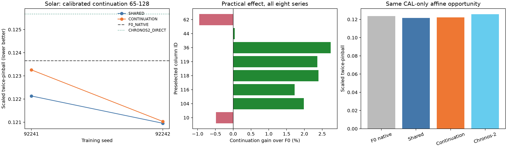

# Continuation-only LoRA 제한 실험 결과

**실행 COMPLETE. 판단 PRACTICAL_DIRECTION_POSITIVE_PILOT_SIGNAL.** 두 seed에서 보정 F0 대비 개선 방향이 반복됐다. 제한된 practical-direction pilot 신호이며 확정적인 우위 판정은 아니다. 이 판단의 주 비교는 후반64에서 **CONTINUATION+CAL 대 F0+같은 CAL**이다. SHARED보다 좋은 것만으로 실용적 우위를 선언하지 않는다.

4/4 fits, 2,048/2,048 main updates, 4/4 smoke updates. 선택용 seed 없이 두 반복을 모두 포함했다. 추가 LR/rank/loss/seed 탐색과 이전 TEST 재평가는 없었다. 평균은 seed별 점수 평균이며 예측 ensemble이 아니다.

이번에는 **제한된 Solar 조건에서 LoRA의 작은 예측 이득은 관찰됐지만, 후반 전용 구조가 전체 적용보다 더 정확하지는 않았다.** 보정 F0 대비 후반 개선은 SHARED가 두 seed 각각1.23%/2.18%(평균1.70%), CONTINUATION이0.32%/2.12%(평균1.22%)였다. CONTINUATION은 SHARED보다 두 seed 모두 나빴고 평균0.50% 악화했다. 따라서 이 결과에서 더 단순한 SHARED를 제치고 새 gating 구조를 정확도 주력 후보로 선택할 근거는 없다. 사전 정의한 양방향 반복 신호를 사후에 실패로 바꾸지는 않는다.

CONTINUATION의 제한적 장점은 첫64 예측의 정확한 보존과 이 실행에서 측정된 학습 계산 시간20.82% 감소다. SHARED 평균44.00초, CONTINUATION34.84초이며 peak allocated memory는 약466MiB로 거의 같았다. 보정 후 전체128 점수는 F0 0.145494, SHARED 0.144643, CONTINUATION 0.144741, Chronos-2 0.151011이다(낮을수록 좋음). 후반 전용의 보존 성질이 전체128에서 SHARED보다 우수한 정확도로 이어지지는 않았다.

F0 대비 주 비교95%구간은0을 포함한다. 작은 효과·단일 원천8열·두seed이므로 **실용 방향의 pilot 신호**로 제한하며 안정적인 배포 우위나 새로운 PEFT 원리로 선언하지 않는다. Chronos-2보다도 후반 점수는 평균2.81% 낮았지만 서로 다른 backbone 비교이며 일반적인 모델 순위가 아니다. 추론 시간은 고정된 실행 순서와 예측 배열의 CPU 전송을 포함한 측정으로, 반복 순서 통제 latency benchmark가 아니다. CONTINUATION의 추론 속도 우위는 확인되지 않았다.

아래 자동 생성 결과에 대한 사후 수치·원자료 집계·provenance 검산은 [POSTRUN_AUDIT.json](POSTRUN_AUDIT.json)에 보존한다. 이 해석 보완은 학습·선택·판정 규칙이나 봉인된 소스를 바꾸지 않았다.

## 설계와 범위

Solar-energy 공식10분 간격137열 원자료를 겹치지 않는6행 평균으로 시간 단위로 집계했다. TRAIN 유한·양의 분산 조건을 통과한 열을 고정SHA 순서로 정렬한 첫8열(36, 10, 44, 119, 62, 104, 116, 118)이다. 예측 성능이나 0비율로 열을 고르지 않았다. 실제 달력·시간대는 만들지 않았다. 전체8,760시간, context512/horizon128, 시간순 TRAIN60/CAL10/VAL10/TEST20%, 일24슬롯 간격이다. CAL/VAL/TEST 원점 수는 각각 32/31/68개다. 모든 target window는 해당 역할 구간 안에 있으며 표준편차는 TRAIN만 사용한다.

저장소 노출 감사: Scoped rg found no prior solar_AL/solar-energy/solarenergy mentions; this does not rule out upstream pretraining exposure. 공개 benchmark의 upstream pretraining 노출을 배제한 자료는 아니다. 원자료·집계·결측·선택·hash는 [DATA_AUDIT.json](DATA_AUDIT.json)에 있다.

동일 pretrained Chronos-Bolt-small을 동결하고 q/v rank8 LoRA(294,912개 파라미터), FP32, LR1e-4, batch4,512updates를 사용했다. SHARED는 두 블록에 같은 LoRA를 적용하며 .5 첫64 pinball + .5 후반 혼합분포 CRPS로 학습한다. CONTINUATION은 첫64에서 LoRA를 끄고 F0의9개 경로를 고정한 뒤 다음64에서만 LoRA를 켠다. 후반 loss 계수 .5는 유지한다.

이 비교는 **gating + F0 branch context 고정 + 첫64 loss 제거**의 묶음 효과다. 각 요소의 독립 효과를 식별하지 않는다. 둘째 호출에서는 관측 토큰에도 LoRA가 작동하므로 생성 토큰만 수정하는 방법이 아니다. 첫64 보존은 검증할 수 있지만 후반 성능 개선을 보장하지 않는다. Aurora의 기존 [from_second LoRA](https://microsoft.github.io/aurora/api.html)가 있어 gating 자체는 새 원리라고 주장하지 않는다.

공식 Bolt는 중앙값-only가 아니다. raw 분위수-labelled9경로,9×9후반 예측,공식9분위수 축약을 동일하게 사용했다. 생성 context는 detach하고 미래 정답은 넣지 않는다. CRPS는81개 동일질량 지지점의 정확한 경험분포 점수이며 연속분포의 정확한 CRPS 또는 IID 표본 보정을 주장하지 않는다.

각 모델은 INIT/128/256/512에서 VAL 후반 점수가 최소인 checkpoint를 선택했다. 선택과 CAL-only35점 위치·폭 보정은 TEST 예측 전에 봉인했다. 보정은 출력에만 적용하며 context에 되먹이지 않는다. Chronos-2 direct는 다른 크기·사전학습의 실용 참고 모델이며 같은 계산량의 인과 대조가 아니다.

## 학습 없는 감쇠 진단

이전 ETTh2의 선택 MIXTURE 가중치에 W=W0+lambda*DeltaW를 적용하고 lambda{0,.25,.5,1}를 기존 VALIDATION에서만 비교했다. LoRA B만 감쇠하며 출력 보간이 아니다. 이 진단은 노출된 개발 자료에 대한 것이고 독립 확인 결과가 아니다. Solar에서는 진단 결과와 관계없이 두 arm 모두 lambda1을 사용했다.

```text
 seed    lambda     score  selected_step
92231 0.0000000 0.3533375            512
92231 0.2500000 0.3498586            512
92231 0.5000000 0.3465405            512
92231 1.0000000 0.3406564            512
92232 0.0000000 0.3533375            512
92232 0.2500000 0.3480615            512
92232 0.5000000 0.3427571            512
92232 1.0000000 0.3334668            512
```

[ATTENUATION_DIAGNOSTIC.json](ATTENUATION_DIAGNOSTIC.json)에 endpoint parity와 선택·추론 검산이 있다. VAL 평균으로 선택한 lambda는 1다. 두 seed 모두 lambda1의 점수가 가장 낮았으므로, 현재 진단은 가중치 변경을 줄이는 것이 해결책이라는 설명을 지지하지 않는다. 이 값으로 과적합 원인이 확인됐다고 해석하지 않는다. 진단 optimizer updates는0이다.

## 실용 주 비교와 구조 비교

양수 개선율은 CONTINUATION이 기준선보다 좋다는 뜻이다. 주 지표는 공식9분위수 축약·공통정렬·동일CAL 후반65–128의 TRAIN표준편차 정규화 twice-pinball이다. 임의의1% 또는 모든 자료 승리 조건은 사용하지 않았다.

```text
 seed  baseline_score  candidate_score  relative_percent   ci95_low  ci95_high
92241       0.1236507        0.1232587         0.3170765 -0.0080807  0.0117718
92242       0.1236507        0.1210302         2.1193164 -0.0031328  0.0101864
```

F0+CAL 대비 평균 상대 개선 **+1.2182%**, 절대 점수 차이 +0.0015063,95%구간 [-0.0055825, +0.0109154]. CI는 상대%가 아니라 기준선−후보의 절대 점수 차이다. 두 seed의 방향 기준과 CI를 구분한다.

SHARED 대비 구조 비교: 공통정렬 **-0.4952%**, 동일CAL **-0.4952%**. 보정 후 절대 차이95%구간 [-0.0013903, -0.0001788]. SHARED 자체의 F0+CAL 대비 개선은 +1.7050%다. 두 학습법 모두 좋아지면 일반 적응의 이득과 gating의 추가 이득을 구분해야 한다.

```text
            arm variant  scaled_pinball  raw_mae  coverage80  scaled_width80
CHRONOS2_DIRECT  affine        0.125672 1.658277    0.859605        0.521055
CHRONOS2_DIRECT ordered        0.125672 1.658277    0.859605        0.521055
   CONTINUATION  affine        0.122144 1.590976    0.869198        0.482677
   CONTINUATION ordered        0.122144 1.590976    0.869198        0.482677
      F0_NATIVE  affine        0.123651 1.654375    0.932847        0.538882
      F0_NATIVE ordered        0.126157 1.654375    0.862477        0.431106
         SHARED  affine        0.121543 1.579708    0.859131        0.472639
         SHARED ordered        0.121543 1.579708    0.859131        0.472639
```

checkpoint 선택 없는 fixed512 CONTINUATION의 보정 전 F0 대비 후반 개선은 +3.3447%이며, 이를 주 판정으로 바꾸지 않는다. 첫64 raw 예측과 선택 모델의 CAL 출력은 F0와 완전히 일치했다(최대오차 0.0). 이 보존 성질이 후반의 추가 예측 가치를 자동 입증하지는 않는다.



그림의 seed 점은 두 독립 초기화·학습순서 결과이며 오차막대가 아니다. 전 열을 포함하고 사후 유리한 열만 선택하지 않았다. [scores.csv](scores.csv), [seed_effects.csv](seed_effects.csv), [effects.csv](effects.csv), [reference_effects.csv](reference_effects.csv)에 첫64/후반64/전체128, raw/ordered/affine와 fixed512 결과를 남겼다. [channel](channel_scores.csv), [channel 효과](channel_effects.csv), [origin](origin_scores.csv), [lead](lead_scores.csv), [경험분포 CRPS](distribution_scores.csv)를 함께 제공한다.

7개 일원점 moving-block bootstrap2000회,seed92249로 모든 열·seed를 함께 표집했다. 중첩 horizon을 독립 표본으로 세지 않았다. 구간은 이 자료·두seed에 조건부인 시간 원점 불확실성이며 데이터셋 모집단이나 충분한 seed 모집단에 대한 신뢰구간이 아니다. 작은 Solar 표본과 한정된 기간의 결과다.

## 자원과 검산

```text
                key  seconds  peak_allocated_mib  trainable_parameters  selected_step  backward_calls
      SHARED_s92241   44.361             465.960            294912.000        256.000        1024.000
CONTINUATION_s92241   34.876             465.226            294912.000        256.000         512.000
      SHARED_s92242   43.649             466.351            294912.000        256.000        1024.000
CONTINUATION_s92242   34.812             465.226            294912.000        256.000         512.000
```

학습 시간은 forward/backward/update 합계이고 검증·checkpoint 쓰기·개발은 제외한다. main conditional batch forwards 4,096회, backwards 3,072회다. SHARED는update당2backwards,CONTINUATION은1backward이므로 같은FLOP 학습이라 부르지 않는다. 두 방법 모두 같은9경로·batch4·update수다. [resources.csv](resources.csv)에 추론 시간·allocated/reserved memory도 저장했다.

[VERIFICATION.json](VERIFICATION.json): 독립 절대오차식 pinball 최대차 6.66e-16,명시적81×81 CRPS 최대차 0,VAL checkpoint16개 재검산 최대차 2.78e-17,선택4/4 일치,CAL 420점 최대차 1.11e-16. CAL/TEST 첫64 F0완전일치·보정계수 동일,데이터/예측/checkpoint/seal SHA,optimizer1–512 순서,paired초기화·배치도 확인했다. 실제모델 parity/유한gradient/backbone동결은 [PREFLIGHT.json](PREFLIGHT.json)과 SMOKE기록,CPU검사는 [CPU_TESTS.json](CPU_TESTS.json)에 있다. [validation_verification.csv](validation_verification.csv)에 독립 선택 점수를 남겼다.

원자료·model weights·checkpoint·prediction arrays는 ignored 로컬 cache에 있고 GitHub에는 검산 manifest만 제공한다. GitHub만으로 모든 수치를 즉시 재생할 수 있다는 뜻은 아니다. 실행 진입점은 `experiments/continuation_lora_v1_20260922/preflight.py`, `runner.py all`, `finalize.py`다. 완료경로를 재학습하지 않으며 재실행은 별도 예산 작업이다.

## 종료

현재 결과는 **PRACTICAL_DIRECTION_POSITIVE_PILOT_SIGNAL**이다. 신규성·논문PASS를 선언하지 않는다. 일반 one-block/median LoRA 대비 독립 이득을 식별한 실험도 아니다. 구현·자료·자원 문제와 과학적 성능 결과를 구분한다. 다른 LR/rank/loss/자료나 deferred head를 자동 실행하지 않고 종료했다. [PROTOCOL.md](../../experiments/continuation_lora_v1_20260922/PROTOCOL.md),[FINAL_DECISION.md](FINAL_DECISION.md).
