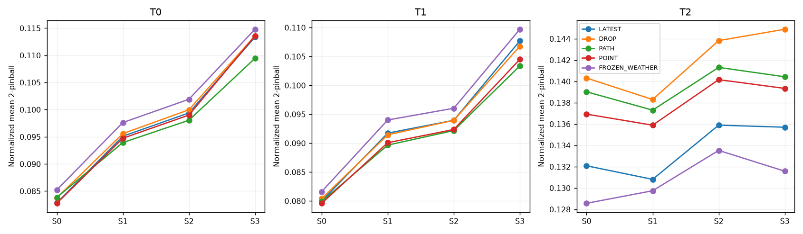
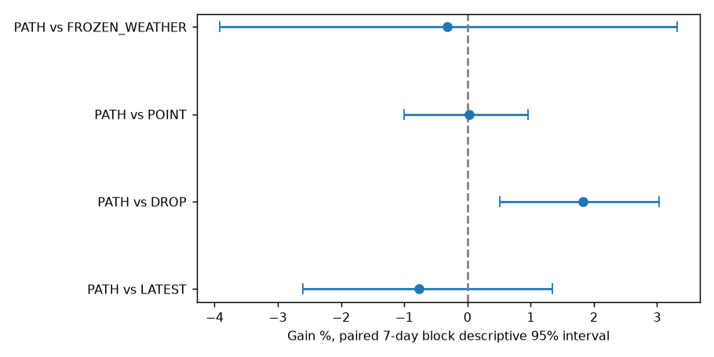
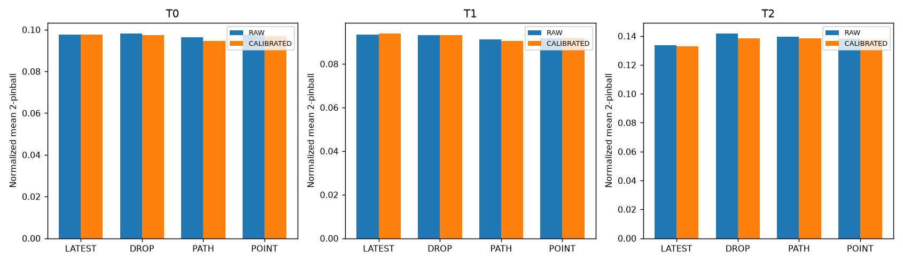

# 예보 입력의 시간적 연결을 보존하는 LoRA — 최종 보고

**실행: EXECUTION_COMPLETE. 최종 추천: 추가 근거 미확보. 신규 PEFT 방법 성립: 부여하지 않음.**

문제는 다음 날 부하를 예측할 때 입력되는 미래 날씨가 정답이 아니라 갱신되는 예보라는 점이다. 기존 한 타깃의 작은 개발 비교에서 과거 버전 증강 신호가 있었지만, epoch 간 순서를 바꾼 대조는 24시간 경로 안의 연결 가치를 검사하지 않았다. 이번에는 추가 타깃 둘, 새 TRAIN64와 뒤 달력 구간, 같은 시점별 예보값 노출을 맞춘 PATH/POINT를 직접 비교했다.

## 정보·분할 계약

OpenSTEF Liander2024 고정 revision의 부하와 versioned forecast만 사용했다. **SIMULATED_ASOF**: 실제 공개시각·물리 예보 issue/run을 복원한 것이 아니다. k는 시점별 가용 버전 순위다. S0도 정답 날씨가 아니며 S1–S3은 미래 날씨 입력만 이전 순위로 바꾼 통제 조건이다. POINT는 시간별로 서로 다른 순위의 값을 연결한 합성 통제 입력이며 배포 후보가 아니다.

TRAIN 3–6월 64원점, V_SELECT 7월 16원점, V_CALIBRATE 8월 16원점, 9월은 이번 실행의 학습·선택·보정·채점에서 제외했다. TEST는 10–12월의 가용 입력과 유효 정답을 갖춘 모든 원점을 공통 사용했다. UTC08시, context336h/horizon24h이며 15분 W 값 네 개의 평균이지 에너지 합계가 아니다. 원점 끝의 24시간이 역할 종료 경계 밖인 날은 경계 규칙으로 제외했다. 결측 보간이나 성능에 따른 날짜 선택은 없었다.

TRAIN 외부 통계는 중복을 제거한 과거 기상 선택 행만, 부하 sigma는 TRAIN 입력·정답의 unique hourly timestamps만 사용했다. 모델 부하 입력의 native normalization은 유지했다. TEST 값은 선택·보정에 사용하지 않았고 모든 예측 해시 후 scorer가 정답을 추출했다. [노출 이력](exposure_ledger.md), [데이터 수령](data_receipt.json), [원점 manifest](origin_manifest.csv), [as-of 선택 행](selected_weather_rows.json).

| 타깃 | 이름 | TRAIN/V/CAL | 유효 TEST | TRAIN sigma |
|---|---|---:|---:|---:|
| T0 | OS Gorredijk | 64/16/16 | 75 | 431137 |
| T1 | SS Ureterp | 64/16/16 | 75 | 570114 |
| T2 | OS Waarderpolder | 64/16/16 | 75 | 270599 |

추가 타깃은 NFC(group,name)의 SHA256 순서로 TRAIN 조건을 만족한 첫 두 개다. 같은 배전망의 세 타깃이며 독립 도메인 세 개가 아니다. T0의 과거 개발 노출과 이번 후속 시간 구간을 구별하고 Chronos-2 사전학습 corpus 중복 부재는 입증하지 못했다. [선정 순서](candidate_order.json), [선정 결과](target_manifest.csv).

## 실제 실행과 검증

최대 48 경로 중 **48 fits ×512 updates=24,576**를 완료했다. 기존 학습 경로 재사용 0, smoke 24 updates, 별도 resource optimizer0, 총 신규 optimizer 24,600 updates다. 세 타깃×네 군×두 LR×두 seed를 전부 실행했으며 불리한 결과로 중단하거나 교체한 경로는 없다. 미실행 범위: 추가 타깃·추가 seed·다른 구조·후속 학습은 계약 밖이므로 실행하지 않았다.

공통 Chronos-2 고정 revision, 96 projection rank1/alpha2 LoRA 147,456개 파라미터(192텐서), FP32·TF32 off·dropout0·native quantile loss다. 모든 군은 같은 초기값·원점 순서·정답 노출8회와 같은 두 LR을 받았다. 체크포인트는 0/256/512만 선택하고 LR는 타깃/군별 두 seed 검증 최소값 평균으로 고정했다. 선택에서 INIT가 이겼다면 무적응 선택 결과로 그대로 남겼다.

독립 scalar 검산 151,200개, V checkpoint 144개, 선택 24개, 보정 scalar 630개를 고정 rtol/atol1e-10으로 통과했다. 기존 파일 2,451개 hash를 보존했다. 모든 frozen 가중치·buffer 불변, 실제 LoRA update 및 fresh-model 복원을 검사했다. [검산 원기록](independent_verification.json), [smoke](smoke.json), [복원](replay.json), [학습 경로](fit_manifest.csv), [선택 봉인](selection_seal.json), [평가 봉인](evaluation_seal.json).

GPU controller 벽시계 61.77분(안전 대기 30.27초 포함), 실제 optimizer 합계 44.23분. 최저 GPU 여유 8048MiB. 승인된 RustDesk를 제외한 외부 compute 표본 0개, 업데이트 오염 0개. GUI 부하는 제거하지 않았으므로 시간 측정은 이 호스트 조건의 값이다. 네 입력 상태의 평가 호출을 단일 배포 추론의 4배 ensemble로 해석하지 않는다.

| 군 | 512-step optimizer 평균초 | peak allocated 최대 MiB |
|---|---:|---:|
| LATEST | 55.228 | 589.29 |
| DROP | 55.247 | 589.29 |
| PATH | 55.157 | 589.29 |
| POINT | 55.496 | 589.29 |

선택된 step512 경로는 13/24로 BUDGET_LIMITED 가능성을 명시한다. 유한 예산에서의 비교이며 충분한 수렴이나 더 오래 학습해도 개선 불가능함을 입증하지 않는다. [자원](resource_usage.csv), [학습 곡선](train_curves.csv).

## 원점수: 네 입력 상태 동일가중 primary

각 원점의 21분위수×24시간 mean 2-pinball을 TRAIN sigma로 나눈 뒤 날짜→seed→타깃 동일가중으로 집계했다. 아래는 seed 평균이며 작은 값이 좋다. raw가 기본 primary이고 동일 보정 후 결과도 반드시 함께 남긴다. raw RMSE/MAE, 80%포함률·폭, 각 입력 상태와 각 seed 원점수는 링크 표에 모두 있다. 규모가 다른 타깃의 raw 오차를 그대로 합치지 않는다.

| 타깃 | 군 | raw | 동일 보정 | FIXED512 raw |
|---|---|---:|---:|---:|
| T0 | LATEST | 0.097668 | 0.097522 | 0.097302 |
| T0 | DROP | 0.098228 | 0.097450 | 0.098228 |
| T0 | PATH | 0.096320 | 0.094535 | 0.096320 |
| T0 | POINT | 0.097514 | 0.096730 | 0.098749 |
| T0 | FROZEN_WEATHER | 0.099891 | 0.101110 | — |
| T0 | FROZEN_HISTORY | 0.122169 | 0.122377 | — |
| T1 | LATEST | 0.093352 | 0.094030 | 0.092888 |
| T1 | DROP | 0.093147 | 0.093224 | 0.093147 |
| T1 | PATH | 0.091284 | 0.090567 | 0.091284 |
| T1 | POINT | 0.091636 | 0.091912 | 0.091636 |
| T1 | FROZEN_WEATHER | 0.095344 | 0.097090 | — |
| T1 | FROZEN_HISTORY | 0.116659 | 0.116519 | — |
| T2 | LATEST | 0.133624 | 0.132753 | 0.137595 |
| T2 | DROP | 0.141835 | 0.138427 | 0.141835 |
| T2 | PATH | 0.139521 | 0.138545 | 0.143766 |
| T2 | POINT | 0.138084 | 0.137182 | 0.140110 |
| T2 | FROZEN_WEATHER | 0.130854 | 0.136303 | — |
| T2 | FROZEN_HISTORY | 0.144764 | 0.145274 | — |

[타깃·seed·case 전체 원점수](scores_by_target_seed_case.csv), [raw/동일 보정](raw_and_calibrated.csv), [원점별](scores_by_origin.csv), [월별](monthly_scores.csv), [lead별](per_lead_hour.csv), [LAST_DAY 점예측](last_day_scores.csv). FROZEN_HISTORY는 부하만 받는 참고선이고 1변수 대4변수 forward 차이를 새 구조 이득으로 부르지 않는다.

## 경로 연결, dropout, 보정의 추가 가치

실제 TRAIN 타깃·seed·origin·4epoch 블록 768개에서 PATH/POINT multiset exact 검사를 통과했고, 그 중 768개는 입력 배열이 달랐다. 각 시간의 세 기상변수는 같은 rank에서 가져왔다. 한 경로 안의 시간 연결을 바꾸면서 연속성·국소 smoothness·비현실성도 함께 바뀌므로 한 가지 물리 인과원인을 증명하지 않는다. [개입 강도](train_intervention.csv), [CPU 검사](cpu_checks.json), [증강 봉인](augmentation_schedule.json).

개선율=100×(대조 점수−PATH 점수)/대조 점수다. 기술적95%구간은 같은 7일 날짜 블록을 군·seed·case·동시기 타깃에 공통 적용한 2,000회 bootstrap이다. 관측한 세 타깃·두 seed에 조건부이며 모집단 불확실성·다중검정 보정이 아니다.

| 정책 | 보정 | 대조 | PATH 개선율% | 95% 기술적 구간 |
|---|---|---|---:|---:|
| SELECTED | RAW | LATEST | -0.764 | [-2.600, +1.344] |
| SELECTED | RAW | DROP | +1.826 | [+0.508, +3.034] |
| SELECTED | RAW | POINT | +0.033 | [-1.001, +0.955] |
| SELECTED | RAW | FROZEN_WEATHER | -0.318 | [-3.921, +3.321] |
| SELECTED | CALIBRATED | LATEST | +0.203 | [-1.630, +2.278] |
| SELECTED | CALIBRATED | DROP | +1.657 | [+0.206, +2.934] |
| SELECTED | CALIBRATED | POINT | +0.668 | [-0.111, +1.463] |
| SELECTED | CALIBRATED | FROZEN_WEATHER | +3.246 | [-0.309, +6.930] |
| FIXED512 | RAW | LATEST | -1.094 | [-3.415, +1.700] |
| FIXED512 | RAW | DROP | +0.552 | [-0.595, +2.003] |
| FIXED512 | RAW | POINT | -0.265 | [-1.560, +0.987] |
| FIXED512 | RAW | FROZEN_WEATHER | -1.619 | [-6.255, +2.852] |

PATH 대 LATEST는 과거 버전 정보와 다양화가 함께 바뀐다. PATH 대 POINT만 시점별 정보 노출을 맞춘 연결 대조다. PATH 대 DROP은 같은 정보량 대조가 아니라 알려진 단순 학습 규칙과의 실용 비교다. 21상수 보정은 모든 선택 모델에 똑같이 주었으며 case·시간별 보정기나 CAL 기반 checkpoint 선택은 없었다. FIXED512는 고정 예산 진단이지 사후 주 정책 교체가 아니다.

## 불리한 타깃·seed·입력 상태 포함

| 타깃 | seed | PATH 대 POINT 평균 개선% | PATH 대 DROP 평균 개선% | PATH 대 LATEST S0 개선% | PATH 대 LATEST S3 개선% |
|---|---:|---:|---:|---:|---:|
| T0 | 61730 | +0.439 | +1.840 | -0.721 | +3.296 |
| T0 | 61731 | +1.996 | +2.045 | -1.745 | +3.585 |
| T1 | 61730 | +0.392 | +1.743 | +0.006 | +3.918 |
| T1 | 61731 | +0.374 | +2.255 | +0.235 | +4.116 |
| T2 | 61730 | -0.956 | +0.190 | -5.282 | -3.686 |
| T2 | 61731 | -1.123 | +3.013 | -5.230 | -3.290 |

최신/이전 상태의 손익은 위 표와 전체 S0–S3 표로 분리했다. worst-scenario는 타깃별 case 평균 중 최대이며 per-origin maximum이 아니다. 모든 타깃과 추가 타깃 둘만의 구간도 [전체 대비](contrasts.csv)에 남겼다. [seed별 모든 효과](contrasts_by_seed.csv), [불확실성](uncertainty.csv).

## 신규성과 최종 해석

PATH는 알려진 예보 버전 증강 학습 규칙이고 POINT는 정보 통제다. LoRA나 공변량 주입 자체도 새 제안이 아니다. 좋은 결과가 나와도 이 실행에서는 NEW_PEFT_METHOD_ESTABLISHED를 부여하지 않는다. 이번 계약의 차이는 시점별 값 노출을 맞춘 24시간 연결 검사이며, 새 신경망 모듈의 필요성·효율성까지 입증하지 않는다. 실제 발행 로그·독립 도메인·사전학습 비중복을 확보하지 못했다. [정확히 읽은 선행 범위](literature_boundary.md).

최종 추천은 **추가 근거 미확보** 하나다. raw와 동일보정에서 PATH 대 POINT/DROP의 방향·불확실성을 함께 보며, 평균이 양수라는 이유만으로 성공을 강제하지 않는다. 구간이 0을 포함하는 경우 동등성이나 효과 부재가 입증됐다고도 쓰지 않는다. [FINAL_DECISION.md](FINAL_DECISION.md).

코드·작은 원점수·검증 manifest는 GitHub에 보존한다. 원자료·가중치·원시 예측·augmentation npz는 ignored 로컬 cache이며 GitHub만으로 수치 재현에 필요한 모든 파일이 포함된다고 주장하지 않는다. 새 구조·다른 데이터셋·추가 학습은 자동 실행하지 않는다.

## 최종 대조 해석과 완료 감사

**이번 결과는 모든 방법의 실패가 아니다. PATH의 DROP 대비 이득은 관측됐지만, 핵심인 시간 연결의 추가 가치는 타깃 전반에서 확보되지 않았다.**

PATH 대 DROP의 raw 평균 이득은1.826%(기술적95%구간0.508~3.034), 동일 보정 뒤1.657%(0.206~2.934)다. 반면 동일 시점별 값 노출을 맞춘 POINT 대비 raw 이득은0.033%(−1.001~0.955), 보정 뒤0.668%(−0.111~1.463)로 불확실하다. 보정 후 이득이 사라진 사례라고 설명할 수는 없으며, 이번에는 보정이 상대 차이를 키웠지만 전체 근거가 충분해지지 않았다.

T0와T1은 PATH가 POINT보다 좋았고, 보정 뒤 두 타깃의 기술적 구간도 양수였다. T2는 두 seed 모두 방향이 반대였다. 따라서 T2를 제외하거나 T0/T1만 사후 주 결과로 삼지 않는다. 추가 타깃 둘만 모으면 raw −0.472%, 보정 뒤 −0.008%다. 이 반전을 설명하는 원인은 이번 실험으로 확정하지 못했다.

| 범위 | PATH 대 POINT raw 개선% [95%] | 동일 보정 개선% [95%] |
|---|---:|---:|
| T0 | +1.224 [-0.876, +2.976] | +2.269 [+0.751, +3.686] |
| T1 | +0.383 [-0.192, +0.949] | +1.463 [+0.901, +2.103] |
| T2 | -1.040 [-2.143, -0.048] | -0.993 [-2.153, +0.080] |
| ADDITIONAL | -0.472 [-1.344, +0.303] | -0.008 [-0.797, +0.718] |
| ALL | +0.033 [-1.001, +0.955] | +0.668 [-0.111, +1.463] |

T0에서 PATH는 LATEST보다 최신S0에 두 seed 모두 불리했고 이전S3에는 두 seed 모두 유리했다. T1의 LATEST 대비 이득은 주로 이전 입력에서 커졌고, T2는 최신·이전 양쪽에서 악화했다. 네 case 평균이 모든 입력 상태의 개선을 뜻하지 않는다. T2의 동결 모델이 적응 모델들보다 좋았다는 사실도 포함해 전부 보존한다.

FIXED512는 **선택된 LR를 그대로 두고 step512만 고정한 대조**다. 이 경우 PATH 대 POINT는 −0.265%(−1.560~0.987)로 역시 추가 가치를 뒷받침하지 못했다. 두 seed를 LR 선택에도 사용했으므로 새로운 tuning-free seed의 독립 반복이라고 부르지 않는다. 실제 선택은256-step11개/512-step13개이며 INIT 선택0개다.

네 군은 동일 LoRA 구조와 같은 수의 학습 파라미터를 사용했다. 최대 allocated memory는 모두589.29MiB였고 512-step optimizer 평균시간은 약55초였다. 이번에 PATH만의 자원 절감은 관측되지 않았다. 시간 연결의 비교를 새 LoRA 행렬 구조나 메모리 혁신으로 해석하지 않는다.

## 월별 차이와 불확실성

아래는 전체 세 타깃에서 PATH 대 POINT의 월별 결과다. 기존2,000개의 공통 달력 resample을 그대로 재사용하고 각 월만 집계했다. 어떤 resample이 해당 월의 유효 날짜를 한 개도 포함하지 않으면 월별 통계는 정의되지 않는다. 그 개수를 명시했으며 관측 날짜·불리한 타깃·seed를 제거한 것이 아니다. 주 대비의2,000회 구간은 변경하지 않았다.

| 월 | 원점/타깃 | raw 개선% [95%] | 동일 보정 개선% [95%] | 정의된 월별 resample |
|---|---:|---:|---:|---:|
| 10 | 25 | +0.624 [-0.779, +1.673] | +0.784 [-0.459, +1.959] | 1986/2000 |
| 11 | 21 | +0.120 [-3.296, +2.171] | +1.119 [-1.330, +3.197] | 1980/2000 |
| 12 | 29 | -0.693 [-2.014, +0.500] | +0.167 [-1.033, +1.335] | 1995/2000 |

[월별 타깃·입력 상태별 전체 대비](monthly_contrasts.csv), [월별 불확실성 정의](monthly_uncertainty_manifest.json). 12월 raw에서는 방향이 반대였으며, 모든 월의 전체 타깃 구간이0을 포함했다. 월별 가장 좋은 값으로 주 결과를 교체하지 않았다.

## 검증 범위·오류 이력·재현

완전한 Adam/RNG/stream 포함 재개 상태48개와 최종 checkpoint의 파라미터가 모두 exact 일치했다. TRAIN 통계의 실제 dtype 계산도 독립 재현했고 전체 대비630개의 집계 개선율 오차는 최대4.97e-14%p였다. smoke 복원12개와 선택 모델 복원24개 모두 bitwise 일치했다. [완료 감사](completion_audit.json).

각 타깃의 입력76개에서2024-10-26 정답 결측1개를 모든 군·case에 공통 제외해75개를 채점했다. [정답 결측 manifest](test_label_manifest.json), [달력 경계 제외](calendar_boundary_exclusions.csv), [구체적 데이터 정의](data_implementation_notes.md). 원자료의 과거 접근을 포함한 노출 이력은 exposure_ledger에 구분했다. T0는 이미 개발에 사용한 대상의 후속 시간 구간 반복이며, T1/T2도 같은 데이터셋의 타깃이다. 자료 자체가 새 독립 데이터이거나 사전학습 비중복임을 주장하지 않는다.

원시 phase counter는 일부 smoke 추론33회를 train 태그로 분류했다. 실제 호출 구성은 본학습24,576+smoke학습24+저장예측19,892+검증72=44,564 native forwards다. 24,600개의 optimizer update와 혼동하지 않는다. 추가 감사의 float32/float64 가정 오류, 미사용 재개 경계 보완 및 실행 소스 commit은 [감사·유지보수 기록](AUDIT_CORRECTIONS.md)에 모두 남겼다. 허용오차·데이터·학습률·평가 기준은 변경하지 않았고 새 학습을 실행하지 않았다.

최종 추천은 **추가 근거 미확보** 하나다. PATH/DROP의 실용 대조 신호와 특정 타깃의 양성 결과는 보존하지만, 이를 근거로 시간 연결 특화 PEFT 구조를 바로 추가할 만큼 일관된 근거는 얻지 못했다. 새 구조·다른 데이터셋·후속 학습은 시작하지 않는다.
