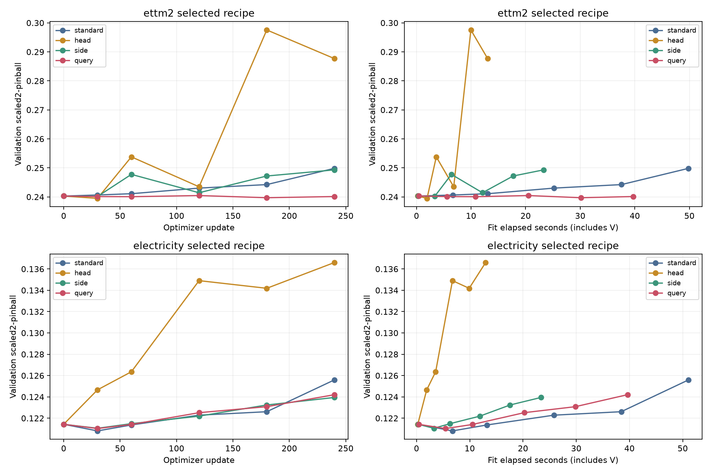
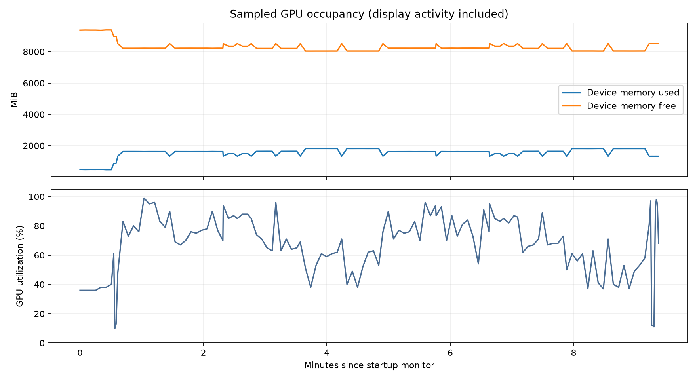

# Frozen past / forecast-token adaptation pilot: FAIL

Completed **16/16 actual learning fits**,3,840 optimizer updates, plus8 discarded diagnostic updates. Two datasets × four arms × two fixed arm-appropriate learning rates × first seed30000. This is chronological development forecasting evidence, not a fixed-state gradient screen and not an independent holdout.

## Selected development results

Primary is raw-scale equal-channel scaled2-pinball (lower is better), matching the historical scoring convention. Native asinh-space loss is also reported. Choices use11 validation origins, six checkpoints and two recipes per arm; all8 choices were sealed before evaluation arrays were loaded. Evaluation uses16 origins per dataset.

| Dataset | Arm | Recipe / step | Primary loss | Native loss | Train-step peak MiB | Median step ms | Whole fit seconds |
|---|---|---|---:|---:|---:|---:|---:|
| ettm2 | F0 | no fit | 0.18401729 | 2.79479963 | — | — | — |
| ettm2 | standard | R0 / 0 | 0.18401729 | 2.79479963 | 770.9 | 194.13 | 49.86 |
| ettm2 | head | R0 / 30 | 0.18898424 | 2.86161882 | 649.5 | 45.10 | 13.05 |
| ettm2 | side | R0 / 30 | 0.18490303 | 2.80069855 | 796.4 | 86.47 | 23.30 |
| ettm2 | query | R0 / 180 | 0.18306271 | 2.78211737 | 987.7 | 149.50 | 39.70 |
| electricity | F0 | no fit | 0.09946142 | 3.27118641 | — | — | — |
| electricity | standard | R0 / 30 | 0.09893513 | 3.26862571 | 770.9 | 199.35 | 51.11 |
| electricity | head | R0 / 0 | 0.09946142 | 3.27118641 | 649.5 | 45.34 | 12.99 |
| electricity | side | R0 / 30 | 0.09920106 | 3.27482188 | 796.4 | 87.14 | 23.37 |
| electricity | query | R0 / 30 | 0.09925743 | 3.27372313 | 987.7 | 149.45 | 39.64 |

## Fixed decision

| Dataset | Query loss / standard | Query loss / best head-or-side | Query loss / F0 | Query peak reduction | Selected step | Gate |
|---|---:|---:|---:|---:|---:|---|
| ettm2 | 0.99481 | 0.99005 | 0.99481 | -28.13% | 180 | FAIL |
| electricity | 1.00326 | 1.00057 | 0.99795 | -28.13% | 30 | FAIL |

Gate fixed before runs: on both datasets query must select a nonzero step and beat F0, remain within1% of Standard LoRA loss, reduce actual training-step peak by20%, and beat the best head/side loss by0.5%. An initial checkpoint alone cannot establish adaptation value. No recipe/threshold changed after validation or evaluation. The first-seed16-fit budget is complete; no new seed, architecture expansion, or fixed-memory batch experiment was launched in this run.

## Implementation and fairness

All arms train exactly1,179,648 parameters and use the same frozen native quantile decoder, BF16 autocast, FP32 parameters/AdamW moments, batch8 (two windows × four channels), context4096, horizon48. Standard uses all-token rank8 LoRA and exact non-reentrant checkpointing. Query uses the same96 attention LoRA projections only on REG+3 forecast tokens. A fresh full frozen bidirectional no_grad F0 pass supplies history K/V at every layer, preserving original RoPE positions, key-validity and group masks. Only4 tokens enter the trainable native attention/group/MLP branch. This is a restricted adaptation model after updates, not equivalent to ordinary all-token LoRA or a causal prefix cache. The candidate branch itself was not checkpointed in this fixed implementation. Frozen history K/V still occupy memory, and concatenated attention K/V plus backward temporaries are counted. No separate operator-level inventory was run here, so the peak increase is measured but its per-operator attribution is not established.

Head is a768→768→768 residual SiLU head before the native decoder. Side is an explicitly adapted LST-style12-layer,64-wide time/group side network reading full frozen per-layer representations; its learned lateral projections retain those features and their memory is counted. Zero output matrices start the controls at F0. Both side and query are prior-based candidates, not established novel contributions. The full frozen pass, cache construction, train branch, clipping and actual optimizer.step are included in step peaks/times. Validation and checkpoint copying are included in whole-fit wall time. No cache persists across input windows.

FP32 initialization parity, BF16 tolerance, nonzero update/effect, group isolation, missing-key handling and query-only MLP graph were tested on Chronos itself. BF16 query initialization need not be bit-identical to F0 because GEMM/attention shapes differ; the measured discrepancy is in `smoke.json`. No claim of exact BF16 gradients or identical trajectories is made. Training loss uses native probabilistic quantiles; sorted quantiles are used consistently for raw-scale scoring. Native loss is recorded from the model;106 saved raw prediction arrays independently replay the raw-scale metrics.

## GPU occupancy and resource limits

Monitoring recorded127 samples. During active work, minimum observed free VRAM was8034MiB; maximum observed device memory used was1819MiB. External-compute samples:0; paused samples:0. Sampled device occupancy is distinct from per-step CUDA allocator peaks; brief transients can occur between monitor samples.

Startup initially waited on a<=20% utilization threshold. Before any model run, pmon identified graphics-only use from Code/Chrome/Xorg/GNOME with around9.1GiB free and no compute PID. The waiting worker alone was interrupted; the startup rule was revised to30seconds without external compute, free>=4GiB and utilization<90%. The original wait is preserved in `results/forecast_query_startup_wait/`. No external job was stopped. During the pilot, monitor at step boundaries at least every5seconds and pause on another compute PID or free<1GiB. Desktop graphics remained active, so timing is a monitored shared-display measurement, not an isolated-GPU benchmark.

Worker wall time excluding initial startup wait:532.18s. Total fit wall time:507.07s. All240 step resources per fit, validation time and GPU timeline are committed. Curves show fixed-update and observed fixed-wall-clock progress at the same batch; no throughput claim from larger batches is made.

## Provenance and limits

Execution commit:`809060d70f014acfa56191d01b1ce5c902f24cb0`. Source/config/data/checkpoint hashes and selection seal are verified. All prior seven-candidate, recovery, Freshness v2, global memory and local backward results remain unchanged. Historical totals plus this pilot:62 completed fits and9 stream attempts (8 complete,1 historical abort). The8 new smoke updates are separate from the3,840 pilot updates. One seed, four channels, a short development training period and previously exposed evaluation periods limit generalization.

Prior boundaries: [LST](https://papers.neurips.cc/paper_files/paper/2022/hash/54801e196796134a2b0ae5e8adef502f-Abstract-Conference.html), [Activated LoRA](https://papers.neurips.cc/paper_files/paper/2025/hash/4d0b6303d4a4811445f69f357bf6def5-Abstract-Conference.html), [EfficientFSL](https://arxiv.org/abs/2601.08499), [TS-Memory](https://arxiv.org/html/2602.11550v1).

Replay with `scripts/with_cuda.sh .venv/bin/python scripts/finalize_forecast_query_pilot.py --verify-only`. Local ignored checkpoints/prediction arrays are required; model weights/raw data are not committed.

