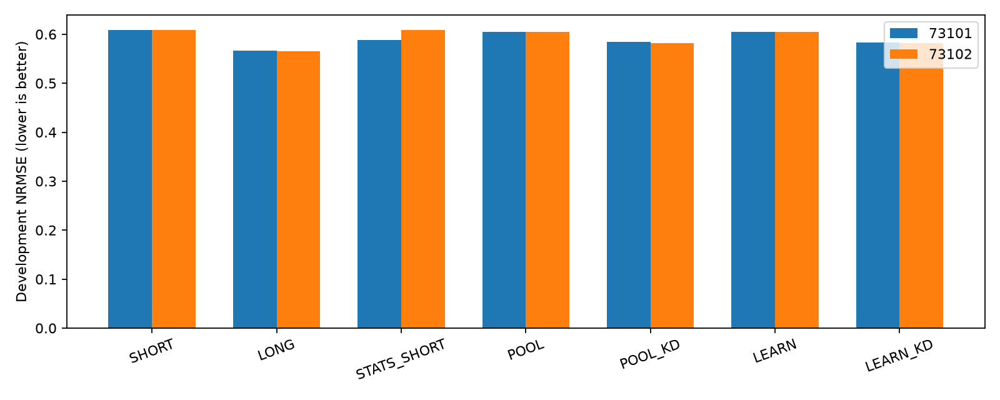
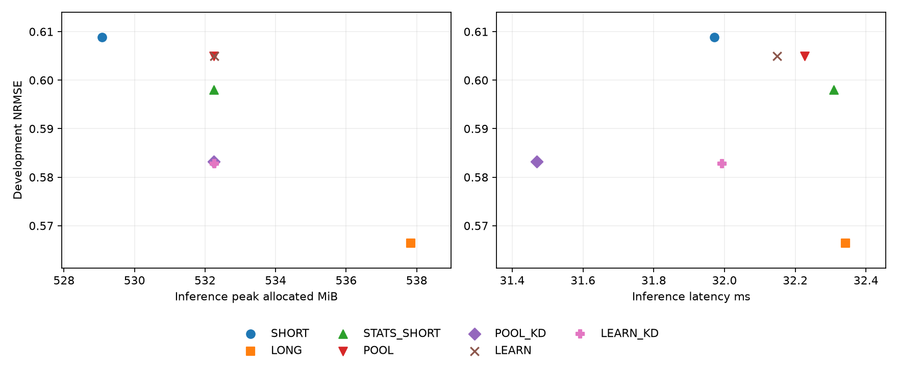

# 긴 이력의 예측 정보를 보존하는 압축 PEFT — 최종 보고서

**신규 20/20개 학습 경로와 평가·독립 검산을 완료했다. 제안 구성요소의 추가 가치를 확정할 근거는 확보하지 못했다.** 기존 SHORT/LONG 8개 경로는 검증 후 재사용했고 중복 학습하지 않았다. 이 결과는 Traffic 4채널의 재사용 개발 평가이며, 독립 test나 논문 성공 판정이 아니다.

[봉인 계획](PROTOCOL.md) · [정확한 조건과 예산](PROTOCOL.json) · [재사용 감사](REUSE_RECEIPT.json) · [최종 결정](FINAL_DECISION.md).

## 연구 질문과 고정한 비교

긴 이력 모델의 개선이 관측된 조건에서, 오래된 이력을 압축하면서 예측 정보를 보존할 수 있는지 비교했다. 입력 1,344시간의 native patch 84개 중 최근 336시간의 21개는 그대로 두고, 오래된 63개를 인접 3개씩 묶어 21개로 요약했다. encoder 문맥은 84→42개, REG와 미래 토큰을 포함하면 88→46개다. 압축을 원시 시계열의 등간격 리샘플링으로 취급하지 않았다. native 시간 feature를 포함한 embedding을 풀링하고, 원래 패치 위치의 평균을 위치 인자로 전달했다.

POOL은 같은 세 패치의 균등 평균이다. LEARN은 채널·구간에 공유하는 rank 8 점수 함수로 세 패치 안에서 convex 가중치를 학습한다. 추가 파라미터는 6,152개이고 초기에는 POOL과 같다. 모두 같은 native LoRA 1,179,648개 파라미터를 학습하며 본체와 출력 head는 동결한다. 새로운 학습군 STATS_SHORT는 전체 이력의 native 정규화만 계산하고 최근 21개 토큰만 encoder에 전달한다. 따라서 오래된 이력의 평균·표준편차 정보가 압축의 효과를 설명하는지도 확인한다.

POOL_KD와 LEARN_KD는 정답의 TRAIN 표준편차 정규화 MSE에 같은 교사 예측 MSE의 0.25배를 더한다. 교사는 기존 LONG의 선택 seed 73100, 기존 V에서 선택한 체크포인트로 고정했다. 학생도 같은 과거 1,344시점을 관측하며, 없는 입력을 교사로 복원한다고 가정하지 않았다. 교사는 같은 TRAIN 정답으로 학습됐고 TRAIN 예측만 생성했다. 교사 선택에 기존 V가 쓰였다는 점과 추가 학습 비용을 공개한다.

## 원점수와 추론 자원

NRMSE는 채널별 RMSE를 TRAIN 표준편차로 나눈 후 평균한 값이며 낮을수록 좋다. 아래는 두 반복 seed의 선택된 모델 평균이다.

| 군 | NRMSE ↓ | 추론 peak MiB | 원점당 추론 ms |
| --- | --- | --- | --- |
| SHORT | 0.608899 | 529.08 | 31.97 |
| LONG | 0.566402 | 537.83 | 32.34 |
| STATS_SHORT | 0.598025 | 532.24 | 32.31 |
| POOL | 0.604941 | 532.24 | 32.23 |
| POOL_KD | 0.583192 | 532.24 | 31.47 |
| LEARN | 0.604941 | 532.27 | 32.15 |
| LEARN_KD | 0.582783 | 532.27 | 31.99 |

추론 자원은 모든 14개 반복 모델을 새로 불러온 뒤 같은 V의 4개 원점에서 측정했다. 모델별 2회 warmup 후 12회 실행의 latency 중앙값을 구하고 두 seed를 평균했다. native 전처리·압축·정규화·출력 복원이 포함된다. peak는 PyTorch allocated 값이며 장치 전체 메모리가 아니다. 파일 I/O, 모델 적재, 교사 학습은 별도다. 측정 순서와 허용된 RustDesk의 영향 때문에 작은 시간 차이를 엄밀한 속도 우위로 확대하지 않는다.

## seed별 결과와 선택 효과

| 군 | seed | V 선택 step | 선택된 E NRMSE | 고정 512 E NRMSE |
| --- | --- | --- | --- | --- |
| SHORT | 73101 | 0 | 0.608899 | 0.609772 |
| SHORT | 73102 | 0 | 0.608899 | 0.603361 |
| LONG | 73101 | 256 | 0.567034 | 0.570859 |
| LONG | 73102 | 256 | 0.565770 | 0.572150 |
| STATS_SHORT | 73101 | 256 | 0.587795 | 0.594842 |
| STATS_SHORT | 73102 | 0 | 0.608254 | 0.602145 |
| POOL | 73101 | 0 | 0.604941 | 0.586501 |
| POOL | 73102 | 0 | 0.604941 | 0.592859 |
| POOL_KD | 73101 | 256 | 0.584559 | 0.583448 |
| POOL_KD | 73102 | 256 | 0.581825 | 0.589907 |
| LEARN | 73101 | 0 | 0.604941 | 0.598438 |
| LEARN | 73102 | 0 | 0.604941 | 0.590079 |
| LEARN_KD | 73101 | 256 | 0.583791 | 0.584941 |
| LEARN_KD | 73102 | 256 | 0.581776 | 0.587879 |

각 군의 학습률은 선택 seed 73100의 두 LR 중 V로 골라 고정했다. 반복 seed 73101/73102에서는 그 LR만 실행하고 0/256/512 중 V로 체크포인트를 선택했다. 모든 선택을 봉인한 뒤 E를 채점했으며 출력 보정은 없다. 고정 512점수도 모두 공개했다. 선택 결과와 마지막 가중치의 차이는 선택 정책의 기술적 비교이며, 새 독립 데이터에서의 인과 효과로 해석하지 않는다. [모든 지표와 원점수](scores.csv), [원점·채널별 오차](scores_by_origin.csv), [선택 봉인](EVALUATION_SEAL.json).

## 구성요소의 추가 가치

양의 gain은 왼쪽 군의 오차가 낮다는 뜻이다. 같은 날짜 원점을 168시간 index block으로 2,000회 재표집했고, 각 반복 안에서 seed별 NRMSE를 구한 뒤 평균했다. 95% 구간은 시간 표본 불확실성의 개발 추정이며, 두 seed만으로 seed 모집단 불확실성을 충분히 추정한 것이 아니다.

| 직접 비교 | gain % | 95% 구간 | 개발 판정 |
| --- | --- | --- | --- |
| LEARN_KD / POOL_KD | +0.0701 | [-0.0351, +0.1771] | POSITIVE_UNCERTAIN |
| LEARN_KD / LEARN | +3.6627 | [+1.1797, +5.8485] | POSITIVE_DEVELOPMENT_SIGNAL |
| LEARN / POOL | +0.0000 | [+0.0000, +0.0000] | IDENTICAL_SELECTED_OUTPUTS |
| POOL_KD / POOL | +3.5952 | [+1.0689, +5.8521] | POSITIVE_DEVELOPMENT_SIGNAL |
| LEARN_KD / LONG | -2.8921 | [-5.5756, -0.1031] | NEGATIVE_DEVELOPMENT_SIGNAL |
| LEARN_KD / STATS_SHORT | +2.5486 | [+0.2651, +4.7699] | POSITIVE_DEVELOPMENT_SIGNAL |
| LEARN_KD / SHORT | +4.2891 | [+1.5176, +6.9579] | POSITIVE_DEVELOPMENT_SIGNAL |
| LONG / SHORT | +6.9794 | [+3.2258, +10.2355] | POSITIVE_DEVELOPMENT_SIGNAL |
| STATS_SHORT / SHORT | +1.7860 | [+0.0391, +3.3079] | POSITIVE_DEVELOPMENT_SIGNAL |
| POOL / STATS_SHORT | -1.1565 | [-2.8609, +0.8301] | NEGATIVE_UNCERTAIN |

- **학습 압축의 가치:** LEARN_KD / POOL_KD는 +0.0701%이고 판정은 POSITIVE_UNCERTAIN이다. 동일 증류 조건에서 압축 가중치를 학습하는 효과다.
- **증류의 가치:** LEARN_KD / LEARN은 +3.6627%이고 판정은 POSITIVE_DEVELOPMENT_SIGNAL이다. POOL_KD / POOL도 공개해 단순 증류 효과를 구분했다.
- **긴 이력 대조와의 절충:** LEARN_KD / LONG은 -2.8921%, 추론 peak 절감 +1.035%, latency 절감 +1.081%다. 사전 정의한 오차 1% 비열등 상한과 자원 10% 절감의 동시 탐색 기준 충족 여부는 **False**다.

구성요소의 탐색 근거는 학습 압축과 증류의 두 직접 비교 모두에서 95% 구간 하한이 0을 넘을 때만 인정하기로 봉인했다. 그 조건의 충족 여부는 **False**다. 한 비교의 양성이나 토큰 수 감소를 다른 조건의 성공으로 바꾸지 않는다. CI에 0이 포함되는 경우를 두 방법의 동등성이 입증됐다고 표현하지 않는다.

## 압축 가중치가 실제로 학습됐는가

GPU smoke에서 LoRA와 새 압축 파라미터가 변했고 본체·buffer는 유지됐다. 실제 본학습의 clipping과 추가 파라미터 gradient를 모두 기록했다. 다음은 선택된 모델이 V 전체에서 사용한 가중치다. 균등 가중치 1/3과의 차이를 측정했으며 E를 보고 가중치나 선택을 수정하지 않았다.

| 군 | seed | 평균 절대 가중치 차이 | 최대 절대 가중치 차이 | 평균 entropy |
| --- | --- | --- | --- | --- |
| LEARN | 73101 | 0.00000000 | 0.00000000 | 1.09861219 |
| LEARN_KD | 73101 | 0.00033510 | 0.00099146 | 1.09861159 |
| LEARN | 73102 | 0.00000000 | 0.00000000 | 1.09861219 |
| LEARN_KD | 73102 | 0.00021950 | 0.00084907 | 1.09861195 |

가중치 변화가 작으면 고정한 계산 예산·초기화·학습률 안에서 작은 변형을 검증한 결과다. 이는 파라미터가 실제 학습되지 않았다는 주장이나, 더 강하게 학습시키면 성공한다는 증거가 아니다. 결과에 맞춘 LR·초기화·업데이트 변경은 하지 않았다. [학습 진단](optimization_diagnostics.csv), [실측 가중치](pooling_behavior.csv).

## 실행 횟수·전체 비용·검산

- 신규 학습: **20/20 fits, 10,240 본업데이트**, 폐기 smoke 10업데이트. 승인한 필수 학습의 미실행은 0개다.
- 기존 결과 재사용: **8 fits, 4,096업데이트**. 이 숫자는 이번에 새로 학습한 횟수에 합치지 않는다.
- 교사: 위 재사용 경로 중 LONG 선택 seed의 두 LR를 사용했다. 해당 교사 선택용 optimizer 시간은 합계 **98.08초**이며, 캐시가 있다는 이유로 방법의 비용에서 지우지 않는다. 이번 추가 교사 학습은 0회, TRAIN 교사 예측 생성은 **2.47초**다.
- 신규 20개 경로의 optimizer 시간 합계 **1141.38초**, 선택 평가를 포함한 경로 시간 합계 **1286.30초**. controller 경과 **23.41분**, GPU 대기 **30.27초**다. [학습 비용 전체 장부](training_resources.csv), [추론 실측](inference_resources.json).
- 실행기의 모델 호출 13,588회와 별도 모델 복원 검산 160회, 총 **13,748회**로 40,000회 상한 안이다. 별도 자원·검산의 optimizer 업데이트는 0회다.

모든 신규 20경로의 정확한 원점 순서, 최종 가중치와 재개 checkpoint의 일치, Adam 512 step을 검산했다. V 60개·E 28개 집계 점수를 독립 float64 scalar 계산으로 확인했고 모든 LR/체크포인트 선택을 재계산했다. 신규 정책 20개를 V에서 복원했으며, 별도 새 모델 검사로 모든 14개 선택 모델의 E 첫·마지막 원점 예측과 교사 TRAIN/V 예측을 bitwise 재현했다. 가중치 동결, native full-token 경로의 동일성, POOL/LEARN 초기 동일성, E 정답 접근 차단과 시간 위치도 확인했다.

과거 결과·연구 **3,221개 파일**은 해시가 보존됐다. GPU의 기존 승인 예외는 RustDesk뿐이며, 비허용 외부 학습 관측과 오염 업데이트는 0이다. 독립 CPU 입력 검산·일반 시스템 작업이 일부 학습과 겹쳤으므로 학습 wall time을 격리된 미세 속도 비교로 해석하지 않는다.

[수치·선택·학습 검산](verification.json) · [입력 검산](independent_input_audit.json) · [새 모델 복원 검산](independent_model_verification.json) · [실제 학습 검사](smoke.json).

## 학습 메모리와 선택 효과의 추가 해석

추론 자원과 별도로 학습 중 peak를 비교하면 다음과 같다. 각 군의 동일한 네 경로를 평균했다. SHORT/LONG은 기존 동일 recipe의 측정값 재사용이고 새 군과 같은 시각에 재측정한 학습 benchmark가 아니다. 따라서 아래 속도 차이를 격리된 시스템 우위로 읽으면 안 된다.

| 군 | 학습 peak MiB | 512 updates optimizer 초 | 측정 |
|---|---:|---:|---|
| SHORT | 604.30 | 48.36 | historical_same_recipe |
| LONG | 783.71 | 48.80 | historical_same_recipe |
| STATS_SHORT | 604.10 | 57.28 | current_run |
| POOL | 662.52 | 56.89 | current_run |
| POOL_KD | 662.52 | 57.02 | current_run |
| LEARN | 664.86 | 57.05 | current_run |
| LEARN_KD | 664.86 | 57.11 | current_run |

LEARN_KD의 학습 peak는 이 기록상 LONG보다 **15.16% 낮다**. 따라서 자원 이점이 전혀 없다는 결론도 맞지 않는다. 다만 주 결과의 정확도 손실 2.89%, 거의 줄지 않은 추론 비용, 별도 시점의 학습 속도 측정이라는 제한을 함께 남긴다. 사전 판정에 사용한 추론 자원·정확도 조건을 이 결과를 보고 학습 메모리 조건으로 바꾸지 않았다.

증류 없는 POOL/LEARN은 두 seed 모두 INIT, 증류군은 256 업데이트가 선택됐다. 따라서 주 비교의 약 3.6% 이득에는 검증 선택의 차이가 함께 반영된다. 처음부터 보존한 보조 정책인 고정 512 결과에서도 다음 직접 비교를 계산했다. **이 표는 실행 후 해석용이며 주 판정을 대체하지 않는다.** 모든 군에 같은 시간 block을 적용했고 추가 학습이나 모델 선택은 없다.

| 고정512 직접 비교 | gain % | 95% 시간 block 구간 |
|---|---:|---|
| LEARN_KD / POOL_KD | +0.0456 | [-0.4208, +0.4490] |
| LEARN_KD / LEARN | +1.3207 | [+0.2086, +2.5685] |
| POOL_KD / POOL | +0.5092 | [-0.6693, +1.6961] |
| LEARN / POOL | -0.7764 | [-1.9912, +0.3268] |

학습 압축의 선택 가중치가 균등 평균에 가깝다는 관찰, 두 핵심 구성요소의 주 비교, 고정512 진단을 모두 보존한다. 작은 변화를 더 크게 만들면 성공할 것이라고 추론하지 않으며 LR·초기화·학습량을 변경하지 않았다. [고정512 진단](fixed512_component_diagnostics.csv), [목적함수·초기화의 정확한 검산](objective_initialization_audit.json).

## 신규성과 일반화의 한계

이 실험은 동결 TSFM에 LoRA와 경량 압축 모듈을 학습하는 PEFT 비교다. 그러나 convex attention pooling과 교사 MSE 자체는 알려진 구성이다. [TS-Memory](https://arxiv.org/abs/2602.11550)는 검색으로 얻은 예측 교정을 경량 어댑터로 증류하고, [TSFM 압축 메모리 연구](https://arxiv.org/abs/2409.13530)는 채널 문맥 확장을 다룬다. 이번 구현과 동일한 문제·수식이라고 단정하지 않지만, 이들을 포함한 정식 선행 비교 없이 풀링과 증류의 조합을 새 알고리즘으로 주장할 수 없다.

한 원천의 기존 4채널, 두 반복 seed, 재사용된 개발 E다. 긴 이력의 이득을 본 뒤 정한 후보여서 선택 편향이 남고, 날짜를 분산했어도 독립 확증이 아니다. 교사는 같은 TRAIN에서 학습한 in-sample 예측을 제공한다. 각 3개 패치 안의 제한된 가중 학습만 평가했으므로 모든 압축 구조의 가능성을 판정하지 않는다. 이 한계를 보완한다는 명목으로 추가 데이터·seed·LR·후속 학습을 자동 실행하지 않았다.

원자료·예측 배열·가중치는 로컬 ignored cache에 보존하며, GitHub에는 코드·원점수·실행 장부·해시·보고서를 남긴다. GitHub 파일만으로 모든 수치를 재생할 수 있다고 주장하지 않는다.
