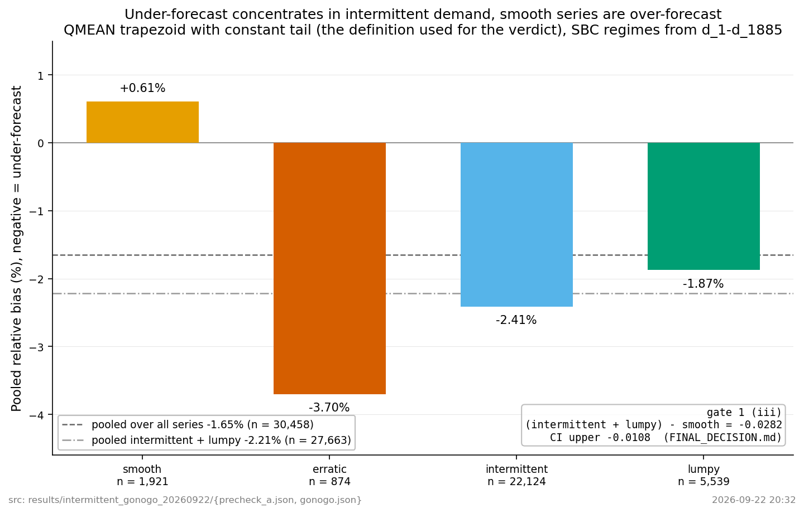
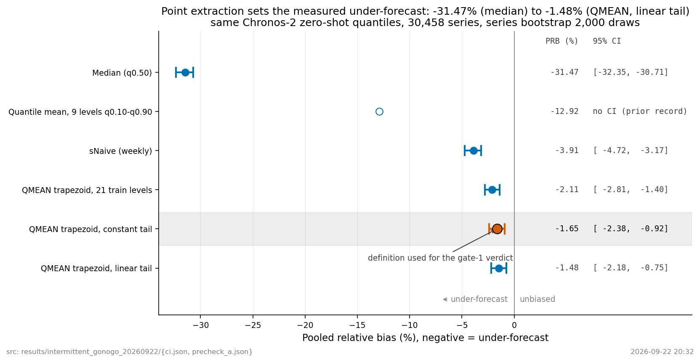
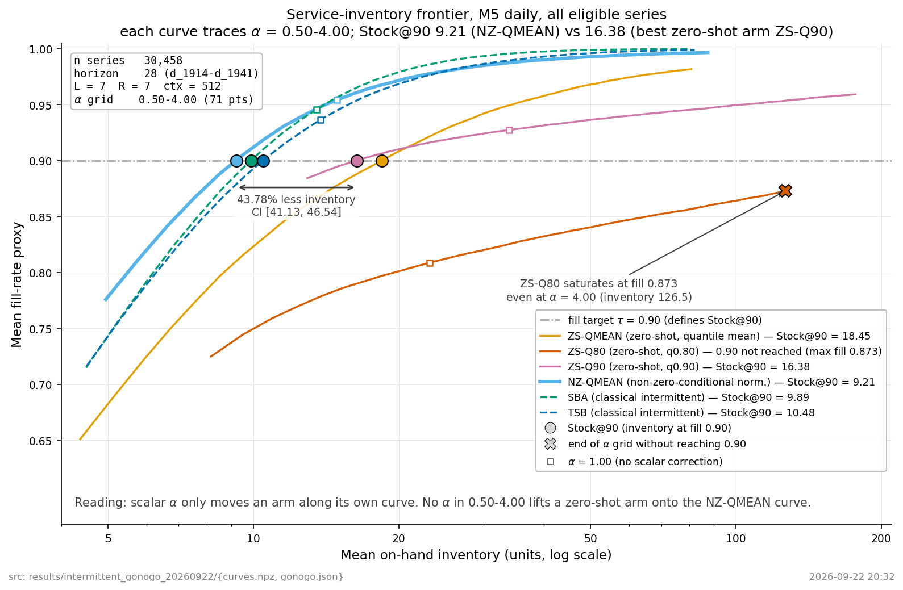
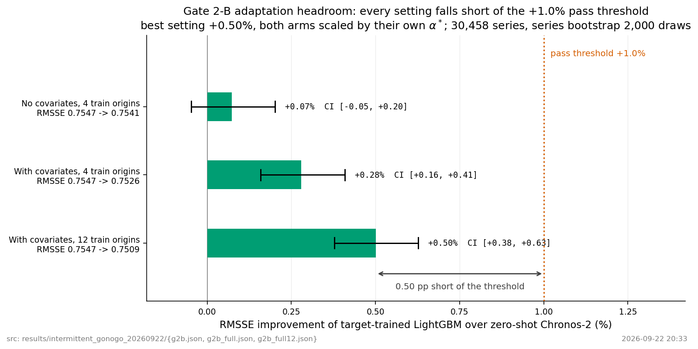

# 간헐 수요 TSFM 과소예측 PEFT — go/no-go 결과

2026-09-22. 실행 계약은 [experiments/intermittent_gonogo_20260922/PROTOCOL.md](../../experiments/intermittent_gonogo_20260922/PROTOCOL.md).

## 판정

```
NO_GO_NO_HEADROOM
```

M5 일 단위에서 과소예측은 실재하고(게이트 1 통과), 비영 조건부 정규화는 스칼라 보정으로 얻을 수
없는 서비스 개선을 준다(게이트 2-A 통과). 그러나 목표 데이터로 학습한 LightGBM이 zero-shot
Chronos-2를 정확도에서 0.50%만 이긴다(게이트 2-B 실패, 기준 1.0%). 전역 모델이 그 정도면 LoRA가
그보다 크게 이길 이유가 없으므로 LoRA 파일럿(게이트 3)은 실행하지 않았다.

이 방향에서 값이 나오는 것은 PEFT가 아니라 학습이 필요 없는 정규화 교체이고, 그것은 이미 선행
논문이 발표한 결과다.

## 관찰

적격 30,458계열 전수, test d_1914–d_1941. 계열 부트스트랩 2,000회, seed 20260922.

### 게이트 1 — 문제 존재

| 조건 | 관찰 | 판정 |
|---|---|---|
| (i) ZS-QMEAN PRB CI 상한 < 0 | PRB −1.65%, CI [−2.38, −0.92] | 통과 |
| (ii) 충족 대리지표가 SBA/TSB보다 낮은가 | 0.8664 vs SBA 0.9456, 차 −0.0792, CI [−0.0820, −0.0766] | 통과 |
| (iii) 간헐 계열에 집중되는가 | (intermittent+lumpy) − smooth = −0.0282, CI 상한 −0.0108 | 통과 |
| 추출 교란 | ZS-MED 상한 < 0 이면서 ZS-QMEAN CI가 0을 포함하지 않음 | 해당 없음 |

intermittent+lumpy −2.21%, smooth +0.61%. 방향이 "0 위주 평균으로 중심화한다"는 메커니즘과 맞는다.



**그림이 담은 것** — SBC 네 유형의 PRB 를 막대로 그렸다. smooth 만 0선 위(+0.61%)이고 나머지 셋은
아래다. 가로 파선이 전체 pooled −1.65%(n=30,458), 일점쇄선이 intermittent+lumpy pooled −2.21%
(n=27,663)를 표시한다.

```
smooth        +0.61%   n = 1,921
erratic       -3.70%   n =   874
intermittent  -2.41%   n = 22,124
lumpy         -1.87%   n = 5,539
```

오른쪽 아래 상자에 게이트 1(iii) 판정이 적혀 있다:
`(intermittent + lumpy) − smooth = −0.0282, CI 상한 −0.0108`.

### 점예측 추출이 과소예측 크기를 8배 바꾼다

| 추출 | sum/true | PRB |
|---|---|---|
| 중앙값 | 0.685 | −31.5% |
| 분위수 0.1–0.9 단순평균 | 0.871 | −12.9% |
| sNaive(주간) | 0.961 | −3.9% |
| QMEAN (13개 사다리꼴 + 꼬리 상수 연장) | 0.984 | **−1.65%** |
| 21개 학습분위수 사다리꼴 | 0.979 | −2.1% |

꼬리 처리 규칙을 상수 연장 / 선형 외삽 / 학습분위수 전체로 바꿔도 PRB는 −1.65% / −1.48% / −2.11%로
민감도가 0.17%p에 그친다. 즉 게이트 1 통과는 추정기 편향의 산물이 아니다.



**그림이 담은 것** — 같은 Chronos-2 zero-shot 분위수에서 점예측 추출만 바꿨을 때의 PRB 를 점과
95% CI 막대로 그렸다. 세로선이 0(무편향)이고 왼쪽이 과소예측이다. 판정에 쓴 정의(상수 꼬리 QMEAN)
행은 회색 띠로 강조하고 화살표로 `definition used for the gate-1 verdict` 라고 붙였다.

```
추출                            PRB(%)      95% CI
Median (q0.50)                  -31.47   [-32.35, -30.71]
Quantile mean, 9 levels         -12.92   no CI (prior record)   <- 속 빈 마커
sNaive (weekly)                  -3.91   [ -4.72,  -3.17]
QMEAN trapezoid, 21 train levels -2.11   [ -2.81,  -1.40]
QMEAN trapezoid, constant tail   -1.65   [ -2.38,  -0.92]   <- 판정 정의
QMEAN trapezoid, linear tail     -1.48   [ -2.18,  -0.75]
```

점이 −31%에서 −1.5%까지 한 축 위에 늘어서 있어, 같은 모델의 편향이 추출 방식만으로 20배 넘게
달라진다는 것이 한눈에 보인다.

주의할 점이 둘 있다. 첫째, 제대로 뽑은 점예측의 과소예측은 −1.65%로 작고 **sNaive(−3.9%)보다
작다** — "TSFM이 특히 과소예측한다"는 서사는 이 데이터에서 약하다. 둘째, 게이트 1은 CI 부호만 보고
효과 크기 하한을 걸지 않아서 "0이 아니다"와 "고칠 가치가 있다"가 구분되지 않는다.

### 게이트 2-A — 단순 보정으로 설명되지 않는다

alpha = 1 기준.

| arm | 충족 대리지표 | 평균 재고 | Stock@90 |
|---|---|---|---|
| ZS-QMEAN | 0.8664 | 13.530 | 18.449 |
| ZS-Q80 | 0.8087 | 23.166 | 미도달 |
| ZS-Q90 | 0.9274 | 33.930 | 16.381 |
| NZ-QMEAN | 0.9543 | 14.907 | **9.209** |
| SBA | 0.9456 | 13.506 | 9.892 |
| TSB | 0.9367 | 13.781 | 10.475 |

```
ZS-best = ZS-Q90 (사후 최강)  Stock@90 16.381  ->  NZ-QMEAN 9.209
재고 개선률 +43.78%   CI [+41.13, +46.54]   기준 3.0%        통과
```

임계값의 14배라 재검산했다. NZ 패치는 실제로 적용됐고(예측 동일 비율 0.046%), alpha 곡선은
70/70 단조이며, Stock@90은 독립 재계산으로 일치했다. 원인은 분산 대비 평균 비율이다.

```
ZS  점예측 평균 1.4133  sigma_hat 평균 1.0769   비율 0.762
NZ  점예측 평균 1.5550  sigma_hat 평균 1.0314   비율 0.663     (실제 일평균 1.4437)
```

스칼라 alpha는 점예측과 분산을 함께 곱하므로 이 비율을 바꿀 수 없다. 비영 조건부 정규화는 비율
자체를 바꾼다. alpha 격자 0.50–4.00을 전부 훑어도 원 정규화가 따라오지 못하는 이유가 이것이다.



**그림이 담은 것** — 가로축이 평균 보유재고(로그 눈금), 세로축이 평균 충족 대리지표다. 각 곡선은 한
arm 을 α 0.50–4.00 으로 움직였을 때의 자취이고, 가로 일점쇄선이 목표 τ=0.90 이다. 그 선과 만나는
지점의 재고가 Stock@90 이며 동그란 마커로 찍혀 있다.

```
arm        Stock@90     α=1 지점(네모 마커)
NZ-QMEAN      9.21      fill 0.954 / inv 14.9
SBA           9.89      fill 0.946 / inv 13.5
TSB          10.48      fill 0.937 / inv 13.8
ZS-Q90       16.38      fill 0.927 / inv 33.9
ZS-QMEAN     18.45      fill 0.866 / inv 13.5
ZS-Q80        미도달    α=4.00 에서도 fill 0.873 (재고 126.5)  <- X 마커
```

NZ-QMEAN(굵은 하늘색)과 SBA·TSB(점선) 세 곡선이 왼쪽에 모여 있고, ZS 계열(주황·분홍)은 오른쪽에
떨어져 있다. 9.21과 16.38 사이에 양방향 화살표로 `43.78% less inventory, CI [41.13, 46.54]` 가
표시된다. ZS-Q80 은 α 격자 끝까지 가도 0.90에 닿지 못해 X 마커로 따로 구분했다.

그림 아래 읽는 법: **스칼라 α 는 arm 을 자기 곡선 위에서만 움직인다.** 0.50–4.00 어느 값으로도
원 정규화 arm 이 비영 조건부 정규화 곡선 위로 올라가지 못한다.

덧붙여 NZ-QMEAN은 SBA·TSB보다도 Stock@90이 낮다. 학습 없이 그렇다.

### 게이트 2-B — 적응 여지가 없다

판정을 내리기 전에 반대편(LightGBM)을 세 설정으로 강화했다.

| 설정 | ZS-QMEAN×α* | REF-LGB×α* | 정확도 개선률 | CI | best_iter |
|---|---|---|---|---|---|
| 공변량 없음, 학습원점 4 | 0.7547 | 0.7541 | +0.07% | [−0.05, +0.20] | 158 |
| 공변량 포함, 학습원점 4 | 0.7547 | 0.7526 | +0.28% | [+0.16, +0.41] | 139 |
| 공변량 포함, 학습원점 12 | 0.7547 | 0.7509 | **+0.50%** | [+0.38, +0.63] | 279 |



**그림이 담은 것** — 목표 데이터로 학습한 LightGBM 이 zero-shot Chronos-2 대비 RMSSE 를 몇 %
개선했는지를 세 설정에 대해 가로 막대와 95% CI 로 그렸다. 주황 점선이 통과 임계 +1.0% 이고
`pass threshold +1.0%` 라벨이 붙어 있다.

```
설정                              ΔRMSSE      95% CI          RMSSE 변화
No covariates, 4 train origins     +0.07%   [-0.05, +0.20]   0.7547 -> 0.7541
With covariates, 4 train origins   +0.28%   [+0.16, +0.41]   0.7547 -> 0.7526
With covariates, 12 train origins  +0.50%   [+0.38, +0.63]   0.7547 -> 0.7509
```

세 막대가 모두 임계선 왼쪽에 있고, 가장 좋은 설정(+0.50%)과 임계선 사이에 양방향 화살표로
`0.50 pp short of the threshold` 가 표시된다. 학습 원점을 4개에서 12개로 3배 늘려도 +0.22%p 만
올랐다는 것이 막대 길이 차이로 드러난다.

기준 1.0%에 모두 미달한다. 원점을 3배로 늘려 +0.22%p 올랐으니, 이 속도로 1.0%에 닿으려면 M5
이력을 거의 다 써야 한다 — "적응 여지가 있다"가 아니라 "여지가 이 정도뿐"이라는 뜻이다.

공변량 포함 버전의 중요도 상위는 rm28, rm7, rm56, rm365, sd365, dow, price_rel로, 달력·가격이
들어가도 lag·rolling이 지배한다.

### LoRA 배선 smoke (게이트 3 예산 밖, 10 step)

게이트 3은 실행하지 않았으나 배선은 확인했다.

```
seed 배선   torch.manual_seed + TrainingArguments seed -> adapter 해시 6460256c / 7101dca0 로 갈림
체크포인트  save_strategy="steps", save_steps=5 -> checkpoint-5, checkpoint-10 생성
시간        step당 0.52초  ->  16 fits x 1,000 step = 2.3시간
peak VRAM   3.54 GB / 10 GB
```

`fit()`은 seed 인자를 받지 않고, validation_inputs를 주지 않으면 `save_strategy="no"`가 기본이라
중간 체크포인트가 생기지 않는다. 둘 다 `**extra_trainer_kwargs`로 우회된다.

## 외부 계획 문서의 전제 중 틀린 것

| 전제 | 실제 |
|---|---|
| 실행 환경이 Windows일 수 있다 | Ubuntu 22.04. make·bash 그대로 동작 |
| GPU는 RTX 4070 12GB | RTX 3080 10GB (인용한 기록은 다른 머신) |
| SBC의 ADI = 첫 양수 관측 이후 구간 / 양수 개수 | 논문은 첫 양수 ~ 마지막 양수 구간. RAF에서 8.649364 대 9.997 |
| predict_quantiles의 mean 정의 미확인 | 중앙값. `pipeline.py:817` 주석과 max\|mean−q0.5\| = 0 으로 확정 |
| 요청 분위수가 학습 목록 밖이면 보간될 수 있다 | 학습 분위수 21개가 요청 13개를 전부 포함. 보간 없음 |
| RAF 원본을 못 구하면 합성 패널로 대체 | 원본 확보. 논문 프로파일과 16자리 일치 |
| RAF 설정은 원점 78, 6개월 창 | 스크립트마다 다르다. instancenorm은 L=1/R=6/MIN_TRAIN=24, 벤치마크 프로파일은 sample 500/원점 12/L=6 |

## 해석 경계

- **게이트 0을 실행하지 않았다.** 선행 논문 재현으로 측정 도구를 검증하는 단계를 건너뛰었다.
  평가기·정규화는 논문 코드를 이식한 수준에서만 담보된다.
- **RAF를 측정하지 않았다.** 원본은 확보했다. 계획상 M5 실패만으로 게이트 2-B는 실패이므로 판정은
  바뀌지 않지만, 부품 수요에서도 같은지는 모른다.
- **test 원점이 하나(d_1913)다.** 계열 부트스트랩이 같은 28일 창의 공통 요인(달력·이벤트·SNAP)을
  독립으로 세므로 CI는 실제보다 좁다.
- **Stock@90은 새로 정의한 지표다.** 선행 논문 평가기는 재고를 출력하지 않는다.
- **alpha\*의 방향이 validation과 test에서 반대다.** validation sum/true 1.0253(과대), test
  0.9836(과소). validation에서 고른 alpha\*가 test 편향을 키운다.
- 봉인 절차를 밟지 않았다. 사전등록된 판정이 아니라 탐색적 측정이다.
- M5 일 단위 한 데이터셋, Chronos-2 한 모델의 결과다.

## 이 결과가 남기는 것

방향 B는 닫혔다. 다만 게이트 2-A에서 관측된 "분산 대비 평균 비율"이 서비스 지표를 지배한다는
사실은 이 방향 밖에서도 쓸 수 있다. 정확도(RMSSE) 개선 여지가 0.5%뿐인 데이터에서 재고는 43.78%
차이가 났다 — 정확도와 서비스가 다른 것을 재는 사례다.

## 산출물

```
results/intermittent_gonogo_20260922/
  FINAL_DECISION.md        판정 한 줄 + 게이트별 수치
  gonogo.json              게이트 1(ii), 2-A
  g2b.json / g2b_full.json / g2b_full12.json    게이트 2-B 세 설정
  precheck_a.json / ci.json                     추출 규칙 민감도, PRB 3가중, CI
  precheck_b.json          LoRA 배선 smoke
  PREDICTION_HASHES.json   예측 원본 23개 파일의 sha256
  curves.npz               alpha 곡선 (gitignored)
  service_inventory_frontier.png / point_extraction_bias.png
  gate2b_headroom.png / prb_by_regime.png       그림 (experiments/.../figures.py 로 재생성)
.cache/intermittent_gonogo_20260922/            예측 원본·LoRA 체크포인트 (gitignored, 255MB)
```
