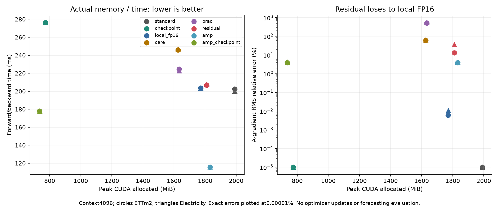

# Local residual-corrected LoRA backward: STOP

**구현 정확성은 통과했지만, 잔차 보정 후보는 학습 진입 기준을 통과하지 못했습니다.** 두 데이터에서 local FP16보다 메모리를 더 사용하고 A-gradient 추정 오차가 훨씬 큽니다. 학습 허용은 반영했으나 사전 고정한 조건에 따라 새 학습은0 fits입니다.

## What completed

32 method/dataset/context cases:8 arms ×2 datasets ×2 contexts. Three rotated-order timing repeats per arm; PRAC/residual16 stochastic draws total per case.200 measured backwards,4 exact references and12 integration audit backwards =216. Zero optimizer updates; warmed adapter tensors verified unchanged. No V/E arrays accessed by this diagnosis. The conditional16-fit pilot was authorized and preregistered but not launched after gate failure.

Pinned Chronos-2, standard rank8 LoRA, frozen backbone/head, multiplier2, float32 parameters; contexts1024/4096, horizon48, batch8, first4 source-order channels, fit origins4352/4608. The existing four-update warm state for each dataset ensures nonzero A-gradient. FP32 AdamW first/second moments are resident in every arm, including BF16 autocast. Peaks include live tensors and temporary GPU allocations for forward/backward, not an executed optimizer step or the entire driver/process footprint.

## Correctness

Forward outputs were bit-identical for all FP32 codecs. Integration audits give maximum input-gradient relative error `0.0` and B-gradient relative error `0.0`. Deterministically storing all details reproduces A-gradient within `1.51e-07` relative error. CPU exhaustive enumeration verifies the small estimator expectation;128 actual stochastic A-gradient caches replay with maximum metric discrepancy `3.552713678800501e-15`.

Only local A-gradient is approximated. Z and native B backward remain exact; incoming gradient propagates through A exactly. No approximate X is supplied to normalization, attention, MLP or the frozen base. Residual, CARE and PRAC calculate A-gradient directly without reconstructing full X. Generic local FP16 reconstructs only its local X. Group-attention tensors are put in B,T,D order for pairing; channels/batches are not mixed. Last4 REG/future tokens remain exact in residual coding.

## Context4096 measurements

| Dataset | Method | Peak MiB | Reduction vs standard | Median ms | Time / standard | A-gradient RMS relative error |
|---|---|---:|---:|---:|---:|---:|
| ettm2 | standard | 1990.0 | 0.00% | 202.56 | 1.000× | 0.00000% |
| ettm2 | checkpoint | 772.7 | 61.17% | 276.30 | 1.364× | 0.00000% |
| ettm2 | local_fp16 | 1770.6 | 11.02% | 203.77 | 1.006× | 0.00618% |
| ettm2 | care | 1626.6 | 18.26% | 246.00 | 1.214× | 60.18584% |
| ettm2 | prac | 1632.7 | 17.95% | 224.77 | 1.110× | 511.89581% |
| ettm2 | residual | 1809.8 | 9.06% | 206.93 | 1.022× | 12.93511% |
| ettm2 | amp | 1831.2 | 7.98% | 115.57 | 0.571× | 3.89087% |
| ettm2 | amp_checkpoint | 735.0 | 63.07% | 178.15 | 0.879× | 3.89087% |
| electricity | standard | 1990.0 | 0.00% | 200.28 | 1.000× | 0.00000% |
| electricity | checkpoint | 772.7 | 61.17% | 276.62 | 1.381× | 0.00000% |
| electricity | local_fp16 | 1771.5 | 10.98% | 203.49 | 1.016× | 0.01098% |
| electricity | care | 1626.6 | 18.26% | 247.04 | 1.233× | 65.07823% |
| electricity | prac | 1632.7 | 17.95% | 222.87 | 1.113× | 560.16105% |
| electricity | residual | 1810.4 | 9.02% | 208.03 | 1.039× | 36.33118% |
| electricity | amp | 1831.6 | 7.96% | 115.97 | 0.579× | 4.12640% |
| electricity | amp_checkpoint | 736.4 | 63.00% | 177.84 | 0.888× | 4.12640% |

These are **gradient diagnostics, not forecasting-loss degradation**. AMP is compared against the FP32 reference, so its numerical gradient difference is expected and is not an exact-parity failure. CARE/PRAC A-error does not establish their downstream training quality. Timing repeats use one fixed batch, not independent training seeds. Full1024 results and every draw are in `metrics.json`.

## Stochastic estimator

| Dataset | Codec | Single-draw A-error RMS | Error of16-draw mean | Centered variance / exact A norm² |
|---|---|---:|---:|---:|
| ettm2 | prac | 511.8958% | 127.4643% | 24.579017 |
| ettm2 | residual | 12.9351% | 3.3034% | 0.015640 |
| electricity | prac | 560.1610% | 140.7509% | 29.396957 |
| electricity | residual | 36.3312% | 7.2126% | 0.126793 |

The16-draw mean is only a diagnostic; a training step would use one draw. Finite-sample mean error is not evidence of estimator bias or a proof of unbiasedness on the full network. Inverse-probability correction has an exact-arithmetic conditional expectation identity; floating-point arithmetic adds roundoff. Clipping and Adam are nonlinear, so that identity would not guarantee unbiased updates or forecasting gains.

## Memory accounting and prior scope

The residual codec stores FP32 pair means, one-quarter as many sampled details as pairs, their indices/inverse probabilities and exact special tokens. It shares48 payloads across96 LoRA modules in this model. Local FP16 also shares these inputs. At4096, cumulative encoded payload bytes are193,609,728 for residual versus153,354,240 for local FP16; these sums are not peak memory. CARE stores A-specific Z/decoders and does not share them; its Z also serves native B backward. Weak references preserve storage identity without retaining original X. All basis, decoder and reconstruction temporaries enter peak/timing measurements.

CARE is a ridge-decoder primitive based on [CARE-LoRA](https://arxiv.org/abs/2607.11940). PRAC is a principal-random primitive based on [PRAC](https://arxiv.org/abs/2602.23111), with a rank8 randomized principal subspace and rank8 orthogonal random tail rebuilt every forward. It does not reproduce the official SVD/lazy-update algorithm. Those much smaller payloads are not byte-matched to residual; their metrics describe these fixed primitives only. Local FP16 is the closest direct control and already rules out a practical advantage for the proposed setting. No new contribution is claimed for principal+random correction or A-only approximation.

The earlier global saved-tensor FP16 study compressed more than LoRA-local inputs and omitted optimizer moments in Stage B. Its peak numbers are not interchangeable with this local-only, optimizer-resident study. The remaining frozen MLP and attention activations are unchanged here. ReLU mask optimization, side networks, and other temporal codecs were not pursued.

## Fixed decision

Before GPU measurement, the conditional learning gate required both datasets at4096: at least5% peak reduction, at most15% step-time overhead versus standard, A-error RMS no worse than local FP16, and no peak/time domination by exact or AMP checkpointing. The candidate meets its modest reduction/time bounds but fails the error comparison and is dominated by AMP checkpointing. Local FP16 itself has lower peak and lower A-error. The gradient gate is a conservative budget decision, not a publication-success definition. No threshold, sampling budget, precision or learning recipe was changed after results.

**STOP this fixed primitive;0 new fits.** User authorization for learning is recorded in the preregistered config, but the specified prerequisite did not hold. The cap of16 fits was never a completed-fit claim. Historical totals remain46 completed fits and9 stream attempts (8 complete,1 historical abort). All original screening, recovery, Freshness v2 and global memory-feasibility artifacts remain byte-for-byte unchanged.

Execution commit: `7c08a264f72b68b6d9f0f31766e70d78d3c5f148`. See [contract](contract.json), [configuration](../../configs/local_backward_feasibility.json), [protocol](../../docs/LOCAL_BACKWARD_PROTOCOL.md) and [verification](verification.json). Reproduce verification with `scripts/with_cuda.sh .venv/bin/python scripts/finalize_local_backward.py --verify-only`; local ignored warm/gradient caches are required. Raw data, model weights and gradient tensors are not committed.

