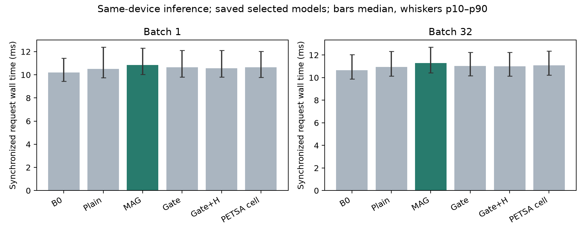

# 동일 조건 추론 자원 검사

기존24개 선택 모델을 그대로 사용한 측정을 완료했다. 신규 학습0, optimizer/backward0, E예측·정답채점0. 기존 성능·선택·기준을 변경하지 않았다. 이 결과는 과거 optimizer timer 경계 차이를 소급 해결하지 않으며 **현재 구현의 추론 비용**만 보완한다.

## 고정 범위와 검산

Electricity/ETTm1 × 기존 seed81551/81552 × 6군. 각 원천 TRAIN epoch0 index0,33,…,1023의32개 관측 입력과 sigma를 사용했다. REFERENCE/POINT/BURST/SHIFT가8개씩이며 변형 진폭은4뿐이다. 새 변화 강도 전반의 비용을 확인한 것으로 해석하지 않는다. 모델은 state 이름·clean 입력·future label을 받지 않았다. 입력은 CPU→GPU 전송 후 동일하게 재사용했다.

FP32/TF32off/eval/inference_mode/CPUthreads4, batch1/32,6개 순서 회전, block별 warmup3+timed32회. 288blocks, timed9216+warmup864+전후출력확인48=10128forward를 실행했다. batch1은32입력을각각1회, batch32는같은32입력을32회 반복했다. 24개모델의 state hash와 전후출력exact·입력불변,133개코드/입력/checkpoint hash,모든장부의유일성·크기·timing양수·메모리일관성을검사했다. 외부GPU compute는기존허용RustDesk외없었다.

## 직접 측정

| 방법 | batch | wall median ms | p10–p90 ms | max allocated MiB | 추가학습 params |
| --- | --- | --- | --- | --- | --- |
| B0 | 1 | 10.206 | [9.454, 11.424] | 192.728 | 0 |
| B0 | 32 | 10.663 | [9.886, 12.042] | 226.265 | 0 |
| MAG_ONLY | 1 | 10.833 | [10.040, 12.305] | 192.761 | 8712 |
| MAG_ONLY | 32 | 11.303 | [10.418, 12.697] | 226.298 | 8712 |
| PETSA_XY_OFFLINE | 1 | 10.643 | [9.777, 12.019] | 192.804 | 19010 |
| PETSA_XY_OFFLINE | 32 | 11.076 | [10.217, 12.347] | 226.401 | 19010 |
| PLAIN | 1 | 10.509 | [9.762, 12.389] | 192.761 | 8712 |
| PLAIN | 32 | 10.954 | [10.150, 12.318] | 226.302 | 8712 |
| TOKEN_GATE | 1 | 10.650 | [9.799, 12.100] | 192.764 | 9225 |
| TOKEN_GATE | 32 | 11.022 | [10.154, 12.235] | 226.309 | 9225 |
| TOKEN_GATE_ENTROPY | 1 | 10.564 | [9.795, 12.101] | 192.764 | 9225 |
| TOKEN_GATE_ENTROPY | 32 | 11.015 | [10.136, 12.229] | 226.309 | 9225 |

wall은forward호출전부터CUDA완료까지이며모델로딩/전송/hash/guard/I/O는제외한다. 코드의CPUassert·normalization·gate·분위수계산은포함한다. CUDA stream event도별도공개하지만kernel-only라고부르지않는다. 메모리는한모델만GPU에둔상태의PyTorch allocated peak다. nvidia-smi의전체사용량·CUDAcontext·RustDesk메모리는포함하지않는다. 네source-seed사례에동일개수로관측한요청의pooled분포이며독립과제반복이나신뢰구간이아니다.

## 같은 round에서의 MAG/대조 시간비

| batch | 대조 | MAG/대조 median | 24개round비의min–max |
| --- | --- | --- | --- |
| 1 | B0 | 1.059 | [1.008, 1.172] |
| 1 | PETSA_XY_OFFLINE | 1.007 | [0.948, 1.160] |
| 1 | PLAIN | 1.027 | [0.776, 1.088] |
| 1 | TOKEN_GATE | 1.025 | [0.918, 1.098] |
| 1 | TOKEN_GATE_ENTROPY | 1.023 | [0.907, 1.120] |
| 32 | B0 | 1.064 | [0.975, 1.092] |
| 32 | PETSA_XY_OFFLINE | 1.015 | [0.959, 1.102] |
| 32 | PLAIN | 1.028 | [0.983, 1.100] |
| 32 | TOKEN_GATE | 1.018 | [0.987, 1.082] |
| 32 | TOKEN_GATE_ENTROPY | 1.025 | [0.962, 1.098] |

1보다크면MAG가느리다.같은source/seed/batch/round의요청median을짝지었다. 범위는24개고정round의관측범위이며모집단신뢰구간이아니다.추가파라미터가적다는사실을자동으로속도이득으로바꾸지않는다.선택step0도기존adapter를실행해측정했고모듈생략을적용하지않았다.

## 논문에 반영할 범위

학습속도·총적응비용우위는여전히별도문제다.B0의기존LoRA294912와그학습비용을제외한추가파라미터만표시했다.이동일장치측정으로추론시간/메모리를정확도와나란히보고할수있지만평균화된accuracy-cost점수로새우승자를선택하지않는다.PETSA는offline공개cell이식이며Time-PEFT·정식온라인PETSA전체성능우위를증명하지않는다.신규성·독립source/seed일반화도이측정으로해결되지않는다.

모든원시timing은TIMINGS.csv.gz/JSONL,48개source-seed-arm-batch값은BY_CASE.csv,240개짝비는PAIRED_ROUND_RATIOS.csv다.기존실험및원고v2는보존한다.신규후속학습/구조0.아티팩트검산후scoped commit/push한다.

## 이번 측정의 핵심 해석

동일round의MAG/B0시간비중앙값은batch1 1.059, batch32 1.064다. MAG/PLAIN은각각1.027/1.028, MAG/PETSA cell은1.007/1.015다. 적은추가파라미터가추론속도우위로이어지지는않았다. 개별round의비가1아래/위를오가므로작은차이를일반적인속도서열로확정하지않는다. 이값은현재PyTorch구현의dispatch·assert·GPU완료대기를포함하며연산별원인profile을수행한것은아니다. GPUclock을고정하지않았고허용된RustDesk가실행중이므로일반적인hardware벤치마크기록으로확대하지않는다.
