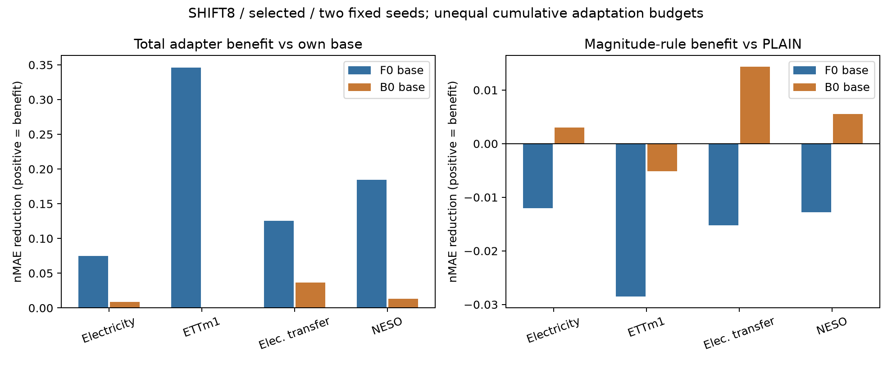

# LoRA 선행 여부 직접 검증 — 최종 보고서

**16/16 fits, 본학습 16,384회와 smoke 8회, 지정 평가 및 독립 검산을 완료했다.** 기존 B0/PLAIN/MAG 재학습 0회, joint 학습 0회, 승인 범위 밖 추가 학습 0회다. 아래는 방법의 효과에 대한 개발 근거이며 논문 PASS 선언이 아니다.

## 먼저 답하는 다섯 질문

1. **F0+PLAIN은 F0보다 좋아졌는가?** SHIFT8에서는 네 패널 모두 개선했다. Electricity **27.06%**, ETTm1 **36.41%**, 전력 전이 **25.14%**, NESO **38.29%**다. 다만 REFERENCE/FAULT까지 모두 좋아진 것은 아니다.
2. **F0+MAG는 F0보다 좋아졌는가?** SHIFT8에서는 각각 **23.31%, 33.64%, 22.42%, 35.82%** 개선했다. LoRA 없이 어댑터를 학습해 예측을 개선하는 것은 가능했다. 그러나 이것만으로 MAG 규칙의 기여를 입증하지는 못한다.
3. **LoRA 없이도 MAG가 PLAIN보다 좋아졌는가?** SHIFT8에서는 각각 **5.15%, 4.36%, 3.63%, 4.02% 악화**했고 두 seed의 방향이 같았다. NESO의 날짜 구간은 0을 포함한다. 반면 NESO SHIFT_POINT는 **3.17% 개선**, 95% 날짜 구간 **[0.75%, 5.22%]**로 좁은 양성 근거가 있다. NESO SHIFT4도 **1.69% 개선**했으나 구간 **[−2.35%, 5.37%]**이어서 불확실하다. 양성·음성 조건을 모두 보존한다.
4. **B0+MAG와 F0+MAG 중 추가 이득이 더 큰 쪽은?** 자기 출발 모델 대비 **전체 어댑터의 절대 오차 감소**는 SHIFT8 네 패널 모두 F0 쪽이 컸다(아래 Q4). F0의 시작 오차가 더 크기 때문이다. 하지만 **PLAIN 대비 MAG 규칙 자체의 추가 가치**는 B0 쪽이 더 컸고, Electricity·전력 전이·NESO에서는 부호가 음수에서 양수로 바뀌었다. ETTm1의 B0+MAG는 step0 fallback으로 추가 개선이 없었다. 큰 감소량과 좋은 최종 정확도는 같은 뜻이 아니다.
5. **standalone PEFT인가, second-stage PEFT인가?** 구현상 둘 다 가능하지만, **현재 MAG 규칙의 주된 양성 근거는 선행 적응 B0 위의 제한된 second-stage 적용**이다. 범용 standalone MAG 우위는 확보하지 못했다. NESO SHIFT_POINT의 좁은 standalone 이득은 남긴다. “LoRA가 반드시 필요하다”, “LoRA 없이 MAG는 전혀 작동하지 않는다”, “LoRA가 필요 없다” 어느 쪽도 일반화할 수 없다.

다음 표는 selected·두 seed 평균이다. 상대 개선률은 `100×(1−방법오차/비교군오차)`이며 양수가 좋다. Q4는 상대%가 아닌 **절대 nMAE 감소**다. 표의 패널들을 합친 우승 점수는 만들지 않았다.

| 자료 | Q1 PLAIN→F0 개선% | Q2 MAG→F0 개선% | Q3 MAG→PLAIN 개선% | Q4 F0 절대감소 | Q4 B0 절대감소 |
| --- | --- | --- | --- | --- | --- |
| Electricity | 27.063957 | 23.308969 | -5.148329 | 0.074875 | 0.008608 |
| ETTm1 | 36.412449 | 33.642945 | -4.355418 | 0.346247 | 0.000000 |
| 전력 전이 16계열 | 25.141661 | 22.423256 | -3.631399 | 0.125670 | 0.036722 |
| NESO 7–8월 | 38.294864 | 35.816814 | -4.015953 | 0.184434 | 0.013482 |

## 전체 어댑터 이득과 MAG 규칙의 추가 가치

[벡터 PDF](base_vs_rule.pdf). 이 그림은 기존 검산 CSV를 그린 것이며 새 학습·채점·bootstrap을 추가하지 않았다. B0는 과거 LoRA 학습을 거친 출발점이므로 두 경로의 누적 예산은 다르다. 차분을 완전한 인과효과로 해석하지 않는다.

SHIFT8에서 MAG와 PLAIN을 직접 비교한 결과:

| panel | proposed | baseline | gain_pct | ci_low | ci_high | seed_gains |
| --- | --- | --- | --- | --- | --- | --- |
| electricity | F0_MAG | F0_PLAIN | -5.148329 | -7.251598 | -3.260046 | {"81551": -5.367607426024246, "81552": -4.93353814040296} |
| electricity | B0_MAG | B0_PLAIN | 1.457885 | 1.045113 | 1.902894 | {"81551": 0.2879750399792158, "81552": 2.596793224071292} |
| electricity_transfer | F0_MAG | F0_PLAIN | -3.631399 | -4.641451 | -2.539716 | {"81551": -6.796703964511419, "81552": -0.6455314400097389} |
| electricity_transfer | B0_MAG | B0_PLAIN | 3.793539 | 3.351807 | 4.223483 | {"81551": 1.1340422781548232, "81552": 6.282383420580617} |
| ettm1 | F0_MAG | F0_PLAIN | -4.355418 | -7.436360 | -1.048897 | {"81551": -4.47209946307181, "81552": -4.239722633803056} |
| ettm1 | B0_MAG | B0_PLAIN | -0.949523 | -1.420742 | -0.467057 | {"81551": 0.0, "81552": -1.8943053317788339} |
| neso_2026_jul_aug | F0_MAG | F0_PLAIN | -4.015953 | -9.299984 | 0.353446 | {"81551": -3.48873226469244, "81552": -4.5498546996309175} |
| neso_2026_jul_aug | B0_MAG | B0_PLAIN | 1.941463 | 1.154908 | 2.920800 | {"81551": 0.92375724262026, "81552": 2.904402476966328} |

위 구간은 고정된 두 seed와 채널에 조건부인 **2,000회 paired index 7일 block bootstrap의 95% 구간**이다. 날짜가 아닌 seed/조건/draw/채널을 독립 날짜로 세지 않았다. optimizer-seed 모집단 불확실성이나 과거 전체 후보 탐색의 다중검정을 해결한 구간은 아니다. 계약에 없는 새 전역 PASS 문턱이나 보정 family는 만들지 않았다.

NESO의 좁은 standalone 양성 조건:

| condition | gain_pct | ci_low | ci_high | seed_gains |
| --- | --- | --- | --- | --- |
| SHIFT4 | 1.692160 | -2.349649 | 5.373827 | {"81551": 1.7866750471593251, "81552": 1.5969996687644539} |
| SHIFT_POINT | 3.170256 | 0.746397 | 5.221458 | {"81551": 3.0997339285436243, "81552": 3.2412442718940393} |

`CONDITION_DECISIONS.json`의 `STANDALONE_MAG_SUPPORTED`는 두 seed의 조건별 양성 방향을 나타내며, 그 자체가 신뢰구간 유의성·독립 검증·논문 성공 판정은 아니다. 특히 SHIFT4는 구간이 0을 포함한다. [모든 조건의 다섯 질문 답변](FIVE_QUESTIONS.csv), [seed별 효과](SEED_EFFECTS.csv), [절대 감소 및 interaction](INTERACTION_EFFECTS.csv)을 함께 읽어야 한다.

## 원점수와 손해

아래는 주요 다섯 조건의 selected·두 seed 평균 nMAE다. 낮을수록 좋다. FAULT는 기존 여섯 POINT/BURST 조건의 동등 가중 평균이다.

| panel | condition | B0 | B0_MAG | B0_PLAIN | F0 | F0_MAG | F0_PLAIN |
| --- | --- | --- | --- | --- | --- | --- | --- |
| electricity | FAULT | 0.171460 | 0.172018 | 0.171823 | 0.174216 | 0.175877 | 0.174033 |
| electricity | REFERENCE | 0.166524 | 0.166890 | 0.166614 | 0.169059 | 0.168356 | 0.167037 |
| electricity | SHIFT4 | 0.191307 | 0.189160 | 0.189093 | 0.265069 | 0.211624 | 0.206730 |
| electricity | SHIFT8 | 0.210032 | 0.201424 | 0.204404 | 0.321226 | 0.246352 | 0.234290 |
| electricity | SHIFT_POINT | 0.196221 | 0.193520 | 0.193546 | 0.285354 | 0.217913 | 0.210362 |
| electricity_transfer | FAULT | 0.255210 | 0.255727 | 0.255428 | 0.247261 | 0.258932 | 0.255164 |
| electricity_transfer | REFERENCE | 0.239856 | 0.240273 | 0.239930 | 0.231110 | 0.236658 | 0.235541 |
| electricity_transfer | SHIFT4 | 0.326449 | 0.319098 | 0.318945 | 0.444540 | 0.355027 | 0.353857 |
| electricity_transfer | SHIFT8 | 0.399762 | 0.363040 | 0.377355 | 0.560445 | 0.434775 | 0.419540 |
| electricity_transfer | SHIFT_POINT | 0.342813 | 0.334295 | 0.334722 | 0.505777 | 0.371167 | 0.368018 |
| ettm1 | FAULT | 0.423198 | 0.423198 | 0.423652 | 0.417559 | 0.434387 | 0.428165 |
| ettm1 | REFERENCE | 0.407336 | 0.407336 | 0.407596 | 0.405979 | 0.411484 | 0.409973 |
| ettm1 | SHIFT4 | 0.551405 | 0.551405 | 0.548210 | 0.920601 | 0.659502 | 0.629507 |
| ettm1 | SHIFT8 | 0.545368 | 0.545368 | 0.540239 | 1.029181 | 0.682934 | 0.654431 |
| ettm1 | SHIFT_POINT | 0.589807 | 0.589807 | 0.586404 | 0.990499 | 0.673351 | 0.646792 |
| neso_2026_jul_aug | FAULT | 0.204939 | 0.205761 | 0.204852 | 0.181814 | 0.189252 | 0.186884 |
| neso_2026_jul_aug | REFERENCE | 0.191119 | 0.191583 | 0.191008 | 0.171199 | 0.175750 | 0.176598 |
| neso_2026_jul_aug | SHIFT4 | 0.266394 | 0.263951 | 0.264542 | 0.535092 | 0.297208 | 0.302324 |
| neso_2026_jul_aug | SHIFT8 | 0.291422 | 0.277940 | 0.283443 | 0.514936 | 0.330503 | 0.317742 |
| neso_2026_jul_aug | SHIFT_POINT | 0.259068 | 0.255654 | 0.256566 | 0.548514 | 0.303578 | 0.313518 |

F0_MAG는 FAULT에서 F0보다 Electricity **0.95%**, ETTm1 **4.03%**, 전력 전이 **4.72%**, NESO **4.09%** 나빴다. PLAIN 대비 FAULT도 네 패널 모두 나빴다. 변화 조건의 개선을 오류 강건성 전반의 성공으로 옮기지 않는다. REFERENCE 손해도 표에 남겼다.

SHIFT8의 seed별 원점수:

| panel | seed | B0 | B0_MAG | B0_PLAIN | F0 | F0_MAG | F0_PLAIN |
| --- | --- | --- | --- | --- | --- | --- | --- |
| electricity | 81551 | 0.208332 | 0.201079 | 0.201659 | 0.321226 | 0.244314 | 0.231868 |
| electricity | 81552 | 0.211732 | 0.201770 | 0.207149 | 0.321226 | 0.248390 | 0.236712 |
| electricity_transfer | 81551 | 0.384325 | 0.360709 | 0.364847 | 0.560445 | 0.434985 | 0.407302 |
| electricity_transfer | 81552 | 0.415199 | 0.365370 | 0.389863 | 0.560445 | 0.434566 | 0.431779 |
| ettm1 | 81551 | 0.538887 | 0.538887 | 0.538887 | 1.029181 | 0.680797 | 0.651655 |
| ettm1 | 81552 | 0.551850 | 0.551850 | 0.541591 | 1.029181 | 0.685070 | 0.657207 |
| neso_2026_jul_aug | 81551 | 0.285476 | 0.273059 | 0.275605 | 0.514936 | 0.330898 | 0.319743 |
| neso_2026_jul_aug | 81552 | 0.297368 | 0.282820 | 0.291280 | 0.514936 | 0.330108 | 0.315742 |

전체 standard 10조건과 FAULT 집계, 9개 변화 형태, selected/fixed1024, 원점·채널별 기록은 [RAW_SCORES.csv](RAW_SCORES.csv), [EFFECTS.csv](EFFECTS.csv), [ORIGIN_SCORES.csv.gz](ORIGIN_SCORES.csv.gz), [ORIGIN_CHANNEL_SCORES.csv.gz](ORIGIN_CHANNEL_SCORES.csv.gz)에 있다. raw MAE, 채널 평균 nRMSE, normalized twice-pinball, 분위수 교차율도 RAW_SCORES.csv에 포함했다. 분위수 정렬로 출력을 수정하지 않았다. [조건별 이득 그림](tradeoffs.png) · [여섯 비교군 원점수 그림](comparison.png).

## 선택과 구현

| source | arm | seed | stage | step | lr |
| --- | --- | --- | --- | --- | --- |
| electricity | F0_PLAIN | 81551 | selected | 768 | 0.000300 |
| electricity | F0_PLAIN | 81552 | selected | 768 | 0.000300 |
| electricity | F0_MAG | 81551 | selected | 1024 | 0.000300 |
| electricity | F0_MAG | 81552 | selected | 1024 | 0.000300 |
| electricity | F0 | 81551 | selected | 0 | nan |
| electricity | F0 | 81552 | selected | 0 | nan |
| ettm1 | F0_PLAIN | 81551 | selected | 1024 | 0.000300 |
| ettm1 | F0_PLAIN | 81552 | selected | 1024 | 0.000300 |
| ettm1 | F0_MAG | 81551 | selected | 1024 | 0.000300 |
| ettm1 | F0_MAG | 81552 | selected | 1024 | 0.000300 |
| ettm1 | F0 | 81551 | selected | 0 | nan |
| ettm1 | F0 | 81552 | selected | 0 | nan |
| electricity | B0_PLAIN | 81551 | selected | 512 | 0.000300 |
| electricity | B0_MAG | 81551 | selected | 768 | 0.000300 |
| electricity | B0 | 81551 | selected | 768 | nan |
| electricity | B0_PLAIN | 81552 | selected | 1024 | 0.000300 |
| electricity | B0_MAG | 81552 | selected | 768 | 0.000300 |
| electricity | B0 | 81552 | selected | 512 | nan |
| ettm1 | B0_PLAIN | 81551 | selected | 0 | 0.000300 |
| ettm1 | B0_MAG | 81551 | selected | 0 | 0.000100 |
| ettm1 | B0 | 81551 | selected | 768 | nan |
| ettm1 | B0_PLAIN | 81552 | selected | 1024 | 0.000300 |
| ettm1 | B0_MAG | 81552 | selected | 0 | 0.000100 |
| ettm1 | B0 | 81552 | selected | 1024 | nan |

F0는 pinned pretrained Chronos-Bolt-small, F0_PLAIN/F0_MAG는 LoRA 없이 residual 512→8→512만 학습한다. 기존 `MAG_ONLY`는 no-LoRA가 아니며 이번 표의 B0_MAG에 해당한다. `F0_PLAIN`과 `F0_MAG`의 동일 source/seed 초기 어댑터는 bitwise 동일하고, up weight/bias는 0이다. MAG는 기존 raw observation median/MAD·floor 0.1sigma·threshold 3·patch16 식을 변경하지 않았다.

전체 foundation parameter/buffer를 동결했고 새 trainable은 정확히 8,712개, 모두 `adapter.*`에만 있다. LoRA parameter/module은 0개다. 관측 입력과 TRAIN sigma만 forward에 들어가며 미래 y, clean x0, 합성 state/mask/delta는 전달하지 않는다. raw 입력은 바꾸지 않는다. [실제 모델 검사](NO_LORA_AUDIT.json) · [기존 B0 q/v rank8 검사](BASELINE_STRUCTURE_CHECK.json).

모든 학습률은 고정 후보 1e-4/3e-4 중 V로 선택했으며 새 두 군은 모두 3e-4였다. seed81550으로 선택, 81551/81552로 반복했다. 32epochs×32updates, batch32, FP32/TF32off, dropout0, AdamW(.9,.999)/eps1e-8/wd0, gradclip1, scheduler 없음, normalized twice-pinball과 기존 V 다섯 조건 평균 nMAE를 유지했다. 기존 TRAIN/V/E draws·labels·sigma·origins·순서 계약을 hash 재사용했다.

step0 선택은 출발 모델로의 fallback이며 추가 PEFT의 성공으로 세지 않는다. F0의 seed/stage 반복 표기는 같은 고정 모델을 정렬한 것으로 독립 반복 실험이 아니다. B0 fixed1024는 기존 selected B0 위 추가 어댑터의1024updates 비교이며 B0 자체를 다른 checkpoint로 바꾼 것이 아니다.

## 파라미터와 누적 비용

| 경로 | 해당 적응 stage 학습 파라미터 | 배포되는 적응 파라미터 | 누적 적응 stage | 반복 경로당 실제 학습 비용 |
| --- | ---: | ---: | ---: | --- |
| F0 | 0 | 0 | 0 | 0 |
| F0_PLAIN / F0_MAG | 8,712 | 8,712 | 1 | 이번 1,024 updates |
| B0 | 과거 294,912 | 294,912 | 1 | 과거 LoRA 1,024-update fit 재사용 |
| B0_PLAIN / B0_MAG | 과거 추가 8,712 | 303,624 | 2 | 과거 LoRA 1,024 + adapter 1,024-update fit 재사용 |

위 단일 반복 경로 비용 외에 LR 선택용 학습도 존재한다. 이번 실제 총량은 **16 fits / 16,384 main + 8 smoke**이며 선택용 경로를 제외해 비용을 작게 표시하지 않았다. 과거 B0 선택 step과 fit 비용은 [HISTORICAL_COST.json](HISTORICAL_COST.json)에 있다. 기존 LoRA를 이번 새 학습으로 다시 계산하지 않지만 누적 비용에서 지우지도 않는다. compute-matched 2,048-update standalone 또는 joint LoRA+MAG는 실행하지 않았다.

아래 시간은 현재 runner에서 fit별로 측정한 평균이다. `optimizer_seconds`에는 optimizer intent 저장 등이 포함되며 GPU 경계 검사 등 전체 실행시간과는 다르다. 중단 경로의 해당 시간은 resume 상태에서 누적 복원했다. 과거 runner와의 시간비를 순수 계산 속도 우위로 주장하지 않는다.

| arm | trainable_parameters | optimizer_seconds | validation_seconds | peak_allocated_MiB |
| --- | --- | --- | --- | --- |
| F0_MAG | 8712.000000 | 30.181560 | 4.549312 | 360.984375 |
| F0_PLAIN | 8712.000000 | 29.776060 | 4.453626 | 360.828125 |

## 실행·검산과 중단 이력

- **완료 16/16 fits, unique main updates 16,384, smoke 8.** 미실행 승인 학습 0, 기존 B0/PLAIN/MAG 재학습 0.
- 실제 no-LoRA 검사, native F0/step0/adapter-off 예측 동일성, finite gradient와 parameter 변경, foundation/buffer 보존, 배치 순서 정합, 복원 동일성을 확인했다.
- 80개 checkpoint hash, LR·checkpoint 선택 및 selected/fixed1024 연결을 검증했다. 새 모델 복원 예측 검사는 각 실제 새 prediction 파일의 앞32행을 재추론해 정확 일치시켰다. 전체 E를 두 번 재추론했다는 뜻은 아니다.
- 선택 봉인 뒤 **192 prediction views를 모두 저장한 후** 채점했다. 중복 참조를 제외한 로컬 prediction 파일은124개다. F0·selected/fixed 동일 체크포인트 등의 alias를 새 학습이나 독립 표본으로 세지 않았다.
- 첫/마지막 origin·첫/마지막 channel의 독립 scalar metric 12,768개, 전체 저장 예측의 독립 metric **793,560개**, 기존 점수 **960행**, 원점수→효과·interaction·bootstrap을 검산했다.
- 사용자 요청으로 두 차례 멈춘 기록을 보존했다. 최종 모든 경로에서 journal step1..1024, epoch 순서, AdamW state step1024, resume와 최종 checkpoint 일치를 확인했다. 중복 update 0. [재개·상한 검산](RESUME_AND_BUDGET_AUDIT.json).
- 긴 사용자 일시정지 기간만 실행시간 계수에서 제외했다. 실제 실행시간이나 GPU 대기 예산을 초기화하지 않았고,8시간 guard 및 학습 상한은 유지했다. [시간 계수 기록](USER_PAUSE_TIME_ACCOUNTING.json).
- RustDesk만 외부 GPU 예외였고, 미승인 외부 compute 표본은0개였다. 예전 ERROR/EXECUTION_ERROR의 `REQUESTED_STOP_EPOCH_BOUNDARY`는 사용자 일시정지 이력이며 최종 상태는 `COMPLETE_VERIFIED`다.

[최종 검산](VERIFICATION.json) · [감사 요약](AUDIT.json) · [예측 manifest](PREDICTIONS_MANIFEST.json) · [단일 실행 계약](../../experiments/mag_standalone_ablation_v1_20260919/CONTRACT.txt). 원자료·가중치·예측은 로컬 캐시이며 GitHub에는 hash·manifest·집계/검산을 게시한다. GitHub만으로 모든 수치가 재현된다고 주장하지 않는다.

## 논문 해석과 종료

현재 결과는 **기반 모델의 선행 적응 여부와 조건에 따라 고정 MAG 규칙의 추가 가치가 달라진다**는 개발 근거다. 큰 전체 어댑터 이득을 MAG 규칙의 기여로 바꾸어 말하지 않는다. B0가 최종 정확도에서 더 좋더라도 누적 학습량과 파라미터가 더 많으므로 LoRA의 필수성을 증명한 것은 아니다.

네 패널 모두 이미 사용한 개발 평가다. NESO는 같은 provider의 기존 노출 기간이며 독립 source가 아니다. 실제 오류·실제 변화 사건 레이블은 없고 합성 조건에서의 비교다. 정식 선행 전체 우위, 독립 source 일반화, 충분한 신규성 및 논문 게재 가능성은 이번 실험만으로 확정하지 않는다. 추가 seed/LR/rank/gate/threshold/data, joint, 새 후보 및 후속 학습은 시작하지 않고 이 범위에서 종료한다.
