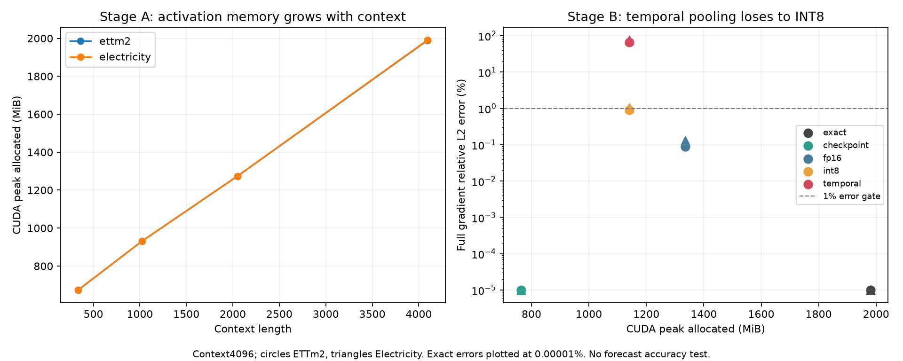

# Memory-efficient TSFM PEFT feasibility: STOP

**The activation bottleneck is real; this adjacent-pair temporal compression primitive fails the fixed gradient gate. No learning pilot was launched.** This does not rule out every possible temporal method. It provides no forecasting-accuracy or publication-success evidence.

## Scope and controls

Pinned Chronos-2, rank8 attention LoRA, float32 computation, batch8, horizon48, first4 channels of ETTm2/Electricity, fit-only origins4352/4608. Four warmup updates per dataset ensure nonzero A gradients. Stage B fixes the warm state and makes zero optimizer updates. Three timing repeats use the same batch, not independent seeds. AdamW optimizer states are resident in Stage A and omitted for all Stage-B arms; compare peak reductions within Stage B. CUDA peak allocated includes model, gradients and temporary compression/reconstruction buffers, but not all driver allocations or optimizer-step peak.

Compression changes saved backward activations only. All measured forward outputs are bit-identical. Hidden temporal pair means in FP16 and per-channel INT8 have exactly equal retained bytes, including exact last4 REG/future tokens and explicit temporal scale-sized padding. Both use FP16 elsewhere, preserve ReLU zero/sign status, deduplicate backing storage and restore original views. Checkpointing recomputes whole encoder blocks exactly. These are scoped primitives, not official LoRAct/CARE/VeLoRA reproductions.

## Actual activation bottleneck

| Dataset | Context | CUDA peak allocated MiB | Unique saved activation MiB |
|---|---:|---:|---:|
| ettm2 | 336 | 673.5 | 135.8 |
| ettm2 | 1024 | 931.5 | 368.7 |
| ettm2 | 2048 | 1273.0 | 715.2 |
| ettm2 | 4096 | 1990.0 | 1408.2 |
| electricity | 336 | 674.5 | 135.8 |
| electricity | 1024 | 931.9 | 368.7 |
| electricity | 2048 | 1274.0 | 715.2 |
| electricity | 4096 | 1992.0 | 1408.2 |

Saved activation storage is deduplicated by storage; its sum is not itself a measured peak.

## Fixed-state comparison at context4096

| Dataset | Method | Peak MiB | Peak reduction | Full gradient relative L2 | A gradient relative L2 | Step time ms | Time / exact |
|---|---|---:|---:|---:|---:|---:|---:|
| ettm2 | exact | 1981.0 | 0.00% | 0.0000% | 0.0000% | 199.86 | 1.00× |
| ettm2 | checkpoint | 763.7 | 61.45% | 0.0000% | 0.0000% | 283.99 | 1.42× |
| ettm2 | fp16 | 1335.7 | 32.57% | 0.0895% | 0.0323% | 238.72 | 1.19× |
| ettm2 | int8 | 1140.8 | 42.41% | 0.8968% | 0.3158% | 250.74 | 1.25× |
| ettm2 | temporal | 1140.9 | 42.41% | 66.2432% | 55.2355% | 235.14 | 1.18× |
| electricity | exact | 1981.0 | 0.00% | 0.0000% | 0.0000% | 200.32 | 1.00× |
| electricity | checkpoint | 763.7 | 61.45% | 0.0000% | 0.0000% | 282.51 | 1.41× |
| electricity | fp16 | 1335.7 | 32.57% | 0.1299% | 0.0561% | 239.18 | 1.19× |
| electricity | int8 | 1140.8 | 42.41% | 1.0392% | 0.4261% | 250.44 | 1.25× |
| electricity | temporal | 1140.9 | 42.41% | 77.0991% | 71.0522% | 235.91 | 1.18× |

Relative gradient error is not forecast-loss degradation. Timing includes Python hooks for compressed arms and recomputation for checkpointing. Small batches, two origins and one warmed initialization limit generalization. Full context1024 results and all repetitions are in `stage_b_metrics.json`.

## Decision and accounting

Gate fixed before measurement: both datasets at4096 must show at least30% peak reduction, at most1% full and A-gradient relative error, and both errors at least10% lower than byte-matched INT8. The temporal primitive fails. Checkpointing and generic compression are essential controls for any future memory proposal. There is no evidence to fund a learning pilot for this primitive; CARE or more elaborate temporal variants were not implemented after this gate failure.

New work:8 diagnostic warmup optimizer updates; Stage A8 inventory and24 measured backward passes; completed Stage B4 reference and60 measured backward passes. One earlier implementation attempt completed1 reference and2 exact-control backwards before an observer-hook error; its contract, traceback and status are preserved in `implementation_attempt_01/`. It added no optimizer updates. The fix did not change the gate, data or compression primitive. Historical totals remain46 completed fits and9 stream attempts (8 complete,1 historical abort). No new fitted accuracy result, V/E evaluation or Round2 was produced.

Stage A execution: `7545f1429b4088300e9b17a93336fd9d77edfa72`. Stage B completed execution: `55ebe92a0b8ef4d7292722ee399b6b6e6703cf01`. Source hashes, data hashes, fixed warm checkpoint hashes, exact-control parity, repeated metrics and historical artifact invariance are checked by `scripts/finalize_memory_feasibility.py --verify-only`. Raw data/model/adapters remain ignored local caches.

Prior boundaries: [LoRAct](https://arxiv.org/html/2509.23472v1), [CARE-LoRA](https://arxiv.org/html/2607.11940v1), [VeLoRA](https://arxiv.org/abs/2405.17991). These already study generic or LoRA-local activation compression; merely applying temporal pooling to a TSFM is not established novelty.

