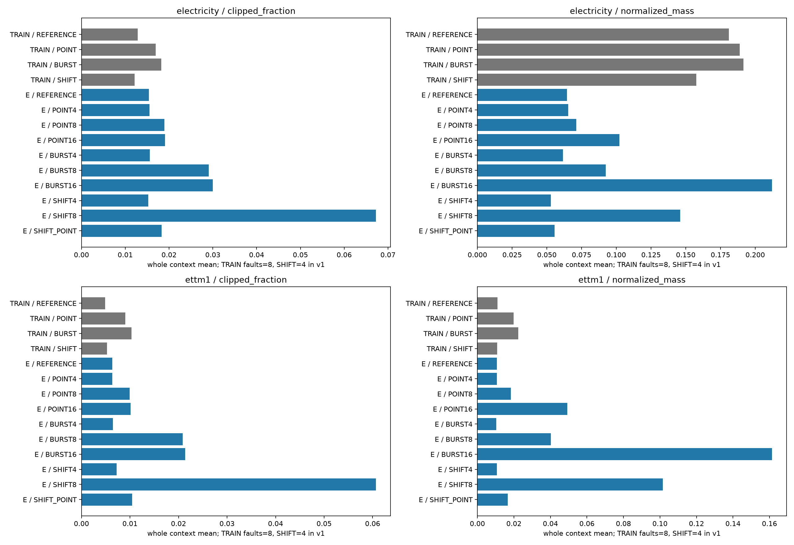
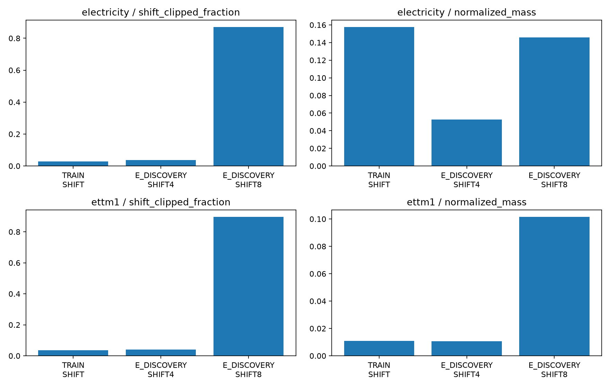
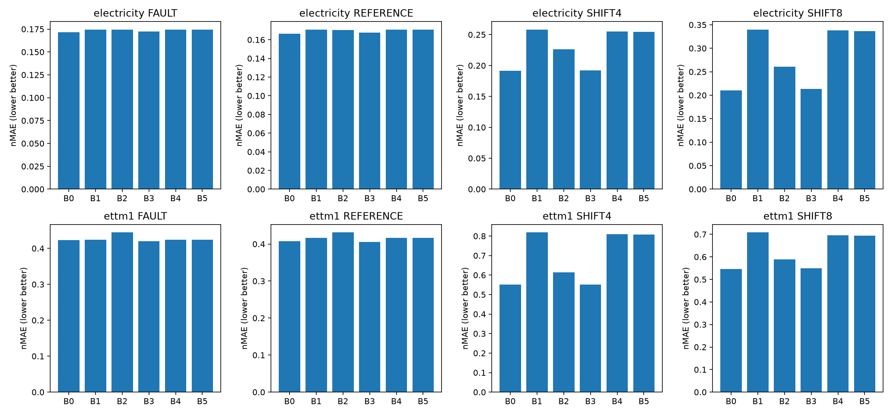
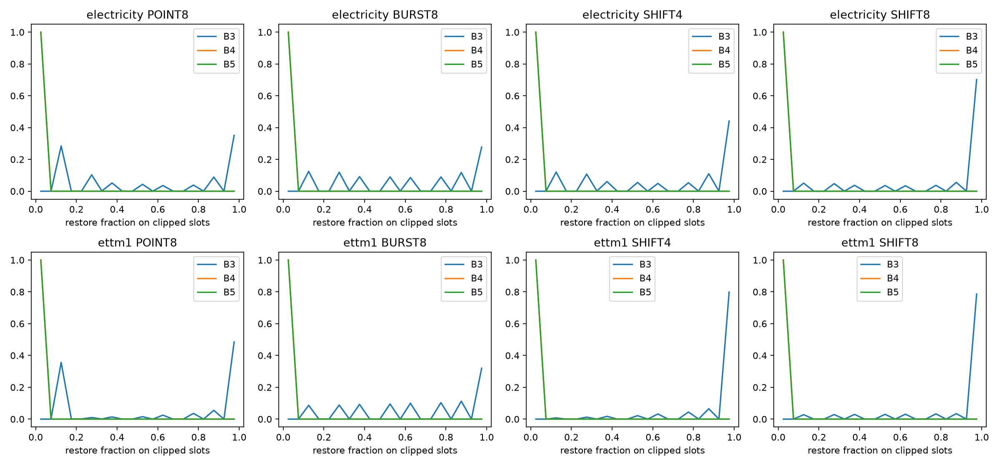
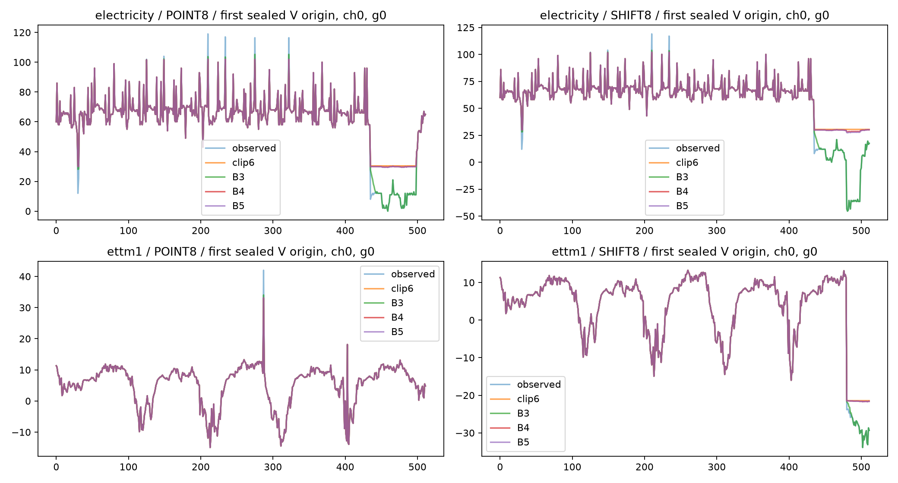

# 입력 오류·지속 변화 후속 비교 결과

실행 **COMPLETE**. 48/48 fits, 본학습 **49,152 updates**, smoke **24 updates**. 기존 실패 진단 및 선택 모델의 V ablation은 optimizer0회다. 실행 완료는 논문 성공과 다르다. 자동 후속 학습은 없다.

핵심 결과: 기존 persistent-shift 학습 노출 부족을 확인했지만, matched 학습 후에도 B5는 B0보다 SHIFT8 오차가 Electricity60.18%·ETTm1 27.24% 높았다. 고정 B3의 ETTm1 SHIFT_POINT +2.34%와 B5/B4의 작은 이득은 남기되, 현재 B5 후보는 종료한다.

## 범위와 재사용

유일한 실행 계약은 [PROTOCOL.md](PROTOCOL.md)다. 기준 commit e2b1ea4의 v1 결과·코드·원점·checkpoint를 감사하고 기존 파일을 보존했다. 새 구현은 사용자의 Python 직접 작성 승인 아래 작성했다. 기존 Electricity/ETTm1 TRAIN256·V64·E128 distinct days와 네 채널, pinned Chronos-Bolt-small FP32를 그대로 재사용했다. 모델 revision은 `772f3d25d38aec6d914c8949dab4462e2d46f5d8`이며 정확한 파일 hash는 download_receipts.json에 있다.

E는 이미 사용한 개발 기간이다. 새로운 독립 시험이 아니다. 원자료를 완전한 clean ground truth라 부르지 않는다. 실제 품질/사건 레이블이 없으며 synthetic measurement fault는 입력만, synthetic persistent shift는 최근 입력과 미래를 같은 delta로 바꾼다. 모델은 observed context와 TRAIN population sigma만 받는다. generator state·fault mask·clean x0·true delta·future y는 gate 입력에 없다.

## 기존 실패 기전: 업데이트 0회 진단

| source | role | state | shift_clipped_fraction | shift_nonzero_residual | normalized_mass | longest_run |
| --- | --- | --- | --- | --- | --- | --- |
| electricity | E_DISCOVERY | SHIFT4 | 0.036102 | 0.243164 | 0.052879 | 3.067383 |
| electricity | E_DISCOVERY | SHIFT8 | 0.869965 | 0.986328 | 0.145942 | 23.480469 |
| electricity | TRAIN | SHIFT | 0.029289 | 0.188599 | 0.157548 | 1.713013 |
| ettm1 | E_DISCOVERY | SHIFT4 | 0.039673 | 0.132812 | 0.010653 | 2.146484 |
| ettm1 | E_DISCOVERY | SHIFT8 | 0.896088 | 0.997070 | 0.101505 | 27.344727 |
| ettm1 | TRAIN | SHIFT | 0.036629 | 0.125244 | 0.010790 | 1.642578 |

shift_clipped_fraction은 변화가 주입된 위치 중 clip된 비율이다. 전체 context discarded mass와 구분해야 한다. Electricity에서는 기존 TRAIN의 다른 극단값 때문에 전체 normalized mass가 E SHIFT8보다 클 수도 있다. 그러므로 전체 mass 하나로 persistent-shift 노출을 판단하지 않았다. TRAIN state별 severity/duration/fault-count 세부는 train_clip_exposure.csv, V/E 세부는 eval_clip_exposure.csv, median/p90/p99/max는 clip_exposure_distribution.csv에 있다.

기존 TRAIN에서 shift가 주입된 위치의 clip 비율은 Electricity 2.9289%, ETTm1 3.6629%였고, E SHIFT8에서는 86.9965%/89.6088%였다. shift 위치에 하나라도 residual이 생긴 TRAIN 예제 비율은18.86%/12.52%인데 E SHIFT8은98.63%/99.71%였다. 따라서 TRAIN_EXPOSURE_GAP은 수치로 확인된다. 단, 드문 TRAIN residual이 전혀 없었던 것은 아니다.

새 TRAIN에서는 SHIFT8 위치의 clip 비율이87.9628%/84.6939%로 증가했다(독립 generator replay). B2와 B0는 이 같은 노출을 공유한다. 기존 A5와 새 B2의 차이는 분포·검증 objective·seed·선택 LR 차이도 포함하므로 노출만을 조작한 인과 추정은 아니다.

기존 A5의 실제 V adapter 사용량:

| source | seed | state | examples | adapter_delta_rms | native_embedding_rms | adapter_over_native | discarded_feature_rms | discarded_coordinate_rms | adapter_discarded_correlation |
| --- | --- | --- | --- | --- | --- | --- | --- | --- | --- |
| electricity | 81501 | BURST8 | 512 | 0.002212 | 0.212173 | 0.010118 | 0.092696 | 0.224640 | 0.828693 |
| electricity | 81501 | POINT8 | 512 | 0.002169 | 0.208994 | 0.010222 | 0.080789 | 0.212099 | 0.828740 |
| electricity | 81501 | SHIFT4 | 512 | 0.002172 | 0.210002 | 0.009989 | 0.057069 | 0.163953 | 0.800975 |
| electricity | 81501 | SHIFT8 | 512 | 0.002586 | 0.211781 | 0.011038 | 0.125876 | 0.262940 | 0.860316 |
| electricity | 81502 | BURST8 | 512 | 0.002241 | 0.212173 | 0.010297 | 0.092696 | 0.224640 | 0.797665 |
| electricity | 81502 | POINT8 | 512 | 0.002207 | 0.208994 | 0.010386 | 0.080789 | 0.212099 | 0.812955 |
| electricity | 81502 | SHIFT4 | 512 | 0.002179 | 0.210002 | 0.010061 | 0.057069 | 0.163953 | 0.801510 |
| electricity | 81502 | SHIFT8 | 512 | 0.002592 | 0.211781 | 0.011159 | 0.125876 | 0.262940 | 0.793623 |
| ettm1 | 81501 | BURST8 | 512 | 0.001631 | 0.214863 | 0.007603 | 0.048726 | 0.071821 | 0.395810 |
| ettm1 | 81501 | POINT8 | 512 | 0.001688 | 0.212453 | 0.007900 | 0.037402 | 0.055601 | 0.353755 |
| ettm1 | 81501 | SHIFT4 | 512 | 0.001687 | 0.213089 | 0.007810 | 0.012199 | 0.016745 | 0.355395 |
| ettm1 | 81501 | SHIFT8 | 512 | 0.001633 | 0.214694 | 0.007433 | 0.073313 | 0.102913 | 0.587200 |
| ettm1 | 81502 | BURST8 | 512 | 0.001527 | 0.214863 | 0.007142 | 0.048726 | 0.071821 | 0.464965 |
| ettm1 | 81502 | POINT8 | 512 | 0.001566 | 0.212453 | 0.007350 | 0.037402 | 0.055601 | 0.386701 |
| ettm1 | 81502 | SHIFT4 | 512 | 0.001567 | 0.213089 | 0.007289 | 0.012199 | 0.016745 | 0.377651 |
| ettm1 | 81502 | SHIFT8 | 512 | 0.001535 | 0.214694 | 0.007050 | 0.073313 | 0.102913 | 0.695450 |

사용량은 native patch embedding에 추가된 delta의 RMS 비율이다. patch별 집계와 상관계수는 adapter_usage_by_patch.csv, adapter_usage.csv에 있다. 기존 residual-zero/permutation V 결과와 함께 경로 사용의 근거로 해석하며, 우월성 또는 독립적인 인과 증명으로 해석하지 않는다. near-zero 문턱을 사후 생성해 ADAPTER_UNDERUTILIZED라고 자동 판정하지 않았다.

기존 v1 selected A5의 V residual-zero/permutation 결과를 다시 참조한다(기존 optimizer seeds81501/81502 평균, 새 학습 아님). 양수는 feature를 제거/섞을 때 오차 증가다.

| source | condition | mode | normal_nmae | altered_nmae | altered_error_change_pct |
| --- | --- | --- | --- | --- | --- |
| electricity | BURST8 | permute | 0.204360 | 0.203579 | -0.382085 |
| electricity | BURST8 | zero | 0.204360 | 0.203448 | -0.446147 |
| electricity | POINT8 | permute | 0.194392 | 0.193643 | -0.384872 |
| electricity | POINT8 | zero | 0.194392 | 0.193611 | -0.401611 |
| electricity | SHIFT4 | permute | 0.242161 | 0.242003 | -0.065208 |
| electricity | SHIFT4 | zero | 0.242161 | 0.241823 | -0.139537 |
| electricity | SHIFT8 | permute | 0.864706 | 0.908549 | 5.070495 |
| electricity | SHIFT8 | zero | 0.864706 | 0.908375 | 5.050359 |
| ettm1 | BURST8 | permute | 0.368838 | 0.368827 | -0.003046 |
| ettm1 | BURST8 | zero | 0.368838 | 0.368831 | -0.001882 |
| ettm1 | POINT8 | permute | 0.365404 | 0.365419 | 0.004075 |
| ettm1 | POINT8 | zero | 0.365404 | 0.365417 | 0.003596 |
| ettm1 | SHIFT4 | permute | 0.467171 | 0.467198 | 0.005849 |
| ettm1 | SHIFT4 | zero | 0.467171 | 0.467200 | 0.006326 |
| ettm1 | SHIFT8 | permute | 1.178033 | 1.179802 | 0.150131 |
| ettm1 | SHIFT8 | zero | 1.178033 | 1.179786 | 0.148800 |

## 고정된 직접 비교

| 군 | 입력 처리 | LoRA 외 학습 파라미터 |
|---|---|---:|
| B0 RAW_AUG | raw + matched augmentation | 0 |
| B1 HARD_CLIP | observed median ±6r | 0 |
| B2 CLIP_RESIDUAL | 기존 A5 embedding residual 동일 구조 | 4,872 |
| B3 PERSIST_FIXED | trailing8 same-sign extreme 비율로 복원 | 0 |
| B4 PERSIST_MAG | magnitude-only sigmoid gate | 3 |
| B5 PERSIST_LEARNED | magnitude·persistence·상호작용 sigmoid gate | 4 |

공통 LoRA는 q/v rank8 alpha16, 294,912개다. B4/B5의 1 scalar 차이를 숨기거나 dummy parameter로 맞추지 않았다. B5>B4만으로 순수 persistence 효과라고 부르지 않는다. 또한 B4에서 실제 복원량이 0이 아닌 clipped 위치는 항상 I=1이므로 a0+a2가 하나의 intercept처럼 작용한다. 이 수식의 중복성과 최적화 차이도 직접 대비의 해석 한계이며 수식을 사후 수정하지 않았다. B5 gate 초기값은 문서에 없으므로 학습 전 B4와 같은 intercept−4, 나머지0으로 봉인했다. gate는 동일 LR로 end-to-end forecasting loss만 사용했다. 8은 observation slots이며 Electricity8시간/ETTm1 2시간이다.

각 예제는32epochs 동안 REFERENCE/POINT/BURST/SHIFT 각8회. fault amplitudes4/8/16과 shift4/8이 겹친다. 모든 군은 같은 x/y cache를 읽는다. V/E 변형 배열도 v1과 hash가 동일하다. AdamW(β=.9/.999, eps1e−8, wd0), clipnorm1, scheduler 없음, effective batch32, FP32/TF32off/dropout0를 고정했다. CPU 허용오차1e−10/1e−12와 FP32 normalized max1e−5 또는 rtol1e−4도 결과 전에 고정했다.

선택seed81550에서 LR1e−4/3e−4를 비교하고, 선택 LR로81551/81552를 반복했다. 모든 경로는1024updates, checkpoint0/256/512/768/1024다. V objective는 REFERENCE/POINT8/BURST8/SHIFT4/SHIFT8 동가중 nMAE다. 이 가중치를 실제 배포 빈도라 주장하지 않는다. 작은 LR·이른 checkpoint tie rule을 썼다. 선택 전부를 봉인한 후 선택24개 모델의 **전체 E prediction을 먼저 저장하고** 정답을 채점했다.

### 원점수

반복 두 seed 평균 nMAE, 낮을수록 좋다. FAULT는 POINT/BURST6조건 동가중이다. SHIFT4/SHIFT8을 분리했다.

| source | arm | FAULT | REFERENCE | SHIFT4 | SHIFT8 | SHIFT_POINT |
| --- | --- | --- | --- | --- | --- | --- |
| electricity | B0 | 0.171460 | 0.166524 | 0.191307 | 0.210032 | 0.196221 |
| electricity | B1 | 0.174542 | 0.170910 | 0.258214 | 0.339957 | 0.251770 |
| electricity | B2 | 0.174548 | 0.170402 | 0.226370 | 0.261049 | 0.223340 |
| electricity | B3 | 0.172484 | 0.167792 | 0.191842 | 0.213838 | 0.195971 |
| electricity | B4 | 0.174391 | 0.170731 | 0.254760 | 0.337820 | 0.248543 |
| electricity | B5 | 0.174348 | 0.170697 | 0.254339 | 0.336435 | 0.248223 |
| ettm1 | B0 | 0.423198 | 0.407336 | 0.551405 | 0.545368 | 0.589807 |
| ettm1 | B1 | 0.424499 | 0.416725 | 0.818310 | 0.708212 | 0.768126 |
| ettm1 | B2 | 0.444283 | 0.431164 | 0.613824 | 0.588650 | 0.614970 |
| ettm1 | B3 | 0.420052 | 0.405680 | 0.550631 | 0.550115 | 0.575981 |
| ettm1 | B4 | 0.424359 | 0.416489 | 0.809749 | 0.695646 | 0.761440 |
| ettm1 | B5 | 0.424420 | 0.416462 | 0.808272 | 0.693947 | 0.760409 |

### seed별 원점수

| source | arm | seed | FAULT | REFERENCE | SHIFT4 | SHIFT8 | SHIFT_POINT |
| --- | --- | --- | --- | --- | --- | --- | --- |
| electricity | B0 | 81551 | 0.172141 | 0.167216 | 0.192475 | 0.208332 | 0.198464 |
| electricity | B0 | 81552 | 0.170779 | 0.165832 | 0.190140 | 0.211732 | 0.193979 |
| electricity | B1 | 81551 | 0.174945 | 0.171062 | 0.258448 | 0.343891 | 0.252240 |
| electricity | B1 | 81552 | 0.174139 | 0.170758 | 0.257980 | 0.336022 | 0.251300 |
| electricity | B2 | 81551 | 0.176223 | 0.171592 | 0.222832 | 0.253568 | 0.222287 |
| electricity | B2 | 81552 | 0.172872 | 0.169211 | 0.229908 | 0.268530 | 0.224392 |
| electricity | B3 | 81551 | 0.174020 | 0.169093 | 0.194096 | 0.206833 | 0.199451 |
| electricity | B3 | 81552 | 0.170949 | 0.166492 | 0.189587 | 0.220842 | 0.192490 |
| electricity | B4 | 81551 | 0.174830 | 0.170925 | 0.254559 | 0.342766 | 0.248362 |
| electricity | B4 | 81552 | 0.173952 | 0.170537 | 0.254961 | 0.332875 | 0.248724 |
| electricity | B5 | 81551 | 0.174763 | 0.170868 | 0.253796 | 0.341429 | 0.247827 |
| electricity | B5 | 81552 | 0.173933 | 0.170527 | 0.254882 | 0.331441 | 0.248619 |
| ettm1 | B0 | 81551 | 0.418994 | 0.404552 | 0.545947 | 0.538887 | 0.582183 |
| ettm1 | B0 | 81552 | 0.427402 | 0.410121 | 0.556863 | 0.551850 | 0.597431 |
| ettm1 | B1 | 81551 | 0.424696 | 0.417045 | 0.813599 | 0.715239 | 0.766489 |
| ettm1 | B1 | 81552 | 0.424302 | 0.416405 | 0.823021 | 0.701186 | 0.769762 |
| ettm1 | B2 | 81551 | 0.445146 | 0.432424 | 0.608253 | 0.612505 | 0.613626 |
| ettm1 | B2 | 81552 | 0.443420 | 0.429905 | 0.619395 | 0.564795 | 0.616314 |
| ettm1 | B3 | 81551 | 0.420398 | 0.406516 | 0.548503 | 0.548032 | 0.573279 |
| ettm1 | B3 | 81552 | 0.419705 | 0.404844 | 0.552758 | 0.552199 | 0.578684 |
| ettm1 | B4 | 81551 | 0.424466 | 0.416801 | 0.805794 | 0.703945 | 0.760417 |
| ettm1 | B4 | 81552 | 0.424252 | 0.416177 | 0.813703 | 0.687347 | 0.762464 |
| ettm1 | B5 | 81551 | 0.424448 | 0.416805 | 0.805024 | 0.702381 | 0.759788 |
| ettm1 | B5 | 81552 | 0.424393 | 0.416118 | 0.811520 | 0.685514 | 0.761031 |

raw MAE·채널 NRMSE·TRAIN-scale2-pinball·quantile crossing 원점수:

| source | arm | panel | mae | nrmse | pinball | crossing |
| --- | --- | --- | --- | --- | --- | --- |
| electricity | B0 | FAULT | 11.318893 | 0.320760 | 0.142606 | 0.000864 |
| electricity | B0 | REFERENCE | 10.838385 | 0.312118 | 0.138761 | 0.001013 |
| electricity | B0 | SHIFT4 | 12.618449 | 0.326546 | 0.156857 | 0.000284 |
| electricity | B0 | SHIFT8 | 13.708982 | 0.345108 | 0.172339 | 0.000376 |
| electricity | B0 | SHIFT_POINT | 12.890672 | 0.330086 | 0.160728 | 0.000227 |
| electricity | B1 | FAULT | 11.291280 | 0.321040 | 0.144801 | 0.000594 |
| electricity | B1 | REFERENCE | 10.908170 | 0.313723 | 0.141979 | 0.000769 |
| electricity | B1 | SHIFT4 | 17.481310 | 0.396255 | 0.214159 | 0.000024 |
| electricity | B1 | SHIFT8 | 21.092281 | 0.510530 | 0.281525 | 0.000000 |
| electricity | B1 | SHIFT_POINT | 17.151928 | 0.381098 | 0.212323 | 0.000051 |
| electricity | B2 | FAULT | 11.337140 | 0.324207 | 0.144670 | 0.000774 |
| electricity | B2 | REFERENCE | 10.906888 | 0.315341 | 0.141301 | 0.000969 |
| electricity | B2 | SHIFT4 | 15.189384 | 0.362794 | 0.183696 | 0.000091 |
| electricity | B2 | SHIFT8 | 16.759997 | 0.417460 | 0.216381 | 0.000002 |
| electricity | B2 | SHIFT_POINT | 15.113027 | 0.355480 | 0.180752 | 0.000071 |
| electricity | B3 | FAULT | 11.332902 | 0.321615 | 0.143349 | 0.000545 |
| electricity | B3 | REFERENCE | 10.869711 | 0.312798 | 0.139703 | 0.000654 |
| electricity | B3 | SHIFT4 | 12.687264 | 0.327945 | 0.157332 | 0.000131 |
| electricity | B3 | SHIFT8 | 13.936378 | 0.347876 | 0.175080 | 0.000287 |
| electricity | B3 | SHIFT_POINT | 12.936433 | 0.331262 | 0.160333 | 0.000142 |
| electricity | B4 | FAULT | 11.289443 | 0.320811 | 0.144653 | 0.000623 |
| electricity | B4 | REFERENCE | 10.902796 | 0.313495 | 0.141797 | 0.000805 |
| electricity | B4 | SHIFT4 | 17.249238 | 0.392152 | 0.205057 | 0.000024 |
| electricity | B4 | SHIFT8 | 21.028043 | 0.506546 | 0.279816 | 0.000000 |
| electricity | B4 | SHIFT_POINT | 16.925835 | 0.377467 | 0.200410 | 0.000050 |
| electricity | B5 | FAULT | 11.287511 | 0.320688 | 0.144606 | 0.000632 |
| electricity | B5 | REFERENCE | 10.900391 | 0.313401 | 0.141753 | 0.000805 |
| electricity | B5 | SHIFT4 | 17.228824 | 0.391502 | 0.204728 | 0.000024 |
| electricity | B5 | SHIFT8 | 20.944105 | 0.504404 | 0.278570 | 0.000000 |
| electricity | B5 | SHIFT_POINT | 16.911027 | 0.377074 | 0.200145 | 0.000051 |
| ettm1 | B0 | FAULT | 1.905950 | 0.690885 | 0.341125 | 0.000050 |
| ettm1 | B0 | REFERENCE | 1.833587 | 0.643623 | 0.328306 | 0.000015 |
| ettm1 | B0 | SHIFT4 | 2.570937 | 0.775731 | 0.442494 | 0.000002 |
| ettm1 | B0 | SHIFT8 | 2.508294 | 0.769352 | 0.440317 | 0.000000 |
| ettm1 | B0 | SHIFT_POINT | 2.765154 | 0.844113 | 0.474397 | 0.000000 |
| ettm1 | B1 | FAULT | 1.918965 | 0.676307 | 0.342579 | 0.000003 |
| ettm1 | B1 | REFERENCE | 1.884762 | 0.660960 | 0.336751 | 0.000000 |
| ettm1 | B1 | SHIFT4 | 3.735123 | 1.077436 | 0.639483 | 0.000000 |
| ettm1 | B1 | SHIFT8 | 3.314711 | 0.943067 | 0.563109 | 0.000000 |
| ettm1 | B1 | SHIFT_POINT | 3.497022 | 1.028505 | 0.598697 | 0.000000 |
| ettm1 | B2 | FAULT | 2.009354 | 0.696819 | 0.365125 | 0.001971 |
| ettm1 | B2 | REFERENCE | 1.949606 | 0.671171 | 0.355187 | 0.001596 |
| ettm1 | B2 | SHIFT4 | 2.854080 | 0.843086 | 0.491485 | 0.000002 |
| ettm1 | B2 | SHIFT8 | 2.744515 | 0.792596 | 0.466780 | 0.000002 |
| ettm1 | B2 | SHIFT_POINT | 2.845384 | 0.848380 | 0.491882 | 0.000006 |
| ettm1 | B3 | FAULT | 1.891625 | 0.688929 | 0.338421 | 0.000005 |
| ettm1 | B3 | REFERENCE | 1.826096 | 0.641663 | 0.326938 | 0.000000 |
| ettm1 | B3 | SHIFT4 | 2.562459 | 0.770437 | 0.439756 | 0.000000 |
| ettm1 | B3 | SHIFT8 | 2.535119 | 0.772964 | 0.442938 | 0.000000 |
| ettm1 | B3 | SHIFT_POINT | 2.689480 | 0.815686 | 0.460303 | 0.000000 |
| ettm1 | B4 | FAULT | 1.917702 | 0.676667 | 0.342498 | 0.000004 |
| ettm1 | B4 | REFERENCE | 1.883030 | 0.660866 | 0.336593 | 0.000000 |
| ettm1 | B4 | SHIFT4 | 3.697886 | 1.066434 | 0.633336 | 0.000000 |
| ettm1 | B4 | SHIFT8 | 3.250158 | 0.928199 | 0.553394 | 0.000000 |
| ettm1 | B4 | SHIFT_POINT | 3.469430 | 1.019559 | 0.593752 | 0.000000 |
| ettm1 | B5 | FAULT | 1.917857 | 0.676852 | 0.342557 | 0.000003 |
| ettm1 | B5 | REFERENCE | 1.882919 | 0.660741 | 0.336562 | 0.000000 |
| ettm1 | B5 | SHIFT4 | 3.690109 | 1.064374 | 0.632103 | 0.000000 |
| ettm1 | B5 | SHIFT8 | 3.239957 | 0.926481 | 0.552070 | 0.000000 |
| ettm1 | B5 | SHIFT_POINT | 3.464037 | 1.018249 | 0.592993 | 0.000000 |

원점별 세부는 scores_by_origin.csv, 10조건×seed별 세부는 scores_by_condition.csv다. 채널·모사draw·조건을 독립 날짜로 세지 않는다. 음수 synthetic 값도 제외하지 않았다.

### B5의 핵심 직접 대비

gain_pct 양수=개선, 음수=악화. 7일 절대 시간 block(Electricity168slots, ETTm1 672slots), paired bootstrap2,000회. 두 optimizer seed는 draw 안에서 평균했다. 이 구간은 optimizer seed 모집단 전체의 불확실성을 포괄하지 않는다. CI가0을 포함한다고 equivalence라고 쓰지 않는다.

| source | baseline | panel | gain_pct | ci_low_pct | ci_high_pct | seed_81551_gain_pct | seed_81552_gain_pct | origins | time_blocks |
| --- | --- | --- | --- | --- | --- | --- | --- | --- | --- |
| electricity | B0 | FAULT | -1.684284 | -5.694609 | 1.408888 | -1.522928 | -1.846928 | 128 | 32 |
| electricity | B3 | FAULT | -1.080426 | -4.981507 | 1.955609 | -0.426664 | -1.745935 | 128 | 32 |
| electricity | B4 | FAULT | 0.024442 | -0.001322 | 0.054669 | 0.038346 | 0.010468 | 128 | 32 |
| electricity | B2 | FAULT | 0.114372 | -1.245910 | 1.208809 | 0.828801 | -0.613907 | 128 | 32 |
| electricity | B0 | REFERENCE | -2.506008 | -7.225226 | 0.846127 | -2.183678 | -2.831030 | 128 | 32 |
| electricity | B3 | REFERENCE | -1.731297 | -6.345852 | 1.570960 | -1.049792 | -2.423447 | 128 | 32 |
| electricity | B4 | REFERENCE | 0.019988 | -0.002936 | 0.052884 | 0.033714 | 0.006230 | 128 | 32 |
| electricity | B2 | REFERENCE | -0.173496 | -1.609470 | 0.922944 | 0.421940 | -0.777309 | 128 | 32 |
| electricity | B0 | SHIFT4 | -32.947672 | -40.541121 | -25.609848 | -31.858782 | -34.049938 | 128 | 32 |
| electricity | B3 | SHIFT4 | -32.577505 | -40.638229 | -24.824822 | -30.757560 | -34.440738 | 128 | 32 |
| electricity | B4 | SHIFT4 | 0.165470 | 0.104868 | 0.232011 | 0.300023 | 0.031129 | 128 | 32 |
| electricity | B2 | SHIFT4 | -12.355496 | -14.810328 | -10.093767 | -13.895731 | -10.862668 | 128 | 32 |
| electricity | B0 | SHIFT8 | -60.182378 | -76.249853 | -46.069590 | -63.886728 | -56.537515 | 128 | 32 |
| electricity | B3 | SHIFT8 | -57.331881 | -73.162438 | -43.481882 | -65.074800 | -50.080151 | 128 | 32 |
| electricity | B4 | SHIFT8 | 0.410200 | 0.337502 | 0.479812 | 0.390176 | 0.430820 | 128 | 32 |
| electricity | B2 | SHIFT8 | -28.877944 | -36.286571 | -22.432384 | -34.649559 | -23.427899 | 128 | 32 |
| electricity | B0 | SHIFT_POINT | -26.501312 | -32.170127 | -21.316999 | -24.872513 | -28.167767 | 128 | 32 |
| electricity | B3 | SHIFT_POINT | -26.663120 | -32.686786 | -21.086764 | -24.254170 | -29.159186 | 128 | 32 |
| electricity | B4 | SHIFT_POINT | 0.128827 | 0.078298 | 0.180407 | 0.215382 | 0.042399 | 128 | 32 |
| electricity | B2 | SHIFT_POINT | -11.141396 | -13.826814 | -8.778878 | -11.489427 | -10.796630 | 128 | 32 |
| ettm1 | B0 | FAULT | -0.288938 | -2.115714 | 1.386020 | -1.301681 | 0.703881 | 128 | 21 |
| ettm1 | B3 | FAULT | -1.040064 | -2.733894 | 0.608857 | -0.963165 | -1.117090 | 128 | 21 |
| ettm1 | B4 | FAULT | -0.014480 | -0.059227 | 0.024470 | 0.004422 | -0.033393 | 128 | 21 |
| ettm1 | B2 | FAULT | 4.470672 | 2.402884 | 6.462726 | 4.649794 | 4.290853 | 128 | 21 |
| ettm1 | B0 | REFERENCE | -2.240249 | -4.027356 | -0.714559 | -3.028957 | -1.462252 | 128 | 21 |
| ettm1 | B3 | REFERENCE | -2.657680 | -4.398528 | -1.166827 | -2.530960 | -2.784924 | 128 | 21 |
| ettm1 | B4 | REFERENCE | 0.006501 | -0.044173 | 0.048709 | -0.001104 | 0.014118 | 128 | 21 |
| ettm1 | B2 | REFERENCE | 3.410006 | 1.135430 | 5.813295 | 3.611957 | 3.206871 | 128 | 21 |
| ettm1 | B0 | SHIFT4 | -46.584255 | -57.999954 | -35.891632 | -47.454747 | -45.730826 | 128 | 21 |
| ettm1 | B3 | SHIFT4 | -46.790208 | -57.454206 | -36.560251 | -46.767405 | -46.812836 | 128 | 21 |
| ettm1 | B4 | SHIFT4 | 0.182324 | 0.103931 | 0.266050 | 0.095512 | 0.268293 | 128 | 21 |
| ettm1 | B2 | SHIFT4 | -31.678259 | -39.760538 | -23.759302 | -32.350330 | -31.018278 | 128 | 21 |
| ettm1 | B0 | SHIFT8 | -27.243815 | -33.989982 | -20.857046 | -30.339223 | -24.221119 | 128 | 21 |
| ettm1 | B3 | SHIFT8 | -26.145830 | -33.017447 | -19.605720 | -28.164198 | -24.142692 | 128 | 21 |
| ettm1 | B4 | SHIFT8 | 0.244170 | 0.126794 | 0.365702 | 0.222212 | 0.266659 | 128 | 21 |
| ettm1 | B2 | SHIFT8 | -17.887895 | -24.139315 | -11.831639 | -14.673446 | -21.373876 | 128 | 21 |
| ettm1 | B0 | SHIFT_POINT | -28.925095 | -36.486604 | -21.672209 | -30.506625 | -27.383928 | 128 | 21 |
| ettm1 | B3 | SHIFT_POINT | -32.019778 | -39.568876 | -24.909691 | -32.533746 | -31.510612 | 128 | 21 |
| ettm1 | B4 | SHIFT_POINT | 0.135364 | 0.060465 | 0.231705 | 0.082718 | 0.187869 | 128 | 21 |
| ettm1 | B2 | SHIFT_POINT | -23.649835 | -29.542237 | -17.335869 | -23.819258 | -23.481150 | 128 | 21 |

필수 B3/B0, B2/B0, B1/B0 및 SHIFT평균/HISTORY_SUBSET 참고 대비도 paired_effects.csv에 전부 있다. 서로 다른 원천의 p-value나 목표 점수를 합쳐 우승자를 만들지 않았다.

## 구성요소별 판단

1. **기존 실패의 학습 노출 mismatch: 부분 설명을 지지한다.** 역사적 참고로 기존 A5의 SHIFT8 nMAE는 Electricity0.682569, ETTm1 1.620576이었고, 새 matched B2는0.261049/0.588650이다. 이 값들은 서로 다른 프로토콜의 기록이므로 하나의 평균으로 합치거나 노출만의 개선율로 해석하지 않는다. 새 실험 안에서 B2는 B0보다 SHIFT8 오차가24.29%/7.94%, SHIFT4가18.33%/11.32% 높다. 노출을 맞춘 것만으로 residual 경로의 필요성이 확보되지는 않았다. 특히 B2의 ETTm1 FAULT/REFERENCE 오차도 B0보다4.98%/5.85% 높았다.

2. **Hard clipping의 손해가 남는다.** 같은 augmentation에서 B1은 B0보다 SHIFT4 오차가34.97%/48.40%, SHIFT8이61.86%/29.86% 높다(Electricity/ETTm1 순). 두 seed 모두 악화이고 각 time-block CI도 같은 방향이다. 이 고정 clip6 경로의 손해를 지지하지만, 모든 clipping 설정이나 robust PEFT를 반증하지 않는다. 두 군의 선택된 LR/checkpoint는 공통 규칙에 따른 것이므로 최적화·선택 절차까지 포함한 직접 비교다.

3. **단순 persistence rule의 부분 효과는 있다.** B3는 clip 계열의 큰 SHIFT 손해를 대부분 피한다. ETTm1 SHIFT_POINT는 B0 대비+2.3441% [95% block CI 1.2847,3.5076], seed별+1.5295/+3.1379%다. ETTm1 FAULT 평균도+0.7434% [0.2527,1.2181]지만 seed별−0.3353/+1.8009%로 엇갈린다. 두 seed를 평균한 시간 bootstrap이 optimizer 안정성을 보장하지 않는 실제 사례다. ETTm1 SHIFT8은−0.8704% [−1.7462,0.0373]이며 CI0 포함을 동등성 증명으로 부르지 않는다. Electricity에서는 B3의 FAULT/REFERENCE가 B0보다0.5974%/0.7615% 나쁘고 각각 CI도 악화 방향이다. 따라서 B3를 두 원천의 보편적 개선 또는 비열등 방법이라고 선언하지 않는다. B0를 기본으로 두고 B3는 단순 대조로 보존한다.

4. **Learnable persistence는 제한된 반응을 보이지만 새 방법의 필요성은 지지되지 않는다.** B5는 B4보다 SHIFT4를0.1655%/0.1823%, SHIFT8을0.4102%/0.2442% 개선했다. 이 작은 양수를 무시하지 않는다. 해당 time-block CI는0보다 높고 두 seed 방향도 일치한다. 다만 extra scalar1개 차이와 B4 intercept 중복을 포함한 비교다. V에서 p를0으로 만들면 SHIFT8 오차가0.6258%/0.2258%, 고정 permutation이면0.5945%/0.2204% 증가해 persistence 의존성은 관찰된다.

그러나 핵심 B5/B0에서는 SHIFT4 오차가32.95%/46.58%, SHIFT8이60.18%/27.24%, SHIFT_POINT가26.50%/28.93% 높다. B5/B3도 SHIFT4/SHIFT8/SHIFT_POINT에서 큰 손해가 남는다. B5가 B4보다 조금 좋은 것이 raw augmentation이나 fixed rule보다 필요한 방법이라는 결론을 만들지는 못한다. B5/B2에서는 ETTm1 FAULT/REFERENCE 이득이4.47%/3.41%지만 SHIFT4/SHIFT8 손해가31.68%/17.89%로 남아 단일 우승자로 만들지 않았다.

**Gate 동작의 한계:** B5는 학습됐다(유한하고 비영인 gradient, scalar 변경, V ablation 반응). 하지만 E SHIFT8 clipped slots의 평균 복원율은 Electricity2.7451%, ETTm1 2.2538%로, B3의84.9698%/89.6983%보다 작고 hard clip에 가까웠다. 초기 intercept−4, 공통 작은 LR와 고정1024updates에서 이 동작을 관찰했다. 초기화·최적화 조건과 방법 개념 자체의 한계를 분리해야 한다. 더 큰 LR나 다른 초기값이 해결한다고 입증한 것은 아니며 재튜닝하지 않는다.

**자원 절충:** 반복seed 평균에서 B5는 B0보다 optimizer compute가약5.56%/5.76%, E추론 시간이약7.57%/7.11% 늘었고, peak allocated는두 원천 모두약11.51MiB 늘었다. 측정은 이 GPU와 두 반복 경로의 기술통계다. 학습 파라미터4개 추가가 이 구현의 자원 이득을 뜻하지 않는다.

기존 A1/A5는 역사적 참고다. TRAIN 분포뿐 아니라 V objective와 seed도 바뀌었으므로 v1→v2 차이를 노출 변경만의 인과 효과라고 부르지 않는다. 새 실험 내 B2/B0는 같은 노출·선택 규칙에서의 직접 대비다.

## Gate 사용과 optimizer0 ablation

아래는 clipped slots에서 선택 B3/B4/B5 gate 분포의 seed 평균 요약이다. 원래 clip되지 않는 점은 g가 달라도 x_eff가 같으므로 별도 집계했다. 표의 median/p10/p90은 seed별 분위수의 평균이며 합친 분포의 분위수와 구분한다. 전체 슬롯과 seed별 quantiles/histogram은 gate_behavior.csv에 있다. 초기·선택·1024update 최종 scalar는 gate_parameters.json에 있다.

| source | arm | condition | mean | median | p10 | p90 |
| --- | --- | --- | --- | --- | --- | --- |
| electricity | B3 | BURST8 | 0.628070 | 0.625000 | 0.125000 | 1.000000 |
| electricity | B3 | POINT8 | 0.583704 | 0.625000 | 0.125000 | 1.000000 |
| electricity | B3 | SHIFT4 | 0.701884 | 0.875000 | 0.125000 | 1.000000 |
| electricity | B3 | SHIFT8 | 0.849698 | 1.000000 | 0.375000 | 1.000000 |
| electricity | B4 | BURST8 | 0.025487 | 0.025093 | 0.023510 | 0.027798 |
| electricity | B4 | POINT8 | 0.025749 | 0.025477 | 0.023331 | 0.028274 |
| electricity | B4 | SHIFT4 | 0.025530 | 0.025292 | 0.023120 | 0.028028 |
| electricity | B4 | SHIFT8 | 0.024922 | 0.025093 | 0.023295 | 0.026275 |
| electricity | B5 | BURST8 | 0.027266 | 0.026479 | 0.023089 | 0.032637 |
| electricity | B5 | POINT8 | 0.027526 | 0.026698 | 0.022678 | 0.033505 |
| electricity | B5 | SHIFT4 | 0.027840 | 0.027203 | 0.022617 | 0.034632 |
| electricity | B5 | SHIFT8 | 0.027451 | 0.027804 | 0.023497 | 0.030534 |
| ettm1 | B3 | BURST8 | 0.674129 | 0.750000 | 0.250000 | 1.000000 |
| ettm1 | B3 | POINT8 | 0.636666 | 0.875000 | 0.125000 | 1.000000 |
| ettm1 | B3 | SHIFT4 | 0.931028 | 1.000000 | 0.750000 | 1.000000 |
| ettm1 | B3 | SHIFT8 | 0.896983 | 1.000000 | 0.500000 | 1.000000 |
| ettm1 | B4 | BURST8 | 0.021573 | 0.021598 | 0.020818 | 0.022243 |
| ettm1 | B4 | POINT8 | 0.021509 | 0.021540 | 0.020622 | 0.022270 |
| ettm1 | B4 | SHIFT4 | 0.021287 | 0.021194 | 0.020471 | 0.022240 |
| ettm1 | B4 | SHIFT8 | 0.021448 | 0.021443 | 0.020713 | 0.022146 |
| ettm1 | B5 | BURST8 | 0.022164 | 0.021970 | 0.020602 | 0.024002 |
| ettm1 | B5 | POINT8 | 0.021929 | 0.021324 | 0.020401 | 0.024259 |
| ettm1 | B5 | SHIFT4 | 0.022317 | 0.022096 | 0.020551 | 0.024483 |
| ettm1 | B5 | SHIFT8 | 0.022538 | 0.022513 | 0.020851 | 0.024184 |

선택 B5의 V에서 p=0 또는 고정 permutation, 추가 학습0회:

| source | condition | mode | normal_nmae | ablated_nmae | error_increase_pct |
| --- | --- | --- | --- | --- | --- |
| electricity | BURST8 | permute | 0.202339 | 0.202277 | -0.030544 |
| electricity | BURST8 | zero | 0.202339 | 0.202269 | -0.034312 |
| electricity | POINT8 | permute | 0.190956 | 0.190911 | -0.023451 |
| electricity | POINT8 | zero | 0.190956 | 0.190906 | -0.026472 |
| electricity | REFERENCE | permute | 0.189676 | 0.189640 | -0.019012 |
| electricity | REFERENCE | zero | 0.189676 | 0.189636 | -0.021190 |
| electricity | SHIFT4 | permute | 0.329348 | 0.329462 | 0.034730 |
| electricity | SHIFT4 | zero | 0.329348 | 0.329480 | 0.040154 |
| electricity | SHIFT8 | permute | 0.424906 | 0.427434 | 0.594475 |
| electricity | SHIFT8 | zero | 0.424906 | 0.427567 | 0.625761 |
| ettm1 | BURST8 | permute | 0.368346 | 0.368371 | 0.006733 |
| ettm1 | BURST8 | zero | 0.368346 | 0.368374 | 0.007472 |
| ettm1 | POINT8 | permute | 0.370403 | 0.370439 | 0.009785 |
| ettm1 | POINT8 | zero | 0.370403 | 0.370443 | 0.010760 |
| ettm1 | REFERENCE | permute | 0.358055 | 0.358096 | 0.011443 |
| ettm1 | REFERENCE | zero | 0.358055 | 0.358101 | 0.012708 |
| ettm1 | SHIFT4 | permute | 0.617621 | 0.617640 | 0.003069 |
| ettm1 | SHIFT4 | zero | 0.617621 | 0.617635 | 0.002384 |
| ettm1 | SHIFT8 | permute | 0.558365 | 0.559595 | 0.220426 |
| ettm1 | SHIFT8 | zero | 0.558365 | 0.559626 | 0.225836 |

이는 의존성 진단이다. B4/B3보다 필요한 구성요소라는 결론은 직접 비교를 통해서만 판단한다. 초기 gate가 hard clip에 가까운 점과 현재 LR/update예산의 최적화 제약도 해석에 포함한다. 결과를 보고 초기값·LR·rank·W·threshold를 바꾸지 않았다.

## 자원과 검산

반복seed 평균 자원:

| source | arm | optimizer_seconds | validation_seconds | checkpoint_io_seconds | train_peak_allocated_mib | E_inference_seconds | E_peak_allocated_mib |
| --- | --- | --- | --- | --- | --- | --- | --- |
| electricity | B0 | 38.141665 | 4.908369 | 0.454115 | 370.849121 | 3.892513 | 234.459961 |
| electricity | B1 | 39.017351 | 5.256786 | 0.456950 | 370.974121 | 4.154261 | 234.584961 |
| electricity | B2 | 39.981662 | 5.341077 | 0.486546 | 375.848633 | 4.232538 | 234.729980 |
| electricity | B3 | 38.816111 | 5.215310 | 0.459053 | 370.974121 | 4.149184 | 234.584961 |
| electricity | B4 | 40.280885 | 5.251218 | 0.467176 | 382.356445 | 4.172967 | 234.585449 |
| electricity | B5 | 40.261654 | 5.294931 | 0.465080 | 382.356445 | 4.187209 | 234.585449 |
| ettm1 | B0 | 37.947711 | 4.890580 | 0.450736 | 370.849121 | 3.908793 | 234.459961 |
| ettm1 | B1 | 38.979550 | 5.255112 | 0.470212 | 370.974121 | 4.157170 | 234.584961 |
| ettm1 | B2 | 40.191245 | 5.330364 | 0.485106 | 375.848633 | 4.227974 | 234.729980 |
| ettm1 | B3 | 39.063831 | 5.260664 | 0.459738 | 370.974121 | 4.177437 | 234.584961 |
| ettm1 | B4 | 40.447053 | 5.295520 | 0.472341 | 382.356445 | 4.191609 | 234.585449 |
| ettm1 | B5 | 40.132093 | 5.264669 | 0.464129 | 382.356445 | 4.186617 | 234.585449 |

전체48fits optimizer compute 1889.14초, V 250.16초, checkpoint I/O 22.33초, E 추론 99.28초. 학습 시간은 forward/backward/clip/optimizer 구간이며 V와I/O를 분리했다. 자원 이득은 자원 표로만 판단하며 예측 이득과 합산하지 않았다.

모니터링 최소 GPU 여유 8437MiB, 허용되지 않은 외부 compute 표본 0개. RustDesk만 기존 승인 예외로 기록했다. 신규 cache 1.416GiB(공유 모델/데이터는 기존 cache). one GPU/one worker였다.

12 source/arm의2-update 학습, gate gradient, frozen backbone/head 보존, exact checkpoint restore, batch 순서 불변성, native raw parity, 기존 clip/A5 구조 일치를 확인했다. 총49,152 main journal은 중복 없이각 fit1..1024다. 독립 scalar 검산 1920행×2지표, 선택24checkpoint의 E복원, LR/checkpoint 선택 재계산, 원자료/모델/기존결과/입력 hash를 검산했다. [verification.json](verification.json), [publication_audit.json](publication_audit.json).

초기 준비 단계에서 audit metadata의 NumPy scalar JSON 직렬화 오류1건을 수정했다(학습0회, 설정 변경 없음). 이후 중단/재학습 여부는 optimizer journal과 실행 오류 기록을 따른다. 본학습 중 추가 독립 generator replay로 두 원천 각각32,768개 TRAIN 예제의 정답·비변형 위치·shift 위치·fault magnitude도 재검산했다(independent_generator_replay.json). 필수 미실행 범위: 없음. 원자료·모델·checkpoint·prediction은 로컬 ignored cache에 있어 GitHub만으로 수치 replay가 완결되지는 않는다. resume는 journal과 epoch state가 일치할 때만 허용하며 불명확한 update를 자동 replay하지 않는다.

## 그림

예시는 첫 sealed V origin·channel0·generator0로 실행 전에 지정했고 성능 좋은/나쁜 사례를 골라내지 않았다.

## 최종 과학적 판단과 신규성

**고정 B5 후보는 종료한다. 후속으로 자동 투자할 새 방법 후보는0개다.** 실행은 성공적으로 완료했지만 PERSISTENCE_METHOD_SIGNAL 요건을 충족하지 못했다. 임의의1% 문턱 때문이 아니라, raw augmentation B0 및 단순 rule B3 대비 큰 persistent-shift 손해가 두 seed에서 남았기 때문이다.

판정 태그는 두 원천 모두 TRAINING_EXPOSURE_EXPLAINS_PART(서술적·부분 설명), HARD_CLIP_MISMATCH, NO_ADDED_METHOD_EVIDENCE다. Electricity에서는 RAW_AUGMENTATION_SUFFICIENT도 적용한다. ETTm1에서는 B3의 SHIFT_POINT 개선을 그대로 인정하며 B0가 모든 패널에서 우월하다고 쓰지 않는다. PERSISTENCE_PREPROCESSING_SUFFICIENT를 두 원천 전체의 비열등성 선언으로 사용하지 않는다.

노출 부족 진단, matched B2의 SHIFT8 손해 축소, B3의 일부 효과, B5/B4의 작은 양수는 남길 근거다. 그 근거가 현재 learnable PEFT 후보의 추가 필요성이나 신규성을 확보한 것은 아니다. 이 고정 비교의 결론을 모든 robust PEFT나 실제 오류·실제 사건으로 일반화하지 않는다.

이 결과는 고정한 두 원천의 synthetic development evidence다. 실제 센서 고장이나 실제 regime change 해결을 보인 것이 아니고, 나쁜 결과도 robust PEFT 전체를 반증하지 않는다. sigmoid gate/robust clipping/persistence 수식 자체의 신규성을 확정하지 않았다. 정식 TATO 또는 가까운 강건 선행 전체 비교, 실제 품질/이벤트 레이블, 독립 source/backbone 검증은 수행하지 않은 범위다. 후속이 필요하더라도 여기서는 보고서에만 남기며 자동 실행하지 않는다.
