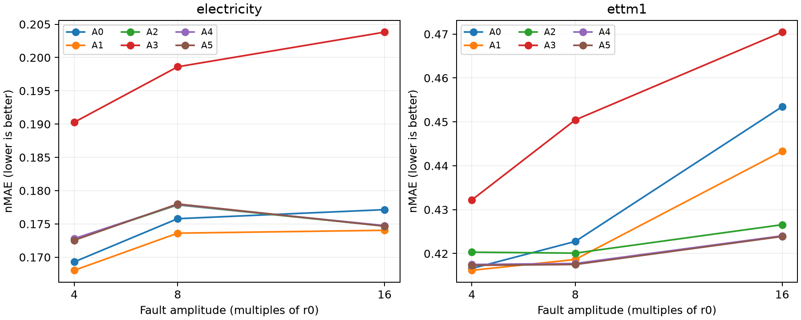
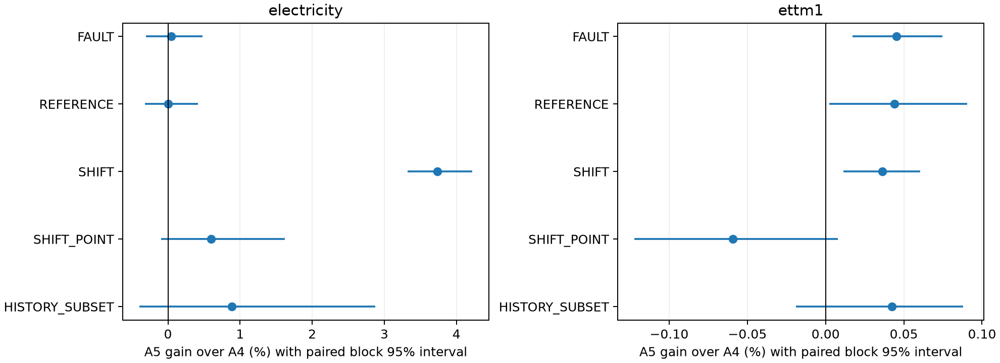

# 입력 오류 강건성·지속 변화 보존 PEFT 결과

실행 **COMPLETE**: 48/48 fits, 본학습 49,152 updates, smoke 24 updates. 실행 완료와 과학적 성공은 별개이며 논문 PASS로 선언하지 않는다.

## 먼저 읽을 결론

**학습과 검산은 완료했지만, A5를 다음 방법론 개발 후보로 유지할 근거는 부족하다. 이번 고정 후보는 종료하고 후속 집중 후보는0개로 남긴다.** 작은 개선을 모두 실패로 취급한 결론은 아니다. 아래의 제한된 추가 효과와 큰 손해를 함께 보았다.

- Electricity: A5의 A4 대비 오류 평균 이득은+0.0472%(95% block구간 −0.3058~+0.4798)로 불확실하다. 지속 변화 평균에서는+3.7382%(+3.3245~+4.2182)를 확인했고 두 seed 모두 같은 방향이다. 그러나 A1 대비 지속 변화 오차는103.7594% 증가했고 원자료·오류 평균도 각각3.0459%·1.8454% 증가했다. 부분 복원은 있었지만 강한 단순 대조를 넘지 못했다.
- ETTm1: A4 대비 오류 평균+0.0454%(+0.0173~+0.0746), 지속 변화+0.0362%(+0.0113~+0.0604)의 제한된 개선은 존재한다. 1% 같은 사후 문턱으로 이를 지운 것이 아니다. 다만 A1 대비 오류 개선+1.5181%의 구간은0을 포함하고, 지속 변화 오차는79.5626% 증가한다. A2보다도 지속 변화 오차가1.0861% 증가해 전체 추가 경로의 필요성이 확보되지 않았다.
- 알려진 단순 증강 A1은 Electricity에서 A0 대비 오류1.2523%, 원자료0.5019% 개선을 보였고 지속 변화에는0.5415% 손해가 있었다. 일부 조건 악화만으로 전체 FAIL을 주지 않고 이 손익을 유지한다. 이는 새로운 PEFT 방법의 신규성 증거가 아니다.

큰 손해는 특히 SHIFT8에 집중됐다. TRAIN의 shift amplitude는4, E의 shift는4와8이며 global clip6는 큰 변화를 제한한다. 현재 수치는 이 정보 손실과 불충분한 복원 설명에 부합하지만, 원인 전체를 독립적으로 입증한 추가 실험은 아니다. 결과를 보고 clip threshold·증강 세기·rank·LR를 바꾸지 않았다.

| source | arm | FAULT | REFERENCE | SHIFT4 | SHIFT8 |
| --- | --- | --- | --- | --- | --- |
| electricity | A1 | 0.171898 | 0.166201 | 0.193052 | 0.240541 |
| electricity | A4 | 0.175153 | 0.171263 | 0.201670 | 0.716126 |
| electricity | A5 | 0.175070 | 0.171263 | 0.200917 | 0.682569 |
| ettm1 | A1 | 0.426042 | 0.408460 | 0.524270 | 0.678732 |
| ettm1 | A4 | 0.419764 | 0.409982 | 0.539234 | 1.621692 |
| ettm1 | A5 | 0.419574 | 0.409802 | 0.539567 | 1.620576 |

A5의 V residual-zero 진단은 Electricity SHIFT8 오차를 약5.05% 악화시키지만 fault 일부는 오히려 약0.4~0.5% 줄인다. ETTm1 SHIFT8의 변화는 약0.149%다. 경로 의존성은 확인되지만 A4 또는 A1보다 전체적으로 우월하다는 증거를 대신하지 않는다. 조건별·seed별 진단은 A5_validation_diagnostic_effects.csv에 보존했다.

### 추가 비용

다음은 A5의 상대 비용 증가율이다(양수=비용 증가). 이번 측정에서 자원 이득은 없다. 각 값은 같은 장치에서 두 반복 모델을 측정한 기술 통계이며 일반적인 속도 우위의 확증 구간은 아니다.

| source | baseline | train_time_change_pct | inference_time_change_pct | train_memory_change_pct |
| --- | --- | --- | --- | --- |
| electricity | A1 | 4.034628 | 9.818372 | 1.348126 |
| electricity | A3 | 2.707746 | 2.849483 | 1.331048 |
| electricity | A4 | 0.176250 | 2.692249 | 0.016892 |
| ettm1 | A1 | 3.998416 | 9.252453 | 1.348126 |
| ettm1 | A3 | 4.915883 | 3.307565 | 1.331048 |
| ettm1 | A4 | 0.587927 | 3.405649 | 0.016892 |

### 단순 구성요소의 손익

양수는 오차 감소다. 한 조건의 악화를 모든 연구 실패로 전파하지 않고, 각각의 직접 대비를 남긴다.

| source | new | baseline | panel | gain_pct | ci_low_pct | ci_high_pct |
| --- | --- | --- | --- | --- | --- | --- |
| electricity | A1 | A0 | FAULT | 1.252313 | 0.757616 | 1.843268 |
| electricity | A2 | A1 | FAULT | -1.853477 | -7.441433 | 2.133120 |
| electricity | A3 | A1 | FAULT | -14.934001 | -20.596372 | -10.462972 |
| electricity | A1 | A0 | REFERENCE | 0.501858 | 0.103869 | 1.063733 |
| electricity | A2 | A1 | REFERENCE | -3.015059 | -9.052378 | 1.128065 |
| electricity | A3 | A1 | REFERENCE | -11.663870 | -16.656638 | -7.641993 |
| electricity | A1 | A0 | SHIFT | -0.541525 | -0.800396 | -0.299855 |
| electricity | A2 | A1 | SHIFT | -111.514692 | -128.268342 | -95.578419 |
| electricity | A3 | A1 | SHIFT | -12.469134 | -16.223919 | -9.146725 |
| ettm1 | A1 | A0 | FAULT | 1.136454 | -0.339845 | 2.501657 |
| ettm1 | A2 | A1 | FAULT | 0.871989 | -0.823786 | 2.611685 |
| ettm1 | A3 | A1 | FAULT | -5.867015 | -9.360742 | -2.566412 |
| ettm1 | A1 | A0 | REFERENCE | -0.251526 | -1.738144 | 1.117214 |
| ettm1 | A2 | A1 | REFERENCE | -0.941008 | -2.732798 | 0.628024 |
| ettm1 | A3 | A1 | REFERENCE | -2.824626 | -4.889388 | -0.875387 |
| ettm1 | A1 | A0 | SHIFT | -0.063149 | -1.734517 | 1.576831 |
| ettm1 | A2 | A1 | SHIFT | -77.633289 | -87.963756 | -66.729030 |
| ettm1 | A3 | A1 | SHIFT | -0.160456 | -1.423027 | 1.074291 |

### 해석과 실행 감사의 범위

bootstrap 구간은 선택된 모델과 이번 원점을 조건으로 한 nominal 시간 block 구간이다. LR/checkpoint 선택 불확실성이나 optimizer seed 모집단 전체를 포함하지 않는다. 이 모사 평균은 실제 오류 발생률 또는 실제 사건 보호 성능의 추정치가 아니다.

실행 중 보고서 의존성/상태 저장 오류와 재개 checkpoint 일정 오류를 고쳤다. 416-step 추가 V 진단은 선택에서 제외했으며 실제 완료 경로의 선택1024는 변하지 않았다. 추가 계산2,048 series는 resume_schedule_fix_receipt.json에 보존했다. optimizer를 재실행하지 않았고, 전체49,152 main +24 smoke updates를 확인했다. 수정 전 소스 원문은 implementation_revisions/에 당시 SHA256과 일치하게 보존했다. 이는 현재 미해결 오류나 성능 실패가 아니다.

## 질문·출처·정보 권한

입력만 틀린 측정 오류를 줄이는 과정에서 미래에도 이어지는 변화를 지워 버릴 수 있다. 이번 비교는 clip이 제거한 관측 차이를 작은 bounded residual 경로로 보존하는 것이 필요한지 직접 시험한다. 동일 과거에 서로 다른 미래가 가능한 식별성 한계는 해결했다고 주장하지 않는다.

유일한 계약은 PROTOCOL.md다. 누락된 참조 부품은 사용자의 “너가 직접 만들어서 해줘” 승인으로 직접 작성했다. 원래 첨부 코드를 확보한 것처럼 쓰지 않았다. 기존 표본·모델 cache를 hash 검증 후 재사용했고 이전 연구의 학습을 합치지 않았다.

TSFM-Biases의 공개 notebook과 TATO의 실제 코드를 읽었다. 전자는 표현 편향/오류 민감성의 선행이고 후자는 변환 검색의 직접 선행이다. 고정 clip/Hampel 비교가 TATO 전체 검색을 이겼다는 뜻은 아니다. [선행 경계](literature_boundary.md), [축소 재현 차이](reproduction_differences.md).

두 원천 모두 TRAIN256/V64/E128 distinct days, 첫 네 적격 채널, 입력512·미래64를 사용했다. Electricity는 512시간/64시간, ETTm1은128시간/16시간으로 물리적 horizon이 다르다. full eligible day를 먼저 균등하게 뽑고 phase roster를 독립 shuffle했다. 지표 분모는 raw TRAIN population std다. 날짜·scale·원자료 hash는 DATA_MANIFEST와 origin_audit에 있다.

원자료는 UNMODIFIED_REFERENCE이며 완전히 깨끗하다고 부르지 않는다. SYNTHETIC_MEASUREMENT_FAULT는 x만, SYNTHETIC_PERSISTENT_SHIFT는 x와y를 일관되게 바꾼다. HISTORY_TRIGGERED_SUBSET은 TRAIN90분위수 기준의 과거 태그이며 실제 사건 레이블이 아니다. 음수 전력 stress도 삭제·보정하지 않았다(`physical_stress_counts.json`). 실제 오류/사건 전문가 레이블은 없다. E는 이전에 사용한 개발 원천/기간이므로 새로운 독립 test가 아니다.

## 직접 비교와 원점수

A0는 point/burst 증강만 제외하고 shift/정답 노출은 같다. A1은 공통 증강, A2는 clip6, A3는 단회 Hampel25/4, A4는 clip+일반 bounded adapter, A5는 clip+제거된 관측 차이 adapter다. A0~A3은294,912, A4/A5는299,784 trainable parameters다. 여섯 군 모두 같은 LR2개·선택seed1개·반복seed2개·1024updates/fit을 썼다. 선택seed E를 주평균에 넣지 않았다. 체크포인트0도 합법 후보였고 불리한 군도 학습량을 줄이지 않았다.

아래는 반복 seed 평균 nMAE(작을수록 좋음). FAULT는 POINT/BURST 6조건 동가중, SHIFT는4/8 동가중이다. 계절반복의 quantile은 point를 반복한 퇴화 분포이며 학습 quantile 예측기와 혼동하지 않는다.

| source | arm | FAULT | REFERENCE | SHIFT | SHIFT_POINT |
| --- | --- | --- | --- | --- | --- |
| electricity | A0 | 0.174078 | 0.167039 | 0.215629 | 0.194900 |
| electricity | A1 | 0.171898 | 0.166201 | 0.216796 | 0.195793 |
| electricity | A2 | 0.175084 | 0.171212 | 0.458556 | 0.197171 |
| electricity | A3 | 0.197569 | 0.185586 | 0.243829 | 0.221856 |
| electricity | A4 | 0.175153 | 0.171263 | 0.458898 | 0.197123 |
| electricity | A5 | 0.175070 | 0.171263 | 0.441743 | 0.195939 |
| electricity | FROZEN_CLIP6 | 0.176235 | 0.172747 | 0.500571 | 0.283758 |
| electricity | FROZEN_HAMPEL | 0.215456 | 0.206479 | 0.354848 | 0.328194 |
| electricity | FROZEN_RAW | 0.174216 | 0.169059 | 0.293148 | 0.285354 |
| electricity | SEASONAL_DAY | 0.258628 | 0.231388 | 0.231388 | 0.241129 |
| ettm1 | A0 | 0.430939 | 0.407436 | 0.601122 | 0.560300 |
| ettm1 | A1 | 0.426042 | 0.408460 | 0.601501 | 0.561364 |
| ettm1 | A2 | 0.422327 | 0.412304 | 1.068467 | 0.549938 |
| ettm1 | A3 | 0.451038 | 0.419998 | 0.602467 | 0.535088 |
| ettm1 | A4 | 0.419764 | 0.409982 | 1.080463 | 0.556790 |
| ettm1 | A5 | 0.419574 | 0.409802 | 1.080072 | 0.557121 |
| ettm1 | FROZEN_CLIP6 | 0.415926 | 0.410389 | 1.389318 | 0.965750 |
| ettm1 | FROZEN_HAMPEL | 0.433444 | 0.410668 | 0.978400 | 0.922457 |
| ettm1 | FROZEN_RAW | 0.417559 | 0.405979 | 0.974891 | 0.990499 |
| ettm1 | SEASONAL_DAY | 0.546075 | 0.474019 | 4.981156 | 3.327205 |

### seed별 원점수

| source | arm | seed | FAULT | REFERENCE | SHIFT | SHIFT_POINT |
| --- | --- | --- | --- | --- | --- | --- |
| electricity | A0 | 81501 | 0.174314 | 0.167172 | 0.212370 | 0.193637 |
| electricity | A0 | 81502 | 0.173842 | 0.166906 | 0.218888 | 0.196163 |
| electricity | A1 | 81501 | 0.172026 | 0.166312 | 0.213620 | 0.195083 |
| electricity | A1 | 81502 | 0.171771 | 0.166090 | 0.219973 | 0.196502 |
| electricity | A2 | 81501 | 0.175208 | 0.171310 | 0.455690 | 0.196669 |
| electricity | A2 | 81502 | 0.174961 | 0.171113 | 0.461423 | 0.197673 |
| electricity | A3 | 81501 | 0.194818 | 0.182785 | 0.246587 | 0.219604 |
| electricity | A3 | 81502 | 0.200321 | 0.188387 | 0.241071 | 0.224109 |
| electricity | A4 | 81501 | 0.175302 | 0.171379 | 0.455359 | 0.196554 |
| electricity | A4 | 81502 | 0.175004 | 0.171148 | 0.462437 | 0.197692 |
| electricity | A5 | 81501 | 0.175168 | 0.171365 | 0.439037 | 0.195476 |
| electricity | A5 | 81502 | 0.174973 | 0.171161 | 0.444450 | 0.196403 |
| ettm1 | A0 | 81501 | 0.430751 | 0.408852 | 0.584089 | 0.551547 |
| ettm1 | A0 | 81502 | 0.431127 | 0.406019 | 0.618155 | 0.569054 |
| ettm1 | A1 | 81501 | 0.427114 | 0.409793 | 0.606815 | 0.553661 |
| ettm1 | A1 | 81502 | 0.424969 | 0.407128 | 0.596188 | 0.569066 |
| ettm1 | A2 | 81501 | 0.423731 | 0.412845 | 1.005495 | 0.542986 |
| ettm1 | A2 | 81502 | 0.420922 | 0.411764 | 1.131438 | 0.556889 |
| ettm1 | A3 | 81501 | 0.452738 | 0.422226 | 0.604337 | 0.532078 |
| ettm1 | A3 | 81502 | 0.449337 | 0.417770 | 0.600597 | 0.538099 |
| ettm1 | A4 | 81501 | 0.419794 | 0.410699 | 1.071015 | 0.552700 |
| ettm1 | A4 | 81502 | 0.419735 | 0.409264 | 1.089911 | 0.560880 |
| ettm1 | A5 | 81501 | 0.419654 | 0.410529 | 1.070277 | 0.552909 |
| ettm1 | A5 | 81502 | 0.419494 | 0.409074 | 1.089867 | 0.561332 |

### A5 직접 손익: 양수는 개선, 음수는 악화

7일 시간 block 2,000회 paired bootstrap이다. 한 원점의 채널·조건·모사seed를 독립 날짜로 세지 않고 optimizer seed도 각 draw 안에서 평균했다. 이는 두 optimizer seed 모집단의 불확실성을 충분히 추정한 CI가 아니다. 원천 간 p-value를 합치지 않았다.

| source | baseline | panel | gain_pct | ci_low_pct | ci_high_pct | origins |
| --- | --- | --- | --- | --- | --- | --- |
| electricity | A4 | FAULT | 0.047160 | -0.305777 | 0.479808 | 128 |
| electricity | A3 | FAULT | 11.387904 | 5.049476 | 17.039506 | 128 |
| electricity | A1 | FAULT | -1.845427 | -7.259900 | 1.871408 | 128 |
| electricity | A4 | REFERENCE | 0.000252 | -0.315841 | 0.415369 | 128 |
| electricity | A3 | REFERENCE | 7.717743 | 1.615680 | 13.072594 | 128 |
| electricity | A1 | REFERENCE | -3.045940 | -8.797761 | 0.831301 | 128 |
| electricity | A4 | SHIFT | 3.738225 | 3.324488 | 4.218220 | 128 |
| electricity | A3 | SHIFT | -81.169175 | -95.401737 | -67.961753 | 128 |
| electricity | A1 | SHIFT | -103.759403 | -119.851465 | -88.632253 | 128 |
| electricity | A4 | SHIFT_POINT | 0.600445 | -0.094117 | 1.620525 | 128 |
| electricity | A3 | SHIFT_POINT | 11.681875 | 8.650618 | 14.728842 | 128 |
| electricity | A1 | SHIFT_POINT | -0.074871 | -2.280903 | 1.956904 | 128 |
| electricity | A4 | HISTORY_SUBSET | 0.884951 | -0.396542 | 2.873983 | 50 |
| electricity | A3 | HISTORY_SUBSET | 5.800645 | -21.021485 | 30.455785 | 50 |
| electricity | A1 | HISTORY_SUBSET | -18.197853 | -44.569485 | 0.411171 | 50 |
| ettm1 | A4 | FAULT | 0.045356 | 0.017286 | 0.074620 | 128 |
| ettm1 | A3 | FAULT | 6.975863 | 3.280975 | 10.713376 | 128 |
| ettm1 | A1 | FAULT | 1.518122 | -0.565346 | 3.540450 | 128 |
| ettm1 | A4 | REFERENCE | 0.043910 | 0.002295 | 0.090520 | 128 |
| ettm1 | A3 | REFERENCE | 2.427729 | -1.109804 | 6.015177 | 128 |
| ettm1 | A1 | REFERENCE | -0.328322 | -2.543525 | 1.751109 | 128 |
| ettm1 | A4 | SHIFT | 0.036207 | 0.011298 | 0.060394 | 128 |
| ettm1 | A3 | SHIFT | -79.274955 | -89.642797 | -68.048358 | 128 |
| ettm1 | A1 | SHIFT | -79.562612 | -89.634716 | -68.661024 | 128 |
| ettm1 | A4 | SHIFT_POINT | -0.059327 | -0.122201 | 0.007801 | 128 |
| ettm1 | A3 | SHIFT_POINT | -4.117503 | -8.549127 | 0.019650 | 128 |
| ettm1 | A1 | SHIFT_POINT | 0.755883 | -2.680124 | 3.874210 | 128 |
| ettm1 | A4 | HISTORY_SUBSET | 0.042260 | -0.018945 | 0.087977 | 36 |
| ettm1 | A3 | HISTORY_SUBSET | -0.304524 | -5.478350 | 4.463757 | 36 |
| ettm1 | A1 | HISTORY_SUBSET | -2.248840 | -6.505428 | 2.160469 | 36 |

전체 필수 대비 A5/A2, A1/A0, A2/A1, A3/A1 및 원점별 차이는 `paired_effects.csv`, `scores_by_origin.csv`에 있다. raw MAE, 채널 NRMSE, TRAIN-scale 2-pinball, quantile crossing은 `scores_by_condition.csv`에 있다.

## 선택·구성요소·비용

LR와 checkpoint는 V의 REFERENCE/POINT8/BURST8/SHIFT4 동일 가중 nMAE만으로 고정했다. 두 반복 seed는 고른 LR를 사용하고 자기 V에서 checkpoint를 선택했다. 모든 학습·선택을 GLOBAL_EVALUATION_SEAL에 봉인한 뒤 모든 E 예측을 저장하고 E 정답을 채점했다. 선택 상세는 `selection_summary.csv`와 `LR_SELECTION.json`이다. step1024가 선택된 경로는 OPTIMIZATION_LIMITED이며 연장하지 않았다.

A5의 residual zero/고정 patch permutation 진단은 선택 모델의 V에서만 수행했고 optimizer0이다(`A5_validation_diagnostics.json`). 이 진단은 경로 의존성을 보일 뿐 A4보다 우수하다는 증거를 대신하지 않는다.

반복 seed 평균 자원 표: 학습 시간은 forward/backward/clip/optimizer이며 validation·checkpoint I/O와 구분한다. 추론은 같은 선택 checkpoint의 동일 E 입력을 대상으로 전처리·기기 전송·예측 저장 전 CPU 반환까지 포함한다. 학습 peak는 고정 학습 경로의 실제 측정치다.

| source | arm | train_seconds | validation_seconds | train_peak_allocated_mib | inference_seconds | inference_peak_allocated_mib |
| --- | --- | --- | --- | --- | --- | --- |
| electricity | A0 | 38.255487 | 3.931972 | 370.849121 | 3.881068 | 234.459961 |
| electricity | A1 | 38.406599 | 3.954926 | 370.849121 | 3.889463 | 234.459961 |
| electricity | A2 | 38.765637 | 4.069606 | 370.911621 | 4.036706 | 234.522461 |
| electricity | A3 | 38.902774 | 4.181427 | 370.911621 | 4.153006 | 234.522461 |
| electricity | A4 | 39.885864 | 4.152623 | 375.785156 | 4.159364 | 234.666504 |
| electricity | A5 | 39.956163 | 4.239798 | 375.848633 | 4.271345 | 234.729980 |
| ettm1 | A0 | 38.165496 | 3.924111 | 370.849121 | 3.879840 | 234.459961 |
| ettm1 | A1 | 38.469177 | 3.946090 | 370.849121 | 3.893711 | 234.459961 |
| ettm1 | A2 | 38.556995 | 4.054304 | 370.911621 | 4.062281 | 234.522461 |
| ettm1 | A3 | 38.132772 | 4.096928 | 370.911621 | 4.117777 | 234.522461 |
| ettm1 | A4 | 39.773495 | 4.144005 | 375.785156 | 4.113871 | 234.666504 |
| ettm1 | A5 | 40.007334 | 4.262987 | 375.848633 | 4.253975 | 234.729980 |

## 축소 재현·검산

공개 Bolt/T5 각49 series, 총98 series를 실행했다. T5는20 samples median, 내부 forward3,136회이며 이를 새로운3,136개 시나리오라고 세지 않는다. 미공개 patch-size1 모델은 SKIPPED_UNAVAILABLE_REFERENCE다. 아래는 축소 재현의 평균 MAE이며 논문 전체 Figure8 재현이 아니다.

| model | count | amplitude | mae |
| --- | --- | --- | --- |
| chronos-bolt-small | 0 | 0 | 0.313266 |
| chronos-bolt-small | 1 | 1 | 0.332311 |
| chronos-bolt-small | 1 | 10 | 0.327061 |
| chronos-bolt-small | 1 | 100 | 0.453388 |
| chronos-bolt-small | 16 | 1 | 0.352733 |
| chronos-bolt-small | 16 | 10 | 0.485728 |
| chronos-bolt-small | 16 | 100 | 0.517647 |
| chronos-t5-small | 0 | 0 | 0.004385 |
| chronos-t5-small | 1 | 1 | 0.004676 |
| chronos-t5-small | 1 | 10 | 0.004436 |
| chronos-t5-small | 1 | 100 | 0.010904 |
| chronos-t5-small | 16 | 1 | 0.040622 |
| chronos-t5-small | 16 | 10 | 0.035381 |
| chronos-t5-small | 16 | 100 | 0.217564 |

CPU 독립 검사10개, 12 source/arm의 실제2-update gradient·동결 본체/head 보존·복원·batch 순서 검사, 전체49,152 unique journal updates를 검산했다. E scalar 검산 2560행×2지표와 선택24개 모델의 저장 checkpoint 복원을 완료했다. tolerance는 사전 CPU rtol1e-10/atol1e-12와 FP32 TRAIN-scale max1e-5 또는 rtol1e-4이며 결과에 맞춰 늘리지 않았다. raw/모델/실행 소스 hash 및 실행 한도를 확인했다.

필수 미실행 범위: 없음. 정식 TATO 검색, 실제 품질 레이블, 독립 source/backbone 검증은 이번 승인 범위 밖이며 실행하지 않았다. 원자료·가중치·예측 cache는 로컬에 있어 GitHub만으로 수치 재실행이 완결되지는 않는다.

## 근거와 한계

- electricity: **UNCERTAIN**. 원점수·직접 대비·시간 block 구간을 함께 해석한다.
- ettm1: **ROBUSTNESS_SIGNAL_WITH_SHIFT_COST**. 원점수·직접 대비·시간 block 구간을 함께 해석한다.

오류 감소·원자료 성능·지속 변화 보존·자원 비용은 서로 별도다. 고정 clip/Hampel 설정이 각 전처리의 최적점이라는 뜻은 아니며 residual adapter의 신규성도 확보되지 않았다. 불리한 날짜·조건·seed를 제외하지 않았고 결과에 맞춘 추가 LR·방법·데이터·후속 학습은 없다.

## 전체 실행 자원과 종료 상태

GPU 감시 시작부터 마지막 감시까지 53.1분이었다. 여기에는 구현 복구·대기·재현·학습·평가가 포함되며 순수 학습 시간이라고 부르지 않는다. 본학습 계산 합계는 30.82분, V 검증 합계는 3.25분, 기록된 checkpoint I/O는 22.02초, E 예측 합계는 1.97분이다. 승인되지 않은 외부 compute 감지0회, 최소 GPU 여유 8,312MiB, 새 cache 2.12GiB로 안전·예산 한도를 지켰다. 허용 예외는 RustDesk뿐이다. 현재 학습 worker는 종료됐고 자동 후속 학습은 없다.
