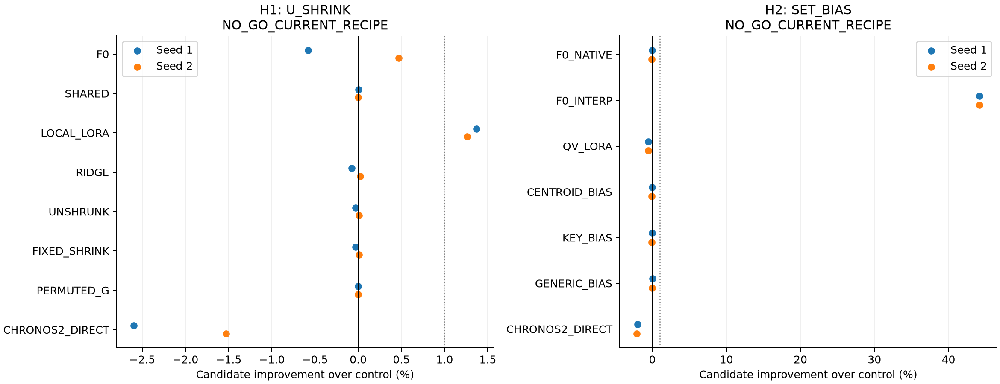
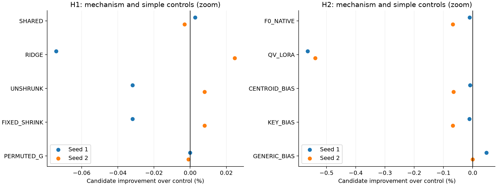
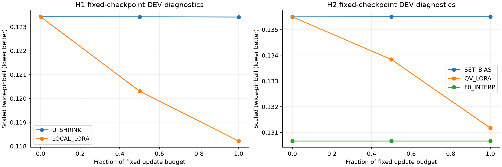
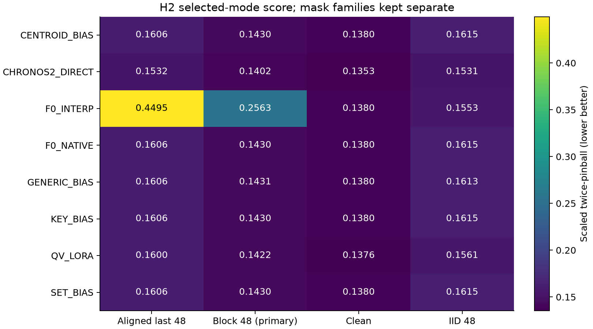

# 두 PEFT 가설의 고정 GO/NO-GO 실험

[확인] 학습·예측·검산을 완료했다. 기존 실험 결과와 합치지 않은 두 후보의 제한적 개발 screen이다.

**두 후보 모두 현재 구조로는 NO-GO다. 높은 논문 기준이나 CI 때문에 탈락한 결과가 아니다.** H1은 local LoRA보다 1.31% 좋았지만 공유 모델과 사실상 같았다. H2의 보간 대조 대비 44.19% 이득은 연속 결측에서 보간 대조가 크게 악화한 데 따른 것으로, native F0보다 추가 이득이 있다는 뜻이 아니다. H2는 native F0보다 0.039%, q/v LoRA보다 0.551% 나빴다.

H1의 두 block 불안정성으로 정한 gate는 단순 고정 축소·무축소보다 좋지 않았고, gate의 계열 대응을 바꿔도 사실상 같았다. H2의 관측집합 구조는 단순 centroid/key 보정보다 좋지 않았다. **작은 파라미터 수는 확인했으나 그 새 구조가 정확도에 기여한다는 근거는 얻지 못했다.**

## H1 — NO_GO_CURRENT_RECIPE

후보 `U_SHRINK`, DEV에서 고정한 대조 `LOCAL_LORA`. TEST 개선율은 seed별 **+1.369% / +1.259%**, 평균 **+1.314%**다. 8계열 중 6개에서 평균 점수가 좋았다.
날짜 block 조건부 95% CI는 [+0.166, +2.675]%다. 이 구간은 고정 계열과 두 seed에 조건부이며 seed 모집단 신뢰구간이 아니다. CI의 0 포함만으로 기각하지 않았다.

메커니즘 조건 통과: False. 두 seed 모두 비양수인 필수 대조: PERMUTED_G. 1% 초과 우세한 다른 Bolt 대조: 없음.
사전고정 UNDERTRAINED flag: False. 이 flag가 없다고 수렴을 증명하지는 않는다.

- F0 대비 평균 -0.055% (seed -0.579% / +0.470%).
- SHARED 대비 평균 -0.000% (seed +0.003% / -0.003%).
- LOCAL_LORA 대비 평균 +1.314% (seed +1.369% / +1.259%).
- RIDGE 대비 평균 -0.025% (seed -0.074% / +0.025%).
- UNSHRUNK 대비 평균 -0.012% (seed -0.032% / +0.008%).
- FIXED_SHRINK 대비 평균 -0.012% (seed -0.032% / +0.008%).
- PERMUTED_G 대비 평균 -0.001% (seed -0.000% / -0.001%).
- CHRONOS2_DIRECT 대비 평균 -2.062% (seed -2.597% / -1.528%).

Chronos-2보다 평균 2.062% 나빴다. 실용 우위를 확보하지 못했고 GO 자체도 아니므로 `MECHANISM_SIGNAL_ONLY` 성공 라벨도 부여하지 않는다. DECISIONS.json의 go_label은 null이다.

H1은 shared LoRA를 고정 SVD 기저로 분해한 뒤 계열당 288개 계수만 개인화했다. 두 block의 차이를 불안정성 proxy로 사용했다. 정확한 posterior uncertainty 추정이 아니다.
공유 모델보다 나빠진 계열 비율: U_SHRINK 50.0%, UNSHRUNK 50.0%, FIXED_SHRINK 50.0%, LOCAL_LORA 75.0%, RIDGE 25.0%.

- seed 92251: EVAL gate 범위 0.0432–0.0825, 평균 0.0662. g의 큰/작은 값만으로 uncertainty가 정확히 추정됐다고 해석하지 않는다.
- seed 92252: EVAL gate 범위 0.1050–0.2799, 평균 0.2098. g의 큰/작은 값만으로 uncertainty가 정확히 추정됐다고 해석하지 않는다.

## H2 — NO_GO_CURRENT_RECIPE

후보 `SET_BIAS`, DEV에서 고정한 대조 `F0_INTERP`. TEST 개선율은 seed별 **+44.208% / +44.176%**, 평균 **+44.192%**다. 8계열 중 8개에서 평균 점수가 좋았다.
날짜 block 조건부 95% CI는 [+35.397, +51.672]%다. 이 구간은 고정 계열과 두 seed에 조건부이며 seed 모집단 신뢰구간이 아니다. CI의 0 포함만으로 기각하지 않았다.

메커니즘 조건 통과: False. 두 seed 모두 비양수인 필수 대조: KEY_BIAS, CENTROID_BIAS. 1% 초과 우세한 다른 Bolt 대조: 없음.
사전고정 UNDERTRAINED flag: False. 이 flag가 없다고 수렴을 증명하지는 않는다.

- F0_NATIVE 대비 평균 -0.039% (seed -0.011% / -0.068%).
- F0_INTERP 대비 평균 +44.192% (seed +44.208% / +44.176%).
- QV_LORA 대비 평균 -0.551% (seed -0.564% / -0.538%).
- CENTROID_BIAS 대비 평균 -0.037% (seed -0.009% / -0.066%).
- KEY_BIAS 대비 평균 -0.040% (seed -0.011% / -0.068%).
- GENERIC_BIAS 대비 평균 +0.023% (seed +0.047% / -0.000%).
- CHRONOS2_DIRECT 대비 평균 -2.049% (seed -2.019% / -2.078%).

Chronos-2보다 평균 2.049% 나빴다. 실용 우위를 확보하지 못했고 GO 자체도 아니므로 `MECHANISM_SIGNAL_ONLY` 성공 라벨도 부여하지 않는다. DEV는 CLEAN/IID48, TEST primary는 BLOCK48로 의도적으로 다르며, 보간 대조의 DEV 우위가 BLOCK48에 유지되지 않았다. TEST로 대조를 다시 고르지는 않았다.

H2는 마지막 encoder attention의 24개 계수로 관측 위치 집합을 반영했다. CLEAN에서 모든 bias arm, patch 정렬 결측에서 SET은 학습 후에도 raw F0 예측을 보존했다. 보정 모드가 다르면 최종 점수는 다를 수 있다. BLOCK48이 primary이며 IID48/CLEAN/ALIGNED는 별도로 보고한다.

## 그림

위 확대 그림은 필수 메커니즘 대조를 별도로 보여준다. 전체 대조군과 큰 보간 효과는 첫 그림과 원표에 그대로 보존했다.

## 실행·선택·비용

총 108 main fits / 7,680 main optimizer updates, 별도 18 smoke updates를 사용했다. H1은 98 fits / 5,120 updates, H2는 10 fits / 2,560 updates다. H1의 두 block 불안정성 추정 비용을 숨기지 않고 모두 포함했다. 선택 전용 seed는 없으며 지정된 두 seed만 EVAL 평균에 넣었다.
checkpoint는 고정 마지막 단계다. LR·rank·mask family 추가 탐색은 없었다. raw/CAL, H1 고정 shrink 계수, DEV baseline과 EVAL의 CAL 계수를 모두 봉인한 뒤 TEST 예측을 만들었다. PERMUTED_G는 U와 같은 raw/CAL 선택을 사용했다.
GPU 단계 장부: H1 4.95분, H2 2.15분. 초기 P0·환경 검사 시간은 별도 overhead이며 이 수치의 학습 단계와 혼동하지 않는다.
fit 자원표의 GPU peak는 동시에 상주한 모델을 포함하는 process 관측값이다. 공정한 단독 모델 latency 또는 메모리 우위로 해석하지 않는다. 288/24개 계수 감소와 실제 시스템 비용은 구분한다.
q/v LoRA는 294,912개, H1 개인화는 288개, H2 bias는 24개의 학습 파라미터를 사용한다. H1 배포는 pretrained backbone 외에 공유 SVD 기저가 필요하므로 개인화 계수 수를 전체 저장량으로 표현하지 않는다. [arm별 비용 합계](resource_summary.csv)에 공유 학습과 BLOCK_A/B 추정 비용을 구분했다.

## 검산과 적용 범위

[검산](VERIFICATION.json), [고정 선택](ALL_SELECTIONS_SEALED.json), [결정 상세](DECISIONS.json), [P0 검사](P0_COMPLETE.json), [실행 중 전처리 구현 사건](IMPLEMENTATION_INCIDENT.json)을 함께 남겼다. 무효인 선행 P0는 원점/반복 설정 오류로 폐기했으며 학습 0회였다. 올바른 P0와 smoke 후 본학습을 시작했다. 구현 문제를 성능 실패로 세지 않았다.
[CPU 사후 감사](POSTRUN_AUDIT.json)에서 선택·보정 64건, TEST 예측 파일 77개, 원자료 truth·mask 일치, NumPy gate 산식, 전체 cache hash를 추가로 확인했다. 추가 model forward와 optimizer update는 0이다.
이전 연구에 노출된 Electricity 한 source, EVAL 8계열 ×14일, seed 두 개의 개발 screen이다. 가려진 context truth는 모델·보간·normalization에 쓰지 않았다. 새 source 검증, 자연 결측 일반화, 신규성, 논문 PASS는 확인하지 않았다. 부정결과는 현재 고정 recipe의 판단이며 rollout PEFT나 TSFM PEFT 전체의 반증이 아니다.
공식 Chronos-2는 native direct 24-step API를 사용하고 cross-series learning을 끈 별도 참조다. 본 실험은 rollout 비교가 아니며 현재 Chronos 공식 장기 branching 방식에 관한 새 주장을 하지 않는다.

## 자료

- [모든 origin·mask raw/CAL 점수](origin_mask_scores.csv), [계열 점수](series_scores.csv), [seed 점수](seed_scores.csv)
- [seed 효과](seed_effects.csv), [계열 효과](series_effects.csv), [효과·CI 요약](effect_summary.csv)
- [fit 자원](fit_resources.csv), [GPU 단계 자원](phase_resources.csv), [학습 장부](OPTIMIZER_LEDGER.json)
- [파일 provenance](MANIFEST.json), [native 구조 보존](STRUCTURAL_INVARIANTS.json)

raw data, model weights, optimizer/checkpoint, prediction arrays는 Git 제외 로컬 cache에 보존한다. GitHub의 코드·점수·hash만으로 원본 cache 없이 모든 수치를 재생할 수 있다고 주장하지 않는다. 두 후보 판정 후 자동 후속 실험 없이 종료한다.
