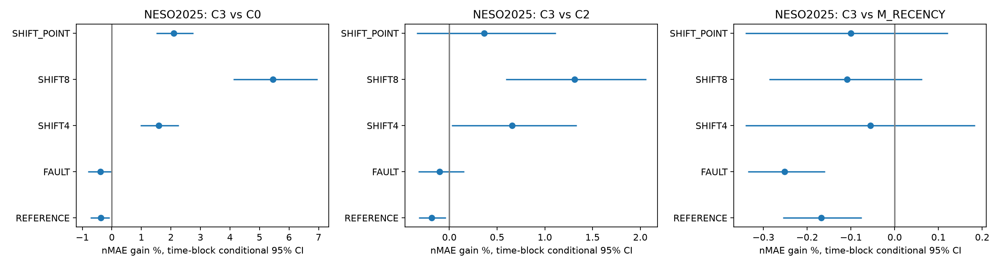
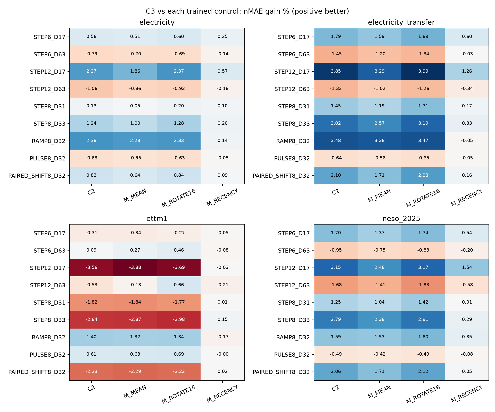
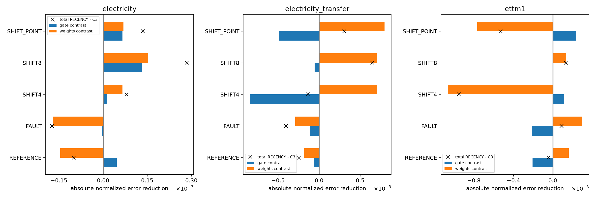

# C3 논문 근거 추가 검증

실행 COMPLETE. 새 학습 0회·optimizer update 0회, 추가 예측 111view를 모두 저장하고 채점·검산했다. 기존 58-fit 연구와 C3 설계를 보존했다. 이 후속은 사용자의 2026-09-18 추가 검증 요청에 따라 별도 봉인했다.

**논문 근거의 일부는 강화됐고, 고유 기전 주장은 약해졌다.** 외부 국가 전력 수요인 NESO2025의 SHIFT8에서 C3는 B0보다 5.458904%, 일반 어댑터 C2보다 1.312049% 낮은 평균 nMAE를 보였다. 그러나 단순 RECENCY 대비 이득은 −0.108565%이고 날짜 95% 구간은 [−0.286604, 0.062692]%로, 우위를 확인하지 못했다. 세 공동 주 비교 중 RECENCY 비교가 지지되지 않아 공동 우위 확인은 미충족이다.

기존 전력 16계열에서 C3/RECENCY의 작은 이득은 고정 가중치 분해상 gate 직접 효과보다 학습된 가중치 차이가 설명했다. 이전의 ‘전력에서 일부 위치 정보 지지’는 관찰된 전체 학습 절차의 차이로 보존하되, 실제 추론 시 지속 위치 gate가 필수라는 해석은 철회한다. 기존 양성 관찰과 ETT·원자료·오류·긴 변화의 손해는 모두 유지한다.

## 이번에 해결하려 한 질문

이전 연구에서 남은 핵심은 RECENCY 대비 작은 차이, ETT 악화, 반복 노출 자료다. 같은 C3를 계속 튜닝해 양성으로 바꾸는 작업은 하지 않았다. 기존 학습 대조의 변화 형태 평가27view, 가중치 고정 gate교환36view, NESO 외부 원천42모델view+6출력대조를 수행했다. 주 질문과 데이터·코드·checkpoint는 [PROTOCOL.md](PROTOCOL.md), [SEAL.json](SEAL.json)에 채점 전 기록했다.

## 외부 원천의 실제 독립성 범위

NESO2025 National Demand(ND) 한 계열의17,520반시간값을UTC시간별MW평균8,760개로 변환했다. 서머타임의46/50구간과중복/결측을검사했다. target sigma는2025상반기만, E128개 서로다른날짜는하반기전체를균등선정했다. target model fitting·V선택은0회, Electricity의LR/checkpoint/alpha/beta를그대로사용했다. B0는원래전력source에적응한모델이며NESO에잘학습된기준선이라는뜻은아니다. 이번에는NESO전용B0학습과미적응foundation(F0)추가대조를하지않았으므로source-adaptation자체의손익과추가어댑터의손익을완전히분리한외부benchmark라고주장하지않는다. 표본은 [ORIGIN_AUDIT.csv](ORIGIN_AUDIT.csv)에 있다.

현재localweight/config는2024-11-28공개파일과동일하다. 따라서2025의해당관측값은backbone학습뒤시점임을확인했다. 프로젝트의기존추적text4,443파일에서는NESO사용키워드를찾지못했고source PEFT TRAIN은기존Electricity/ETT로보존됐다. 이전연도의같은provider자료노출과외부/기록밖사람의노출까지배제하지는못한다. 새평가원천이지만새로수집한자료가아니며, 국가집계1계열을여러독립meter로세지않는다. 실제오류/사건레이블은없다. 제공자가수정한과거outturn이고당시공개된as-of vintage를복원한것은아니다. [자료감사](EXTERNAL_SOURCE_AUDIT.json), [공식자료](https://www.neso.energy/data-portal/historic-demand-data/historic_demand_data_2025), [품질·수정안내](https://www.neso.energy/data-portal/historic-demand-data).

## 외부 전이 결과

NESO SHIFT8의 세 seed 평균 nMAE는 C0=0.328668, C2=0.314858, C3=0.310727, RECENCY=0.310390이다. 일반 어댑터의 C2/C0 이득 4.201987%와 C3의 C2 대비 추가 이득 1.312049%를 구분한다. C3/C0의 날짜 95% 구간은 [4.107573, 6.958047]%, C3/C2는 [0.590491, 2.061204]%다. 평균 이득이 외부 원천에서도 확인됐다는 좁은 주장은 가능하다.

다만 C3/C2의 seed별 효과는 +0.744523%, +3.590725%, −0.558328%다. C3/RECENCY는 +0.013250%, +0.062256%, −0.407416%다. 세 번째 seed를 제외하지 않고 전체 평균과 함께 보고한다. NESO의 원자료 REFERENCE에서는 B0보다 0.378495%, FAULT에서는 0.392030% 악화했다. RECENCY 대비로도 각각 0.167419%, 0.251225% 악화했다. 외부 자료의 평균 C2 대비 이득, RECENCY 대비 고유 추가 가치, 손해가 없다는 주장은 각각 별도로 판단해야 한다.

SHIFT8 원점수·직접대비(세seed평균):

| condition | new | baseline | new_nmae | baseline_nmae | gain_pct | ci_low_pct | ci_high_pct | bonferroni3_low_pct | bonferroni3_high_pct |
| --- | --- | --- | --- | --- | --- | --- | --- | --- | --- |
| SHIFT8 | C2 | C0 | 0.314858 | 0.328668 | 4.201987 | 2.499824 | 5.938271 | nan | nan |
| SHIFT8 | C3 | C0 | 0.310727 | 0.328668 | 5.458904 | 4.107573 | 6.958047 | nan | nan |
| SHIFT8 | C3 | C2 | 0.310727 | 0.314858 | 1.312049 | 0.590491 | 2.061204 | nan | nan |
| SHIFT8 | C3 | M_MEAN | 0.310727 | 0.313904 | 1.012134 | 0.335502 | 1.729108 | 0.187742 | 1.894403 |
| SHIFT8 | C3 | M_ROTATE16 | 0.310727 | 0.314825 | 1.301823 | 0.576190 | 2.079650 | 0.421719 | 2.257585 |
| SHIFT8 | C3 | M_RECENCY | 0.310727 | 0.310390 | -0.108565 | -0.286604 | 0.062692 | -0.327393 | 0.094454 |
| SHIFT8 | C3 | C2_SHRINK | 0.310727 | 0.315112 | 1.391669 | 0.855790 | 1.938897 | nan | nan |
| SHIFT8 | C3 | C0_BIAS | 0.310727 | 0.328376 | 5.374867 | 4.063186 | 6.837523 | nan | nan |

각 seed의 공동 주 비교:

| seed | new | baseline | new_nmae | baseline_nmae | gain_pct |
| --- | --- | --- | --- | --- | --- |
| 81551 | C3 | C0 | 0.307704 | 0.323813 | 4.974922 |
| 81551 | C3 | C2 | 0.307704 | 0.310012 | 0.744523 |
| 81551 | C3 | M_RECENCY | 0.307704 | 0.307745 | 0.013250 |
| 81552 | C3 | C0 | 0.316668 | 0.341956 | 7.394877 |
| 81552 | C3 | C2 | 0.316668 | 0.328463 | 3.590725 |
| 81552 | C3 | M_RECENCY | 0.316668 | 0.316866 | 0.062256 |
| 81553 | C3 | C0 | 0.307808 | 0.320236 | 3.881014 |
| 81553 | C3 | C2 | 0.307808 | 0.306099 | -0.558328 |
| 81553 | C3 | M_RECENCY | 0.307808 | 0.306559 | -0.407416 |

원자료·오류·다른 변화의 손익:

| condition | new | baseline | new_nmae | baseline_nmae | gain_pct | ci_low_pct | ci_high_pct |
| --- | --- | --- | --- | --- | --- | --- | --- |
| FAULT | C3 | C0 | 0.235983 | 0.235061 | -0.392030 | -0.815086 | 0.006568 |
| FAULT | C3 | C2 | 0.235983 | 0.235739 | -0.103433 | -0.323183 | 0.155695 |
| FAULT | C3 | M_RECENCY | 0.235983 | 0.235391 | -0.251225 | -0.335309 | -0.159082 |
| REFERENCE | C3 | C0 | 0.226192 | 0.225339 | -0.378495 | -0.720152 | -0.075069 |
| REFERENCE | C3 | C2 | 0.226192 | 0.225771 | -0.186292 | -0.321372 | -0.039066 |
| REFERENCE | C3 | M_RECENCY | 0.226192 | 0.225814 | -0.167419 | -0.255531 | -0.075238 |
| SHIFT4 | C3 | C0 | 0.295645 | 0.300414 | 1.587516 | 0.968743 | 2.263972 |
| SHIFT4 | C3 | C2 | 0.295645 | 0.297594 | 0.654992 | 0.023821 | 1.332634 |
| SHIFT4 | C3 | M_RECENCY | 0.295645 | 0.295481 | -0.055489 | -0.341072 | 0.183351 |
| SHIFT8 | C3 | C0 | 0.310727 | 0.328668 | 5.458904 | 4.107573 | 6.958047 |
| SHIFT8 | C3 | C2 | 0.310727 | 0.314858 | 1.312049 | 0.590491 | 2.061204 |
| SHIFT8 | C3 | M_RECENCY | 0.310727 | 0.310390 | -0.108565 | -0.286604 | 0.062692 |
| SHIFT_POINT | C3 | C0 | 0.327455 | 0.334485 | 2.101817 | 1.509111 | 2.765198 |
| SHIFT_POINT | C3 | C2 | 0.327455 | 0.328647 | 0.362632 | -0.342992 | 1.115093 |
| SHIFT_POINT | C3 | M_RECENCY | 0.327455 | 0.327127 | -0.100187 | -0.340919 | 0.121320 |

NESO모든조건/군/seed 원점수는 [RAW_SCORES.csv](RAW_SCORES.csv)에 있다. 점수는자체nMAE이며gain은평균오차비율이다. 표의날짜CI는고정3seed와관측기간에조건부이고source모집단·seed모집단구간은아니다. 더낮은오차를보인조건만선별하지않았다.

## 단순 대조는 어디까지 충분한가

NESO의 SHIFT8에서 MEAN/ROTATE16 대비 평균 이득은 각각 1.012134%, 1.301823%지만 RECENCY를 넘지는 못했다. 관측 지속성 gate만의 독특한 추론 원리를 입증했다고 쓰기 어렵다. RECENCY는 등록된 주 조건에서 유력한 단순 설명이다. 다만 CI에 0이 포함됐다고 수학적 동등성이 증명된 것은 아니다.

변화 형태에 따른 차이는 남는다. NESO C3/RECENCY는 STEP6_D17 +0.539390%, STEP12_D17 +1.542027%, RAMP8_D32 +0.349722%, STEP8_D33 +0.290481%다. STEP6_D63 −0.195665%, STEP12_D63 −0.582552%, PULSE8_D32 −0.079107%에서는 역전한다. 기존 전력 16계열에서도 D17의 양성과 D63·PULSE의 음성을 함께 확인했다. 이 형태들은 사전에 포함했지만 주 질문은 SHIFT8이므로, D17의 더 좋은 결과를 새로운 주 성공으로 승격하지 않는다. 형태별 초기 입력·부호·표본은 기존 봉인에 따른다. standard SHIFT8과 64원점의 ±균형 PAIRED_SHIFT8은 표본과 draw가 달라 동일 점수를 기대하지 않는다.

등록된 모든 형태에서 C3의 각 대조 대비 gain(%):

| panel | condition | C2 | M_MEAN | M_RECENCY | M_ROTATE16 |
| --- | --- | --- | --- | --- | --- |
| electricity | PAIRED_SHIFT8_D32 | 0.827829 | 0.642823 | 0.087675 | 0.836198 |
| electricity | PULSE8_D32 | -0.625884 | -0.549508 | -0.047032 | -0.630592 |
| electricity | RAMP8_D32 | 2.376551 | 2.276509 | 0.140649 | 2.334108 |
| electricity | STEP12_D17 | 2.271120 | 1.860530 | 0.566059 | 2.367169 |
| electricity | STEP12_D63 | -1.060613 | -0.858471 | -0.184550 | -0.929258 |
| electricity | STEP6_D17 | 0.563699 | 0.509525 | 0.253162 | 0.595869 |
| electricity | STEP6_D63 | -0.793860 | -0.698265 | -0.140821 | -0.685607 |
| electricity | STEP8_D31 | 0.125502 | 0.049929 | 0.100333 | 0.201267 |
| electricity | STEP8_D33 | 1.244832 | 1.002864 | 0.204229 | 1.282138 |
| electricity_transfer | PAIRED_SHIFT8_D32 | 2.099476 | 1.705091 | 0.162067 | 2.234816 |
| electricity_transfer | PULSE8_D32 | -0.636588 | -0.559761 | -0.053540 | -0.650146 |
| electricity_transfer | RAMP8_D32 | 3.479899 | 3.377547 | -0.054809 | 3.471769 |
| electricity_transfer | STEP12_D17 | 3.847744 | 3.290137 | 1.262052 | 3.988899 |
| electricity_transfer | STEP12_D63 | -1.321573 | -1.024778 | -0.339968 | -1.261617 |
| electricity_transfer | STEP6_D17 | 1.794843 | 1.588637 | 0.596769 | 1.885316 |
| electricity_transfer | STEP6_D63 | -1.454656 | -1.201498 | -0.025319 | -1.337074 |
| electricity_transfer | STEP8_D31 | 1.452682 | 1.185382 | 0.168312 | 1.710381 |
| electricity_transfer | STEP8_D33 | 3.022633 | 2.574110 | 0.326765 | 3.192441 |
| ettm1 | PAIRED_SHIFT8_D32 | -2.233505 | -2.289557 | 0.023576 | -2.222848 |
| ettm1 | PULSE8_D32 | 0.608409 | 0.628296 | -0.001623 | 0.693950 |
| ettm1 | RAMP8_D32 | 1.399259 | 1.320036 | -0.168206 | 1.341513 |
| ettm1 | STEP12_D17 | -3.556374 | -3.876265 | -0.026973 | -3.689750 |
| ettm1 | STEP12_D63 | -0.529325 | -0.132128 | -0.205653 | 0.657159 |
| ettm1 | STEP6_D17 | -0.312522 | -0.342168 | -0.053901 | -0.272100 |
| ettm1 | STEP6_D63 | 0.089606 | 0.269921 | -0.082945 | 0.459128 |
| ettm1 | STEP8_D31 | -1.819617 | -1.842540 | 0.013833 | -1.772429 |
| ettm1 | STEP8_D33 | -2.842671 | -2.873481 | 0.151713 | -2.984002 |
| ettm2 | PAIRED_SHIFT8_D32 | 0.048676 | nan | nan | nan |
| ettm2 | PULSE8_D32 | 0.130034 | nan | nan | nan |
| ettm2 | RAMP8_D32 | -0.957061 | nan | nan | nan |
| ettm2 | STEP12_D17 | -0.864853 | nan | nan | nan |
| ettm2 | STEP12_D63 | -0.363705 | nan | nan | nan |
| ettm2 | STEP6_D17 | -0.144538 | nan | nan | nan |
| ettm2 | STEP6_D63 | -0.042972 | nan | nan | nan |
| ettm2 | STEP8_D31 | 0.075289 | nan | nan | nan |
| ettm2 | STEP8_D33 | -0.047355 | nan | nan | nan |
| neso_2025 | PAIRED_SHIFT8_D32 | 2.057859 | 1.706017 | 0.054901 | 2.116847 |
| neso_2025 | PULSE8_D32 | -0.486201 | -0.416225 | -0.079107 | -0.492084 |
| neso_2025 | RAMP8_D32 | 1.590879 | 1.529096 | 0.349722 | 1.800588 |
| neso_2025 | STEP12_D17 | 3.153820 | 2.460917 | 1.542027 | 3.165852 |
| neso_2025 | STEP12_D63 | -1.676804 | -1.412232 | -0.582552 | -1.831319 |
| neso_2025 | STEP6_D17 | 1.700304 | 1.367633 | 0.539390 | 1.737138 |
| neso_2025 | STEP6_D63 | -0.951403 | -0.750994 | -0.195665 | -0.832748 |
| neso_2025 | STEP8_D31 | 1.245836 | 1.035386 | 0.013420 | 1.424101 |
| neso_2025 | STEP8_D33 | 2.792740 | 2.378547 | 0.290481 | 2.912153 |

형태범위의다수비교는탐색적이다. 모든정의된형태를남기고최대이득한칸으로확증을선언하지않는다. PULSE/PAIRED_SHIFT8은같은입력과다른미래이므로이를완벽히구분하는것을요구하지않는다. 합성강도는실제변화발생분포가아니며음수수요같은물리적부적합값을포함할수있는수학적스트레스다.

## 가중치와 gate의 분해

기존 전력 16계열의 SHIFT8에서 RECENCY−C3의 총 nMAE 이득은 약 +0.000648이다. 대칭 2×2 분해의 gate 항은 약 −0.000054, 가중치 항은 약 +0.000703이다. 해당 두 학습 함수에서는 C3 gate로 바꾸는 것만으로 이득을 설명하지 못했다. STEP12_D17의 전이 총 이득 +0.006923 중 gate 항은 +0.000134, 가중치 항은 +0.006789로, 여기서도 후자가 더 크다. 원래 네 전력 계열의 SHIFT8은 gate 항 +0.000131, 가중치 항 +0.000153으로 양쪽에 기여가 있어 모든 원천에서 gate가 무용하다고 단정할 수는 없다.

‘학습 중의 보호 방식이 다른 가중치를 만들었을 수 있다’는 가설이 남는다. 실제 C3/RECENCY 여섯 source-seed 쌍은 선택 학습률과 step이 모두 같았으므로, 이번 가중치 차이를 서로 다른 학습률이나 선택 시점으로 설명해서는 안 된다. 그러나 고정된 두 함수의 분해만으로 학습 중 어떤 표현이나 gradient가 이득을 만들었는지까지 규명한 것은 아니다. NESO에는 gate 교환을 추가하지 않았으므로 이 기전 분해를 NESO에서 직접 검사했다고 확장하지 않는다.

A=C3weights/C3gate,B=C3weights/RECENCYgate,C=RECENCYweights/C3gate,D=RECENCYweights/RECENCYgate. gate효과=((B−A)+(D−C))/2,weight효과=((C−A)+(D−B))/2이며합은D−A다. 아래단위는gain%가아닌절대nMAE감소이고양수가C3쪽유리다. 두교차구성은사후기전검사용이며후보로선택/배포하지않는다. 이미학습된두함수의분해이므로학습과정의순수인과효과가아니다. 실제C3/RECENCY여섯source-seed쌍은선택LR와step이모두같음을추가감사했다(MATCHED_SELECTION_AUDIT.json). 따라서이번쌍의weight항을LR/step차이로설명하면안된다. 같은초기값·입력순서·학습기회에서mask가다른학습경로를만드는것과추론시mask직접효과를구분한다. 다만훈련중어떤표현/gradient가그차이를만들었는지까지이분해가규명한것은아니다.

| panel | condition | total_nmae_benefit | gate_nmae_benefit | weights_nmae_benefit | interaction |
| --- | --- | --- | --- | --- | --- |
| electricity | FAULT | -0.000173 | -0.000003 | -0.000170 | -0.000055 |
| electricity | REFERENCE | -0.000100 | 0.000046 | -0.000146 | -0.000054 |
| electricity | SHIFT4 | 0.000080 | 0.000014 | 0.000065 | -0.000119 |
| electricity | SHIFT8 | 0.000284 | 0.000131 | 0.000153 | -0.000028 |
| electricity | SHIFT_POINT | 0.000135 | 0.000066 | 0.000069 | -0.000115 |
| electricity_transfer | FAULT | -0.000403 | -0.000113 | -0.000290 | 0.000029 |
| electricity_transfer | REFERENCE | -0.000245 | -0.000062 | -0.000183 | 0.000012 |
| electricity_transfer | SHIFT4 | -0.000138 | -0.000843 | 0.000705 | -0.000350 |
| electricity_transfer | SHIFT8 | 0.000648 | -0.000054 | 0.000703 | 0.000018 |
| electricity_transfer | SHIFT_POINT | 0.000305 | -0.000491 | 0.000796 | -0.000323 |
| ettm1 | FAULT | 0.000087 | -0.000212 | 0.000299 | -0.000060 |
| ettm1 | REFERENCE | -0.000044 | -0.000205 | 0.000162 | -0.000133 |
| ettm1 | SHIFT4 | -0.000953 | 0.000113 | -0.001066 | -0.000099 |
| ettm1 | SHIFT8 | 0.000130 | -0.000003 | 0.000132 | -0.000073 |
| ettm1 | SHIFT_POINT | -0.000529 | 0.000237 | -0.000766 | -0.000129 |

전체형태별분해는 [FACTORIAL_DECOMPOSITION.csv](FACTORIAL_DECOMPOSITION.csv)에 있다. 기존동일LR/1,024-update결과는새추론없이재집계했다: [재사용고정예산대조](REUSED_FIXED1024_COMPARISONS.csv), [선택조건감사](MATCHED_SELECTION_AUDIT.json). 주결과는여전히봉인된selected모델이다.

## 검산과 비용

CPU5검사,105개모델view의원래선택forward일치·고정가중치보존·재로드검사,새원점수438,336행,독립scalar 3,258행×2지표,효과785행재계산을통과했다. scalar범위는모든새view/조건의첫·마지막원점과첫·마지막채널및두draw이며모든행scalar검산은아니다. [검산](VERIFICATION.json), [모델검사](MODEL_CHECKS.json).

실행wall 8.11분,기록된추론·저장시간합344.51초,최소GPU여유8438MiB,허용되지않은외부compute표본0개다. alias 6view는C1step0/C0동치확인후재사용했다. output6view는원래전력V의값으로만들었으며SHRINK의배포비용은여전히두forward다. 기존가중치/자료의학습비용은이전보고서에분리돼있다. 원래guard의external_compute_samples는승인된RustDesk도포함하므로미승인사용은별도필터로계산했다. [자원](RESOURCE_REPORT.csv), [비용](COST.json).

GitHub에는코드·봉인·원점수·manifest·검산을올리며모델weights·원시CSV·predictioncache는로컬보존한다. 공개저장소만으로로컬cache없이완전한수치재현이가능하다고주장하지않는다.

## 논문으로 남길 부분과 남은 검증

남길 문제는 기존의 한 가지다. **잘 학습된 전력 source 모델 위의 추가 적응이 수준 변화에서 언제 유익하고 언제 해로운가.** 추가 검증으로 기존 소수 계열에서만 나타난 우연일 가능성은 일부 줄었고, 2025년 해당 관측값의 backbone 학습 노출도 배제했다. 그러나 국가 집계 1계열, 합성 변화, 단순 RECENCY의 설명력, 세 번째 seed의 역전, 원자료 손해가 남아 새로운 PEFT 방법의 정식 논문 성공을 확정하지 않는다.

현재 C3를 보존하고 초안에는 외부 평균 이득과 범위 한계를 추가한다. ‘지속성 위치를 정확히 찾아 추론 중 정보를 보존하므로 반드시 좋다’는 강한 기전 주장은 중단한다. ‘최근 변화 구간의 추가 수정을 제한하는 적응 절차가 일부 조건에 유익하다’는 좁은 주장은 C2 및 RECENCY 대조와 함께 검토할 수 있다. 같은 알고리즘에 이름만 다시 붙여 새로운 기여로 만들지 않는다.

다음 우선순위는 **학습 중의 보호 효과를 기여로 주장할 수 있는지 정식 선행과 대조하는 것**이다. C3/RECENCY의 학습률·step 일치는 이미 확인했다. 원래 전력 C2/C3/RECENCY의 동일 학습률·fixed1024 점수도 있으므로 이 목적의 중복 학습은 필요 없다. 기존 fixed1024에서 C3/C2의 전력 전이 이득은 3.129254%이며, 주 결과를 바꾸는 대체 점수가 아니다.

남은 것은 동일 정보 권한의 정식 선행 비교, 새로운 원천에서 사전 고정한 기전 재현, 실제 사건과 운영상 손해 검증이다. NESO 전용 B0 적응 또는 F0 대조가 없어 source 적응 자체의 전이 손익도 분리하지 못했다. 이 작업들은 이번 0-update 명세 밖이므로 실행하지 않았다. 후속 작업에는 별도로 고정한 예산과 정보 권한이 필요하며, 새로운 구조·후속 학습·자료 교체는 자동으로 시작하지 않는다.

선행확인은 [LITERATURE_UPDATE.md](LITERATURE_UPDATE.md)에있다. Persistence Initialization의persistence는예측초기값이며현재observed-runmask와같은정의가아니다. 일반identity residual/gating은신규기여에서제외한다. COSA/TATO/SOLID의정식전체재현은실행하지않았다. 같은정보권한·동일추가계산예산의비교가남는다. 새방법이나후속학습을자동실행하지않는다.

표의 `nan`은 해당 구간을 계산하지 않았거나 해당 비교군이 없는 항목이며 0점이 아니다. ETTm2의 MEAN·ROTATE16·RECENCY는 기존 학습 가중치가 없어 이번에도 실행하지 않았다. 최종 파일과 보존 검사는 [FINAL_ARTIFACT_AUDIT.json](FINAL_ARTIFACT_AUDIT.json)에 기록한다.

