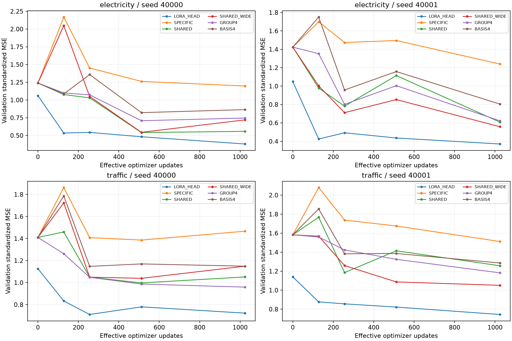
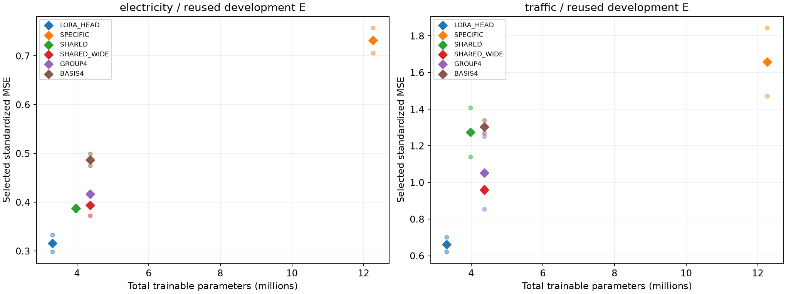
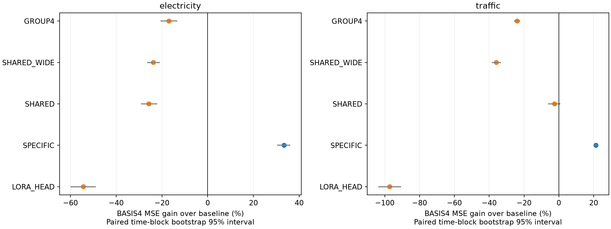

# PEFT Q/C 사용자 승인 재개 결과 — 기존 원천의 개발 비교

**Q INCONCLUSIVE_NUMERICS_V2 / C COMPLETE.** 이전 GPU 대기 종료는 그대로 보존하고, 계속 요청과 RustDesk 예외 승인을 별도 기록한 재개다.

C의24 fits와 평가를 완료했다. SPECIFIC 대비 제한된 경량화 신호는 두 원천에서 관측됐지만, BASIS4의 학습 계수 추가 가치 조건은 둘 다 미충족이다. 두 원천 모두 더 작고 정확한 LORA_HEAD가 최선이었다. Q는 수치 진단 단계 종료이며 예측 성능 판정이 아니다.

## 1. 실행 횟수와 미실행

| 작업 | 실모델 검사용 updates | 본학습 완료/시도 | 학습 updates |
| --- | ---: | ---: | ---: |
| Q 수치/자원 | 180 / 0 | 0/0 (최대12) | 0 |
| C 구조 | 24 | 24/24 (최대24) | 24576 |

C의 작은 FP64 toy optimizer30회는 이전 준비 단계에서 수행했으며 이번에 반복하지 않았다. 구조 점검72회 상한에서 이30회를 보수적으로 차감했다. 과거 Query v1의120회도 새 업데이트에 더하지 않았다.

## 2. Q 수치 중단 진단

새 단일 비교 24개 중 9개,5-step 경로 12개 중 7개가 고정 v2 한계를 만족했다. 저장 배열을 CPU float64로 독립 재계산했다. [단일 비교](../query_budget_numeric_v2_resume_20260915/numeric_checks.json), [경로 비교](../query_budget_numeric_v2_resume_20260915/path_checks.json), [검산](../query_budget_numeric_v2_resume_20260915/numeric_verification.json).

v2 정책은 이전 수치 실패를 본 뒤 사용자가 고정한 개정 기준이다. 출력은 Train std로 보정하고 FP32 gradient/update1e-4,5-step delta1e-3 등 지정값을 적용했다. 기존1e-5 판정과 옛 INCONCLUSIVE_NUMERICS는 수정하지 않았다. 통과해도 장기 학습 동등성이나 원인의 완전 규명을 뜻하지 않는다.

Q 수치 게이트에서 종료되어 자원 측정0회, 본학습0/12 fits다. C는 아래의 실제 완료/시도 수를 보고하며 실패 attempt를 다시 실행하지 않았다.

FP32 단일9/12·연속5/6, BF16 단일0/12·연속2/6이 통과했다. Electricity/Standard FP32의5-step delta 상대 L2는0.001180421로1e-3 한계를 넘었다. FP32에서 pinball 부호 뒤집힘이 없는 경우에도 gradient/update 한계를 넘었으므로 pinball kink만으로 원인 규명 완료라고 하지 않는다. BF16도 기준을 넘었다. 원단위 출력 scale만의 문제로 처리할 수 없으며, 미실행 예측을 성능 FAIL로 판정하지 않는다.

[진단 해설](../query_budget_numeric_v2_resume_20260915/NUMERIC_RESULT.md), [24개 단일 비교 원수치](../query_budget_numeric_v2_resume_20260915/numeric_summary.csv). 경로별 수치와 tensor별 차이는 위 JSON에 보존했다.

## 3. Query의 자원 이점과 예측 이득

Q 자원 선택은 미실행이다. B*·반복 속도 이점·최강 자원 대조군을 정할 수 없다.
신규 Q V/E 예측 비교는 미실행이다. 기존 점수를 새 설정의 결과로 가져오지 않았으며 예측 이득은 미판정이다.

## 4. C의 채널 공유와 파라미터

MOMENT-small의512차원/64patches, 공개 Time-PEFT의 LoRA/frequency/down/head를 사용했다. 서로 다른 채널 up을 독립, 공유, 넓은 공유, 정적4그룹, 정적4기저 조합으로 바꾸며 새 채널 attention은 추가하지 않았다.

| arm | 채널 블록 | 전체 trainable | 총 모델 |
| --- | ---: | ---: | ---: |
| LORA_HEAD | 0 | 3,317,856 | 38,655,264 |
| SPECIFIC | 8,684,800 | 12,265,312 | 47,602,720 |
| SHARED | 395,008 | 3,975,520 | 39,312,928 |
| SHARED_WIDE | 790,017 | 4,370,529 | 39,707,937 |
| GROUP4 | 789,760 | 4,370,272 | 39,707,680 |
| BASIS4 | 790,016 | 4,370,528 | 39,707,936 |

SHARED_WIDE/BASIS4는 채널 파라미터1개 차이이며 GROUP4/BASIS4는256개 차이다. SPECIFIC/SHARED/LORA_HEAD는 동일 예산 대조군이 아니다. 파라미터 감소를 GPU 메모리/속도 또는 예측 우위로 바꾸어 말하지 않는다.

## 5. 같은 예산·고정 그룹 비교와 원점수

| 원천 | seed | arm/role | MSE | MAE |
| --- | --- | --- | ---: | ---: |
| electricity | 40001 | SPECIFIC/selected | 0.7579296676633467 | 0.6587151719553291 |
| traffic | 40001 | SPECIFIC/selected | 1.8449904030485311 | 1.0677428610585091 |
| traffic | 40000 | SHARED/selected | 1.1392162100697494 | 0.7662295205926573 |
| traffic | 40001 | SHARED/selected | 1.407888523411148 | 0.8423860530473465 |
| traffic | 40001 | SHARED_WIDE/selected | 0.9742657960948764 | 0.7156619529388739 |
| electricity | 40001 | SHARED/selected | 0.39233469736560467 | 0.4656420873778748 |
| electricity | 40000 | SPECIFIC/selected | 0.7056474274144211 | 0.6285777610607172 |
| traffic | 40000 | SHARED_WIDE/selected | 0.9464113208305256 | 0.6746873252053365 |
| traffic | 40000 | LORA_HEAD/selected | 0.621236257783822 | 0.5285709834726516 |
| electricity | 40001 | LORA_HEAD/selected | 0.33327770972622517 | 0.43075082208197557 |
| electricity | 40000 | SHARED_WIDE/selected | 0.37275789494970346 | 0.4503295535152676 |
| traffic | 40000 | GROUP4/selected | 0.8548791115632121 | 0.6299635607301372 |
| electricity | 40000 | LORA_HEAD/selected | 0.2982447074763445 | 0.3987198876974015 |
| electricity | 40000 | BASIS4/selected | 0.49941076867559475 | 0.5256737854077559 |
| electricity | 40000 | BASIS4/posthoc_coefficient_swap | 0.49485909484695073 | 0.5215183841601312 |
| electricity | 40001 | BASIS4/selected | 0.47511229533542065 | 0.5193096161768833 |
| electricity | 40001 | BASIS4/posthoc_coefficient_swap | 0.46693693298768957 | 0.5127411302243947 |
| traffic | 40001 | BASIS4/selected | 1.3393953670531338 | 0.8760874615417179 |
| traffic | 40001 | BASIS4/posthoc_coefficient_swap | 1.2982278169130985 | 0.8615101476847175 |
| traffic | 40001 | GROUP4/selected | 1.2509285480717516 | 0.8433945674622993 |
| electricity | 40000 | GROUP4/selected | 0.4131847802172078 | 0.4785888788699473 |
| traffic | 40000 | SPECIFIC/selected | 1.4724750165296308 | 0.9171918934043475 |
| traffic | 40001 | LORA_HEAD/selected | 0.7024503503186135 | 0.5791252359748993 |
| electricity | 40001 | GROUP4/selected | 0.4203683471407631 | 0.4778450823121475 |
| electricity | 40001 | SHARED_WIDE/selected | 0.4147211039609558 | 0.48471163702394465 |
| electricity | 40000 | SHARED/selected | 0.38301238418912065 | 0.4529978728869434 |
| traffic | 40000 | BASIS4/selected | 1.2699305992369618 | 0.8487160226369741 |
| traffic | 40000 | BASIS4/posthoc_coefficient_swap | 1.261646811981241 | 0.8470876610604389 |

MSE는 equal-channel Train-standardized 공간이며 std로 다시 나누지 않았다. [개선율과 paired 시간 블록 CI](../channel_basis_pilot_resume_20260915/comparisons.csv), [실제 자원](../channel_basis_pilot_resume_20260915/resources.csv).

### 두 seed 원점수 평균과 BASIS4 상대 이득

| 원천 | 대조군 | 대조군 평균 MSE | BASIS4 평균 MSE | BASIS4 이득(%) | paired 95% CI(%) |
| --- | --- | ---: | ---: | ---: | --- |
| electricity | LORA_HEAD | 0.315761209 | 0.487261532 | -54.3133 | [-59.9657, -48.8576] |
| electricity | SPECIFIC | 0.731788548 | 0.487261532 | +33.4150 | [+30.3876, +36.0870] |
| electricity | SHARED | 0.387673541 | 0.487261532 | -25.6886 | [-29.1088, -22.0501] |
| electricity | SHARED_WIDE | 0.393739499 | 0.487261532 | -23.7523 | [-26.5168, -20.8285] |
| electricity | GROUP4 | 0.416776564 | 0.487261532 | -16.9119 | [-20.6406, -13.2868] |
| traffic | LORA_HEAD | 0.661843304 | 1.304662983 | -97.1257 | [-103.7837, -90.5651] |
| traffic | SPECIFIC | 1.658732710 | 1.304662983 | +21.3458 | [+20.1076, +22.4450] |
| traffic | SHARED | 1.273552367 | 1.304662983 | -2.4428 | [-6.1153, +0.9314] |
| traffic | SHARED_WIDE | 0.960338558 | 1.304662983 | -35.8545 | [-38.5494, -33.1240] |
| traffic | GROUP4 | 1.052903830 | 1.304662983 | -23.9109 | [-25.6828, -22.2523] |

양의 이득은 BASIS4의 낮은 MSE를 뜻한다. CI는 동일 시간 블록을 모든 arm/seed에 짝지어 재표집한 개발 구간 불확실성이다. 원천·seed 모집단 일반화의 신뢰구간이 아니다.

### 실제 학습 자원

| 원천 | arm | 평균 active 초 | 평균 fit wall 초 | 평균 step 중앙값(ms) | 최대 allocated GiB | 최대 reserved GiB |
| --- | --- | ---: | ---: | ---: | ---: | ---: |
| electricity | BASIS4 | 131.950 | 223.238 | 128.833 | 3.0786 | 3.1816 |
| electricity | GROUP4 | 147.492 | 241.102 | 143.975 | 2.9458 | 3.0781 |
| electricity | LORA_HEAD | 120.122 | 211.008 | 117.172 | 2.8394 | 2.9727 |
| electricity | SHARED | 126.882 | 221.520 | 123.665 | 2.9336 | 3.0547 |
| electricity | SHARED_WIDE | 129.010 | 220.523 | 125.913 | 2.9598 | 3.1016 |
| electricity | SPECIFIC | 167.296 | 263.889 | 163.081 | 3.0340 | 3.2070 |
| traffic | BASIS4 | 132.128 | 221.699 | 128.932 | 3.0786 | 3.1816 |
| traffic | GROUP4 | 147.585 | 237.270 | 144.210 | 2.9458 | 3.0781 |
| traffic | LORA_HEAD | 121.071 | 209.269 | 118.218 | 2.8394 | 2.9727 |
| traffic | SHARED | 126.066 | 219.063 | 122.817 | 2.9336 | 3.0547 |
| traffic | SHARED_WIDE | 128.382 | 219.631 | 125.202 | 2.9598 | 3.1016 |
| traffic | SPECIFIC | 165.295 | 256.992 | 161.256 | 3.0340 | 3.2070 |

active는 optimizer step 시간 합이며 fit wall에는 V 평가·체크포인트 저장·재로딩 등이 포함된다. fit별 메모리 수치는 PyTorch tensor allocator 값이다. 추가 timing 반복은 수행하지 않았다.

선택 step1024: 14/24, BUDGET_LIMITED: 14/24, 선택 step0: 0/24. step0는 각 arm의 초기 head/adapter 상태이며 별도의 pretrained F0 기준선으로 해석하지 않는다.

## 6. SPECIFIC·LORA_HEAD 대비 실제 가치

- electricity: 최저 MSE LORA_HEAD; 제한된 경량화 신호 True; 계수 활용 신호 False; LORA_HEAD가 더 작고 정확함 True.
- traffic: 최저 MSE LORA_HEAD; 제한된 경량화 신호 True; 계수 활용 신호 False; LORA_HEAD가 더 작고 정확함 True.

BASIS4의 전체 trainable은 SPECIFIC보다 64.367% 적다. 채널 블록 감소와 전체 모델 감소는 위 표에서 따로 확인할 수 있다.

electricity: SPECIFIC 대비 평균 active 시간 21.13% 감소, 평균 fit wall 15.40% 감소. 반면 최대 allocated는 1.47% 증가했다. 파라미터 절약이 peak 메모리 절약으로 이어진 결과는 아니다.
traffic: SPECIFIC 대비 평균 active 시간 20.07% 감소, 평균 fit wall 13.73% 감소. 반면 최대 allocated는 1.47% 증가했다. 파라미터 절약이 peak 메모리 절약으로 이어진 결과는 아니다.

같은 예산의 SHARED_WIDE·GROUP4에도 두 원천 평균 MSE가 모두 밀렸다. 더 작은 SHARED도 두 원천 평균에서 BASIS4보다 낮은 MSE였다. 따라서 큰 SPECIFIC만 이긴 결과를 새 PEFT 방법의 예측 우위로 삼을 수 없다.

### 선택된 계수의 사후 진단

| fit | 계수의 채널별 분산 (4개 basis) | effective weight 평균 채널 분산 | 계수 교환 MSE 변화(%) |
| --- | --- | ---: | ---: |
| 13_electricity_40000_BASIS4 | 0.001861, 0.0001425, 0.0004542, 0.0001172 | 3.48706e-06 | -0.9114 |
| 14_electricity_40001_BASIS4 | 0.002942, 0.0009543, 0.0006056, 0.0003076 | 7.10027e-06 | -1.7207 |
| 15_traffic_40001_BASIS4 | 0.001469, 0.0004328, 0.000286, 0.0005915 | 4.0093e-06 | -3.0736 |
| 23_traffic_40000_BASIS4 | 0.0003859, 6.742e-05, 5.314e-05, 8.472e-05 | 7.95548e-07 | -0.6523 |

양의 교환 변화는 계수를 바꾼 후 MSE 악화다. 선택된 모델에 대한 사후 기술통계이며 학습 중 인과 효과 검증이 아니다. basis별 계수 절대값 합·전체 계수는 각 mechanism.json, 실제 tensor update는 각 parameter_updates.json에 저장했다.

네 계수 교환 모두 원래 계수보다 E MSE가 낮았다. 이 사후 관측은 학습 계수의 유용한 채널 특화를 뒷받침하지 않는다. 다만 교환 한 번으로 부진의 원인이나 계수 자체의 무용성을 증명한 것은 아니다. 검증 곡선에서도 BASIS4가 강한 단순 대조군에 뒤졌으므로 이번 결과를 V→E 전달 실패만으로 설명할 근거는 없다. 14/24 fits는 BUDGET_LIMITED이며, 고정 recipe에서의 비교를 완전 수렴 결과라고 하지 않는다.

## 7. 운영·검증과 남은 한계

C의 V120개·선택 checkpoint 재로딩24개·E28개(선택24+계수 교환4), 총172개 예측 기록을 독립 검산했다. 최대 MSE 절대차2.220446049250313e-16으로 지정1e-10 이내다. [독립 검산](../channel_basis_pilot_resume_20260915/independent_verification.json). Q는 새36개 수치 비교와 이전42개 저장 비교를 재계산했다. 신규 Q 예측 검산은0개로 미측정이며 점수0을 뜻하지 않는다.

이전 results/research 1360개 파일과 두 계약의 실행 소스 해시를 확인했다. [재개 승인](authorization.json), [실행 종료 코드](runner_exit_codes.json), [공개 전 교차 감사](publication_audit.json). GPU에 남은 RustDesk만 예외로 허용했다. 원격 화면 부하를 포함한 환경의 시간 측정이며 엄격한 완전 유휴 GPU 측정과 같다고 주장하지 않는다. 다른 compute 작업과 free VRAM은 계속 감시했다. C 학습·평가 감시10,306개 표본에서 비승인 외부 compute는0개였고 최소 free는5,412MiB였다. RustDesk 기록3,155개는 승인된 예외다. 종료 후 GPU compute 목록은 비어 있었다.

Q/C는 서로 독립적으로 진행했다. Q의 예측 성공을 C의 입장 조건으로 사용하지 않았다. C는 동일1024updates로 비교했다. Q의120초 active budget 본학습은 사전 계획이며 이번에는 미실행이다. Q pinball과 C MSE를 한 성능 평균으로 합치지 않는다.

[Time-PEFT 공개 구조](https://github.com/kaist-dmlab/TimePEFT/blob/ea4e7e1887bb35587bab7ea93e2af3685ac55852/run.py)의 통제 변형이다. [C-LoRA](https://arxiv.org/html/2407.17246v1) 등 채널 공유·분해는 알려진 원리이며 새로운 방법 또는 논문 PASS가 확정되지 않았다. 공식 C-LoRA의 같은 백본 비교, 가까운 공유 adapter와의 차이, 미노출 원천의 독립 확인, 더 넓은 최적화 비교가 남는다. 단일 길이·고정 LR·2seed·기존 원천 개발 결과로 범용성을 주장하지 않는다.

**승인된 두 작업은 여기서 종료한다.** 추가 후보,seed,LR,자동 후속 학습은 실행하지 않는다. 원자료·가중치·큰 tensor cache는 로컬에 남으며 GitHub에는 코드·계약·원점수·검증 범위를 올린다.

