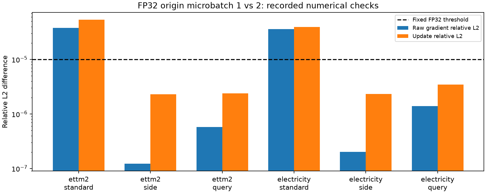

# Query 자원 제약 파일럿 — simulated tensor budget / 기존 개발 구간 재사용

**A 폐기용 optimizer 120 updates, B 본학습 0 fits / 0 updates. 종료 상태: INCONCLUSIVE_NUMERICS.** 설정별 FP32 검사까지 수행했고, 반복 속도 비교와 B 예측 비교는 실행하지 않았다. 이는 Query의 예측 가설 FAIL이나 Standard의 메모리 불가능 판정이 아니다.

## 1. 무엇을 비교했는가

Censor의 재튜닝 대신, 기존 Query가 공정한 자원 제약에서 추가 가치를 갖는지 검사했다. Standard에 CP0/3/6/9/12, Side와 Query에 CP0/12를 주고 각각 origin microbatch1/2를 허용했다. origin의 4채널 그룹은 유지하고 micro loss를 1/2씩 가중한 뒤 clipping/Adam을 한 번 수행했다. 새 어댑터·rank·loss·문맥 길이는 도입하지 않았다.

## 2. 어떤 예산과 측정이 있는가

예산은 사전 고정한 1/2/4/8GiB tensor allocated 시뮬레이션이며 실제 소형 GPU 재현이 아니다. [144행 budget 표](resource_budget_table.csv)에 36개 옵션×4예산의 준비 단계 측정 peak와 여유 5% 충족 여부를 모두 표시했다. 하지만 전체 무결성 검사에서 중단했으므로 모든 최종 feasibility는 NOT_ADJUDICATED다. B*를 정하지 않았다. 준비 단계 수치를 3-block timing 결과로 대신 사용하지 않았다.

실제 업데이트는 공유 상태 warmup12 + 옵션별 cold Adam36 + kernel warmup36 + FP32 비교36 = 120이다. BF16 timing324와 B fits는 실행하지 않았다. [전체 실행 기록](resource_measurements.csv), [옵션별 요약](setup_option_summary.csv), [초기 F0 경로 차이](initial_F0_parity.json)를 보관했다.

## 3. 무슨 수치 조건에서 멈췄는가

같은 microbatch 크기의 CP 비교36개는 모두 통과했다. 그중12개는 기준 옵션 자기 비교,24개는 실제 CP 변경 비교다. microbatch1 대2 비교6개 중4개가 사전 FP32 기준1e-5를 넘었다. RNG는 모두 일치했다.

| 원천/arm | raw 최대 절대 차이 | raw gradient 상대 L2 | update 상대 L2 | 판정 |
| --- | --- | --- | --- | --- |
| ettm2_standard | 1.1444092e-05 | 3.7845106e-05 | 5.3617445e-05 | 기준 초과 |
| ettm2_side | 7.6293945e-06 | 1.2186171e-07 | 2.3043942e-06 | 통과 |
| ettm2_query | 7.6293945e-06 | 5.7674588e-07 | 2.3913322e-06 | 통과 |
| electricity_standard | 0.00048828125 | 3.5804363e-05 | 3.9329564e-05 | 기준 초과 |
| electricity_side | 0.00048828125 | 2.0140426e-07 | 2.3107452e-06 | 기준 초과 |
| electricity_query | 0.00073242188 | 1.3970745e-06 | 3.4538233e-06 | 기준 초과 |

Electricity Side/Query는 주로 원 단위 raw 예측의 절대 오차 기준을 넘었고, gradient/update 상대 차이는1e-5 이내였다. Standard는 두 원천에서 gradient와 update 상대 차이도1e-5를 넘었다. 따라서 raw 오차를 train scale로 나누는 것만으로 모든 검사 실패가 해소되는 상황은 아니다. 진단용 scaled raw 오차는 [microbatch_stop_diagnosis.csv](microbatch_stop_diagnosis.csv)에 별도 기록했으며 원 판정에는 적용하지 않았다.

이 증거만으로 그룹 누출이나 손실 분모 버그가 입증되지는 않는다. batch 모양과 부동소수점 연산 순서, pinball의 비매끄러운 지점 등은 가능한 설명이지만 추가 GPU 진단 없이 원인을 확정하지 않았다. 같은 batch 크기의 CP가 통과했다는 사실과 microbatch 차이를 구분한다. 사후 허용치 완화나 실패 옵션 제외는 하지 않았다.

## 4. B를 실행했는가

아니다. 지시문의 “검사 실패 시 조합 전체의 A 종료” 조건을 적용했다. Standard보다 반복적으로5% 빠른지 측정하지 못했고, B의 최대12 fits를 시작할 근거가 없다. 신규 V/E scoring은0이다. 기존 평가 점수를 새 자원 설정의 예측 결과로 가져오지 않았다.

## 5. 가장 강한 대조군과 원점수

이번 실행에서는 최강 예측 대조군과 원천별 새 E 원점수를 정할 수 없다. 반복 속도 비교도 완료하지 않아 단일 warmup 시간으로 최속 모델을 선정하지 않는다. 빈 metrics/trajectories는 미실행을 의미하며 동일 성능이나 오차0을 뜻하지 않는다. 예측 이득, 자원 속도 이득은 모두 아직 판정 불가다.

## 6. 검증과 한계

CPU 회귀 검사117개 통과. 저장 FP32 artifact의 비교42개를 재계산했고, 이전 results/research 파일 1217개의 해시와 원자료·모델·실행 소스 해시가 보존됐다. 검증은 기록된 실패의 재현성을 확인한 것이며 구현/예측 PASS가 아니다. [종료 검증](completion_verification.json), [원래 검증 기록](independent_verification.json).

GPU 단계는 약140.37초였고 이 중30.27초는 시작 안정화 대기였다. 감지된 외부 compute는0이며 최소 free VRAM은6,916MiB였다. Censor의 RustDesk 예외를 재사용하지 않았다. 기존 개발 자료,2seed 계획,단일4096 길이,제한된옵션/단일LR,실제 소형 VRAM 미검증과 신규성 미확정이라는 한계도 유지한다.

## 7. 종료와 다음 한 가지 판단

**현재 실행은 종료했다.** 다음 판단은 이 microbatch 차이가 기대되는 수치 오차인지 실제 정보/목적식 변화인지 분리할 필요가 있는가이다. 본 run에서 재측정·허용치 변경·추가 학습은 하지 않는다. Query의 연구 가치 전체를 이 FP32 기준 미충족으로 폐기하지도 않는다.

원 지시와 계약은 [PROTOCOL.md](PROTOCOL.md), [contract.json](contract.json)에 있다. 단일 worker의 각 옵션 모델/optimizer를 완전히 해제한 뒤 다음 옵션을 생성했다. 원본 자동 보고는 [REPORT_automated_at_stop.md](REPORT_automated_at_stop.md)에 보존한다.

위 그림은 실제 수치 검사의 차이만 나타낸다. 미실행 B의 품질/시간 그림은 생성하지 않았다.
