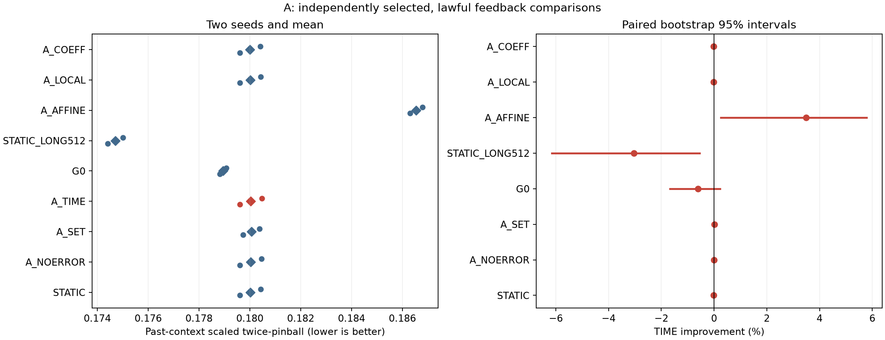
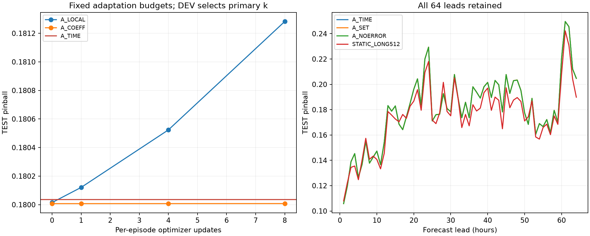

# A_AMORTIZED: residual feedback PEFT

[확인] **NO_GO_CURRENT_RECIPE**. 아래 숫자는 이번 Electricity 개발 screen의 결과이며 논문 PASS나 신규성 확정이 아니다.


```text
candidate strong_baseline direct_control  raw_score  baseline_score  effect_pct  seed1_pct  seed2_pct  prep_est_seconds  field_cold_seconds             decision    novelty
   A_TIME  STATIC_LONG512          A_SET   0.180035        0.174713   -3.046222  -2.975281  -3.116922        320.709466            0.040545 NO_GO_CURRENT_RECIPE UNVERIFIED
```


## 결과가 답하는 질문

- 일반 donor META 적응: STATIC은 G0 대비 **-0.5982%**. 둘 다 같은 신규 G0에서 출발했고 STATIC과 생성기는 동일 donor query와 정답·512updates를 받았다. 이 비교는 추가 META 적응의 효과이며, pretrained F0 대비 G0 학습의 절대 효과를 별도로 측정한 것은 아니다.
- 피드백의 추가 효과: A_TIME은 A_NOERROR 대비 **-0.0009%**. 명시적 residual 특징을 제거한 TIME 대조이며, raw context에 남은 관측정보까지 지운 비교는 아니다.
- 시간순 구조의 추가 효과: A_TIME은 SET 대비 **+0.0130%**, 두 seed는 +0.0758% / -0.0495%다. SET도 같은 예측·오차·age/maturity를 받는 거의 동일 파라미터 수 대조다.
- 강한 합법 대조: DEV에서 고정한 **STATIC_LONG512** 대비 **-3.0462%**, 두 seed -2.9753% / -3.1169%다. TEST를 보고 baseline을 바꾸지 않았다. paired 95% 구간은 [-6.1472%, -0.5459%]다.



원점수는 native .1–.9 quantile의 mean twice-pinball을 현재256시간 context의 표준편차 floor로 나눈 값이다. 계열별 평균 후 equal-series 평균이며 exact CRPS가 아니다. 이전 TRAIN-sigma 정규화 실험과 점수 크기를 직접 비교하지 않는다. 개선율은 두 seed 원점수 평균의 비율이다.


```text
           arm  pinball  raw_pinball     nmae   raw_mae  coverage    width  crossing  early32   late32  early16   late48
        STATIC 0.180015    32.136100 0.227088 40.516148  0.801758 0.716085  0.000031 0.168396 0.191633 0.147474 0.190861
     A_NOERROR 0.180034    32.140098 0.227111 40.520687  0.802246 0.716584  0.000031 0.168403 0.191665 0.147493 0.190881
         A_SET 0.180059    32.147974 0.227144 40.532673  0.801270 0.715642  0.000031 0.168417 0.191701 0.147455 0.190927
        A_TIME 0.180035    32.140098 0.227113 40.520536  0.802083 0.716474  0.000031 0.168411 0.191660 0.147502 0.190880
            G0 0.178944    31.779119 0.225865 40.144289  0.800537 0.704302  0.000122 0.168011 0.189877 0.147194 0.189527
STATIC_LONG512 0.174713    31.371736 0.220387 39.591496  0.789958 0.682202  0.000142 0.166020 0.183406 0.145223 0.184543
      A_AFFINE 0.186545    32.776145 0.233209 40.998909  0.796549 0.748958  0.000031 0.175285 0.197804 0.154828 0.197117
       A_LOCAL 0.180015    32.136100 0.227088 40.516148  0.801758 0.716085  0.000031 0.168396 0.191633 0.147474 0.190861
       A_COEFF 0.180007    32.135893 0.227079 40.517236  0.802083 0.716525  0.000031 0.168395 0.191620 0.147475 0.190851
```


## 선택·정보 시계·평가 범위

선택은 DEV8고객에서 수행했다. TEST8고객은 generator/bank offline 학습에 사용하지 않았다. 원본26304시간×321고객의 첫30% 품질만 보고 SHA 순서로 DONOR32/DEV8/TEST8을 고정했다. 원본 행 index를 시간으로 사용하며 날짜·weekday를 만들지 않았다. BASE0–30%, META30–60%, DEV60–80%, TEST80–100%다. 과거 실험·사전학습 비노출을 보증하는 독립 확증 자료는 아니다.

현재 t에서 관측 가능한 정답은 index<t뿐이다. 현재 query는[t,t+64)이고, input은[t−256,t)다. G0 reference는 고정 진단 예측기이며 후보 자신의 최근 오차로 바뀌지 않는다. 각 logical support issue의 과거 input hash와 forecast hash를 기록했다. Source와 선택 manifest를 봉인하고 A/B의 TEST 예측을 모두 저장한 뒤 채점했다.

A는 고객당12개의 사전고정 episode에서 support4개가 모두 실현된 과거 오차를 읽는다. 매 episode bank/c/optimizer를 초기화하고 이전 episode의 적응 상태를 넘기지 않는다. LOCAL/COEFF의0/1/4/8 curve는 한 trajectory의 prefix이며 DEV에서 고른k만 주 비교다. AFFINE도 support만으로 gain/bias를 고른다. LONG512는 같은 전체정보 범위를 긴 문맥으로 읽는 대조다.

```text
    arm  k
A_LOCAL  0
A_COEFF  0
```


```text
      arm  seed  selected_step
   STATIC 92401            128
   STATIC 92402            512
A_NOERROR 92401            128
A_NOERROR 92402            512
    A_SET 92401            128
    A_SET 92402            512
   A_TIME 92401            128
   A_TIME 92402            512
```



## 실제 비용과 회수 가능성

G0/STATIC 공유 학습은 배치에서 각각 두 seed로 한 번만 수행했다. 각 후보의 독립 배포 추정에는 G0와 해당 생성기 학습, 필요한 reference forecast 계산을 각각 청구한다. reference cache를 공유해 절약한 연구 실행비용과 단독 준비 추정을 구분한다. 아래 cold 현장 시간은 실제 TEST 실행의 feature 구성+generator+query 평균에5회 읽기전용 benchmark의 G0 support4 중앙값을 더한 추정치다. 별도5회 generator/query benchmark는 준비된 record를 사용하므로 feature 구성 비용을 무료 처리하는 현장값으로 사용하지 않는다.

**비용 해석 제한:** optimizer trajectory 시간에는 update intent/commit 장부 I/O가 들어가고 읽기전용 forward에는 그 I/O가 없다. 준비비용 추정도 실제 개별 fit wall time과 reference 계산을 조합한 값이다. 따라서 이 값만으로20% 알고리즘 가속 성공을 선언하지 않는다. 손익분기는 동일 품질을 먼저 충족해야 하며 아래 수치 자체가 비용 회수 보증은 아니다. 음수·0인 시간 절약은 NEVER_RECOVERED로 남긴다. 동일 장치에서 seed2의 방법순서를 뒤집었으며5회 중앙값·최소·최대는 FORWARD_BENCHMARK에 있다.

offline fit의 GPU peak는 각 fit에서 reset해 측정했다. 현장/online resource 행의 peak는 마지막 offline reset 이후 process high-water이므로 방법별 독립 peak-memory 순위로 사용하지 않는다. 이 배치로 메모리 우위를 주장하지 않는다.


```text
      arm  seed baseline  standalone_prep_estimate_seconds  baseline_prep_estimate_seconds  field_cold_seconds  baseline_field_seconds  field_saving_pct  break_even_episodes          status
A_NOERROR 92401  A_LOCAL                        446.947701                       74.524536            0.038268                0.016680       -129.426807                  NaN NEVER_RECOVERED
A_NOERROR 92402  A_LOCAL                        191.825722                       84.189415            0.039084                0.016643       -134.840901                  NaN NEVER_RECOVERED
    A_SET 92401  A_LOCAL                        393.856770                       74.524536            0.040388                0.016680       -142.133909                  NaN NEVER_RECOVERED
    A_SET 92402  A_LOCAL                        195.323350                       84.189415            0.040291                0.016643       -142.091243                  NaN NEVER_RECOVERED
   A_TIME 92401  A_LOCAL                        394.633316                       74.524536            0.040772                0.016680       -144.435735                  NaN NEVER_RECOVERED
   A_TIME 92402  A_LOCAL                        246.785616                       84.189415            0.040318                0.016643       -142.252849                  NaN NEVER_RECOVERED
```


동일 품질(오차1% 이내) 조건: True. 현장 실측상20%절약 조건: False. 장부 비용을 분리한 엄밀한 속도 성공은 미확인이다.


## 판정의 한계와 검산

특화 신호 조건 충족: **False**. A는 SET/NOERROR 각각0.5% 이상과 두seed 양성, DEV에서 고른 단순대조보다 낮은 오차를 구분해서 확인한다. LOCAL/COEFF와의 동일품질1% 조건은 효율 화면에서 따로 적용한다. 모든 offline 선택이 끝checkpoint인 상태: **False**. 끝checkpoint만 선택되는 경우 고정예산 내 수렴 불확실성을 보존하며 학습을 연장하지 않는다. 0.49%를 효과0이라고 부르지 않고, 0.5% 이상도 신규성 증거로 쓰지 않는다.

A 구간은 8고객을 재표집하고 고객별3연속episode block을 재표집한 paired bootstrap2,000회다. 같은 calendar의 상관과 적은 두seed의 한계는 남는다. 진단용 순서 역전은 고정 첫TEST episode에서 추가학습0회로 수행했으며 인과적인 시간 효과를 증명하지 않는다.

main 전 cuDNN eval-GRU backward 제약을 발견해 backend를 비활성화하고 native/gradient/복원 검사를 통과했다. 실패 전2회를 포함한 smoke누적14회이며 이 구현 수정은 성능 개선으로 세지 않는다. 본학습 결과와 구현·자료·자원 문제를 구분한다.

[공유 hypernetwork](https://aclanthology.org/2021.acl-long.47/)와 [PROCEED](https://lifan-zhao.github.io/publication/proceed/) 등 가까운 선행이 있다. 생성기나 부분 피드백 자체를 최초성으로 주장하지 않는다. [COSA 공식 core](https://github.com/bigbases/COSA_ICLR2026/blob/527c0feb9e997dd85af485ee027616b446e4ae77/tta/cosa.py)의 라이선스·고정 blob·parity를 보존했다.

[검산](VERIFICATION.json), [raw episode 점수](RAW_SCORES.csv), [seed 효과](SEED_EFFECTS.csv), [고객별 효과](SERIES_EFFECTS.csv), [lead 점수](LEAD_SCORES.csv), [적응 예산](ADAPTATION_BUDGET_CURVES.csv), [자원](RESOURCES.csv), [총비용·손익분기](AMORTIZATION_COSTS.csv), [발행 장부](ISSUED_FORECASTS.jsonl), [선택 봉인](SELECTION_SEAL.json), [예측 manifest](PREDICTION_MANIFEST.json).

raw data/HF weights/checkpoints/예측 npz는 로컬 ignored cache에 남기고 GitHub에는 코드·버전·hash·작은 집계표·그림을 남겼다. GitHub만으로 모든 개별 예측을 재채점할 수 있다는 뜻은 아니다. 기존 실험은 수정·재개하지 않았고 자동 후속 실험 없이 종료한다.
