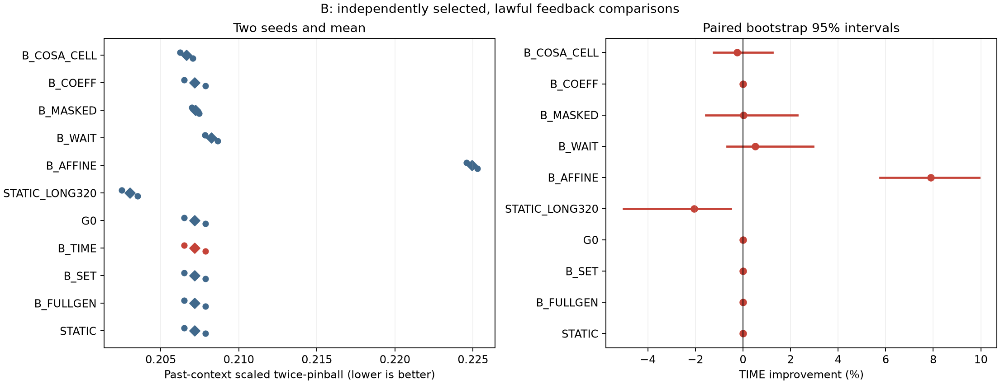
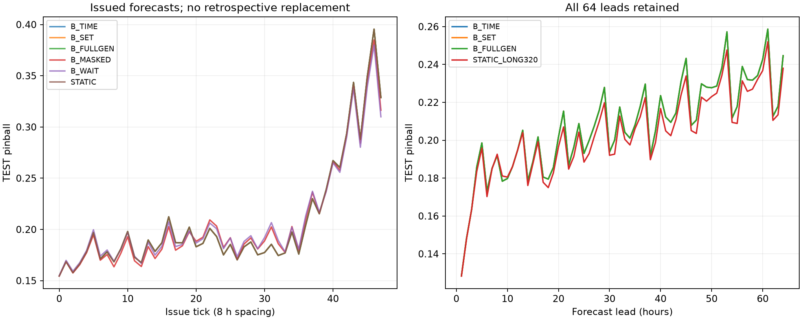

# B_PARTIAL: residual feedback PEFT

[확인] **NO_GO_CURRENT_RECIPE**. 아래 숫자는 이번 Electricity 개발 screen의 결과이며 논문 PASS나 신규성 확정이 아니다.


```text
candidate strong_baseline direct_control  raw_score  baseline_score  effect_pct  seed1_pct  seed2_pct  prep_est_seconds  field_cold_seconds             decision    novelty
   B_TIME  STATIC_LONG320          B_SET   0.207183        0.203013   -2.054057  -2.141102  -1.966585        246.835448            0.041654 NO_GO_CURRENT_RECIPE UNVERIFIED
```


## 결과가 답하는 질문

- 일반 donor META 적응: STATIC은 G0 대비 **+0.0000%**. 둘 다 같은 신규 G0에서 출발했고 STATIC과 생성기는 동일 donor query와 정답·512updates를 받았다. 이 비교는 추가 META 적응의 효과이며, pretrained F0 대비 G0 학습의 절대 효과를 별도로 측정한 것은 아니다.
- 피드백의 추가 효과: B_TIME은 B_FULLGEN 대비 **+0.0000%**. 완전히 실현된 task만 residual로 주는 생성기와 비교한다. 실제 age/maturity metadata 및 동일 최신 context는 유지했다.
- 시간순 구조의 추가 효과: B_TIME은 SET 대비 **+0.0000%**, 두 seed는 +0.0000% / +0.0000%다. SET도 같은 예측·오차·age/maturity를 받는 거의 동일 파라미터 수 대조다.
- 강한 합법 대조: DEV에서 고정한 **STATIC_LONG320** 대비 **-2.0541%**, 두 seed -2.1411% / -1.9666%다. TEST를 보고 baseline을 바꾸지 않았다. paired 95% 구간은 [-5.0149%, -0.5048%]다.



원점수는 native .1–.9 quantile의 mean twice-pinball을 현재256시간 context의 표준편차 floor로 나눈 값이다. 계열별 평균 후 equal-series 평균이며 exact CRPS가 아니다. 이전 TRAIN-sigma 정규화 실험과 점수 크기를 직접 비교하지 않는다. 개선율은 두 seed 원점수 평균의 비율이다.


```text
           arm  pinball  raw_pinball     nmae   raw_mae  coverage    width  crossing  early32   late32  early16   late48
        STATIC 0.207183    32.867414 0.259147 40.790165  0.787516 0.732650  0.000285 0.190560 0.223806 0.180507 0.216075
     B_FULLGEN 0.207183    32.867414 0.259147 40.790165  0.787516 0.732650  0.000285 0.190560 0.223806 0.180507 0.216075
         B_SET 0.207183    32.867414 0.259147 40.790165  0.787516 0.732650  0.000285 0.190560 0.223806 0.180507 0.216075
        B_TIME 0.207183    32.867414 0.259147 40.790165  0.787516 0.732650  0.000285 0.190560 0.223806 0.180507 0.216075
            G0 0.207183    32.867414 0.259147 40.790165  0.787516 0.732650  0.000285 0.190560 0.223806 0.180507 0.216075
STATIC_LONG320 0.203013    32.269239 0.254132 40.064873  0.791707 0.725715  0.000402 0.187688 0.218337 0.179775 0.210759
      B_AFFINE 0.224925    35.003401 0.279482 43.090010  0.719625 0.722392  0.000285 0.209102 0.240749 0.199687 0.233338
        B_WAIT 0.208244    32.786647 0.260433 40.784074  0.765320 0.705852  0.000310 0.192527 0.223960 0.182781 0.216731
      B_MASKED 0.207234    32.665463 0.258913 40.561392  0.766846 0.707018  0.000409 0.191477 0.222991 0.182201 0.215578
       B_COEFF 0.207180    32.866584 0.259143 40.789223  0.787496 0.732631  0.000285 0.190557 0.223802 0.180504 0.216071
   B_COSA_CELL 0.206657    32.602112 0.258306 40.441091  0.779907 0.736301  0.000229 0.190153 0.223161 0.180047 0.215527
```


## 선택·정보 시계·평가 범위

선택은 DEV8고객에서 수행했다. TEST8고객은 generator/bank offline 학습에 사용하지 않았다. 원본26304시간×321고객의 첫30% 품질만 보고 SHA 순서로 DONOR32/DEV8/TEST8을 고정했다. 원본 행 index를 시간으로 사용하며 날짜·weekday를 만들지 않았다. BASE0–30%, META30–60%, DEV60–80%, TEST80–100%다. 과거 실험·사전학습 비노출을 보증하는 독립 확증 자료는 아니다.

현재 t에서 관측 가능한 정답은 index<t뿐이다. 현재 query는[t,t+64)이고, input은[t−256,t)다. G0 reference는 고정 진단 예측기이며 후보 자신의 최근 오차로 바뀌지 않는다. 각 logical support issue의 과거 input hash와 forecast hash를 기록했다. Source와 선택 manifest를 봉인하고 A/B의 TEST 예측을 모두 저장한 뒤 채점했다.

[확인] 이번 B에서는 STATIC과 세 생성기 모두 두 seed에서 checkpoint0이 DEV 최선이었다. 따라서 주 비교의 세 생성기는 c=1로 G0와 동일한 예측을 냈다. 이것은 학습 실행이나 gradient 연결 실패가 아니라, 정해진 학습이 검증 성능을 개선하지 못해 선택되지 않은 결과다. 학습된512 모델의 TEST 결과로 주장을 바꾸지 않았다. 이 결과로 부분 피드백이 모든 조건에서 무용하다고 결론내리지 않는다. 배포 시 선택된 영출력 생성기를 제거해 G0로 단순화할 수 있으므로, 아래 B 생성기 실행비용은 불필요한 호출을 포함한 실제 비교 경로의 비용이지 최적화된 G0 배포비용은 아니다.

B는48ticks×8시간 간격의 제한된16일 stream이다. support issue=t−64,t−32,t−16,t−8이고 visible counts는64/32/16/8이다. 생성기 weights는 동결하고 c만 재생성한다. WAIT/MASKED/COEFF/COSA는 계열별 독립 optimizer를 유지하며 매tick2updates한다. 미공개 NaN은 먼저 선택에서 제외한 뒤 loss/residual을 계산한다. 과거에 발행한 예측을 덮어쓰거나 소급해 재채점하지 않았다. TEST 전체를 한 번도 열지 않았다는 주장은 하지 않는다. 당시 아직 알 수 없는 future를 학습·조건 생성에 사용하지 않는 as-of 접근이 검증 대상이다.

기존 Maturity-PEFT는 미공개 예측 보존 규제였다. 이번 B는 donor의 이후 실제 query loss로 수정 생성기를 학습하며 해당 규제의 재실행이 아니다. 부분 정답 문제를 최초로 다뤘다는 주장도 하지 않는다. COSA_CELL은 공식 linear core를 quantile9채널·이번 clock/loss에 이식한 대조로, PAAS/CALR 등 원논문 전체를 재현하지 않았다.


```text
      arm  seed  selected_step
   STATIC 92401              0
   STATIC 92402              0
B_FULLGEN 92401              0
B_FULLGEN 92402              0
    B_SET 92401              0
    B_SET 92402              0
   B_TIME 92401              0
   B_TIME 92402              0
```



## 실제 비용과 회수 가능성

G0/STATIC 공유 학습은 배치에서 각각 두 seed로 한 번만 수행했다. 각 후보의 독립 배포 추정에는 G0와 해당 생성기 학습, 필요한 reference forecast 계산을 각각 청구한다. reference cache를 공유해 절약한 연구 실행비용과 단독 준비 추정을 구분한다. 아래 cold 현장 시간은 실제 TEST 실행의 feature 구성+generator+query 평균에5회 읽기전용 benchmark의 G0 support4 중앙값을 더한 추정치다. 별도5회 generator/query benchmark는 준비된 record를 사용하므로 feature 구성 비용을 무료 처리하는 현장값으로 사용하지 않는다.

**비용 해석 제한:** optimizer trajectory 시간에는 update intent/commit 장부 I/O가 들어가고 읽기전용 forward에는 그 I/O가 없다. 준비비용 추정도 실제 개별 fit wall time과 reference 계산을 조합한 값이다. 따라서 이 값만으로20% 알고리즘 가속 성공을 선언하지 않는다. 손익분기는 동일 품질을 먼저 충족해야 하며 아래 수치 자체가 비용 회수 보증은 아니다. 음수·0인 시간 절약은 NEVER_RECOVERED로 남긴다. 동일 장치에서 seed2의 방법순서를 뒤집었으며5회 중앙값·최소·최대는 FORWARD_BENCHMARK에 있다.

offline fit의 GPU peak는 각 fit에서 reset해 측정했다. 현장/online resource 행의 peak는 마지막 offline reset 이후 process high-water이므로 방법별 독립 peak-memory 순위로 사용하지 않는다. 이 배치로 메모리 우위를 주장하지 않는다.


```text
      arm  seed       baseline  standalone_prep_estimate_seconds  baseline_prep_estimate_seconds  field_cold_seconds  baseline_field_seconds  field_saving_pct  break_even_episodes          status
B_FULLGEN 92401 STATIC_LONG320                        298.345198                       74.524536            0.041868                0.016981       -146.550784                  NaN NEVER_RECOVERED
B_FULLGEN 92402 STATIC_LONG320                        194.292530                       84.189415            0.040852                0.017088       -139.064222                  NaN NEVER_RECOVERED
    B_SET 92401 STATIC_LONG320                        266.754776                       74.524536            0.041914                0.016981       -146.824205                  NaN NEVER_RECOVERED
    B_SET 92402 STATIC_LONG320                        194.524628                       84.189415            0.040858                0.017088       -139.099610                  NaN NEVER_RECOVERED
   B_TIME 92401 STATIC_LONG320                        267.472342                       74.524536            0.042378                0.016981       -149.553393                  NaN NEVER_RECOVERED
   B_TIME 92402 STATIC_LONG320                        226.198554                       84.189415            0.040930                0.017088       -139.520376                  NaN NEVER_RECOVERED
```


## 판정의 한계와 검산

특화 신호 조건 충족: **False**. B는 DEV-selected baseline/SET/FULLGEN 각각0.5% 이상과 두seed 양성을 확인한다. 모든 offline 선택이 끝checkpoint인 상태: **False**. 끝checkpoint만 선택되는 경우 고정예산 내 수렴 불확실성을 보존하며 학습을 연장하지 않는다. 0.49%를 효과0이라고 부르지 않고, 0.5% 이상도 신규성 증거로 쓰지 않는다.

B는8tick 연속block을 모든계열·method·lead·seed에 같이 적용한 paired bootstrap2,000회와 별도의8고객 resampling 구간을 함께 공개한다. 같은 calendar의 상관과 적은 두seed의 한계는 남는다. 진단용 순서 역전은 고정 첫TEST episode에서 추가학습0회로 수행했으며 인과적인 시간 효과를 증명하지 않는다.

main 전 cuDNN eval-GRU backward 제약을 발견해 backend를 비활성화하고 native/gradient/복원 검사를 통과했다. 실패 전2회를 포함한 smoke누적14회이며 이 구현 수정은 성능 개선으로 세지 않는다. 본학습 결과와 구현·자료·자원 문제를 구분한다.

[공유 hypernetwork](https://aclanthology.org/2021.acl-long.47/)와 [PROCEED](https://lifan-zhao.github.io/publication/proceed/) 등 가까운 선행이 있다. 생성기나 부분 피드백 자체를 최초성으로 주장하지 않는다. [COSA 공식 core](https://github.com/bigbases/COSA_ICLR2026/blob/527c0feb9e997dd85af485ee027616b446e4ae77/tta/cosa.py)의 라이선스·고정 blob·parity를 보존했다.

[검산](VERIFICATION.json), [raw episode 점수](RAW_SCORES.csv), [seed 효과](SEED_EFFECTS.csv), [고객별 효과](SERIES_EFFECTS.csv), [lead 점수](LEAD_SCORES.csv), [적응 예산](ADAPTATION_BUDGET_CURVES.csv), [자원](RESOURCES.csv), [총비용·손익분기](AMORTIZATION_COSTS.csv), [발행 장부](ISSUED_FORECASTS.jsonl), [선택 봉인](SELECTION_SEAL.json), [예측 manifest](PREDICTION_MANIFEST.json).

raw data/HF weights/checkpoints/예측 npz는 로컬 ignored cache에 남기고 GitHub에는 코드·버전·hash·작은 집계표·그림을 남겼다. GitHub만으로 모든 개별 예측을 재채점할 수 있다는 뜻은 아니다. 기존 실험은 수정·재개하지 않았고 자동 후속 실험 없이 종료한다.
