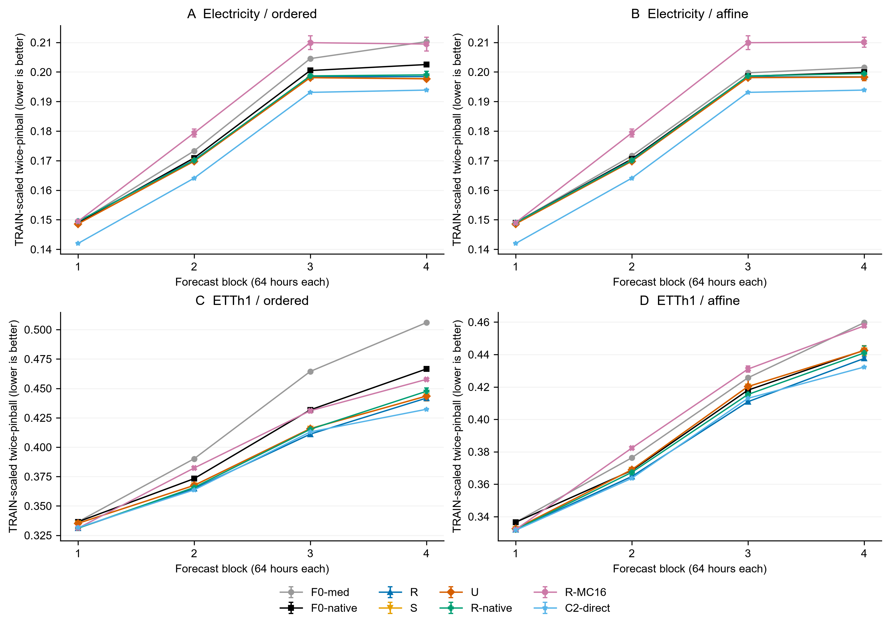
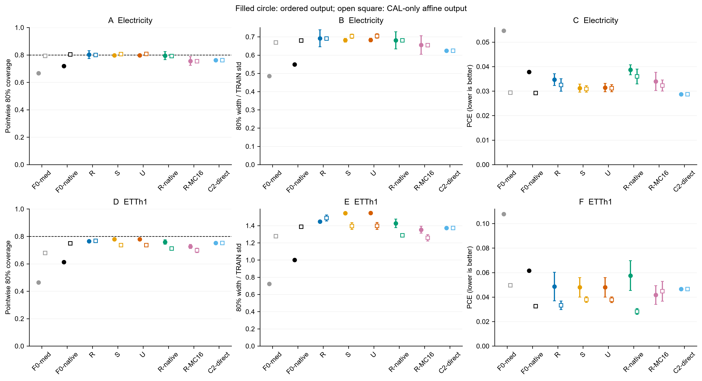
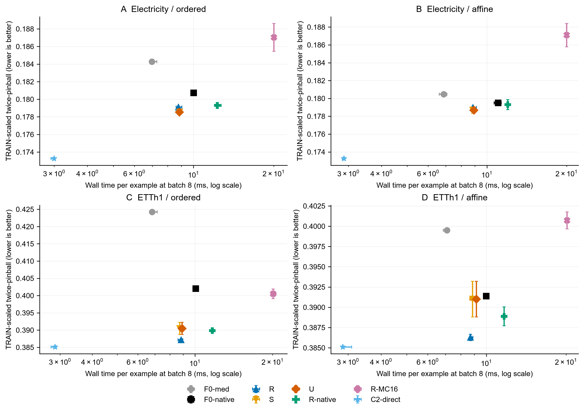

# Rollout uncertainty PEFT — 최종 한국어 보고서

**판단: STATE_OR_CALIBRATION_SUFFICIENT. U의 폭 정보 전달에 대한 독자적인 실용적 이득은 이번 범위에서 미확보다.** Electricity에서 U−S의 평균 점수 개선은 약 0.018%이며 두 seed의 방향이 다르고, ETTh1에서는 약 0.001%로 거의 같다. R의 일반 rollout LoRA 학습은 두 자료에서 개선됐으므로 이 결과를 rollout PEFT 전체의 실패로 확대하지 않는다.

2026-09-21 시작, 2026-09-22 KST 종료. 사용자가 준 [MASTER_CLI](../../experiments/rollout_uncertainty_peft_v1_20260921/contract/MASTER_CLI.txt)를 유일한 실행 계약으로 사용했다. HIER·MAG·FR의 모델/결과/학습을 합치거나 재개하지 않았다. 기존 Python 환경만 읽기 전용으로 재사용했고 새 HF cache에서 고정 upstream weights를 로드했다. 아래의 구현 이탈은 숨기지 않는다.

24 fits, main 12,288 + smoke 12 updates를 실제 실행했다. 본학습은 49,152 conditional batch forward/backward 호출이다. batch8의 개별 계열 수나 GPU launch 수와 다른 단위다. 학습 모델의 표 수치는 seed92121/92122 **점수 평균**이며 예측 ensemble이 아니다. 고정 F0와 C2는 한 모델의 수치다. 선택 seed92120은 반복 평균에 없다.

주 지표는 TRAIN 표준편차로 나눈 9개 분위수 mean twice-pinball(낮을수록 좋음)이다. exact CRPS, 순수 calibration 지표, 동시 경로 coverage가 아니다. 이하 개선은 baseline−candidate이며 상대 개선율은 평균 점수 차이를 평균 baseline 점수로 나눈 값이다.

## 1. 현재 공식 branching은 무엇을 해결했는가?

현재 고정한 공식 Chronos-Bolt는 중앙값-only 장기 rollout이 아니다. 첫 9분위수 경로를 확장하고 다음 단계의 9×9 출력을 9분위수로 축약한다. 원래 observed512를 유지하며 실제 호출 context 길이는 512/576/640/704였다. 공식 API를 그대로 호출했고, real TRAIN 입력에서 native64/256 parity 및 호출별 raw 분위수·집계·context retention을 검산했다.

F0-native는 F0-median보다 ordered 전체 점수를 Electricity 1.919%, ETTh1 5.243% 개선했다. 같은 CAL affine 이후에도 각각 0.531%, 2.034% 차이가 남는다. 따라서 현재 공식 방식을 중앙값-only라고 설명하면 비교의 출발점부터 틀린다.


```text
     source  baseline candidate baseline_variant  effect_a_minus_b  relative_gain_percent  ci95_low  ci95_high
Electricity F0-median F0-native          ordered          0.003536               1.918984  0.003031   0.003975
Electricity F0-median F0-native           affine          0.000958               0.531087  0.000551   0.001304
      ETTh1 F0-median F0-native          ordered          0.022244               5.243401  0.019162   0.025056
      ETTh1 F0-median F0-native           affine          0.008126               2.033954  0.005354   0.010767
```


선행 [논문](https://arxiv.org/html/2510.16060v2)과 [코드](https://github.com/Coaster41/Beyond-Accuracy-TSFM-Calibration/tree/b60bfd92ff836525773c71039a83ba2fe3d123bf)를 먼저 확인했다. 그 문헌의 역사적 설명/설정과 현재 공식 구현을 구분했다. 이전 코드의 context 이동 방식과 모델 크기도 이번 계약과 같지 않으므로 정확한 재현이나 신규성 검증을 주장하지 않는다. 공식 코드·모델 revision과 파일 SHA는 [SOURCE_AND_MODEL_MANIFEST.json](SOURCE_AND_MODEL_MANIFEST.json)에 있다.

## 2. 일반 rollout LoRA 학습의 효과는?

R은 자체 생성 중앙값을 학습 중 다음 context에 넣으며, 값과 폭 모두 detach한다. S/U도 같은 방식으로 자기 생성값을 경험한다. R은 F0-median 대비 ordered 점수를 Electricity 2.798%, ETTh1 8.740% 개선했고, 양쪽에 같은 affine 기회를 준 뒤에는 0.822%, 3.310% 개선이다. 학습하지 않은 F0와의 비교이므로 LoRA 적응 및 rollout 노출을 합친 결과다. teacher-forcing 학습 대조 없이 rollout 노출만의 효과라고 부르지 않는다.


```text
     source  baseline candidate baseline_variant  effect_a_minus_b  relative_gain_percent  ci95_low  ci95_high
Electricity F0-median         R          ordered          0.005156               2.798011  0.003870   0.006480
Electricity F0-median         R           affine          0.001483               0.821646  0.000360   0.002494
      ETTh1 F0-median         R          ordered          0.037077               8.739630  0.025320   0.048882
      ETTh1 F0-median         R           affine          0.013226               3.310468  0.001649   0.025296
```


## 3. 상태 정보와 예측 폭의 추가 효과는?

공통 q/v rank8 LoRA는 294,912 parameters다. S/U는 동일한 516→8→512 residual adapter 8,744 parameters를 추가하고 zero-up 초기화했다. 같은 seed의 LoRA와 S/U 초기화 hash가 같고 초기 256 예측도 일치했다. S 대 R은 상태 입력과 추가 용량을 함께 바꾸는 비교다. U 대 S는 같은 용량에서 마지막 lead² 채널을 log-width 채널로 바꾼 비교이며, 모든 정보가 동일한 순수 추가 실험은 아니다.

Electricity에서 S가 R 대비 약 0.304%, U가 약 0.321% 개선해 이득 대부분이 S에도 있다. ETTh1에서는 S/U가 R보다 약 0.858%/0.857% 나빠졌다. U−S는 Electricity에서 작은 양의 평균 CI가 있지만, 실용적 크기가 매우 작고 seed별 방향이 반대다. ETTh1은 평균·CI·seed 모두 뚜렷한 추가 신호가 없다. 폭의 proxy를 전달했다고 참 불확실성이나 joint Bayesian propagation을 구현했다고 해석하지 않는다.


```text
     source baseline candidate baseline_variant  effect_a_minus_b  relative_gain_percent  ci95_low  ci95_high
Electricity        R         S          ordered          0.000544               0.303818  0.000212   0.000833
Electricity        S         U          ordered          0.000031               0.017546  0.000008   0.000061
Electricity        R         U          ordered          0.000575               0.321310  0.000237   0.000854
Electricity        R         S           affine          0.000281               0.156922 -0.000046   0.000572
Electricity        S         U           affine          0.000028               0.015438  0.000005   0.000057
Electricity        R         U           affine          0.000308               0.172336  0.000014   0.000598
      ETTh1        R         S          ordered         -0.003322              -0.858092 -0.006336   0.000071
      ETTh1        S         U          ordered          0.000003               0.000815 -0.000032   0.000041
      ETTh1        R         U          ordered         -0.003319              -0.857270 -0.006560  -0.000021
      ETTh1        R         S           affine         -0.004727              -1.223798 -0.008869   0.000366
      ETTh1        S         U           affine          0.000002               0.000471 -0.000033   0.000041
      ETTh1        R         U           affine         -0.004725              -1.223322 -0.008904   0.000513
```


U−S의 개별 반복 효과:


```text
     source  seed baseline_variant  effect_a_minus_b  relative_gain_percent  ci95_low  ci95_high
Electricity 92121          ordered          0.000085               0.047378  0.000035   0.000148
Electricity 92122          ordered         -0.000022              -0.012363 -0.000054   0.000007
Electricity 92121           affine          0.000077               0.043127  0.000031   0.000142
Electricity 92122           affine         -0.000022              -0.012363 -0.000053   0.000006
      ETTh1 92121          ordered         -0.000010              -0.002509 -0.000085   0.000070
      ETTh1 92122          ordered          0.000016               0.004169 -0.000043   0.000071
      ETTh1 92121           affine         -0.000004              -0.001059 -0.000069   0.000061
      ETTh1 92122           affine          0.000008               0.002018 -0.000054   0.000063
```


후반129–256의 U−S ordered 개선율도 Electricity 0.026193%, ETTh1 −0.000084%로 작거나 혼합이다. Electricity의 U PCE 0.031420는 S 0.031203보다 조금 높다. coverage 증가나 점수의 아주 작은 감소를 일괄 calibration 개선이라고 쓰지 않는다.



그림 1. 64시간 블록별 score. 오차막대는 두 반복의 범위이며 CI가 아니다. 고정 기준선은 한 모델이다. S/U의 중첩은 실제 차이가 작기 때문이다. PDF도 같은 이름으로 제공한다.

## 4. 단순 출력 보정으로 충분한가?

모든 26개 source/model 조합에 동일한 CAL-only 35점 grid를 블록별 적용했다. 최종 정렬 출력만 보정하며 생성 context에 되먹임하지 않는다. 3,640개 grid 점수를 실제 CAL 정답/예측으로 독립 재계산했고 최대 오차 2.22e−16, winner/tie 모두 일치했다. 보정은 conformal 보장을 하지 않는다.

F0-median의 큰 undercoverage는 간단한 폭 보정으로 상당 부분 줄었다. 반면 Electricity S/U의 affine는 TEST 점수를 각각 약 0.000137/0.000140 악화시켰고 ETTh1 S/U도 악화됐다. CAL 최적이 TEST 최적이라는 보장은 없으며, 이 결과를 보고 계수를 다시 고르지 않았다. 같은 affine 이후 U−S 개선은 Electricity 약 0.015%, ETTh1 약 0.0005%다. 보정이 모든 차이를 정확히 제거했다고 말하지 않는다.


Electricity 전체256: 학습 모델은 두 반복 점수 평균, F0/C2는 단일 모델:


```text
   method variant  scaled_pinball      pce  coverage80  scaled_width80
C2-direct ordered        0.173254 0.028669    0.761034        0.624329
C2-direct  affine        0.173254 0.028669    0.761034        0.624329
F0-median ordered        0.184266 0.054655    0.666596        0.484724
F0-median  affine        0.180466 0.029344    0.793062        0.668835
F0-native ordered        0.180730 0.037825    0.719246        0.548458
F0-native  affine        0.179507 0.029216    0.803852        0.680176
   R-MC16 ordered        0.187034 0.033945    0.755721        0.655661
   R-MC16  affine        0.187090 0.032255    0.753530        0.653968
 R-native ordered        0.179300 0.038693    0.794641        0.681174
 R-native  affine        0.179301 0.035952    0.791824        0.680378
        R ordered        0.179110 0.034668    0.802199        0.691850
        R  affine        0.178983 0.032482    0.799156        0.690658
        S ordered        0.178566 0.031203    0.796813        0.681400
        S  affine        0.178702 0.030887    0.805941        0.703292
        U ordered        0.178534 0.031420    0.797470        0.682568
        U  affine        0.178675 0.031180    0.806620        0.704495
```


ETTh1 전체256: 학습 모델은 두 반복 점수 평균, F0/C2는 단일 모델:


```text
   method variant  scaled_pinball      pce  coverage80  scaled_width80
C2-direct ordered        0.385099 0.046477    0.751472        1.371388
C2-direct  affine        0.385099 0.046477    0.751472        1.371388
F0-median ordered        0.424236 0.107811    0.464414        0.723418
F0-median  affine        0.399506 0.049557    0.678712        1.276886
F0-native ordered        0.401992 0.061481    0.612686        1.001363
F0-native  affine        0.391380 0.032578    0.749603        1.386960
   R-MC16 ordered        0.400494 0.041652    0.725783        1.351727
   R-MC16  affine        0.400715 0.044709    0.697921        1.257956
 R-native ordered        0.389873 0.057504    0.758869        1.425641
 R-native  affine        0.388876 0.028228    0.710727        1.287464
        R ordered        0.387159 0.048570    0.765270        1.445823
        R  affine        0.386281 0.033292    0.766875        1.487944
        S ordered        0.390481 0.047912    0.779001        1.544770
        S  affine        0.391008 0.037899    0.735896        1.395481
        U ordered        0.390478 0.047933    0.779349        1.545656
        U  affine        0.391006 0.037835    0.736212        1.396373
```




그림 2. PCE, 80% pointwise coverage, 폭을 별도로 표시했다. 채운 원은 ordered, 빈 사각형은 affine다. 막대는 두 seed 범위이며 CI가 아니다. 0.8 선에 가까워지는 것만으로 probability score의 개선을 뜻하지 않는다.

## 5. 공식 branching·MC16·직접 장기 모델 대비 손익은?

R-native는 같은 선택 R 가중치에 공식 branching을 적용한 대조다. U는 Electricity에서 R-native보다 ordered score 약 0.427% 좋지만 ETTh1에서는 약 0.155% 나쁘다. R-MC16은 두 자료에서 U보다 확률점수가 나쁘고 더 느렸다. 이는 고정 16경로·매 horizon 독립 uniform·q.1/q.9 바깥 clamped tails라는 대조의 결과이며, 모든 stochastic rollout의 실패가 아니다.

Chronos-2의 score는 Electricity 0.173254, ETTh1 0.385099로 U의 0.178534/0.390478보다 낮다. batch8 시간도 약 24/23ms로 U의 약71ms보다 빠르다. 그러나 C2 peak allocated memory는 약563–564MB, U는 약272MB다(아래 표는 MiB 단위). C2 coverage80은 0.7610/0.7515로 U의 0.7975/0.7793보다 0.8에서 멀다. ETTh1 전체256에서 C2의 scaled MAE/RMSE도 U 및 R보다 나쁘고, affine 이후 PCE도 R/U보다 높다. 후반129–256 MAE는 C2가 U보다 조금 낮으므로 전구간 우열로 일반화하지 않는다. 따라서 확률점수·속도의 강한 대안이지만 모든 지표의 전면 지배라고 하지 않는다. ETTh1 U−C2 효과의 원점 CI는 0도 포함한다.


```text
     source  baseline candidate baseline_variant  effect_a_minus_b  relative_gain_percent  ci95_low  ci95_high
Electricity F0-native         U          ordered          0.002195               1.214656  0.000908   0.003333
Electricity  R-native         U          ordered          0.000766               0.426940  0.000124   0.001444
Electricity    R-MC16         U          ordered          0.008500               4.544538  0.007589   0.009464
Electricity C2-direct         U          ordered         -0.005280              -3.047698 -0.007506  -0.003464
Electricity F0-native         U           affine          0.000833               0.463944 -0.000363   0.001876
Electricity  R-native         U           affine          0.000627               0.349568  0.000012   0.001253
Electricity    R-MC16         U           affine          0.008415               4.497979  0.007557   0.009371
Electricity C2-direct         U           affine         -0.005421              -3.128652 -0.007484  -0.003594
      ETTh1 F0-native         U          ordered          0.011513               2.864056  0.003088   0.020809
      ETTh1  R-native         U          ordered         -0.000605              -0.155123 -0.004250   0.004021
      ETTh1    R-MC16         U          ordered          0.010016               2.500812  0.005381   0.015205
      ETTh1 C2-direct         U          ordered         -0.005379              -1.396741 -0.016264   0.003516
      ETTh1 F0-native         U           affine          0.000374               0.095636 -0.009689   0.012430
      ETTh1  R-native         U           affine         -0.002130              -0.547636 -0.007001   0.002100
      ETTh1    R-MC16         U           affine          0.009709               2.422875  0.003972   0.018398
      ETTh1 C2-direct         U           affine         -0.005907              -1.533771 -0.019317   0.006327
```


실제 파라미터 수는 Bolt-small 47,718,016, Chronos-2 119,477,664이다. 크기·구조·사전학습이 달라 순수 adapter 인과 대조가 아니다. Chronos-2는 8개의 독립 group, observed512, output16 patches로 한 번에256을 출력했다. 실제 model forward 한 번, group_ids 0–7, 미래 covariate placeholder의 finite 값 0을 검산했다.

아래는 동일 RTX4070에서 loading을 제외한 end-to-end256 wall time이다. CPU/GPU 전송, metadata, 정렬과 해당 affine를 포함했다. 1회 warmup 후 3회 측정의 중앙값을 모델별 계산하고 두 반복 모델만 평균했다. peak는 seed 중 최대다. Windows 공유 데스크톱 GPU의 짧은 3회 측정이며 독점 GPU/다른 장비의 보편적 속도를 보장하지 않는다. ETTh1 batch8은 독립 7계열 중 한 계열을 한 번 반복해 배치 크기를 맞췄다. loading 시간과 각 측정 min/max는 원 자원표에 있다.


```text
     source    method  batch_size    wall_ms   peak_MiB  loading_ms
      ETTh1 C2-direct           1  20.000500 522.841797  342.324000
      ETTh1 C2-direct           8  22.965300 537.638672  342.324000
      ETTh1 F0-median           1  53.319700 248.497070  174.629700
      ETTh1 F0-median           8  54.538100 258.711914  174.629700
      ETTh1 F0-native           1  54.688100 260.025879  175.566100
      ETTh1 F0-native           8  80.566500 350.950684  175.566100
      ETTh1    R-MC16           1  75.120050 273.240723  222.125400
      ETTh1    R-MC16           8 160.760200 341.303711  222.125400
      ETTh1  R-native           1  69.926550 261.150879  220.099900
      ETTh1  R-native           8  93.379350 352.075684  220.099900
      ETTh1         R           1  69.456800 249.622070  235.947750
      ETTh1         R           8  70.647800 259.836914  235.947750
      ETTh1         S           1  68.956200 249.656250  214.564300
      ETTh1         S           8  69.866000 259.871094  214.564300
      ETTh1         U           1  69.363300 249.656250  219.334050
      ETTh1         U           8  71.345500 259.871094  219.334050
Electricity C2-direct           1  21.595900 522.841797  387.948300
Electricity C2-direct           8  23.967400 536.935547  387.948300
Electricity F0-median           1  53.421600 248.497070  171.021600
Electricity F0-median           8  55.841000 258.711914  171.021600
Electricity F0-native           1  54.781000 260.025879  166.887500
Electricity F0-native           8  80.049600 350.950684  166.887500
Electricity    R-MC16           1  71.518000 273.240723  215.366450
Electricity    R-MC16           8 160.348400 341.303711  215.366450
Electricity  R-native           1  70.332350 261.150879  232.432550
Electricity  R-native           8  98.247950 352.075684  232.432550
Electricity         R           1  68.167550 249.622070  229.268300
Electricity         R           8  70.288950 259.836914  229.268300
Electricity         S           1  67.442050 249.656250  219.906550
Electricity         S           8  70.940300 259.871094  219.906550
Electricity         U           1  69.758800 249.656250  216.718650
Electricity         U           8  70.825850 259.871094  216.718650
```


단일경로/공식 branching/MC16의 예제당 conditional context 수는 4/28/49이며 실제 시간 배수와 다르다. C2 직접 호출은1회다. CPU 입력을 요구하는 C2의 불필요한 CPU→GPU→CPU 복사를 자원 측정 전에 제거했다. 학습 수식은 바꾸지 않았고 원본·diff·hash는 [SOURCE_AMENDMENTS.json](SOURCE_AMENDMENTS.json)에 보존했다.



그림 3. batch8의 예제당 시간은 log축이다. 가로막대는 세 측정 min/max의 seed 평균, 세로막대는 두 seed 점수 범위다. CI가 아니며 memory 손익은 표와 함께 읽어야 한다.

## 6. 자료별·seed별 반례와 검증 범위

전체256과 후반129–256의 점예측 지표를 나란히 보존한다. raw MAE는 각 자료의 원 단위 평균이므로 자료 사이 직접 비교에 쓰지 않는다. ETTh1에는 부하6개와 온도 OT가 섞여 있다.


```text
     source    method variant  scaled_mae_full_256  scaled_mae_tail_129_256  raw_mae_full_256  raw_mae_tail_129_256  scaled_rmse_full_256  scaled_rmse_tail_129_256
      ETTh1 C2-direct  affine             0.491418                 0.536796          1.912391              2.060730              0.701177                  0.745249
      ETTh1 C2-direct ordered             0.491418                 0.536796          1.912391              2.060730              0.701177                  0.745249
      ETTh1 F0-median  affine             0.490618                 0.538570          1.899143              2.056900              0.693902                  0.741592
      ETTh1 F0-median ordered             0.490618                 0.538570          1.899143              2.056900              0.693902                  0.741592
      ETTh1 F0-native  affine             0.492579                 0.541552          1.902148              2.060218              0.693929                  0.741620
      ETTh1 F0-native ordered             0.492579                 0.541552          1.902148              2.060218              0.693929                  0.741620
      ETTh1    R-MC16  affine             0.505352                 0.561028          1.924352              2.109429              0.697957                  0.753749
      ETTh1    R-MC16 ordered             0.505352                 0.561028          1.924352              2.109429              0.697957                  0.753749
      ETTh1  R-native  affine             0.488392                 0.537750          1.862582              2.023373              0.672326                  0.716888
      ETTh1  R-native ordered             0.492200                 0.545366          1.885168              2.068544              0.680504                  0.732191
      ETTh1         R  affine             0.485609                 0.533621          1.857970              2.018776              0.674140                  0.720585
      ETTh1         R ordered             0.486934                 0.536269          1.863389              2.029615              0.676923                  0.725740
      ETTh1         S  affine             0.488996                 0.539516          1.870195              2.037805              0.674329                  0.719656
      ETTh1         S ordered             0.487815                 0.537153          1.869323              2.036060              0.676786                  0.724159
      ETTh1         U  affine             0.489008                 0.539534          1.870226              2.037843              0.674331                  0.719639
      ETTh1         U ordered             0.487843                 0.537202          1.869399              2.036188              0.676817                  0.724194
Electricity C2-direct  affine             0.217045                 0.241674         72.003199             81.231358              0.351758                  0.386548
Electricity C2-direct ordered             0.217045                 0.241674         72.003199             81.231358              0.351758                  0.386548
Electricity F0-median  affine             0.223195                 0.246846         74.757387             83.498699              0.351641                  0.385205
Electricity F0-median ordered             0.223195                 0.246846         74.757387             83.498699              0.351641                  0.385205
Electricity F0-native  affine             0.223916                 0.248197         74.930790             83.823945              0.351598                  0.385391
Electricity F0-native ordered             0.223916                 0.248197         74.930790             83.823945              0.351598                  0.385391
Electricity    R-MC16  affine             0.233085                 0.261427         78.083043             88.621667              0.363965                  0.401940
Electricity    R-MC16 ordered             0.233085                 0.261427         78.083043             88.621667              0.363965                  0.401940
Electricity  R-native  affine             0.223454                 0.247800         74.409541             83.184073              0.352568                  0.387117
Electricity  R-native ordered             0.223454                 0.247800         74.409541             83.184073              0.352568                  0.387117
Electricity         R  affine             0.222689                 0.246374         74.347441             83.060527              0.352692                  0.387084
Electricity         R ordered             0.222689                 0.246374         74.347441             83.060527              0.352692                  0.387084
Electricity         S  affine             0.222400                 0.245935         74.241269             82.959766              0.353283                  0.387676
Electricity         S ordered             0.222400                 0.245935         74.241269             82.959766              0.353283                  0.387676
Electricity         U  affine             0.222377                 0.245901         74.243246             82.968674              0.353197                  0.387532
Electricity         U ordered             0.222377                 0.245901         74.243246             82.968674              0.353197                  0.387532
```


계열·원점·lead·블록·prefix·raw crossing 상세는 아래 원표에 있다. 원점 stride24, horizon256으로 인접 target이232시간 겹친다. CI는 7연속 원점을 묶은 paired moving-block bootstrap2,000회이며 계열/horizon을 함께 보존한다. 고정된 두 seed와 선택 계열 아래 원점 불확실성만 반영한다. 7일 블록이 256시간 의존을 전부 제거한다고 보장하지 않으며 optimizer 모집단, 다중 비교, 과거 탐색을 보정하지 않는다.

Electricity32계열은 TRAIN 적격 열의 고정 SHA 순서로 선택했다. 타임스탬프 없는 hourly slot이므로 달력/UTC를 검증했다고 하지 않는다. ETTh1은 실제 hourly 시간축을 검증했다. TRAIN/CAL/VAL/TEST는60/10/10/20이며 ETT 표준12/4/4개월 재현이 아니다. scale은 TRAIN만, 미래 정답은 context/metadata에 쓰지 않았다. 공개자료의 사전학습 노출 가능성이 있으므로 독립 확증/미사전학습 benchmark를 주장하지 않는다.

자료 감사·CPU24 tests·실제 Chronos/LoRA GPU smoke·초기 parity·미래치환 불변성·유한 gradient·save/restore·배치/순서 불변성은 통과했다. 양쪽 자료의 96개 VALIDATION checkpoint 점수와 3,640개 CAL grid를 독립 재계산했다. TEST의 실제 소표본 scalar pinball/PCE/coverage와 origin/lead 평균 일치, gain의 baseline−candidate 재계산을 검산했다. 추가 TRAIN-only native 집계 감사도 통과했고 ledger hash는 불변이다.

**구현 사건과 과학적 결과를 구분한다.** 위임 작업이 범위를 넘어 별도 runner를 시작해 첫 두 Electricity R 선택 fit이 전체 코드 봉인 전에 실행됐다. 원본 runner·checkpoint·optimizer/RNG·1,024 spent updates를 보존하고 완료 경계에서 중단한 뒤 재학습 없이 canonical runner로 이어갔다. 두 fit의 원학습 전후 frozen digest는 없다. 복구 모델, 초기/learned checkpoint, frozen 코드 경로를 확인했지만 원학습 buffers 불변을 직접 실측했다고 쓰지 않는다. 나머지22 fits와 smoke는 전후 weights/buffers digest를 직접 확인했다. 이 두 선택 fit은 LR 선택에 기여했으므로 반복 평균에서 제외됐다는 이유만으로 사건의 영향을 무시하지 않는다. 이 제한 때문에 실행 상태는 `COMPLETED_WITH_DISCLOSED_PROTOCOL_DEVIATION`이다.

smoke 기록 시 event 인자 충돌도 저장된 update에서 복구했고, Chronos-2의 CPU DataLoader 입력 연결 문제는 본학습 전에 수정했다. 실패를 성능 실패로 기록하거나 update를 재실행해 예산을 늘리지 않았다. 데이터 실패/자원 차단은 없었다. 장시간 실행 중 처리 속도 변화는 있었으며 비용의 일반화 한계를 함께 보고한다.

모든 24 fits의 설정·선택 step은 [FIT_LEDGER.csv](FIT_LEDGER.csv)에 있다. 512 updates가 충분한 최적화라고 주장하지 않는다. 두 반복은 적고 U−S 효과는 매우 작다. full/tail에서 서로 다른 지표의 작은 방향 변화를 선택적으로 성공으로 묶지 않는다.

## 7. 한정된 후속 투자 근거와 종료

이 고정 파일럿에서는 U의 폭 전달을 독립 연구 후보로 확대할 실용적 근거가 약하다. Electricity의 약한 상태-adapter 이득과 일반 R 학습의 개선은 남지만, 이를 U 고유의 효과로 돌릴 수 없다. 별도 최소효과 문턱이나 모든 CI 양수 규칙을 사후 도입하지 않았다. 판단 범주는 크기·seed 반례·같은 affine 기회·강한 대조·실측 비용을 함께 읽은 수동 검토 결과다.

**STATE_OR_CALIBRATION_SUFFICIENT로 종료한다.** 효과가 정확히0이라는 증명, 신규성/논문 PASS, rollout PEFT 전체의 반증은 아니다. oracle true-context, U width0/셔플, 추가 LR/rank/seed/source 및 자동 후속은 실행하지 않는다.

## 산출물과 재현 범위

- [FINAL_DECISION.md](FINAL_DECISION.md), [VERIFICATION.json](VERIFICATION.json), [SUPPLEMENTARY_MODEL_VERIFICATION.json](SUPPLEMENTARY_MODEL_VERIFICATION.json)
- [데이터·분할](DATA_AND_SPLIT_AUDIT.json), [환경](ENVIRONMENT.json), [버전 lock](requirements-lock.txt), [source/model provenance](SOURCE_AND_MODEL_MANIFEST.json)
- [모델·smoke](MODEL_AND_SMOKE_AUDIT.json), [Electricity VAL 검산](VALIDATION_AUDIT_Electricity.json), [ETTh1 VAL 검산](VALIDATION_AUDIT_ETTh1.json), [CAL 독립 검산](CALIBRATION_INDEPENDENT_AUDIT.json)
- [학습 ledger](FIT_LEDGER.csv), [update ledger](UPDATE_LEDGER.jsonl), [LR 선택](LR_SELECTION.json), [모델 선택](MODEL_SELECTION.json), [CAL 계수](CALIBRATION_PARAMETERS.json), [선택 봉인](ALL_SELECTIONS_SEALED.json)
- [예측 manifest](PREDICTIONS_MANIFEST.json), [원점별](SCORES_BY_ORIGIN.csv), [계열·블록별](SCORES_BY_SERIES_BLOCK.csv), [lead별 압축 CSV](SCORES_BY_LEAD.csv.gz), [raw/ordered/affine summary](SCORES_SUMMARY.csv)
- [반복평균](SCORES_REPEAT_MEANS.csv), [paired effects](EFFECTS.csv), [seed별 effects](SEED_EFFECTS.csv), [full/tail point 지표](POINT_METRICS_FULL_TAIL.csv)
- [원 자원표](RESOURCES.csv), [자원 요약](RESOURCE_SUMMARY.csv), [품질·latency](QUALITY_LATENCY.csv), [그림 manifest](FIGURES_MANIFEST.json), [전체 산출물 manifest](FINAL_ARTIFACT_MANIFEST.json)

원자료, HF weights, 학습 checkpoint와 numerical prediction cache는 로컬 `.cache/rollout_uncertainty_peft_v1_20260921`에 보존하며 GitHub에 올리지 않았다. GitHub에는 hash·경로·설정·코드·집계·검산을 남겼다. GitHub 파일만으로 수치 전체를 즉시 replay할 수 있다고 주장하지 않는다. 이미 사용한 update ledger의 예산을 초기화하거나 `--stage all`을 새 학습 허가로 사용하면 안 된다. 최종 보고서는 본 helper의 수동 판단을 포함하므로 자동 평가 stage만 재실행하면 검토 초안이 다시 생성될 수 있다.
