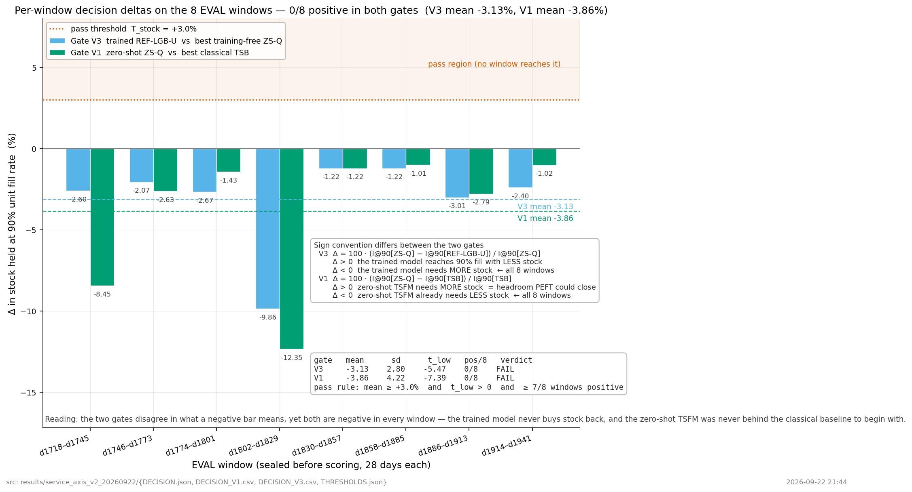
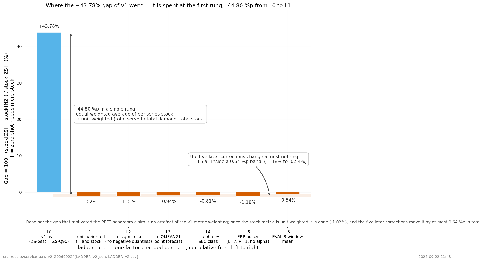
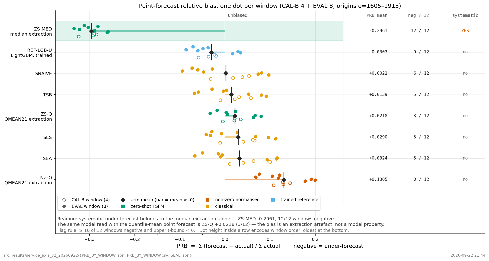

# 서비스 축 PEFT 여지 검증 (B') — 결과

2026-09-22. 실행 계약은 [PROTOCOL_V2.md](../../experiments/service_axis_v2_20260922/PROTOCOL_V2.md).
선행 실험은 [간헐 수요 go/no-go (v1)](../intermittent_gonogo_20260922/REPORT.md).

## 1. 판정

```
NO_GO_NO_HEADROOM_SERVICE
```

계약 §0의 뜻 그대로: 학습한 모델조차 학습 없는 최선보다 서비스에서 의미 있게 낫지 않다.
PEFT 로 얻을 서비스 여지가 없다. B' 종료.

LoRA 파일럿(V4)은 실행하지 않았다. 계약 §8.7 이 V3 통과와 사용자 승인을 전제로 두었고 V3 이 실패했다.

## 2. 계획자 전제 중 틀린 것

| 전제 | 실제 |
|---|---|
| §4 "v1과 동일 ENV (lightgbm 4.6.0)" | 이 venv 에 lightgbm 이 없었다. v1 은 `uv run --with` 격리 실행이었고 이번에 4.7.0 을 설치했다 |
| §2.4 statsforecast 클래스 [확인] | 패키지 자체가 미설치라 GitHub 소스 확인일 뿐이었다. 2.1.1 설치 후 6종·시그니처를 실제로 확인했다 |
| §4 재사용 자산 목록 | RAF 원본이 세션 임시 폴더에만 있었다. `.cache/` 로 옮겨 보존했다(sha256 일치) |
| — | RAF 를 읽으려면 `xlrd` 가 필요한데 목록에 없었다. 설치 후 진행했다 |

§7.4 의 시뮬레이터 규약은 **정확했다**. 처음 구현에서 규약 (4) "t일 마감 발주분은 t+L+1 일에 입고"를
t+1 일로 잘못 읽어 충족률이 1.000 으로 나왔고, 파이프 길이를 L+1 로 고치니 기대값 네 개가 모두 맞았다.

## 3. V0 — 측정 도구

| 항목 | 기준 | 실측 | |
|---|---|---|---|
| V0a 논문 재현 | 충족 대리지표 차이 ≤ 0.5pp | **0.000000pp** (mase/bias 만 1e-7) | PASS |
| V0b v1 재현 | 43.784 ± 0.01 | 43.7842% | PASS |
| V0c 시뮬레이터 | 단위테스트 3개 + 논문 parity ≤ 1e-12 | 3/3, **0.00e+00** | PASS |
| V0d 추론 재현 | 상대차 ≤ 1e-3 | **0.000e+00** → 캐시 재사용 | PASS |
| V0e 고전 기법 | 유한·비음수·정의 | 3계열 × 4기법 확인 | PASS |
| V0f NZ 배선 | 학습 경로 loc 3.0 (원 정규화 1.5) | 추론 3.0 / 학습 3.0 | PASS |
| V0g 누설 감사 | 경계 6항목 | 6/6 | PASS |

V0a 는 v1 에서 생략했던 단계다. 논문 저장소 HEAD `067687b1`, 표본은 층화 250 items × 원점 [72–78] 7개
= 1750 forecasts 로, v1 지시문이 [추정]으로 둔 "원점 78" 은 원점 수에서 틀렸다.

V0f 결과는 [V0F_NZ_WIRING.json](V0F_NZ_WIRING.json) 에 있다(V0a 는 V0A_REPRO.json, 나머지는 V0_REST.json). V0f 는 계약 §1-12 의 신규 발견을 검증한 자리다. `fit()` 이 모델을 새로 만들기 때문에 v1 방식(인스턴스
패치)이었다면 학습 경로에서 NZ 가 사라졌을 것이다. 클래스 수준 교체 + 프로세스 분리로 학습 모델에도
적용됨을 확인했다.

## 4. 결정 게이트 V3 — 적응 여지

기준 BEST-FREE = **ZS-Q** (사후 최강, EVAL 8창 평균 I@90 최소). arm = REF-LGB-U.

| 창 | I@90 ZS-Q | I@90 REF-LGB-U | Δ% |
|---|---|---|---|
| d_1718–d_1745 | 202,051 | 207,300 | −2.60 |
| d_1746–d_1773 | 204,430 | 208,652 | −2.07 |
| d_1774–d_1801 | 231,160 | 237,337 | −2.67 |
| d_1802–d_1829 | 215,478 | 236,729 | −9.86 |
| d_1830–d_1857 | 226,734 | 229,499 | −1.22 |
| d_1858–d_1885 | 222,259 | 224,978 | −1.22 |
| d_1886–d_1913 | 211,029 | 217,383 | −3.01 |
| d_1914–d_1941 | 220,759 | 226,050 | −2.40 |
| **평균** | | | **−3.13** |
| t-하한 95% | | | −5.47 |
| 양수 창 | | | **0 / 8** |
| T_stock | | | 3.000 |
| **판정** | | | **FAIL** |

목표 데이터로 학습한 모델이 학습 없는 최선보다 **더 많은** 재고를 쓴다. 8창 전부 같은 방향이다.



*V3 와 V1 은 음수의 뜻이 서로 다르다(주석 참조). 그럼에도 두 게이트 모두 8/8 창이 음수이고, 통과 영역(+3.0% 위)에 닿는 창이 없다.*

## 5. 서사 게이트 V1 — TSFM 의 서비스 격차

기준 S-best = **TSB** (CAL-B 선택). arm = ZS-Q.

```
격차 8창 = [-8.45, -2.63, -1.43, -12.35, -1.22, -1.01, -2.79, -1.02]
평균 -3.86%   t-하한 -7.39   양수 창 0/8   FAIL
```

TSFM 은 고전 기법보다 서비스에서 **뒤지지 않는다.** 오히려 ZS-Q 가 TSB 보다 재고를 덜 쓴다.
선행 논문(ICDM 2026)의 "정확도는 좋지만 서비스는 나쁘다" 서사가 이 설정에서는 재현되지 않는다.
차이는 점예측 추출(중앙값 대 QMEAN21)과 안전재고 정의(IQR/1.35 대 경험적 잔차)다.

EVAL 평균 I@90 (낮을수록 좋음, 미도달 0/8):

```
ZS-Q 216,737 | NZ-Q 217,909 | REF-LGB-U 223,491 | TSB 225,648
SES 230,750  | SNAIVE 255,922 | SBA 265,258
```

## 6. 사다리 V2 — v1 +43.78% 의 정체

| 단계 | 바꾼 것 | 격차 | 직전 대비 |
|---|---|---|---|
| L0 | v1 그대로 | **+43.78%** | — |
| L1 | + 단위가중 (U, I) | **−1.02%** | **−44.80** |
| L2 | + sigma_clip | −1.01% | +0.01 |
| L3 | + QMEAN21 | −0.94% | +0.07 |
| L4 | + ZS → ZS×α_class | −0.81% | +0.13 |
| L5 | ERP 로 교체 | −1.18% | −0.37 |
| L6 | EVAL 8창 평균 | −0.54% | +0.64 |

**주원인은 L1, 가중 방식이다.** 계열 동일가중 충족률 + 절대 재고를 단위 가중(총 충족/총 수요, 총 보유)
으로 바꾸는 한 단계에서 44.80%p 가 사라지고 부호까지 뒤집힌다. 이후 다섯 단계는 전부 −1.18% ~ −0.54%
사이, 폭 0.64%p 안에 있다. L6 의 창별 Δ 는 [0.06, −0.85, −0.83, −0.37, 0.31, −0.51, −0.94, −1.18] 로 §7.6 기준 FAIL 이라,
"NZ 가 편향·가중·σ̂ 정의 이상의 정보를 준다"(E1)고 쓸 수 없다.



*L0 에서 L1 로 한 칸 옮기는 데 44.8%p 가 들어간다. L1–L6 은 전부 0.64%p 폭 안에 있다.*

v1 에서 이 수치를 재검산하고 "견고하다"고 보고했으나, 패치 작동·곡선 단조성·독립 재계산은 확인했어도
가중 방식 자체는 의심하지 않았다. 계약 §7-7 이 지적한 지점이다.

## 7. PRB 12창 — 출발 전제 검증

| arm | PRB 평균 | 음수 창 | t-상한 | 체계적 과소예측 |
|---|---|---|---|---|
| ZS-MED | −0.2961 | **12/12** | −0.2798 | **True** |
| ZS-Q | +0.0218 | 3/12 | +0.0454 | False |
| NZ-Q | +0.1305 | 0/12 | +0.1589 | False |
| SNAIVE | +0.0021 | 6/12 | +0.0471 | False |
| SES | +0.0290 | 5/12 | +0.0650 | False |
| SBA | +0.0324 | 5/12 | +0.0763 | False |
| TSB | +0.0139 | 5/12 | +0.0490 | False |
| REF-LGB-U | −0.0303 | 9/12 | −0.0035 | False |

사전 규칙(12창 중 10창 이상 음수 + t-구간 상한 < 0)을 만족하는 것은 **중앙값 추출뿐**이다.
"TSFM 이 간헐 수요에서 과소예측한다"는 B 방향의 출발 전제는, 점예측을 제대로 뽑으면 성립하지 않는다.
v1 의 −1.65% 는 단일 창 결과였다.



## 8. RAF 방향 확인 — INCONCLUSIVE_UNREACHED

EVAL 4창 × 전 arm 에서 I@90 미도달. τ=0.99 에서도 최대 단위충족률 **0.45** (목표 0.90).

원인은 잔차 표본이다. CAL-B 가 2창 × 5블록 = 계열당 **10개**(M5 는 84개)뿐이라 상위 분위수가 실제 수요
스파이크를 덮지 못한다. RAF 수요는 0 비율 0.894, 6개월 창 계열당 평균 8.4 로 희소하고 스파이크가 크다.
계약 §13 첫째 리스크의 RAF 발현이며, §13 지시대로 창·정책을 바꾸지 않고 그대로 보고한다.

판정 게이트가 아니므로 M5 토큰은 바뀌지 않는다. 부호를 비교할 수 없어 PARTIAL_SCOPE 를 붙일 근거도
없다. 부품 수요에서의 방향은 미확인으로 남는다.

## 9. 사후 최강 기준선을 쓴 곳 · 하지 않은 것 · 이탈

사후 최강 기준선: V3 의 BEST-FREE(ZS-Q)는 EVAL 8창 평균으로 골랐다. GO 에 불리한 방향이며 보고에 명시한다.
V1 의 S-best(TSB)는 CAL-B 에서 골라 봉인했다.

하지 않은 것: V4(LoRA 파일럿). 계약 §8.7 이 V3 통과 + 사용자 승인을 전제로 둔다.

이탈: 없음. 봉인 후 임계값·arm·창·지표를 바꾸지 않았다. 설치(statsforecast, lightgbm, xlrd)와
lightgbm 버전 차이(4.6.0 → 4.7.0)는 계산 구현 차이로 기록하고 진행했다.

## 10. 자원과 독립 재계산

```
예측 생성   TSFM 28회 추론(창당 15초) + 고전 4종 56개 + LightGBM 1회 학습  9분 42초
채점        CAL-B → 봉인 → EVAL 8창 × 7 arm × 12 τ
표본        공통 계열 29,502 (적격 29,502, arm별 제외 0)
독립 재계산  저장 곡선에서 DECISION 표 전부 재계산, 최대 차이 0.000e+00 (기준 1e-9)
```

## 11. 이 결과가 남기는 것

방향 B' 는 닫혔다. 다만 세 가지가 남는다.

측정 도구가 검증됐다. 논문 재현이 0.000000pp 로 맞았고, 독립 재계산도 0 이다. 이 파이프라인으로 낸
수치는 근거로 쓸 수 있다.

v1 의 +43.78% 가 지표 정의의 산물임이 한 단계로 특정됐다. 서비스 지표를 만들 때 계열 동일가중과 단위
가중이 결론을 뒤집을 수 있다는 것은, 이 방향 밖에서도 쓸 수 있는 관찰이다.

선행 논문과 반대 결과가 나왔다. 방법 무관 정책(ERP)으로 비교하면 zero-shot TSFM 이 고전 간헐 기법을
서비스에서 앞선다. 논문의 결론이 점예측 추출과 안전재고 정책 선택에 의존한다는 뜻이다. 다만 우리 설정은
논문과 데이터(M5 일 단위 대 산업 패널)와 정책이 모두 달라, 논문을 반증한 것이 아니라 조건 의존성을
보인 것으로 읽어야 한다.
